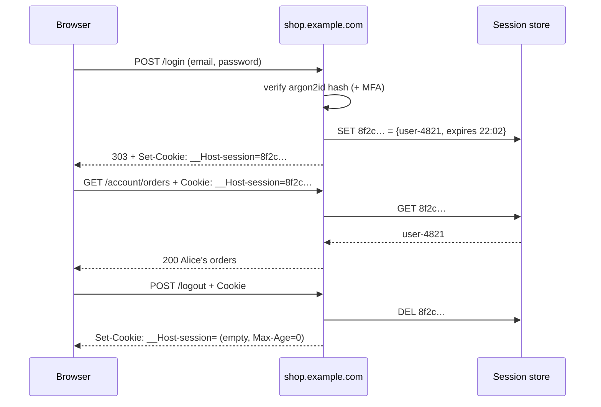
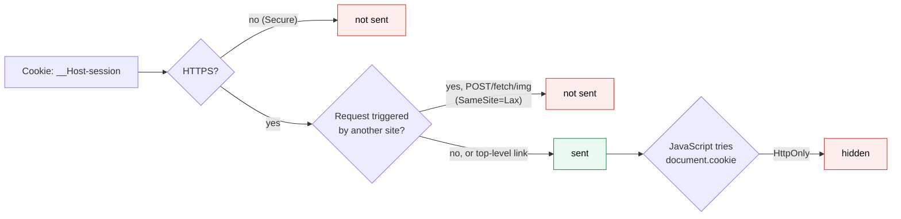
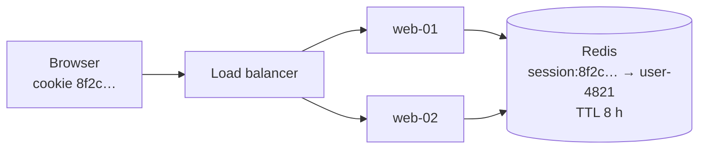
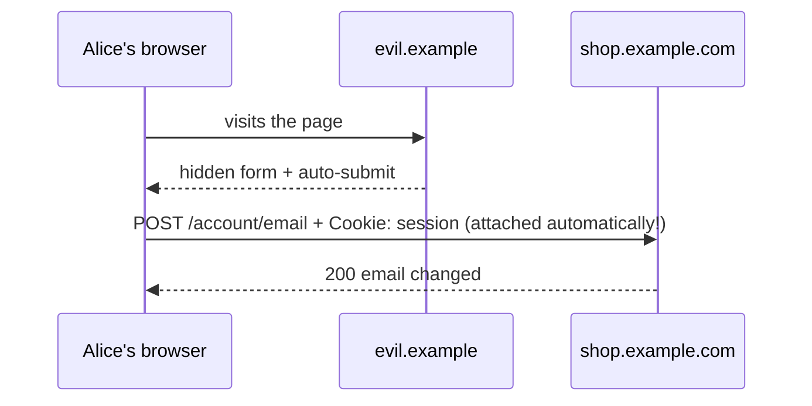

# Session authentication

> [!abstract] In one sentence
> The user logs in **once** with a password (and MFA (multi-factor authentication)), the server creates a **session** (a record "session 8f2c… = user-4821, expires 18:00") in a store, and hands the browser only a long **random session ID (identifier)** in a cookie that the browser sends back automatically on every request; the server looks the ID up to know who's calling, can kill it instantly, but must protect the cookie (`HttpOnly`, `Secure`, `SameSite`) and defend against CSRF because the browser attaches it to requests no matter which site triggered them.

## Build-up: logging customers into the shop website

Customers log in on `https://shop.example.com` to see their orders. [[Basic and Digest authentication]] is ruled out (popup, password on every request, no logout, no MFA).

### Stage 1: log in once, remember the result

The login is an ordinary HTML (HyperText Markup Language) form:

```http
POST /login HTTP/1.1
Host: shop.example.com
Content-Type: application/x-www-form-urlencoded

email=alice%40example.com&password=S3cret%21pass
```

The server verifies the password against its argon2id hash (see [[Authentication and authorization#Stage 5: storing passwords (if I must)]]). Then, instead of asking for the password again, it creates a **session**:

1. Generate a **session ID**: 128+ bits from a cryptographically secure random generator, e.g. `8f2c6a91d4e07b35c1a9e2f04d7b6c18`
2. Store `8f2c… → {user: user-4821, created: 14:02, last_seen: 14:02, ip: 203.0.113.7, mfa: true}` in a **session store**
3. Send the ID to the browser in a cookie:

```http
HTTP/1.1 303 See Other
Location: /account
Set-Cookie: __Host-session=8f2c6a91d4e07b35c1a9e2f04d7b6c18; Path=/; Secure; HttpOnly; SameSite=Lax; Max-Age=28800
```

From now on, the browser adds the cookie to every request to `shop.example.com`, without any code:

```http
GET /account/orders HTTP/1.1
Host: shop.example.com
Cookie: __Host-session=8f2c6a91d4e07b35c1a9e2f04d7b6c18
```



The ID **means nothing by itself**: it's a reference into the store. Guessing one is hopeless (2¹²⁸ possibilities), and the user's data never leaves the server.

With curl, a cookie jar plays the browser:

```bash
curl -c jar.txt -d 'email=alice@example.com&password=S3cret!pass' https://shop.example.com/login
curl -b jar.txt https://shop.example.com/account/orders
```

### Stage 2: protecting the cookie (flags)

The session ID is now as good as the password for the session's lifetime. The cookie attributes decide who can read and send it:

| Attribute             | Effect                                                                                                                             | Why                                                                                                                                              |
| --------------------- | ---------------------------------------------------------------------------------------------------------------------------------- | ------------------------------------------------------------------------------------------------------------------------------------------------ |
| `Secure`              | Only sent over HTTPS (Hypertext Transfer Protocol Secure)                                                                          | Never leaks on a plain HTTP (Hypertext Transfer Protocol) request                                                                                |
| `HttpOnly`            | Invisible to JavaScript (`document.cookie`)                                                                                        | An XSS (cross-site scripting) bug can't **read** and exfiltrate it                                                                               |
| `SameSite=Lax`        | Not sent on cross-site sub-requests (images, forms POSTed from other sites, fetch), sent on top-level navigation (clicking a link) | Blocks most CSRF (Stage 4). `Strict`: never cross-site, even links. `None`: always (requires `Secure`), for legitimate cross-site use            |
| `Max-Age` / `Expires` | When the browser drops it                                                                                                          | Without it: a "session cookie" deleted when the browser closes (browsers that restore sessions keep it anyway)                                   |
| `Domain`              | Which hosts receive it                                                                                                             | **Omit it**: then only the exact host gets it. `Domain=example.com` would send it to every subdomain, including a compromised `blog.example.com` |
| `Path`                | URL (Uniform Resource Locator) prefix                                                                                              | Not a security boundary                                                                                                                          |
| `__Host-` prefix      | The browser only accepts the cookie if `Secure`, `Path=/` and **no** `Domain`                                                      | Stops subdomains from planting or overwriting it                                                                                                 |



### Stage 3: the second server

Traffic grows; a [[Load balancing|load balancer]] spreads requests over `web-01` and `web-02`. Sessions were stored **in web-01's memory**: half the requests land on web-02, which has never heard of `8f2c…`, and Alice is logged out at random.

| Fix | How | Downside |
|---|---|---|
| Sticky sessions | The LB sends each client to the same server (cookie-based stickiness) | A server restart or scale-in logs its users out; uneven load |
| **Shared session store** | Redis/Memcached/database reachable by all servers | One more component to run and keep available; a lookup per request (~1 ms on Redis) |
| Client-side signed sessions | The whole session data in the cookie, **signed** (HMAC (hash-based message authentication code)) so it can't be tampered with (Flask, Rails default) | No server-side revocation; cookie size limits (~4 KB (kilobytes)); data visible unless encrypted |



A shared store with a **TTL (time to live)** per key is the usual answer: the session expires by itself, and logout is a `DEL`.

```bash
redis-cli GET session:8f2c6a91d4e07b35c1a9e2f04d7b6c18
# "{\"user\":\"user-4821\",\"mfa\":true,\"created\":1791100920}"
redis-cli TTL session:8f2c6a91d4e07b35c1a9e2f04d7b6c18
# (integer) 28512
```

### Stage 4: the attack that cookies invite (CSRF)

The browser attaches cookies to **every** request to `shop.example.com`, **whoever triggered it**. An attacker's page `evil.example` contains:

```html
<form action="https://shop.example.com/account/email" method="POST">
  <input type="hidden" name="email" value="attacker@evil.example">
</form>
<script>document.forms[0].submit()</script>
```

If Alice is logged in and visits that page, her browser POSTs to the shop **with her session cookie**: her account email changes, then the attacker resets the password. That's **Cross-Site Request Forgery**. The attacker never sees the cookie; they make the browser use it.



Defenses, layered:
1. **`SameSite=Lax`**: the cross-site POST goes out **without** the cookie. Chrome treats cookies without the attribute as `Lax`, but not every browser does, so set it explicitly
2. **CSRF tokens**: every form includes a random value tied to the session; the server rejects state-changing requests without the right token. `evil.example` can't read it (same-origin policy)
3. **Check `Origin` / `Sec-Fetch-Site`** headers on state-changing requests
4. Never change state on `GET`

CSRF is specific to **automatically attached** credentials (cookies, Basic auth cached by the browser, client certificates). A token the app adds to an `Authorization` header by code isn't sent by a forged form, which is one reason APIs (application programming interfaces) use headers.

### Stage 5: session lifecycle

| Event                                                     | What to do                                                             | Why                                                                                                                                       |
| --------------------------------------------------------- | ---------------------------------------------------------------------- | ----------------------------------------------------------------------------------------------------------------------------------------- |
| Login succeeds                                            | **Issue a new session ID** (never reuse one that existed before login) | **Session fixation**: an attacker who planted a known ID in the victim's browser before login would otherwise share the logged-in session |
| Privilege change (MFA done, role change, password change) | Rotate the ID again; on password change, **delete all other sessions** | Old stolen IDs stop working                                                                                                               |
| Idle                                                      | **Idle timeout** (e.g. 30 min for admin, days for a shop)              | Abandoned sessions die                                                                                                                    |
| Always                                                    | **Absolute timeout** (e.g. 8 h, 30 days with "remember me")            | Even an active stolen session ends                                                                                                        |
| Logout                                                    | **Delete the session server-side**, then clear the cookie              | Clearing only the cookie leaves the ID valid if it was copied                                                                             |
| Sensitive action                                          | **Step-up**: ask for the password/MFA again                            | A borrowed laptop can't change the email                                                                                                  |

The superpower of stateful sessions: a list of active sessions ("Logged in on Firefox, Lyon, 2 hours ago") with a **revoke** button that works **instantly**. Stateless tokens can't do that easily (see [[JWT and bearer tokens#Stage 6: the price of statelessness (revocation)]]).

### Stage 6: when sessions get awkward

| Client | Problem with cookies |
|---|---|
| Mobile app | No browser cookie handling by default; tokens in secure storage are simpler |
| API used by partners or scripts | Cookies + CSRF tokens are clumsy outside browsers |
| SPA (single-page application) on `app.example.com` calling `api.example.com` | Cross-origin cookies need `SameSite=None`, `credentials: 'include'` and precise CORS (Cross-Origin Resource Sharing) headers; third-party cookie blocking can break it |
| Many services behind one login | Each service needs the session store, or a token it can verify alone |

The common modern pattern for browser apps is the **BFF** (backend for frontend): the browser keeps a plain session cookie with a server-side component on the same site, and that component holds the OAuth/OIDC (OIDC: OpenID Connect) tokens and calls the APIs. Tokens never reach JavaScript ([[Access and refresh tokens#Stage 4: where to keep the tokens]]).

## Advanced problems

### 1. Users logged out at random

Sessions in local memory behind a load balancer, or the session store evicting keys under memory pressure (Redis `maxmemory-policy allkeys-lru` drops sessions first). Use a shared store with a `volatile-*` or `noeviction` policy and enough memory, and monitor evictions.

### 2. Cookie not sent at all

`Secure` cookie on an HTTP URL (often a proxy forwarding HTTP to the app, which then builds `http://` redirects), `SameSite=Strict` on an OAuth (Open Authorization) redirect back from another site, `Domain` mismatch, or the app on a different site than the cookie. Check the browser's devtools (Application → Cookies, and the "blocked" reason on the request).

### 3. Session hijacking through XSS despite HttpOnly

`HttpOnly` stops reading the cookie, but injected script can still **make requests** from the victim's page, which carry the cookie. XSS is game over for that session; output encoding and a Content Security Policy are the real fix.

### 4. Login loop after deploying behind a proxy

The app thinks it's on HTTP (TLS (Transport Layer Security) terminated at the proxy), sets cookies without `Secure` or redirects to `http://`, the browser drops or refuses them. Trust `X-Forwarded-Proto` from the proxy (see [[Reverse proxy]]).

## In AWS
- **ElastiCache** (Redis/Valkey) or DynamoDB with TTL are the usual shared session stores
- ALB (Application Load Balancer) has **sticky sessions** (duration-based or application cookie) for apps that keep sessions in memory, with the downsides above
- ALB's built-in **OIDC/Cognito authentication** is session-based: after login, ALB keeps an encrypted session cookie (`AWSELBAuthSessionCookie`) and passes the user's claims to targets in headers

## Practice

> [!example]- Why is a random session ID safe to put in a cookie, but `user=4821` is not?
> The random ID is an unguessable reference to server-side data. `user=4821` can be edited by the client to impersonate anyone (unless signed).

> [!example]- What do HttpOnly, Secure and SameSite each protect against?
> HttpOnly: JavaScript reading the cookie (XSS theft). Secure: sending it over plain HTTP. SameSite: sending it on cross-site requests (CSRF).

> [!example]- Why must a new session ID be issued at login?
> Session fixation: an ID set before login could be known to an attacker who planted it.

> [!example]- Two web servers behind a load balancer, users randomly logged out. Cause and fix?
> Sessions in each server's memory. Use a shared session store (Redis) or, as a stopgap, sticky sessions.

> [!example]- Why don't APIs using `Authorization: Bearer` headers need CSRF tokens?
> The header is added by the app's code; the browser never attaches it automatically to forged cross-site requests.

> [!example]- Logout only deletes the cookie. What's the risk?
> A copied session ID stays valid on the server until it expires.

## Easy to get wrong
- Predictable session IDs (counters, timestamps, `Math.random()`)
- Keeping the same session ID across login
- Logout without deleting the server-side session
- `Domain=example.com` on the session cookie
- Missing `HttpOnly`/`Secure`/`SameSite`
- State changes on GET
- Thinking HttpOnly makes XSS harmless
- Sessions in local memory behind a load balancer

## Related
- Concepts first:: [[Authentication and authorization]]
- Before (password on every request):: [[Basic and Digest authentication]]
- The stateless alternative:: [[JWT and bearer tokens]], [[Access and refresh tokens]]
- Across many apps:: [[Single sign-on]]
- Infrastructure:: [[Load balancing]], [[Reverse proxy]], [[HTTP]]
- Area:: [[Identity and access]]

## Flashcards
#flashcards

What is a session ID? :: A long random reference to server-side session data, stored in a cookie
How long should a session ID be? :: At least 128 bits from a cryptographically secure generator
What does HttpOnly do? :: Hides the cookie from JavaScript
What does Secure do? :: Sends the cookie only over HTTPS
SameSite Lax vs Strict vs None? :: Lax: not on cross-site sub-requests, yes on top-level links. Strict: never cross-site. None: always (needs Secure)
What does the __Host- cookie prefix enforce? :: Secure, Path=/, no Domain attribute
Why omit the Domain attribute on session cookies? :: So only the exact host receives it, not every subdomain
What is CSRF? :: Another site makes the browser send a state-changing request that automatically carries the victim's cookies
CSRF defenses? :: SameSite cookies, CSRF tokens, Origin/Sec-Fetch-Site checks, no state changes on GET
What is session fixation? :: An attacker plants a known session ID before login and shares the session after; fix by issuing a new ID at login
Idle vs absolute session timeout? :: Idle: ends after inactivity. Absolute: ends after a fixed time regardless of activity
Main advantage of server-side sessions over JWTs (JSON Web Tokens; JSON: JavaScript Object Notation)? :: Instant revocation (delete from the store)
How do several web servers share sessions? :: A shared store (Redis) with TTLs, or sticky sessions as a stopgap
What is a signed cookie session? :: Session data stored in the cookie itself with an HMAC; no store, but no server-side revocation
What is the BFF pattern? :: A same-site backend keeps tokens and gives the browser only a session cookie
