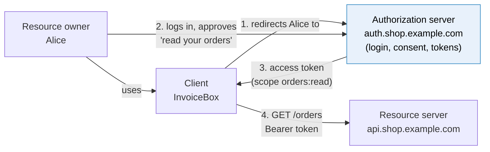
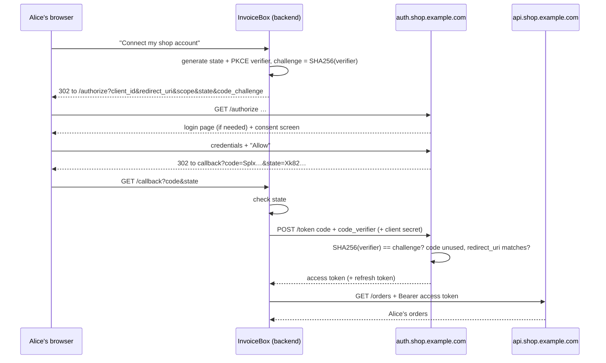
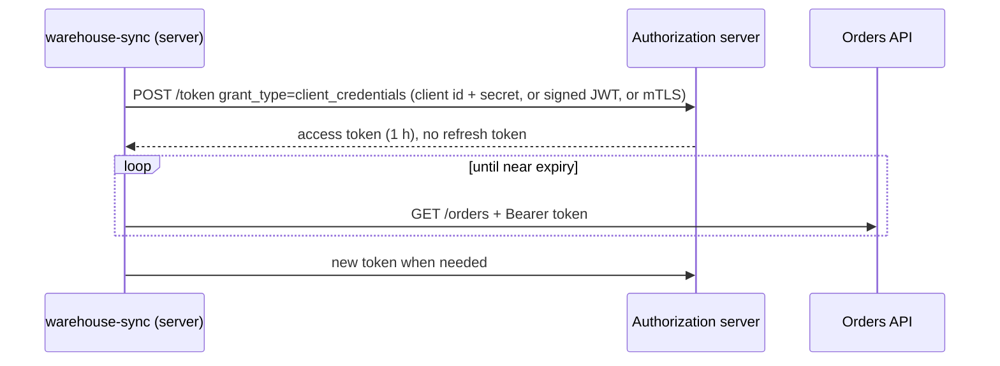
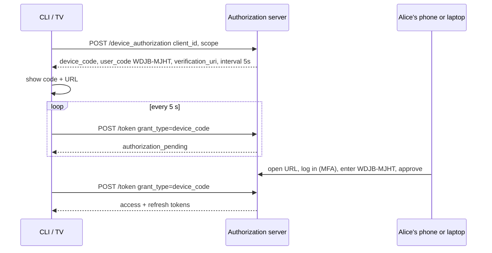

# OAuth 2.0

> [!abstract] In one sentence
> OAuth (Open Authorization) 2.0 is a framework for **delegated authorization**: instead of giving a third-party app their password, a user is redirected to the **authorization server** they trust, logs in there, approves a limited set of **scopes**, and the app receives an **access token** (plus maybe a refresh token) that lets it call the **resource server** on the user's behalf, for exactly those scopes, revocable at any time; the main flows are **authorization code + PKCE** (apps with a user), **client credentials** (machines), and **device code** (TVs (televisions) and CLIs (command-line interfaces)).

## Build-up: a third-party app wants Alice's orders

"InvoiceBox", a separate company's app, prints nice invoices and tracks expenses. Alice wants it to read her orders from the shop. The shop runs an authorization server at `auth.shop.example.com` and its API (application programming interface) at `api.shop.example.com`.

### Stage 1: the password anti-pattern

The naive way: InvoiceBox asks Alice for her shop email and password, stores them, and logs in as her.

| Problem | Consequence |
|---|---|
| InvoiceBox holds her **password** | It can do **everything** Alice can: change her address, place orders, delete the account |
| No limits | Can't say "read orders only" |
| No independent revocation | To stop InvoiceBox, Alice must change her password, which breaks every other app she gave it to |
| InvoiceBox gets breached | Her password leaks, and probably works on other sites |
| MFA (multi-factor authentication) breaks it | The app can't type her TOTP (time-based one-time password) code |
| The shop can't tell | Requests from InvoiceBox look like Alice herself |

OAuth's whole design is to give the app **a limited key instead of the master key**.

### Stage 2: the four roles



| Role | Who | Job |
|---|---|---|
| **Resource owner** | Alice | Owns the data, grants access |
| **Client** | InvoiceBox (registered with the shop: `client_id`, redirect URIs (Uniform Resource Identifiers), maybe a secret) | Wants access on Alice's behalf |
| **Authorization server** | `auth.shop.example.com` | Authenticates Alice, shows consent, issues tokens |
| **Resource server** | `api.shop.example.com` | Accepts tokens, enforces scopes |

Alice's password is only ever typed **on the authorization server's own page**. InvoiceBox never sees it.

### Stage 3: the authorization code flow, step by step

InvoiceBox registered beforehand and got `client_id=invoicebox` with redirect URI `https://invoicebox.example/callback`.

**Step 1. The app sends Alice to the authorization server** (a browser redirect):

```text
https://auth.shop.example.com/authorize
  ?response_type=code
  &client_id=invoicebox
  &redirect_uri=https://invoicebox.example/callback
  &scope=orders:read
  &state=Xk82jqP1                      ← random, tied to Alice's session at InvoiceBox (CSRF protection)
  &code_challenge=E9Melhoa2OwvFrEMTJguCHaoeK1t8URWbuGJSstw-cM
  &code_challenge_method=S256          ← PKCE (Stage 4)
```

**Step 2. Alice logs in at the shop** (password, MFA, or she's already logged in there) and sees a **consent screen**: "InvoiceBox wants to: read your orders. Allow / Deny".

**Step 3. The authorization server redirects back** with a short-lived, single-use **authorization code**:

```text
https://invoicebox.example/callback?code=SplxlOBeZQQYbYS6WxSbIA&state=Xk82jqP1
```

InvoiceBox checks `state` matches what it generated. (Otherwise an attacker could inject their own code and link the attacker's shop account to Alice's InvoiceBox session.)

**Step 4. InvoiceBox's backend exchanges the code for tokens**, server to server, over a back channel:

```bash
curl -s https://auth.shop.example.com/oauth2/token \
  -u 'invoicebox:client-secret-from-registration' \
  -d grant_type=authorization_code \
  -d code=SplxlOBeZQQYbYS6WxSbIA \
  -d redirect_uri=https://invoicebox.example/callback \
  -d code_verifier=dBjftJeZ4CVP-mB92K27uhbUJU1p1r_wW1gFWFOEjXk
# {"access_token":"eyJ…","token_type":"Bearer","expires_in":900,
#  "refresh_token":"rt_…","scope":"orders:read"}
```

**Step 5. InvoiceBox calls the API** with `Authorization: Bearer eyJ…`. The API checks the token and that its scope includes `orders:read`.



**Why two steps (code, then token) instead of returning the token in the redirect?** The redirect travels through the **browser**: URLs (Uniform Resource Locators) land in history, logs, `Referer` headers, and browser extensions can read them. A code alone is useless: it's single-use, expires in ~1 minute, and exchanging it requires the client's credentials and/or the PKCE verifier, over a direct TLS (Transport Layer Security) connection the browser never sees. The old **implicit flow** returned the token directly in the URL fragment; it's deprecated for exactly this reason.

### Stage 4: PKCE, for apps that can't keep a secret

**Confidential** clients (a backend server) can keep a `client_secret`. **Public** clients can't: a mobile app or SPA (single-page application) ships its code to users, so any embedded secret is public. Then what stops an attacker who intercepts the code (a malicious app registered for the same custom URL scheme on the phone, for example) from exchanging it?

**PKCE** (Proof Key for Code Exchange, "pixy"): the app makes up a random secret **per login**.

```bash
VERIFIER=$(openssl rand -base64 48 | tr -d '=+/' | cut -c1-64)
CHALLENGE=$(printf '%s' "$VERIFIER" | openssl dgst -sha256 -binary | openssl base64 -A | tr '+/' '-_' | tr -d '=')
```

1. `/authorize` carries only the **challenge** (the SHA-256 (SHA: Secure Hash Algorithm) hash)
2. `/token` must present the **verifier** (the original)
3. The server checks `SHA256(verifier) == challenge`

An interceptor gets the code but not the verifier, which never left the app. PKCE is now recommended for **all** clients, confidential ones included (OAuth 2.1 makes it mandatory).

### Stage 5: scopes and consent

Scopes are strings the API defines: `orders:read`, `orders:write`, `profile`, `offline_access`. The token carries the granted ones; the resource server enforces them.

| Design point | Why |
|---|---|
| Scopes are coarse **permissions for the app**, not the user's permissions | The token can never exceed what Alice herself may do; the API still checks object ownership |
| Ask for the **minimum** | Users deny scary consent screens, and smaller grants limit damage |
| Users can see and **revoke** grants | "Connected apps" page → deleting the grant kills its refresh tokens |
| First-party apps can skip consent | The shop's own mobile app doesn't ask "allow Shop to access Shop?" |

### Stage 6: no user at all (client credentials)

The warehouse's server pulls orders every 5 minutes. No human, nobody to redirect. The **client credentials** grant: the client authenticates **as itself** and gets a token for its own identity:

```bash
curl -s https://auth.shop.example.com/oauth2/token \
  -u 'warehouse-sync:7Gq…secret' \
  -d grant_type=client_credentials \
  -d scope=orders:read
# {"access_token":"eyJ…","token_type":"Bearer","expires_in":3600}
```



Compared with an [[API keys|API key]], the long-lived secret only goes to the token endpoint; APIs see tokens that expire within an hour. Stronger client authentication replaces the shared secret with a **signed JWT (JSON Web Token; JSON: JavaScript Object Notation) assertion** (`private_key_jwt`) or **mTLS (mutual TLS)** ([[mTLS]]).

### Stage 7: devices without a browser (device code)

A smart TV, or a CLI on a server over SSH (Secure Shell): no browser to redirect, typing a password on a remote is miserable. The **device authorization grant**:

```text
$ shop-cli login
To sign in, open https://auth.shop.example.com/device and enter the code:  WDJB-MJHT
Waiting for approval…
```



Every `aws sso login`, `gh auth login`, `az login --use-device-code` works like this. (It's also abused for phishing: "enter this code at microsoft.com/devicelogin" makes a victim approve an attacker's device. Approval screens should say clearly what's being authorized.)

### Stage 8: which grant, and what's retired

| Grant | For | Status |
|---|---|---|
| **Authorization code + PKCE** | Any app acting for a user: web, mobile, SPA, desktop | The default |
| **Client credentials** | Machine-to-machine, no user | Current |
| **Device code** | Input-constrained devices, CLIs | Current |
| **Refresh token** | Getting new access tokens ([[Access and refresh tokens]]) | Current |
| Implicit | Old SPAs: token in the URL fragment | **Deprecated** (token leaks, no refresh, no PKCE) |
| Resource owner password | App collects the user's password and posts it to `/token` | **Deprecated**: the password anti-pattern with extra steps |

**OAuth 2.1** (in progress) mostly codifies this: PKCE everywhere, no implicit, no password grant, exact redirect URI matching, refresh token rotation or binding for public clients.

### Stage 9: OAuth is not login

A tempting shortcut: "Log in with the shop" = run the OAuth flow, get an access token, call `/me`, log the user in as whoever it says. Problems:
- The access token is meant for the **API**, not for the client: it says nothing reliable about **who** logged in, **when**, or **for which app**
- A token obtained by a **different** app (for the same user) can be replayed into my app's login, and I'd accept it: the attacker logs in as the victim
- Every provider invented its own `/me` endpoint and fields

Authentication on top of OAuth was standardised as **[[OpenID Connect]]**: an **ID (identifier) token** issued **to the client**, with audience, nonce, auth time and standard claims.

## Advanced problems

### 1. Redirect URI tricks

If the authorization server accepts loosely matching redirect URIs (prefix match, wildcard subdomains), an attacker crafts `redirect_uri=https://invoicebox.example.evil.example/` or uses an **open redirect** on the client's site to get the code delivered to them. Exact string matching of pre-registered URIs is the fix.

### 2. `invalid_grant` on the token exchange

The code was already used (a page reload, a double-submit), expired (codes live ~1 minute), the `redirect_uri` differs by a character (trailing slash, `http` vs `https`), or the PKCE verifier doesn't match the challenge. Read the `error_description`.

### 3. Consent phishing

A malicious app registered on a big IdP (identity provider) asks for broad scopes ("read all your mail") with a convincing name. The user consents; no password is stolen, but the app has a token. Defenses: admin consent policies, verified publishers, reviewing granted apps.

### 4. The mobile app's client secret

A secret embedded in a mobile app is public. Treat mobile apps as public clients: PKCE, no secret, refresh token rotation, and use the system browser (ASWebAuthenticationSession / Custom Tabs), never an embedded WebView that lets the app watch the password being typed.

## In AWS
- **Amazon Cognito** user pools are an OAuth 2.0 / OIDC authorization server (hosted login UI (user interface), authorization code + PKCE, client credentials with resource servers and custom scopes)
- **API Gateway** JWT authorizers enforce scopes from OAuth access tokens; ALB (Application Load Balancer) can run the authorization code flow itself in front of targets
- [[AWS Identity Center]]'s `aws sso login` is the **device authorization grant**

## Practice

> [!example]- Why does the authorization code flow return a code instead of the token in the redirect?
> The redirect passes through the browser (history, logs, extensions). The code is single-use, short-lived, and needs the client's credentials or PKCE verifier to exchange over a direct back channel.

> [!example]- What does the `state` parameter protect against?
> CSRF (Cross-Site Request Forgery) on the callback: an attacker injecting their own authorization code into the victim's session.

> [!example]- How does PKCE protect a public client?
> The app sends a hash (challenge) at authorize time and the original (verifier) at token time; an attacker who intercepts the code doesn't have the verifier.

> [!example]- Which grant for a nightly job syncing orders between two companies' servers?
> Client credentials: no user involved, the job authenticates as itself.

> [!example]- How does `aws sso login` authenticate when run on a remote server?
> The device authorization grant: it shows a code and URL, the user approves on another device, the CLI polls the token endpoint.

> [!example]- Why isn't an OAuth access token enough to log a user into my app?
> It's meant for an API, not for my client: it may have been issued to another app and says nothing reliable about the authentication event. Use an OIDC ID token.

## Easy to get wrong
- Calling OAuth an authentication protocol
- Implicit flow or password grant in new apps
- Skipping `state` or PKCE
- Loose redirect URI matching, open redirects on the client
- Client secrets in mobile apps or SPAs
- Embedded WebViews for login
- Over-broad scopes
- Thinking scopes replace object-level authorization in the API

## Related
- Concepts first:: [[Authentication and authorization]]
- Tokens it issues:: [[Access and refresh tokens]], [[JWT and bearer tokens]]
- Authentication on top:: [[OpenID Connect]]
- Machine alternatives:: [[API keys]], [[mTLS]], [[Workload identity (SPIFFE)]]
- Across a company:: [[Single sign-on]]
- Area:: [[Identity and access]]

## Flashcards
#flashcards

What problem does OAuth 2.0 solve? :: Delegated authorization: an app gets limited, revocable access to a user's resources without their password
OAuth's four roles? :: Resource owner, client, authorization server, resource server
Steps of the authorization code flow? :: Redirect to /authorize, user logs in and consents, redirect back with code, back-channel code exchange at /token, call API with access token
What does the state parameter do? :: Binds the callback to the user's session, preventing CSRF/code injection
Why is the authorization code safe to send through the browser? :: Single-use, ~1 minute, useless without client credentials or the PKCE verifier
What is PKCE? :: Client sends SHA-256(verifier) at /authorize and the verifier at /token, so an intercepted code can't be redeemed
Confidential vs public client? :: Confidential can keep a secret (server); public can't (mobile, SPA, desktop)
What is the client credentials grant? :: A machine client authenticates as itself at /token to get an access token, no user
What is the device authorization grant? :: A device shows a user code; the user approves on another device; the device polls /token
Which OAuth grants are deprecated? :: Implicit and resource owner password credentials
What are scopes? :: Strings naming the permissions granted to the client, enforced by the resource server
Why is OAuth alone not authentication? :: Access tokens are for APIs, not proof of who logged into the client; OIDC adds the ID token
How should redirect URIs be validated? :: Exact match against pre-registered URIs
Why use the system browser for mobile OAuth? :: Embedded WebViews let the app see credentials and break SSO
What does OAuth 2.1 change? :: PKCE mandatory, no implicit or password grants, exact redirect matching, safer refresh tokens
