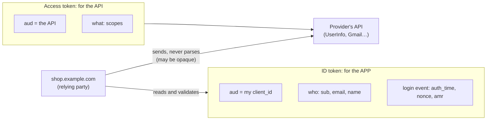
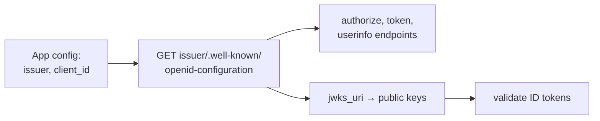
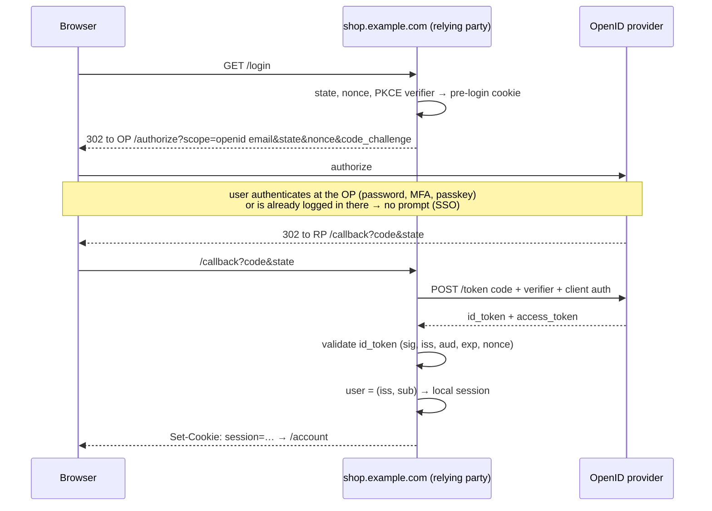

# OpenID Connect

> [!abstract] In one sentence
> OpenID Connect (OIDC) is a thin **authentication layer on top of OAuth (Open Authorization) 2.0**: the app runs the authorization code flow with the `openid` scope and receives, besides the access token, an **ID token**, a signed JWT (JSON Web Token) issued **to the app itself** that says *who* the user is (`sub`), *who* vouches for it (`iss`), *for which app* (`aud`), *when* they authenticated and *how*, plus standard discovery (`/.well-known/openid-configuration`) and keys (JWKS (JSON Web Key Set)), so any app can "log in with" any compliant provider the same way, and so can machines like CI (continuous integration) pipelines.

## Build-up: "Log in with…" for the shop

The shop wants customers to log in with their Google account instead of yet another password, and staff to log into internal tools with the company's identity provider. [[OAuth 2.0]] is the obvious building block, but [[OAuth 2.0#Stage 9: OAuth is not login|OAuth isn't login]].

### Stage 1: what OAuth was missing

| Need for login | OAuth 2.0 alone | OIDC |
|---|---|---|
| Who is the user? | Call some provider-specific `/me` API (application programming interface) | **ID token** with a standard `sub` |
| Was this token issued **for my app**? | Access tokens have the **API** as audience; may come from another app | ID token `aud` = **my `client_id`** |
| Is this response fresh, for **this** login attempt? | No standard | **`nonce`** echoed in the ID token |
| When and how did they authenticate (MFA (multi-factor authentication)?) | No | `auth_time`, `amr`, `acr` |
| Standard profile fields | Every provider different | `email`, `name`, `picture`… standard claims |
| Where are the endpoints and keys? | Read each provider's docs | **Discovery document** + JWKS |

### Stage 2: the ID token

The flow is the authorization code flow, with `openid` in the scope:

```text
https://accounts.google.com/o/oauth2/v2/auth
  ?response_type=code
  &client_id=1234-shop.apps.googleusercontent.com
  &redirect_uri=https://shop.example.com/auth/callback
  &scope=openid%20email%20profile
  &state=Xk82jqP1
  &nonce=n-0S6_WzA2Mj                ← random, stored in the user's pre-login session
  &code_challenge=…&code_challenge_method=S256
```

The token response now includes an `id_token`:

```json
{
  "access_token": "ya29.a0Af…",
  "id_token": "eyJhbGciOiJSUzI1NiIsImtpZCI6ImM3ZTA0…",
  "expires_in": 3599,
  "token_type": "Bearer",
  "scope": "openid email profile"
}
```

Decoded payload of the ID token:

```json
{
  "iss": "https://accounts.google.com",
  "sub": "110169484474386276334",
  "aud": "1234-shop.apps.googleusercontent.com",
  "iat": 1791100800,
  "exp": 1791104400,
  "nonce": "n-0S6_WzA2Mj",
  "auth_time": 1791100790,
  "email": "alice@example.com",
  "email_verified": true,
  "name": "Alice Martin"
}
```



| | **ID token** | **Access token** |
|---|---|---|
| Audience | The **client** (my app) | The **resource server** (an API) |
| Answers | Who logged in, when, how | What the bearer may do |
| Format | Always a JWT | JWT or opaque, provider's choice |
| My app should | **Validate** it and create a session | Send it to the API, not interpret it |
| Send it to APIs? | **No** (wrong audience) | Yes |

Common mistakes go in both directions: apps sending ID tokens to their APIs as if they were access tokens, and apps "logging in" with an access token.

### Stage 3: validating the ID token

The shop's callback, after exchanging the code:

1. Verify the **signature** with the provider's key (JWKS, selected by `kid`, with the expected algorithm, see [[JWT and bearer tokens#Stage 3: verifying without a database]])
2. `iss` equals the provider's issuer exactly
3. `aud` contains **my** `client_id` (and `azp` if several audiences)
4. `exp` in the future, `iat` reasonable
5. `nonce` equals the one stored in this browser's pre-login session: proves the token was minted **for this login attempt** and isn't a replay
6. Optionally: `auth_time` recent enough, `acr`/`amr` show MFA if I required it

Then: find or create the local account by **`iss` + `sub`** (the stable, unique identifier), and start a **normal session** ([[Session authentication]]). The ID token's job is done; it's not a session token to keep sending.

> [!warning] Identify users by `iss` + `sub`, not email
> Emails change and get reassigned, and some providers let users set unverified emails. Linking accounts by email alone has led to account takeovers ("log in with provider X using the victim's address"). Use `sub` (scoped to `iss`), and only trust `email` when `email_verified` is true and the provider is authoritative for that domain.

### Stage 4: discovery, so apps configure themselves

Every OIDC provider publishes its configuration at a fixed path under the issuer URL (Uniform Resource Locator):

```bash
curl -s https://accounts.google.com/.well-known/openid-configuration | jq '{issuer, authorization_endpoint, token_endpoint, userinfo_endpoint, jwks_uri, scopes_supported, id_token_signing_alg_values_supported}'
```

```json
{
  "issuer": "https://accounts.google.com",
  "authorization_endpoint": "https://accounts.google.com/o/oauth2/v2/auth",
  "token_endpoint": "https://oauth2.googleapis.com/token",
  "userinfo_endpoint": "https://openidconnect.googleapis.com/v1/userinfo",
  "jwks_uri": "https://www.googleapis.com/oauth2/v3/certs",
  "scopes_supported": ["openid", "email", "profile"],
  "id_token_signing_alg_values_supported": ["RS256"]
}
```

A library given only the **issuer URL**, client ID and secret discovers the rest. Swapping Google for Okta, Entra ID, Keycloak or Cognito is a configuration change.



### Stage 5: scopes, claims and UserInfo

| Scope | Adds claims |
|---|---|
| `openid` | **Required**: makes it OIDC, returns an ID token with `sub` |
| `profile` | `name`, `given_name`, `family_name`, `picture`, `locale`… |
| `email` | `email`, `email_verified` |
| `address`, `phone` | Postal address, phone number |
| `offline_access` | A refresh token ([[Access and refresh tokens]]) |

Claims may be in the ID token or only available from the **UserInfo** endpoint, called with the access token:

```bash
curl -s -H "Authorization: Bearer $ACCESS_TOKEN" https://openidconnect.googleapis.com/v1/userinfo
# {"sub":"110169484474386276334","email":"alice@example.com","email_verified":true,"name":"Alice Martin"}
```

Enterprise providers add their own claims (`groups`, `roles`, `tenant`), which apps map to permissions.

### Stage 6: the full login, end to end



Note the "already logged in there" box: if Alice has a session at the provider, the second app she visits gets her through **without a prompt**. That's how OIDC delivers [[Single sign-on]].

### Stage 7: logging out

Two sessions now exist: the **app's** session and the **provider's** session.

| Mechanism | What it does |
|---|---|
| App logout only | Deletes the app's session. Clicking "log in" again silently logs her back in via the provider's session |
| **RP-initiated logout** | The app redirects to the provider's `end_session_endpoint` with `id_token_hint`: the provider session ends too |
| **Back-channel logout** | The provider calls each app's registered logout URL server-to-server with a signed **logout token**: apps delete matching sessions |
| Front-channel logout | The provider loads each app's logout URL in hidden iframes; fragile with third-party cookie blocking |

Single logout across many apps is genuinely hard; back-channel is the reliable option.

### Stage 8: OIDC for machines

The same signed-ID-token idea lets a **platform vouch for a workload**, removing long-lived secrets:

| Workload | Issuer | Trusted by |
|---|---|---|
| GitHub Actions job | `https://token.actions.githubusercontent.com`, `sub = repo:acme/shop:environment:production` | AWS (Amazon Web Services) IAM (Identity and Access Management) role trust policy ([[ECS production stack#Stage 0: the pipeline needs state and a way to log in]]), GCP (Google Cloud Platform), Azure, Vault |
| Kubernetes pod (service account) | The cluster's OIDC issuer | AWS IRSA (IAM Roles for Service Accounts) / EKS (Elastic Kubernetes Service) Pod Identity, GCP Workload Identity |
| GitLab CI job | GitLab's issuer | Clouds, Vault |

The pattern: the platform mints a short-lived JWT describing the workload, the cloud validates it against the platform's JWKS and its trust conditions, then exchanges it for temporary credentials. Same as [[Workload identity (SPIFFE)]] in spirit.

## OIDC vs SAML in one table

Both do enterprise SSO (details in [[Single sign-on]]):

| | OIDC | SAML (Security Assertion Markup Language) 2.0 |
|---|---|---|
| Built on | OAuth 2.0, JSON (JavaScript Object Notation), JWT | XML (Extensible Markup Language), XML Signature |
| Token | ID token (JWT) | Assertion (XML) |
| Good for | Web, mobile, SPAs (single-page applications), APIs, machines | Browser-based enterprise web apps |
| Discovery | `.well-known/openid-configuration` | Metadata XML exchanged by hand/URL |
| Age | 2014 | 2005 |

## Advanced problems

### 1. "Invalid nonce" or "state mismatch" on callback

The pre-login cookie holding state/nonce was lost: `SameSite=Strict` (blocked on the cross-site redirect back), a different host between login and callback (`www.` vs apex), multiple tabs overwriting one value, or a load balancer without shared session storage. Use `SameSite=Lax` for that cookie and key it per attempt.

### 2. ID token rejected: wrong audience

The app validates a token issued to another client ID (a mobile app's ID token sent to the web backend). Each client validates against its own `client_id`; for mobile → backend calls, send an **access token** for the backend's API instead.

### 3. Clock skew and expired keys

`iat` in the future or signature failures right after the provider rotated keys: NTP (Network Time Protocol), small leeway, JWKS cached with refresh on unknown `kid`.

### 4. Account takeover through email linking

Auto-linking a new OIDC login to an existing local account by matching `email`, with a provider that doesn't verify emails. Link by `iss` + `sub`, require `email_verified`, or ask the user to prove control of the existing account first.

## In AWS
- **Cognito** user pools are an OIDC provider (and can federate to Google, Apple, SAML or other OIDC IdPs); ALB (Application Load Balancer) listeners can run the OIDC flow in front of any target and pass claims in `x-amzn-oidc-*` headers
- IAM **OIDC identity providers** let AWS trust external issuers (GitHub, EKS, GitLab) for `AssumeRoleWithWebIdentity`
- [[AWS Identity Center]] can use an external IdP (Entra ID, Okta, Google Workspace) for workforce SSO, via SAML and SCIM (System for Cross-domain Identity Management)

## Practice

> [!example]- What does OIDC add to OAuth 2.0?
> The ID token (who logged in, for which client, when, how), the openid scope, standard claims, UserInfo, discovery and nonce.

> [!example]- ID token vs access token: which one does my app validate, and which one goes to the API?
> The app validates the ID token (audience = its client_id). The access token goes to the API.

> [!example]- Why must the app check `nonce`?
> To make sure the ID token was issued for this login attempt from this browser, not replayed or injected.

> [!example]- Why key local accounts on `iss` + `sub` instead of email?
> `sub` is stable and unique per issuer; emails change, get reused, or may be unverified, enabling takeovers.

> [!example]- A user logs out of the app, clicks login, and is back in without typing anything. Why?
> Their session at the OpenID provider is still active. Use RP-initiated logout to end it too.

> [!example]- How does a GitHub Actions job get AWS credentials without a stored secret?
> GitHub's OIDC issuer mints a JWT for the job; AWS validates it against GitHub's JWKS and the role's trust conditions (aud, sub), then returns temporary credentials.

## Easy to get wrong
- Logging in with an access token
- Sending ID tokens to APIs
- Skipping `nonce`, `aud` or `iss` checks
- Linking accounts by email
- Keeping the ID token as a session token
- Logging out of the app but not the provider
- Hardcoding endpoints instead of using discovery

## Related
- Built on:: [[OAuth 2.0]], [[JWT and bearer tokens]]
- Tokens around it:: [[Access and refresh tokens]]
- What it enables:: [[Single sign-on]]
- After login:: [[Session authentication]]
- Machines:: [[Workload identity (SPIFFE)]], [[ECS production stack]]
- In AWS:: [[IAM]], [[AWS Identity Center]]
- Area:: [[Identity and access]]

## Flashcards
#flashcards

What is OpenID Connect? :: An authentication layer on top of OAuth 2.0 that adds the ID token, standard claims, UserInfo and discovery
Which scope turns an OAuth flow into OIDC? :: openid
What is an ID token? :: A signed JWT issued to the client describing the authenticated user and the login event
ID token audience vs access token audience? :: ID token: the client (my app). Access token: the API
How must an app validate an ID token? :: Signature via JWKS, iss, aud = client_id, exp/iat, nonce, optionally auth_time/acr
What is the nonce for? :: Binds the ID token to this login attempt, preventing replay and injection
Stable user identifier in OIDC? :: iss + sub
Where is an OIDC provider's configuration? :: issuer/.well-known/openid-configuration
What is the UserInfo endpoint? :: An API returning user claims, called with the access token
What do auth_time and amr tell? :: When the user authenticated and with which methods (e.g. MFA)
What is a relying party? :: The app that relies on the OpenID provider for authentication
RP-initiated vs back-channel logout? :: RP-initiated: app redirects to the provider's end_session endpoint. Back-channel: provider notifies apps server-to-server with a logout token
How does OIDC enable SSO? :: An existing session at the provider lets other apps complete login without prompting
How do CI jobs use OIDC? :: The CI platform issues a JWT for the job; the cloud validates it and exchanges it for temporary credentials
OIDC vs SAML? :: OIDC: JSON/JWT on OAuth, web+mobile+APIs. SAML: XML assertions, browser-based enterprise SSO
