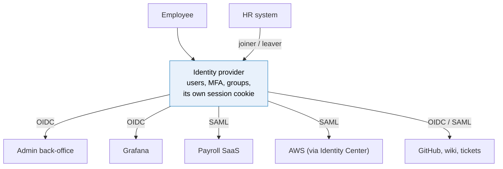
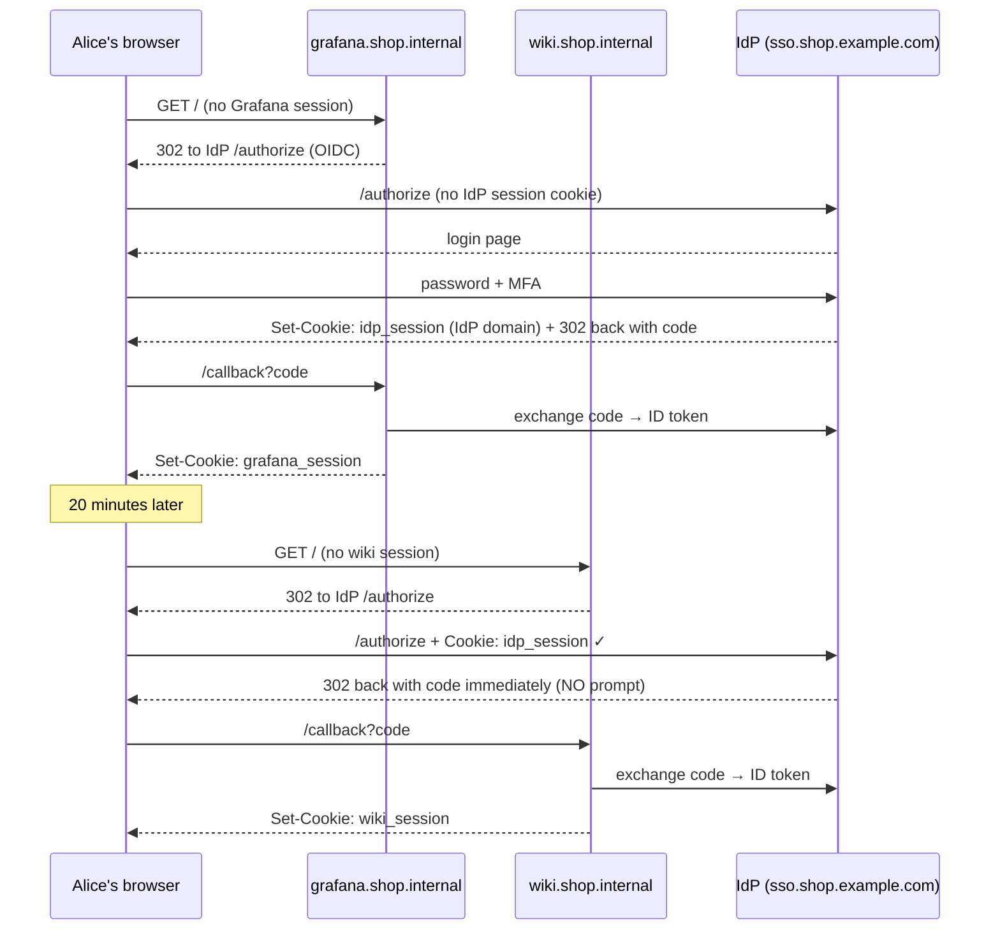
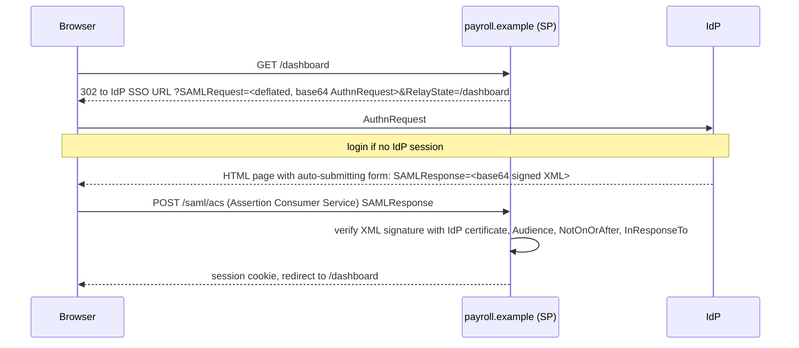
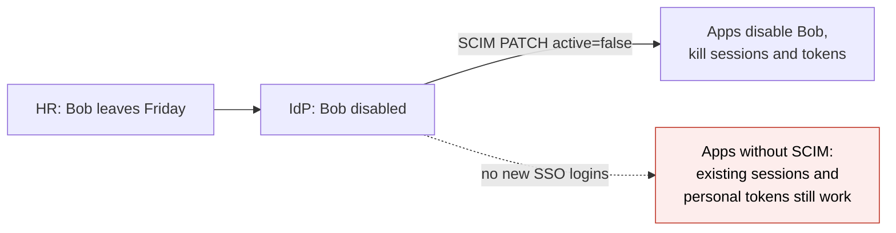

# Single sign-on

> [!abstract] In one sentence
> **Single sign-on** moves authentication out of every individual app into one **identity provider (IdP)**: the user logs in once at the IdP (with MFA), the IdP keeps its own session, and each app (**service provider** / relying party) redirects unauthenticated users there and receives a signed statement of who they are, via **OIDC** (JWT (JSON Web Token) ID (identifier) token) or **SAML (Security Assertion Markup Language)** (XML (Extensible Markup Language) assertion); one place to enforce MFA, disable a leaver, and audit logins, at the cost of making the IdP the most critical system in the company.

## Build-up: the shop's staff and their tools

Forty employees use: the admin back-office, Grafana, the ticketing system, the wiki, GitHub, the AWS (Amazon Web Services) console, and a payroll SaaS (software as a service).

### Stage 1: one password per app

| Problem | Cost |
|---|---|
| 7 passwords per person | Reused or written down; weakest app leaks the shared password |
| MFA | Enabled in some apps, not others; 7 different authenticator entries |
| Someone leaves | IT (information technology) must remember to disable 7 accounts. The forgotten one stays open for months |
| Audit | "Who logged into what last week?" needs 7 log sources |
| Every app stores passwords | 7 password databases to breach |

### Stage 2: one identity provider

All apps **delegate** authentication to one IdP (Okta, Microsoft Entra ID, Google Workspace, Keycloak, Authentik…), which holds the users, their passwords or passkeys, MFA, and groups.



| Term | Meaning |
|---|---|
| **IdP** (identity provider, OpenID Provider) | Authenticates users and vouches for them |
| **SP** (service provider, relying party, RP) | An app that trusts the IdP |
| **Federation** | The trust relationship between them: keys/certificates and endpoints exchanged once |
| **Assertion / ID token** | The signed statement the IdP hands the app |

### Stage 3: how "sign on once" actually works

The magic is two layers of sessions. Alice opens Grafana first, then the wiki:



- The **IdP session** (a cookie on the IdP's domain) is what makes it "single": the second app's redirect finds Alice already authenticated and returns instantly
- Each app still creates **its own session** afterwards ([[Session authentication]]); the IdP is only consulted when that session doesn't exist or expires
- MFA is enforced **once, at the IdP**, for everything

### Stage 4: the two main protocols

**OIDC** is covered in [[OpenID Connect]]: authorization code flow, JWT ID token. Preferred for anything new, and the only sane option for mobile apps and APIs (application programming interfaces).

**SAML 2.0** is older (2005), XML-based, and still everywhere in enterprise SaaS. The common SP-initiated flow with the HTTP-POST (HTTP: Hypertext Transfer Protocol) binding:



The core of the SAML response, the **assertion**:

```xml
<saml:Assertion ID="_a75adf55" IssueInstant="2026-10-04T08:00:00Z">
  <saml:Issuer>https://sso.shop.example.com</saml:Issuer>
  <ds:Signature>…</ds:Signature>
  <saml:Subject>
    <saml:NameID Format="urn:oasis:names:tc:SAML:1.1:nameid-format:emailAddress">alice@shop.example.com</saml:NameID>
    <saml:SubjectConfirmation Method="urn:oasis:names:tc:SAML:2.0:cm:bearer">
      <saml:SubjectConfirmationData InResponseTo="_req8812" NotOnOrAfter="2026-10-04T08:05:00Z"
                                    Recipient="https://payroll.example/saml/acs"/>
    </saml:SubjectConfirmation>
  </saml:Subject>
  <saml:Conditions NotBefore="2026-10-04T07:59:30Z" NotOnOrAfter="2026-10-04T08:05:00Z">
    <saml:AudienceRestriction><saml:Audience>https://payroll.example</saml:Audience></saml:AudienceRestriction>
  </saml:Conditions>
  <saml:AttributeStatement>
    <saml:Attribute Name="groups"><saml:AttributeValue>finance</saml:AttributeValue></saml:Attribute>
  </saml:AttributeStatement>
</saml:Assertion>
```

The same ideas as an ID token, in XML: issuer, subject, audience, validity window, a request ID to bind it to the login attempt (`InResponseTo` ≈ `nonce`), attributes (≈ claims), a signature.

| | SAML 2.0 | OIDC |
|---|---|---|
| Format | XML assertion, XML Signature | JSON (JavaScript Object Notation), JWT |
| Transport | Browser redirect + **auto-POST form** to the ACS URL (Uniform Resource Locator) | Redirect with a code + back-channel token request |
| Setup | Exchange **metadata XML** (entity ID, ACS URL, certificate) | Client ID/secret + issuer URL (discovery) |
| Mobile apps / APIs | Poor | Native |
| Typical | Enterprise SaaS, AWS IAM (Identity and Access Management) Identity Center, older apps | Modern apps, Kubernetes, CI (continuous integration), consumer "log in with" |
| Security pitfalls | XML signature wrapping, comment injection, certificate rollover | Weak validation (aud, nonce), see [[OpenID Connect]] |

**IdP-initiated** SAML (the user clicks a tile in the IdP portal, the IdP POSTs an unsolicited assertion) has no `InResponseTo` to bind against, so it's more exposed to replay and injection; SP-initiated is preferred.

Other SSO mechanisms worth recognising: **Kerberos** (Windows domains: log into the PC (personal computer) once, tickets open file shares and intranet sites, "integrated Windows authentication"), and legacy CAS (Central Authentication Service) or header-based SSO behind a proxy.

### Stage 5: getting accounts into apps (provisioning)

Authentication answers "who is this?". Apps also need an **account** with the right roles **before** or **at** first login, and must lose it when the person leaves.

| Approach | How | Leaver handling |
|---|---|---|
| **JIT** (just-in-time) provisioning | Account created at first SSO login from assertion attributes; roles from `groups` claims | Can't log in anymore (no IdP session), but the account and its API tokens may linger |
| **SCIM (System for Cross-domain Identity Management)** | The IdP pushes users and groups to the app over a REST (Representational State Transfer) API (`POST /scim/v2/Users`, `PATCH … active:false`) | **Deprovisioned immediately**: account disabled, sessions and tokens revoked by the app |
| Manual | Admin creates accounts | Forgotten |



The "SSO tax": many SaaS vendors put SSO and SCIM in their enterprise tier.

### Stage 6: the risks of putting everything in one basket

| Risk | Mitigation |
|---|---|
| **IdP down = nobody works** | A highly available IdP (SaaS SLAs (service-level agreements), or a clustered Keycloak), long-enough app sessions to ride out short outages |
| **IdP compromised = everything compromised** | Phishing-resistant MFA for everyone ([[Multi-factor authentication and passkeys]]), strict admin controls, monitoring of IdP admin changes |
| **Locked out of the IdP** | **Break-glass accounts**: a couple of local admin accounts per critical system (AWS root, the IdP itself), with hardware keys, stored offline, alarmed when used |
| Session lifetimes | Long IdP sessions = fewer prompts but a stolen cookie lasts longer; require re-authentication for admin apps |
| Logout | Ending the IdP session doesn't end app sessions unless back-channel logout or SCIM revocation is in place |

### Stage 7: SSO is not the same as…

| Thing | Difference |
|---|---|
| Same password everywhere ("synchronised passwords", LDAP (Lightweight Directory Access Protocol) bind in every app) | Each app still receives and checks the password; one weak app leaks it. SSO apps **never see** the password |
| Password manager | Still N passwords, just remembered for you |
| Social login | SSO with a consumer IdP (Google, Apple) for customers: same protocols (OIDC), different trust and account linking problems |
| Federation between companies | Company A's IdP trusted by company B's apps (B2B (business-to-business) SaaS, partner portals); same protocols, more paperwork |

## Advanced problems

### 1. SAML "invalid signature" after a certificate rollover

The IdP rotated its signing certificate; the SP still has the old one pinned from the metadata uploaded a year ago. Plan rollovers: publish the new certificate in metadata alongside the old, SPs that refresh metadata by URL pick it up, then switch signing.

### 2. "Assertion expired" or "not yet valid"

Clock skew between IdP and SP (assertions often valid for only 5 minutes). NTP (Network Time Protocol) on both sides; most SPs allow a small leeway.

### 3. Users loop between app and IdP

The app's session cookie isn't set or kept after the callback (`SameSite=Strict`, cookie domain mismatch, `Secure` cookie behind an HTTP-terminating proxy), so every request starts a new login. Same causes as in [[Session authentication#2. Cookie not sent at all]].

### 4. Leaver still has access

SSO blocks new logins, but the app had a long session, a personal API token, or a local password set before SSO was enforced. SCIM deprovisioning, short app sessions, and disabling non-SSO login methods once SSO is on.

## In AWS
- [[AWS Identity Center]] is AWS's workforce SSO: users from its own directory or an external IdP (SAML + SCIM from Entra ID, Okta, Google), permission sets mapped to accounts, and an SSO portal for the console and `aws sso login`
- IAM also supports direct **SAML federation** per account (older pattern) and OIDC providers for workloads
- **Cognito** federates customer logins to social and enterprise IdPs

## Practice

> [!example]- What makes the second app's login silent in SSO?
> The browser still has the IdP's session cookie, so the IdP returns an authorization code (or assertion) without prompting.

> [!example]- Map SAML pieces to OIDC: assertion, Audience, InResponseTo, AttributeStatement.
> ID token, aud, nonce, claims.

> [!example]- Why is SP-initiated SAML safer than IdP-initiated?
> The SP can bind the response to its own request (InResponseTo); unsolicited responses are easier to replay or inject.

> [!example]- A user left the company and was disabled in the IdP. How can they still access an app?
> An existing app session or personal token, or a local login. Use SCIM deprovisioning and short app sessions.

> [!example]- Why keep break-glass accounts if everything uses SSO?
> If the IdP is down, misconfigured or compromised, admins still need a way into critical systems.

## Easy to get wrong
- Thinking SSO removes app sessions (each app still has one)
- JIT provisioning without deprovisioning
- No break-glass access
- Leaving local passwords enabled after moving to SSO
- Pinning a SAML certificate with no rollover plan
- IdP-initiated SAML for sensitive apps
- Weak MFA at the IdP (it protects everything)

## Related
- Protocols:: [[OpenID Connect]], [[OAuth 2.0]]
- Concepts first:: [[Authentication and authorization]]
- After login:: [[Session authentication]]
- Protecting the IdP:: [[Multi-factor authentication and passkeys]]
- In AWS:: [[AWS Identity Center]], [[IAM]]
- Roadmap:: *[[Kerberos]]*, *[[LDAP and Active Directory]]*
- Area:: [[Identity and access]]

## Flashcards
#flashcards

What is single sign-on? :: Authentication delegated to one identity provider; one login (and MFA) gives access to many apps
IdP vs SP? :: IdP authenticates users and issues assertions/tokens; SP (relying party) is an app trusting it
What makes SSO "single"? :: The IdP's own session cookie lets later app logins complete without prompting
Does each app still have its own session with SSO? :: Yes, the IdP is consulted only when the app session is missing or expired
Two main SSO protocols? :: SAML 2.0 (XML assertions) and OpenID Connect (JWT ID tokens)
What is the SAML ACS URL? :: The Assertion Consumer Service endpoint where the browser POSTs the SAML response
What is SAML metadata? :: XML describing entity IDs, endpoints and certificates, exchanged to set up federation
SP-initiated vs IdP-initiated SAML? :: SP-initiated starts with an AuthnRequest and can be bound with InResponseTo; IdP-initiated sends unsolicited assertions
What is SCIM? :: A standard API for the IdP to create, update and deactivate users and groups in apps
JIT provisioning? :: Creating the app account at first SSO login from assertion attributes
What is a break-glass account? :: A local emergency admin account usable when the IdP is unavailable, tightly protected and monitored
Biggest risk of SSO? :: The IdP becomes a single point of failure and the highest-value target
How does Windows do SSO inside a domain? :: Kerberos tickets obtained at PC login
