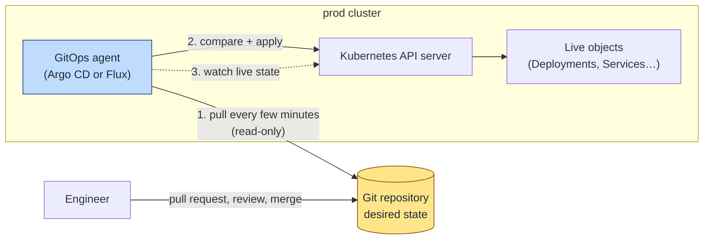
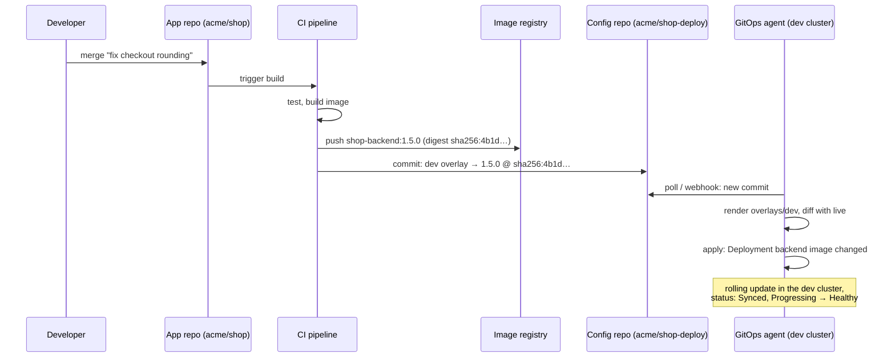

# GitOps basics

> [!abstract] In one sentence
> GitOps means the desired state of a system lives **declared in a Git repository**, and an **agent running next to the system pulls it and keeps reconciling** reality to match, so a deploy is a commit, a rollback is a revert, drift is undone automatically, and nobody (not even the pipeline) needs write credentials to the cluster.
>
> *Git: the version control system (not an acronym)*

## Plan of this note

Each stage exists because the one before it left a problem:

1. `kubectl apply` from a laptop → nobody knows what's running
2. A pipeline that pushes to the cluster → reviewed, but the pipeline holds the keys and nothing notices drift between runs
3. An agent **in the cluster** that pulls from Git → the core idea, and the four principles that define it
4. Where the manifests live (app repo vs config repo, Kustomize overlays)
5. How a new image version reaches prod (CI writes to Git, never to the cluster)
6. Drift, self-heal and pruning, and what the agent must *not* own
7. Rollback as `git revert`, and its limits
8. Secrets, which can't go in Git as they are
9. Many clusters, and rebuilding one from nothing
10. The two tools: Argo CD and Flux

Then GitOps outside Kubernetes, failure modes, and how AWS does it.

## Build-up: deploying the shop to Kubernetes

The shop from [[Kubernetes worked example]] runs in a Kubernetes cluster, namespace `shop`: a `backend` Deployment (image `registry.example.com/shop-backend`), a `frontend`, PostgreSQL in a StatefulSet. There are two clusters, `dev` and `prod`. The YAML (YAML Ain't Markup Language) manifests are written. The question of this note is **how a change to them reaches a cluster**, and how the team knows what is running there.

### Stage 1: kubectl from a laptop

The simplest way: an engineer with a kubeconfig for the cluster runs

```bash
kubectl config use-context prod
kubectl apply -f k8s/
kubectl set image deployment/backend backend=registry.example.com/shop-backend:1.5.0 -n shop
```

It works, and it's how everyone starts. Then the team grows and the problems appear:

- **What is running in prod?** The only honest answer is "ask the cluster". The repository says `1.4.0`, the cluster runs `1.5.0` because of that `set image`, and someone else's laptop has uncommitted changes they applied last week
- **Who changed what, and why?** The Kubernetes API (application programming interface) audit log says "user alice patched deployment backend". It doesn't say which ticket, and nobody reviewed it
- **Everyone holds cluster-admin credentials** on their laptop, for every environment
- **Hot fixes stay.** At 2 a.m. someone runs `kubectl edit` to raise a memory limit. It's never written back to the files, and the next `kubectl apply -f k8s/` silently undoes it (or worse, nobody applies for a month and the files are now fiction)
- **Deleted files don't delete anything.** Removing `old-worker.yaml` from the folder leaves the Deployment running forever: `kubectl apply` only creates and updates what it's given

### Stage 2: a pipeline pushes to the cluster

The first fix is the same one as for Terraform ([[Terraform in production]]): **every change goes through a pull request, and a pipeline applies it**, not a person. CI/CD (continuous integration and continuous delivery) on merge to `main`:

```yaml
# .github/workflows/deploy.yml (push-based)
on:
  push:
    branches: [main]
jobs:
  deploy:
    runs-on: ubuntu-latest
    steps:
      - uses: actions/checkout@v4
      - run: echo "$KUBECONFIG_PROD" > kubeconfig      # a credential for the prod cluster, stored in CI
      - run: kubectl --kubeconfig kubeconfig apply -k overlays/prod
        env:
          KUBECONFIG_PROD: ${{ secrets.KUBECONFIG_PROD }}
```

Now changes are reviewed, `main` is what got applied, and the history of the repository is the history of deploys. A big step. But this **push model** still leaves problems:

- **The pipeline holds write credentials to every cluster.** CI systems run code from pull requests, third-party actions and build scripts. Whoever compromises the CI owns prod. And the cluster's API server must be **reachable from the CI runners**, often from the internet
- **The cluster is only checked when the pipeline runs.** Between two merges, the 2 a.m. `kubectl edit` is invisible. The repository *claims* to describe prod; nothing verifies it
- **A failed or skipped run leaves things half-applied**, and nobody re-runs it unless someone notices
- **Deletions are still not handled** (`kubectl apply` doesn't prune by default, and `--prune` is easy to get wrong)
- **Rebuilding a cluster** means re-running every pipeline of every application, in the right order

The root cause: the pipeline runs **once per merge** and **from outside**. What's needed is something that runs **continuously** and **from inside**.

### Stage 3: an agent in the cluster pulls from Git

Kubernetes already knows how to fix "reality drifted from what was asked": controllers run a **reconciliation loop** (observe → compare with desired state → act → repeat, see [[Container orchestration basics]]). A Deployment controller doesn't run once; it keeps the number of pods equal to `replicas` forever.

GitOps applies that same loop **one level up, to deployment itself**: a controller runs **inside the cluster**, and its desired state is **a folder in a Git repository**.



Every few minutes (Argo CD's default is 3 minutes; Flux uses the `interval` set on each object, often 1 to 10 minutes, and both can be woken instantly by a Git webhook), the agent:

1. **Fetches** the folder at a given branch or commit
2. **Renders** it (plain YAML, Kustomize or a Helm chart) into the full list of objects
3. **Compares** that list with the live objects in the cluster
4. **Applies** the differences, and optionally **deletes** objects that are no longer in Git
5. **Reports** the result: in sync or out of sync, healthy or degraded

Look at what changed compared with Stage 2:

| Problem from Stage 2 | Why the pull model fixes it |
|---|---|
| CI holds cluster credentials | CI has **none**. The agent already lives in the cluster and uses a ServiceAccount there. It only needs **read** access to Git (a deploy key or token) |
| The API server must be reachable from CI | The connections go **outward** from the cluster to Git and the registry. The API server can stay private |
| The cluster is checked only on merge | It's checked **every few minutes, forever**. Drift is seen and (if wanted) undone |
| Failed runs stay half-applied | The next loop retries. Nothing depends on one run succeeding |
| Deletions | The agent knows which objects it created, so it can remove ("prune") the ones whose files disappeared |
| Rebuild a cluster | Install the agent, point it at the repository, wait |

> [!info] The four principles (OpenGitOps)
> The CNCF (Cloud Native Computing Foundation) working group OpenGitOps defines GitOps by four principles. Each one maps to a stage above:
> 1. **Declarative**: the system is described as a desired end state, not as steps (the manifests)
> 2. **Versioned and immutable**: that state is stored so every version is kept and can't be silently changed (Git history)
> 3. **Pulled automatically**: agents fetch the desired state themselves (Stage 3, not Stage 2)
> 4. **Continuously reconciled**: agents keep comparing and correcting, not once per deploy
>
> A pipeline that runs `kubectl apply` on merge has 1 and 2 but not 3 and 4. It's good practice ("CI/CD from Git"), but by this definition it isn't GitOps.

### Stage 4: where the manifests live

The agent watches a path in a repository, so the repository layout matters. The usual answer is **two kinds of repository**:

| | App repository `acme/shop` | Config repository `acme/shop-deploy` |
|---|---|---|
| Holds | Source code, Dockerfile, tests | Kubernetes manifests for every environment |
| Changes when | A developer changes code | Something should change **in a cluster** (new version, more replicas, new config) |
| Who merges | The app team | The app team for dev; a smaller group (or a required review) for prod |
| Read by | CI (to build images) | The GitOps agent |

Why not keep the manifests next to the code? Because:
- **CI writes to the config repo** (Stage 5). If it wrote to the app repo, every image bump would trigger another build, which bumps the image again: a loop, or a pile of `[skip ci]` hacks
- **The history should be the deploy log.** In a config repo, `git log overlays/prod` is literally the list of prod changes. Mixed with code commits, it's noise
- **Permissions differ.** Merging code and changing prod are different rights

(A single repository works for small teams. The rule that matters is that the agent watches a path that **only changes when the cluster should change**.)

Inside the config repo, the environments share most of their YAML, so it's organised as a **Kustomize base plus one overlay per environment** (the same technique as [[Kubernetes worked example on EKS#Stage 4: one base, one EKS overlay]]):

```text
shop-deploy/
├── base/
│   ├── kustomization.yaml
│   ├── backend-deployment.yaml      image: registry.example.com/shop-backend (no tag)
│   ├── backend-service.yaml
│   └── ...
└── overlays/
    ├── dev/
    │   └── kustomization.yaml       dev image, 1 replica
    └── prod/
        ├── kustomization.yaml       prod image, 3 replicas
        └── backend-resources.yaml   bigger CPU/memory requests
```

```yaml
# overlays/prod/kustomization.yaml
apiVersion: kustomize.config.k8s.io/v1beta1
kind: Kustomization
namespace: shop
resources:
  - ../../base
images:
  - name: registry.example.com/shop-backend
    newTag: "1.4.0"
    digest: sha256:9f2c…e41a        # the exact build: tags can move, digests can't
replicas:
  - name: backend
    count: 3
patches:
  - path: backend-resources.yaml
```

The digest matters: the whole point is that Git **is** the truth, and a tag like `1.4.0` can be pushed again with different content ([[Docker image tags#Stage 9: deploy the digest, not the tag]]). With the digest, the commit pins exactly which bytes run.

Helm charts work the same way: the agent renders the chart with a values file from the config repo. What it never does is run `helm install` from a laptop.

### Stage 5: how a new version reaches prod

CI no longer touches the cluster. Its job ends with **a commit to the config repo**:



The CI step that writes to Git is small:

```bash
cd shop-deploy/overlays/dev
kustomize edit set image registry.example.com/shop-backend:1.5.0@sha256:4b1d…
git commit -am "shop-backend 1.5.0 to dev" && git push
```

**Promotion to prod is a pull request** that copies the same tag and digest into `overlays/prod`. The same image that was tested in dev goes to prod: built once, promoted by reference ([[Docker image tags#Stage 8: build once, promote by re-tagging]]). The review of that pull request *is* the change approval, and its merge time *is* the deploy time.

Some teams let a controller do the dev bump instead of CI: Flux's image automation (`ImageRepository`, `ImagePolicy`, `ImageUpdateAutomation`) or Argo CD Image Updater watch the registry and commit new tags to Git themselves. The result is the same: **a commit**, never a direct change to the cluster.

> [!tip] Progressive delivery fits on top
> GitOps decides *what* should run. *How* the switch happens (rolling, blue/green, canary with automatic analysis) is the job of the Deployment or of Argo Rollouts / Flagger, which are themselves just objects in the config repo ([[Deployment strategies]]).

### Stage 6: drift, self-heal and pruning

Back to the 2 a.m. fix. Someone runs `kubectl edit deployment backend -n shop` and raises the memory limit. On the next loop, the agent sees that the live object differs from Git. Three possible policies:

| Policy | What happens | When |
|---|---|---|
| **Report only** (manual sync) | The app shows **OutOfSync** with the diff; a human syncs or updates Git | While a team is learning, or for very sensitive apps |
| **Auto-sync** | New commits are applied automatically | Most apps |
| **Auto-sync + self-heal** | Manual changes to live objects are **reverted** too, within minutes | Prod, once the team trusts the repo |

With self-heal on, the 2 a.m. edit is undone a few minutes later, and the pod gets OOM-killed (killed by the kernel's out-of-memory handler) again. That's not a bug, it's the point: **the only lasting way to change prod is a commit**. The emergency procedure becomes "open a pull request with the higher limit, merge it with a fast-track review", or, if Git itself is unavailable, **pause** the agent for that app, fix by hand, and write it back to Git before resuming.

**Pruning** answers the deleted-file problem from Stage 1. The agent labels or tracks every object it creates; when a file disappears from Git, the object is deleted. It's off by default in Argo CD (`prune: true` turns it on) and opt-in in Flux (`prune: true` on the Kustomization), because deleting is the dangerous direction.

> [!warning] One owner per field
> Some fields are *supposed* to change at runtime. A HorizontalPodAutoscaler (HPA) sets `spec.replicas` on the Deployment. If Git also says `replicas: 3`, the agent resets it to 3, the HPA sets it back to 8, forever, and every flip can restart a rollout. The fix: **don't set `replicas` in Git** for autoscaled workloads, or tell the agent to ignore that field (Argo CD `ignoreDifferences`). The same applies to fields filled in by admission webhooks or operators. See [[Kubernetes basics#What follows from it]].

### Stage 7: rollback is a revert

Version `1.5.0` breaks checkout in prod. The rollback:

```bash
git revert <commit that bumped prod to 1.5.0>
git push        # the agent applies 1.4.0 within minutes, or instantly with a webhook
```

It's reviewed, it's logged, and Git keeps saying the truth. Compare with `kubectl rollout undo`: the cluster goes back to `1.4.0`, but Git still says `1.5.0`, and with self-heal on, **the agent puts `1.5.0` back** a few minutes later. In a GitOps cluster, rolling back anywhere but Git is undone ([[Kubernetes Deployment]] warns about the same thing).

What a revert can't undo is anything outside the manifests: a database migration that dropped a column, messages already sent, data already written. Schema changes still need expand/contract ([[Deployment strategies#Stage 8: the database problem, and expand/contract]]).

### Stage 8: secrets can't be in Git as they are

"Everything in Git" stops at the database password. A Kubernetes Secret is only base64-encoded, and Git history is forever: a password committed once is leaked even after it's deleted. The usual answers, all of which keep **something safe to commit** in the repo:

- **External Secrets Operator**: Git holds an `ExternalSecret` that says "fetch `prod/db/password` from the secret manager into Secret `database-secret`". The value lives in Vault or AWS (Amazon Web Services) Secrets Manager
- **Sealed Secrets** or **SOPS** (Secrets OPerationS): Git holds the value **encrypted**, and only a key in the cluster (or in a KMS, key management service) can decrypt it

The details and trade-offs are in [[Kubernetes Secret#Stage 4: keeping values out of Git]].

### Stage 9: many clusters, and rebuilding one

With two clusters and five apps, there are ten "watch this path, apply it there" definitions. These definitions are themselves Kubernetes objects (an Argo CD `Application`, a Flux `Kustomization`), so they go **in Git too**, and the agent manages them:

- **App of apps** (Argo CD) or a root Kustomization (Flux): one object the agent is told about by hand, pointing at a folder that contains all the other app definitions. Adding an app = adding a file
- **ApplicationSet** (Argo CD): a template that generates one `Application` per cluster, per folder or per pull request (preview environments)
- **The agent manages itself**: its own installation and configuration are in the repo (Flux's `flux bootstrap` sets this up from the start)

The payoff is disaster recovery (DR). If the prod cluster is lost, the plan is: create a new cluster (with Terraform), install the agent, point it at `shop-deploy`, wait. Every app, config and policy comes back from Git. What does **not** come back is everything that was never in Git: persistent volumes and databases (back them up, see [[Kubernetes PersistentVolumeClaim]]), secret values (in the external manager), and anything someone created by hand.

### Stage 10: the two tools

Both are CNCF graduated projects and do the loop from Stage 3; they differ in shape.

| | Argo CD | Flux |
|---|---|---|
| Unit of work | `Application`: one source (repo + path + revision) → one destination (cluster + namespace) | `GitRepository` (or OCI, Helm repository) as a source, plus `Kustomization` / `HelmRelease` objects that apply it |
| Interface | Web UI (user interface) with a live tree of objects, diffs and sync buttons; CLI `argocd` | No built-in UI; CLI `flux`, everything as Kubernetes objects |
| Multi-cluster | One Argo CD can deploy to many clusters (central "hub") | Usually one Flux per cluster, each pulling its own path |
| Access control | Its own projects and RBAC (role-based access control), SSO (single sign-on) | Kubernetes RBAC only (impersonating a ServiceAccount per Kustomization) |
| Image updates | Argo CD Image Updater (separate project) | Built-in image automation controllers |
| Feels like | An application with a dashboard | A set of Kubernetes controllers |

The same shop backend, declared in each:

```yaml
# Argo CD
apiVersion: argoproj.io/v1alpha1
kind: Application
metadata:
  name: shop-prod
  namespace: argocd
spec:
  project: shop
  source:
    repoURL: https://github.com/acme/shop-deploy.git
    targetRevision: main
    path: overlays/prod
  destination:
    server: https://kubernetes.default.svc     # the cluster Argo CD runs in
    namespace: shop
  syncPolicy:
    automated:
      prune: true        # delete objects removed from Git
      selfHeal: true     # revert manual changes
    syncOptions:
      - CreateNamespace=true
```

```yaml
# Flux
apiVersion: source.toolkit.fluxcd.io/v1
kind: GitRepository
metadata:
  name: shop-deploy
  namespace: flux-system
spec:
  interval: 1m
  url: https://github.com/acme/shop-deploy.git
  ref:
    branch: main
---
apiVersion: kustomize.toolkit.fluxcd.io/v1
kind: Kustomization
metadata:
  name: shop-prod
  namespace: flux-system
spec:
  interval: 10m          # re-check the cluster for drift at least this often
  sourceRef:
    kind: GitRepository
    name: shop-deploy
  path: ./overlays/prod
  prune: true
  targetNamespace: shop
```

Reading the status is the same idea in both: **sync status** (does the live state match Git: Synced / OutOfSync in Argo CD, Ready with the applied revision in Flux) and **health** (is the app actually working: Healthy, Progressing, Degraded). "Synced but Degraded" means Git was applied and the new pods are crashing: the problem is in the change, not in the delivery.

If choosing: Argo CD when many teams want to see and operate their apps through a UI, and one place manages many clusters; Flux when the platform team wants everything as plain Kubernetes objects, one agent per cluster, and built-in image automation.

## GitOps outside Kubernetes

The pattern needs two things: a **declarative API** and an **agent that can reconcile it continuously**. Kubernetes has both built in, which is why GitOps grew up there. Elsewhere:

| Setup | Declarative + versioned | Pulled + continuously reconciled | GitOps? |
|---|---|---|---|
| Terraform in CI on merge ([[Terraform in production]]) | Yes | No: pushed, once per merge; drift caught only by a scheduled plan | "GitOps-style", not GitOps by the strict definition |
| Atlantis (Terraform plans/applies from pull request comments) | Yes | No: pushed, triggered by the pull request | Same |
| Terraform run by a controller in a cluster (Flux's tofu-controller, HCP Terraform with drift remediation) | Yes | Yes, on a schedule | Close to it |
| Cloud resources as Kubernetes objects (Crossplane, AWS Controllers for Kubernetes) synced by Argo CD/Flux | Yes | Yes: Kubernetes controllers reconcile the cloud resources | Yes |
| Ansible run from a cron job against `main` | Partly (tasks are steps, often idempotent) | Pulled on a schedule | Loosely |

What carries over everywhere, even without an agent: **Git is the only way changes enter**, the review is the approval, and something regularly checks reality against Git. That's the part that matters most; the pull agent is what makes it automatic.

## Easy-to-miss consequences

- **Git is now production-critical.** Who can merge to the config repo's `main` can deploy to prod. Branch protection, required reviews and signed commits on that repository are prod security, not repo hygiene
- **Git being down doesn't take the apps down**, it only freezes changes. The cluster keeps running what it last applied
- **"Synced" means "matches Git", not "works".** Always look at health too
- **The agent itself is very privileged.** It can create anything in the clusters it manages. Restrict what each app may create (Argo CD projects, Flux impersonated ServiceAccounts) so one team's repository can't create a ClusterRoleBinding

## Advanced problems

### 1. The app is OutOfSync forever, and syncing doesn't help

**Symptom:** right after every sync the app shows OutOfSync again, sometimes with rollouts restarting. **Cause:** two owners for one field: an HPA changing `replicas`, a mutating webhook adding a sidecar or default fields, an operator rewriting its own objects. **Fix:** remove the field from Git, or ignore it (Argo CD `ignoreDifferences` with `RespectIgnoreDifferences=true` so it's also left alone during sync).

### 2. The first sync fails: "no matches for kind Certificate"

**Symptom:** a sync with a CRD (CustomResourceDefinition) and objects of that kind fails on the objects. **Cause:** they're applied in the same pass, before the API knows the new type. **Fix:** order the sync. In Argo CD, sync waves (the `argocd.argoproj.io/sync-wave` annotation: CRDs and namespaces in an earlier wave); in Flux, a separate Kustomization for the CRDs and `dependsOn` from the one that uses them. The same mechanism runs a database migration Job before the new Deployment (Argo CD `PreSync` hooks).

### 3. Deleting the Application deleted the whole app

**Symptom:** someone deleted the Argo CD `Application` object (or renamed its file in the app-of-apps folder), and every Deployment, Service and PersistentVolumeClaim of the shop disappeared. **Cause:** the resources finalizer (`resources-finalizer.argocd.argoproj.io`) makes deleting the Application **cascade** to everything it manages, and pruning in the parent app removed the Application when its file disappeared. **Fix:** know which apps cascade; protect stateful objects (`Prune=false` annotation on PVCs, reclaim policy `Retain` on the volumes); rename by adding the new definition before removing the old one.

### 4. The hotfix keeps disappearing

**Symptom:** a manual `kubectl` change during an incident is reverted every few minutes. **Cause:** self-heal is doing its job. **Fix:** commit the change to Git (fast-track review), or explicitly pause the app (disable auto-sync in Argo CD, `flux suspend kustomization shop-prod`), fix, write back to Git, resume. Leaving an app suspended "for now" is the trap: it silently stops being GitOps.

### 5. Pruning deleted something it shouldn't have

**Symptom:** after a refactor that moved files between folders, objects were deleted and recreated, or deleted outright. **Cause:** the agent saw them leave one app's path before (or without) another app claiming them. **Fix:** move objects within one app first, or turn pruning off for the migration; review the diff the agent shows before syncing big restructures.

### 6. A secret was committed

**Symptom:** a plain Secret with a real password got merged to the config repo. **Cause:** "everything in Git" applied literally. **Fix:** **rotate the password first** (it's in the history and in every clone; deleting the file doesn't help), then rewrite or accept the history, and add a pre-merge scanner. Prevent it with External Secrets or encrypted secrets (Stage 8).

### 7. Changes take minutes to appear, or the Git host rate-limits

**Symptom:** a merge shows up in the cluster 3 minutes later, and with many apps the Git host starts throttling the agent. **Cause:** polling. **Fix:** configure webhooks from the Git host to the agent (instant, fewer polls), and lengthen the polling interval as a fallback.

## In AWS

On Amazon EKS (Elastic Kubernetes Service), GitOps works the same way: Argo CD or Flux installed in the cluster with Helm (Argo CD is also offered as a managed EKS capability, run by AWS), images in Amazon ECR (Elastic Container Registry) referenced by digest, secrets from Secrets Manager through External Secrets ([[Kubernetes worked example on EKS#Stage 7: the Secret, from Secrets Manager]]). The agent's ServiceAccount gets AWS permissions through IAM (Identity and Access Management) roles, never stored keys, and the EKS API endpoint can stay private because the agent only connects outward. The CI that builds images authenticates to AWS with OIDC (OpenID Connect) roles ([[Connecting GitHub Actions to AWS]]) and only needs to push to ECR and commit to the config repo. AWS resources themselves (buckets, databases) are usually still managed by Terraform, or by AWS Controllers for Kubernetes (ACK) if they should be reconciled from Git like everything else.

[[ECS]] has no in-cluster agent of this kind: ECS deploys are push-based (a pipeline registers a new task definition and updates the service), which is "CI/CD from Git", not GitOps in the strict sense.

## Practice

> [!example]- A pipeline runs `helm upgrade` on every merge to `main`. Is that GitOps? What's missing?
> Not by the OpenGitOps definition. It's declarative and versioned, but **pushed** (CI holds cluster credentials and the API must be reachable from CI) and **not continuously reconciled** (drift between merges is never seen). Moving the Helm release into Argo CD or a Flux HelmRelease fixes both.

> [!example]- The HPA scales `backend` to 8 replicas; a minute later it's back at 3, then 8 again. Why, and what's the fix?
> Git says `replicas: 3` and self-heal reverts the HPA's change; the HPA scales up again. Two owners for one field. Remove `replicas` from the manifests (the HPA owns it) or ignore that field in the agent.

> [!example]- Prod is broken after a release. The on-call runs `kubectl rollout undo`. Ten minutes later it's broken again. What happened?
> Git still declares the broken version, and self-heal re-applied it. In GitOps the rollback is `git revert` of the commit that bumped prod.

> [!example]- Why does CI commit the image digest and not just the tag?
> A tag can be pushed again with different content, so the same commit could mean different images over time. The digest makes the Git commit pin exactly what runs, which is what "Git is the source of truth" requires.

> [!example]- The prod cluster is gone. What comes back from the config repo, and what doesn't?
> Back: every manifest, app definition, the agent's own config, encrypted secrets or ExternalSecret references. Not back: data in volumes and databases (restore from backups), secret values in the external manager (still there if it's external), anything created by hand and never committed.

## Easy to get wrong

- Calling any "deploy from Git" pipeline GitOps: without pull and continuous reconciliation it's push-based CI/CD
- Rolling back with `kubectl rollout undo` or `helm rollback` in a GitOps cluster: the agent re-applies what Git says
- Setting `replicas` in Git for an autoscaled Deployment: the agent and the HPA fight
- Committing Secrets because "everything goes in Git": commit references or encrypted values, never plain secrets
- Deploying by tag only: tags move, digests don't
- Keeping manifests in the app repo with CI committing to it: build loops and a noisy deploy history
- Assuming "Synced" means healthy: it only means "matches Git"
- Forgetting that merge rights on the config repo are deploy rights to prod
- Suspending auto-sync during an incident and never turning it back on
- Expecting a revert to undo database migrations or data changes

## Related
- Builds on:: [[Container orchestration basics]] (desired state and the reconciliation loop), [[Kubernetes basics]], [[Kubernetes architecture]] (controllers)
- Same discipline for cloud infrastructure:: [[Terraform in production]] (pull requests, plans, drift detection)
- Uses:: [[Docker image tags]] (digests, promotion), [[Kubernetes Secret]] (keeping values out of Git), [[Kubernetes CustomResourceDefinition]] (Application, Kustomization are CRDs), [[Kubernetes HorizontalPodAutoscaler]] (field ownership)
- Delivery on top:: [[Deployment strategies]], [[Kubernetes Deployment]]
- Applied in:: [[Kubernetes worked example]], [[Kubernetes worked example on EKS]]
- AWS side:: [[Connecting GitHub Actions to AWS]], [[ECS]]
- Sub-topic:: [[GitOps]]
- Area:: [[Infrastructure as code]]

## Flashcards
#flashcards

What is GitOps in one line? :: Desired state declared in Git, pulled and continuously reconciled by an agent running next to the system
What are the four OpenGitOps principles? :: Declarative, versioned and immutable, pulled automatically, continuously reconciled
Push-based vs pull-based deployment? :: Push: CI applies to the cluster with cluster credentials, once per merge. Pull: an agent in the cluster fetches Git and applies, continuously
Why is pull-based deployment more secure? :: CI holds no cluster credentials, the agent only needs read access to Git, and the API server can stay private because connections go outward
Is a pipeline running kubectl apply on merge GitOps? :: Not strictly: declarative and versioned, but pushed and not continuously reconciled
What does the GitOps agent do in each loop? :: Fetch the path from Git, render it, compare with live objects, apply differences (and prune), report sync and health
Why separate the app repository from the config repository? :: CI commits image bumps to config (no build loops), config history is the deploy log, and merge rights differ
How does a new image reach the cluster in GitOps? :: CI builds and pushes the image, then commits the new tag and digest to the config repo; the agent applies it
How is a release promoted from dev to prod in GitOps? :: A pull request copying the same image tag and digest into the prod overlay
Why reference images by digest in the config repo? :: Tags can be re-pushed; the digest makes the commit pin exactly which image runs
What does self-heal do? :: Reverts manual changes to live objects so they match Git again
What does pruning do, and why is it opt-in? :: Deletes live objects whose manifests were removed from Git; deleting is the dangerous direction
How do you roll back in a GitOps cluster? :: git revert the commit; kubectl rollout undo gets re-overwritten by the agent
Why do an HPA and a GitOps agent fight over replicas? :: Both own spec.replicas; fix by removing replicas from Git or ignoring the field
How do secrets work with GitOps? :: Commit references (External Secrets) or encrypted values (Sealed Secrets, SOPS), never plain Secrets
What is the app-of-apps pattern? :: One root Application pointing at a folder of Application definitions, so adding an app is adding a file
What is an Argo CD ApplicationSet? :: A template generating one Application per cluster, folder or pull request
Synced but Degraded means? :: Git was applied correctly but the app isn't healthy: the change is broken, not the delivery
Argo CD vs Flux in one line? :: Argo CD: Application objects, web UI, one hub for many clusters. Flux: source + Kustomization/HelmRelease controllers, no UI, one per cluster, built-in image automation
How do you order a sync so CRDs exist before their objects? :: Argo CD sync waves (or hooks); Flux separate Kustomizations with dependsOn
How do you make a manual emergency fix stick in GitOps? :: Commit it to Git, or pause the app (disable auto-sync / flux suspend), fix, write back to Git, resume
What doesn't come back when rebuilding a cluster from Git? :: Data in volumes and databases, secret values kept outside Git, anything created by hand
Who can deploy to prod in a GitOps setup? :: Anyone who can merge to the config repo's prod path: protect that branch like production
