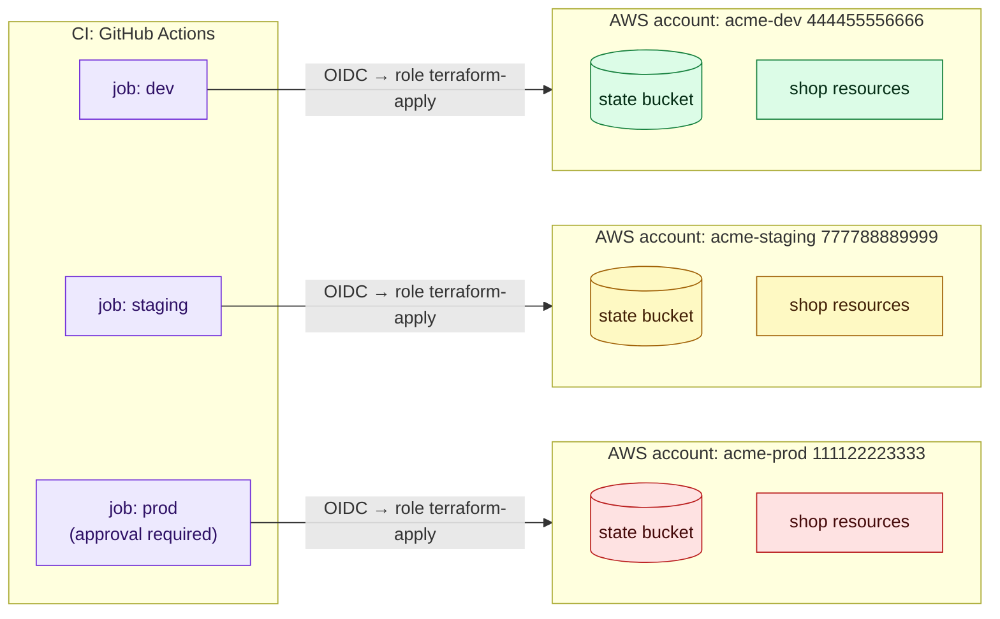
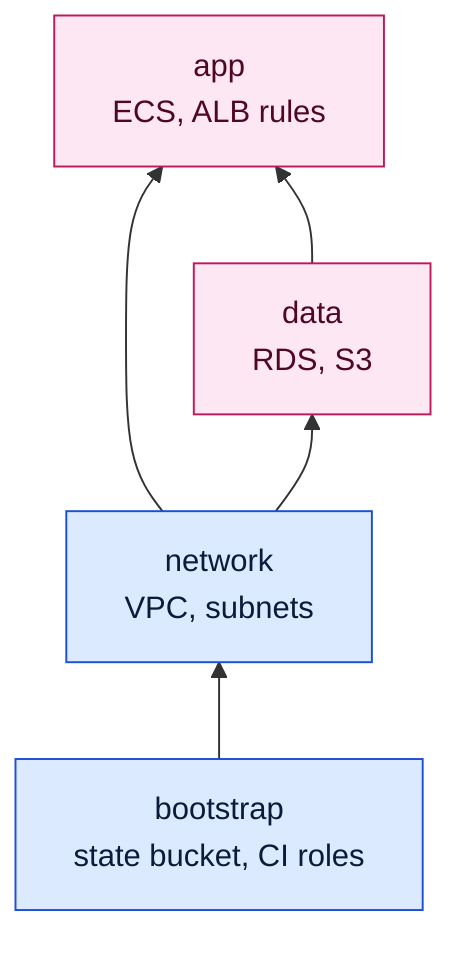
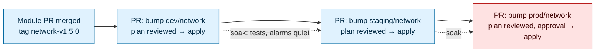

# Terraform environments and project layout

> [!abstract] In one sentence
> Running the same infrastructure as dev, staging and prod means deciding **how environments are separated** (workspaces, a directory per environment, or one root with a variables file and backend config per environment, ideally in **separate AWS accounts**), **how state is split** into small layers (bootstrap, network, data, app) that pass values to each other, and **how a change is promoted** from dev to prod, so that a mistake in one plan can only hurt a small, known part of one environment.

## Build-up: one folder, one state, one bad afternoon

Acme's shop on AWS (Amazon Web Services) started as one Terraform root module in `infra/` with one state file: VPC (Virtual Private Cloud), database, ECS (Elastic Container Service) service, DNS (Domain Name System) records. Then the team needed a dev copy to try things.

### Stage 1: everything in one state

```
infra/
├── main.tf          # VPC + RDS + ECS + Route 53, ~1,200 lines
├── variables.tf
└── backend.tf       # key = "shop/terraform.tfstate"
```

**The problems:**
- There is no dev: every experiment is a plan against prod
- `terraform plan` refreshes ~400 resources every time: 4 minutes for a one-line change, and AWS API (Application Programming Interface) throttling errors on busy days
- The **blast radius** is everything: a typo in a DNS record and a careless `-target`-less apply both run with permissions to delete the database
- Two people can't work in parallel: the state lock (see [[Terraform state]]) serialises everything

Two separate questions hide in here: **how do I get several environments**, and **how do I cut one environment into smaller states**. They have separate answers.

### Stage 2: workspaces, the built-in answer (and why it's not enough)

Terraform CLI (Command-Line Interface) **workspaces** let one root module have several state files in the same backend:

```
$ terraform workspace new dev
Created and switched to workspace "dev"!

$ terraform workspace list
  default
* dev
  prod

$ terraform workspace select prod
Switched to workspace "prod".
```

With the S3 (Simple Storage Service) backend, each non-default workspace's state is stored under `env:/<workspace>/<key>`:

```
s3://acme-tfstate/shop/terraform.tfstate             # default
s3://acme-tfstate/env:/dev/shop/terraform.tfstate
s3://acme-tfstate/env:/prod/shop/terraform.tfstate
```

The code uses `terraform.workspace` to vary things:

```hcl
locals {
  env = terraform.workspace

  settings = {
    dev  = { cidr = "10.1.0.0/16", azs = 2, db_class = "db.t4g.micro",  desired = 1 }
    prod = { cidr = "10.0.0.0/16", azs = 3, db_class = "db.r7g.large", desired = 3 }
  }
  s = local.settings[local.env]
}

module "network" {
  source     = "../modules/network"
  name       = "shop-${local.env}"
  cidr_block = local.s.cidr
  azs        = slice(["eu-west-1a", "eu-west-1b", "eu-west-1c"], 0, local.s.azs)
}
```

It works, and it's tempting. **Why it's weak for environment isolation:**
- **Same backend, same credentials.** dev and prod states sit in one bucket, and whoever can plan dev can plan prod with the same role. Prod can't live in a separate AWS account with its own permissions without contortions
- **The active workspace is invisible.** It's local state in `.terraform/environment`. `terraform apply` in a terminal that was left on `prod` applies to prod. Nothing in the code or the command line shows it
- **Same code for every environment at the same moment.** There's no way for prod to stay on module `v1.4.0` while dev tries `v1.5.0`: one checkout, one version
- **Differences become conditionals.** `count = terraform.workspace == "prod" ? 1 : 0` spreads through the code, and a reviewer has to evaluate every expression for every workspace in their head

Where workspaces *are* fine: **short-lived copies of the same thing** with the same permissions: a per-branch preview environment, a load-test copy, one stack per developer. HashiCorp's own docs say CLI workspaces are not a mechanism for strong separation between environments.

> [!warning] HCP (HashiCorp Cloud Platform) Terraform workspaces are a different thing
> In HCP Terraform (formerly Terraform Cloud), a "workspace" is a full unit: its own state, variables, credentials, permissions and run history, usually one per environment per layer. Same word, much stronger isolation than CLI workspaces.

### Stage 3: a directory per environment

Each environment gets its own root module, its own backend key, and calls versioned modules (see [[Terraform modules]]):

```
infra/
├── modules/                     # or a separate repo, referenced by ?ref= tags
│   ├── network/
│   ├── postgres/
│   └── ecs-service/
└── envs/
    ├── dev/
    │   ├── backend.tf           # key = "dev/shop/terraform.tfstate"
    │   ├── providers.tf         # assume role in the dev account
    │   ├── main.tf              # module calls with dev values
    │   └── terraform.tfvars
    ├── staging/
    │   └── ...
    └── prod/
        ├── backend.tf           # key = "prod/shop/terraform.tfstate"
        ├── providers.tf         # assume role in the prod account
        ├── main.tf
        └── terraform.tfvars
```

`envs/prod/main.tf`:

```hcl
module "network" {
  source     = "git::https://github.com/acme/terraform-modules.git//network?ref=network-v1.4.0"
  name       = "shop-prod"
  cidr_block = "10.0.0.0/16"
  azs        = ["eu-west-1a", "eu-west-1b", "eu-west-1c"]
}
```

`envs/dev/main.tf` can point at `network-v1.5.0` the same week. What I gain:
- `cd envs/prod` makes the environment **visible** in the path, the CI (Continuous Integration) job name and the pull request diff
- Each environment can be on its **own module versions**: promotion is a diff
- Each environment can have **its own backend and its own credentials**
- Differences are plain values in `main.tf`/`terraform.tfvars`, not conditionals

The cost: the `main.tf` files repeat the module calls (that's the "wiring", which is small because the logic is in modules). Keeping the wiring files thin is what makes this sustainable.

### Stage 4: one root, a tfvars and backend config per environment

The middle ground some teams prefer: one root module, the environment chosen by **files passed on the command line**:

```
infra/shop/
├── main.tf
├── variables.tf
├── backend.tf                # backend "s3" {}  (partial: no bucket/key here)
└── env/
    ├── dev.tfvars
    ├── dev.s3.tfbackend
    ├── prod.tfvars
    └── prod.s3.tfbackend
```

```hcl
# env/prod.s3.tfbackend
bucket       = "acme-prod-tfstate"
key          = "shop/terraform.tfstate"
region       = "eu-west-1"
use_lockfile = true
```

```hcl
# env/prod.tfvars
environment    = "prod"
account_id     = "111122223333"
cidr_block     = "10.0.0.0/16"
db_class       = "db.r7g.large"
desired_count  = 3
```

```bash
terraform init -reconfigure -backend-config=env/prod.s3.tfbackend
terraform plan -var-file=env/prod.tfvars -out=prod.tfplan
```

Good: no duplicated wiring, environments differ only in values, and different backends/accounts are possible. Bad: like workspaces, every environment uses the same code version at once (promotion happens through Git branches or tags instead), and forgetting `-reconfigure` or pairing `dev.tfvars` with the prod backend is a real risk. A wrapper script or CI job that always passes **both** files for one environment name fixes the pairing.

| | CLI workspaces | Directory per env | One root + tfvars/backend per env |
|---|---|---|---|
| Separate backend and credentials | Hard (same backend) | Yes | Yes |
| Environment visible in the command | No (hidden state) | Yes (the path) | Yes (the file names) |
| Different module versions per env | No | Yes | No (via Git refs only) |
| Duplicated wiring | None | Some | None |
| Differences expressed as | Conditionals on `terraform.workspace` | Values | Values |
| Good for | Ephemeral copies, previews | Long-lived dev/staging/prod | Many similar envs (per region, per customer) |

### Stage 5: separate AWS accounts per environment

Even with separate states, if dev and prod live in **one AWS account**, a dev mistake (or a dev credential leak) can touch prod: IAM (Identity and Access Management) policies scoped by tag are easy to get wrong, and service quotas are shared.

The production standard is one AWS account per environment (with AWS Organizations), and Terraform reaching each through a role:

```hcl
# envs/prod/providers.tf
provider "aws" {
  region = "eu-west-1"

  assume_role {
    role_arn     = "arn:aws:iam::111122223333:role/terraform-apply"
    session_name = "terraform-prod"
  }

  allowed_account_ids = ["111122223333"]   # refuse to run anywhere else

  default_tags {
    tags = { Environment = "prod", ManagedBy = "terraform", Repo = "acme/infra" }
  }
}
```

`allowed_account_ids` is a cheap seatbelt: if the credentials somehow point at the dev account, the plan fails instead of creating prod resources in dev. Each account also gets **its own state bucket**, so prod state (which contains secrets, see [[Terraform state]]) is readable only by prod roles. In CI, each environment's job assumes only its own account's role via OIDC (OpenID Connect) (see [[Connecting GitHub Actions to AWS]]).



### Stage 6: splitting one environment into layers

Now prod is isolated, but prod itself is still one big state with 400 resources: slow plans, everything in the blast radius of every change, one lock. The fix is to cut each environment into **layers** (also called stacks or components) by **rate of change** and **ownership**:

| Layer | Contains | Changes | Who |
|---|---|---|---|
| `bootstrap` | State bucket, CI roles, OIDC provider | Almost never | Platform team, applied once by hand with admin |
| `network` | VPC, subnets, NAT (Network Address Translation), endpoints, Transit Gateway attachment | Rarely | Platform / network |
| `data` | RDS (Relational Database Service), ElastiCache, S3 buckets with data | Rarely, carefully | Platform + app team |
| `app` | ECS services, ALB (Application Load Balancer) rules, task definitions, alarms | Often (every release) | App team |
| `dns-edge` | Route 53 records, CloudFront, WAF (Web Application Firewall) | Sometimes | Platform |

```
infra/live/
├── prod/
│   ├── bootstrap/
│   ├── network/
│   ├── data/
│   └── app/
├── staging/
│   └── ...  (same four)
└── dev/
    └── ...
```

Each folder is a root module with its own state key (`prod/network/terraform.tfstate`, `prod/data/...`). The app team's daily change plans ~40 resources in 20 seconds and **cannot** touch the database: the database isn't in that state, and the `app` role doesn't have `rds:DeleteDBInstance`.

Layers form a one-way dependency chain: lower layers never read from higher ones.



Don't over-split: 30 tiny states with values passed between them means every change needs applies in four places in the right order. Split when there's a **reason**: different owners, different change rates, or a scary resource (the database) that shouldn't share a plan with daily deploys.

### Stage 7: passing values between layers

The `app` layer needs the VPC ID (identifier) and private subnet IDs (identifiers) from `network`, and the database endpoint from `data`. Three ways:

**1. `terraform_remote_state`**: read the other layer's outputs directly from its state file.

```hcl
data "terraform_remote_state" "network" {
  backend = "s3"
  config = {
    bucket = "acme-prod-tfstate"
    key    = "prod/network/terraform.tfstate"
    region = "eu-west-1"
  }
}

module "web" {
  source     = "git::https://github.com/acme/terraform-modules.git//ecs-service?ref=ecs-service-v2.2.0"
  vpc_id     = data.terraform_remote_state.network.outputs.vpc_id
  subnet_ids = data.terraform_remote_state.network.outputs.private_subnet_ids
}
```

Simple, but the reader needs read access to the **whole** network state file (which may hold secrets), and it couples to the backend location. Only outputs are exposed, which is good.

**2. Data source lookups**: ask the AWS API for the real resources by tag or name.

```hcl
data "aws_vpc" "shop" {
  tags = { Name = "shop-prod" }
}

data "aws_subnets" "private" {
  filter {
    name   = "vpc-id"
    values = [data.aws_vpc.shop.id]
  }
  tags = { Tier = "private" }
}

module "web" {
  # ...
  vpc_id     = data.aws_vpc.shop.id
  subnet_ids = data.aws_subnets.private.ids
}
```

No access to other states needed, and it doesn't care how the VPC was created. But it depends on naming/tag **conventions**: a renamed tag breaks the lookup, and a lookup that matches two VPCs fails.

**3. A parameter store as the contract**: the producing layer **publishes** values to SSM (Systems Manager) Parameter Store, consumers read them.

```hcl
# network layer: publish
resource "aws_ssm_parameter" "vpc_id" {
  name  = "/shop/prod/network/vpc_id"
  type  = "String"
  value = module.network.vpc_id
}

resource "aws_ssm_parameter" "private_subnet_ids" {
  name  = "/shop/prod/network/private_subnet_ids"
  type  = "StringList"
  value = join(",", module.network.private_subnet_ids)
}
```

```hcl
# app layer: consume
data "aws_ssm_parameter" "vpc_id" {
  name = "/shop/prod/network/vpc_id"
}

data "aws_ssm_parameter" "private_subnet_ids" {
  name = "/shop/prod/network/private_subnet_ids"
}

locals {
  vpc_id             = data.aws_ssm_parameter.vpc_id.value
  private_subnet_ids = split(",", data.aws_ssm_parameter.private_subnet_ids.value)
}
```

An explicit, IAM-controllable interface between teams, readable by non-Terraform tools too (scripts, other IaC (Infrastructure as Code) tools). Costs a few extra resources.

| | `terraform_remote_state` | Data source lookups | SSM parameters |
|---|---|---|---|
| Needs access to the producer's state | Yes (whole file) | No | No |
| Explicit contract | Outputs | Naming/tag convention | Parameter names |
| Works if the producer isn't Terraform | No | Yes | Yes |
| Fine-grained permissions | No | Via IAM on describe calls | Yes, per parameter path |

What I'd do: data source lookups for things with stable names inside one team, SSM parameters across team or tool boundaries, `terraform_remote_state` only inside one small team where everyone can read every state anyway.

> [!warning] Values read at plan time, not live links
> A consuming layer only sees a new output after **its own** next plan/apply. If `network` adds a subnet, `app` doesn't know until it is re-applied. Apply in dependency order: network, then data, then app.

### Stage 8: where the code lives

Two common layouts.

**Monorepo**: modules and live configuration together.

```
acme/infra
├── modules/
│   ├── network/
│   ├── postgres/
│   └── ecs-service/
└── live/
    ├── dev/{network,data,app}/
    ├── staging/{network,data,app}/
    └── prod/{network,data,app}/
```

Simple, one pull request changes a module and its callers, easy to search. Risk: callers reference modules by **local path**, so a module change hits all environments in the same commit. Teams handle it by merging to dev first, or by referencing their own repo with `?ref=` tags even in a monorepo.

**Modules repo + live repo**: modules are a library with releases, live repo pins versions.

```
acme/terraform-modules            # library: tagged releases network-v1.5.0, ...
├── network/
├── postgres/
└── ecs-service/

acme/infra-live                   # deployments: what runs where
├── dev/{network,data,app}/       # source = ...?ref=network-v1.5.0
├── staging/{network,data,app}/   # ...?ref=network-v1.5.0
└── prod/{network,data,app}/      # ...?ref=network-v1.4.0
```

Clear promotion, modules tested in isolation, but two pull requests per change and some version-bump busywork (Renovate or Dependabot can open the bump pull requests automatically).

App teams often keep **their** app layer next to the application code (like [[ECS production stack]], where `acme/shop` holds the app and its `infra/`), while shared platform layers live in a platform repo.

### Stage 9: promoting a change from dev to prod

With directories per environment and versioned modules, a change flows like an application release (see [[Deployment strategies]]):



Rules that make promotion meaningful:
- The **same module version** moves through environments; prod never runs code that dev hasn't
- Environments differ in **values** (sizes, counts, CIDRs (Classless Inter-Domain Routing ranges)), not in structure. If prod has a resource dev doesn't, dev isn't testing prod's shape
- Each environment's **plan** is reviewed on its own: the same code can produce a different plan in prod (different existing state, drift)
- `apply` uses the saved plan file that was reviewed (see [[Terraform in production]])

## Terragrunt and HCP Terraform, briefly

**Terragrunt** is a thin wrapper around Terraform/OpenTofu built for exactly this layout problem. Each live folder has a small `terragrunt.hcl` instead of duplicated wiring:

```hcl
# live/prod/network/terragrunt.hcl
include "root" {
  path = find_in_parent_folders("root.hcl")   # shared backend + provider generation
}

terraform {
  source = "git::https://github.com/acme/terraform-modules.git//network?ref=network-v1.4.0"
}

inputs = {
  name       = "shop-prod"
  cidr_block = "10.0.0.0/16"
  azs        = ["eu-west-1a", "eu-west-1b", "eu-west-1c"]
}
```

```hcl
# live/prod/app/terragrunt.hcl
dependency "network" {
  config_path = "../network"
}

inputs = {
  vpc_id     = dependency.network.outputs.vpc_id
  subnet_ids = dependency.network.outputs.private_subnet_ids
}
```

It generates the backend block per folder (state key from the path), passes outputs between layers with `dependency`, and runs layers in order (`terragrunt run --all plan`). Worth it for many accounts × regions × layers; an extra tool to learn for a small setup.

**HCP Terraform** (HashiCorp's hosted service, formerly Terraform Cloud) gives each workspace its own state, variables, credentials and approvals, runs plans remotely, and has **Stacks**: a way to declare several components (layers) and deployments (environments) in one configuration and let the service order them. Spacelift, env0 and Scalr offer similar features, and OpenTofu works with most of them.

## Advanced problems

### 1. Applied to the wrong environment
**Symptom:** a change meant for dev shows up in prod.
**Cause:** CLI workspace left on `prod`, or `dev.tfvars` used with the prod backend after a forgotten `-reconfigure`.
**Fix:** `allowed_account_ids` in the provider, separate accounts with separate roles, environment in the path (directories), and applies only from CI where the job name fixes the environment. Show the workspace in the shell prompt if workspaces are used at all.

### 2. Slow plans and API throttling
**Symptom:** plans take minutes; `ThrottlingException: Rate exceeded` from AWS.
**Cause:** one state with hundreds of resources refreshed on every plan.
**Fix:** split into layers. `-refresh=false` speeds up a local look but hides drift; don't use it for real applies. `-parallelism` (default 10) can be lowered to reduce throttling.

### 3. A layer can't be destroyed or changed because another depends on it
**Symptom:** destroying `network` fails with `DependencyViolation: The vpc 'vpc-0a1b...' has dependencies and cannot be deleted`.
**Cause:** `app` and `data` still have resources inside the VPC; Terraform's graph doesn't cross state boundaries.
**Fix:** destroy in reverse dependency order (app, data, network). Keep the layer order documented (or let Terragrunt/Stacks handle it).

### 4. Stale cross-layer values
**Symptom:** after replacing a subnet in `network`, the `app` layer still references the old subnet ID and its apply fails, or ECS tasks are placed nowhere.
**Cause:** consumers read values at their own plan time.
**Fix:** after changing a producer's outputs, re-plan and apply consumers. CI can trigger downstream plans when a producer's outputs change.

### 5. Environments that drift structurally
**Symptom:** a change works in dev and staging and fails in prod.
**Cause:** prod has hand-made extras or different structure (`count = var.env == "prod" ? ...` in many places, or resources only in prod's folder).
**Fix:** keep structure identical and vary only values. Run the drift detection described in [[Terraform in production]] on every environment.

## Practice

> [!example]- The team uses CLI workspaces `dev` and `prod` with one S3 backend. Name two ways a dev mistake can reach prod.
> The active workspace is hidden local state, so an apply in a terminal still on `prod` changes prod. And both states share one backend and usually one set of credentials, so a dev role or leaked dev credentials can read or write prod state and resources.

> [!example]- When are CLI workspaces a good fit?
> Short-lived copies of the same infrastructure with the same permissions: per-branch preview environments, a load-test copy, one sandbox per developer.

> [!example]- The `app` layer needs the private subnet IDs owned by the network team, who don't want to grant read access to their state. Which approach?
> Have the network layer publish the IDs to SSM Parameter Store (`/shop/prod/network/private_subnet_ids`) and read them with `data "aws_ssm_parameter"`, or look the subnets up with `data "aws_subnets"` by VPC and tag.

> [!example]- Why put the database in its own layer instead of the app layer?
> It changes rarely and losing it is catastrophic. Daily app deploys then can't plan a change to it at all, the app role doesn't need permission to delete it, and app plans stay small and fast.

> [!example]- With `-backend-config=env/prod.s3.tfbackend`, what extra safety stops `dev.tfvars` from building dev settings into the prod account?
> `allowed_account_ids` plus an `account_id` variable check, and a wrapper/CI job that always passes the tfvars and backend file for the same environment name together. Separate accounts make the role itself refuse.

## Easy to get wrong
- Using CLI workspaces for dev/prod isolation: same backend, same credentials, hidden active environment
- Confusing CLI workspaces with HCP Terraform workspaces (the latter are full isolated units)
- One state per environment with hundreds of resources: slow plans, a huge blast radius, one lock for everyone
- Splitting into dozens of tiny states with no reason: every change becomes an ordered multi-apply
- Letting lower layers read from higher ones (network reading app): circular dependencies across states
- Forgetting that a consumer only sees a producer's new outputs after its own re-apply
- Expressing environment differences as conditionals on structure instead of values
- Prod and dev in one AWS account, separated only by tags
- Running `init` against a different backend without `-reconfigure` (or `-migrate-state` when moving state on purpose)
- Promoting by copying files from `dev/` to `prod/` instead of bumping a module version

## Related
- Builds on:: [[Terraform]], [[Terraform state]], [[Terraform modules]], [[Terraform providers]] (assume_role, allowed_account_ids), [[Terraform variables, locals and outputs]] (tfvars)
- Next step:: [[Terraform testing and validation]], [[Terraform in production]]
- Applied in:: [[Terraform worked example]], [[ECS production stack]], [[Connecting GitHub Actions to AWS]]
- Similar to:: [[Deployment strategies]] (promotion through environments)
- Area:: [[Infrastructure as code]]

## Flashcards
#flashcards

What is a Terraform CLI workspace? :: A named extra state file for the same root module in the same backend, selected with terraform workspace select
Where does the S3 backend store a workspace's state? :: Under env:/<workspace>/<key> in the same bucket
Why are CLI workspaces weak for dev/prod isolation? :: Same backend and credentials, the active workspace is hidden local state, and every env runs the same code version
When are CLI workspaces a good fit? :: Short-lived copies with the same permissions: previews, load tests, developer sandboxes
What does terraform.workspace return? :: The name of the currently selected CLI workspace
CLI workspace vs HCP Terraform workspace? :: CLI: just another state file. HCP Terraform: a full unit with its own state, variables, credentials, permissions and runs
Main benefit of a directory per environment? :: Environment visible in the path, separate backend and credentials, and each env can pin its own module versions
What is a partial backend configuration? :: backend "s3" {} in code, with bucket/key supplied at init by -backend-config=<file>
What does allowed_account_ids on the AWS provider do? :: Makes Terraform refuse to run if the credentials point at another account
Why separate AWS accounts per environment? :: Hard isolation: dev credentials and mistakes can't reach prod; separate state buckets, quotas and permissions
What are state layers? :: Splitting one environment into several root modules/states (bootstrap, network, data, app) by change rate and ownership
Why split state into layers? :: Smaller blast radius, faster plans, separate locks and permissions per team
Which direction do layer dependencies go? :: One way: higher layers (app) read from lower ones (network, data), never the reverse
Three ways to pass values between layers? :: terraform_remote_state, data source lookups by name/tag, a parameter store such as SSM Parameter Store
Downside of terraform_remote_state? :: The reader needs access to the whole producer state file (which can hold secrets) and couples to its backend location
When does a consumer layer see a producer's new output? :: Only after the consumer's own next plan/apply
Monorepo vs modules repo + live repo? :: Monorepo: one PR, simple, but local paths hit all envs at once. Split: versioned modules and clear promotion, more PRs
How is a change promoted dev → prod with versioned modules? :: Bump the module ref in dev, review plan, apply, soak; repeat for staging, then prod with approval
What does Terragrunt add? :: Generated backends per folder, dependency blocks passing outputs between layers, and running many layers in order
Environments should differ in what, and not in what? :: In values (sizes, counts, CIDRs), not in structure
