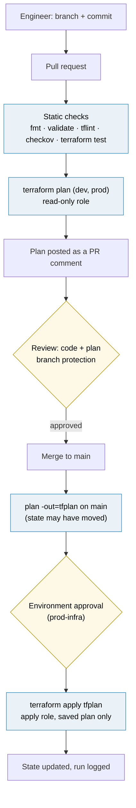
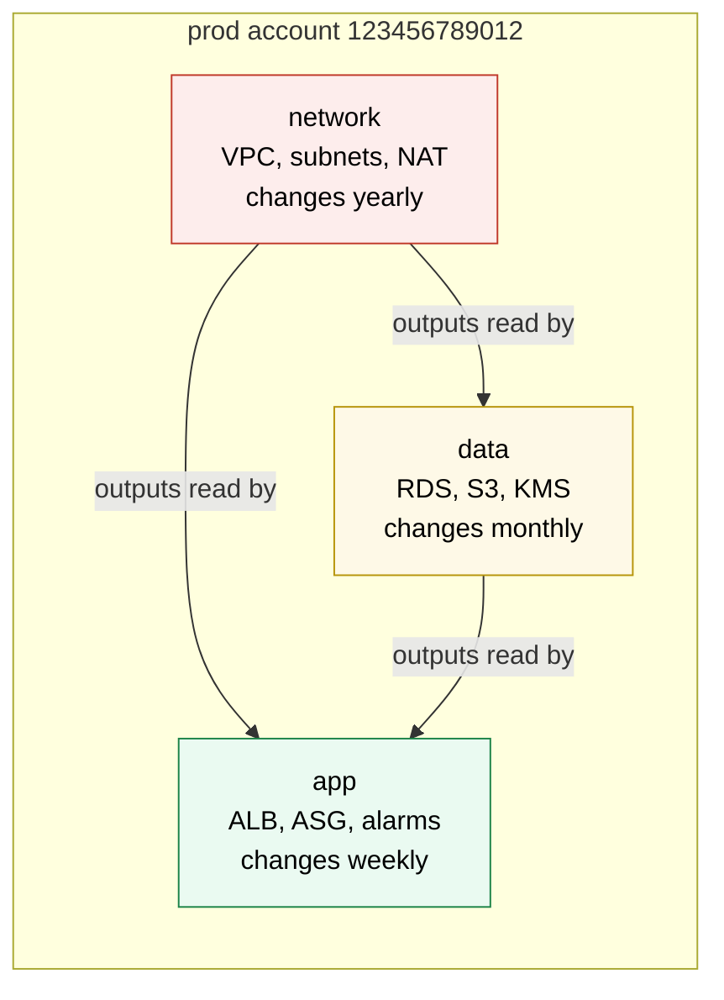

# Terraform in production

> [!abstract] In one sentence
> In production nobody runs `terraform apply` from a laptop: every change is a pull request whose **plan is posted for review**, the **exact saved plan** is applied by a pipeline with short-lived credentials after an approval, one run at a time per state, with versions pinned, secrets kept out of code and state, critical resources protected twice (Terraform and the cloud), drift detected on a schedule, and a written way to break glass when the pipeline itself is broken.

## Build-up: from one laptop to a team

Acme's "shop" runs on AWS (Amazon Web Services) in `eu-west-1`: a VPC (Virtual Private Cloud), an ALB (Application Load Balancer) in front of an Auto Scaling group, and an RDS (Relational Database Service) PostgreSQL database. All of it is described in Terraform (HCL, HashiCorp Configuration Language, files in the `acme/shop` repository, AWS provider `~> 6.0`, Terraform 1.10+). The code itself is covered in [[Terraform worked example]]. This note is about **how the code reaches the account safely**, once more than one person touches it.

### Stage 1: one engineer, one laptop

At first one engineer has admin credentials and runs:

```bash
cd infra/live/prod
terraform plan
terraform apply
```

The state is already remote (an S3 (Simple Storage Service) bucket with locking, see [[Terraform state]]), so two people can't corrupt it at the same time. It works. Then the team grows to four, and the problems appear:

- **Nobody saw what was applied.** The plan scrolled by in one person's terminal. The reviewer of the pull request reviewed the *code*, not the *effect*: "rename a variable" can be "replace the database"
- **Code in Git ≠ what's deployed.** Someone applied from a branch that was never merged. The next person applies `main` and silently reverts it
- **Laptops differ.** One has Terraform 1.9, another 1.12, different provider builds; a newer CLI (command-line interface) upgrades the state format and the older one can't read it any more
- **Long-lived admin credentials on every laptop**, and the audit trail in [[CloudTrail]] says "admin" for everything
- **Half-finished applies.** The laptop goes to sleep, Wi-Fi drops in the middle of an RDS modification, the lock stays behind

Each of these has a fix, and together they *are* "Terraform in production".

### Stage 2: the pipeline runs Terraform, humans review

The rule: **Git is the only way in.** Engineers change `.tf` files on a branch and open a PR (pull request). CI/CD (Continuous Integration / Continuous Delivery) does the rest:



What each step buys:

| Step | Why it's there |
|---|---|
| `terraform fmt -check -recursive` | Diffs show real changes, not whitespace |
| `terraform validate` | Syntax and type errors without touching AWS |
| `tflint` | Provider-aware lint: invalid instance types, deprecated syntax, unused variables |
| `checkov` / `trivy config` | Security policy: public buckets, `0.0.0.0/0` on port 22, unencrypted volumes (details in [[Terraform testing and validation]]) |
| `terraform test` | The modules' own unit tests |
| `plan` posted on the PR | The reviewer sees **the effect**: `1 to destroy` is impossible to miss |
| Re-plan after merge | `main` may have changed since the PR's plan; the apply must match current state |
| Environment approval | A human confirms *this* plan before prod changes |
| Apply the saved file | What's applied is byte-for-byte what was approved |

The PR plan job (simplified; the full workflow is in [[Terraform worked example]]):

```yaml
# .github/workflows/terraform.yml (PR part)
on:
  pull_request:
    paths: ["infra/**"]

permissions:
  contents: read
  id-token: write        # OIDC token for AWS
  pull-requests: write   # to post the plan comment

jobs:
  plan:
    runs-on: ubuntu-latest
    strategy:
      fail-fast: false
      matrix:
        include:
          - env: dev
            role: arn:aws:iam::222233334444:role/acme-tf-plan
          - env: prod
            role: arn:aws:iam::123456789012:role/acme-tf-plan
    defaults:
      run:
        working-directory: infra/live/${{ matrix.env }}
    steps:
      - uses: actions/checkout@v4
      - uses: hashicorp/setup-terraform@v3
        with:
          terraform_version: 1.13.4      # exact version, same as everyone else
          terraform_wrapper: false
      - uses: aws-actions/configure-aws-credentials@v4
        with:
          role-to-assume: ${{ matrix.role }}
          aws-region: eu-west-1
      - run: terraform init -input=false -lockfile=readonly
      - run: terraform plan -input=false -lock-timeout=5m -out=tfplan
      - name: Post the plan on the PR
        env:
          GH_TOKEN: ${{ github.token }}
        run: |
          {
            echo "### Plan for \`${{ matrix.env }}\`"
            echo '```diff'
            terraform show -no-color tfplan | tail -c 60000
            echo '```'
          } > comment.md
          gh pr comment ${{ github.event.pull_request.number }} --body-file comment.md
```

`-lockfile=readonly` makes `init` fail if the committed `.terraform.lock.hcl` doesn't match: CI never silently picks a different provider build than the one reviewed.

> [!tip] Make destroys loud
> A long plan hides one `destroy` line. A small step counts them and fails (or adds a "needs-careful-review" label) when any resource would be deleted or replaced:
> ```bash
> terraform show -json tfplan \
>   | jq -r '.resource_changes[] | select(.change.actions | index("delete")) | .address' > deletes.txt
> if [ -s deletes.txt ]; then
>   echo "::warning::This plan deletes or replaces:"; cat deletes.txt
> fi
> ```
> `-/+` (replace) also contains a `delete`, so replacements are caught too.

**The problem now:** the PR's plan was computed against the state *at that moment*. If another PR merges first, the reviewed plan no longer describes what would happen.

### Stage 3: apply the saved plan, not a fresh one

`terraform apply` without a file **re-plans** and applies whatever it finds, possibly something nobody reviewed. `terraform apply tfplan` applies exactly the actions stored in the file, and refuses if the state changed since:

```text
Error: Saved plan is stale

The given plan file can no longer be applied because the state was changed by
another operation after the plan was created.
```

That error is the safety net working: re-run the pipeline, review the new plan.

There are two common orderings:

| | Apply **after** merge (GitHub Actions, HCP Terraform VCS runs) | Apply **before** merge (Atlantis default) |
|---|---|---|
| Flow | Merge → plan on `main` → approve → apply | `plan` on PR → approve PR → `apply` from the PR → merge |
| `main` is | What was *meant* to be applied (may fail to apply) | What *was* applied |
| When apply fails | `main` holds broken code; fix forward with a new PR | Fix in the same PR before merging |
| Lock held | During one run | Often from plan until merge (per directory) |

Both work. What matters is that the thing applied is the thing reviewed, and that a failed apply is visible and owned.

The post-merge part:

```yaml
# .github/workflows/terraform.yml (main part, prod only shown)
  plan-prod:
    if: github.event_name == 'push'
    needs: apply-dev                 # prod only after dev applied the same commit
    runs-on: ubuntu-latest
    steps:
      # checkout, setup-terraform, credentials (plan role), init as above
      - run: terraform plan -input=false -lock-timeout=5m -out=tfplan
      - run: terraform show -no-color tfplan >> "$GITHUB_STEP_SUMMARY"   # what the approver reads
      - uses: actions/upload-artifact@v4
        with:
          name: tfplan-prod
          path: infra/live/prod/tfplan
          retention-days: 1          # the plan file contains secrets: keep it briefly

  apply-prod:
    needs: plan-prod
    runs-on: ubuntu-latest
    environment: prod-infra          # required reviewers; OIDC sub = environment:prod-infra
    concurrency:
      group: terraform-prod
      cancel-in-progress: false
    steps:
      # checkout the same commit, setup-terraform, credentials (apply role), init
      - uses: actions/download-artifact@v4
        with:
          name: tfplan-prod
          path: infra/live/prod
      - run: terraform apply -input=false tfplan
```

> [!warning] A plan file is a secret
> The binary `tfplan` contains every attribute value, including sensitive ones, in readable form. Keep artifact retention short, never attach it to a public run, and never commit it.

### Stage 4: identities, not keys

The pipeline needs AWS credentials. No IAM (Identity and Access Management) user with an access key in GitHub secrets: GitHub Actions trades an OIDC (OpenID Connect) token for temporary credentials of a role, as set up in [[Connecting GitHub Actions to AWS]]. For Terraform the split is:

| Role | Trusted OIDC `sub` | Permissions | Used by |
|---|---|---|---|
| `acme-tf-plan` (each account) | `repo:acme/shop:pull_request`, `repo:acme/shop:ref:refs/heads/main` | `ReadOnlyAccess` + read state + write/delete the `.tflock` object | PR plans, post-merge plans, drift detection |
| `acme-tf-apply` (each account) | `repo:acme/shop:environment:prod-infra` (and `dev-infra` in dev) | Broad (often `AdministratorAccess`, ideally narrowed with a permissions boundary) | Apply jobs only, behind the environment approval |

Why the split matters:
- **A PR runs code the author wrote.** A malicious or careless PR can make `plan` do things: an `external` data source runs any program, a provider can be swapped. With a read-only role that's an information leak at worst, not a deleted database
- The apply role can only be assumed from a job running in the `prod-infra` **environment**, and GitHub only lets that environment run after the required reviewers approve, from `main`. AWS enforces the approval: a workflow that skips the environment simply gets no credentials

> [!warning] Read-only still reads the state
> The plan role has to read the state file, and state holds every secret Terraform ever touched in plain text. "Read-only" plan access for PRs from untrusted forks is therefore never safe: GitHub doesn't give OIDC tokens to fork PRs by default, keep it that way, and keep secrets out of state (Stage 6).

A third guard costs one line, in every root module's provider:

```hcl
provider "aws" {
  region              = "eu-west-1"
  allowed_account_ids = ["123456789012"]   # prod: refuses to run against any other account
}
```

With the wrong credentials loaded (prod code, dev profile, or the opposite) Terraform stops before planning anything.

### Stage 5: one run at a time

The state lock already prevents two runs from writing the same state (`use_lockfile = true` on the S3 backend, see [[Terraform state]]). In CI two more things help:

- **`concurrency` per environment** with `cancel-in-progress: false`. A second merge queues behind the running apply instead of failing on the lock, and an apply is **never cancelled halfway** (a killed apply leaves a stale lock and possibly a half-created resource)
- **`-lock-timeout=5m`** on plan and apply: a briefly held lock (a PR plan) makes the run wait instead of failing immediately

What a lock collision looks like:

```text
Error: Error acquiring the state lock

Error message: operation error S3: PutObject, https response error StatusCode: 412,
PreconditionFailed
Lock Info:
  ID:        6f1c2a9e-3b0d-4c8e-9a51-1d2f7e6b8c40
  Path:      acme-tfstate-123456789012/shop/prod/terraform.tfstate
  Operation: OperationTypeApply
  Who:       runner@fv-az123-456
  Version:   1.13.4
  Created:   2026-10-09 14:02:11.52 +0000 UTC
```

`Who` and `Created` say whether someone is really running, or a dead job left it behind (Advanced problem 1).

### Stage 6: secrets stay out of code, variables and state

Three levels, from bad to good:

1. **In `.tfvars` or code.** The secret is in Git forever. Never
2. **In a variable marked `sensitive = true`, passed by CI.** Hidden from plan output, but **still stored in the state** in plain text, and in the plan file
3. **Never seen by Terraform**, or seen only during the run:
   - Let the service generate and own it. For RDS, `manage_master_user_password = true`: RDS creates the password in AWS Secrets Manager and rotates it; Terraform only knows the secret's ARN (Amazon Resource Name)
   - Terraform creates the **secret container** (`aws_secretsmanager_secret`) and its policy, and the value is set by another process or by a human once
   - **Ephemeral resources** (Terraform 1.10+) and **write-only arguments** (1.11+): values that exist during the run and are never written to the plan or state

```hcl
# The password is generated in memory and sent to AWS, never written to state
ephemeral "random_password" "api_key" {
  length  = 40
  special = false
}

resource "aws_secretsmanager_secret" "api_key" {
  name = "shop/prod/partner-api-key"
}

resource "aws_secretsmanager_secret_version" "api_key" {
  secret_id                = aws_secretsmanager_secret.api_key.id
  secret_string_wo         = ephemeral.random_password.api_key.result   # write-only argument
  secret_string_wo_version = 1    # bump to push a new value: Terraform can't diff what it never stored
}
```

The state itself is still treated as a secret: the bucket is encrypted with KMS (Key Management Service), versioned, blocks public access, and its bucket policy only lets the CI roles and a break-glass role read it. (OpenTofu, the open-source fork, can additionally encrypt state client-side before it's written.)

### Stage 7: catching drift

Someone changes a security group in the console during an incident. The code still says the old thing. Nothing notices until the next unrelated PR's plan suddenly wants to "fix" it, and the reviewer of that PR approves a change they didn't make.

So a scheduled job plans every environment and reports differences:

```yaml
# .github/workflows/drift.yml
on:
  schedule:
    - cron: "0 6 * * 1-5"       # every weekday at 06:00 UTC
  workflow_dispatch: {}

permissions:
  contents: read
  id-token: write
  issues: write

jobs:
  drift:
    runs-on: ubuntu-latest
    strategy:
      fail-fast: false
      matrix:
        include:
          - env: dev
            role: arn:aws:iam::222233334444:role/acme-tf-plan
          - env: prod
            role: arn:aws:iam::123456789012:role/acme-tf-plan
    defaults:
      run:
        working-directory: infra/live/${{ matrix.env }}
    steps:
      - uses: actions/checkout@v4
      - uses: hashicorp/setup-terraform@v3
        with:
          terraform_version: 1.13.4
          terraform_wrapper: false
      - uses: aws-actions/configure-aws-credentials@v4
        with:
          role-to-assume: ${{ matrix.role }}
          aws-region: eu-west-1
      - run: terraform init -input=false -lockfile=readonly
      - id: plan
        run: |
          set +e
          terraform plan -input=false -lock=false -detailed-exitcode -no-color > plan.txt
          echo "code=$?" >> "$GITHUB_OUTPUT"
      - if: steps.plan.outputs.code == '2'
        env:
          GH_TOKEN: ${{ github.token }}
        run: |
          gh issue create --title "Drift detected in ${{ matrix.env }}" \
            --label drift --body "$(echo '```'; tail -c 60000 plan.txt; echo '```')"
      - if: steps.plan.outputs.code == '1'
        run: exit 1               # the plan itself failed: that's an alert too
```

`-detailed-exitcode` returns **0** (no changes), **1** (error) or **2** (changes present). `-lock=false` is acceptable here because this run never writes. `terraform_wrapper: false` keeps the raw exit code and output (the setup action's wrapper otherwise intercepts them).

When drift is found there are only two honest outcomes: **revert it** (apply the code) or **adopt it** (change the code to match, PR, plan shows no changes). "Leave it" means the next apply decides for you.

> [!tip] Things that drift on purpose
> An Auto Scaling group's desired capacity (changed by scaling policies), an ECS (Elastic Container Service) service's task definition (changed by the deploy pipeline), tags added by other tools. Don't fight them every morning: leave the argument out, or list it in `lifecycle { ignore_changes = [...] }` (see [[Terraform resources and data sources]]).

### Stage 8: versions pinned, upgrades on purpose

Four things have versions, and each one is pinned in a file in Git:

| What | Where it's pinned | Example |
|---|---|---|
| Terraform CLI | `required_version` in every root + the exact version in CI | `required_version = "~> 1.10"`, CI `1.13.4` |
| Providers | `required_providers` constraint + `.terraform.lock.hcl` (exact build and hashes) | `version = "~> 6.0"`, lock: `6.14.1` |
| Modules from the registry | `version` argument | `version = "~> 5.21"` |
| Modules from Git | `?ref=` tag or commit | `git::https://github.com/acme/tf-modules.git//network?ref=v1.4.0` |

The lock file is generated for every platform the team uses, otherwise a Mac user's `init` adds hashes and creates noise in PRs:

```bash
terraform providers lock -platform=linux_amd64 -platform=darwin_arm64 -platform=linux_arm64
```

Upgrades then become ordinary PRs, ideally opened by a bot. Renovate understands Terraform out of the box:

```json
{
  "extends": ["config:recommended"],
  "terraform": { "enabled": true },
  "packageRules": [
    {
      "matchManagers": ["terraform"],
      "matchUpdateTypes": ["major"],
      "labels": ["needs-upgrade-guide"],
      "automerge": false
    }
  ]
}
```

Every upgrade PR runs the normal pipeline. **The plan is the test**: a provider minor bump should show `No changes. Your infrastructure matches the configuration.` in every environment. Anything else is read before merging. Major versions (AWS provider 5 → 6) come with an upgrade guide listing removed arguments and changed defaults: do them alone, not mixed with feature work, dev first.

> [!warning] The CLI only moves forward
> A newer Terraform writes state that an older one may refuse to read. If one person or job upgrades, everybody must. That's why the exact version lives in CI and `required_version` blocks old binaries.

### Stage 9: blast radius

Early on, everything lives in one root module and one state. At 1,500 resources:

- `plan` takes 6 minutes because it refreshes every resource through the AWS API (application programming interface), and hits API rate limits
- A PR that changes a tag on a log group locks the whole of production for the duration
- A bad apply or a corrupted state file affects *everything*
- The apply role needs permission for everything in one job

So state is **split by layer and by rate of change**, each with its own directory, state key and pipeline job (layout details in [[Terraform environments and project layout]]):



A typo in the app layer can't touch the database, because the database isn't in that state. Splitting has a cost (passing values across states, ordering applies), so split along real boundaries, not into 40 tiny states.

`-target=` is not a blast-radius tool. It applies part of a configuration and leaves the rest unconverged; it's for emergencies, and every use is followed by a full plan.

### Stage 10: protecting what can't come back

Some resources are expensive or impossible to recreate: the production database, the state bucket, a KMS key, a Route 53 hosted zone (its name servers change). They get protected **twice**: once in Terraform, once in AWS, because each layer has holes.

| Protection | Where | Stops | Doesn't stop |
|---|---|---|---|
| `lifecycle { prevent_destroy = true }` | Terraform | A plan that would destroy or replace it | Deleting the whole resource block (the setting goes with it); the console; another tool. Can't be set from a variable |
| `deletion_protection = true` (RDS, ALB), `force_destroy = false` (S3), KMS deletion window | AWS API | Any delete call, from any tool, until the flag is turned off first | A change that turns the flag off, then deletes (two steps, visible in the plan) |
| SCP (Service Control Policy) in [[AWS Organizations]] | Account | Even admins deleting tagged resources, except a break-glass role | Nothing within the allowed role |
| Backups and snapshots (RDS automated backups, AWS Backup, S3 versioning) | AWS | Permanent loss after all of the above failed | Nothing: it's recovery, not prevention |

```hcl
resource "aws_db_instance" "main" {
  # ...
  deletion_protection       = true
  skip_final_snapshot       = false
  final_snapshot_identifier = "shop-prod-final"

  lifecycle {
    prevent_destroy = true
  }
}
```

An SCP that makes a deletion require the break-glass role, whatever the IAM policies say:

```json
{
  "Version": "2012-10-17",
  "Statement": [{
    "Sid": "ProtectCriticalData",
    "Effect": "Deny",
    "Action": ["rds:DeleteDBInstance", "rds:DeleteDBCluster", "s3:DeleteBucket", "kms:ScheduleKeyDeletion"],
    "Resource": "*",
    "Condition": {
      "StringEquals": { "aws:ResourceTag/Protection": "critical" },
      "ArnNotLike": { "aws:PrincipalARN": "arn:aws:iam::*:role/acme-break-glass" }
    }
  }]
}
```

### Stage 11: break glass, and bringing click-ops back

The pipeline will be broken one day exactly when it's needed: GitHub is down, the OIDC role was broken by a bad apply, an incident needs a security group opened *now*. The answer isn't "keep admin keys around just in case". It's a **written break-glass procedure**:

1. A dedicated `acme-break-glass` role, assumable only by a few named people, with MFA (multi-factor authentication), through [[AWS Identity Center]]
2. Every assumption raises an alert (CloudTrail event → EventBridge → on-call channel)
3. Whoever uses it fixes the problem (console, or Terraform from a laptop **with the same pinned version and the same remote state and lock**)
4. Within a day: a PR brings the code back in line, and its plan shows `No changes`

Resources created by hand (during an incident, or before Terraform was adopted) are brought under management with an `import` block (Terraform 1.5+), reviewed like any change:

```hcl
# infra/live/prod/imports.tf
import {
  to = aws_s3_bucket.alb_logs
  id = "acme-shop-prod-alb-logs"
}
```

```bash
terraform plan -generate-config-out=generated.tf   # writes HCL matching the real bucket
```

```text
  # aws_s3_bucket.alb_logs will be imported
    resource "aws_s3_bucket" "alb_logs" {
        bucket = "acme-shop-prod-alb-logs"
        ...
    }

Plan: 1 to import, 0 to add, 0 to change, 0 to destroy.
```

The generated file is a starting point: tidy it, move it where it belongs, merge, and the import happens during the normal apply. The `import` block can be removed afterwards. Moving resources between states or addresses uses `moved` and `removed` blocks (see [[Terraform state]]).

To find what isn't managed yet, every Terraform-managed resource carries a tag through the provider's `default_tags`, and anything without it is suspect:

```hcl
provider "aws" {
  region              = "eu-west-1"
  allowed_account_ids = ["123456789012"]
  default_tags {
    tags = {
      Project     = "shop"
      Environment = "prod"
      Owner       = "team-platform"
      ManagedBy   = "terraform"
      Repo        = "acme/shop//infra/live/prod"
    }
  }
}
```

The same tags drive **cost**: activated as cost allocation tags in the Billing console, they split the bill by project and environment. A tool like Infracost can comment the monthly cost difference of a plan on the PR ("+$97/month: 2 NAT gateways"), which catches the expensive mistakes before they're applied.

## Ready-made platforms instead of hand-written workflows

Everything above can be built with GitHub Actions. Several products package it:

| Tool | What it is | Plan/apply model | Good when |
|---|---|---|---|
| GitHub Actions (DIY) | Workflows written by the team | Whatever is written (usually apply after merge) | Small team, already on GitHub, wants full control |
| Atlantis | Open-source server receiving PR webhooks | Comment `atlantis plan` / `atlantis apply` on the PR; apply **before** merge; per-directory locks held until merge | Self-hosted, many root modules, PR-centric workflow |
| HCP Terraform (formerly Terraform Cloud) / Terraform Enterprise | HashiCorp's SaaS (software as a service) / self-hosted product | Remote runs, built-in state and locking, run approvals, Sentinel or OPA (Open Policy Agent) policies, drift detection | Organisation standardised on HashiCorp, wants policy and audit built in |
| Spacelift, env0, Scalr | Commercial SaaS orchestrators | Stacks with dependencies, OPA policies, drift detection, support Terraform and OpenTofu | Many teams and stacks, need dependencies between states |

Licensing context: Terraform moved to the BUSL (Business Source License) in 2023, and **OpenTofu** was forked under the Linux Foundation with the original open-source licence. OpenTofu's CLI is `tofu`, reads the same HCL and state, and adds a few features of its own (client-side state encryption). The practices in this note apply to both.

## Advanced problems

### 1. The lock is stuck
**Symptom:** every run fails with `Error acquiring the state lock`, the `Created` time is hours old, and no job is running.
**Cause:** a job was cancelled or its runner died during plan/apply (a timeout, a manual cancel, a laptop going to sleep).
**Fix:** confirm nothing is running (CI runs, colleagues), then `terraform force-unlock 6f1c2a9e-3b0d-4c8e-9a51-1d2f7e6b8c40` from the same directory. Then run a plan: if the killed run was an apply, the state may be missing something it created (problem 2). Prevent it with `cancel-in-progress: false` and job timeouts longer than the slowest resource.

### 2. The apply failed halfway
**Symptom:** `Error: creating RDS DB Instance (shop-prod): ...` after 20 resources were created.
**What actually happened:** Terraform isn't transactional. Everything created before the error **is** in AWS and **is** in the state (Terraform writes state as it goes). Nothing is rolled back.
**Fix:** fix the cause, run the pipeline again: the new plan contains only what's still missing. A resource that was created but failed a later step (a provisioner, a wait) is marked **tainted** and will be replaced. A resource that AWS created but Terraform never recorded (the process was killed mid-call) shows up next time as `AlreadyExists` / `EntityAlreadyExists`: `import` it instead of deleting it by hand.

### 3. The plan wants to destroy something nobody deleted
**Symptom:** a refactoring PR (renaming a resource, moving it into a module) shows `aws_db_instance.this will be destroyed` and `module.database.aws_db_instance.this will be created`.
**Cause:** Terraform tracks resources **by address**. A new address is a new resource.
**Fix:** a `moved` block in the same PR. The plan then says `has moved to` and `0 to destroy`:
```hcl
moved {
  from = aws_db_instance.this
  to   = module.database.aws_db_instance.this
}
```

### 4. Removing one item replaces all the following ones
**Symptom:** removing the second of four subnets from a list shows two destroyed, two re-created.
**Cause:** `count` addresses by index: `[2]` becomes `[1]`, `[3]` becomes `[2]`, and the arguments no longer match.
**Fix:** `for_each` over a map keyed by something stable (AZ (Availability Zone) name, subnet name). Migrating an existing `count` resource to `for_each` needs one `moved` block per element.

### 5. "Forces replacement" on an innocent change
**Symptom:** changing an RDS `identifier`, a subnet's `cidr_block`, an ALB `name` or a launch template's `name_prefix` shows `-/+ ... # forces replacement`.
**Cause:** the API can't change that attribute in place; the provider must delete and create.
**Fix:** decide whether the change is worth a replacement. If yes: `create_before_destroy` where names allow it, a maintenance window, a data migration plan. If no: revert the attribute. This is exactly what the destroy-counting step in Stage 2 is for.

### 6. The plan is never clean
**Symptom:** every plan shows the same in-place update, apply "fixes" it, the next plan shows it again.
**Cause:** the provider normalises a value differently from the code (an IAM policy JSON (JavaScript Object Notation) with different ordering or `"Action": "s3:GetObject"` vs a one-element list), or something outside Terraform keeps changing it (autoscaling, a deploy pipeline, another tool's tags).
**Fix:** build policies with `jsonencode()` or `aws_iam_policy_document` (normalised); `ignore_changes` for attributes owned by another system; one tool owns each attribute.

### 7. Cycle errors
**Symptom:** `Error: Cycle: aws_security_group.app, aws_security_group.db`.
**Cause:** two resources reference each other (the app group allows egress to the db group, the db group allows ingress from the app group, both written inline).
**Fix:** break the loop into separate resources: create both groups empty, then add `aws_vpc_security_group_ingress_rule` / `egress_rule` resources that reference them.

### 8. Eventual consistency right after create
**Symptom:** a role or instance profile was just created and the next resource fails: `InvalidParameterValue: Value (shop-prod-app) for parameter iamInstanceProfile.name is invalid`, or `The role defined for the function cannot be assumed by Lambda`. Re-running the pipeline succeeds.
**Cause:** IAM is a global service that takes a few seconds to propagate; the provider retries for a while but not always long enough.
**Fix:** re-run (the apply is idempotent). If it happens every time, make sure the dependency is explicit (reference the resource, or `depends_on` the policy attachment, not just the role); a `time_sleep` resource is the last resort.

### 9. Throttling
**Symptom:** `api error ThrottlingException: Rate exceeded`, slow plans, random failures in big states.
**Cause:** thousands of describe calls in parallel on refresh, sometimes competing with other tools in the same account.
**Fix:** split the state (Stage 9); lower `-parallelism` (default 10) for the worst stacks; raise provider retries (`max_retries`). Don't refresh-skip routinely (`-refresh=false`) in pipelines: it hides drift.

### 10. Timeouts and killed jobs
**Symptom:** a big RDS change runs for 50 minutes, the CI job's 30-minute timeout kills Terraform, and the lock and a half-modified database stay behind.
**Fix:** set the job's `timeout-minutes` above the slowest resource's timeout (`timeouts { update = "80m" }` on the resource); never kill a running apply with SIGKILL. Terraform handles one Ctrl+C / SIGINT gracefully (finishes in-flight calls, saves state); a second one or a hard kill doesn't.

### 11. A provider upgrade changes everything
**Symptom:** a Renovate PR bumping the AWS provider shows 200 in-place updates, or a crash.
**Cause:** a changed default, a new attribute normalisation, or a provider bug.
**Fix:** don't merge it. Read the changelog and the issue tracker, pin the previous version (the lock file is in Git: revert it), wait for the fix or adapt the code in a dedicated PR. This is why provider bumps never ride along with feature changes.

## The production checklist

| Area | Ready when |
|---|---|
| State | Remote backend, locking (`use_lockfile`), versioned and encrypted bucket, access limited to CI and break-glass, one state per environment and layer |
| Access | No long-lived keys; OIDC plan role (read-only) and apply role (environment-gated); `allowed_account_ids` in every provider |
| Workflow | All changes through PRs; plan posted on the PR; deletes highlighted; saved plan applied after approval; branch protection on `main` |
| Concurrency | One run per state (`concurrency` group, `cancel-in-progress: false`), `-lock-timeout`, job timeouts above resource timeouts |
| Quality | `fmt`, `validate`, `tflint`, security scan, `terraform test` on modules, all required checks |
| Versions | Exact CLI version in CI, `required_version`, provider constraints, lock file committed for all platforms, modules pinned, Renovate opening upgrade PRs |
| Secrets | None in code or tfvars; service-managed or ephemeral/write-only where possible; state and plan files treated as secrets |
| Protection | `prevent_destroy` + cloud-side deletion protection + backups on data; SCP on critical tags |
| Drift | Scheduled plan with `-detailed-exitcode`, findings become issues with an owner |
| Operations | Written break-glass procedure, alert on its use, follow-up PR within a day; unmanaged resources found through tags and imported |
| Cost | `default_tags` with project/environment/owner, cost allocation tags active, cost diff on PRs |

## Practice

> [!example]- A PR renames `module "db"` to `module "database"` and its plan shows `1 to add, 0 to change, 1 to destroy` on the RDS instance. What happened and what's the fix?
> Terraform tracks resources by address; the new address `module.database.aws_db_instance.this` is seen as a new resource and the old one as removed. Add `moved { from = module.db to = module.database }` (a whole module can move) and the plan becomes `0 to destroy`. `prevent_destroy` on the instance would also have made this plan fail instead of destroying.

> [!example]- The pipeline applies the plan from the PR, but between the PR and the merge another PR was merged and applied. What does Terraform do with the old plan file?
> It refuses: "Saved plan is stale", because the state's serial changed after the plan was made. The pipeline must plan again on the current `main` and get that plan approved.

> [!example]- Why does the PR plan role need `s3:PutObject` if it's "read-only"?
> With `use_lockfile = true`, plan acquires the lock by creating a `.tflock` object next to the state and deletes it afterwards. The role gets put/delete only on `*.tflock` keys and get on the state object; it can't overwrite the state. (Or plans run with `-lock=false`, accepting that they may read a state mid-write.)

> [!example]- Drift detection opens an issue: the prod ALB security group allows port 8443 from `0.0.0.0/0`, which isn't in the code. What are the options?
> Find out who and why in CloudTrail. Either it was a mistake or a temporary incident fix: apply the code to remove it. Or it's needed: open a PR adding the rule to the code, whose plan shows no changes, so the code describes reality again. Leaving it means the next unrelated apply removes it without anyone deciding to.

> [!example]- A job applying an RDS change got killed by a CI timeout. List what to check before running again.
> Nothing else is running; the lock (force-unlock with the ID from the error); the RDS instance's status in AWS (still `modifying`?); a fresh plan to see what Terraform thinks is left; raise the job timeout above the resource's update timeout before re-running.

## Easy to get wrong

- Running `terraform apply` without a plan file in CI: it re-plans and applies something nobody reviewed
- Assuming `sensitive = true` keeps a value out of state: it only hides it from output
- Treating the PR plan role as harmless: it reads the state, and the state contains secrets
- Cancelling a running apply to "start over": that's how stuck locks and orphaned resources happen
- `prevent_destroy` as the only protection: deleting the block deletes the protection, and it can't come from a variable
- Using `-target` as a normal workflow: the rest of the configuration stays unconverged
- Letting provider upgrades ride along with feature changes: when the plan shows 50 changes, nobody knows which caused what
- Mixing Terraform versions across laptops and CI: state written by a newer CLI may not be readable by an older one
- Ignoring drift findings: the next apply decides, silently
- One giant state for everything: slow plans, rate limits, every PR locks everything
- `count` on lists of real things: removing one item shifts and replaces the rest

## Related
- Builds on:: [[Terraform]], [[Terraform state]], [[Terraform modules]], [[Terraform environments and project layout]], [[Terraform testing and validation]]
- Uses:: [[Terraform providers]] (`allowed_account_ids`, `default_tags`, lock file), [[Terraform resources and data sources]] (`lifecycle`, `moved`, `import`)
- Applied in:: [[Terraform worked example]], [[ECS production stack]]
- AWS side:: [[Connecting GitHub Actions to AWS]], [[IAM]], [[AWS Organizations]], [[CloudTrail]], [[S3]], [[RDS]]
- Same ideas, applications:: [[Deployment strategies]], [[GitOps basics]] (pulled and continuously reconciled instead of pushed on merge)
- Area:: [[Infrastructure as code]]

## Flashcards
#flashcards

Why does production Terraform run from CI instead of laptops? :: One reviewed path: plan visible on the PR, same version everywhere, no long-lived credentials, applies match main, audit trail
What does terraform apply tfplan do differently from terraform apply? :: Applies exactly the saved, reviewed actions; plain apply re-plans and applies whatever it finds now
What does "Saved plan is stale" mean? :: The state changed after the plan was made; the plan must be recomputed and reviewed again
Why split CI into a plan role and an apply role? :: PR code can run arbitrary things during plan; the read-only plan role limits damage, the apply role is only reachable from an approved environment
Why is the plan role still sensitive even though it's read-only? :: It reads the state, which contains secrets in plain text
What does allowed_account_ids in the AWS provider prevent? :: Running a configuration against the wrong account (e.g. prod code with dev credentials)
Why use concurrency with cancel-in-progress false for apply jobs? :: Runs queue instead of colliding, and an apply is never killed halfway (stuck lock, orphaned resources)
What does -detailed-exitcode return? :: 0 no changes, 1 error, 2 changes present (used for drift detection)
Does sensitive = true keep a value out of state? :: No, only out of CLI output; the value is still in state and plan files
What are ephemeral resources and write-only arguments for? :: Values used during the run but never stored in plan or state (Terraform 1.10/1.11+)
How do you keep the RDS master password out of Terraform entirely? :: manage_master_user_password = true: RDS creates and rotates it in Secrets Manager
What are the two honest responses to drift? :: Revert it by applying the code, or adopt it by changing the code until the plan is clean
What pins the exact provider build? :: The committed .terraform.lock.hcl (with hashes for each platform)
Why are provider upgrades their own PR? :: The plan is the test; a clean "No changes" proves it, and unexpected changes aren't mixed with feature work
Why split one big state into layers? :: Smaller blast radius, faster plans, fewer API rate limits, narrower permissions, less lock contention
What are the holes in prevent_destroy? :: Deleting the resource block removes it too, it can't come from a variable, and it doesn't stop the console or other tools
What should protect a production database besides prevent_destroy? :: AWS deletion_protection, final snapshot, backups, and an SCP denying deletes outside break-glass
What happens to resources created before an apply fails? :: They stay in AWS and in the state; nothing rolls back; the next apply continues from there
How do you rename a resource or move it into a module without recreating it? :: A moved block from the old address to the new one
How do you bring a click-ops resource under Terraform? :: An import block (to + id) and terraform plan -generate-config-out, then tidy and merge
How do you find resources not managed by Terraform? :: default_tags (ManagedBy = terraform) on everything managed; anything without the tag is suspect
What is a break-glass procedure? :: A documented, alerted emergency role for when the pipeline can't be used, followed by a PR that brings code back in line
Atlantis vs typical GitHub Actions apply order? :: Atlantis applies before merge from the PR; GitHub Actions setups usually apply after merge on main
What is OpenTofu? :: The open-source fork of Terraform (Linux Foundation) after the 2023 licence change; CLI tofu, same HCL and state
