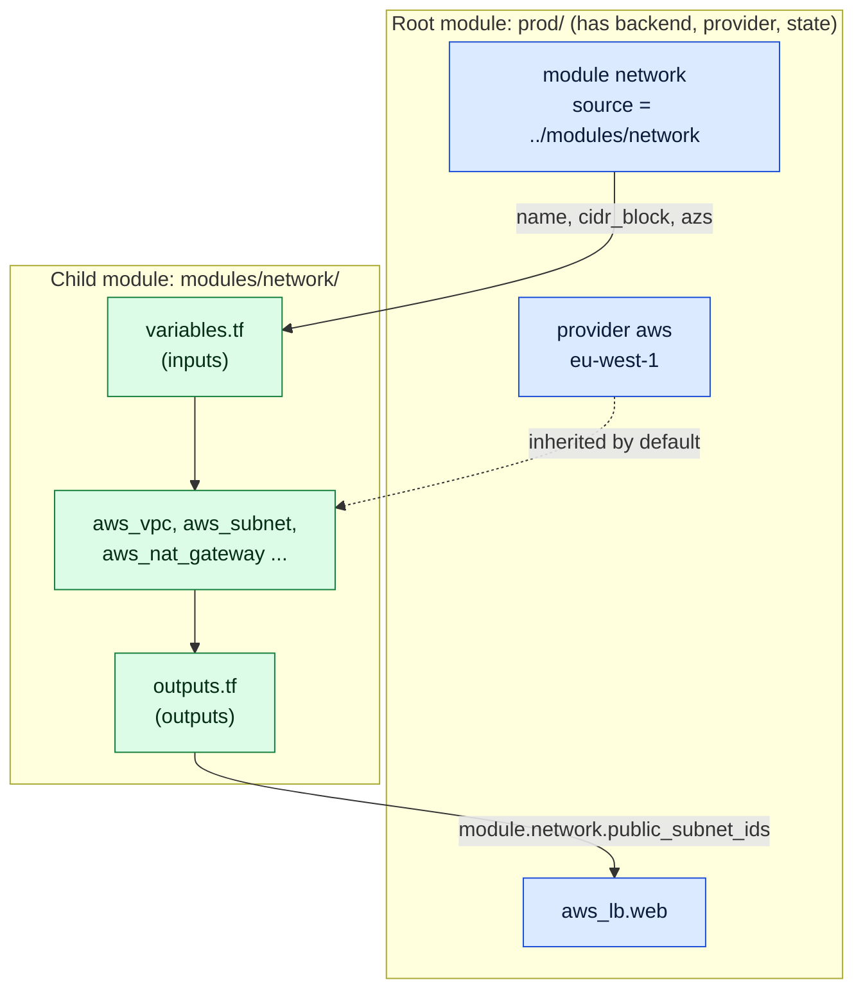

# Terraform modules

> [!abstract] In one sentence
> A Terraform **module** is just a folder of `.tf` files with **inputs** (variables) and **outputs**: the folder I run `terraform plan` in is the **root module**, and any folder it calls with a `module` block is a **child module**, which lets me write a VPC (Virtual Private Cloud) or a service once, version it like a library, and stamp it out for every environment or team without copy-pasting.

## Build-up: the shop's network gets copied three times

Acme runs the shop on AWS (Amazon Web Services) in `eu-west-1`. The first Terraform configuration (see [[Terraform]]) was one folder: a VPC, subnets, a NAT (Network Address Translation) gateway, an ALB (Application Load Balancer), some EC2 (Elastic Compute Cloud) instances. It worked for one environment.

### Stage 1: copy-paste per environment

Then staging was needed, then a second region for disaster recovery. The fastest move was to copy the folder:

```
infra/
├── dev/
│   └── network.tf      # 180 lines
├── staging/
│   └── network.tf      # 180 lines, copied from dev, CIDR changed
└── prod/
    └── network.tf      # 185 lines, copied from staging, plus a flow-logs fix
```

**The problems** show up within a month:
- A security fix (VPC flow logs, or closing the default security group) is applied to `prod/` and forgotten in `dev/`. The three copies **drift apart**, and nobody can say which one is "right"
- Every reviewer reads 180 lines to find the 3 that differ between environments
- A new team wanting "a VPC like the shop's" copies it a fourth time
- This is the opposite of DRY (Don't Repeat Yourself): the same knowledge lives in several places

### Stage 2: pull the shared part into a module

A module is not a special file type. It's a **folder**. I move the network resources into `modules/network/` and turn every value that differs per environment into a **variable**:

```
infra/
├── modules/
│   └── network/
│       ├── main.tf          # the resources
│       ├── variables.tf     # the inputs (the module's "parameters")
│       ├── outputs.tf       # the outputs (the module's "return values")
│       └── versions.tf      # which Terraform and provider versions it needs
├── dev/
│   └── main.tf              # calls the module with dev values
└── prod/
    └── main.tf              # calls the module with prod values
```

`modules/network/variables.tf`, the interface callers fill in:

```hcl
variable "name" {
  description = "Prefix for every resource name, e.g. shop-prod"
  type        = string
}

variable "cidr_block" {
  description = "IPv4 range of the VPC"
  type        = string

  validation {
    condition     = can(cidrnetmask(var.cidr_block))
    error_message = "cidr_block must be a valid IPv4 CIDR, e.g. 10.0.0.0/16."
  }
}

variable "azs" {
  description = "Availability Zones to spread subnets over"
  type        = list(string)
}

variable "single_nat_gateway" {
  description = "One NAT gateway for all AZs (cheap, for dev) instead of one per AZ"
  type        = bool
  default     = false
}

variable "tags" {
  description = "Extra tags added to every resource"
  type        = map(string)
  default     = {}
}
```

`modules/network/main.tf`, the resources, using only `var.*` (never hard-coded environment values):

```hcl
locals {
  public_subnets  = { for i, az in var.azs : az => cidrsubnet(var.cidr_block, 8, i) }
  private_subnets = { for i, az in var.azs : az => cidrsubnet(var.cidr_block, 8, i + 10) }
  nat_azs         = var.single_nat_gateway ? [var.azs[0]] : var.azs
}

resource "aws_vpc" "this" {
  cidr_block           = var.cidr_block
  enable_dns_hostnames = true
  tags                 = merge(var.tags, { Name = var.name })
}

resource "aws_subnet" "public" {
  for_each                = local.public_subnets
  vpc_id                  = aws_vpc.this.id
  cidr_block              = each.value
  availability_zone       = each.key
  map_public_ip_on_launch = true
  tags                    = merge(var.tags, { Name = "${var.name}-public-${each.key}", Tier = "public" })
}

resource "aws_subnet" "private" {
  for_each          = local.private_subnets
  vpc_id            = aws_vpc.this.id
  cidr_block        = each.value
  availability_zone = each.key
  tags              = merge(var.tags, { Name = "${var.name}-private-${each.key}", Tier = "private" })
}

resource "aws_internet_gateway" "this" {
  vpc_id = aws_vpc.this.id
  tags   = merge(var.tags, { Name = var.name })
}

resource "aws_eip" "nat" {
  for_each = toset(local.nat_azs)
  domain   = "vpc"
}

resource "aws_nat_gateway" "this" {
  for_each      = toset(local.nat_azs)
  allocation_id = aws_eip.nat[each.key].id
  subnet_id     = aws_subnet.public[each.key].id
  tags          = merge(var.tags, { Name = "${var.name}-nat-${each.key}" })
}

# route tables omitted here for length: one public table to the IGW,
# one private table per AZ to "its" NAT gateway (or the single one)
```

`modules/network/outputs.tf`, what callers are allowed to depend on:

```hcl
output "vpc_id" {
  description = "ID of the VPC"
  value       = aws_vpc.this.id
}

output "public_subnet_ids" {
  description = "Public subnet IDs, one per AZ, in var.azs order"
  value       = [for az in var.azs : aws_subnet.public[az].id]
}

output "private_subnet_ids" {
  description = "Private subnet IDs, one per AZ, in var.azs order"
  value       = [for az in var.azs : aws_subnet.private[az].id]
}
```

`modules/network/versions.tf`:

```hcl
terraform {
  required_version = ">= 1.10"
  required_providers {
    aws = {
      source  = "hashicorp/aws"
      version = ">= 6.0, < 7.0"   # a range: the caller pins the exact version
    }
  }
}
```

Now `prod/main.tf` is short, and the only things in it are what makes prod **prod**:

```hcl
provider "aws" {
  region = "eu-west-1"
}

module "network" {
  source = "../modules/network"

  name       = "shop-prod"
  cidr_block = "10.0.0.0/16"
  azs        = ["eu-west-1a", "eu-west-1b", "eu-west-1c"]
  tags       = { Environment = "prod", Team = "shop" }
}

# Use the outputs like attributes of a resource
resource "aws_lb" "web" {
  name               = "shop-prod"
  load_balancer_type = "application"
  subnets            = module.network.public_subnet_ids
  security_groups    = [aws_security_group.alb.id]
}
```

And `dev/main.tf` differs in four values: `name = "shop-dev"`, `cidr_block = "10.1.0.0/16"`, two AZs (Availability Zones), `single_nat_gateway = true`.

**Root vs child module**, the two words that confuse at first:
- The **root module** is the folder where I run `terraform init/plan/apply`. It has the backend, the provider configuration and the state (see [[Terraform state]])
- A **child module** is any folder called with a `module "x" { source = ... }` block. It has no state of its own: its resources are stored in the root's state under the address `module.network.aws_vpc.this`
- Every Terraform folder is technically a module. "Module" in conversation usually means a reusable child module

After adding or changing a `module` block, I have to run `terraform init` again: init downloads (or links) module sources into `.terraform/modules/`.

```
$ terraform init
Initializing the backend...
Initializing modules...
- network in ../modules/network
Initializing provider plugins...
- Reusing previous version of hashicorp/aws from the dependency lock file
- Using previously-installed hashicorp/aws v6.14.0

Terraform has been successfully initialized!
```



A module is a **black box with a contract**: callers see variables in and outputs out. They can't reach inside (`module.network.aws_vpc.this.arn` is an error); if they need the ARN (Amazon Resource Name), the module has to output it.

### Stage 3: the module needs a version

Now prod and dev both use `../modules/network`. Someone changes the module to add flow logs, and the next `terraform plan` in **prod** picks it up immediately, even though it's only been tried in dev. A relative path means "whatever is in this folder right now": there's no way to test a module change in dev while prod stays on the old one.

The fix is to treat the module like a library with **releases**. Module **sources**:

| Source | Example | Version pinned by | Good for |
|---|---|---|---|
| Local path | `source = "../modules/network"` | Nothing: always the current files | Modules that only live inside one root, or a monorepo where the same commit is deployed everywhere |
| Git | `source = "git::https://github.com/acme/terraform-modules.git//network?ref=network-v1.4.0"` | `?ref=` (tag, branch or commit SHA) | Internal modules shared across repos |
| Git over SSH (Secure Shell) | `source = "git::ssh://git@github.com/acme/terraform-modules.git//network?ref=v1.4.0"` | `?ref=` | Private repos with deploy keys |
| Terraform Registry | `source = "terraform-aws-modules/vpc/aws"` + `version = "~> 6.0"` | `version` argument | Public modules, or a private registry (HCP (HashiCorp Cloud Platform) Terraform) |
| S3 (Simple Storage Service) / HTTP (Hypertext Transfer Protocol) archive | `source = "s3::https://s3-eu-west-1.amazonaws.com/acme-modules/network-1.4.0.zip"` | The file name | Air-gapped or artifact-store setups |

Details that bite:
- The `//network` after the repo URL (Uniform Resource Locator) selects a **subdirectory** inside the repo (double slash)
- `version =` only works for **registry** sources. For Git, the version is `?ref=`. Writing `version = "1.4.0"` on a Git source is an error
- `?ref=main` is a moving target, just like the local path. Pin a **tag** (or a commit SHA (Secure Hash Algorithm) if the tags are mutable)

So prod pins the released version, and dev tries the new one:

```hcl
# prod/main.tf
module "network" {
  source = "git::https://github.com/acme/terraform-modules.git//network?ref=network-v1.4.0"
  # ...
}

# dev/main.tf
module "network" {
  source = "git::https://github.com/acme/terraform-modules.git//network?ref=network-v1.5.0"
  # ...
}
```

Upgrading prod becomes a one-line pull request whose plan shows exactly what the new module version changes.

### Stage 4: releasing internal modules

A modules repository with **semver** (semantic versioning: MAJOR.MINOR.PATCH):
- **PATCH** (`1.4.0 → 1.4.1`): a bug fix, the plan for callers is empty or only fixes the bug
- **MINOR** (`1.4.1 → 1.5.0`): a new optional input with a default, a new output. Existing callers' plans don't change
- **MAJOR** (`1.5.0 → 2.0.0`): a breaking change: a required input added, an input renamed, or a resource **address** changed so callers would see destroy/create

The release routine:
1. Change the module, update `CHANGELOG.md` with an "Upgrade notes" line for anything a caller must do
2. CI (Continuous Integration) runs `terraform fmt -check`, `validate`, `tflint` and the module's `terraform test` files (see [[Terraform testing and validation]])
3. Merge, then tag: `git tag network-v1.5.0 && git push --tags` (one tag prefix per module when several live in one repo, or one repo per module named `terraform-<provider>-<name>` if publishing to a registry)
4. Bump dev, look at the plan, apply, then staging, then prod (see [[Terraform environments and project layout]])

```markdown
## network-v2.0.0
### Breaking
- `private_subnets` is now keyed by AZ name instead of index.
  Upgrade: no action, `moved` blocks are included. Plan must show 0 to destroy.
- New required input `flow_logs_bucket_arn`.
```

### Stage 5: designing modules that age well

The difference between a module people enjoy and one they fork.

**Small and composable, not one giant "platform" module.** A `network` module, a `service` module, a `database` module, each with a clear job. The root module **composes** them by wiring outputs to inputs:

```hcl
module "network" {
  source = "git::https://github.com/acme/terraform-modules.git//network?ref=network-v1.5.0"
  name   = "shop-prod"
  # ...
}

module "db" {
  source     = "git::https://github.com/acme/terraform-modules.git//postgres?ref=postgres-v3.1.0"
  name       = "shop-prod"
  vpc_id     = module.network.vpc_id
  subnet_ids = module.network.private_subnet_ids
}

module "web" {
  source     = "git::https://github.com/acme/terraform-modules.git//ecs-service?ref=ecs-service-v2.2.0"
  name       = "shop-web"
  vpc_id     = module.network.vpc_id
  subnet_ids = module.network.private_subnet_ids
  db_secret  = module.db.credentials_secret_arn
}
```

The alternative, modules calling modules calling modules (`platform → environment → service → network`), looks tidy but every inner variable has to be threaded through every layer, and one change ripples through four version bumps. Keep the tree **flat**: one level of child modules, at most two.

**No `provider` blocks inside a reusable module.** A module that declares `provider "aws" { region = "eu-west-1" }` can't be used in another region, can't be used with `for_each`/`count`, and can't be removed cleanly (Terraform needs the provider config to destroy its resources). The module declares only `required_providers`; the caller configures providers, and the module **inherits** the default ones.

When the module needs a *specific* provider configuration (another region, another account), the caller passes it explicitly (aliases are explained in [[Terraform providers]]):

```hcl
provider "aws" {
  region = "eu-west-1"
}

provider "aws" {
  alias  = "us_east_1"
  region = "us-east-1"   # CloudFront certificates must live here
}

module "cdn" {
  source = "./modules/cdn"
  providers = {
    aws           = aws
    aws.us_east_1 = aws.us_east_1
  }
}
```

and the module declares that it expects a second configuration:

```hcl
# modules/cdn/versions.tf
terraform {
  required_providers {
    aws = {
      source                = "hashicorp/aws"
      version               = ">= 6.0"
      configuration_aliases = [aws.us_east_1]
    }
  }
}

# modules/cdn/main.tf
resource "aws_acm_certificate" "cdn" {
  provider          = aws.us_east_1
  domain_name       = var.domain_name
  validation_method = "DNS"
}
```

**Outputs are the interface.** Output IDs (identifiers) and ARNs callers will need (VPC ID (identifier), subnet IDs, security group ID, role ARN). Don't output whole resource objects (`value = aws_vpc.this`): it couples callers to provider internals and breaks on provider upgrades.

**Sensible defaults, required only when it must differ.** `single_nat_gateway = false` (safe for prod), `enable_flow_logs = true`. A caller should get a secure, production-shaped result by filling only the required inputs.

**Validate inputs early.** `validation` blocks turn "error from the AWS API (Application Programming Interface) five minutes into apply" into a clear message at plan time:

```hcl
variable "environment" {
  type = string
  validation {
    condition     = contains(["dev", "staging", "prod"], var.environment)
    error_message = "environment must be dev, staging or prod."
  }
}
```

**Typed objects instead of ten loose variables** when values belong together:

```hcl
variable "scaling" {
  type = object({
    min     = number
    max     = number
    cpu_pct = optional(number, 60)   # optional attribute with a default
  })
  default = { min = 2, max = 6 }
}
```

**Don't wrap a single resource.** A module that just wraps `aws_s3_bucket` with the same arguments renamed adds a layer and hides nothing. A module earns its place when it encodes a decision: "an S3 bucket the Acme way" = bucket + public access block + encryption + versioning + lifecycle + bucket policy that denies non-TLS (Transport Layer Security).

### Stage 6: several copies of one module with `for_each`

Since Terraform 0.13, `count` and `for_each` work on `module` blocks. Acme has three small internal services that each need the same "service" building blocks:

```hcl
locals {
  services = {
    web     = { port = 8080, cpu = 512, desired = 3 }
    api     = { port = 8000, cpu = 1024, desired = 3 }
    emailer = { port = 9000, cpu = 256, desired = 1 }
  }
}

module "service" {
  source   = "git::https://github.com/acme/terraform-modules.git//ecs-service?ref=ecs-service-v2.2.0"
  for_each = local.services

  name          = "shop-${each.key}"
  port          = each.value.port
  cpu           = each.value.cpu
  desired_count = each.value.desired
  vpc_id        = module.network.vpc_id
  subnet_ids    = module.network.private_subnet_ids
}

output "service_urls" {
  value = { for k, m in module.service : k => m.url }
}
```

Addresses become `module.service["web"].aws_ecs_service.this`. Prefer `for_each` with a map over `count`: removing `api` from the map destroys only the `api` copy, while with `count` removing a middle element shifts the indexes and replaces the ones after it (see [[Terraform resources and data sources]]). This only works because the module has no `provider` block inside.

### Stage 7: refactoring existing resources into a module with `moved`

The problem: prod already exists, built from the flat copy-paste files. The resources live in state at `aws_vpc.main`, `aws_subnet.public[0]`... If I replace those files with `module "network"`, Terraform sees the old addresses gone and new ones appear:

```
Plan: 14 to add, 0 to change, 14 to destroy.
```

That's deleting and recreating the production VPC. The resources are the same; only their **address in state** changed. `moved` blocks (Terraform 1.1+) tell Terraform so:

```hcl
# prod/moved.tf
moved {
  from = aws_vpc.main
  to   = module.network.aws_vpc.this
}

moved {
  from = aws_subnet.public[0]
  to   = module.network.aws_subnet.public["eu-west-1a"]
}

moved {
  from = aws_subnet.public[1]
  to   = module.network.aws_subnet.public["eu-west-1b"]
}
# ... one per resource instance
```

```
$ terraform plan
  # aws_vpc.main has moved to module.network.aws_vpc.this
    resource "aws_vpc" "this" {
        id   = "vpc-0a1b2c3d4e5f60718"
        # (12 unchanged attributes hidden)
    }

Plan: 0 to add, 0 to change, 0 to destroy.
```

The target is **zero to destroy**. If the plan still shows changes, they're real differences between the old resources and the module's settings (a missing tag, a different name), and I fix the inputs or accept them deliberately.

`moved` blocks are reviewed in a pull request and applied by the normal pipeline, unlike `terraform state mv` which edits state by hand with no review (see [[Terraform state]]). Module authors also ship `moved` blocks **inside** the module when they rename resources between versions, so callers upgrade with an empty plan. Keep them for a while (until every caller has applied), then delete them in a later major version.

## The standard module structure

The layout Terraform tooling, the registry and `terraform-docs` expect:

```
terraform-aws-network/            # registry naming: terraform-<PROVIDER>-<NAME>
├── README.md                     # what it does, usage example, generated inputs/outputs table
├── CHANGELOG.md
├── main.tf                       # the resources (split into network.tf, nat.tf... if large)
├── variables.tf                  # every input, each with description and type
├── outputs.tf                    # every output, each with description
├── versions.tf                   # required_version and required_providers (no provider blocks)
├── moved.tf                      # refactoring history (optional)
├── examples/
│   ├── simple/main.tf            # minimal working call, also used by tests
│   └── complete/main.tf          # every option
├── modules/                      # nested sub-modules, if any (kept small)
│   └── flow-logs/
└── tests/
    └── defaults.tftest.hcl       # terraform test files
```

The `README.md` inputs/outputs table is generated, not handwritten, with **terraform-docs**:

```bash
terraform-docs markdown table --output-file README.md --output-mode inject .
```

It rewrites the section between `<!-- BEGIN_TF_DOCS -->` and `<!-- END_TF_DOCS -->` from the variables' and outputs' `description`, `type` and `default`. Run it in a pre-commit hook so the docs never go stale. This is why every variable and output gets a `description`.

## Public registry modules

The public Terraform Registry (and the OpenTofu registry, which mirrors most of it) has community modules. The best known for AWS are the **terraform-aws-modules** (`terraform-aws-modules/vpc/aws`, `.../eks/aws`, `.../rds/aws`...):

```hcl
module "vpc" {
  source  = "terraform-aws-modules/vpc/aws"
  version = "~> 6.0"

  name            = "shop-prod"
  cidr            = "10.0.0.0/16"
  azs             = ["eu-west-1a", "eu-west-1b", "eu-west-1c"]
  private_subnets = ["10.0.10.0/24", "10.0.11.0/24", "10.0.12.0/24"]
  public_subnets  = ["10.0.0.0/24", "10.0.1.0/24", "10.0.2.0/24"]

  enable_nat_gateway = true
  single_nat_gateway = false
}
```

| Pros | Cons |
|---|---|
| Battle-tested by thousands of users; edge cases already handled | Huge: hundreds of inputs to cover every use case, hard to read and review |
| Fast to start, good defaults | Major versions sometimes force refactors (and provider upgrades) on their schedule |
| Maintained as AWS adds features | A dependency on someone else's code that runs with my credentials: pin versions, read changelogs |
| Good for learning how a resource set fits together | Abstractions I don't control; debugging means reading their code |

What I'd do: use them for big, generic building blocks (VPC, EKS (Elastic Kubernetes Service)) with a pinned `version`, and wrap them in a thin internal module when Acme-specific decisions (naming, tags, mandatory flow logs) must be enforced. Write my own for anything small or company-specific. Never use an unpinned registry module: without `version`, `terraform init -upgrade` takes the newest, including a new major.

## Advanced problems

### 1. "Module not installed" after changing the source
**Symptom:** `Error: Module not installed. This module is not yet installed. Run "terraform init" to install all modules required by this configuration.`
**Cause:** `source` or `ref` changed, and `.terraform/modules/` still holds the old copy.
**Fix:** `terraform init` (add `-upgrade` to re-fetch a registry module within the version constraint). In CI, init runs every time so this only hits locally.

### 2. A module upgrade wants to replace resources
**Symptom:** bumping `network-v1.5.0 → v2.0.0` shows `14 to destroy`.
**Cause:** the module renamed resources or switched `count` to `for_each` without `moved` blocks, so addresses changed.
**Fix:** don't apply. Add the missing `moved` blocks (in the module, as a patch release, or in the caller's root module), re-plan until `0 to destroy`. Read the module's CHANGELOG upgrade notes before bumping a major.

### 3. Can't remove a module: "Provider configuration not present"
**Symptom:** after deleting a `module` block, plan fails with `Error: Provider configuration not present ... module.legacy.aws_s3_bucket.logs ... its original provider configuration at module.legacy.provider["registry.terraform.io/hashicorp/aws"] is required, but it has been removed`.
**Cause:** the module had its own `provider` block. Removing the module removed the provider config needed to destroy its resources.
**Fix:** put the module back, move its provider config to the root and pass it with `providers = {}`, apply, then remove the module. The lasting fix is never putting `provider` blocks in reusable modules.

### 4. "Invalid for_each argument" on a module
**Symptom:** `The "for_each" map includes keys derived from resource attributes that cannot be determined until apply`.
**Cause:** the map keys come from something unknown until apply (a generated ID). Keys must be known at plan time.
**Fix:** key by static values (names from variables), and keep the unknown values in the map's **values**, not keys.

### 5. Diamond dependencies and version skew
**Symptom:** two modules each call a shared `tags` or `naming` sub-module at different versions, or require incompatible provider versions: `init` fails with `no available releases match the given constraints >= 6.0, < 6.5, >= 6.8`.
**Cause:** provider versions are resolved **once for the whole root**. Child modules only state ranges.
**Fix:** modules use broad ranges (`>= 6.0, < 7.0`), the root pins exactly via the lock file. Keep nesting shallow so skew is visible.

### 6. Hidden coupling through data sources
**Symptom:** the module works in dev and fails in a new account with `no matching VPC found`.
**Cause:** the module looked up things by itself (`data "aws_vpc" "main" { tags = { Name = "main" } }`) instead of taking them as inputs.
**Fix:** pass IDs in as variables. A module should depend on its inputs, not on what happens to exist in the account.

## Practice

> [!example]- I run `terraform apply` in `prod/`, which calls `module "network"`. Where is the state for the VPC stored?
> In the **root module's** state (prod's backend), at address `module.network.aws_vpc.this`. Child modules have no state of their own.

> [!example]- Prod and dev both use `source = "../modules/network"`. A colleague edits the module for a dev experiment. What happens to prod, and what's the fix?
> The next prod plan picks up the change immediately, because a local path has no version. Fix: publish the module from a separate repo (or path) with tags and reference `?ref=network-vX.Y.Z` (or a registry `version`), so each environment chooses when to upgrade.

> [!example]- Why does `version = "1.4.0"` fail on `source = "git::https://github.com/acme/terraform-modules.git//network"`?
> `version` is only for registry sources. For Git sources the version goes in the URL: `?ref=network-v1.4.0`.

> [!example]- A caller needs the VPC's ARN but the module only outputs `vpc_id`. Can they write `module.network.aws_vpc.this.arn`?
> No: a module's internals aren't accessible. Add `output "vpc_arn"` to the module (a minor release) and use `module.network.vpc_arn`.

> [!example]- Moving prod's flat files into a module, the plan shows `14 to add, 14 to destroy`. What do I do?
> Add a `moved { from = <old address> to = module.network.<new address> }` block per resource instance and re-plan until it shows 0 to destroy. Only leftover real attribute differences should remain.

## Easy to get wrong
- Using a local path or `?ref=main` for a module shared by several environments: every environment gets every change at once
- Putting `version =` on a Git source (only registry sources take it)
- Forgetting the double slash `//subdir` when the module is in a subfolder of a repo
- Declaring `provider` blocks inside a reusable module: breaks `for_each`/`count`, other regions, and removing the module
- Outputting whole resources instead of IDs/ARNs: callers couple to provider internals
- Renaming resources in a module without `moved` blocks: every caller's next plan destroys and recreates
- Wrapping a single resource in a module with renamed arguments: a layer with no decision in it
- Nesting modules three or four deep: every variable threaded through every layer
- Using `count` on modules for a list that can shrink in the middle: index shift replaces copies
- Running `plan` after changing `source` without `terraform init`

## Related
- Builds on:: [[Terraform]], [[Terraform language syntax]], [[Terraform variables, locals and outputs]], [[Terraform resources and data sources]]
- Uses:: [[Terraform providers]] (passing provider configurations), [[Terraform state]] (module addresses, `moved`)
- Next step:: [[Terraform environments and project layout]], [[Terraform testing and validation]]
- Applied in:: [[Terraform worked example]], [[Terraform in production]], [[ECS production stack]]
- Area:: [[Infrastructure as code]]

## Flashcards
#flashcards

What is a Terraform module? :: A folder of .tf files with variables as inputs and outputs as return values
Root module vs child module? :: The root is the folder where plan/apply run (backend, providers, state); a child is any folder called with a module block
Where is the state of a child module's resources? :: In the root module's state, under addresses like module.network.aws_vpc.this
What must you run after changing a module's source? :: terraform init, which downloads or links modules into .terraform/modules
How do you pin a Git module source? :: ?ref= on the URL, a tag like ?ref=network-v1.4.0 (or a commit SHA)
What does // mean in a module source URL? :: It selects a subdirectory inside the repository or archive
Which module sources accept the version argument? :: Only registry sources (public or private registry)
Why avoid local-path modules shared by several environments? :: No versioning: a change reaches every environment on its next plan
Semver for modules: what makes a MAJOR release? :: A breaking change: required input added, input renamed, or resource addresses changed
Why no provider blocks in reusable modules? :: They block for_each/count on the module, fix the region/account, and make removing the module impossible
How does a module use a second provider configuration? :: configuration_aliases in required_providers; the caller passes it with providers = { aws.us_east_1 = aws.us_east_1 }
What is a module's interface? :: Its variables (inputs) and outputs; callers can't reach resources inside it
Composition vs deep nesting? :: Prefer a flat root that wires small modules' outputs to inputs over modules calling modules several levels deep
Why for_each over count on modules? :: Removing a map key destroys only that copy; removing a list element shifts indexes and replaces later copies
What does a moved block do? :: Tells Terraform a resource's address changed so it updates state instead of destroying and recreating
What plan result means a refactor into a module is safe? :: 0 to destroy (ideally 0 to add, 0 to change)
moved block vs terraform state mv? :: moved is code: reviewed in a pull request and applied by the pipeline; state mv edits state by hand without review
What is the standard module structure? :: main.tf, variables.tf, outputs.tf, versions.tf, README.md, examples/, tests/, optional modules/
What does terraform-docs do? :: Generates the README inputs/outputs table from variables' and outputs' descriptions, types and defaults
Main risk of public registry modules? :: Large, someone else's code with my credentials and their upgrade schedule: pin version and read changelogs
Why can for_each keys not come from resource IDs? :: Keys must be known at plan time; unknown values belong in the map values
