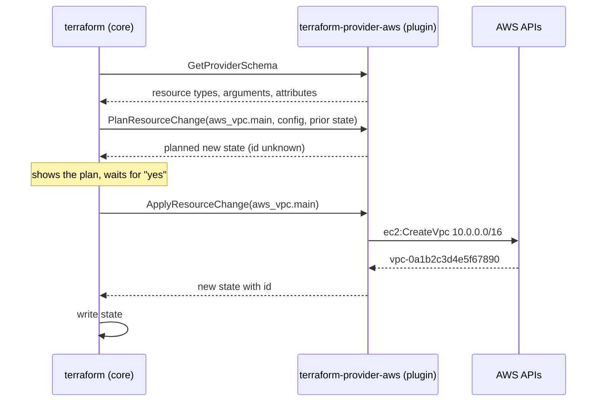

# Terraform providers

> [!abstract] In one sentence
> Terraform itself knows nothing about AWS (Amazon Web Services), GitHub or Kubernetes: a **provider** is a separate plugin, downloaded by `terraform init`, that translates resource blocks into API (application programming interface) calls; I pin **which** provider and **which versions** in `required_providers`, the **lock file** freezes the exact build, the `provider` block says **where and as whom** to connect, and **aliases** give me several connections (regions, accounts) in one project.

## Build-up: from "it works on my laptop" to a reproducible toolchain

### Stage 1: where does `aws_vpc` come from?

The Terraform binary is a general engine: it parses HCL (HashiCorp Configuration Language), builds the graph, keeps [[Terraform state]] and computes plans. It has no idea what a VPC (Virtual Private Cloud) is. Every resource type is implemented by a **provider**: a separate executable that Terraform starts as a child process and talks to over gRPC (Google Remote Procedure Call, a binary RPC protocol) on the local machine.



The provider's job for each resource type is **CRUD** (Create, Read, Update, Delete) plus "plan this change": it knows that changing a subnet's `cidr_block` forces replacement, that `ec2:CreateVpc` is the call, and how to read the VPC back to detect drift. Core handles everything else. That split is why one Terraform can manage AWS, Cloudflare DNS (Domain Name System), GitHub repositories and Datadog monitors in the same plan: thousands of providers exist on the public registry.

### Stage 2: declaring which provider, and from where

```hcl
# versions.tf
terraform {
  required_version = ">= 1.10.0, < 2.0.0"

  required_providers {
    aws = {
      source  = "hashicorp/aws"       # registry.terraform.io/hashicorp/aws
      version = "~> 6.0"
    }
    random = {
      source  = "hashicorp/random"
      version = "~> 3.6"
    }
  }
}
```

- `source` is `<namespace>/<type>`, short for `registry.terraform.io/<namespace>/<type>`. The **local name** (`aws`) is what resource types start with: `aws_vpc` belongs to the provider named `aws` here
- `required_version` constrains the **Terraform CLI (command-line interface)** itself, so a teammate on an old version gets a clear error instead of weird behaviour

`terraform init` reads this, downloads matching providers into `.terraform/providers/`, and records the choice:

```text
$ terraform init
Initializing the backend...
Initializing provider plugins...
- Finding hashicorp/aws versions matching "~> 6.0"...
- Finding hashicorp/random versions matching "~> 3.6"...
- Installing hashicorp/aws v6.14.0...
- Installed hashicorp/aws v6.14.0 (signed by HashiCorp)
- Installing hashicorp/random v3.7.2...
- Installed hashicorp/random v3.7.2 (signed by HashiCorp)
Terraform has created a lock file .terraform.lock.hcl to record the provider
selections it made above. Include this file in your version control repository
so that Terraform can guarantee to make the same selections by default when
you run "terraform init" in the future.

Terraform has been successfully initialized!
```

> [!info] OpenTofu
> OpenTofu (the open-source fork of Terraform, created after the 2023 licence change) uses the same provider protocol and the same providers, from its own registry `registry.opentofu.org`. `source = "hashicorp/aws"` works unchanged in both.

### Stage 3: version constraints

Without a `version`, `init` takes the newest release. The day AWS provider 7.0 ships with breaking changes, a new CI (continuous integration) runner picks it up and the plan wants to change half the account. Constraints:

| Constraint | Allows | Use for |
|---|---|---|
| `"6.14.0"` or `"= 6.14.0"` | Exactly that | Rarely: blocks even bug fixes |
| `"~> 6.14"` | `>= 6.14, < 7.0` | Root modules: new minors, no new major |
| `"~> 6.14.0"` | `>= 6.14.0, < 6.15.0` | Very conservative: patches only |
| `">= 5.0"` | Anything from 5.0 up, including 7, 8… | **Reusable modules**: the widest range they really work with |
| `">= 5.0, < 7.0"` | 5.x and 6.x | Modules that know 7.x breaks them |

The `~>` operator ("pessimistic constraint") allows only the **rightmost** component to grow: `~> 6.0` means `6.x`, `~> 6.14.0` means `6.14.x`.

The rule: **reusable modules** ([[Terraform modules]]) state the *minimum* they need (`>= 5.0`), because a module with a tight pin forces every caller onto that version and two modules with incompatible pins can't be used together. **Root modules** (the ones I `apply`) are where I narrow it down (`~> 6.0`), and the lock file does the final pinning.

### Stage 4: the lock file, freezing the exact build

`~> 6.0` still allows 6.14 today and 6.20 next month. Two engineers running `init` a month apart would get different providers. The **dependency lock file** `.terraform.lock.hcl` fixes that:

```hcl
# This file is maintained automatically by "terraform init".
# Manual edits may be lost in future updates.

provider "registry.terraform.io/hashicorp/aws" {
  version     = "6.14.0"
  constraints = "~> 6.0"
  hashes = [
    "h1:3XqYk2c...=",
    "zh:0a7e2b1...",
    "zh:1f9c8d4...",
    # one zh: hash per platform package, one h1: per platform as installed
  ]
}
```

- Once it exists, `init` installs **exactly** `6.14.0`, even if 6.20 exists and matches `~> 6.0`
- The **hashes** are checksums of the provider package: if a download doesn't match (a tampered mirror, a corrupted cache), `init` refuses it
- **Commit it.** It's the `package-lock.json` of Terraform. Don't commit `.terraform/` (the downloaded binaries)

Upgrading is then a deliberate act, done in a branch:

```bash
terraform init -upgrade        # re-resolve within the constraints, rewrite the lock file
terraform plan                 # anything changed because of the new provider?
git diff .terraform.lock.hcl   # review: 6.14.0 -> 6.20.0
```

**The multi-platform trap.** I run `init` on my Mac (arm64); the lock file gets the `h1:` hash for `darwin_arm64` only. CI runs on Linux amd64 and fails:

```text
Error: Failed to install provider

Error while installing hashicorp/aws v6.14.0: the local package for
registry.terraform.io/hashicorp/aws 6.14.0 doesn't match any of the checksums
previously recorded in the dependency lock file
```

Fix: record hashes for every platform the team and CI use:

```bash
terraform providers lock \
  -platform=linux_amd64 \
  -platform=linux_arm64 \
  -platform=darwin_arm64 \
  -platform=windows_amd64
```

### Stage 5: configuring the connection, without secrets in code

The `provider` block configures *where* and *as whom*:

```hcl
# providers.tf
provider "aws" {
  region = "eu-west-1"

  default_tags {
    tags = {
      Project   = "shop"
      ManagedBy = "terraform"
      Repo      = "acme/infra"
    }
  }
}
```

**Credentials never go in here.** `access_key = "AKIA…"` in a `.tf` file ends up in Git, in every clone and in CI logs. The AWS provider uses the same credential chain as the AWS CLI, in this order:

1. Environment variables: `AWS_ACCESS_KEY_ID` / `AWS_SECRET_ACCESS_KEY` / `AWS_SESSION_TOKEN`
2. A profile: `AWS_PROFILE=acme-prod` (or `profile = "acme-prod"` in the block, which is fine because a profile name isn't a secret), including SSO (single sign-on) profiles after `aws sso login`
3. Web identity: `AWS_ROLE_ARN` + `AWS_WEB_IDENTITY_TOKEN_FILE`, what GitHub Actions OIDC (OpenID Connect) uses ([[Connecting GitHub Actions to AWS]])
4. The instance profile or container role when running on EC2 (Elastic Compute Cloud) or ECS (Elastic Container Service)

On my laptop:

```bash
aws sso login --profile acme-sso
export AWS_PROFILE=acme-sso
terraform plan
```

**Assuming a role** from the provider, so the same base identity can work on several accounts with temporary credentials from [[STS]] (Security Token Service):

```hcl
provider "aws" {
  region = "eu-west-1"

  assume_role {
    role_arn     = "arn:aws:iam::111122223333:role/terraform-deploy"   # ARN: Amazon Resource Name
    session_name = "terraform-shop"
  }
}
```

`default_tags` tags **every** taggable resource from this provider, so cost reports and "who created this?" questions have answers without remembering `tags` on each resource. Resource-level `tags` merge on top.

> [!warning] `default_tags` and a resource with the same tag key
> If a resource sets the same key with the same value as `default_tags`, some resource types show a perpetual diff. Keep keys distinct: `default_tags` for the organisational ones (`Project`, `ManagedBy`), resource `tags` for `Name` and specifics.

### Stage 6: two regions in one project, with aliases

The shop's static site goes behind CloudFront. CloudFront only accepts ACM (AWS Certificate Manager) certificates from **`us-east-1`**, but everything else lives in `eu-west-1`. One `provider "aws"` block can only have one region. Answer: a second configuration of the same provider, with an **alias**:

```hcl
provider "aws" {
  region = "eu-west-1"                 # the default: used when nothing says otherwise
}

provider "aws" {
  alias  = "us_east_1"
  region = "us-east-1"
}

resource "aws_acm_certificate" "cdn" {
  provider          = aws.us_east_1    # meta-argument: which configuration
  domain_name       = "shop.example.com"
  validation_method = "DNS"
}

resource "aws_s3_bucket" "site" {      # no provider argument: default, eu-west-1
  bucket = "acme-shop-site"
}
```

The same pattern gives **multi-account**: a provider per account, each assuming a different role. A typical case: the app account creates a Route 53 record in the shared DNS account.

```hcl
provider "aws" {
  alias  = "dns"
  region = "eu-west-1"
  assume_role {
    role_arn = "arn:aws:iam::444455556666:role/terraform-dns"
  }
}

resource "aws_route53_record" "shop" {
  provider = aws.dns
  zone_id  = data.aws_route53_zone.example.zone_id
  name     = "shop.example.com"
  type     = "A"
  # ...
}
```

### Stage 7: passing providers into modules

A child module ([[Terraform modules]]) inherits the **default** provider configurations from its caller automatically. Aliased ones it doesn't: the caller passes them explicitly, and the module declares which names it expects.

```hcl
# modules/static-site/versions.tf  (the child)
terraform {
  required_providers {
    aws = {
      source                = "hashicorp/aws"
      version               = ">= 5.0"
      configuration_aliases = [aws.us_east_1]   # "my caller must give me this one"
    }
  }
}

# modules/static-site/main.tf
resource "aws_acm_certificate" "this" {
  provider    = aws.us_east_1
  domain_name = var.domain
  validation_method = "DNS"
}
```

```hcl
# envs/prod/main.tf  (the caller)
module "site" {
  source = "../../modules/static-site"
  domain = "shop.example.com"

  providers = {
    aws           = aws             # default eu-west-1
    aws.us_east_1 = aws.us_east_1   # the alias
  }
}
```

**Rule:** reusable modules never contain `provider` blocks. A module with its own `provider "aws" { region = "…" }` can't be reused in another region, can't be used with `count`/`for_each`, and can't be removed cleanly (Terraform needs the provider configuration to destroy its resources, and it disappears with the module).

### Stage 8: providers that aren't a cloud

Much of a real project is glue from small providers:

| Provider | Typical use |
|---|---|
| `hashicorp/random` | `random_password` for a database master password, `random_id` for unique bucket suffixes. Results live in state, stable across runs |
| `hashicorp/tls` | Generate a private key or a self-signed cert (lands in state in plain text: fine for tests, not for real CAs (certificate authorities)) |
| `hashicorp/http` | Read a URL (Uniform Resource Locator) as a data source: the GitHub IP (Internet Protocol) ranges, a health check |
| `hashicorp/archive` | Zip a folder for a Lambda function |
| `hashicorp/kubernetes`, `hashicorp/helm` | Objects inside an EKS (Elastic Kubernetes Service) cluster |
| `integrations/github` | Repositories, branch protection, Actions secrets |
| `cloudflare/cloudflare`, `DataDog/datadog`, `PagerDuty/pagerduty` | DNS, monitors, on-call: the same review/plan/apply flow for things outside AWS |

```hcl
resource "random_password" "db" {
  length  = 32
  special = false
}

resource "aws_db_instance" "shop" {
  # ...
  password = random_password.db.result
}
```

> [!warning] A provider configured from another resource in the same apply
> Configuring the `kubernetes` provider from an `aws_eks_cluster` created in the **same** root module works on day one and breaks later: when the cluster is being replaced, or during plan when its endpoint is unknown, the provider can't connect. Create the cluster in one root module (state) and the in-cluster objects in another ([[Terraform environments and project layout]]).

### Stage 9: offline and controlled environments

A bank's CI runners can't reach `registry.terraform.io`. Options:

- **Provider mirror**: `terraform providers mirror ./mirror` downloads every needed provider (for the platforms given) into a directory, which is copied to an internal file server or artifact store
- **CLI configuration** (`~/.terraformrc`, or `TF_CLI_CONFIG_FILE`) tells Terraform to use it:

```hcl
provider_installation {
  filesystem_mirror {
    path    = "/opt/terraform/providers"
    include = ["registry.terraform.io/*/*"]
  }
  direct {
    exclude = ["registry.terraform.io/*/*"]
  }
}
```

- **Plugin cache** for CI speed even with internet: `TF_PLUGIN_CACHE_DIR=$HOME/.terraform.d/plugin-cache` so every job doesn't download the 600 MB AWS provider again. The lock file hashes still apply

## Advanced problems

### 1. A provider major upgrade
**Symptom:** after `init -upgrade` to a new major (AWS 5 → 6), plans show removed arguments as errors, renamed resources, or changes nobody asked for.
**Fix:** treat it like a library upgrade. Read the provider's upgrade guide, do it in a branch per root module, fix deprecation warnings on the **old** version first (they warn about what the next major removes), run `plan` on every environment and expect **no changes** before merging. Don't combine it with feature changes.

### 2. "Provider configuration not present"
**Symptom:** `To work with aws_acm_certificate.old its original provider configuration at provider["registry.terraform.io/hashicorp/aws"].us_east_1 is required, but it has been removed.`
**Fix:** Terraform needs the provider configuration to **destroy** resources it created. Put the provider block back, apply (to destroy the resources), then remove it. Same reason modules mustn't carry their own provider blocks.

### 3. Wrong account or region
**Symptom:** the plan wants to create everything from scratch: I'm authenticated to the dev account while the state is prod.
**Fix:** guard against it in the provider:

```hcl
provider "aws" {
  region              = "eu-west-1"
  allowed_account_ids = ["111122223333"]   # refuses to run against any other account
}
```

and print `aws sts get-caller-identity` at the start of every CI job.

### 4. Checksums missing on another platform
**Symptom:** CI fails with "doesn't match any of the checksums previously recorded".
**Fix:** `terraform providers lock -platform=…` for every platform in use, commit the lock file.

### 5. Throttling on big plans
**Symptom:** `Throttling: Rate exceeded` on a plan with thousands of resources.
**Fix:** the AWS provider retries with backoff (`max_retries`), but the real fix is smaller states ([[Terraform environments and project layout]]), and lowering `-parallelism` if needed.

## Practice

> [!example]- A reusable module says `version = "6.14.0"`. What goes wrong?
> Every root module using it must use exactly 6.14.0, and two modules pinned to different exact versions can't be used together. Modules should declare the minimum (`>= 5.0`); root modules narrow it, and the lock file pins.

> [!example]- I need an ACM certificate for CloudFront and a bucket in eu-west-1 in the same project. How?
> Two `provider "aws"` blocks: the default with `eu-west-1`, one with `alias = "us_east_1"` and `region = "us-east-1"`; the certificate sets `provider = aws.us_east_1`. In a module, declare `configuration_aliases` and pass it with `providers = {}`.

> [!example]- Should `.terraform.lock.hcl` be in Git? `.terraform/`?
> The lock file yes (exact versions and checksums for everyone). The `.terraform/` folder no (downloaded binaries and local metadata).

> [!example]- Where do AWS credentials for Terraform come from in CI?
> From short-lived OIDC credentials: the job assumes a role through web identity, the provider picks up the environment, nothing stored. Never access keys in `.tf` files or long-lived keys in CI secrets.

## Easy to get wrong
- Omitting `version` and getting a new major on the next `init`
- Pinning exact versions in reusable modules
- Not committing the lock file, or committing hashes for one platform only
- Thinking `~> 6.0` and `~> 6.0.0` are the same (6.x vs 6.0.x)
- Credentials in provider blocks
- `provider` blocks inside reusable modules
- Removing a provider alias while resources it created still exist
- Forgetting CloudFront certificates must come from `us-east-1`
- Configuring the `kubernetes` provider from a cluster created in the same apply
- Running against the wrong account: set `allowed_account_ids`

## Related
- Builds on:: [[Terraform]], [[Terraform language syntax]], [[Terraform resources and data sources]]
- Next step:: [[Terraform state]], [[Terraform modules]]
- Used with:: [[Terraform environments and project layout]] (one provider config per account), [[Terraform in production]] (OIDC, upgrades)
- AWS side:: [[STS]], [[Connecting GitHub Actions to AWS]], [[ECS production stack]]
- Area:: [[Infrastructure as code]]

## Flashcards
#flashcards

What is a Terraform provider? :: A plugin executable that implements resource types by translating them into API calls (CRUD + plan), talking to Terraform core over gRPC
What does Terraform core do vs a provider? :: Core parses config, builds the graph, plans and keeps state; providers know each API and resource schema
What does source = "hashicorp/aws" mean? :: The provider at registry.terraform.io/hashicorp/aws; the local name (aws) prefixes resource types
What does required_version constrain? :: The Terraform CLI version allowed to run this configuration
What does ~> 6.0 allow? :: >= 6.0 and < 7.0 (only the rightmost component grows)
What does ~> 6.14.0 allow? :: >= 6.14.0 and < 6.15.0 (patches only)
How should reusable modules constrain provider versions? :: With a minimum (>= 5.0), not a pin; root modules narrow it and the lock file pins
What is .terraform.lock.hcl? :: The dependency lock file: exact provider versions and package checksums chosen by init; commit it
How do I upgrade providers deliberately? :: terraform init -upgrade, review the lock file diff and the plan, in a branch
Why does CI fail with "doesn't match any of the checksums"? :: The lock file only has hashes for the platform it was created on; run terraform providers lock -platform=... for each
Where should AWS credentials for Terraform come from? :: The standard credential chain: env vars, profile/SSO, web identity (OIDC in CI), instance role; never the .tf files
What does default_tags do? :: Adds the given tags to every taggable resource created by that provider configuration
What is a provider alias? :: A second configuration of the same provider (another region or account), selected with provider = aws.alias
Why does CloudFront force a second AWS provider? :: CloudFront only accepts ACM certificates from us-east-1
How does a module receive an aliased provider? :: The module declares configuration_aliases; the caller passes it in providers = { aws.us_east_1 = aws.us_east_1 }
Why must reusable modules not contain provider blocks? :: They couldn't be reused across regions/accounts, used with count/for_each, or removed cleanly
Why can't I delete a provider block while its resources exist? :: Terraform needs that provider configuration to destroy them
What does allowed_account_ids protect against? :: Running a plan/apply against the wrong AWS account
What is a provider filesystem mirror for? :: Installing providers without internet access, configured in the CLI config's provider_installation block
What does TF_PLUGIN_CACHE_DIR do? :: Shares downloaded providers between projects/jobs so each init doesn't re-download them
