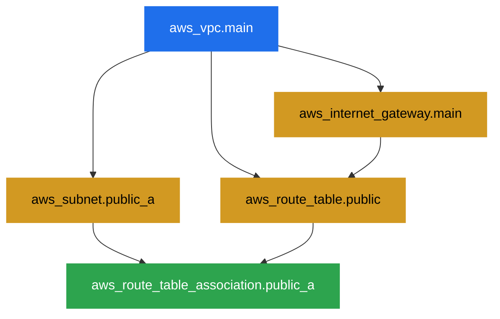
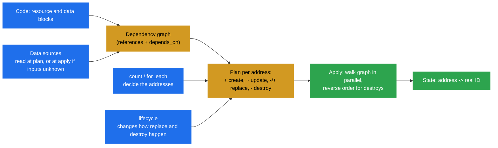

# Terraform resources and data sources

> [!abstract] In one sentence
> A `resource` block is a thing Terraform **creates and owns** (a VPC, a bucket, an instance), a `data` block is a thing Terraform only **reads** (the latest AMI, an existing VPC, the current account), and the references between them build the **dependency graph** that decides the order of every create, update and delete; the meta-arguments (`count`, `for_each`, `depends_on`, `lifecycle`, `provider`) change *how many* copies exist and *how* they're replaced.

## Build-up: the shop needs a network, servers and a bucket

Acme's shop runs on AWS (Amazon Web Services) in `eu-west-1`. The team already has a working Terraform project ([[Terraform]]) and knows the grammar of HCL (HashiCorp Configuration Language) ([[Terraform language syntax]]). Now they want to describe the real infrastructure: a VPC (Virtual Private Cloud), subnets in three AZs (Availability Zones), a few EC2 (Elastic Compute Cloud) web servers and an S3 (Simple Storage Service) bucket for product images. Each stage below adds one idea because the previous one hit a wall.

### Stage 1: one resource, and what its block means

```hcl
resource "aws_vpc" "main" {
  cidr_block           = "10.0.0.0/16"
  enable_dns_hostnames = true

  tags = {
    Name = "shop-prod"
  }
}
```

Reading the header left to right:

| Part | Meaning |
|---|---|
| `resource` | "Terraform creates, updates and deletes this" |
| `"aws_vpc"` | The **resource type**. The prefix before the first `_` (`aws`) says which provider implements it ([[Terraform providers]]) |
| `"main"` | The **local name**. Only meaningful inside this module. Together they form the address `aws_vpc.main` |
| `cidr_block = …` | **Arguments**: what I want. The provider's schema says which exist, which are required, and their types |

After `terraform apply`, the provider fills in **attributes**: things AWS decides, like `id`, its ID (identifier) (`vpc-0a1b2c3d4e5f67890`), `arn` (ARN, Amazon Resource Name), `default_security_group_id`. In a plan they show as `(known after apply)`:

```text
  # aws_vpc.main will be created
  + resource "aws_vpc" "main" {
      + arn                  = (known after apply)
      + cidr_block           = "10.0.0.0/16"
      + enable_dns_hostnames = true
      + id                   = (known after apply)
      + tags                 = {
          + "Name" = "shop-prod"
        }
      ...
    }

Plan: 1 to add, 0 to change, 0 to destroy.
```

The address `aws_vpc.main` is how Terraform remembers this VPC: [[Terraform state]] records "`aws_vpc.main` is `vpc-0a1b2c3d4e5f67890`". Renaming `main` to `shop` in the code therefore looks, to Terraform, like "delete `main`, create `shop`" (Stage 6 and [[Terraform state]] show how to rename safely with `moved`).

### Stage 2: references build the order

A subnet needs the VPC's ID, which doesn't exist until the VPC is created. Instead of copying an ID, I **reference** the attribute:

```hcl
resource "aws_subnet" "public_a" {
  vpc_id            = aws_vpc.main.id          # reference: <type>.<name>.<attribute>
  cidr_block        = "10.0.0.0/24"
  availability_zone = "eu-west-1a"
}

resource "aws_internet_gateway" "main" {
  vpc_id = aws_vpc.main.id
}

resource "aws_route_table" "public" {
  vpc_id = aws_vpc.main.id

  route {
    cidr_block = "0.0.0.0/0"
    gateway_id = aws_internet_gateway.main.id
  }
}

resource "aws_route_table_association" "public_a" {
  subnet_id      = aws_subnet.public_a.id
  route_table_id = aws_route_table.public.id
}
```

Each reference is an **edge** in a graph. Terraform never runs the file top to bottom: it builds a DAG (directed acyclic graph) of all resources, then walks it, running independent branches **in parallel** (10 operations at a time by default, `-parallelism=N`). Order in the file doesn't matter at all; I can put the association above the VPC.



Arrows mean "must exist first". On create, Terraform walks top to bottom: the VPC, then the subnet, gateway and route table (the subnet and gateway in parallel), then the association. On **destroy** it walks the same graph **backwards**: association first, VPC last. That's why I never write "delete in this order" anywhere: the references already say it.

I can see the graph myself:

```bash
terraform graph | dot -Tsvg > graph.svg     # needs Graphviz installed
```

### Stage 3: a dependency Terraform can't see

The web server reads product images from S3 through an IAM (Identity and Access Management) role. The instance references the instance profile, so that order is known. But the **policy** attached to the role isn't referenced by the instance, and if the instance boots before the policy is attached, the app's first S3 call fails with `AccessDenied` at startup.

```hcl
resource "aws_iam_role_policy" "read_images" {
  role   = aws_iam_role.web.id
  policy = data.aws_iam_policy_document.read_images.json
}

resource "aws_instance" "web" {
  ami                  = data.aws_ami.al2023.id
  instance_type        = "t3.small"
  subnet_id            = aws_subnet.private_a.id
  iam_instance_profile = aws_iam_instance_profile.web.name

  # Nothing above references the policy, so Terraform could create
  # the instance first. Make the hidden dependency explicit:
  depends_on = [aws_iam_role_policy.read_images]
}
```

`depends_on` adds an edge **without** a reference. Rules I follow:
- Use it only for **hidden** dependencies (one resource's behaviour depends on another's side effect). If a reference exists, the edge is already there; adding `depends_on` is noise
- It takes whole resources or modules, never attributes: `depends_on = [aws_iam_role_policy.read_images]`, not `.id`
- On a **data source** or a **module** it's expensive: it makes the data read wait until apply (Stage 9), so values become `(known after apply)` and plans get noisy

### Stage 4: three subnets, the `count` way

Production needs one public subnet per AZ. Copy-pasting three blocks works but drifts. `count` makes N copies of one block:

```hcl
variable "azs" {
  type    = list(string)
  default = ["eu-west-1a", "eu-west-1b", "eu-west-1c"]
}

resource "aws_subnet" "public" {
  count             = length(var.azs)
  vpc_id            = aws_vpc.main.id
  availability_zone = var.azs[count.index]
  cidr_block        = cidrsubnet(aws_vpc.main.cidr_block, 8, count.index)   # 10.0.0.0/24, 10.0.1.0/24, 10.0.2.0/24
}
```

The instances are addressed by **position**: `aws_subnet.public[0]`, `[1]`, `[2]`. `aws_subnet.public[*].id` (splat) gives the list of all IDs.

**The problem:** a year later, `eu-west-1a` is being retired for this account and someone removes it from the list:

```hcl
default = ["eu-west-1b", "eu-west-1c"]
```

```text
  # aws_subnet.public[0] must be replaced
-/+ resource "aws_subnet" "public" {
      ~ availability_zone = "eu-west-1a" -> "eu-west-1b" # forces replacement
      ~ cidr_block        = "10.0.0.0/24" -> "10.0.0.0/24"
      ...
  # aws_subnet.public[1] must be replaced
-/+ resource "aws_subnet" "public" {
      ~ availability_zone = "eu-west-1b" -> "eu-west-1c" # forces replacement
  # aws_subnet.public[2] will be destroyed

Plan: 2 to add, 0 to change, 3 to destroy.
```

Everything **shifted down one index**. Index `[0]` used to be 1a and is now 1b, so Terraform wants to replace the 1b and 1c subnets too, which means destroying every instance and load balancer node inside them. This is the **index-shift trap**: with `count`, identity is the position in a list, and removing anything except the last item renumbers everything after it.

### Stage 5: the `for_each` way

`for_each` takes a **map** or a **set of strings**, and each copy is identified by its **key**, not its position:

```hcl
locals {
  public_subnets = {
    "eu-west-1a" = "10.0.0.0/24"
    "eu-west-1b" = "10.0.1.0/24"
    "eu-west-1c" = "10.0.2.0/24"
  }
}

resource "aws_subnet" "public" {
  for_each          = local.public_subnets
  vpc_id            = aws_vpc.main.id
  availability_zone = each.key          # "eu-west-1a"
  cidr_block        = each.value        # "10.0.0.0/24"

  tags = { Name = "shop-public-${each.key}" }
}
```

Addresses are now `aws_subnet.public["eu-west-1a"]`. Removing 1a from the map gives exactly what I meant:

```text
  # aws_subnet.public["eu-west-1a"] will be destroyed
Plan: 0 to add, 0 to change, 1 to destroy.
```

Referencing `for_each` resources: `aws_subnet.public` is now a **map of objects**, so splat doesn't work directly. I use a `for` expression or `values()`:

```hcl
subnet_ids = [for s in aws_subnet.public : s.id]
# or
subnet_ids = values(aws_subnet.public)[*].id
```

| | `count` | `for_each` |
|---|---|---|
| Takes | A whole number | A map, or a set of strings (`toset(var.list)`) |
| Identity of each copy | Position `[0]`, `[1]` | Key `["eu-west-1a"]` |
| Removing a middle item | Renumbers and replaces the rest | Only that item is destroyed |
| Inside the block | `count.index` | `each.key`, `each.value` |
| Best for | "0 or 1 of this" (`count = var.enabled ? 1 : 0`), or truly identical copies | Anything with a natural name: subnets per AZ, buckets per team, users |

> [!warning] `for_each` keys must be known at plan time
> `for_each = toset(aws_instance.web[*].id)` fails with *"The "for_each" set includes values derived from resource attributes that cannot be determined until apply"*. IDs don't exist yet. Keys have to come from things I write (variables, locals, literal names), never from attributes the cloud invents. Values can be unknown; keys can't.

**Converting `count` to `for_each` without recreating anything** needs a state move, because the addresses change from `[0]` to `["eu-west-1a"]`. With `moved` blocks (see [[Terraform state]]):

```hcl
moved {
  from = aws_subnet.public[0]
  to   = aws_subnet.public["eu-west-1a"]
}
moved {
  from = aws_subnet.public[1]
  to   = aws_subnet.public["eu-west-1b"]
}
moved {
  from = aws_subnet.public[2]
  to   = aws_subnet.public["eu-west-1c"]
}
```

The plan then reads `has moved to` with `0 to add, 0 to change, 0 to destroy`.

### Stage 6: some changes destroy things

Changing the instance type of the web server is an **update in place** (AWS stops, resizes, starts):

```text
  ~ resource "aws_instance" "web" {
      ~ instance_type = "t3.small" -> "t3.medium"
```

Changing its AMI (Amazon Machine Image) is not, because AWS can't swap the root disk of a running instance:

```text
-/+ resource "aws_instance" "web" {
      ~ ami = "ami-0aaa111" -> "ami-0bbb222" # forces replacement
      ~ id  = "i-0123456789abcdef0" -> (known after apply)
      ...
Plan: 1 to add, 0 to change, 1 to destroy.
```

The provider's schema marks some arguments **ForceNew**: changing them means destroy and recreate. The plan symbols to read every time:

| Symbol | Meaning |
|---|---|
| `+` | Create |
| `-` | Destroy |
| `~` | Update in place |
| `-/+` | Destroy, **then** create (the default replacement order) |
| `+/-` | Create, then destroy (with `create_before_destroy`) |
| `<=` | Read a data source during apply |
| `# forces replacement` | This argument is the reason for the replacement |

Typical ForceNew arguments: a subnet's `cidr_block` or `availability_zone`, an instance's `ami` or `subnet_id`, an RDS (Relational Database Service) instance's `identifier` or `engine`, a bucket's name. Before every apply I search the plan for `must be replaced` and ask: does this hold data, or traffic?

### Stage 7: `lifecycle`, controlling how replacement happens

**Problem 1: downtime on replacement.** `-/+` destroys the old instance before the new one exists. For anything that serves traffic, I want the new one up first:

```hcl
resource "aws_launch_template" "web" {
  name_prefix   = "shop-web-"       # name_prefix, not name: two can coexist
  image_id      = data.aws_ami.al2023.id
  instance_type = "t3.small"

  lifecycle {
    create_before_destroy = true
  }
}
```

The trap: the old and new copies exist **at the same time**, so anything unique must not collide. A fixed `name = "shop-web"` fails with "already exists"; `name_prefix` lets AWS add a suffix.

**Problem 2: one typo deletes the database.**

```hcl
resource "aws_db_instance" "shop" {
  identifier = "shop-prod"
  # ...
  deletion_protection = true          # AWS-side guard

  lifecycle {
    prevent_destroy = true            # Terraform-side guard
  }
}
```

Any plan that would destroy it (including a replacement) now fails:

```text
Error: Instance cannot be destroyed

  on rds.tf line 1:
   1: resource "aws_db_instance" "shop" {

Resource aws_db_instance.shop has lifecycle.prevent_destroy set, but the plan calls for
this resource to be destroyed.
```

Limits: it only works while the block is in the code. Deleting the whole `resource` block removes the guard with it, and Terraform then plans the destroy. That's why I also keep the provider-side `deletion_protection`.

**Problem 3: something else legitimately changes an attribute.** The Auto Scaling group's (ASG's) `desired_capacity` is changed by scaling policies at 3 a.m.; the next plan wants to set it back to 2. Or a tagging tool adds tags.

```hcl
resource "aws_autoscaling_group" "web" {
  desired_capacity = 2
  min_size         = 2
  max_size         = 10
  # ...

  lifecycle {
    ignore_changes = [desired_capacity]
  }
}
```

`ignore_changes` means "set it on create, then never touch it". `ignore_changes = all` exists and is almost always a smell: it turns the resource into create-only.

**Problem 4: replace this when *that* changes.** The instance should be rebuilt whenever the user data script changes, even though the provider would only update it in place (or not at all):

```hcl
resource "terraform_data" "bootstrap_version" {
  input = filesha256("${path.module}/bootstrap.sh")
}

resource "aws_instance" "web" {
  # ...
  user_data = file("${path.module}/bootstrap.sh")

  lifecycle {
    replace_triggered_by = [terraform_data.bootstrap_version]
  }
}
```

`replace_triggered_by` takes references to resources (or their attributes); when they change, this resource is replaced. `terraform_data` is a built-in resource (no provider needed) that stores a value and changes when its `input` changes: the standard way to turn "a value changed" into a trigger. It replaced the older `null_resource` from the `null` provider.

**One-off replacement** without editing code (an instance is broken and I want a fresh one):

```bash
terraform plan  -replace='aws_instance.web'
terraform apply -replace='aws_instance.web'
```

The older `terraform taint` did the same by marking state; `-replace` is preferred because the effect is visible in a plan first.

### Stage 8: running commands, and why it's a last resort

The first idea for "install nginx on the server" is a **provisioner**:

```hcl
resource "aws_instance" "web" {
  # ...
  provisioner "remote-exec" {
    inline = ["sudo dnf install -y nginx", "sudo systemctl enable --now nginx"]
    connection {
      type        = "ssh"
      user        = "ec2-user"
      host        = self.public_ip
      private_key = file("~/.ssh/shop.pem")
    }
  }
}
```

Problems that make HashiCorp's own docs call provisioners a **last resort**:
- They run only **at creation**. Change the script and nothing happens to existing servers
- Terraform can't plan them: the plan shows nothing about what the script will do
- They need network access (SSH, Secure Shell) from wherever Terraform runs into the server: open ports, keys on the CI (continuous integration) runner
- If the script fails, the resource is marked **tainted** and gets replaced on the next apply
- They don't fit Auto Scaling groups at all: instances launched later never run them

What to use instead, in order of preference:

| Need | Better tool |
|---|---|
| Configure a server at boot | `user_data` with cloud-init (runs on every new instance, including scaled ones) |
| Lots of software, fast boots, tested images | Bake an AMI with [[Packer]], reference it with a data source |
| Ongoing configuration of existing servers | A configuration tool (*[[Ansible]]*), or SSM (Systems Manager) |
| Run a script once when something changes (database migration, cache purge) | `terraform_data` with `triggers_replace` + `local-exec`, accepted as a known trade-off, or better, the CI pipeline itself |

```hcl
resource "terraform_data" "invalidate_cdn" {
  triggers_replace = [aws_s3_object.index.etag]

  provisioner "local-exec" {
    command = "aws cloudfront create-invalidation --distribution-id ${aws_cloudfront_distribution.site.id} --paths '/*'"
  }
}
```

`local-exec` runs on the machine running Terraform (no SSH), which is the least-bad provisioner.

### Stage 9: data sources, reading what Terraform doesn't own

Hard-coding `ami = "ami-0aaa111"` means the AMI is stale in a month, and the ID differs per region. A **data source** looks it up:

```hcl
data "aws_ami" "al2023" {
  most_recent = true
  owners      = ["amazon"]

  filter {
    name   = "name"
    values = ["al2023-ami-2023.*-x86_64"]
  }
}

resource "aws_instance" "web" {
  ami = data.aws_ami.al2023.id        # data.<type>.<name>.<attribute>
  # ...
}
```

`data` blocks have the same shape as resources but Terraform **never creates, changes or deletes** what they point to. Common ones in the shop project:

```hcl
# Who am I running as? Account ID for ARNs and bucket names
data "aws_caller_identity" "current" {}
data "aws_region" "current" {}

locals {
  account_id = data.aws_caller_identity.current.account_id   # "111122223333"
}

# A VPC the network team created by hand (or in another Terraform project)
data "aws_vpc" "shared" {
  tags = { Name = "shared-services" }
}

data "aws_subnets" "shared_private" {
  filter {
    name   = "vpc-id"
    values = [data.aws_vpc.shared.id]
  }
  tags = { Tier = "private" }
}

# AZs available to this account in this region
data "aws_availability_zones" "available" {
  state = "available"
}

# An IAM policy written in HCL instead of a JSON string
data "aws_iam_policy_document" "read_images" {
  statement {
    sid       = "ReadProductImages"
    actions   = ["s3:GetObject"]
    resources = ["${aws_s3_bucket.images.arn}/*"]
  }
}
```

`aws_iam_policy_document` doesn't even call AWS: it renders JSON (JavaScript Object Notation) locally. It's preferred over a `jsonencode` heredoc because it validates the structure and merges statements (`source_policy_documents`) cleanly.

**When is a data source read?** Normally during **plan**, so its values are known and the plan is precise. It's deferred to **apply** (shown as `<=` in the plan, with `(known after apply)` everywhere it's used) when:
- One of its arguments references something not created yet (the policy document above uses `aws_s3_bucket.images.arn`, so on the first run it's read during apply)
- It has `depends_on`

Deferred reads can cascade: if an AMI lookup is deferred, `aws_instance.web.ami` is unknown, and the plan shows the instance **replaced** even when the AMI ends up identical. That's the main reason to avoid `depends_on` on data sources.

> [!warning] `most_recent = true` makes plans move by themselves
> Every time Amazon publishes a new Amazon Linux AMI, the data source returns a new ID, and the next plan replaces every instance using it, without anyone changing the code. For production I either pin the AMI (variable or SSM parameter updated deliberately by a pipeline) or use it in a launch template with a rolling instance refresh, never on standalone instances.

**Data source vs resource for the same thing:** if this project creates it, use the resource and reference it. If something else owns it (another team, another Terraform project, the console), use a data source. Never both for the same object in the same project: the data source can be read before the resource exists. For outputs of another Terraform project, see `terraform_remote_state` in [[Terraform state]].

### Stage 10: checking assumptions with `check`

A `check` block runs assertions on every plan and apply, and only **warns** (it never blocks):

```hcl
check "site_is_up" {
  data "http" "home" {
    url = "https://shop.example.com/healthz"
  }

  assert {
    condition     = data.http.home.status_code == 200
    error_message = "shop.example.com/healthz returned ${data.http.home.status_code}"
  }
}
```

The data source inside a `check` is scoped to it, and its failure doesn't fail the run. Hard checks that *do* block (`precondition`, `postcondition`, variable `validation`) belong to [[Terraform testing and validation]].

## The whole picture



## Advanced problems

### 1. "Cycle" errors
**Symptom:** `Error: Cycle: aws_security_group.web, aws_security_group.db`. The web security group allows traffic to the db group and the db group allows traffic from the web group, both written as inline `ingress`/`egress` blocks referencing each other.
**Fix:** break the loop by moving the rules into separate resources (`aws_vpc_security_group_ingress_rule`), which reference both groups after both exist. Cycles almost always come from inline sub-blocks or a `depends_on` that points backwards.

### 2. A replacement that fails halfway
**Symptom:** with the default destroy-then-create, the old resource is gone and the new one fails (quota, name taken, bad AMI). The service is down until I fix it.
**Fix:** `create_before_destroy` on anything serving traffic, `name_prefix` for uniqueness, and reading every `must be replaced` line in the plan before apply. If it already happened, fix the cause and apply again: the destroyed resource is simply planned as a create.

### 3. `create_before_destroy` spreading
**Symptom:** `create_before_destroy` on a launch template, but a resource that depends on it doesn't have it, and Terraform errors or forces it on.
**Fix:** it's propagated to dependencies automatically in recent versions, but anything with a fixed unique name in that chain needs `name_prefix` or a random suffix (`random_id` from the `random` provider) too.

### 4. `ignore_changes` hiding real drift
**Symptom:** someone changed the security group rules in the console; the plan is clean because of `ignore_changes = all`.
**Fix:** ignore only the specific attribute that something else manages, never `all`. Run a scheduled `plan` to catch drift (see [[Terraform in production]]).

### 5. Plans that replace things every time
**Symptom:** every plan shows the same instance `-/+` though nothing changed in the code.
**Fix:** look for a deferred data source (`depends_on` on a data block, or `most_recent` AMI), a value that changes every run (`timestamp()` in a tag), or an argument the provider normalizes (JSON policy whitespace, upper/lowercase). Use `aws_iam_policy_document` instead of hand-written JSON, and remove `timestamp()` from arguments.

## Practice

> [!example]- I have `count = 3` on users built from `var.names = ["ana", "ben", "carl"]`. I remove "ana". What does the plan do, and how should it be written?
> Index 0 becomes "ben", 1 becomes "carl", index 2 is destroyed: two users renamed (or replaced) and one deleted, instead of one deletion. Write it with `for_each = toset(var.names)` and `each.key`, so each user is addressed by name.

> [!example]- Why does `for_each = toset(aws_instance.web[*].private_ip)` fail on the first apply?
> The IP (Internet Protocol) addresses are only known after apply, and `for_each` keys must be known at plan time. Use keys I control (instance names from a variable) and put the unknown value in the body.

> [!example]- The plan says `aws_db_instance.shop must be replaced` because `engine_version` changed from 16 to 17. What do I do?
> Stop. Replacing a database means a new empty one. Major version upgrades should be in place (`allow_major_version_upgrade = true`, check the provider docs for whether the change is in-place) with a snapshot first; `prevent_destroy` would have turned this into an error instead of a risk.

> [!example]- Should the shop's AMI lookup use a data source or a variable?
> In development, a data source with `most_recent` is convenient. In production, a pinned ID (variable or SSM parameter written by the image pipeline), so a new AMI is a deliberate change and not a surprise replacement.

## Easy to get wrong
- Thinking file order matters: Terraform uses the graph, not the order of blocks
- Adding `depends_on` where a reference already exists, or on data sources (deferred reads, noisy plans)
- Using `count` for things with names: removing a middle item renumbers and replaces the rest
- Using unknown attributes as `for_each` keys
- Renaming a resource's local name and applying: that's destroy + create unless a `moved` block says otherwise
- Applying without reading `forces replacement` lines
- Trusting `prevent_destroy` after deleting the resource block: the guard goes with it
- `ignore_changes = all` as a fix for a noisy plan
- Provisioners for server setup instead of user data or a baked image
- Declaring the same object as a resource and a data source in one project

## Related
- Builds on:: [[Terraform]], [[Terraform language syntax]], [[Terraform variables, locals and outputs]]
- Next step:: [[Terraform providers]], [[Terraform state]], [[Terraform modules]]
- Checks and conditions:: [[Terraform testing and validation]]
- Used in:: [[Terraform worked example]], [[Terraform in production]], [[ECS production stack]]
- Area:: [[Infrastructure as code]]

## Flashcards
#flashcards

What is the difference between a resource and a data source in Terraform? :: A resource is created, updated and deleted by Terraform; a data source is only read
What is a resource address? :: type.local_name, e.g. aws_vpc.main, plus [index] or ["key"] for count/for_each copies; state maps it to the real ID
What does "(known after apply)" mean? :: The attribute is decided by the provider/cloud during apply, like an ID or ARN
How does Terraform decide the order of operations? :: From a dependency graph built from references and depends_on, walked in parallel; destroys go in reverse
When should depends_on be used? :: Only for hidden dependencies not expressed by a reference, e.g. an instance needing an IAM policy attached first
Why is depends_on on a data source a problem? :: It defers the read to apply, so its values become unknown and plans can show needless replacements
What is the count index-shift trap? :: Removing a middle element renumbers later copies, so Terraform replaces or destroys the wrong ones
What does for_each accept? :: A map or a set of strings; each copy is addressed by its key
Why must for_each keys be known at plan time? :: Terraform has to know the set of addresses before apply; values may be unknown, keys may not
How do I convert count to for_each without recreating resources? :: moved blocks from the [index] addresses to the ["key"] addresses
What does "# forces replacement" mark in a plan? :: The changed argument can't be updated in place, so the resource is destroyed and recreated
-/+ vs +/- in a plan? :: -/+ destroys then creates (default); +/- creates then destroys (create_before_destroy)
What does create_before_destroy require from names? :: Old and new exist together, so unique names must use name_prefix or a random suffix
What does prevent_destroy do and what is its limit? :: Fails any plan that would destroy the resource; it disappears if the resource block is deleted
What is ignore_changes for? :: Attributes legitimately changed outside Terraform (ASG desired capacity, external tags): set on create, then left alone
What does replace_triggered_by do? :: Replaces the resource when a referenced resource or attribute changes
What is terraform_data? :: A built-in resource that stores a value and changes when its input changes; used as a trigger, replaces null_resource
How do I force a one-off replacement? :: terraform apply -replace='ADDRESS' (preferred over terraform taint)
Why are provisioners a last resort? :: Run only at creation, invisible to plans, need SSH access, taint on failure, don't apply to auto-scaled instances
What should replace remote-exec for server setup? :: user_data/cloud-init, or a baked image (Packer), or a configuration tool
When is a data source read? :: During plan, unless its arguments depend on unknown values or it has depends_on, then during apply (shown as <=)
Why is most_recent = true risky for production AMIs? :: A new AMI release changes the ID and the next plan replaces every instance using it
What does aws_iam_policy_document do? :: Renders an IAM policy as JSON locally from HCL statements, avoiding hand-written JSON
What does a check block do? :: Runs assertions on every plan/apply and only warns, never blocks
