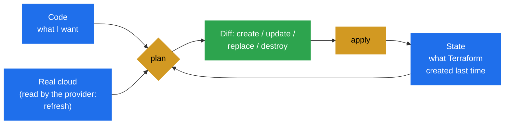

# Terraform state

> [!abstract] In one sentence
> The **state** is Terraform's record of "this address in my code is that real object in the cloud" (`aws_vpc.main` = `vpc-0a1b2c3d4e5f67890`), plus the last known attributes of each one; without it Terraform couldn't tell what to update or delete, so in a team it lives in a **remote backend** (an S3 bucket) with **locking**, it's treated as a **secret**, and it's changed only through Terraform commands and `moved` / `import` / `removed` blocks.

## Build-up: from one laptop to a team

### Stage 1: why Terraform needs a memory at all

The first `terraform apply` of the shop project on AWS (Amazon Web Services) creates a VPC (Virtual Private Cloud). The next day I run `terraform plan` again. How does Terraform know the VPC already exists and that `aws_vpc.main` is **that** one, not one of the other four VPCs in the account?

It can't guess from the cloud: tags are optional, names aren't unique, and many resources have no name at all. So after each apply it writes `terraform.tfstate`, and every plan starts by reading it. State does three jobs:

1. **Mapping**: code address → real ID (identifier). This is the one nothing else can replace
2. **Metadata**: dependencies (to destroy in the right order even after a resource is deleted from the code), which provider configuration created each resource, schema versions
3. **Performance and diffing**: the last known attributes, compared with what the provider reads back (refresh) and what the code wants



A resource in the cloud that isn't in the state is **invisible** to Terraform: it won't manage it, and won't delete it. A resource in the state whose code was removed is **planned for destruction**. That's the whole model.

### Stage 2: what's inside, and why it's a secret

```bash
terraform show -json | jq '.values.root_module.resources[0]'   # structured view
cat terraform.tfstate                                          # the raw file
```

```json
{
  "version": 4,
  "terraform_version": "1.10.5",
  "serial": 12,
  "lineage": "5f0c6a8e-3b2d-4c1e-9a7f-1d2e3f4a5b6c",
  "outputs": {
    "vpc_id": { "value": "vpc-0a1b2c3d4e5f67890", "type": "string" }
  },
  "resources": [
    {
      "mode": "managed",
      "type": "aws_db_instance",
      "name": "shop",
      "provider": "provider[\"registry.terraform.io/hashicorp/aws\"]",
      "instances": [
        {
          "attributes": {
            "id": "db-ABCDEFGHIJKLMNOP",
            "identifier": "shop-prod",
            "endpoint": "shop-prod.c1a2b3c4d5e6.eu-west-1.rds.amazonaws.com:5432",
            "username": "shop",
            "password": "kV9x2PqLm7Rt4Wz8",
            "...": "..."
          },
          "dependencies": ["aws_db_subnet_group.shop", "random_password.db"]
        }
      ]
    }
  ]
}
```

It's JSON (JavaScript Object Notation) with:
- `serial`: incremented on every write. A backend refuses to overwrite a newer serial with an older one
- `lineage`: a random ID set when the state is created. Two states with different lineages are different states, and Terraform refuses to push one over the other
- `resources`: every managed resource (`mode: managed`) and data source (`mode: data`) with **all** attributes

> [!warning] Secrets are stored in plain text
> The database password above, `random_password` results, TLS (Transport Layer Security) private keys from the `tls` provider, every `sensitive` value: all are in the state **unencrypted**. `sensitive = true` only hides values from plan output, not from the state. So: the state is as secret as the most secret thing in it. Encrypt it at rest, restrict who can read it, never commit it to Git, and avoid putting secrets in it at all when possible (`manage_master_user_password = true` on RDS (Relational Database Service) lets AWS keep the password in Secrets Manager; newer Terraform has **ephemeral** values and **write-only** arguments that are never stored).

### Stage 3: two people, one laptop file

A second engineer clones the repository and runs `terraform plan`. No `terraform.tfstate` (it's in `.gitignore`, correctly), so Terraform plans to create **everything**: a second VPC, a second database. Worse cases:
- Both have a copy of the state and apply at the same time: two applies racing on the same resources, and the last state written wins, losing the other's changes
- The laptop dies: the mapping is gone, and the infrastructure is now "unmanaged" (Advanced problem 4)
- Committing the state to Git "to share it": secrets in Git history forever, and merge conflicts in a JSON file nobody can resolve

The answer is a **remote backend**: the state lives in shared storage, everyone reads and writes the same copy, and a **lock** stops two runs at once.

### Stage 4: the S3 backend with native locking

```hcl
# backend.tf
terraform {
  backend "s3" {
    bucket       = "acme-terraform-state-111122223333"
    key          = "shop/prod/terraform.tfstate"    # one key per state
    region       = "eu-west-1"
    encrypt      = true
    use_lockfile = true                              # native S3 locking (Terraform 1.10+)
  }
}
```

- `key` is the path of this project's state inside the bucket. One bucket holds many states: `shop/prod/…`, `shop/staging/…`, `network/prod/…`
- `use_lockfile = true` makes Terraform create `shop/prod/terraform.tfstate.tflock` next to the state with an S3 (Simple Storage Service) **conditional write** (`If-None-Match`): if the lock object already exists, the write fails and the second run waits or errors. No other service needed
- Before 1.10, locking needed a DynamoDB table (`dynamodb_table = "terraform-locks"`). That option is **deprecated**: new setups use `use_lockfile`. During a migration both can be set at once
- Backend blocks **can't use variables**: values are needed before anything else is evaluated. For per-environment values, use partial configuration: `terraform init -backend-config=prod.s3.tfbackend`

The bucket itself is hardened:

```hcl
resource "aws_s3_bucket" "state" {
  bucket = "acme-terraform-state-111122223333"
  lifecycle { prevent_destroy = true }
}

resource "aws_s3_bucket_versioning" "state" {
  bucket = aws_s3_bucket.state.id
  versioning_configuration { status = "Enabled" }        # every old state is kept: undo button
}

resource "aws_s3_bucket_server_side_encryption_configuration" "state" {
  bucket = aws_s3_bucket.state.id
  rule {
    apply_server_side_encryption_by_default {
      sse_algorithm     = "aws:kms"                      # KMS: Key Management Service
      kms_master_key_id = aws_kms_key.state.arn
    }
  }
}

resource "aws_s3_bucket_public_access_block" "state" {
  bucket                  = aws_s3_bucket.state.id
  block_public_acls       = true
  block_public_policy     = true
  ignore_public_acls      = true
  restrict_public_buckets = true
}
```

Plus an IAM (Identity and Access Management) policy so only the Terraform roles can read and write `shop/prod/*`: anyone who can read the state can read the database password.

**The chicken-and-egg problem.** The bucket that holds the state must exist before any `terraform init` that uses it. Who creates it? Common answers:
1. A small **bootstrap** root module with **local** state that creates the bucket and KMS (Key Management Service) key (and the CI (continuous integration) roles). Apply it once, then migrate its own state into the bucket it just made: add the `backend "s3"` block and run `terraform init -migrate-state`
2. Create the bucket once with the AWS CLI (command-line interface) or CloudFormation, and document it
The [[Terraform worked example]] does option 1.

Moving an existing local state to the backend:

```text
$ terraform init -migrate-state
Initializing the backend...
Do you want to copy existing state to the new backend?
  Pre-existing state was found while migrating the previous "local" backend to the
  newly configured "s3" backend. No existing state was found in the newly
  configured "s3" backend. Do you want to copy this state to the new "s3"
  backend? Enter "yes" to copy and "no" to start with an empty state.

  Enter a value: yes

Successfully configured the backend "s3"!
```

### Stage 5: the lock in action

Two CI jobs start an apply at the same moment. The second one:

```text
$ terraform apply
Acquiring state lock. This may take a few moments...
╷
│ Error: Error acquiring the state lock
│
│ Error message: operation error S3: PutObject, https response error StatusCode: 412,
│ PreconditionFailed: At least one of the pre-conditions you specified did not hold
│ Lock Info:
│   ID:        9db590f1-b6fe-c5f2-2678-8804f089deba
│   Path:      acme-terraform-state-111122223333/shop/prod/terraform.tfstate
│   Operation: OperationTypeApply
│   Who:       runner@gha-runner-12
│   Version:   1.10.5
│   Created:   2026-10-09 14:02:11.4 +0000 UTC
╵
```

Good: that's the lock doing its job. `-lock-timeout=5m` makes a run wait instead of failing. If a run was **killed** (CI runner cancelled, laptop closed mid-apply), the lock stays behind and everything is blocked. Only then:

```bash
terraform force-unlock 9db590f1-b6fe-c5f2-2678-8804f089deba
```

Before forcing, check that the process in `Who:` is really dead. Unlocking under a running apply is exactly the race the lock exists to prevent.

### Stage 6: looking at and editing state, with commands

Never edit the JSON by hand. The commands:

```bash
terraform state list                       # every address
# aws_internet_gateway.main
# aws_subnet.public["eu-west-1a"]
# aws_vpc.main
# module.db.aws_db_instance.this

terraform state show 'aws_subnet.public["eu-west-1a"]'   # attributes of one (quotes for the shell)

terraform state mv aws_vpc.main aws_vpc.shop             # rename an address (old way: prefer moved blocks)
terraform state rm aws_s3_bucket.legacy                  # forget it: Terraform stops managing it, the bucket stays
terraform state pull > backup.tfstate                    # download the current state
terraform state push backup.tfstate                      # upload (checks lineage and serial; dangerous)
```

`state rm` is the "let go" button: the object keeps running in AWS, Terraform just forgets it. `state push` overwrites the shared state and is for emergency recovery only.

### Stage 7: refactoring without destroying, `moved` blocks

I rename `aws_vpc.main` to `aws_vpc.shop`, or wrap the network resources into a module. Terraform sees "address `aws_vpc.main` has no code: destroy it; `module.network.aws_vpc.this` has no state: create it". That would delete the network.

`terraform state mv` fixes it but happens **outside** code review, and every environment's state needs it run by hand. A `moved` block puts the refactor **in the code**:

```hcl
moved {
  from = aws_vpc.main
  to   = module.network.aws_vpc.this
}

moved {
  from = aws_subnet.public
  to   = module.network.aws_subnet.public      # moves all instances of a for_each/count resource
}
```

```text
  # aws_vpc.main has moved to module.network.aws_vpc.this
    resource "aws_vpc" "this" {
        id   = "vpc-0a1b2c3d4e5f67890"
        # (12 unchanged attributes hidden)
    }

Plan: 0 to add, 0 to change, 0 to destroy.
```

It's reviewed in the pull request, applied to each environment as it's deployed, and can stay in the code (module authors keep them for a release cycle so every caller gets the move).

### Stage 8: adopting resources that already exist, `import` blocks

The shop's Route 53 hosted zone was created by hand years ago. I want Terraform to manage it **without** recreating it (that would change the name servers and break DNS (Domain Name System) for the domain).

```hcl
import {
  to = aws_route53_zone.main
  id = "Z0123456789ABCDEFGHIJ"       # the ID format is documented per resource type
}

resource "aws_route53_zone" "main" {
  name = "example.com"
}
```

```text
  # aws_route53_zone.main will be imported
    resource "aws_route53_zone" "main" {
        name = "example.com"
        ...
    }

Plan: 1 to import, 0 to add, 0 to change, 0 to destroy.
```

If the plan shows changes as well as the import, the code doesn't match reality yet: adjust it until the only line is "will be imported". Writing that code for complex resources is tedious, so Terraform can draft it:

```bash
terraform plan -generate-config-out=generated.tf
```

With an `import` block and **no** resource block, this writes `generated.tf` with every attribute read from AWS. I clean it up (remove defaults and computed noise, replace IDs with references), move it into the right file, and plan again. `for_each` works on `import` blocks too, for importing many similar objects. The old `terraform import ADDRESS ID` command still exists but changes state immediately without a plan or review.

### Stage 9: letting go of a resource in code, `removed` blocks

The legacy log bucket should leave Terraform's management (another team takes it over) but must **not** be deleted. Deleting the resource block would plan a destroy. Instead:

```hcl
removed {
  from = aws_s3_bucket.legacy_logs

  lifecycle {
    destroy = false          # forget it, don't delete it
  }
}
```

```text
  # aws_s3_bucket.legacy_logs will no longer be managed by Terraform, but will not be destroyed
```

It's the reviewable, in-code version of `terraform state rm`.

### Stage 10: drift, when reality changes behind Terraform's back

Someone opens port 22 on the web security group in the console during an incident. The next `plan` refreshes (reads every resource back from AWS), notices the difference, and plans to **revert** it to the code:

```text
Note: Objects have changed outside of Terraform

Terraform detected the following changes made outside of Terraform since the
last "terraform apply":

  # aws_security_group.web has changed
  ~ resource "aws_security_group" "web" {
      ~ ingress = [
          + {
              + cidr_blocks = ["203.0.113.10/32"]
              + from_port   = 22
              ...
```

Choices: let the apply revert it (the code is the truth), or copy the change into the code if it was right. To see drift without planning any changes, or to accept reality into the state:

```bash
terraform plan  -refresh-only     # "what changed outside Terraform?"
terraform apply -refresh-only     # update the state to match reality, change nothing in AWS
```

A scheduled `plan -detailed-exitcode` in CI (exit code `2` = changes present) turns drift into an alert ([[Terraform in production]]). `-refresh=false` skips the refresh for speed on huge states, at the cost of not seeing drift.

### Stage 11: how big should one state be?

At first one state holds everything: network, database, ECS (Elastic Container Service) services, DNS. Problems grow with it:
- Every plan refreshes thousands of resources: 10 minutes, API (application programming interface) throttling
- **Blast radius**: a mistake in an unrelated change to a tag can still plan a destroy of the database, because it's in the same apply
- Everyone queues behind one lock
- One permission set has to cover everything

So production projects **split state** by lifecycle and owner: `network`, `data` (databases, buckets), `app` (ECS services), per environment. Splitting, and the folder layouts it leads to, is the subject of [[Terraform environments and project layout]].

When one state needs a value from another (the app needs the VPC ID from the network state):

```hcl
data "terraform_remote_state" "network" {
  backend = "s3"
  config = {
    bucket = "acme-terraform-state-111122223333"
    key    = "network/prod/terraform.tfstate"
    region = "eu-west-1"
  }
}

resource "aws_ecs_service" "web" {
  # ...
  network_configuration {
    subnets = data.terraform_remote_state.network.outputs.private_subnet_ids
  }
}
```

It only exposes the other state's **outputs**, but reading them requires read access to the **whole** state file (with its secrets). The looser-coupled alternative is plain data sources (`data "aws_vpc"` by tag) or values published to SSM (Systems Manager) Parameter Store by the network project.

### Stage 12: managed backends

**HCP Terraform** (HashiCorp Cloud Platform Terraform, formerly Terraform Cloud) and its self-hosted version Terraform Enterprise are backends that also **run** plans and applies remotely, with locking, state versions and history, a UI (user interface) to approve runs, policies and drift detection built in:

```hcl
terraform {
  cloud {
    organization = "acme"
    workspaces {
      name = "shop-prod"
    }
  }
}
```

Alternatives in the same space: Spacelift, env0, Scalr, and Atlantis (self-hosted, plans in pull request comments). For OpenTofu users, OpenTofu also offers **client-side state encryption** (the state is encrypted before it leaves the machine), something Terraform doesn't do natively.

## Advanced problems

### 1. A stuck lock
**Symptom:** every run fails with "Error acquiring the state lock", and the `Who:` points to a CI job cancelled an hour ago.
**Fix:** confirm that job is dead, then `terraform force-unlock <ID>`. Then run a `plan`: an apply killed halfway may have created resources that the state recorded (Terraform writes state as resources complete) or, rarely, not.

### 2. "Resource already exists"
**Symptom:** `apply` fails with `EntityAlreadyExists` or `BucketAlreadyOwnedByYou`: the object exists in AWS but not in this state (created by hand, by another state, or lost from state).
**Fix:** `import` it into the right state. If it's managed by *another* state, don't: two states managing one object fight forever.

### 3. A refactor that plans destroys
**Symptom:** after moving code into a module, the plan shows `N to add, N to destroy`.
**Fix:** `moved` blocks for every address that changed, until the plan is `0 to add, 0 to destroy`. Never apply a refactor plan that destroys.

### 4. Lost or corrupted state
**Symptom:** the state file is gone or truncated (someone ran `state push` with an old file, a bug, a deleted key).
**Fix:** with S3 **versioning** on, restore the previous object version (or `aws s3api get-object --version-id … > recovered.tfstate` then `terraform state push recovered.tfstate`), then `plan` to see what differs. Without versioning, the state has to be rebuilt by `import`ing every resource: days of work. That's why versioning is non-negotiable on the state bucket.

### 5. "Saved plan is stale"
**Symptom:** `terraform apply plan.tfplan` fails because the state changed since the plan (another apply ran).
**Fix:** that's the protection working: re-plan and review again.

### 6. State permissions too broad
**Symptom:** every developer has read access to the state bucket "to run plans", and therefore to every database password in it.
**Fix:** restrict reads to CI roles, keep secrets out of state (AWS-managed master passwords, ephemeral values, Secrets Manager references instead of values), encrypt with a KMS key whose policy is restricted too.

## Practice

> [!example]- I delete `resource "aws_s3_bucket" "images"` from the code. What does the plan show, and how do I keep the bucket?
> A destroy (the address is in state but not in code; it fails if the bucket isn't empty, unless `force_destroy`). To keep it and stop managing it: a `removed` block with `lifecycle { destroy = false }`, or `terraform state rm`.

> [!example]- Why can't the backend block read `var.environment`?
> The backend is configured during `init`, before variables and anything else are evaluated. Use partial configuration files: `terraform init -backend-config=prod.s3.tfbackend`.

> [!example]- A colleague changed the instance type in the console. What do `plan` and `plan -refresh-only` show?
> `plan` shows the drift as a note and plans to change it back to the code's value. `plan -refresh-only` only reports the drift; `apply -refresh-only` would write the console value into the state without changing AWS (the next normal plan then wants to revert it unless the code is updated).

> [!example]- What protects against two simultaneous applies with the S3 backend?
> `use_lockfile = true`: a `.tflock` object created with a conditional write; the second run gets a 412 PreconditionFailed and fails or waits (`-lock-timeout`).

> [!example]- How do I bring an existing hand-made VPC under Terraform without touching it?
> An `import` block with `to = aws_vpc.main` and the VPC ID, plus a matching resource block (or `plan -generate-config-out=generated.tf` to draft it); adjust until the plan shows only "will be imported".

## Easy to get wrong
- Committing `terraform.tfstate` to Git (secrets, conflicts)
- Thinking `sensitive = true` keeps a value out of the state: it only hides it from output
- A state bucket without versioning
- Using variables in the `backend` block
- `force-unlock` while the other run is still alive
- Renaming or moving resources without `moved` blocks
- Deleting a resource block to "unmanage" it: that destroys it
- Importing an object already managed by another state
- `state push` of an old file as a "fix"
- Reaching for `terraform_remote_state` everywhere: it needs read access to the whole state
- Still creating a DynamoDB table for locking on new setups: `use_lockfile = true`

## Related
- Builds on:: [[Terraform]], [[Terraform resources and data sources]], [[Terraform providers]]
- Next step:: [[Terraform modules]], [[Terraform environments and project layout]]
- Used in:: [[Terraform in production]], [[Terraform worked example]], [[ECS production stack]]
- AWS side:: [[S3]], *[[KMS]]*, [[Connecting GitHub Actions to AWS]]
- Area:: [[Infrastructure as code]]

## Flashcards
#flashcards

What is Terraform state? :: The record mapping each address in the code to the real object ID, plus its last known attributes and dependencies
What happens to a cloud object that isn't in the state? :: Terraform doesn't see it: it won't manage or delete it
What happens when a resource is in the state but removed from the code? :: Terraform plans to destroy it
Why is the state file a secret? :: It stores every attribute in plain text, including passwords and private keys
Does sensitive = true keep a value out of state? :: No, it only hides it from plan/apply output
What are serial and lineage in the state? :: serial increments on every write; lineage identifies one state's history, so Terraform won't overwrite a newer or different state
Why is local state a problem for a team? :: No sharing, no locking (racing applies), lost with the laptop, and committing it leaks secrets
How does the S3 backend lock state since Terraform 1.10? :: use_lockfile = true: a .tflock object created with a conditional write; DynamoDB locking is deprecated
Which S3 bucket settings are essential for state? :: Versioning, KMS encryption, public access block, tight IAM access, prevent_destroy
Why can't the backend block use variables? :: It's configured during init before anything is evaluated; use -backend-config partial configuration
What is the state bucket chicken-and-egg problem and the usual fix? :: The bucket must exist before init; a bootstrap module with local state creates it, then migrates its state into it (init -migrate-state)
When is terraform force-unlock appropriate? :: Only when the run holding the lock is confirmed dead
What does terraform state rm do? :: Removes the address from state; the real object keeps running, unmanaged
What does a moved block do? :: Records an address rename/move in code, so state is updated instead of destroy + create
What does an import block do? :: Adopts an existing object into state at a given address during a reviewed plan/apply
What does terraform plan -generate-config-out do? :: Writes draft resource blocks for import blocks that have no matching resource code
What does a removed block with destroy = false do? :: Stops managing the resource without deleting it (in-code state rm)
What is drift? :: Differences between the real infrastructure and the state/code, made outside Terraform
What does terraform plan -refresh-only do? :: Shows changes made outside Terraform without planning changes to infrastructure
What does terraform apply -refresh-only do? :: Updates the state to match reality without changing infrastructure
What exit code does plan -detailed-exitcode return when there are changes? :: 2 (0 = no changes, 1 = error)
Why split one big state into several? :: Faster plans, smaller blast radius, less lock contention, narrower permissions
What does terraform_remote_state give access to, and what's its cost? :: Another state's outputs; it requires read access to that whole state file
How do I recover a corrupted state in S3? :: Restore a previous object version (versioning), push it if needed, then plan to check differences
What is HCP Terraform? :: HashiCorp's managed service (formerly Terraform Cloud): remote state, locking, remote runs, approvals, policies
