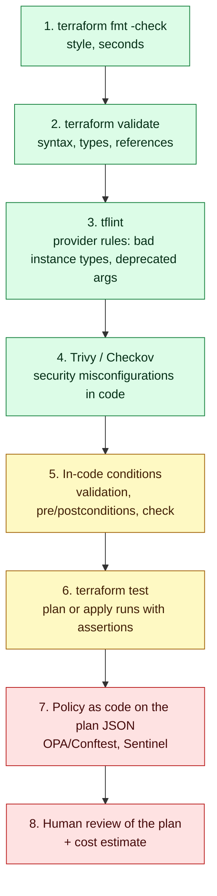
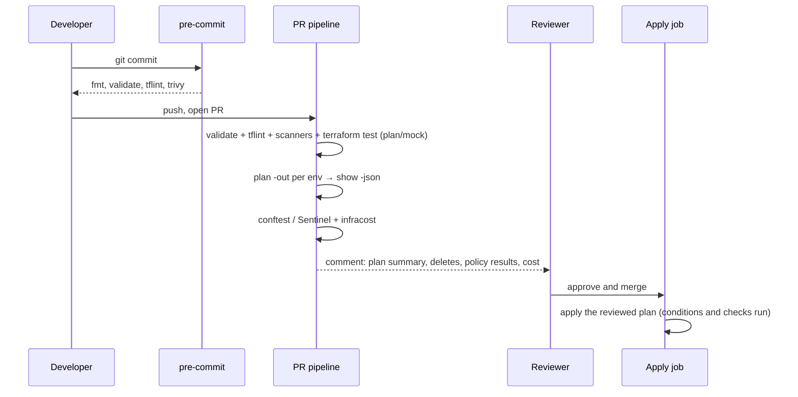

# Terraform testing and validation

> [!abstract] In one sentence
> Terraform code is checked on a **ladder** from cheap to expensive: formatting and syntax (`fmt`, `validate`), linters (`tflint`) and security scanners (Trivy, Checkov) on the code, **conditions inside the code** (variable validation, preconditions/postconditions, `check` blocks), **`terraform test`** runs against mocks or real infrastructure, and **policy as code** on the plan (OPA (Open Policy Agent), Sentinel), with each rung catching what the cheaper ones can't, so that by the time a human reviews the plan, only real decisions are left.

## Build-up: the plan looked fine

Acme's shop runs on AWS (Amazon Web Services), built with Terraform in `eu-west-1`. A pull request adds an S3 (Simple Storage Service) bucket for invoice PDFs (Portable Document Format files). The reviewer reads the HCL (HashiCorp Configuration Language), sees a bucket, approves. After the apply:
- The bucket has no encryption setting beyond the default and no public access block, and someone later adds a bucket policy with `"Principal": "*"` for a "quick test"
- A second PR (pull request) sets `instance_type = "t3.micor"` in the module's variables, and the apply fails 6 minutes in, half-done
- A third PR uses a `count = length(var.azs)` with an empty list in dev, and dev quietly has no NAT (Network Address Translation) gateway

None of these needs a clever reviewer. They need **machines** checking every change, cheapest first.



### Stage 1: format and validate

**`terraform fmt`** rewrites files to the canonical style (aligned `=`, two-space indents). In CI (Continuous Integration) it only checks:

```
$ terraform fmt -check -recursive -diff
modules/storage/main.tf
--- old/modules/storage/main.tf
+++ new/modules/storage/main.tf
@@ -1,4 +1,4 @@
 resource "aws_s3_bucket" "invoices" {
-  bucket = "acme-shop-invoices"
-  force_destroy= false
+  bucket        = "acme-shop-invoices"
+  force_destroy = false
 }
$ echo $?
3
```

A non-zero exit fails the job. It's not about beauty: formatted code makes review diffs show only real changes.

**`terraform validate`** checks the configuration is **internally** consistent: syntax, argument names, types, references to things that exist. It needs `terraform init` (to load provider schemas) but no credentials and no state:

```bash
terraform init -backend=false     # load providers and modules, skip the backend
terraform validate
```

```
$ terraform validate
╷
│ Error: Unsupported argument
│
│   on main.tf line 14, in resource "aws_s3_bucket" "invoices":
│   14:   acl = "private"
│
│ An argument named "acl" is not expected here.
╵
```

What it **can't** know: whether `t3.micor` is a real instance type (to the schema it's just a string), whether the bucket name is taken, whether my role is allowed to create it.

### Stage 2: tflint, provider-aware linting

**tflint** knows things about specific providers. With the AWS ruleset it checks values against AWS's real lists (instance types, regions), flags deprecated syntax and unused declarations:

```hcl
# .tflint.hcl
plugin "terraform" {
  enabled = true
  preset  = "recommended"
}

plugin "aws" {
  enabled = true
  version = "0.40.0"
  source  = "github.com/terraform-linters/tflint-ruleset-aws"
}

rule "terraform_naming_convention" {
  enabled = true
}

rule "terraform_documented_variables" {
  enabled = true
}
```

```
$ tflint --init && tflint --recursive
2 issue(s) found:

Error: "t3.micor" is an invalid value as instance_type (aws_instance_invalid_type)

  on modules/web/main.tf line 9:
   9:   instance_type = "t3.micor"

Warning: variable "legacy_port" is declared but not used (terraform_unused_declarations)

  on modules/web/variables.tf line 31:
  31: variable "legacy_port" {
```

The typo that would have failed six minutes into an apply now fails in two seconds on the pull request.

### Stage 3: security scanners on the code

Static scanners read the HCL and flag insecure configurations against hundreds of built-in rules (CIS (Center for Internet Security) benchmarks, AWS best practices):
- **Trivy** (`trivy config`): Aqua's scanner, which absorbed **tfsec** (tfsec is deprecated, its checks live on in Trivy)
- **Checkov**: Bridgecrew/Prisma Cloud's scanner, also reads plan JSON (JavaScript Object Notation)
- KICS (Keeping Infrastructure as Code Secure) and others do the same job

```
$ trivy config --severity HIGH,CRITICAL .
modules/storage/main.tf (terraform)

Tests: 18 (SUCCESSES: 15, FAILURES: 3)
Failures: 3 (HIGH: 2, CRITICAL: 1)

CRITICAL: No public access block so not blocking public policies
════════════════════════════════════════════════════════════════
 modules/storage/main.tf:1-4
   1 ┌ resource "aws_s3_bucket" "invoices" {
   2 │   bucket        = "acme-shop-invoices"
   3 │   force_destroy = false
   4 └ }

HIGH: Bucket does not have versioning enabled
HIGH: Bucket does not encrypt data with a customer managed key
```

```
$ checkov -d . --compact --quiet
Check: CKV2_AWS_6: "Ensure that S3 bucket has a Public Access block"
	FAILED for resource: aws_s3_bucket.invoices
	File: /modules/storage/main.tf:1-4
Check: CKV_AWS_144: "Ensure that S3 bucket has cross-region replication enabled"
	FAILED for resource: aws_s3_bucket.invoices
```

Scanners are noisy: not every rule fits (cross-region replication for an invoice bucket may be a deliberate "no"). Skip with a **reason**, next to the code, so the exception is reviewed:

```hcl
resource "aws_s3_bucket" "invoices" {
  # checkov:skip=CKV_AWS_144:Invoices are regenerated from the DB; single-region by design
  # trivy:ignore:AVD-AWS-0132 KMS customer key not required for this data class
  bucket = "acme-shop-invoices"
}
```

Scanners only see the code. A bucket made public by a value that's only known after apply, or by another stack, is invisible to them: that's what plan-time policy is for (Stage 7).

### Stage 4: conditions inside the code

The cheapest checks that understand **meaning** are written in the module itself, so they protect every caller.

**Variable validation**: reject bad inputs at plan time (see [[Terraform variables, locals and outputs]]):

```hcl
variable "azs" {
  type = list(string)

  validation {
    condition     = length(var.azs) >= 2
    error_message = "At least two Availability Zones are required for the NAT and ALB design."
  }

  validation {
    condition     = alltrue([for az in var.azs : startswith(az, "eu-west-1")])
    error_message = "All AZs must be in eu-west-1."
  }
}
```

That's the empty-list dev bug from the build-up, caught at plan time with a message that says what to do. Since Terraform 1.9, a validation can also refer to **other** variables (`var.environment == "prod" ? length(var.azs) == 3 : true`).

**Preconditions and postconditions** (Terraform 1.2+): assumptions about **resources and data sources**, checked during plan/apply, in a `lifecycle` block.

```hcl
data "aws_ami" "web" {
  most_recent = true
  owners      = ["self"]
  filter {
    name   = "name"
    values = ["shop-web-*"]
  }
}

resource "aws_instance" "web" {
  ami           = data.aws_ami.web.id
  instance_type = var.instance_type

  lifecycle {
    # checked before creating/updating: is the input sane?
    precondition {
      condition     = data.aws_ami.web.architecture == "arm64"
      error_message = "The shop-web AMI must be arm64 to run on Graviton instance types."
    }

    # checked after apply: did we get what we expected?
    postcondition {
      condition     = self.public_ip == ""
      error_message = "Web instances must not get a public IP; check the subnet's map_public_ip_on_launch."
    }
  }
}
```

A failing condition **stops** the run (an error), right at the resource it's about. Outputs can have a `precondition` too, so a module refuses to hand out a value it knows is wrong.

**`check` blocks** (Terraform 1.5+): continuous assertions that only **warn**, run on every plan and apply. Good for "is the thing actually working" checks that shouldn't block a change:

```hcl
check "shop_health" {
  data "http" "health" {
    url = "https://shop.example.com/healthz"
  }

  assert {
    condition     = data.http.health.status_code == 200
    error_message = "shop.example.com/healthz returned ${data.http.health.status_code}."
  }
}
```

```
╷
│ Warning: Check block assertion failed
│
│   on checks.tf line 6, in check "shop_health":
│    6:     condition     = data.http.health.status_code == 200
│
│ shop.example.com/healthz returned 503.
╵
```

| Mechanism | Checks | When | Failure is |
|---|---|---|---|
| `validation` in a variable | Input values | Plan, before anything | Error |
| `precondition` | Assumptions before a resource/data source/output | Plan or apply | Error |
| `postcondition` | Guarantees about a resource's result (`self`) | After it's read/created | Error |
| `check` block | Anything, often real-world health | End of every plan/apply | Warning |

### Stage 5: `terraform test`

Conditions check one run. To check that a **module** behaves correctly under different inputs, Terraform 1.6+ has a built-in test framework (OpenTofu has the same as `tofu test`). Tests are `.tftest.hcl` files, usually in `tests/`:

```
modules/network/
├── main.tf
├── variables.tf
├── outputs.tf
└── tests/
    ├── plan.tftest.hcl
    └── apply.tftest.hcl
```

A test file is a list of **`run` blocks**, executed in order. Each run does a `plan` or an `apply` of the module with the given variables, then evaluates `assert` blocks:

```hcl
# tests/plan.tftest.hcl
variables {
  name       = "test"
  cidr_block = "10.42.0.0/16"
  azs        = ["eu-west-1a", "eu-west-1b"]
}

provider "aws" {
  region = "eu-west-1"
}

run "one_nat_per_az_by_default" {
  command = plan

  assert {
    condition     = length(aws_nat_gateway.this) == 2
    error_message = "Expected one NAT gateway per AZ."
  }

  assert {
    condition     = aws_subnet.private["eu-west-1a"].cidr_block == "10.42.10.0/24"
    error_message = "Private subnet CIDR layout changed."
  }
}

run "single_nat_for_dev" {
  command = plan

  variables {
    single_nat_gateway = true
  }

  assert {
    condition     = length(aws_nat_gateway.this) == 1
    error_message = "single_nat_gateway should create exactly one NAT gateway."
  }
}

run "rejects_one_az" {
  command = plan

  variables {
    azs = ["eu-west-1a"]
  }

  expect_failures = [var.azs]   # the validation MUST fail; the test passes if it does
}
```

```
$ terraform test
tests/plan.tftest.hcl... in progress
  run "one_nat_per_az_by_default"... pass
  run "single_nat_for_dev"... pass
  run "rejects_one_az"... pass
tests/plan.tftest.hcl... tearing down
tests/plan.tftest.hcl... pass

Success! 3 passed, 0 failed.
```

**Plan runs vs apply runs.** `command = plan` is fast and free, but anything known only after apply (IDs (identifiers), ARNs (Amazon Resource Names), generated names) is unknown and can't be asserted. `command = apply` (the default) creates **real** resources in a test account, asserts on the real result, and **destroys them** at the end of the file, in reverse order. Apply tests catch what plans can't (an IAM (Identity and Access Management) permission missing, an API (Application Programming Interface) rejecting a combination of arguments) but cost minutes and money:

```hcl
# tests/apply.tftest.hcl  (run nightly in a sandbox account, not on every PR)
run "creates_working_network" {
  assert {
    condition     = startswith(output.vpc_id, "vpc-")
    error_message = "No VPC ID output."
  }
}

run "private_subnet_has_internet_via_nat" {
  module {
    source = "./tests/probe"   # a helper module: a tiny instance in the subnet that tries to reach the internet
  }
  variables {
    subnet_id = run.creates_working_network.private_subnet_ids[0]   # an output of the previous run
  }
  assert {
    condition     = output.egress_ok
    error_message = "Instance in a private subnet could not reach the internet through NAT."
  }
}
```

**Mock providers** (Terraform 1.7+) let a test run without any cloud credentials: the provider returns fake values, so even `apply` runs are instant and free. Useful for logic-heavy modules:

```hcl
# tests/mocked.tftest.hcl
mock_provider "aws" {
  mock_resource "aws_vpc" {
    defaults = {
      id  = "vpc-0123456789abcdef0"
      arn = "arn:aws:ec2:eu-west-1:111122223333:vpc/vpc-0123456789abcdef0"
    }
  }
}

run "outputs_are_wired" {
  command = apply   # nothing real is created

  assert {
    condition     = output.vpc_id == "vpc-0123456789abcdef0"
    error_message = "vpc_id output is not wired to the VPC."
  }
}
```

Mocks test **my** logic (loops, conditionals, wiring, naming), never whether AWS accepts the configuration.

What I'd do: plan-based tests (and mocks) for every module on every PR; a few apply-based tests per module nightly in a throwaway account; an `examples/` folder that tests also use, so the README (read-me file) example is guaranteed to work. Terratest (Go) is the older alternative for heavy integration tests that need real HTTP (Hypertext Transfer Protocol) calls, SSH (Secure Shell) or retries.

### Stage 6: reviewing the plan as data

The plan is what will actually happen, including values from variables, other states and the real world. `terraform show -json` turns a saved plan into JSON that tools can read:

```bash
terraform plan -out=tfplan
terraform show -json tfplan > tfplan.json
```

```bash
# what's being deleted or replaced? (the question a reviewer should always ask)
jq -r '.resource_changes[]
       | select(.change.actions | index("delete"))
       | "\(.change.actions | join(",")) \(.address)"' tfplan.json
```

```
delete,create aws_db_instance.shop
delete aws_s3_bucket.old_exports
```

A replaced database is the kind of line that hides in a 300-line plan. CI posts a summary (counts, and every delete/replace in bold) as a pull request comment so reviewers see it first.

### Stage 7: policy as code on the plan

Code scanners can't see values computed at plan time or which resources are **deleted**. Policies on the plan JSON can. Organisation rules written as code, enforced on every plan:
- "No resource may be deleted in prod without the `allow-destroy` label on the PR"
- "Every resource has `Owner` and `CostCenter` tags"
- "No security group rule opens 22 to `0.0.0.0/0`"
- "Only these instance families in prod"

**OPA with Conftest**: policies in Rego, run against `tfplan.json`:

```rego
# policy/terraform.rego
package main

import rego.v1

deny contains msg if {
  rc := input.resource_changes[_]
  rc.type == "aws_security_group_rule"
  rc.change.after.type == "ingress"
  rc.change.after.from_port <= 22
  rc.change.after.to_port >= 22
  "0.0.0.0/0" in rc.change.after.cidr_blocks
  msg := sprintf("%s opens SSH to the internet", [rc.address])
}

deny contains msg if {
  rc := input.resource_changes[_]
  "delete" in rc.change.actions
  rc.type in {"aws_db_instance", "aws_rds_cluster", "aws_s3_bucket", "aws_dynamodb_table"}
  msg := sprintf("%s would be deleted: stateful resources need a manual approval", [rc.address])
}

warn contains msg if {
  rc := input.resource_changes[_]
  rc.change.after.tags != null
  not rc.change.after.tags.Owner
  msg := sprintf("%s has no Owner tag", [rc.address])
}
```

```
$ conftest test tfplan.json -p policy/
FAIL - tfplan.json - main - aws_security_group_rule.debug_ssh opens SSH to the internet
FAIL - tfplan.json - main - aws_db_instance.shop would be deleted: stateful resources need a manual approval
WARN - tfplan.json - main - aws_lb.web has no Owner tag

3 tests, 0 passed, 1 warning, 2 failures, 0 exceptions
```

**Sentinel** is HashiCorp's policy language, built into HCP (HashiCorp Cloud Platform) Terraform and Terraform Enterprise with enforcement levels (advisory, soft-mandatory: can be overridden by someone allowed, hard-mandatory). HCP Terraform also runs OPA policies natively. Checkov can scan plan JSON too (`checkov -f tfplan.json`), which closes some of the gaps of code-only scanning.

Policy as code is the **organisation's** guardrail, separate from any one module: it applies to every repo and every team, including code that doesn't use the approved modules.

### Stage 8: cost estimation

**Infracost** reads the plan and prices the change:

```
$ infracost diff --path tfplan.json

──────────────────────────────────
Project: acme/infra/live/prod/data

~ aws_db_instance.shop
  +$412 ($389 → $801)

    ~ Database instance (on-demand, Multi-AZ, db.r7g.large → db.r7g.xlarge)
      +$412 ($389 → $801)

Monthly cost change for acme/infra/live/prod/data
Amount:  +$412 ($1,247 → $1,659)
Percent: +33%
```

Posted on the pull request, it makes "this doubles the database bill" a review comment instead of a surprise on the invoice. Policies can fail plans above a threshold.

### Stage 9: running it before the push

The cheap rungs run on the laptop through **pre-commit** (the `pre-commit-terraform` hooks), so CI rarely fails on formatting:

```yaml
# .pre-commit-config.yaml
repos:
  - repo: https://github.com/antonbabenko/pre-commit-terraform
    rev: v1.99.0
    hooks:
      - id: terraform_fmt
      - id: terraform_validate
      - id: terraform_tflint
      - id: terraform_trivy
      - id: terraform_docs
```

### Where each check runs

| Check | Pre-commit | PR (pull request) CI | Merge / apply | Nightly |
|---|---|---|---|---|
| `fmt -check`, `validate` | ✓ | ✓ | | |
| `tflint` | ✓ | ✓ | | |
| Trivy / Checkov on code | ✓ (fast) | ✓ (fails on HIGH+) | | |
| Validation, pre/postconditions | (with plan) | ✓ every plan | ✓ every apply | |
| `terraform test` plan/mock runs | | ✓ for changed modules | | |
| `terraform test` apply runs | | | | ✓ sandbox account |
| Plan summary + OPA/Sentinel + Infracost | | ✓ per environment | ✓ re-checked on the saved plan | |
| `check` blocks, drift plan | | | ✓ | ✓ (drift detection, see [[Terraform in production]]) |



## Advanced problems

### 1. `validate` passes, apply fails
**Symptom:** green CI, then `InvalidParameterCombination` or `AccessDenied` halfway through an apply, leaving partial changes.
**Cause:** `validate` and plan tests only check the configuration and schema, not what the AWS API accepts or what the role is allowed to do.
**Fix:** apply-based tests for modules in a sandbox account, tflint's AWS rules, and the same role permissions in staging as prod so staging applies catch it first.

### 2. Scanner fatigue
**Symptom:** 140 findings on every PR, everyone ignores the scanner comment, a real public bucket slips through.
**Cause:** every rule enabled, most irrelevant to the context.
**Fix:** fail only on HIGH/CRITICAL (`--severity`), skip rules with a written reason in code, track the baseline, review skips periodically. A scanner nobody reads is worse than no scanner.

### 3. Plan-based test can't assert a value
**Symptom:** `Error: Unknown condition value ... aws_vpc.this.id is a value that will be known only after apply`.
**Cause:** `command = plan` can't see computed attributes.
**Fix:** assert on inputs-derived values (CIDRs, counts, names), use `mock_provider` with defaults, or make that run `command = apply` in a sandbox.

### 4. Apply tests leak resources
**Symptom:** the sandbox account fills with `test-*` VPCs and NAT gateways and a growing bill.
**Cause:** a test run was cancelled (CI timeout) before the destroy phase, or destroy failed on a dependency.
**Fix:** a dedicated sandbox account, a CI timeout longer than the test, unique name prefixes per run, and a nightly cleanup job (aws-nuke or similar) that deletes everything older than a day.

### 5. Policies pass on the PR, the apply does something else
**Symptom:** OPA checked a plan without deletes; the apply deleted a resource.
**Cause:** the apply re-planned against changed state (someone else merged first, or drift), so the checked plan wasn't the applied plan.
**Fix:** apply the **saved plan file** that was checked (Terraform refuses a stale saved plan: `Saved plan is stale`), or re-run policies on the plan produced at apply time.

### 6. Conditions that only fail in prod
**Symptom:** a precondition about three AZs (Availability Zones) passes in dev (validation skipped there) and blocks the prod release.
**Cause:** environment-dependent conditions evaluated only where the values occur.
**Fix:** run plans for **every** environment on the PR, not just dev, so prod's conditions and policies are evaluated before merge.

## Practice

> [!example]- `terraform validate` passed but `instance_type = "t3.micor"` failed at apply. Which rung should have caught it, and why didn't validate?
> tflint with the AWS ruleset (`aws_instance_invalid_type`). validate only checks the schema, where instance_type is just a string.

> [!example]- Validation vs precondition vs check: which for "the AMI (Amazon Machine Image) must be arm64"? For "the health endpoint returns 200"? For "at least two AZs"?
> arm64 AMI: a `precondition` on the instance (an assumption about a data source). Health endpoint: a `check` block (warn, don't block). Two AZs: a `validation` on the variable.

> [!example]- A test needs to assert the VPC (Virtual Private Cloud) ID (identifier) output starts with `vpc-`. Why does a `command = plan` run fail, and what are two fixes?
> The ID is unknown until apply. Use `command = apply` in a sandbox, or a `mock_provider "aws"` with a default `id` for `aws_vpc`.

> [!example]- How does a run assert that bad input is rejected?
> `expect_failures = [var.azs]` in the run block: the test passes only if that variable's validation fails.

> [!example]- Why can't Trivy on the code detect "this PR deletes the production database"?
> It reads the configuration, not the plan: deletion depends on current state. A policy on `terraform show -json` output (Conftest/Sentinel) sees `"delete"` in `change.actions`.

## Easy to get wrong
- Thinking `validate` checks against AWS: it only checks syntax, types and references
- Running `validate` without `init` (or with the real backend in CI when `-backend=false` is enough)
- Treating every scanner finding as mandatory, or silencing them without a written reason
- Using `check` blocks for things that must block a change (they only warn) or preconditions for live health (they block)
- Asserting computed values (IDs, ARNs) in plan-only test runs
- Running apply-based tests in a real environment's account instead of a disposable sandbox
- Checking policies on one plan and applying a different (re-generated) plan
- Only planning dev on the PR, so prod-only conditions and policies surface after merge
- Forgetting `expect_failures` is how to test that validation rejects bad input
- Calling tfsec by its old name: it's now part of Trivy

## Related
- Builds on:: [[Terraform]], [[Terraform variables, locals and outputs]] (validation), [[Terraform resources and data sources]] (lifecycle), [[Terraform modules]] (what gets tested)
- Next step:: [[Terraform in production]] (where these run in CI)
- Applied in:: [[Terraform worked example]], [[Connecting GitHub Actions to AWS]]
- Related:: [[Terraform environments and project layout]] (a sandbox account for apply tests), [[Terraform state]]
- Area:: [[Infrastructure as code]]

## Flashcards
#flashcards

What does terraform fmt -check do in CI? :: Exits non-zero if any file isn't in canonical format, without rewriting it
What does terraform validate check? :: Syntax, argument names, types and references, using provider schemas; no state, no credentials, no AWS API calls
What does validate need first? :: terraform init (terraform init -backend=false is enough)
What does tflint add over validate? :: Provider-aware rules (invalid instance types, deprecated arguments), unused declarations, naming conventions
What happened to tfsec? :: It was merged into Trivy (trivy config); tfsec is deprecated
How do you skip a Checkov rule? :: A # checkov:skip=<ID>:<reason> comment in the resource, so the exception is reviewed
Variable validation runs when? :: At plan time, before anything else, and fails with the error_message
Precondition vs postcondition? :: Precondition: assumption checked before a resource/data source/output is evaluated. Postcondition: guarantee about the result, using self
What does a check block do on failure? :: Emits a warning; it never blocks the plan or apply
Where do terraform test files live and what are they called? :: Usually tests/*.tftest.hcl next to the module
What is a run block? :: One plan or apply of the module with given variables, followed by assert blocks; runs execute in order
command = plan vs command = apply in a test? :: Plan: fast, free, computed values unknown. Apply: real resources, real values, destroyed at the end of the file
What does expect_failures do? :: Makes the run pass only if the listed checkable (e.g. var.azs validation) fails
What is mock_provider for? :: Running tests without credentials: the provider returns fake values, so even apply runs create nothing
How do you get a plan as machine-readable data? :: terraform plan -out=tfplan, then terraform show -json tfplan
Why run policies on the plan rather than the code? :: The plan includes computed values and actions (deletes, replacements) that code scanning can't see
What is Conftest? :: A CLI (command-line interface) tool that runs OPA Rego policies against files such as the plan JSON
What is Sentinel? :: HashiCorp's policy-as-code language in HCP Terraform/Enterprise, with advisory, soft-mandatory and hard-mandatory levels
What does Infracost do? :: Prices the infrastructure change from the plan and posts the monthly cost difference on the PR
Why apply the saved plan file that was checked? :: Otherwise the apply re-plans and may do something the reviewers and policies never saw
