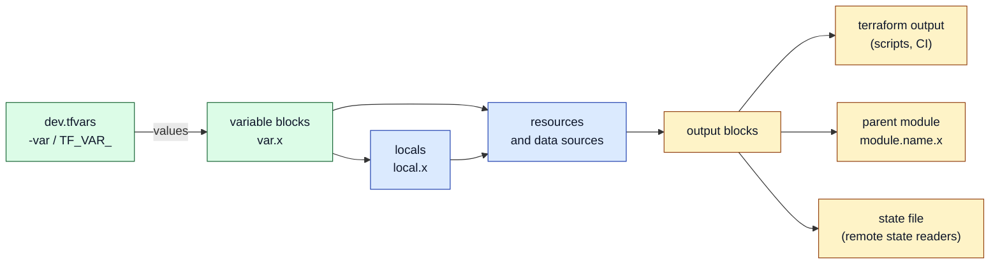

# Terraform variables, locals and outputs

> [!abstract] In one sentence
> A Terraform module has an interface like a function: **input variables** are its parameters (`var.x`, given values from `.tfvars` files, `-var` flags or `TF_VAR_` environment variables), **locals** are its private intermediate values (`local.x`, computed once and reused), and **outputs** are its return values (`terraform output`, `module.name.x`), which is how other modules, scripts and CI (continuous integration) pipelines read what was built.

## Build-up: the same shop, twice

The configuration from [[Terraform]] builds Acme's dev shop: a bucket called `acme-shop-assets-dev-7f3a`, a `t3.micro` instance tagged `shop-web-dev`, region `eu-west-1` written in the provider. Now Acme wants **prod**: same shape, bigger instance, different names.

### Stage 1: copy-paste and edit

The obvious move: copy the folder to `prod/`, search-and-replace `dev` with `prod`, change `t3.micro` to `m7i.large`.

**The problems:**
- Two copies of the same code drift apart: a fix to the security group in dev is forgotten in prod
- The literal `"dev"` appears in eight places; missing one gives a prod instance tagged `shop-web-dev`
- Nothing says *which* values are meant to differ between environments and which are the design

### Stage 2: input variables

I pull out what changes and make it a **parameter** of the configuration:

```hcl
# variables.tf
variable "environment" {
  description = "Deployment environment: dev, staging or prod"
  type        = string
}

variable "instance_type" {
  description = "EC2 instance type for the web server"
  type        = string
  default     = "t3.micro"
}

variable "region" {
  description = "AWS region to deploy into"
  type        = string
  default     = "eu-west-1"
}
```

and use them with `var.`:

```hcl
provider "aws" {
  region = var.region
}

resource "aws_s3_bucket" "assets" {
  bucket = "acme-shop-assets-${var.environment}-7f3a"
}

resource "aws_instance" "web" {
  ami           = data.aws_ssm_parameter.al2023.value
  instance_type = var.instance_type
  tags          = { Name = "shop-web-${var.environment}" }
}
```

A variable **without** a `default` is **required**. If nothing gives it a value, Terraform asks interactively:

```bash
$ terraform plan
var.environment
  Deployment environment: dev, staging or prod

  Enter a value: dev
```

That prompt is fine on a laptop and a failure in CI (`Error: No value for required variable`), so values come from files instead.

### Stage 3: giving values with .tfvars files

```hcl
# dev.tfvars
environment   = "dev"
instance_type = "t3.micro"
```

```hcl
# prod.tfvars
environment   = "prod"
instance_type = "m7i.large"
```

```bash
terraform plan -var-file=prod.tfvars
```

Now the code is the same for both environments and **the difference between them is two small files**, easy to review side by side. (One code folder with a tfvars file per environment is only one of the layouts: separate folders and state per environment are compared in [[Terraform environments and project layout]]. Whatever the layout, the state must be separate per environment.)

All the ways to set a variable, from **lowest to highest priority** (later wins):

| Priority | Source | Typical use |
|---|---|---|
| 1 (lowest) | `default` in the `variable` block | Sensible default |
| 2 | Environment variable `TF_VAR_<name>` | CI secrets and per-machine values: `export TF_VAR_environment=dev` |
| 3 | `terraform.tfvars`, then `terraform.tfvars.json` | Loaded **automatically** if present |
| 4 | `*.auto.tfvars` / `*.auto.tfvars.json` | Also automatic, in alphabetical order of file names |
| 5 (highest) | `-var 'name=value'` and `-var-file=file.tfvars` on the command line | Explicit per run; if several, the **last one** given wins |

```bash
$ export TF_VAR_instance_type=t3.small
$ terraform plan -var-file=dev.tfvars -var 'instance_type=t3.medium'
# instance_type = "t3.medium": the -var flag beats the tfvars file, which beats TF_VAR_
```

> [!warning] Automatic files are invisible
> `terraform.tfvars` and `*.auto.tfvars` load without being named on the command line. A forgotten `zz-test.auto.tfvars` in the folder overrides values silently. I prefer explicit `-var-file=` per environment, and nothing auto-loaded except truly shared values.

Complex values work in all of them. In a tfvars file it's HCL (HashiCorp Configuration Language); with `-var` and `TF_VAR_` it's the same HCL syntax as a string:

```bash
export TF_VAR_allowed_cidrs='["198.51.100.0/24", "203.0.113.0/24"]'
terraform plan -var 'tags={Team="shop", CostCenter="42"}'
```

### Stage 4: types and validation catch mistakes early

Someone runs prod with `environment = "production"` and every name changes: Terraform plans to replace the bucket. A **type** and a **validation** stop that before any plan:

```hcl
variable "environment" {
  description = "Deployment environment"
  type        = string

  validation {
    condition     = contains(["dev", "staging", "prod"], var.environment)
    error_message = "environment must be one of: dev, staging, prod."
  }
}

variable "instance_type" {
  type    = string
  default = "t3.micro"

  validation {
    condition     = can(regex("^(t3|m7i|c7i)\\.", var.instance_type))
    error_message = "Only t3, m7i and c7i instance families are approved."
  }
}

variable "allowed_cidrs" {
  description = "CIDR blocks allowed to reach the admin port"
  type        = list(string)
  default     = []

  validation {
    condition     = alltrue([for c in var.allowed_cidrs : can(cidrhost(c, 0))])
    error_message = "Every entry must be a valid CIDR block, like 198.51.100.0/24."
  }
}
```

```bash
$ terraform plan -var environment=production
╷
│ Error: Invalid value for variable
│
│   on variables.tf line 1:
│    1: variable "environment" {
│     ├────────────────
│     │ var.environment is "production"
│
│ environment must be one of: dev, staging, prod.
╵
```

Validation runs at plan time. The `condition` can use functions; since Terraform 1.9 it can also refer to **other** variables (e.g. "`multi_az` must be true when `environment` is prod"). `allowed_cidrs` uses CIDR (Classless Inter-Domain Routing) notation and `can(cidrhost(...))` as a cheap "is this a valid block" test.

Rich types make the variable self-documenting:

```hcl
variable "web" {
  description = "Web tier settings"
  type = object({
    instance_type = string
    min_size      = number
    max_size      = number
    public        = optional(bool, true)
    extra_tags    = optional(map(string), {})
  })
}
```

```hcl
# prod.tfvars
web = {
  instance_type = "m7i.large"
  min_size      = 3
  max_size      = 9
}
```

Omitted `optional` attributes get their default; a typo like `min_szie` is an error instead of being silently ignored.

Two more variable arguments:
- `nullable = false`: passing `null` explicitly falls back to the default instead of becoming `null` (useful in modules, where a caller might forward a `null`)
- `sensitive = true`: covered with secrets below

### Stage 5: locals, for values I compute once

Variables are for things a **caller** chooses. But the code also has derived values repeated everywhere: the name prefix `shop-dev`, the common tags, the list of AZs (Availability Zones). Those aren't inputs (nobody should pass a different prefix), so they're **locals**:

```hcl
# locals.tf
locals {
  prefix = "acme-${var.project}-${var.environment}"     # "acme-shop-dev"

  common_tags = {
    Project     = var.project
    Environment = var.environment
    ManagedBy   = "terraform"
    Repository  = "github.com/acme/infra"
  }

  is_prod = var.environment == "prod"
  azs     = slice(data.aws_availability_zones.available.names, 0, local.is_prod ? 3 : 2)
}
```

```hcl
resource "aws_s3_bucket" "assets" {
  bucket = "${local.prefix}-assets-7f3a"
  tags   = merge(local.common_tags, { DataClass = "public-images" })
}

resource "aws_instance" "web" {
  # ...
  monitoring = local.is_prod
  tags       = merge(local.common_tags, { Name = "${local.prefix}-web" })
}
```

- A local can use variables, resources, data sources, functions and other locals (but no loops between them)
- The block is `locals` (plural, can be several in a module), the reference is `local.` (singular)
- The rule I follow: **variable** if a caller should be able to change it, **local** if it's derived or a convention. Turning every literal into a variable makes a module harder to use, not more flexible

For AWS (Amazon Web Services) tags specifically, the provider's `default_tags` puts tags on every taggable resource without repeating `tags = local.common_tags`:

```hcl
provider "aws" {
  region = var.region
  default_tags {
    tags = local.common_tags
  }
}
```

### Stage 6: outputs, what the configuration hands back

After apply, the deploy script needs the bucket name and the server's IP (Internet Protocol) address; another team's configuration needs the VPC (Virtual Private Cloud) ID (identifier). **Outputs** expose values:

```hcl
# outputs.tf
output "assets_bucket" {
  description = "Name of the S3 bucket for product images"
  value       = aws_s3_bucket.assets.bucket
}

output "web_public_ip" {
  description = "Public IP of the web server"
  value       = aws_instance.web.public_ip
}

output "web" {
  description = "Everything a deploy script needs about the web server"
  value = {
    id         = aws_instance.web.id
    private_ip = aws_instance.web.private_ip
    sg_id      = aws_security_group.web.id
  }
}
```

```bash
$ terraform apply -var-file=dev.tfvars
...
Outputs:

assets_bucket = "acme-shop-dev-assets-7f3a"
web = {
  "id" = "i-0123456789abcdef0"
  "private_ip" = "10.0.10.23"
  "sg_id" = "sg-0a1b2c3d4e5f60718"
}
web_public_ip = "203.0.113.42"

$ terraform output web_public_ip
"203.0.113.42"
$ terraform output -raw web_public_ip          # no quotes: for shell scripts
203.0.113.42
$ terraform output -json web | jq -r .sg_id    # JSON (JavaScript Object Notation): for programs
sg-0a1b2c3d4e5f60718
```

`terraform output` doesn't call AWS: it reads the outputs **saved in the state** by the last apply.

Where outputs go:
- **To people and scripts**: `terraform output -raw` in a deploy step, `-json` in CI
- **To a parent module**: a child module's outputs are the only things its caller can see, as `module.network.vpc_id` ([[Terraform modules]])
- **To another configuration**: a root module's outputs can be read from its state by another configuration (`terraform_remote_state`), or better, the other side looks the resource up with a data source ([[Terraform environments and project layout]])



An output can also check its value before exposing it, with a `precondition` (more in [[Terraform testing and validation]]):

```hcl
output "web_url" {
  value = "http://${aws_instance.web.public_dns}"
  precondition {
    condition     = aws_instance.web.public_dns != ""
    error_message = "The web server has no public DNS name: is it in a public subnet?"
  }
}
```

### Stage 7: secrets

The database needs a password. Putting it in `prod.tfvars` in Git is the classic leak. Terraform has three levels of protection, and it's important to know what each one actually does:

**1. `sensitive = true`: hides it from the screen, not from the state.**

```hcl
variable "db_password" {
  type      = string
  sensitive = true
}

output "db_password" {
  value     = var.db_password
  sensitive = true      # required: Terraform refuses to output a sensitive value without it
}
```

```bash
$ terraform plan
  + resource "aws_db_instance" "main" {
      + password = (sensitive value)
...
$ terraform output
db_password = <sensitive>
$ terraform output -raw db_password
S3cr3t-Pa55          # still readable on purpose
```

The value is **still written in plain text in the state file and in saved plan files**. `sensitive` only stops it from appearing in logs and terminal output.

**2. Don't pass it through Terraform at all.** The best option on AWS: let the service generate and store it. For RDS (Relational Database Service), `manage_master_user_password = true` makes AWS create the password in Secrets Manager; Terraform never sees it.

**3. Ephemeral values and write-only arguments (Terraform 1.10/1.11+).** A variable marked `ephemeral = true` exists only during the run and is **never** written to the state or plan. It can only be used where Terraform knows it won't be stored: provider configuration, other ephemeral values, and **write-only arguments** (names ending in `_wo` in the AWS provider):

```hcl
variable "db_password" {
  type      = string
  ephemeral = true
}

resource "aws_db_instance" "main" {
  # ...
  password_wo         = var.db_password   # sent to AWS, never stored in state
  password_wo_version = 1                 # bump to push a new password (Terraform can't diff what it doesn't store)
}
```

The value itself comes from the environment in CI: `TF_VAR_db_password` set from the CI secret store, or an `ephemeral` resource that reads it from a secrets manager during the run. And because state can contain secrets anyway, the state backend itself must be encrypted and access-controlled ([[Terraform state]]).

## Advanced problems

### 1. "Variables may not be used here" in the backend block
**Symptom:** `bucket = "acme-tfstate-${var.environment}"` in `backend "s3"` fails with `Variables may not be used here`.
**Cause:** the backend is configured during `init`, before variables are evaluated. Same for `required_providers` versions and module `source`.
**Fix:** **partial backend configuration**: leave the varying keys out of the block and pass them at init: `terraform init -backend-config=backend/prod.hcl`. See [[Terraform state]].

### 2. CI hangs or fails with "No value for required variable"
**Symptom:** the pipeline times out (waiting on the interactive prompt) or errors.
**Cause:** a required variable wasn't given by any source, often because the `TF_VAR_` name doesn't match exactly (it's case-sensitive: `TF_VAR_DB_PASSWORD` doesn't set `db_password`).
**Fix:** run with `-input=false` in automation so it fails fast; check the exact names.

### 3. A sensitive value breaks for_each
**Symptom:** `Sensitive values, or values derived from sensitive values, cannot be used as for_each arguments`.
**Cause:** `for_each` keys become resource addresses, which are shown in plans and stored in state, so Terraform refuses to use secret-derived keys.
**Fix:** loop over a non-sensitive collection (the names) and look the sensitive part up inside. If a value was marked sensitive but isn't secret, `nonsensitive()` removes the mark, deliberately.

### 4. A secret leaked into Git through tfvars
**Symptom:** a security scanner flags `prod.tfvars` containing `db_password = "..."`.
**Cause:** tfvars files are a convenient place for **all** values, secrets included.
**Fix:** rotate the secret (it's in Git history forever), remove it from the file, and feed it from the CI secret store via `TF_VAR_` or let AWS manage it. Add `*.secret.tfvars` to `.gitignore` if local secret files are used at all.

### 5. Changing a variable's default changes every environment
**Symptom:** someone changes `default = "t3.micro"` to `"t3.small"` for dev, and prod's plan also changes.
**Cause:** an environment that never set the value explicitly inherits the default.
**Fix:** for values that must differ per environment, **no default**: make them required, so each tfvars file must state them.

## Practice

> [!example]- `instance_type` has `default = "t3.micro"`, `terraform.tfvars` sets `"t3.small"`, `TF_VAR_instance_type=t3.medium` is exported, and I run `terraform plan -var instance_type=t3.large`. Which value is used?
> `t3.large`. Command line beats auto-loaded files, which beat `TF_VAR_`, which beats the default. Without the `-var` flag it would be `t3.small` (tfvars beats the environment variable).

> [!example]- Should the name prefix `acme-shop-dev` be a variable or a local?
> A local, computed from `project` and `environment`. It's a convention derived from inputs, not something a caller should choose.

> [!example]- I mark `db_password` as `sensitive = true`. Is it safe to store the state in a shared bucket that the whole company can read?
> No. `sensitive` hides the value in the terminal and logs, but it's in plain text in the state. Restrict and encrypt the state, and prefer ephemeral/write-only values or AWS-managed passwords.

> [!example]- How does a deploy script get the bucket name without parsing plan output?
> An `output "assets_bucket"`, then `terraform output -raw assets_bucket` (reads it from the state, no AWS call).

> [!example]- Why can't I write `region = var.region` inside `backend "s3" { }`?
> The backend is set up during init, before variables exist. Use `terraform init -backend-config=...` (partial configuration).

## Easy to get wrong
- A variable without `default` is required; with `default = null` it's optional and null
- `terraform.tfvars` and `*.auto.tfvars` load automatically; other tfvars files need `-var-file`
- Precedence: default < `TF_VAR_` < terraform.tfvars < auto.tfvars < `-var`/`-var-file` (last wins)
- `TF_VAR_` names are case-sensitive and must match the variable name exactly
- `sensitive = true` doesn't keep a value out of the state
- Variables can't be used in `backend` blocks, `required_providers` versions or module `source`
- Making everything a variable: if nobody should change it, it's a local
- `locals` block, `local.` reference
- `terraform output` reads the state from the last apply, it doesn't query the cloud
- A child module's resources are invisible to the caller unless the module outputs them
- Values that must differ per environment shouldn't have a default

## Related
- Builds on:: [[Terraform]], [[Terraform language syntax]]
- Next step:: [[Terraform resources and data sources]]
- Used by:: [[Terraform modules]] (variables and outputs are a module's interface), [[Terraform environments and project layout]] (tfvars per environment)
- Secrets and state:: [[Terraform state]], [[Terraform in production]]
- Area:: [[Infrastructure as code]]

## Flashcards
#flashcards

What are input variables, locals and outputs, in function terms? :: Variables are parameters, locals are private intermediate values, outputs are return values
How do you reference a variable, a local and a module output? :: var.name, local.name, module.<module_name>.<output_name>
What makes a variable required? :: Having no default
What happens if a required variable has no value? :: Terraform prompts interactively, or fails with "No value for required variable" when input is disabled (-input=false)
Which tfvars files load automatically? :: terraform.tfvars, terraform.tfvars.json, and *.auto.tfvars(.json)
Variable precedence from lowest to highest? :: default, TF_VAR_ environment variables, terraform.tfvars, *.auto.tfvars, then -var and -var-file on the command line (last wins)
How do you set variable instance_type from the environment? :: export TF_VAR_instance_type=t3.small (exact, case-sensitive name)
What does a validation block do? :: Checks a variable's value at plan time with a condition and fails with a custom error_message
What does optional(number, 3) mean in an object type? :: The attribute may be omitted, and then defaults to 3
What does nullable = false do? :: An explicit null falls back to the default instead of becoming null
Variable or local: how to decide? :: Variable if a caller should choose it; local if it's derived or a convention
What does the AWS provider's default_tags do? :: Applies the given tags to every taggable resource the provider creates
What does terraform output -raw do? :: Prints a string output without quotes, for shell scripts
Where does terraform output read values from? :: The state saved by the last apply
What does sensitive = true protect against? :: Showing the value in plan/apply output and logs; it's still in plain text in the state
What is an ephemeral variable? :: A value that exists only during the run and is never stored in state or plan (Terraform 1.10+)
What is a write-only argument? :: An argument (e.g. password_wo) sent to the provider but never stored in state, usable with ephemeral values; changed by bumping its _version argument
Why can't variables be used in a backend block? :: The backend is configured during init, before variables are evaluated; use -backend-config instead
Why shouldn't values that differ per environment have a default? :: An environment that forgets to set them silently inherits the default, and changing it affects every environment
How should a CI pipeline pass a secret to Terraform? :: From the CI secret store as a TF_VAR_ environment variable (ideally into an ephemeral variable), never in a committed tfvars file
