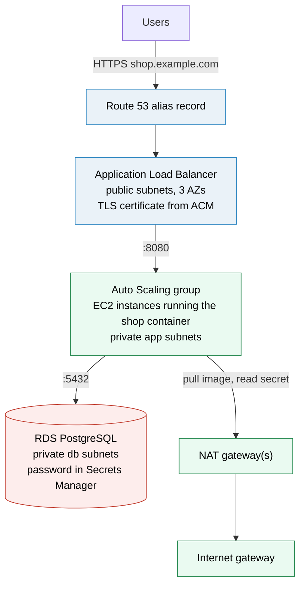
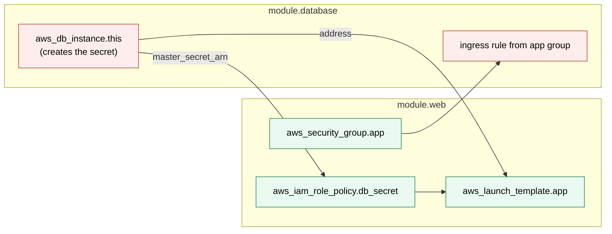
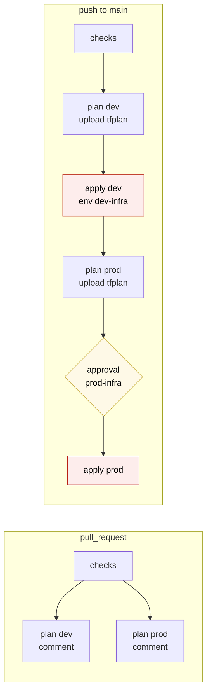
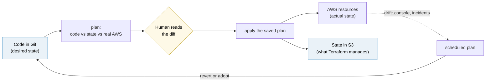

# Terraform worked example

> [!abstract] In one sentence
> The Acme shop built from an **empty AWS (Amazon Web Services) account to production** with Terraform, every file shown: a bootstrap that creates the state bucket and the CI (continuous integration) roles, three reusable modules (network, web tier, database), one thin folder per environment, tests and a GitHub Actions pipeline that plans on pull requests and applies saved plans with approval, the promotion to prod, and the day-2 changes (a rename, an import, an upgrade) that every real project meets.

## What gets built

Acme sells things online. The "shop" is a containerised web app that needs a PostgreSQL database. The target, in `eu-west-1`, for two environments in two AWS accounts (dev `222233334444`, prod `123456789012`):



The pieces, with the acronyms spelled out once: a VPC (Virtual Private Cloud) spread over three AZs (Availability Zones), public subnets for the ALB (Application Load Balancer) and the NAT (Network Address Translation) gateways, private subnets for the EC2 (Elastic Compute Cloud) instances of an Auto Scaling group, isolated subnets for RDS (Relational Database Service), a TLS (Transport Layer Security) certificate from ACM (AWS Certificate Manager), and DNS (Domain Name System) in Route 53. The AWS services themselves are explained in [[VPC]], [[Load balancers]], [[Auto Scaling]], [[RDS]] and [[Route 53]]; this note is about the Terraform.

Versions: Terraform 1.10+ (CI pins 1.13.4), AWS provider `~> 6.0`. Everything here also runs on OpenTofu (`tofu` instead of `terraform`).

## Step 0: bootstrap, the chicken and the egg

The plan for production is that **only the pipeline** applies changes (see [[Terraform in production]]). But the pipeline needs two things that must exist before it can run:

- **A place for state**: an S3 (Simple Storage Service) bucket. Terraform can't store its state in a bucket it hasn't created yet
- **A way to log in**: an OIDC (OpenID Connect) identity provider for GitHub and IAM (Identity and Access Management) roles. The pipeline can't create the role it uses to log in

So a small **bootstrap** configuration is applied **once per account, by an admin, from a laptop**, with local state. Then its state is moved into the bucket it just created.

### The bootstrap module

```hcl
# infra/modules/bootstrap/versions.tf
terraform {
  required_version = ">= 1.10"
  required_providers {
    aws = {
      source  = "hashicorp/aws"
      version = ">= 6.0"   # modules set a minimum; root modules pin the range
    }
  }
}
```

```hcl
# infra/modules/bootstrap/variables.tf
variable "repo" {
  type        = string
  description = "GitHub repository allowed to use the CI roles, owner/name"
}

variable "environment" {
  type        = string
  description = "Environment this account hosts (dev, prod)"
}
```

```hcl
# infra/modules/bootstrap/main.tf
data "aws_caller_identity" "current" {}

locals {
  bucket = "acme-tfstate-${data.aws_caller_identity.current.account_id}"   # globally unique
}

# ---------- State bucket ----------
resource "aws_s3_bucket" "state" {
  bucket = local.bucket

  lifecycle {
    prevent_destroy = true      # losing this = Terraform forgets everything
  }
}

resource "aws_s3_bucket_versioning" "state" {
  bucket = aws_s3_bucket.state.id
  versioning_configuration {
    status = "Enabled"          # every state write is a new version: a broken state can be rolled back
  }
}

resource "aws_s3_bucket_server_side_encryption_configuration" "state" {
  bucket = aws_s3_bucket.state.id
  rule {
    apply_server_side_encryption_by_default {
      sse_algorithm = "aws:kms"
    }
    bucket_key_enabled = true
  }
}

resource "aws_s3_bucket_public_access_block" "state" {
  bucket                  = aws_s3_bucket.state.id
  block_public_acls       = true
  block_public_policy     = true
  ignore_public_acls      = true
  restrict_public_buckets = true
}

resource "aws_s3_bucket_lifecycle_configuration" "state" {
  bucket = aws_s3_bucket.state.id
  rule {
    id     = "expire-old-state-versions"
    status = "Enabled"
    filter {}
    noncurrent_version_expiration {
      noncurrent_days = 90
    }
  }
}

data "aws_iam_policy_document" "state_bucket" {
  statement {
    sid       = "DenyInsecureTransport"
    effect    = "Deny"
    actions   = ["s3:*"]
    resources = [aws_s3_bucket.state.arn, "${aws_s3_bucket.state.arn}/*"]
    principals {
      type        = "*"
      identifiers = ["*"]
    }
    condition {
      test     = "Bool"
      variable = "aws:SecureTransport"
      values   = ["false"]
    }
  }
}

resource "aws_s3_bucket_policy" "state" {
  bucket = aws_s3_bucket.state.id
  policy = data.aws_iam_policy_document.state_bucket.json
}

# ---------- GitHub OIDC ----------
resource "aws_iam_openid_connect_provider" "github" {
  url            = "https://token.actions.githubusercontent.com"
  client_id_list = ["sts.amazonaws.com"]
}

# Plan role: pull requests and main (drift detection, post-merge plans). Read-only.
data "aws_iam_policy_document" "plan_trust" {
  statement {
    actions = ["sts:AssumeRoleWithWebIdentity"]
    principals {
      type        = "Federated"
      identifiers = [aws_iam_openid_connect_provider.github.arn]
    }
    condition {
      test     = "StringEquals"
      variable = "token.actions.githubusercontent.com:aud"
      values   = ["sts.amazonaws.com"]
    }
    condition {
      test     = "StringEquals"
      variable = "token.actions.githubusercontent.com:sub"
      values = [
        "repo:${var.repo}:pull_request",
        "repo:${var.repo}:ref:refs/heads/main",
      ]
    }
  }
}

resource "aws_iam_role" "plan" {
  name               = "acme-tf-plan"
  assume_role_policy = data.aws_iam_policy_document.plan_trust.json
}

resource "aws_iam_role_policy_attachment" "plan_readonly" {
  role       = aws_iam_role.plan.name
  policy_arn = "arn:aws:iam::aws:policy/ReadOnlyAccess"
}

data "aws_iam_policy_document" "state_access" {
  statement {
    sid       = "ListState"
    actions   = ["s3:ListBucket"]
    resources = [aws_s3_bucket.state.arn]
  }
  statement {
    sid       = "ReadState"
    actions   = ["s3:GetObject"]
    resources = ["${aws_s3_bucket.state.arn}/*"]
  }
  statement {
    sid       = "TakeAndReleaseLock"       # use_lockfile writes <key>.tflock next to the state
    actions   = ["s3:PutObject", "s3:DeleteObject"]
    resources = ["${aws_s3_bucket.state.arn}/*.tflock"]
  }
}

resource "aws_iam_role_policy" "plan_state" {
  name   = "terraform-state"
  role   = aws_iam_role.plan.id
  policy = data.aws_iam_policy_document.state_access.json
}

# Apply role: only from a job in the "<env>-infra" GitHub environment (approval gate).
data "aws_iam_policy_document" "apply_trust" {
  statement {
    actions = ["sts:AssumeRoleWithWebIdentity"]
    principals {
      type        = "Federated"
      identifiers = [aws_iam_openid_connect_provider.github.arn]
    }
    condition {
      test     = "StringEquals"
      variable = "token.actions.githubusercontent.com:aud"
      values   = ["sts.amazonaws.com"]
    }
    condition {
      test     = "StringEquals"
      variable = "token.actions.githubusercontent.com:sub"
      values   = ["repo:${var.repo}:environment:${var.environment}-infra"]
    }
  }
}

resource "aws_iam_role" "apply" {
  name                 = "acme-tf-apply"
  assume_role_policy   = data.aws_iam_policy_document.apply_trust.json
  max_session_duration = 7200      # long RDS changes
}

# Broad on purpose: Terraform creates IAM roles, networks, databases.
# Narrow it later with a permissions boundary; the approval gate is the main control.
resource "aws_iam_role_policy_attachment" "apply_admin" {
  role       = aws_iam_role.apply.name
  policy_arn = "arn:aws:iam::aws:policy/AdministratorAccess"
}
```

```hcl
# infra/modules/bootstrap/outputs.tf
output "state_bucket" {
  value = aws_s3_bucket.state.id
}

output "plan_role_arn" {
  value = aws_iam_role.plan.arn
}

output "apply_role_arn" {
  value = aws_iam_role.apply.arn
}
```

The OIDC and trust-policy reasoning (why one role per kind of job, what the `sub` claim contains) is in [[Connecting GitHub Actions to AWS]].

### The bootstrap root for dev

```hcl
# infra/bootstrap/dev/main.tf
terraform {
  required_version = "~> 1.10"
  required_providers {
    aws = {
      source  = "hashicorp/aws"
      version = "~> 6.0"
    }
  }

  # Added after the first apply (see below):
  # backend "s3" {
  #   bucket       = "acme-tfstate-222233334444"
  #   key          = "bootstrap/terraform.tfstate"
  #   region       = "eu-west-1"
  #   encrypt      = true
  #   use_lockfile = true
  # }
}

provider "aws" {
  region              = "eu-west-1"
  allowed_account_ids = ["222233334444"]    # refuse to run in any other account
  default_tags {
    tags = {
      Project   = "shop"
      ManagedBy = "terraform"
      Repo      = "acme/shop//infra/bootstrap/dev"
    }
  }
}

module "bootstrap" {
  source      = "../../modules/bootstrap"
  repo        = "acme/shop"
  environment = "dev"
}

output "state_bucket"   { value = module.bootstrap.state_bucket }
output "plan_role_arn"  { value = module.bootstrap.plan_role_arn }
output "apply_role_arn" { value = module.bootstrap.apply_role_arn }
```

`infra/bootstrap/prod/main.tf` is the same file with `123456789012` and `environment = "prod"`.

### Applying it, then moving its state

```bash
aws sso login --profile acme-dev-admin
export AWS_PROFILE=acme-dev-admin
cd infra/bootstrap/dev
terraform init
terraform apply
```

```text
Plan: 12 to add, 0 to change, 0 to destroy.

Changes to Outputs:
  + apply_role_arn = (known after apply)
  + plan_role_arn  = (known after apply)
  + state_bucket   = "acme-tfstate-222233334444"

Do you want to perform these actions?
  Enter a value: yes
...
Apply complete! Resources: 12 added, 0 changed, 0 destroyed.

Outputs:

apply_role_arn = "arn:aws:iam::222233334444:role/acme-tf-apply"
plan_role_arn  = "arn:aws:iam::222233334444:role/acme-tf-plan"
state_bucket   = "acme-tfstate-222233334444"
```

The state is now a local `terraform.tfstate` file on one laptop. Uncomment the `backend "s3"` block and move it into the bucket:

```bash
terraform init -migrate-state
```

```text
Initializing the backend...
Do you want to copy existing state to the new backend?
  Pre-existing state was found while migrating the previous "local" backend to the
  newly configured "s3" backend. No existing state was found in the newly
  configured "s3" backend. Do you want to copy this state to the new "s3"
  backend? Enter "yes" to copy and "no" to start with an empty state.

  Enter a value: yes

Successfully configured the backend "s3"! Terraform will automatically
use this backend unless the backend configuration changes.
```

```bash
terraform state list          # reads from S3 now: 12 resources (+ data sources)
rm terraform.tfstate terraform.tfstate.backup   # the local copies are now stale, delete them
```

Repeat for prod with the prod admin profile. From now on the bootstrap changes rarely, and when it does it's still applied by an admin (it holds the pipeline's own permissions).

> [!warning] An OIDC provider for GitHub can exist only once per account
> If the account already has `token.actions.githubusercontent.com` (from another project), `apply` fails with `EntityAlreadyExists`. Import it instead of creating it (Step 8 shows `import` blocks), or pass its ARN (Amazon Resource Name) in as a variable.

**The problem now:** there's a bucket and two roles, and nothing to run in them.

## Step 1: the repository layout

```text
shop/
├── .terraform-version          1.13.4 (read by tfenv/mise, so laptops match CI)
├── .tflint.hcl
├── .github/
│   ├── renovate.json
│   └── workflows/
│       ├── terraform.yml          PR checks + plans, main: dev then prod
│       ├── terraform-plan.yml     reusable: plan one environment
│       ├── terraform-apply.yml    reusable: apply a saved plan
│       └── drift.yml              scheduled drift detection
└── infra/
    ├── bootstrap/
    │   ├── dev/main.tf            state bucket + CI roles, applied by hand
    │   └── prod/main.tf
    ├── modules/                   reusable, no provider config, no backend
    │   ├── bootstrap/
    │   ├── network/
    │   ├── web/
    │   └── database/
    └── live/                      one root module per environment = one state each
        ├── dev/
        │   ├── versions.tf        Terraform/provider versions + backend
        │   ├── providers.tf
        │   ├── main.tf            calls the modules
        │   ├── variables.tf
        │   ├── outputs.tf
        │   └── terraform.tfvars   the only real difference between environments
        └── prod/                  same files, prod values
```

The rules behind it (more in [[Terraform environments and project layout]] and [[Terraform modules]]):
- **Modules** describe *what a network / web tier / database is*. They take inputs, never hard-code an environment, and never configure a provider or a backend
- **Live folders** say *which* of them exist *where*, with which sizes. They're thin: module calls and values
- **One folder per environment** means one state per environment, a different backend key, different credentials. A mistake in dev can't touch prod's state
- dev and prod run **the same module code**. When dev works, prod is the same shape with different numbers

## Step 2: the network module

The first real module. Three tiers of subnets in every AZ: public (load balancer, NAT), app (instances, outbound through NAT), db (no route out at all). The address plan per environment (`/16` each, so they never overlap if the VPCs are connected later; see [[VPC IP address planning]]):

| Tier | Computed with | dev (`10.20.0.0/16`) |
|---|---|---|
| public | `cidrsubnet(cidr, 8, i)` | `10.20.0.0/24`, `10.20.1.0/24`, `10.20.2.0/24` |
| app | `cidrsubnet(cidr, 4, i + 1)` | `10.20.16.0/20`, `10.20.32.0/20`, `10.20.48.0/20` |
| db | `cidrsubnet(cidr, 8, i + 64)` | `10.20.64.0/24`, `10.20.65.0/24`, `10.20.66.0/24` |

The app tier gets the big `/20` (4,096 addresses) because that's where instances (and later containers) multiply. The CIDR (Classless Inter-Domain Routing) arithmetic is in [[IP addressing and subnetting]].

```hcl
# infra/modules/network/versions.tf
terraform {
  required_version = ">= 1.10"
  required_providers {
    aws = {
      source  = "hashicorp/aws"
      version = ">= 6.0"
    }
  }
}
```

```hcl
# infra/modules/network/variables.tf
variable "name" {
  type        = string
  description = "Prefix for every resource name, e.g. shop-dev"
}

variable "cidr" {
  type        = string
  description = "VPC address range, a /16"

  validation {
    condition     = can(cidrhost(var.cidr, 0)) && endswith(var.cidr, "/16")
    error_message = "cidr must be a valid IPv4 /16, e.g. 10.20.0.0/16."
  }
}

variable "az_count" {
  type        = number
  default     = 3
  description = "How many Availability Zones to spread over"

  validation {
    condition     = var.az_count >= 2 && var.az_count <= 3
    error_message = "az_count must be 2 or 3."
  }
}

variable "single_nat_gateway" {
  type        = bool
  default     = false
  description = "One NAT gateway shared by all AZs: cheaper, but an AZ outage cuts outbound traffic. For dev."
}
```

```hcl
# infra/modules/network/main.tf
data "aws_availability_zones" "available" {
  state = "available"
}

locals {
  azs      = slice(sort(data.aws_availability_zones.available.names), 0, var.az_count)
  az_index = { for i, az in local.azs : az => i }    # { "eu-west-1a" = 0, "eu-west-1b" = 1, ... }
  nat_azs  = var.single_nat_gateway ? [local.azs[0]] : local.azs
}

resource "aws_vpc" "this" {
  cidr_block           = var.cidr
  enable_dns_support   = true
  enable_dns_hostnames = true
  tags                 = { Name = var.name }
}

resource "aws_internet_gateway" "this" {
  vpc_id = aws_vpc.this.id
  tags   = { Name = var.name }
}

# ---------- Subnets: keyed by AZ name, not by index ----------
resource "aws_subnet" "public" {
  for_each          = local.az_index
  vpc_id            = aws_vpc.this.id
  availability_zone = each.key
  cidr_block        = cidrsubnet(var.cidr, 8, each.value)
  tags              = { Name = "${var.name}-public-${each.key}", Tier = "public" }
}

resource "aws_subnet" "app" {
  for_each          = local.az_index
  vpc_id            = aws_vpc.this.id
  availability_zone = each.key
  cidr_block        = cidrsubnet(var.cidr, 4, each.value + 1)
  tags              = { Name = "${var.name}-app-${each.key}", Tier = "app" }
}

resource "aws_subnet" "db" {
  for_each          = local.az_index
  vpc_id            = aws_vpc.this.id
  availability_zone = each.key
  cidr_block        = cidrsubnet(var.cidr, 8, each.value + 64)
  tags              = { Name = "${var.name}-db-${each.key}", Tier = "db" }
}

# ---------- Public routing: default route to the internet gateway ----------
resource "aws_route_table" "public" {
  vpc_id = aws_vpc.this.id
  tags   = { Name = "${var.name}-public" }
}

resource "aws_route" "public_internet" {
  route_table_id         = aws_route_table.public.id
  destination_cidr_block = "0.0.0.0/0"
  gateway_id             = aws_internet_gateway.this.id
}

resource "aws_route_table_association" "public" {
  for_each       = aws_subnet.public
  subnet_id      = each.value.id
  route_table_id = aws_route_table.public.id
}

# ---------- NAT: one per AZ in prod, one in total in dev ----------
resource "aws_eip" "nat" {
  for_each = toset(local.nat_azs)
  domain   = "vpc"
  tags     = { Name = "${var.name}-nat-${each.key}" }
}

resource "aws_nat_gateway" "this" {
  for_each      = toset(local.nat_azs)
  allocation_id = aws_eip.nat[each.key].id
  subnet_id     = aws_subnet.public[each.key].id
  tags          = { Name = "${var.name}-${each.key}" }

  depends_on = [aws_internet_gateway.this]   # a NAT gateway needs the IGW to work, not referenced directly
}

# ---------- App routing: each AZ uses its own NAT (or the single one) ----------
resource "aws_route_table" "app" {
  for_each = local.az_index
  vpc_id   = aws_vpc.this.id
  tags     = { Name = "${var.name}-app-${each.key}" }
}

resource "aws_route" "app_nat" {
  for_each               = local.az_index
  route_table_id         = aws_route_table.app[each.key].id
  destination_cidr_block = "0.0.0.0/0"
  nat_gateway_id         = aws_nat_gateway.this[var.single_nat_gateway ? local.azs[0] : each.key].id
}

resource "aws_route_table_association" "app" {
  for_each       = aws_subnet.app
  subnet_id      = each.value.id
  route_table_id = aws_route_table.app[each.key].id
}

# ---------- DB routing: only the implicit local route, no way out ----------
resource "aws_route_table" "db" {
  vpc_id = aws_vpc.this.id
  tags   = { Name = "${var.name}-db" }
}

resource "aws_route_table_association" "db" {
  for_each       = aws_subnet.db
  subnet_id      = each.value.id
  route_table_id = aws_route_table.db.id
}
```

```hcl
# infra/modules/network/outputs.tf
output "vpc_id" {
  value = aws_vpc.this.id
}

output "azs" {
  value = local.azs
}

output "public_subnet_ids" {
  value = [for s in aws_subnet.public : s.id]   # map iterated in key order: a, b, c
}

output "app_subnet_ids" {
  value = [for s in aws_subnet.app : s.id]
}

output "db_subnet_ids" {
  value = [for s in aws_subnet.db : s.id]
}
```

Two choices worth noticing:
- **`for_each` keyed by AZ name**, never `count`. If `eu-west-1b` is ever removed, only its subnets go; with `count` the `c` subnets would shift to index 1 and be replaced (see [[Terraform resources and data sources]])
- `depends_on` appears once, where the dependency is real but not visible in any reference. Everywhere else the references (`aws_vpc.this.id`) already tell Terraform the order

## Step 3: the web tier module

Load balancer, certificate, DNS name, security groups, the instances' identity, and an Auto Scaling group running the shop container.

```hcl
# infra/modules/web/versions.tf
terraform {
  required_version = ">= 1.10"
  required_providers {
    aws = {
      source  = "hashicorp/aws"
      version = ">= 6.0"
    }
  }
}
```

```hcl
# infra/modules/web/variables.tf
variable "name"              { type = string }
variable "vpc_id"            { type = string }
variable "public_subnet_ids" { type = list(string) }
variable "app_subnet_ids"    { type = list(string) }

variable "zone_name" {
  type        = string
  description = "Existing Route 53 hosted zone, e.g. shop.example.com"
}

variable "domain_name" {
  type        = string
  description = "Name the shop answers on, inside zone_name"
}

variable "app_image" {
  type        = string
  description = "Full image reference, registry/repo:tag"
}

variable "instance_type" {
  type    = string
  default = "t3.small"
}

variable "min_size" {
  type = number
}

variable "max_size" {
  type = number

  validation {
    condition     = var.max_size >= var.min_size   # cross-variable validation, Terraform 1.9+
    error_message = "max_size must be >= min_size."
  }
}

variable "db_host" {
  type = string
}

variable "db_secret_arn" {
  type        = string
  description = "Secrets Manager secret holding the database credentials"
}

variable "deletion_protection" {
  type    = bool
  default = true
}
```

```hcl
# infra/modules/web/main.tf
data "aws_region" "current" {}
data "aws_default_tags" "current" {}

# Latest Amazon Linux 2023 AMI, published by AWS as a public SSM parameter
data "aws_ssm_parameter" "al2023" {
  name = "/aws/service/ami-amazon-linux-latest/al2023-ami-kernel-default-x86_64"
}

data "aws_route53_zone" "this" {
  name = var.zone_name      # created outside this stack (the domain's zone), so read, not managed
}

# ---------- Certificate, validated through DNS ----------
resource "aws_acm_certificate" "this" {
  domain_name       = var.domain_name
  validation_method = "DNS"

  lifecycle {
    create_before_destroy = true   # a new certificate exists before the old one is removed from the listener
  }
}

resource "aws_route53_record" "validation" {
  for_each = {
    for o in aws_acm_certificate.this.domain_validation_options : o.domain_name => o
  }
  zone_id         = data.aws_route53_zone.this.zone_id
  name            = each.value.resource_record_name
  type            = each.value.resource_record_type
  records         = [each.value.resource_record_value]
  ttl             = 60
  allow_overwrite = true
}

resource "aws_acm_certificate_validation" "this" {
  certificate_arn         = aws_acm_certificate.this.arn
  validation_record_fqdns = [for r in aws_route53_record.validation : r.fqdn]
}

# ---------- Security groups: groups first, rules as separate resources (no cycles) ----------
resource "aws_security_group" "alb" {
  name        = "${var.name}-alb"
  description = "Public load balancer"
  vpc_id      = var.vpc_id
}

resource "aws_vpc_security_group_ingress_rule" "alb_https" {
  security_group_id = aws_security_group.alb.id
  cidr_ipv4         = "0.0.0.0/0"
  ip_protocol       = "tcp"
  from_port         = 443
  to_port           = 443
}

resource "aws_vpc_security_group_ingress_rule" "alb_http" {
  security_group_id = aws_security_group.alb.id
  cidr_ipv4         = "0.0.0.0/0"
  ip_protocol       = "tcp"
  from_port         = 80          # only to redirect to HTTPS
  to_port           = 80
}

resource "aws_vpc_security_group_egress_rule" "alb_to_app" {
  security_group_id            = aws_security_group.alb.id
  referenced_security_group_id = aws_security_group.app.id
  ip_protocol                  = "tcp"
  from_port                    = 8080
  to_port                      = 8080
}

resource "aws_security_group" "app" {
  name        = "${var.name}-app"
  description = "Shop instances"
  vpc_id      = var.vpc_id
}

resource "aws_vpc_security_group_ingress_rule" "app_from_alb" {
  security_group_id            = aws_security_group.app.id
  referenced_security_group_id = aws_security_group.alb.id
  ip_protocol                  = "tcp"
  from_port                    = 8080
  to_port                      = 8080
}

resource "aws_vpc_security_group_egress_rule" "app_all" {
  security_group_id = aws_security_group.app.id
  cidr_ipv4         = "0.0.0.0/0"   # image registry, Secrets Manager, database
  ip_protocol       = "-1"
}

# ---------- Load balancer ----------
resource "aws_lb" "this" {
  name                       = "${var.name}-alb"
  load_balancer_type         = "application"
  security_groups            = [aws_security_group.alb.id]
  subnets                    = var.public_subnet_ids
  drop_invalid_header_fields = true
  enable_deletion_protection = var.deletion_protection
}

resource "aws_lb_target_group" "app" {
  name                 = "${var.name}-app"
  vpc_id               = var.vpc_id
  port                 = 8080
  protocol             = "HTTP"
  target_type          = "instance"
  deregistration_delay = 30

  health_check {
    path                = "/healthz"
    matcher             = "200"
    interval            = 15
    healthy_threshold   = 2
    unhealthy_threshold = 3
  }
}

resource "aws_lb_listener" "http" {
  load_balancer_arn = aws_lb.this.arn
  port              = 80
  protocol          = "HTTP"

  default_action {
    type = "redirect"
    redirect {
      protocol    = "HTTPS"
      port        = "443"
      status_code = "HTTP_301"
    }
  }
}

resource "aws_lb_listener" "https" {
  load_balancer_arn = aws_lb.this.arn
  port              = 443
  protocol          = "HTTPS"
  ssl_policy        = "ELBSecurityPolicy-TLS13-1-2-2021-06"
  certificate_arn   = aws_acm_certificate_validation.this.certificate_arn   # waits until validated

  default_action {
    type             = "forward"
    target_group_arn = aws_lb_target_group.app.arn
  }
}

resource "aws_route53_record" "app" {
  zone_id = data.aws_route53_zone.this.zone_id
  name    = var.domain_name
  type    = "A"

  alias {
    name                   = aws_lb.this.dns_name
    zone_id                = aws_lb.this.zone_id
    evaluate_target_health = true
  }
}

# ---------- Instances ----------
resource "aws_launch_template" "app" {
  name_prefix            = "${var.name}-app-"
  image_id               = data.aws_ssm_parameter.al2023.insecure_value   # a public AMI ID, not a secret
  instance_type          = var.instance_type
  vpc_security_group_ids = [aws_security_group.app.id]
  update_default_version = true

  iam_instance_profile {
    arn = aws_iam_instance_profile.app.arn
  }

  user_data = base64encode(templatefile("${path.module}/user_data.sh.tftpl", {
    region        = data.aws_region.current.region
    registry      = split("/", var.app_image)[0]
    app_image     = var.app_image
    db_host       = var.db_host
    db_secret_arn = var.db_secret_arn
  }))

  metadata_options {
    http_endpoint               = "enabled"
    http_tokens                 = "required"   # IMDSv2 only
    http_put_response_hop_limit = 2            # lets the container (one hop further) reach instance metadata
  }

  block_device_mappings {
    device_name = "/dev/xvda"
    ebs {
      volume_size = 20
      volume_type = "gp3"
      encrypted   = true
    }
  }

  # default_tags don't reach instances launched from a template: copy them explicitly
  tag_specifications {
    resource_type = "instance"
    tags          = merge(data.aws_default_tags.current.tags, { Name = "${var.name}-app" })
  }
}

resource "aws_autoscaling_group" "app" {
  name                      = "${var.name}-app"
  min_size                  = var.min_size
  max_size                  = var.max_size
  vpc_zone_identifier       = var.app_subnet_ids
  target_group_arns         = [aws_lb_target_group.app.arn]
  health_check_type         = "ELB"     # unhealthy in the target group = replaced
  health_check_grace_period = 120
  # No desired_capacity: the scaling policy owns it. Setting it here = drift on every scale event.

  launch_template {
    id      = aws_launch_template.app.id
    version = aws_launch_template.app.latest_version
  }

  instance_refresh {
    strategy = "Rolling"   # a new template version rolls the instances
    preferences {
      min_healthy_percentage = 100
      max_healthy_percentage = 200   # launch new ones before terminating old ones
      instance_warmup        = 120
    }
  }
}

resource "aws_autoscaling_policy" "cpu" {
  name                   = "cpu-50"
  autoscaling_group_name = aws_autoscaling_group.app.name
  policy_type            = "TargetTrackingScaling"

  target_tracking_configuration {
    predefined_metric_specification {
      predefined_metric_type = "ASGAverageCPUUtilization"
    }
    target_value = 50
  }
}
```

The instance's boot script, rendered by `templatefile()` (every `${...}` is filled in by Terraform before the instance ever sees it):

```bash
#!/bin/bash
# infra/modules/web/user_data.sh.tftpl
set -euo pipefail

dnf install -y docker
systemctl enable --now docker

aws ecr get-login-password --region ${region} \
  | docker login --username AWS --password-stdin ${registry}

docker run -d --name shop --restart=always -p 8080:8000 \
  -e AWS_REGION=${region} \
  -e DB_HOST=${db_host} \
  -e DB_SECRET_ARN=${db_secret_arn} \
  ${app_image}
```

The app reads its database password from Secrets Manager at start, with the instance role. Terraform passes only the secret's **ARN**, never the password.

```hcl
# infra/modules/web/iam.tf
data "aws_iam_policy_document" "ec2_assume" {
  statement {
    actions = ["sts:AssumeRole"]
    principals {
      type        = "Service"
      identifiers = ["ec2.amazonaws.com"]
    }
  }
}

resource "aws_iam_role" "app" {
  name               = "${var.name}-app"
  assume_role_policy = data.aws_iam_policy_document.ec2_assume.json
}

# Session Manager instead of SSH: no port 22, no keys
resource "aws_iam_role_policy_attachment" "ssm" {
  role       = aws_iam_role.app.name
  policy_arn = "arn:aws:iam::aws:policy/AmazonSSMManagedInstanceCore"
}

# Pull the image (the shared account's ECR repository policy allows this account)
resource "aws_iam_role_policy_attachment" "ecr" {
  role       = aws_iam_role.app.name
  policy_arn = "arn:aws:iam::aws:policy/AmazonEC2ContainerRegistryReadOnly"
}

data "aws_iam_policy_document" "db_secret" {
  statement {
    actions   = ["secretsmanager:GetSecretValue"]
    resources = [var.db_secret_arn]    # this one secret, nothing else
  }
}

resource "aws_iam_role_policy" "db_secret" {
  name   = "read-db-secret"
  role   = aws_iam_role.app.id
  policy = data.aws_iam_policy_document.db_secret.json
}

resource "aws_iam_instance_profile" "app" {
  name = "${var.name}-app"
  role = aws_iam_role.app.name
}
```

```hcl
# infra/modules/web/outputs.tf
output "url" {
  value = "https://${var.domain_name}"
}

output "alb_dns_name" {
  value = aws_lb.this.dns_name
}

output "app_security_group_id" {
  value = aws_security_group.app.id
}

output "asg_name" {
  value = aws_autoscaling_group.app.name
}
```

Things in this module that are easy to miss:
- The security groups reference each other (ALB egress → app group, app ingress ← ALB group). Written as **inline rules** that's a cycle error; as separate rule resources the graph is fine
- `certificate_arn = aws_acm_certificate_validation.this.certificate_arn` instead of `aws_acm_certificate.this.arn`: same value, but referencing the validation resource makes the listener **wait** until the certificate is issued
- The AMI comes from a data source, so when AWS publishes a new Amazon Linux image, the next plan shows a new launch template version and the instance refresh rolls every instance. That's patching for free, but it's a change in a plan nobody asked for: read it as such, or pin `image_id` with a variable and bump it on purpose
- ECR (Elastic Container Registry), SSM (Systems Manager), IMDSv2 (Instance Metadata Service version 2) and the instance role are AWS topics: [[EC2]], [[Systems Manager]], [[IAM]]

## Step 4: the database module

```hcl
# infra/modules/database/versions.tf
terraform {
  required_version = ">= 1.10"
  required_providers {
    aws = {
      source  = "hashicorp/aws"
      version = ">= 6.0"
    }
  }
}
```

```hcl
# infra/modules/database/variables.tf
variable "name"                  { type = string }
variable "vpc_id"                { type = string }
variable "db_subnet_ids"         { type = list(string) }
variable "app_security_group_id" { type = string }

variable "instance_class" {
  type    = string
  default = "db.t4g.micro"
}

variable "allocated_storage" {
  type    = number
  default = 20
}

variable "multi_az" {
  type    = bool
  default = true
}

variable "backup_retention_days" {
  type    = number
  default = 7
}

variable "deletion_protection" {
  type    = bool
  default = true
}
```

```hcl
# infra/modules/database/main.tf
resource "aws_db_subnet_group" "this" {
  name       = var.name
  subnet_ids = var.db_subnet_ids
}

resource "aws_security_group" "db" {
  name        = "${var.name}-db"
  description = "Shop database"
  vpc_id      = var.vpc_id
  # No egress rules: Terraform removes AWS's default allow-all egress on groups it creates
}

resource "aws_vpc_security_group_ingress_rule" "db_from_app" {
  security_group_id            = aws_security_group.db.id
  referenced_security_group_id = var.app_security_group_id
  ip_protocol                  = "tcp"
  from_port                    = 5432
  to_port                      = 5432
}

resource "aws_db_instance" "this" {
  identifier     = var.name        # changing this later = a new database (forces replacement)
  engine         = "postgres"
  engine_version = "17"

  instance_class        = var.instance_class
  allocated_storage     = var.allocated_storage
  max_allocated_storage = var.allocated_storage * 5   # storage autoscaling
  storage_type          = "gp3"
  storage_encrypted     = true

  db_name  = "shop"
  username = "shop_admin"
  # RDS generates the password, stores it in Secrets Manager and rotates it.
  # It never appears in code, tfvars, plan or state.
  manage_master_user_password = true

  db_subnet_group_name   = aws_db_subnet_group.this.name
  vpc_security_group_ids = [aws_security_group.db.id]
  publicly_accessible    = false

  multi_az                     = var.multi_az
  backup_retention_period      = var.backup_retention_days
  copy_tags_to_snapshot        = true
  performance_insights_enabled = true
  auto_minor_version_upgrade   = true
  apply_immediately            = false   # risky modifications wait for the maintenance window

  deletion_protection       = var.deletion_protection
  skip_final_snapshot       = !var.deletion_protection
  final_snapshot_identifier = var.deletion_protection ? "${var.name}-final" : null
}
```

```hcl
# infra/modules/database/outputs.tf
output "address" {
  value = aws_db_instance.this.address
}

output "port" {
  value = aws_db_instance.this.port
}

output "master_secret_arn" {
  value = aws_db_instance.this.master_user_secret[0].secret_arn
}

output "security_group_id" {
  value = aws_security_group.db.id
}
```

> [!info] Why no `prevent_destroy` here
> `lifecycle` arguments must be literal values: `prevent_destroy = var.deletion_protection` is an error. Setting it to `true` in the module would also block destroying dev. So the module relies on AWS-side `deletion_protection` (a variable, `true` in prod), and the final snapshot. A team that wants both can keep a prod-only wrapper or an SCP (service control policy), see [[Terraform in production]].

## Step 5: the dev environment

Now the live folder wires the three modules together.

```hcl
# infra/live/dev/versions.tf
terraform {
  required_version = "~> 1.10"
  required_providers {
    aws = {
      source  = "hashicorp/aws"
      version = "~> 6.0"
    }
  }

  # Backend blocks can't use variables: literal values, one per environment
  backend "s3" {
    bucket       = "acme-tfstate-222233334444"
    key          = "shop/dev/terraform.tfstate"
    region       = "eu-west-1"
    encrypt      = true
    use_lockfile = true
  }
}
```

```hcl
# infra/live/dev/providers.tf
provider "aws" {
  region              = var.region
  allowed_account_ids = [var.account_id]

  default_tags {
    tags = {
      Project     = "shop"
      Environment = var.environment
      ManagedBy   = "terraform"
      Repo        = "acme/shop"
    }
  }
}
```

```hcl
# infra/live/dev/variables.tf
variable "environment" { type = string }
variable "account_id"  { type = string }

variable "region" {
  type    = string
  default = "eu-west-1"
}

variable "vpc_cidr"           { type = string }
variable "single_nat_gateway" { type = bool }

variable "zone_name"   { type = string }
variable "domain_name" { type = string }
variable "app_image"   { type = string }

variable "instance_type" { type = string }
variable "min_size"      { type = number }
variable "max_size"      { type = number }

variable "db_instance_class"        { type = string }
variable "db_allocated_storage"     { type = number }
variable "db_multi_az"              { type = bool }
variable "db_backup_retention_days" { type = number }

variable "deletion_protection" { type = bool }
```

```hcl
# infra/live/dev/main.tf
locals {
  name = "shop-${var.environment}"
}

module "network" {
  source             = "../../modules/network"
  name               = local.name
  cidr               = var.vpc_cidr
  az_count           = 3
  single_nat_gateway = var.single_nat_gateway
}

module "web" {
  source            = "../../modules/web"
  name              = local.name
  vpc_id            = module.network.vpc_id
  public_subnet_ids = module.network.public_subnet_ids
  app_subnet_ids    = module.network.app_subnet_ids

  zone_name     = var.zone_name
  domain_name   = var.domain_name
  app_image     = var.app_image
  instance_type = var.instance_type
  min_size      = var.min_size
  max_size      = var.max_size

  db_host       = module.database.address
  db_secret_arn = module.database.master_secret_arn

  deletion_protection = var.deletion_protection
}

module "database" {
  source                = "../../modules/database"
  name                  = local.name
  vpc_id                = module.network.vpc_id
  db_subnet_ids         = module.network.db_subnet_ids
  app_security_group_id = module.web.app_security_group_id

  instance_class        = var.db_instance_class
  allocated_storage     = var.db_allocated_storage
  multi_az              = var.db_multi_az
  backup_retention_days = var.db_backup_retention_days
  deletion_protection   = var.deletion_protection
}
```

```hcl
# infra/live/dev/outputs.tf
output "url" {
  value = module.web.url
}

output "alb_dns_name" {
  value = module.web.alb_dns_name
}

output "db_endpoint" {
  value = module.database.address
}

output "db_secret_arn" {
  value = module.database.master_secret_arn
}

output "vpc_id" {
  value = module.network.vpc_id
}
```

```hcl
# infra/live/dev/terraform.tfvars
environment = "dev"
account_id  = "222233334444"

vpc_cidr           = "10.20.0.0/16"
single_nat_gateway = true            # ~1 NAT instead of 3: saves money, dev can live with it

zone_name   = "dev.shop.example.com" # delegated from the prod zone, exists already
domain_name = "dev.shop.example.com"
app_image   = "111122223333.dkr.ecr.eu-west-1.amazonaws.com/shop-api:1.4.2"

instance_type = "t3.small"
min_size      = 1
max_size      = 2

db_instance_class        = "db.t4g.micro"
db_allocated_storage     = 20
db_multi_az              = false
db_backup_retention_days = 1
deletion_protection      = false     # dev can be torn down
```

`web` takes the database's address and secret, and `database` takes the web tier's security group. That looks circular, but Terraform builds its graph from **resources**, not modules: module inputs and outputs are individual nodes. As long as no chain of resources loops back on itself, modules can feed each other:



The order follows: the app security group first, then the database (it doesn't need the rule to start), then the policy and launch template that need the database's outputs.

### The first apply (by hand, the only time)

There's no pipeline yet (Step 6), so the very first dev apply is run by an admin, against the remote state:

```bash
export AWS_PROFILE=acme-dev-admin
cd infra/live/dev
terraform init
terraform plan -out=tfplan
```

```text
module.network.data.aws_availability_zones.available: Reading...
module.web.data.aws_route53_zone.this: Reading...
module.web.data.aws_ssm_parameter.al2023: Reading...
...
Terraform will perform the following actions:

  # module.database.aws_db_instance.this will be created
  + resource "aws_db_instance" "this" {
      + address                     = (known after apply)
      + allocated_storage           = 20
      + deletion_protection         = false
      + engine                      = "postgres"
      + engine_version              = "17"
      + identifier                  = "shop-dev"
      + instance_class              = "db.t4g.micro"
      + manage_master_user_password = true
      + master_user_secret          = (known after apply)
      + multi_az                    = false
      + storage_encrypted           = true
      ...
    }

  # module.network.aws_subnet.app["eu-west-1a"] will be created
  + resource "aws_subnet" "app" {
      + availability_zone = "eu-west-1a"
      + cidr_block        = "10.20.16.0/20"
      ...
    }
...
Plan: 58 to add, 0 to change, 0 to destroy.

Changes to Outputs:
  + alb_dns_name  = (known after apply)
  + db_endpoint   = (known after apply)
  + db_secret_arn = (known after apply)
  + url           = "https://dev.shop.example.com"
  + vpc_id        = (known after apply)
```

58 = 31 network (VPC, gateway, 9 subnets, 1 NAT + address, 5 route tables, 4 routes, 9 associations) + 23 web + 4 database. Read the plan for the things that matter (CIDRs, `deletion_protection`, the public-facing rules), then apply exactly that plan:

```bash
terraform apply tfplan
```

```text
module.network.aws_vpc.this: Creating...
module.network.aws_vpc.this: Creation complete after 2s [id=vpc-0a1b2c3d4e5f60718]
module.web.aws_acm_certificate.this: Creating...
...
module.database.aws_db_instance.this: Still creating... [05m10s elapsed]
module.web.aws_acm_certificate_validation.this: Creation complete after 1m42s
...
module.database.aws_db_instance.this: Creation complete after 7m42s [id=db-ABCDEFGHIJKLMNOPQRSTUVWXY0]
module.web.aws_launch_template.app: Creation complete after 1s [id=lt-0c9d8e7f6a5b4c3d2]
module.web.aws_autoscaling_group.app: Creation complete after 1m21s [id=shop-dev-app]

Apply complete! Resources: 58 added, 0 changed, 0 destroyed.

Outputs:

alb_dns_name  = "shop-dev-alb-1234567890.eu-west-1.elb.amazonaws.com"
db_endpoint   = "shop-dev.c1x2y3z4a5b6.eu-west-1.rds.amazonaws.com"
db_secret_arn = "arn:aws:secretsmanager:eu-west-1:222233334444:secret:rds!db-3f2a...-AbCdEf"
url           = "https://dev.shop.example.com"
vpc_id        = "vpc-0a1b2c3d4e5f60718"
```

How to tell it worked:

```bash
curl -sI https://dev.shop.example.com/healthz     # HTTP/2 200
terraform plan                                    # "No changes. Your infrastructure matches the configuration."
```

The second check matters as much as the first: a configuration that doesn't plan clean right after its own apply has a perpetual diff, and it will annoy every future PR (pull request).

**The problem now:** this worked from one laptop. From here on, changes go through the pipeline only.

## Step 6: tests, then the pipeline

### Module tests

`terraform test` runs `.tftest.hcl` files against a module. With a **mocked provider** (Terraform 1.7+), a `plan`-only test needs no AWS account and runs in seconds. More on tests in [[Terraform testing and validation]].

```hcl
# infra/modules/network/tests/network.tftest.hcl
mock_provider "aws" {
  mock_data "aws_availability_zones" {
    defaults = {
      names = ["eu-west-1a", "eu-west-1b", "eu-west-1c"]
    }
  }
}

variables {
  name               = "test"
  cidr               = "10.99.0.0/16"
  az_count           = 3
  single_nat_gateway = true
}

run "dev_shape_one_nat" {
  command = plan

  assert {
    condition     = length(aws_subnet.app) == 3
    error_message = "Expected one app subnet per AZ."
  }

  assert {
    condition     = length(aws_nat_gateway.this) == 1
    error_message = "single_nat_gateway must create exactly one NAT gateway."
  }

  assert {
    condition     = aws_subnet.app["eu-west-1a"].cidr_block == "10.99.16.0/20"
    error_message = "App subnets must be /20s starting at x.x.16.0."
  }
}

run "prod_shape_nat_per_az" {
  command = plan

  variables {
    single_nat_gateway = false
  }

  assert {
    condition     = length(aws_nat_gateway.this) == 3
    error_message = "Expected one NAT gateway per AZ."
  }
}

run "rejects_wrong_prefix" {
  command = plan

  variables {
    cidr = "10.99.0.0/20"
  }

  expect_failures = [var.cidr]    # the validation must catch it
}
```

```bash
cd infra/modules/network
terraform init
terraform test
```

```text
tests/network.tftest.hcl... in progress
  run "dev_shape_one_nat"... pass
  run "prod_shape_nat_per_az"... pass
  run "rejects_wrong_prefix"... pass
tests/network.tftest.hcl... tearing down
tests/network.tftest.hcl... pass

Success! 3 passed, 0 failed.
```

### Lint and security scan

```hcl
# .tflint.hcl
plugin "terraform" {
  enabled = true
  preset  = "recommended"
}

plugin "aws" {
  enabled = true
  version = "0.38.0"
  source  = "github.com/terraform-linters/tflint-ruleset-aws"
}
```

Checkov flags a few things on the first run (no WAF (Web Application Firewall) on the ALB, no access logs). Each finding is either fixed or skipped **with a reason, next to the code**, so the next reader knows it was a decision:

```hcl
resource "aws_lb" "this" {
  #checkov:skip=CKV2_AWS_28:WAF is added with the edge module, tracked in issue 42
  name = "${var.name}-alb"
  # ...
}
```

### The GitHub environments

In the repository settings, two environments:

| Environment | Protection | Its name ends up in the OIDC `sub` |
|---|---|---|
| `dev-infra` | Deployment branches: `main` only | `repo:acme/shop:environment:dev-infra` → can assume `acme-tf-apply` in dev |
| `prod-infra` | `main` only + required reviewers (2 people from team-platform) | `repo:acme/shop:environment:prod-infra` → can assume `acme-tf-apply` in prod |

### The workflows

The flow: on a PR, checks and a plan per environment posted as comments. On merge, plan dev → apply dev → plan prod → **approval** → apply prod, always applying the saved plan file.



```yaml
# .github/workflows/terraform.yml
name: terraform

on:
  pull_request:
    paths: ["infra/**", ".github/workflows/terraform*.yml"]
  push:
    branches: [main]
    paths: ["infra/**", ".github/workflows/terraform*.yml"]

permissions:
  contents: read

concurrency:
  # PRs: one run per PR. main: one run at a time, queued, never cancelled
  group: terraform-${{ github.event_name == 'push' && 'main' || github.event.pull_request.number }}
  cancel-in-progress: false

jobs:
  checks:
    runs-on: ubuntu-latest
    steps:
      - uses: actions/checkout@v4
      - uses: hashicorp/setup-terraform@v3
        with:
          terraform_version: 1.13.4
          terraform_wrapper: false
      - name: Format
        run: terraform fmt -check -recursive infra
      - name: Validate environments
        run: |
          for env in infra/live/*/; do
            terraform -chdir="$env" init -backend=false -input=false
            terraform -chdir="$env" validate
          done
      - name: Module tests
        run: |
          for mod in infra/modules/*/; do
            if [ -d "$mod/tests" ]; then
              terraform -chdir="$mod" init -input=false
              terraform -chdir="$mod" test
            fi
          done
      - uses: terraform-linters/setup-tflint@v4
      - name: Lint
        run: |
          tflint --init --config "$GITHUB_WORKSPACE/.tflint.hcl"
          tflint --recursive --config "$GITHUB_WORKSPACE/.tflint.hcl" --chdir infra
      - name: Security scan
        run: pipx run checkov -d infra --framework terraform --quiet --compact

  # ---------- Pull requests: plan every environment, comment ----------
  plan-pr:
    if: github.event_name == 'pull_request'
    needs: checks
    strategy:
      fail-fast: false
      matrix:
        env: [dev, prod]
    uses: ./.github/workflows/terraform-plan.yml
    with:
      env: ${{ matrix.env }}
      comment: true
    permissions:
      contents: read
      id-token: write
      pull-requests: write

  # ---------- main: dev, then prod with approval ----------
  plan-dev:
    if: github.event_name == 'push'
    needs: checks
    uses: ./.github/workflows/terraform-plan.yml
    with:
      env: dev
      upload: true
    permissions:
      contents: read
      id-token: write

  apply-dev:
    needs: plan-dev
    uses: ./.github/workflows/terraform-apply.yml
    with:
      env: dev
    permissions:
      contents: read
      id-token: write

  plan-prod:
    needs: apply-dev           # a change that breaks dev never reaches the prod plan
    uses: ./.github/workflows/terraform-plan.yml
    with:
      env: prod
      upload: true
    permissions:
      contents: read
      id-token: write

  apply-prod:
    needs: plan-prod
    uses: ./.github/workflows/terraform-apply.yml
    with:
      env: prod
    permissions:
      contents: read
      id-token: write
```

```yaml
# .github/workflows/terraform-plan.yml
name: terraform-plan

on:
  workflow_call:
    inputs:
      env:     { type: string,  required: true }
      comment: { type: boolean, default: false }
      upload:  { type: boolean, default: false }

env:
  ACCOUNT_ID: ${{ fromJSON('{"dev":"222233334444","prod":"123456789012"}')[inputs.env] }}

jobs:
  plan:
    runs-on: ubuntu-latest
    timeout-minutes: 30
    defaults:
      run:
        working-directory: infra/live/${{ inputs.env }}
    steps:
      - uses: actions/checkout@v4
      - uses: hashicorp/setup-terraform@v3
        with:
          terraform_version: 1.13.4
          terraform_wrapper: false
      - uses: aws-actions/configure-aws-credentials@v4
        with:
          role-to-assume: arn:aws:iam::${{ env.ACCOUNT_ID }}:role/acme-tf-plan
          role-session-name: tf-plan-${{ inputs.env }}-${{ github.run_id }}
          aws-region: eu-west-1

      - run: terraform init -input=false -lockfile=readonly
      - run: terraform plan -input=false -lock-timeout=5m -out=tfplan

      - name: Render the plan
        run: |
          terraform show -no-color tfplan > plan.txt
          DELETES=$(terraform show -json tfplan \
            | jq '[.resource_changes[] | select(.change.actions | index("delete"))] | length')
          {
            echo "### \`${{ inputs.env }}\`: $(grep -E '^(Plan:|No changes)' plan.txt || echo 'see the run log')"
            if [ "$DELETES" -gt 0 ]; then
              echo "> [!CAUTION]"
              echo "> $DELETES resource(s) will be deleted or replaced"
            fi
            echo "<details><summary>Full plan</summary>"
            echo
            echo '```'
            tail -c 55000 plan.txt
            echo '```'
            echo "</details>"
          } > comment.md
          cat comment.md >> "$GITHUB_STEP_SUMMARY"   # what the prod approver reads

      - if: inputs.comment
        env:
          GH_TOKEN: ${{ github.token }}
        run: gh pr comment "${{ github.event.pull_request.number }}" --body-file comment.md

      - if: inputs.upload
        uses: actions/upload-artifact@v4
        with:
          name: tfplan-${{ inputs.env }}
          path: infra/live/${{ inputs.env }}/tfplan
          retention-days: 1          # contains secrets in readable form
```

```yaml
# .github/workflows/terraform-apply.yml
name: terraform-apply

on:
  workflow_call:
    inputs:
      env: { type: string, required: true }

env:
  ACCOUNT_ID: ${{ fromJSON('{"dev":"222233334444","prod":"123456789012"}')[inputs.env] }}

jobs:
  apply:
    runs-on: ubuntu-latest
    timeout-minutes: 90              # above the slowest resource (RDS changes)
    environment: ${{ inputs.env }}-infra    # approval gate + the OIDC sub the apply role trusts
    concurrency:
      group: terraform-apply-${{ inputs.env }}
      cancel-in-progress: false
    defaults:
      run:
        working-directory: infra/live/${{ inputs.env }}
    steps:
      - uses: actions/checkout@v4
      - uses: hashicorp/setup-terraform@v3
        with:
          terraform_version: 1.13.4
          terraform_wrapper: false
      - uses: aws-actions/configure-aws-credentials@v4
        with:
          role-to-assume: arn:aws:iam::${{ env.ACCOUNT_ID }}:role/acme-tf-apply
          role-session-name: tf-apply-${{ inputs.env }}-${{ github.run_id }}
          aws-region: eu-west-1
          role-duration-seconds: 7200

      - run: terraform init -input=false -lockfile=readonly
      - uses: actions/download-artifact@v4
        with:
          name: tfplan-${{ inputs.env }}
          path: infra/live/${{ inputs.env }}
      - run: terraform apply -input=false tfplan     # the saved plan, nothing else
```

The drift detection workflow (`drift.yml`, a weekday plan with `-detailed-exitcode` that opens an issue) is the one shown in [[Terraform in production]], unchanged.

A typical PR now looks like this: the author changes `max_size = 2` to `3` in dev, and within three minutes the PR has two comments:

```text
### `dev`: Plan: 0 to add, 1 to change, 0 to destroy.
  # module.web.aws_autoscaling_group.app will be updated in-place
  ~ resource "aws_autoscaling_group" "app" {
        id       = "shop-dev-app"
      ~ max_size = 2 -> 3
        name     = "shop-dev-app"
        # (24 unchanged attributes hidden)
    }

### `prod`: No changes. Your infrastructure matches the configuration.
```

## Step 7: promote to prod

Everything prod needs already exists as code. What's left:

1. **Bootstrap prod** (admin, prod profile): `infra/bootstrap/prod`, apply, migrate state. Same as Step 0
2. **The prod folder**: `versions.tf`, `providers.tf`, `main.tf`, `variables.tf`, `outputs.tf` are **copies** of dev's (thin by design). Only two things differ:

```diff
 # infra/live/prod/versions.tf
   backend "s3" {
-    bucket       = "acme-tfstate-222233334444"
-    key          = "shop/dev/terraform.tfstate"
+    bucket       = "acme-tfstate-123456789012"
+    key          = "shop/prod/terraform.tfstate"
```

```hcl
# infra/live/prod/terraform.tfvars
environment = "prod"
account_id  = "123456789012"

vpc_cidr           = "10.10.0.0/16"
single_nat_gateway = false           # one NAT per AZ: an AZ outage doesn't cut the others off

zone_name   = "shop.example.com"
domain_name = "shop.example.com"
app_image   = "111122223333.dkr.ecr.eu-west-1.amazonaws.com/shop-api:1.4.2"   # the image tested in dev

instance_type = "t3.medium"
min_size      = 3                    # one per AZ
max_size      = 9

db_instance_class        = "db.t4g.medium"
db_allocated_storage     = 100
db_multi_az              = true
db_backup_retention_days = 14
deletion_protection      = true
```

3. **Open the PR.** The comment for prod reads `Plan: 62 to add, 0 to change, 0 to destroy.` (dev's 58 + two more NAT gateways and their addresses), dev reads `No changes`
4. **Review, merge.** The pipeline plans and applies dev (nothing to do), plans prod and **stops at the `prod-infra` environment**. The reviewers read the plan in the run summary, approve, and the saved plan is applied

`dev` vs `prod` is now visible in one place, `terraform.tfvars`:

| Setting | dev | prod | Why |
|---|---|---|---|
| NAT gateways | 1 | 3 | Cost vs surviving an AZ outage |
| Instances | t3.small, 1–2 | t3.medium, 3–9 | One per AZ minimum in prod |
| Database | db.t4g.micro, single-AZ, 1 day backups | db.t4g.medium, Multi-AZ, 14 days | Failover and recovery window |
| Deletion protection | off | on (ALB and RDS) | dev can be destroyed and rebuilt |

**Releasing a new app version** in this setup is a one-line change: bump `app_image` to `shop-api:1.5.0` in dev's tfvars, PR, merge (the launch template changes, the instance refresh rolls the instances behind the load balancer), then the same line in prod's tfvars. The same tested image moves forward. (Bigger setups split app deploys from infrastructure: see [[ECS production stack]] and [[Deployment strategies]].)

## Step 8: day 2

The stack runs. The changes that come next are the ones Terraform beginners never practise.

### 8a. Renaming a resource without destroying it

An internal load balancer is coming, so `aws_lb.this` should become `aws_lb.public`. Renaming it in the code and nothing else:

```text
  # module.web.aws_lb.this will be destroyed
  # (because aws_lb.this is not in configuration)
  - resource "aws_lb" "this" { ... }

  # module.web.aws_lb.public will be created
  + resource "aws_lb" "public" { ... }

  # module.web.aws_lb_listener.http must be replaced
  # module.web.aws_lb_listener.https must be replaced
  # module.web.aws_route53_record.app will be updated in-place
...
Plan: 3 to add, 1 to change, 3 to destroy.
```

A new load balancer means a new DNS name and minutes of downtime, for a rename. Terraform tracks resources by **address**, so the code has to say the address moved:

```hcl
# infra/modules/web/main.tf
resource "aws_lb" "public" {
  # ... unchanged ...
}

moved {
  from = aws_lb.this
  to   = aws_lb.public
}
```

```text
  # module.web.aws_lb.this has moved to module.web.aws_lb.public
    resource "aws_lb" "public" {
        id   = "arn:aws:elasticloadbalancing:eu-west-1:222233334444:loadbalancer/app/shop-dev-alb/..."
        name = "shop-dev-alb"
        # (21 unchanged attributes hidden)
    }

Plan: 0 to add, 0 to change, 0 to destroy.
```

The `moved` block stays until every state that uses the module (dev **and** prod) has applied it; removing it earlier brings the destroy back for whichever environment hasn't caught up.

### 8b. Importing a resource someone clicked

During an incident in prod, someone created an S3 bucket `acme-shop-prod-alb-logs` in the console, added the bucket policy that lets the load balancer write to it, and turned on access logs on the ALB. Drift detection opened an issue the next morning: the ALB has `access_logs` that the code doesn't have.

The decision: keep it (access logs are useful), so bring it into code. First the module learns about access logs:

```hcl
# infra/modules/web/variables.tf (added)
variable "access_logs_bucket" {
  type    = string
  default = null       # no logs unless a bucket is given
}
```

```hcl
# infra/modules/web/main.tf, inside resource "aws_lb" "public"
  dynamic "access_logs" {
    for_each = var.access_logs_bucket == null ? [] : [var.access_logs_bucket]
    content {
      bucket  = access_logs.value
      prefix  = "alb"
      enabled = true
    }
  }
```

Then the prod root imports the bucket and its policy, and passes the bucket to the module:

```hcl
# infra/live/prod/logs.tf
import {
  to = aws_s3_bucket.alb_logs
  id = "acme-shop-prod-alb-logs"
}

import {
  to = aws_s3_bucket_policy.alb_logs
  id = "acme-shop-prod-alb-logs"
}
```

```bash
cd infra/live/prod
terraform plan -generate-config-out=generated.tf
```

Terraform writes `generated.tf` with every attribute it read from AWS. That file is a draft: it holds dozens of defaults and the policy as a raw JSON (JavaScript Object Notation) string. Trimmed and moved into `logs.tf`:

```hcl
# infra/live/prod/logs.tf (after the imports)
resource "aws_s3_bucket" "alb_logs" {
  bucket = "acme-shop-prod-alb-logs"
}

resource "aws_s3_bucket_policy" "alb_logs" {
  bucket = aws_s3_bucket.alb_logs.id
  policy = jsonencode({
    # pasted from generated.tf, unchanged: the policy the console wrote
    Version = "2012-10-17"
    Statement = [{
      Effect    = "Allow"
      Principal = { AWS = "arn:aws:iam::156460612806:root" }   # the ELB service account for eu-west-1
      Action    = "s3:PutObject"
      Resource  = "arn:aws:s3:::acme-shop-prod-alb-logs/alb/AWSLogs/123456789012/*"
    }]
  })
}
```

```hcl
# infra/live/prod/main.tf, in module "web"
  access_logs_bucket = aws_s3_bucket.alb_logs.id
```

```text
  # aws_s3_bucket.alb_logs will be imported
  # aws_s3_bucket_policy.alb_logs will be imported

Plan: 2 to import, 0 to add, 0 to change, 0 to destroy.
```

`0 to change` on the ALB is the proof that the code now describes exactly what was clicked. The PR goes through the normal pipeline; the import happens during the approved apply. Afterwards the `import` blocks can be deleted (they're no-ops once the resources are in state).

### 8c. Upgrading the provider

Renovate opens a PR on its own: "Update terraform aws to v6.15.0". It only touches the lock files, because `~> 6.0` already allows 6.15:

```diff
 # infra/live/dev/.terraform.lock.hcl
 provider "registry.terraform.io/hashicorp/aws" {
-  version     = "6.14.1"
+  version     = "6.15.0"
   constraints = "~> 6.0"
   hashes = [
-    "h1:Xq3...=",
+    "h1:9mZ...=",
```

The Renovate configuration, `.github/renovate.json`:

```json
{
  "$schema": "https://docs.renovatebot.com/renovate-schema.json",
  "extends": ["config:recommended"],
  "packageRules": [
    {
      "matchManagers": ["terraform"],
      "groupName": "terraform providers",
      "schedule": ["before 8am on monday"]
    },
    {
      "matchManagers": ["terraform"],
      "matchUpdateTypes": ["major"],
      "labels": ["needs-upgrade-guide"]
    }
  ]
}
```

**The plan is the test.** Both comments must say `No changes. Your infrastructure matches the configuration.` If a minor bump shows changes, it isn't merged until someone understands them (a new default, a normalisation, a bug). A major version (6 → 7) is a deliberate PR with the provider's upgrade guide open, dev first.

The Terraform CLI itself is upgraded the same way: one PR changing `.terraform-version` and `terraform_version` in the workflows together, because a newer CLI can write state an older one can't read.

## The whole picture

```text
shop/
├── .terraform-version
├── .tflint.hcl
├── .github/
│   ├── renovate.json
│   └── workflows/
│       ├── terraform.yml
│       ├── terraform-plan.yml
│       ├── terraform-apply.yml
│       └── drift.yml
└── infra/
    ├── bootstrap/
    │   ├── dev/main.tf            + .terraform.lock.hcl
    │   └── prod/main.tf           + .terraform.lock.hcl
    ├── modules/
    │   ├── bootstrap/   versions.tf variables.tf main.tf outputs.tf
    │   ├── network/     versions.tf variables.tf main.tf outputs.tf tests/network.tftest.hcl
    │   ├── web/         versions.tf variables.tf main.tf iam.tf outputs.tf user_data.sh.tftpl
    │   └── database/    versions.tf variables.tf main.tf outputs.tf
    └── live/
        ├── dev/         versions.tf providers.tf variables.tf main.tf outputs.tf terraform.tfvars .terraform.lock.hcl
        └── prod/        (same) + logs.tf
```

The mental model, one question per file:

| File | Answers |
|---|---|
| `bootstrap/` | Where does state live, and who may change this account? |
| `modules/*/variables.tf` | What can differ between uses of this building block? |
| `modules/*/main.tf` | What *is* a network / web tier / database at Acme? |
| `modules/*/outputs.tf` | What do other building blocks need from it? |
| `live/*/versions.tf` | Which Terraform, which provider, which state? |
| `live/*/providers.tf` | Which account and region, which default tags? |
| `live/*/main.tf` | Which building blocks exist here, and how are they wired? |
| `live/*/terraform.tfvars` | How big, how redundant, how protected is this environment? |
| `.github/workflows/` | Who can change it, and with whose approval? |

And the loop every change goes through:



## Advanced problems

### 1. `for_each` value unknown at plan time
**Symptom:** `Error: Invalid for_each argument ... The "for_each" map includes keys derived from resource attributes that cannot be determined until apply`.
**Cause:** keying a `for_each` on something only known after creation (subnet IDs from the same apply).
**Fix:** key on things known up front (AZ names, configured names) and use the IDs as values. That's why the network module keys on `local.az_index`, and outputs ID lists for others to consume as plain arguments.

### 2. The first apply fails at the certificate
**Symptom:** `aws_acm_certificate_validation.this: Still creating... [45m0s elapsed]`, then a timeout.
**Cause:** the hosted zone `dev.shop.example.com` exists but isn't delegated from the parent zone (no NS records in `shop.example.com`), so ACM's DNS lookup never finds the validation record.
**Fix:** add the NS delegation in the parent zone; re-run. Everything created before the failure is already in state, so the second apply only finishes the rest.

### 3. Every plan wants to roll all the instances
**Symptom:** a PR that changes a tag shows `aws_launch_template.app` updated and the instance refresh starts.
**Cause:** the AMI data source returned a newer Amazon Linux image since the last apply.
**Fix:** decide it's wanted (regular patching through PRs) or pin the AMI ID in a variable and bump it on purpose (or build images with [[Packer]]).

### 4. Destroying dev fails
**Symptom:** `terraform destroy` in dev stops with `InvalidParameterCombination: ... deletion protection` or the bucket isn't empty.
**Cause:** deletion protection left on, or a bucket with objects (Terraform won't empty it unless `force_destroy = true`).
**Fix:** dev already has `deletion_protection = false`; for buckets, `force_destroy` only in dev. In prod these failures are the point.

### 5. The prod plan shows changes nobody made in the PR
**Symptom:** the PR changes dev only, but the prod comment shows an update on the ALB security group.
**Cause:** drift: someone changed prod by hand.
**Fix:** don't merge on top of it. Find out who and why ([[CloudTrail]]), then revert or adopt it in its own PR (as in 8b).

## Practice

> [!example]- Why is the bootstrap applied from a laptop with local state, when everything else forbids laptop applies?
> It creates the two things the pipeline needs to run at all: the state bucket and the OIDC roles. Neither can be created by a pipeline that has no state backend and no credentials yet. Its state is migrated into the bucket right after, and it rarely changes.

> [!example]- `module.web` uses `module.database.address`, and `module.database` uses `module.web.app_security_group_id`. Why isn't this a cycle?
> Terraform's graph is made of resources, module variables and outputs, not whole modules. The chain is app security group → database ingress rule, and database instance → IAM policy/launch template. No resource depends on itself through the chain, so the order is well defined.

> [!example]- Dev and prod differ by 4 resources in the plan (58 vs 62). Which, and which variable causes it?
> Two extra NAT gateways and their two Elastic IP addresses, because `single_nat_gateway = false` in prod creates one per AZ.

> [!example]- A teammate renames `module "web"` to `module "frontend"` in `live/prod/main.tf`. What does the plan show, and what's the fix?
> Every resource of the module destroyed and re-created (new addresses `module.frontend.*`), including the ALB (deletion protection makes the apply fail). The fix is `moved { from = module.web to = module.frontend }` in the root module, which moves all its resources at once.

> [!example]- Why does the apply job download the plan file instead of running `terraform apply` directly?
> Because the approver approved *that* plan. A fresh apply re-plans, and the state or code could differ from what was reviewed. With the saved file, Terraform applies exactly the reviewed actions or refuses if the state changed ("Saved plan is stale").

## Easy to get wrong

- Forgetting to delete the local `terraform.tfstate` after migrating: someone later runs from that folder with a stale copy
- Putting `backend` values in variables: backend blocks only take literals (or `-backend-config` files at `init`)
- `count` for subnets, NAT gateways, or anything with an identity: removing one shifts the others. `for_each` with stable keys
- Setting `desired_capacity` on an Auto Scaling group that has a scaling policy: every scale event becomes drift
- Inline security group rules referencing each other: a cycle. Separate rule resources
- Using `aws_acm_certificate.this.arn` in the listener: the listener may be created before the certificate is valid
- Assuming `default_tags` reach instances an Auto Scaling group launches: they don't, copy them into `tag_specifications`
- Expecting `prevent_destroy` to take a variable: `lifecycle` takes literals only
- Changing the RDS `identifier` or an ALB `name`: forces a replacement, i.e. a new database or a new load balancer
- Removing a `moved` block before every environment applied it
- Passing the database password through Terraform at all: `manage_master_user_password` keeps it out entirely
- Applying the first prod plan without reading it because "dev worked": prod has different sizes, protection and NAT count

## Related
- Builds on:: [[Terraform]], [[Terraform language syntax]], [[Terraform variables, locals and outputs]], [[Terraform resources and data sources]], [[Terraform providers]], [[Terraform state]], [[Terraform modules]], [[Terraform environments and project layout]], [[Terraform testing and validation]]
- Runs as described in:: [[Terraform in production]]
- Same shop, other stacks:: [[ECS production stack]], [[Kubernetes worked example on EKS]]
- AWS pieces:: [[VPC]], [[VPC IP address planning]], [[Load balancers]], [[Auto Scaling]], [[RDS]], [[Route 53]], [[Certificate Manager (ACM)]], [[IAM]], [[Connecting GitHub Actions to AWS]], [[S3]]
- Area:: [[Infrastructure as code]]

## Flashcards
#flashcards

Why does a Terraform project need a bootstrap step? :: The state bucket and the CI login roles must exist before the pipeline can run, and the pipeline can't create them for itself
How is the bootstrap's own state stored? :: Applied with local state first, then terraform init -migrate-state copies it into the bucket it created
Modules vs live folders? :: Modules define what a building block is (inputs, no provider/backend); live folders choose which exist per environment with which values (one state each)
What should be the only real difference between the dev and prod folders? :: terraform.tfvars and the backend key/bucket
Why key subnets by AZ name with for_each instead of count? :: Removing one AZ removes only its subnets; with count the following ones shift index and get replaced
Why can modules feed each other's outputs without a cycle? :: The graph is per resource (and per module input/output), not per module; only a resource-level loop is a cycle
Why reference aws_acm_certificate_validation in the HTTPS listener? :: So the listener waits until the certificate is issued
How does the RDS password stay out of Terraform? :: manage_master_user_password = true; Terraform only passes the Secrets Manager secret ARN to the app
Why no desired_capacity on the Auto Scaling group? :: The scaling policy owns it; setting it in code creates drift on every scale event
Do default_tags reach instances launched by an Auto Scaling group? :: No; copy them into the launch template's tag_specifications (data aws_default_tags)
What does a mock_provider in terraform test allow? :: Plan-only tests of a module with no cloud account or credentials
What does expect_failures do in a terraform test run? :: Makes the run pass only if the listed check (e.g. a variable validation) fails
Why plan prod only after dev applied? :: A change that breaks dev stops before it reaches prod
How do you rename a resource without destroying it? :: A moved block from the old address to the new one, kept until every state has applied it
How do you codify a bucket someone created in the console? :: import blocks + terraform plan -generate-config-out, trim the generated HCL, plan shows N to import and 0 to change
What proves a provider upgrade is safe? :: The plan for every environment shows No changes
Why does a new Amazon Linux AMI change the launch template? :: The AMI comes from an SSM parameter data source that returns the latest image
Why can't prevent_destroy be driven by an environment variable? :: lifecycle arguments only accept literal values
How is a new app version released in this setup? :: Bump app_image in dev tfvars, merge (instance refresh), then the same line in prod
