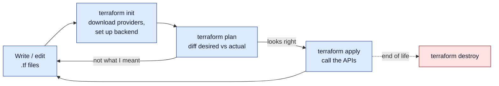
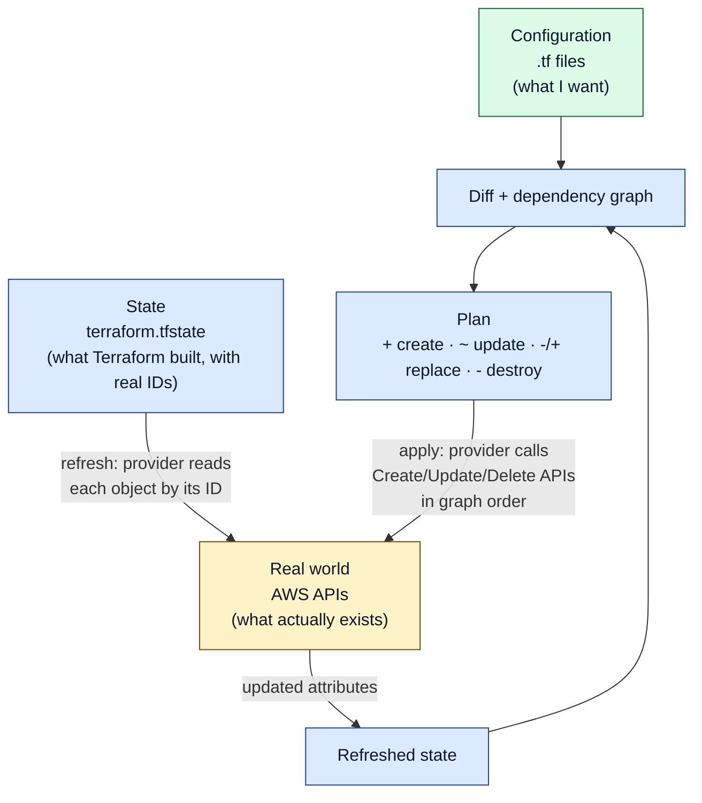

# Terraform

> [!abstract] In one sentence
> Terraform is an infrastructure as code tool: I **declare** the infrastructure I want (buckets, servers, networks, DNS records) in text files, and Terraform compares that declaration with what it has already built (its **state**) and with the real cloud, shows me the exact difference as a **plan**, and on `apply` calls the cloud's APIs to make reality match the files.

## Build-up: Acme's shop, built by hand

Acme runs a web shop on AWS (Amazon Web Services) in `eu-west-1` (Ireland). Today it's small: one S3 (Simple Storage Service) bucket for product images and one EC2 (Elastic Compute Cloud) virtual machine running the app behind a security group. Nothing exotic, and that's exactly why it's a good place to see the problem.

### Stage 1: clicking in the console

The first engineer built everything in the AWS web console. Create bucket, tick a few boxes. Launch instance, pick an AMI (Amazon Machine Image), pick an instance type, create a security group, open ports 80 and 443. It works, and for one person on day one it's even fast.

**The problems** show up a few months later:
- **Nobody knows what exists or why.** Is that `sg-0a1b2c3d` still used? Who opened port 22 to `0.0.0.0/0`? The console shows the current state, not the reasons
- **No review.** A change is a click: no one sees it before it happens, and there's no record afterwards except CloudTrail events nobody reads
- **It can't be rebuilt.** The company wants a `staging` copy of production. Someone has to repeat a hundred clicks from memory, and the copy will differ in ten small ways. The server becomes a **snowflake**: unique, fragile, impossible to reproduce
- **Disaster recovery is a guess.** If the account were lost, the "documentation" is whatever is in people's heads

### Stage 2: a script with the CLI

The natural next step: write the clicks down as a shell script with the AWS CLI (command-line interface).

```bash
#!/usr/bin/env bash
aws s3api create-bucket --bucket acme-shop-assets-dev-7f3a \
  --create-bucket-configuration LocationConstraint=eu-west-1
SG_ID=$(aws ec2 create-security-group --group-name shop-web \
  --description "shop web" --query GroupId --output text)
aws ec2 authorize-security-group-ingress --group-id "$SG_ID" \
  --protocol tcp --port 80 --cidr 0.0.0.0/0
aws ec2 run-instances --image-id ami-0abcdef1234567890 \
  --instance-type t3.micro --security-group-ids "$SG_ID"
```

Better: it's text, it can live in Git, it can be reviewed. But it's **imperative**: it says *how* (do these steps), not *what* (this should exist).

**The problems:**
- **Run it twice and it breaks or duplicates.** The second run fails on "bucket already exists", and `run-instances` happily launches a **second** server. The script isn't **idempotent** (running it again isn't safe)
- **Changing something means writing a different script.** To go from `t3.micro` to `t3.small`, the creation script is useless: I need a new "modify" script, and then a third one for "delete the old security group rule"
- **It doesn't know what's there.** If someone changed the security group in the console, the script has no idea. It can't tell me "reality differs from what you wrote"
- **Ordering is my job.** The security group must exist before the instance; I have to sequence every call and pass IDs (identifiers) along by hand

### Stage 3: declare the result, let a tool work out the steps

What I actually want is to write down the **end state** ("there is a bucket called X; there is a security group allowing 80; there is a `t3.micro` instance in it") and let a tool figure out the steps: create what's missing, change what differs, delete what I removed, in the right order, and **show me what it will do before it does it**.

That's **declarative** infrastructure as code (IaC), and it's the same idea as the desired state and reconciliation loop of [[Container orchestration]] and [[Kubernetes]], applied to cloud resources. The difference: Kubernetes reconciles continuously in a loop; Terraform reconciles **when I run it**.

Terraform is that tool. I write `.tf` files in HCL (HashiCorp Configuration Language), and four commands drive everything:



## Stage 4: the first real configuration (an S3 bucket)

### Install and credentials

Terraform is a single binary. On Linux it's in most package managers (`pacman -S terraform`, or HashiCorp's apt/yum repositories); OpenTofu (`tofu`) is a drop-in alternative (see the license section below).

```bash
$ terraform version
Terraform v1.13.3
on linux_amd64
```

Terraform doesn't have its own AWS login: the AWS provider uses the **same credential chain as the AWS CLI** (environment variables, `~/.aws/config` profiles, SSO (single sign-on) sessions, an instance role). Before anything else I check **which account** I'm about to touch:

```bash
$ export AWS_PROFILE=acme-dev
$ aws sts get-caller-identity
{
    "UserId": "AROAEXAMPLE:iheb",
    "Account": "111122223333",
    "Arn": "arn:aws:sts::111122223333:assumed-role/Admin/iheb"
}
```

### The files

One folder is one Terraform **root module** (a "configuration"). Terraform reads **every `.tf` file in the folder** and treats them as one document: file names are only for humans.

```hcl
# versions.tf
terraform {
  required_version = ">= 1.10"

  required_providers {
    aws = {
      source  = "hashicorp/aws"
      version = "~> 6.0"
    }
  }
}

provider "aws" {
  region = "eu-west-1"

  default_tags {
    tags = {
      Project   = "shop"
      ManagedBy = "terraform"
    }
  }
}
```

```hcl
# main.tf
resource "aws_s3_bucket" "assets" {
  bucket = "acme-shop-assets-dev-7f3a"   # bucket names are global across all AWS accounts
}

resource "aws_s3_bucket_public_access_block" "assets" {
  bucket = aws_s3_bucket.assets.id

  block_public_acls       = true
  block_public_policy     = true
  ignore_public_acls      = true
  restrict_public_buckets = true
}
```

Reading it:
- `terraform { required_providers }` says which **provider** plugins this configuration needs and which versions. A provider is the plugin that knows one platform's API (application programming interface): `hashicorp/aws` knows AWS, others know Cloudflare, GitHub, Kubernetes, Datadog…
- `provider "aws"` configures it: which region, which tags to put on everything
- `resource "aws_s3_bucket" "assets"` declares one thing that should exist. `aws_s3_bucket` is the **type** (defined by the provider), `assets` is **my local name** for it. Together, `aws_s3_bucket.assets` is its **address** inside Terraform
- `aws_s3_bucket.assets.id` is a **reference**: the second resource uses an attribute of the first. That reference is also how Terraform learns the **order** (the bucket must exist before its public access block)

The full grammar is in [[Terraform language syntax]]; resources and references in depth in [[Terraform resources and data sources]].

### terraform init

```bash
$ terraform init
Initializing the backend...
Initializing provider plugins...
- Finding hashicorp/aws versions matching "~> 6.0"...
- Installing hashicorp/aws v6.15.0...
- Installed hashicorp/aws v6.15.0 (signed by HashiCorp)
Terraform has created a lock file .terraform.lock.hcl to record the provider
selections it made above. Include this file in your version control repository
so that Terraform can guarantee to make the same selections by default when
you run "terraform init" in the future.

Terraform has been successfully initialized!
```

What `init` did:
- **Downloaded the provider** binary into `.terraform/providers/…`. The provider is a separate program; Terraform core talks to it over a local gRPC (Google Remote Procedure Call) connection
- **Wrote `.terraform.lock.hcl`**: the exact provider version chosen and its checksums. This file **goes into Git**, so every teammate and the CI (continuous integration) pipeline use the same provider build. See [[Terraform providers]]
- **Set up the backend**: where the state is stored. With no `backend` block it's a local file, `terraform.tfstate`, in this folder. Fine for learning, wrong for a team (see [[Terraform state]])
- Downloaded **modules** if the configuration used any ([[Terraform modules]])

`.terraform/` is a cache: it goes in `.gitignore`. I rerun `init` after adding a provider, a module or changing the backend.

### terraform plan

```bash
$ terraform plan

Terraform used the selected providers to generate the following execution
plan. Resource actions are indicated with the following symbols:
  + create

Terraform will perform the following actions:

  # aws_s3_bucket.assets will be created
  + resource "aws_s3_bucket" "assets" {
      + arn                         = (known after apply)
      + bucket                      = "acme-shop-assets-dev-7f3a"
      + bucket_domain_name          = (known after apply)
      + force_destroy               = false
      + id                          = (known after apply)
      + region                      = "eu-west-1"
      + tags_all                    = {
          + "ManagedBy" = "terraform"
          + "Project"   = "shop"
        }
        # (12 unchanged attributes hidden)
    }

  # aws_s3_bucket_public_access_block.assets will be created
  + resource "aws_s3_bucket_public_access_block" "assets" {
      + block_public_acls       = true
      + block_public_policy     = true
      + bucket                  = (known after apply)
      + id                      = (known after apply)
      + ignore_public_acls      = true
      + restrict_public_buckets = true
    }

Plan: 2 to add, 0 to change, 0 to destroy.
```

`plan` **changes nothing**. It reads the configuration, reads the state, asks the provider to refresh the real objects, and prints the difference. `(known after apply)` marks values AWS will only decide when the object is created (the ARN (Amazon Resource Name), the generated ID).

### terraform apply

```bash
$ terraform apply
...
Plan: 2 to add, 0 to change, 0 to destroy.

Do you want to perform these actions?
  Terraform will perform the actions described above.
  Only 'yes' will be accepted to approve.

  Enter a value: yes

aws_s3_bucket.assets: Creating...
aws_s3_bucket.assets: Creation complete after 2s [id=acme-shop-assets-dev-7f3a]
aws_s3_bucket_public_access_block.assets: Creating...
aws_s3_bucket_public_access_block.assets: Creation complete after 1s [id=acme-shop-assets-dev-7f3a]

Apply complete! Resources: 2 added, 0 changed, 0 destroyed.
```

`apply` computes a fresh plan, shows it, waits for `yes`, then executes it. In automation I split the two: `terraform plan -out=tfplan` saves the exact plan, a human reviews it, and `terraform apply tfplan` applies **that** plan and nothing else (no prompt). That's the basis of [[Terraform in production]].

### Run it again: idempotence

```bash
$ terraform plan
aws_s3_bucket.assets: Refreshing state... [id=acme-shop-assets-dev-7f3a]
aws_s3_bucket_public_access_block.assets: Refreshing state... [id=acme-shop-assets-dev-7f3a]

No changes. Your infrastructure matches the configuration.
```

This is the thing the shell script couldn't do. The same files, applied ten times, produce **one** bucket. Terraform only acts on **differences**.

## Stage 5: a server in a security group

Now the EC2 instance. I add to `main.tf`:

```hcl
# Latest Amazon Linux 2023 AMI, published by AWS as a public SSM parameter
data "aws_ssm_parameter" "al2023" {
  name = "/aws/service/ami-amazon-linux-latest/al2023-ami-kernel-default-x86_64"
}

resource "aws_security_group" "web" {
  name        = "shop-web"
  description = "HTTP in, everything out"
  # no vpc_id: it goes into the account's default VPC (Virtual Private Cloud)
}

resource "aws_vpc_security_group_ingress_rule" "http" {
  security_group_id = aws_security_group.web.id
  ip_protocol       = "tcp"
  from_port         = 80
  to_port           = 80
  cidr_ipv4         = "0.0.0.0/0"
}

resource "aws_vpc_security_group_egress_rule" "all" {
  security_group_id = aws_security_group.web.id
  ip_protocol       = "-1"
  cidr_ipv4         = "0.0.0.0/0"
}

resource "aws_instance" "web" {
  ami                    = data.aws_ssm_parameter.al2023.value
  instance_type          = "t3.micro"
  vpc_security_group_ids = [aws_security_group.web.id]

  user_data = <<-EOT
    #!/bin/bash
    dnf install -y nginx
    systemctl enable --now nginx
  EOT

  tags = {
    Name = "shop-web-dev"
  }
}

output "web_public_ip" {
  value = aws_instance.web.public_ip
}
```

New things:
- A **`data` block** *reads* something that already exists (here, the current AMI ID from SSM (Systems Manager) Parameter Store) without managing it. Resources create and own; data sources only look up ([[Terraform resources and data sources]])
- Two **rule resources** attached to the security group, one per rule (the current AWS provider style, easier to change one rule at a time)
- `output` prints a value after apply and makes it available to scripts and other configurations ([[Terraform variables, locals and outputs]])

```bash
$ terraform apply
data.aws_ssm_parameter.al2023: Reading...
data.aws_ssm_parameter.al2023: Read complete after 0s [id=/aws/service/ami-amazon-linux-latest/al2023-ami-kernel-default-x86_64]
...
Plan: 4 to add, 0 to change, 0 to destroy.

Changes to Outputs:
  + web_public_ip = (known after apply)
...
aws_security_group.web: Creating...
aws_security_group.web: Creation complete after 2s [id=sg-0a1b2c3d4e5f60718]
aws_vpc_security_group_egress_rule.all: Creating...
aws_vpc_security_group_ingress_rule.http: Creating...
aws_instance.web: Creating...
aws_vpc_security_group_ingress_rule.http: Creation complete after 0s [id=sgr-0123456789abcdef0]
aws_vpc_security_group_egress_rule.all: Creation complete after 0s [id=sgr-0fedcba9876543210]
aws_instance.web: Still creating... [10s elapsed]
aws_instance.web: Creation complete after 13s [id=i-0123456789abcdef0]

Apply complete! Resources: 4 added, 0 changed, 0 destroyed.

Outputs:

web_public_ip = "203.0.113.42"
```

Notice the **order and the parallelism**: the security group first (everything depends on it), then the two rules and the instance **at the same time**, because nothing makes them depend on each other. I never wrote an order; Terraform derived it from the references.

### Changing things: reading the plan symbols

Now I make three edits: the instance type goes to `t3.small`, I delete the egress rule resource, and I change the security group's `description`.

```bash
$ terraform plan
...
Terraform will perform the following actions:

  # aws_instance.web will be updated in-place
  ~ resource "aws_instance" "web" {
        id            = "i-0123456789abcdef0"
      ~ instance_type = "t3.micro" -> "t3.small"
        tags          = {
            "Name" = "shop-web-dev"
        }
        # (30 unchanged attributes hidden)
    }

  # aws_security_group.web must be replaced
-/+ resource "aws_security_group" "web" {
      ~ arn         = "arn:aws:ec2:eu-west-1:111122223333:security-group/sg-0a1b2c3d4e5f60718" -> (known after apply)
      ~ description = "HTTP in, everything out" -> "HTTP in" # forces replacement
      ~ id          = "sg-0a1b2c3d4e5f60718" -> (known after apply)
        name        = "shop-web"
        # (5 unchanged attributes hidden)
    }

  # aws_vpc_security_group_egress_rule.all will be destroyed
  # (because aws_vpc_security_group_egress_rule.all is not in configuration)
  - resource "aws_vpc_security_group_egress_rule" "all" {
      - id = "sgr-0fedcba9876543210" -> null
        ...
    }
...
Plan: 1 to add, 1 to change, 2 to destroy.
```

| Symbol | Meaning | What to check |
|---|---|---|
| `+` | create | Is this new thing expected? |
| `-` | destroy | **Always read these.** Did I mean to delete it? |
| `~` | update in place | The object keeps its ID; the API can change this attribute live (sometimes with a reboot, as for an instance type) |
| `-/+` | destroy, then create a replacement | The attribute can't be changed on a live object (`# forces replacement` shows which one). The old one is **deleted first**: downtime and, for data stores, **data loss** |
| `+/-` | create the replacement, then destroy the old one | Same, but with `lifecycle { create_before_destroy = true }` |
| `<=` | read (a data source) | A data source that can only be read during apply because it depends on something not created yet |

> [!warning] A small edit can be a big change
> Changing a security group's description looks harmless, but AWS can't update it, so Terraform **replaces** the group, and every instance using it has to be moved to the new one. The plan is the only place this shows up. Reading `-/+` and `# forces replacement` lines is the most important skill in day-to-day Terraform.

### terraform destroy

```bash
$ terraform destroy
...
Plan: 0 to add, 0 to change, 5 to destroy.
Do you really want to destroy all resources?
  Enter a value: yes
...
Destroy complete! Resources: 5 destroyed.
```

`destroy` deletes **everything this configuration manages** (and only that: things created by hand in the console aren't in the state, so Terraform doesn't know about them). It's the same as removing every resource from the files and applying. In real environments it's rarely run; it's the right tool for short-lived test environments.

## How Terraform works inside

Three things are compared on every plan:



1. **Configuration**: the desired state, my `.tf` files
2. **State**: Terraform's memory. A JSON (JavaScript Object Notation) file mapping each **address** in my code (`aws_instance.web`) to a **real object** (`i-0123456789abcdef0`) with all its last-known attributes. Without it, Terraform couldn't tell "the instance I created yesterday" from "some other instance in the account". It's covered in depth in [[Terraform state]]
3. **Real world**: during **refresh**, the provider reads each object in the state by its ID to catch changes made outside Terraform (**drift**)

Then:
- **The graph.** Terraform builds a dependency graph from references (`aws_security_group.web.id` inside the instance → the instance depends on the group). It creates in graph order, destroys in **reverse** order, and runs independent nodes in parallel (10 at a time by default, `-parallelism=N`)
- **Providers do the talking.** Terraform core knows nothing about AWS. It asks the provider "what's the schema of `aws_instance`?", "plan this change", "apply this change". The provider turns that into AWS API calls (`RunInstances`, `ModifyInstanceAttribute`…). That's why the same workflow manages AWS, GitHub repositories and DNS (Domain Name System) records alike ([[Terraform providers]])
- **Terraform only manages what's in its state.** An object created by hand is invisible to it, unless I bring it in with an `import` block

```bash
$ terraform state list
aws_instance.web
aws_s3_bucket.assets
aws_s3_bucket_public_access_block.assets
aws_security_group.web
aws_vpc_security_group_ingress_rule.http
data.aws_ssm_parameter.al2023

$ terraform graph | dot -Tsvg > graph.svg   # the dependency graph, rendered with Graphviz
```

> [!info] Terraform is not a background agent
> Nothing watches the infrastructure between runs. If someone changes the security group in the console on Monday, Terraform notices only at the next `plan`, and then it will try to **undo** that change to match the code. Teams run a scheduled plan to detect drift ([[Terraform in production]]).

## Terraform among the other tools

| Tool | Style | Language | State | Scope |
|---|---|---|---|---|
| **Terraform** | Declarative | HCL | Its own state file (local or a remote backend) | Any API with a provider: every cloud, SaaS (software as a service), DNS, GitHub… |
| **OpenTofu** | Declarative | HCL (same) | Same, plus client-side state encryption | Same; a community fork, drop-in compatible |
| **CloudFormation** | Declarative | YAML (YAML Ain't Markup Language) or JSON | Kept by AWS (the "stack") | AWS only |
| **AWS CDK** (Cloud Development Kit) | Declarative, written in code | TypeScript, Python… (generates CloudFormation) | CloudFormation stack | AWS only |
| **Pulumi** | Declarative, written in code | TypeScript, Python, Go… | Pulumi service or a bucket | Many clouds |
| **Ansible** | Mostly imperative tasks, made idempotent module by module | YAML playbooks | None (checks the target every run) | Configuring **inside** servers (packages, files, services); can call cloud APIs too |

A common split: Terraform builds the **infrastructure** (network, instances, databases, DNS), and something else configures **what runs inside** (a baked image from [[Packer]], containers, or Ansible).

### The license change and OpenTofu

Terraform was open source (MPL (Mozilla Public License) 2.0) until August 2023, when HashiCorp moved new versions to the BSL (Business Source License), which forbids building a competing commercial product on it. In response, the community forked the last open version as **OpenTofu**, now hosted by the Linux Foundation (`tofu init`, `tofu plan`… same files, same providers). IBM (International Business Machines) completed its acquisition of HashiCorp in 2025. For using Terraform at a company, the BSL changes nothing; it matters for vendors building platforms on it. Both projects keep adding features and slowly diverge, so a team picks one and pins it. HashiCorp's hosted service for running Terraform is **HCP Terraform** (HashiCorp Cloud Platform Terraform, formerly Terraform Cloud).

## Advanced problems

### 1. "BucketAlreadyExists" or a duplicate server after losing the state
**Symptom:** a new teammate clones the repository, runs `terraform apply`, and Terraform wants to create everything again; the bucket fails with `BucketAlreadyExists`, and a **second** EC2 instance gets created.
**Cause:** the state was a local `terraform.tfstate` on the first engineer's laptop (and correctly not in Git). Without state, Terraform believes nothing exists.
**Fix:** move the state to a shared **remote backend** (an S3 bucket with locking) before anyone else works on the project, and `import` objects that exist but aren't in the state. See [[Terraform state]].

### 2. Someone changed it in the console (drift)
**Symptom:** a plan for an unrelated change also shows `~ resource "aws_vpc_security_group_ingress_rule"`… or a rule Terraform wants to **remove**.
**Cause:** a manual change. Terraform's job is to make reality match the code, so it will revert it.
**Fix:** decide which side is right. If the manual change was correct, **write it into the code** first, then the plan is clean. Never apply a plan that undoes something nobody can explain. `terraform plan -refresh-only` shows only what drifted, without proposing changes.

### 3. A harmless-looking edit replaces a database
**Symptom:** renaming a resource's identifier, changing an RDS (Relational Database Service) instance's subnet group or a bucket's name: the plan shows `-/+ ... # forces replacement`.
**Cause:** the attribute can't be changed on a live object, so the only way to reach the new desired state is delete + create.
**Fix:** read every `-/+` line. For a rename in code only, a `moved` block tells Terraform it's the same object ([[Terraform state]]). For data stores, add `lifecycle { prevent_destroy = true }` so Terraform refuses to plan their destruction at all ([[Terraform resources and data sources]]).

### 4. Applying to the wrong account
**Symptom:** the plan wants to create 60 resources that should already exist, or worse, `destroy` succeeds somewhere unexpected.
**Cause:** `AWS_PROFILE` or credentials pointed at another account; the provider uses whatever credentials it finds.
**Fix:** `aws sts get-caller-identity` before working, and pin the account in code so Terraform refuses the wrong one:
```hcl
provider "aws" {
  region              = "eu-west-1"
  allowed_account_ids = ["111122223333"]
}
```

### 5. Error acquiring the state lock
**Symptom:** `Error: Error acquiring the state lock ... Lock Info: ID: 9f1c..., Who: ci@runner-12`.
**Cause:** another run is in progress (good: the lock is doing its job), or a run crashed and left the lock behind.
**Fix:** wait, or if the other run is definitely dead, `terraform force-unlock <ID>`. Never force-unlock while another apply might still be running.

## Practice

> [!example]- I run `terraform apply` twice in a row with no edits. What happens the second time, and why is that different from my shell script?
> "No changes. Your infrastructure matches the configuration." Terraform compares the desired state with the state and the real world and only acts on differences. The script runs its commands every time, so it fails on existing names or creates duplicates.

> [!example]- The plan shows `-/+ resource "aws_db_instance" "main"` with `# forces replacement` next to `db_subnet_group_name`. What does it mean for the data?
> The database will be destroyed and a new, empty one created (the old one first, unless create_before_destroy is set). Unless it's restored from a snapshot, the data is gone. Stop and find another way (a migration, or not changing that attribute).

> [!example]- I created the security group before the instance in the files, but listed the instance first. Does the order in the file matter?
> No. Terraform reads all `.tf` files in the folder as one, and derives the order from references (`aws_security_group.web.id` inside the instance), not from the file layout.

> [!example]- What files does `terraform init` create, and which go in Git?
> `.terraform/` (downloaded providers and modules, a cache: ignored) and `.terraform.lock.hcl` (exact provider versions and checksums: committed). With a local backend, `terraform.tfstate` appears after the first apply: never committed.

> [!example]- A teammate deleted an S3 bucket in the console that Terraform manages. What will the next plan show?
> During refresh the provider finds the object gone and drops it from the state, so the plan shows `+ create` for the bucket again (and the content is not coming back).

## Easy to get wrong
- Thinking `plan` changes something: it only reads and prints. `apply` changes things
- Applying without reading the `-` and `-/+` lines: a one-word edit can replace a database
- Committing `terraform.tfstate` to Git (it contains secrets and goes stale), or the opposite, keeping it only on one laptop
- Forgetting `.terraform.lock.hcl` in Git: teammates and CI end up on different provider versions
- Assuming Terraform knows about things created by hand: it only manages what's in its state
- Expecting Terraform to fix drift by itself: nothing runs between plans
- Believing file names or block order matter: every `.tf` file in the folder is one configuration, and order comes from references
- Running with whatever credentials happen to be loaded: check the account, pin `allowed_account_ids`
- Confusing a `data` source (reads) with a `resource` (creates and owns)

## Related
- Next step:: [[Terraform language syntax]], [[Terraform variables, locals and outputs]], [[Terraform resources and data sources]]
- Then:: [[Terraform providers]], [[Terraform state]], [[Terraform modules]], [[Terraform environments and project layout]], [[Terraform testing and validation]], [[Terraform in production]], [[Terraform worked example]]
- Same idea elsewhere:: [[Container orchestration]] (desired state and reconciliation), [[Kubernetes]]
- Used in:: [[ECS production stack]], [[Connecting GitHub Actions to AWS]]
- Complements:: [[Packer]] (what runs inside the servers Terraform creates)
- Area:: [[Infrastructure as code]], [[AWS]]

## Flashcards
#flashcards

What is Terraform? :: A declarative infrastructure as code tool: you describe the desired infrastructure in .tf files, it plans the difference with what exists and applies it through provider APIs
Why is a CLI script not enough to manage infrastructure? :: It's imperative and not idempotent: running it twice fails or duplicates, it can't express changes or deletions, and it doesn't know what already exists
What does idempotent mean for Terraform? :: Applying the same configuration again makes no changes if reality already matches
What are the four core Terraform commands? :: init, plan, apply, destroy
What does terraform init do? :: Downloads providers and modules into .terraform/, writes .terraform.lock.hcl, and configures the state backend
Which init outputs go in Git? :: .terraform.lock.hcl yes; .terraform/ no (cache); terraform.tfstate never
What does terraform plan do? :: Compares configuration, state and the refreshed real world, and prints the changes without making any
What does -/+ mean in a plan? :: The resource must be replaced: destroyed then recreated, because an attribute can't be changed in place (marked "forces replacement")
What does ~ mean in a plan? :: Update in place: the object keeps its ID
What does <= mean in a plan? :: A data source that will be read during apply
What is the difference between +/- and -/+? :: +/- creates the replacement before destroying the old one (create_before_destroy); -/+ destroys first
What three things does Terraform compare on every plan? :: The configuration (desired), the state (what it built, with real IDs), and the real world (refreshed through the provider)
What is Terraform state? :: A JSON file mapping each resource address in the code to the real object ID and its last-known attributes
How does Terraform know in which order to create resources? :: From references between them, which form a dependency graph; independent resources are created in parallel
What is a provider? :: A plugin that knows one platform's API and translates Terraform's create/read/update/delete into API calls
resource vs data block? :: A resource is created and owned by Terraform; a data source only reads something that exists
Why use terraform plan -out=tfplan then terraform apply tfplan? :: So exactly the reviewed plan is applied, nothing else
What does terraform destroy delete? :: Every resource in this configuration's state, and nothing created outside it
What is drift? :: A difference between the real infrastructure and the state/code, usually from a manual change
Does Terraform fix drift automatically? :: No, only at the next plan/apply, by reverting reality to the code
What is OpenTofu? :: The open-source (Linux Foundation) fork of Terraform created after HashiCorp moved Terraform to the Business Source License in 2023
How do you stop Terraform from touching the wrong AWS account? :: Check aws sts get-caller-identity and set allowed_account_ids on the AWS provider
Terraform vs CloudFormation? :: Terraform: any provider, own state file, HCL. CloudFormation: AWS only, state kept by AWS as a stack, YAML/JSON
