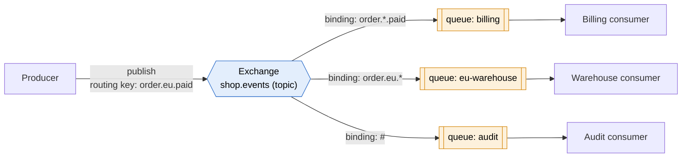
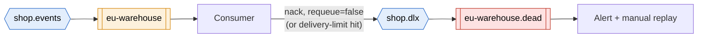

# AMQP

> [!abstract] In one sentence
> AMQP (Advanced Message Queuing Protocol) is an **open wire protocol** for talking to a message broker over TCP (port **5672**, **5671** with TLS): publishing, consuming, acknowledging, and (in the popular 0-9-1 version) **routing** messages through **exchanges** into **queues**. Because it's a wire protocol, any client that speaks it can talk to any broker that speaks it, in any language.

## Common misconceptions

**Wrong mental model #1:** "AMQP is one protocol."

**What's actually true:** two very different protocols share the name.

| | **AMQP 0-9-1** | **AMQP 1.0** |
|---|---|---|
| What it defines | A whole **broker model**: exchanges, queues, bindings, routing keys, plus the wire format | Only how two peers **transfer messages** over links (flow control, settlement). No exchanges, no bindings: the broker decides what an address means |
| Standard | De facto (the 2008 spec, extended by RabbitMQ) | OASIS (2012) and ISO/IEC 19464 |
| Who speaks it | **RabbitMQ** (its native protocol), LavinMQ | Azure Service Bus and Event Hubs, ActiveMQ / Artemis, Apache Qpid, Solace, IBM MQ, RabbitMQ 4.x |
| Compatible with the other? | **No.** A 0-9-1 client can't talk to a 1.0-only broker | |

When people (and most tutorials) say "AMQP", they usually mean **0-9-1 as RabbitMQ uses it**. The rest of this note does too, unless it says 1.0.

**Wrong mental model #2:** "Producers send messages to a queue."

**What's actually true:** in AMQP 0-9-1, producers publish to an **exchange**, with a **routing key**. The exchange copies the message into zero, one or many queues according to its **bindings**. Consumers read from **queues**. The producer doesn't know which queues exist.

**Wrong mental model #3:** "If the publish call returned, the message is safe."

**What's actually true:** a plain publish is fire-and-forget. If no queue matches, the exchange **drops the message silently**. If the broker crashes before writing it to disk, it's gone. Safety needs **publisher confirms**, **durable queues**, **persistent messages**, and a way to catch **unroutable** messages.

## The model in one picture

| Piece | What it is |
|---|---|
| **Connection** | One TCP (+TLS) connection from a client to the broker. Expensive to open, kept long |
| **Channel** | A lightweight virtual connection **inside** a connection. Each thread uses its own channel |
| **Exchange** | Receives published messages and routes them. Never stores them |
| **Queue** | Stores messages until a consumer acknowledges them |
| **Binding** | A rule "exchange X → queue Q when the routing key matches this" |
| **Routing key** | A label on each published message, like `order.eu.paid` |
| **Virtual host** | A separate namespace (exchanges, queues, permissions) on the same broker, like a tenant |

### Exchange types

| Type | Routes to | Example |
|---|---|---|
| **Direct** | Queues bound with **exactly** the routing key | Key `invoice` → queue bound with `invoice` |
| **Fanout** | **Every** bound queue, ignores the key | Broadcast "cache invalidated" to every instance |
| **Topic** | Queues whose binding pattern matches the key. Words separated by `.`, `*` = exactly one word, `#` = zero or more words | `order.*.paid` matches `order.eu.paid`, not `order.eu.card.paid`. `order.#` matches both |
| **Headers** | Matches on message headers instead of the key | Route on `{format: pdf, region: eu}` |
| **Default** (nameless direct) | The queue whose **name** equals the routing key | Publishing to `""` with key `billing` puts it in queue `billing`. Looks like "sending to a queue", but it's still an exchange |

## Build-up: the shop runs its own broker

The shop runs RabbitMQ on three servers `rabbit-1`..`rabbit-3` (`10.30.1.11`–`10.30.1.13`), outside any cloud. The same thinking applies to a managed broker.

### Stage 1: one queue, a consumer that crashes

Checkout publishes order IDs to queue `orders` (through the default exchange). One worker consumes with **auto-ack**: the broker considers a message delivered the moment it's sent. The worker crashes halfway through an order → that order is **lost**.

**The fix: manual acknowledgments.** The consumer sends `basic.ack` **after** processing. If the channel or connection closes before the ack, the broker **requeues** the message for another consumer. This is the AMQP version of the [[SQS]] visibility timeout, except it's tied to the **connection** instead of a timer: a consumer that hangs forever while staying connected keeps the message forever (RabbitMQ adds a delivery acknowledgment timeout, 30 minutes by default, to catch that).

Consequence: delivery is **at least once**. A crash after the work but before the ack means a redelivery, flagged `redelivered=true`. Consumers must be idempotent.

### Stage 2: one slow consumer hoards everything

With 5 workers, the broker pushes messages to consumers as fast as it can. One worker receives 3,000 unacknowledged messages into its memory while the others sit idle.

**The fix: prefetch** (`basic.qos`, e.g. `prefetch_count = 20`): at most 20 unacknowledged messages per consumer. A slow worker stops receiving more until it acks. Too low (1) wastes throughput on round trips, too high hoards. 10–50 is a common starting point.

### Stage 3: several teams, routing by key

Billing wants paid orders from everywhere, the EU warehouse wants every EU order event, audit wants everything. A **topic exchange** `shop.events` with the bindings in the picture above does it. Adding a team = a new queue + a binding. The producer publishes once with a descriptive key and never changes.

This is the same fan-out idea as [[SNS]] → [[SQS]], but inside one broker and with routing done by key patterns.

### Stage 4: messages vanish without an error

A typo: checkout publishes `orders.eu.paid` (with an **s**), no binding matches, and the exchange **discards** it. No error, no log.

**The fixes:**
- **Publisher confirms**: the broker acks each publish once it has taken responsibility for it (written to disk for persistent messages in durable queues). The producer retries what isn't confirmed
- **`mandatory` flag**: unroutable messages are **returned** to the producer instead of dropped
- **Alternate exchange**: unroutable messages go to a catch-all exchange → queue `unroutable`, with an alarm on it

### Stage 5: surviving a broker restart

The broker restarts for patching. Afterwards, queue `billing` and its 400 messages are gone.

Three settings, all needed:
- **Durable queue**: the queue definition survives a restart
- **Persistent messages** (`delivery_mode = 2`): the messages are written to disk
- **Publisher confirms**: the producer knows they were written

And for losing a whole **server**, not just restarting: **quorum queues** replicate each queue across the cluster nodes with the Raft consensus algorithm (a majority must have a message before it's confirmed). They replaced the old "classic mirrored queues", which RabbitMQ 4.0 removed.

### Stage 6: poison messages and retries

An order with a broken address makes the warehouse consumer throw. It `nack`s with `requeue=true`, the message goes straight back, crashes the next consumer, and loops forever at full speed.

**The fix: a dead-letter exchange (DLX).** The queue gets `x-dead-letter-exchange = shop.dlx`. A message goes there when it's **rejected without requeue**, when it **expires** (message or queue **TTL**), or when the queue exceeds its **length limit**. Quorum queues can also count deliveries and dead-letter after N attempts (`delivery-limit`). Delayed retries are often built with a "wait" queue with a TTL whose DLX points back to the work queue.

## Advanced problems I'll actually debug

| Symptom | Usual cause | Fix |
|---|---|---|
| Messages published, never seen by any consumer | No binding matches the routing key (typo, wrong exchange) | Publisher confirms + `mandatory`/alternate exchange, check bindings in the management UI |
| Messages lost on a consumer crash | Auto-ack | Manual ack after processing |
| One consumer overloaded, others idle | No prefetch limit | `basic.qos` prefetch |
| Same message processed again and again | `nack` with requeue on a permanent error | Reject without requeue + DLX, or quorum queue `delivery-limit` |
| Unacked count keeps growing, nothing progresses | Consumer stuck but still connected, or forgot to ack on some code path | Ack in every path, delivery ack timeout, monitor unacked per consumer |
| Connections dropped every few minutes through a load balancer or firewall | Idle timeout on the [[Load balancing\|load balancer]] or a NAT/firewall shorter than AMQP **heartbeats** | Heartbeat interval below the idle timeout (e.g. 30 s), or raise the idle timeout |
| Producers suddenly block, publish calls hang | Broker hit its **memory or disk alarm** and blocks publishers (flow control) | Consumers are too slow or a queue grew huge: fix consumers, set queue length limits, add disk |
| Broker CPU high with thousands of connections | A connection opened per message (common in serverless/PHP-style code) | Long-lived connections, one channel per thread, a connection pool |
| Messages out of order | Several consumers on one queue, or requeues putting a message back after newer ones | One consumer per queue (or single active consumer) where order matters |
| `ACCESS_REFUSED` / `NOT_FOUND - no exchange` | Wrong vhost, user lacks permission on that vhost, or the exchange wasn't declared | Check vhost + permissions, declare exchanges/queues at startup (declarations are idempotent) |

## In AWS
- **Amazon MQ for RabbitMQ**: managed RabbitMQ brokers (single instance or a 3-node cluster across AZs) inside my [[VPC]]. Same AMQP 0-9-1 clients, so an existing RabbitMQ app moves without code changes
- **Amazon MQ for ActiveMQ**: speaks AMQP **1.0** (plus [[MQTT]], STOMP, OpenWire), the usual target for [[JMS]] apps
- When the app doesn't already depend on AMQP, the exam's answer for a new design is usually [[SQS]] / [[SNS]] (fully serverless, no brokers to size). See [[SQS vs SNS vs EventBridge]]

## AMQP next to the others

| | **AMQP 0-9-1** | [[MQTT]] | [[JMS]] | [[Kafka]] protocol |
|---|---|---|---|---|
| What it is | Wire protocol + broker model | Wire protocol | **Java API**, not a wire protocol | Wire protocol of one product |
| Routing | Exchanges, bindings, routing keys | Hierarchical topics + wildcards | Queues and topics, selectors | Topics + partitions |
| Built for | Server-side app integration, task queues | Small devices, unreliable networks | Java enterprise apps | High-volume replayable streams |
| After consumption | Message removed (ack) | Delivered, not stored (except retained / sessions) | Removed (ack) | Kept until retention |

## Practice

> [!example]- A producer publishes to a topic exchange with key `order.eu.card.paid`. Which bindings match: `order.*.paid`, `order.#`, `order.eu.*.paid`, `#.paid`?
> `order.#`, `order.eu.*.paid` and `#.paid` match. `order.*.paid` doesn't: `*` is exactly one word, and there are two (`eu.card`) between `order` and `paid`.

> [!example]- A consumer crashes in the middle of a message. With auto-ack, and with manual ack?
> Auto-ack: the message is lost, the broker considered it delivered. Manual ack: the channel closes without an ack, so the broker requeues it for another consumer.

> [!example]- Messages survive a consumer crash but not a broker restart. What's missing?
> Durable queue and persistent messages (delivery mode 2), and publisher confirms so the producer knows. For losing a whole node, quorum queues.

> [!example]- An app uses an Azure Service Bus SDK over AMQP. Can I point it at RabbitMQ 3.x with its default setup?
> No. Service Bus speaks AMQP 1.0, RabbitMQ 3.x's native protocol is 0-9-1 (1.0 only via a plugin, natively in 4.x). Same name, different protocols, and the SDK also uses Service Bus-specific features.

## Easy to get wrong
- Treating AMQP 0-9-1 and 1.0 as versions of one protocol: they're different protocols
- Thinking producers write to queues: they publish to exchanges (the default exchange hides this)
- Unroutable messages are dropped silently unless I use `mandatory` or an alternate exchange
- Auto-ack loses messages on consumer crashes
- `nack` + requeue on a permanent error = infinite loop. Use a DLX
- Durable queue without persistent messages (or the reverse) doesn't survive a restart
- `*` matches exactly one word, `#` zero or more
- Opening a connection per message instead of reusing connections and channels
- Heartbeats longer than a load balancer's or firewall's idle timeout

## Related
- Same family:: [[MQTT]], [[JMS]], *[[RabbitMQ]]*
- Compared with:: [[Kafka]], [[SQS]], [[SNS]]
- Network side:: [[TLS]], [[mTLS]], [[Load balancing]] (idle timeouts), [[NAT and PAT]]
- In AWS:: [[SQS vs SNS vs EventBridge]] (when Amazon MQ is the answer)
- Area:: [[Messaging]]

## Flashcards
#flashcards

What is AMQP? :: An open wire protocol for message brokers: publish, consume, acknowledge (and in 0-9-1, route through exchanges to queues)
AMQP ports? :: 5672, and 5671 with TLS
AMQP 0-9-1 vs AMQP 1.0? :: Different, incompatible protocols. 0-9-1 defines exchanges/queues/bindings (RabbitMQ). 1.0 is a peer-to-peer transfer protocol (OASIS/ISO), no broker model
Where do AMQP 0-9-1 producers publish? :: To an exchange, with a routing key. The exchange routes into queues through bindings
What is a binding? :: A rule linking an exchange to a queue for matching routing keys
Four exchange types? :: Direct (exact key), fanout (all bound queues), topic (key patterns), headers (match on headers)
Topic exchange wildcards? :: * = exactly one word, # = zero or more words, words separated by dots
What is the default exchange? :: A nameless direct exchange routing to the queue whose name equals the routing key
Connection vs channel? :: A connection is a TCP connection. Channels are lightweight virtual connections multiplexed inside it, one per thread
What happens to an unacked message when its consumer disconnects? :: The broker requeues it and redelivers it (redelivered flag set)
Why is auto-ack risky? :: A consumer crash loses the message, the broker already considered it delivered
What does prefetch (basic.qos) do? :: Limits how many unacked messages a consumer holds, so work spreads across consumers
What happens to a message no binding matches? :: Dropped silently, unless mandatory (returned) or an alternate exchange is set
What are publisher confirms? :: The broker acknowledges each publish once it has taken responsibility for it
What makes a message survive a broker restart? :: A durable queue and a persistent message (delivery_mode 2)
What are quorum queues? :: RabbitMQ queues replicated across nodes with Raft, replacing classic mirrored queues
When does a message go to a dead-letter exchange? :: Rejected/nacked without requeue, expired (TTL), queue length exceeded, or delivery limit reached
Why do AMQP connections drop behind a load balancer? :: Its idle timeout is shorter than the AMQP heartbeat interval
What is Amazon MQ? :: Managed RabbitMQ or ActiveMQ brokers, for apps that already use AMQP, MQTT, STOMP, OpenWire or JMS
