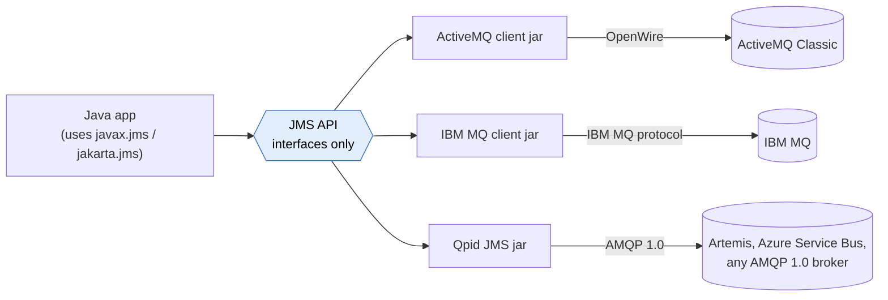
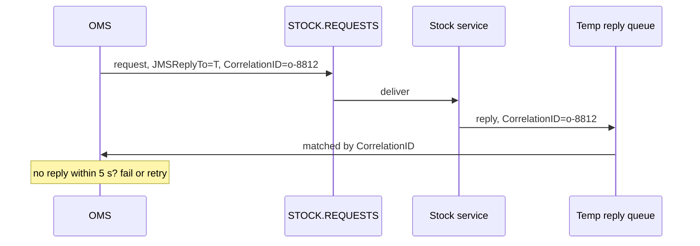

# JMS

> [!abstract] In one sentence
> JMS (Java Message Service, now called **Jakarta Messaging**) is a **Java API**, not a protocol: a standard set of interfaces (`ConnectionFactory`, `Session`, `MessageProducer`, `Queue`, `Topic`…) that Java code uses to send and receive messages. Each broker vendor ships a **JMS provider** (a client library) that implements those interfaces over **its own wire protocol**. JMS makes Java *code* portable between brokers, not *clients* interoperable.

## Common misconceptions

**Wrong mental model #1:** "JMS is a messaging protocol, like AMQP or MQTT."

**What's actually true:** JMS is to messaging what JDBC is to databases. JDBC lets Java code use the same `Connection`/`Statement` interfaces with PostgreSQL or Oracle, but the driver speaks each database's own protocol. Same with JMS:



**Wrong mental model #2:** "Two applications using JMS can talk to each other through any broker."

**What's actually true:** a Java app using the IBM MQ provider and a Java app using the ActiveMQ provider can't exchange messages directly, even though both "use JMS". They must use the **same broker** (or a bridge between brokers). And a non-Java app (Python, Node) can't speak JMS at all: it uses the broker's wire protocol directly, e.g. [[AMQP]] 1.0, [[MQTT]] or STOMP.

**Wrong mental model #3:** "Moving a JMS app to another broker is just a configuration change."

**What's actually true:** the **code** that uses standard JMS interfaces moves easily. What usually doesn't: the provider jar and connection setup, vendor-specific features (ActiveMQ's virtual destinations, IBM MQ's channel and queue manager settings), message property conventions, redelivery and dead-letter behaviour (each broker configures it its own way), and anything that depended on that broker's ordering or performance. It's a migration, smaller than rewriting, but with testing.

## The model

| Interface | What it is |
|---|---|
| **ConnectionFactory** | Created from the provider (often looked up in **JNDI** in app servers). Holds broker address and credentials |
| **Connection** | A physical connection to the broker. Heavy, shared, thread-safe |
| **Session** | A single-threaded context for producing and consuming, and the unit of **transactions** and **acknowledgment**. **Not thread-safe**: one per thread |
| **Destination** | A **Queue** (point-to-point) or a **Topic** (publish/subscribe) |
| **MessageProducer / MessageConsumer** | Send to / receive from a destination. Consumers either call `receive()` (pull) or register a `MessageListener` (push) |
| **JMSContext** | JMS 2.0's simplified API that wraps Connection + Session |

### Two messaging models

| | **Queue** | **Topic** |
|---|---|---|
| Each message goes to | **One** consumer | **Every** subscriber |
| Like | [[SQS]] | [[SNS]] |
| Offline consumer | Messages wait in the queue | Lost for that subscriber, unless it has a **durable subscription** |
| Scaling consumers | Add consumers to the queue | JMS 2.0 **shared subscriptions**: several consumers share one subscription |

### What a message looks like

- **Headers** set by JMS/the provider: `JMSMessageID`, `JMSCorrelationID`, `JMSReplyTo`, `JMSDeliveryMode` (`PERSISTENT` / `NON_PERSISTENT`), `JMSPriority` (0–9), `JMSExpiration`, `JMSRedelivered`
- **Properties**: application key/values (`orderType = "express"`), used by **selectors**
- **Body**, by type: `TextMessage` (JSON/XML as text, the common one), `BytesMessage`, `MapMessage`, `StreamMessage`, `ObjectMessage` (a serialized Java object, avoid: see below)

### Acknowledgment modes

| Mode | Behaviour | Risk |
|---|---|---|
| `AUTO_ACKNOWLEDGE` | Acked when `receive()` returns or the listener returns normally | A listener that throws gets redelivery. One that "handles" the error and returns loses the message |
| `CLIENT_ACKNOWLEDGE` | The app calls `message.acknowledge()`, which acks **every message consumed so far in the session**, not just this one | Surprising batch acks |
| `DUPS_OK_ACKNOWLEDGE` | Lazy acks, faster | Duplicates after a crash |
| **Transacted session** | `session.commit()` acks consumed messages **and** sends produced messages atomically. `rollback()` redelivers | The usual choice for consume → process → produce |

## Build-up: the shop's order management system

The shop bought a Java order management system (OMS) years ago. It runs on an application server and talks to an IBM MQ or ActiveMQ broker on-premises through JMS.

### Stage 1: queues between the OMS and the warehouse

The OMS sends each order as a `TextMessage` (XML) to queue `WAREHOUSE.ORDERS`. The warehouse system (also Java) consumes with a `MessageListener`. The broker holds messages while the warehouse system is down for its nightly maintenance, which is the whole point of a queue.

Messages are sent `PERSISTENT` (the default), so the broker writes them to disk before confirming the send. `NON_PERSISTENT` is faster but lost on a broker restart: fine for "stock level changed" notifications that are refreshed every minute anyway, not for orders.

### Stage 2: price changes to everyone

Every store system needs every price change. A **topic** `PRICES` does it. The problem: a store system restarting for 10 minutes misses the changes published meanwhile, because a normal topic subscription only exists while the consumer is connected.

**The fix: durable subscriptions.** The store system connects with a fixed **client ID** and creates a durable subscription with a name (`store-042-prices`). The broker keeps messages for it while it's offline. Downside: an abandoned durable subscription keeps accumulating messages forever, until someone unsubscribes it.

### Stage 3: only express orders

The express-delivery team wants only express orders from `WAREHOUSE.ORDERS`, without a separate queue.

**Selectors**: a consumer filters with an SQL-92-like expression on **headers and properties** (never the body):

```java
session.createConsumer(ordersQueue, "orderType = 'express' AND country IN ('FR','BE')");
```

The OMS must set the property: `message.setStringProperty("orderType", "express")`. On a queue, selectors mean other consumers must take the non-matching messages, or they pile up. A separate queue (or broker-side routing) is often cleaner.

### Stage 4: the OMS asks a question and waits

The OMS needs a stock check before confirming an order: **request/reply over messaging**.

1. The OMS creates a **temporary queue** (or uses a fixed reply queue), sends the request to `STOCK.REQUESTS` with `JMSReplyTo` = that queue and `JMSCorrelationID` = the order ID
2. The stock service replies to `JMSReplyTo`, copying the correlation ID
3. The OMS waits on the reply queue for the message with its correlation ID, with a **timeout**



### Stage 5: "the order was saved twice" / "the order was lost"

The warehouse consumer receives an order, inserts it into its database, and crashes before acknowledging. Redelivery → duplicate row. Or the reverse order (ack first, then crash before the insert) → lost order.

**Options:**
- **Transacted session** + idempotent insert (unique order ID): redelivery hits the unique constraint and is skipped. Simple and robust
- **XA (two-phase commit)**: one distributed transaction covering the JMS session **and** the database, coordinated by the application server. Exactly-once between broker and database, at the cost of complexity, performance and tricky failure states (in-doubt transactions). Common in older enterprise systems, rarely chosen for new ones

### Stage 6: moving the OMS to AWS

The OMS must leave the data center. The broker is ActiveMQ.
- **Lift and shift**: **Amazon MQ for ActiveMQ**. Same OpenWire protocol, same ActiveMQ JMS provider, change the broker URL (`ssl://b-1234.mq.eu-west-1.amazonaws.com:61617`) and credentials, test. No code change. Amazon MQ brokers live in my [[VPC]], so the network path from the OMS (and from the remaining on-prem systems, over VPN/DX) has to exist
- **IBM MQ** instead: Amazon MQ doesn't run it. Options are IBM MQ on EC2/containers, IBM's own managed offering, or a real migration
- **Refactor later**: the **Amazon SQS Java Messaging Library** implements JMS (1.1, **queues only**, no topics) on top of [[SQS]]. Point-to-point code can move to SQS with little change. Topics, selectors, XA and request/reply over temporary queues don't come along

## Advanced problems I'll actually debug

| Symptom | Usual cause | Fix |
|---|---|---|
| `ClassNotFoundException` / `NoClassDefFoundError: javax/jms/…` after an upgrade | The **`javax.jms` → `jakarta.jms`** package rename (Jakarta EE 9+). Old providers and new app servers don't mix | Use provider versions matching the namespace, or a transformation tool for old libraries |
| Messages stuck, broker shows them "in flight" | A consumer received them in a session that never acknowledges or commits (forgot `commit()`, `CLIENT_ACKNOWLEDGE` without `acknowledge()`) | Commit/ack in every path, close sessions properly |
| Random failures under load, corrupted state | One `Session` shared between threads | One session (and its producers/consumers) per thread |
| A message redelivered forever | Listener throws on a permanent error, broker's redelivery policy unlimited | Redelivery limit + broker dead-letter queue (ActiveMQ `ActiveMQ.DLQ`, IBM MQ backout queue). Configured on the broker or provider, not in standard JMS |
| Broker disk filling, nobody consuming | Abandoned **durable subscription** | Unsubscribe it, monitor durable subscribers' pending counts |
| Selector consumer gets nothing | Property not set by the producer, wrong type (`'1'` string vs `1` number), or selecting on the body | Check the property and its type, selectors only see headers and properties |
| Security alert about deserialization | `ObjectMessage` deserializes Java objects from the broker (remote code execution risk if attackers can publish) | Use `TextMessage` with JSON/XML. If `ObjectMessage` is unavoidable, restrict trusted packages (ActiveMQ has a setting for this) |
| Python service can't read messages the Java app sends | It isn't speaking JMS, and the bodies are Java-specific (`ObjectMessage`, `MapMessage`) | Text bodies, and a common wire protocol both sides speak (AMQP 1.0, STOMP) |
| Request/reply calls time out at peak | Reply consumer slow, or replies matched by scanning a shared reply queue | Per-instance reply queues or temporary queues, correlation-ID selectors, bounded timeouts |

## JMS next to the others

| | **JMS** | [[AMQP]] | [[MQTT]] |
|---|---|---|---|
| What it is | **Java API** | Wire protocol | Wire protocol |
| Languages | Java (JVM) only | Any | Any |
| Interoperability | Same broker/provider needed | Any client ↔ any broker of the same AMQP version | Any client ↔ any MQTT broker |
| Models | Queues + topics | Exchanges → queues (0-9-1) | Topics |
| Typical home | Enterprise Java, banks, ERPs, app servers | Server-side integration, task queues | IoT, mobile |

## Practice

> [!example]- A Python team says "we'll just connect to the JMS queue". What do they actually need?
> A wire protocol the broker exposes: AMQP 1.0, STOMP or MQTT, with a Python client library for it. JMS is a Java API, there is no "JMS protocol". And the Java side should send text bodies, not `ObjectMessage`.

> [!example]- A store system misses price updates published while it restarts. What JMS feature fixes it?
> A durable subscription (fixed client ID + subscription name) on the topic, so the broker keeps messages for it while it's offline.

> [!example]- An on-prem Java app uses ActiveMQ via JMS. The goal is AWS with the fewest code changes. Answer?
> Amazon MQ for ActiveMQ: same protocol and provider, change the connection URL and credentials. Moving to SQS (via the SQS JMS library) is a later refactor, and only covers queues.

> [!example]- Consume an order from a queue and send a shipping message to another queue, atomically. How?
> A transacted session: receive, send, then `session.commit()`. Both happen or neither. Including a database insert atomically would need XA, or an idempotent insert instead.

## Easy to get wrong
- Calling JMS a protocol: it's a Java API, each provider has its own wire protocol
- Expecting two "JMS" apps on different brokers to talk to each other
- Sharing a `Session` across threads
- `CLIENT_ACKNOWLEDGE` acks every message consumed so far in the session, not just one
- Topic subscribers miss messages while offline unless the subscription is durable
- Selectors work on headers and properties, never the body
- Using `ObjectMessage` (deserialization risk, Java-only)
- The `javax.jms` → `jakarta.jms` rename breaking upgrades
- Assuming the SQS JMS library supports topics (queues only)
- Amazon MQ runs ActiveMQ and RabbitMQ, not IBM MQ

## Related
- Same family:: [[AMQP]] (AMQP 1.0 is a common wire protocol under JMS), [[MQTT]]
- Compared with:: [[SQS]] (queues), [[SNS]] (topics), [[Kafka]]
- In AWS:: [[SQS vs SNS vs EventBridge]] (when Amazon MQ is the answer), [[Connecting AWS to a private network]] (hybrid brokers)
- Area:: [[Messaging]]

## Flashcards
#flashcards

What is JMS? :: A Java API for messaging (now Jakarta Messaging), implemented by each broker vendor's provider over its own wire protocol
Is JMS a wire protocol? :: No. It's an API, like JDBC for databases
Can a Python app speak JMS? :: No. It uses a wire protocol the broker exposes (AMQP 1.0, STOMP, MQTT)
Can two JMS apps on different brokers exchange messages directly? :: No, they need the same broker (or a bridge)
JMS queue vs topic? :: Queue: each message to one consumer. Topic: each message to every subscriber
What is a durable subscription? :: A named topic subscription the broker keeps messages for while the subscriber is offline
What is a JMS selector? :: An SQL-92-like filter on message headers and properties (not the body) set on a consumer
Is a JMS Session thread-safe? :: No, one session per thread
What does a transacted session do? :: Commit acks consumed messages and sends produced messages atomically. Rollback redelivers
What does CLIENT_ACKNOWLEDGE's acknowledge() ack? :: Every message consumed so far in the session
PERSISTENT vs NON_PERSISTENT delivery? :: Persistent is written to disk and survives a broker restart. Non-persistent is faster but can be lost
How does JMS request/reply work? :: Send with JMSReplyTo (often a temporary queue) and JMSCorrelationID, the replier copies the correlation ID
What is XA in JMS? :: Two-phase commit spanning the JMS session and a database in one transaction
Why avoid ObjectMessage? :: Java deserialization risk and Java-only bodies
What did Jakarta EE 9 change for JMS? :: The package moved from javax.jms to jakarta.jms
Fewest-changes AWS target for a JMS app on ActiveMQ? :: Amazon MQ for ActiveMQ
What does the Amazon SQS Java Messaging Library support? :: JMS 1.1 point-to-point (queues) on SQS, not topics
Which brokers does Amazon MQ run? :: ActiveMQ and RabbitMQ (not IBM MQ)
