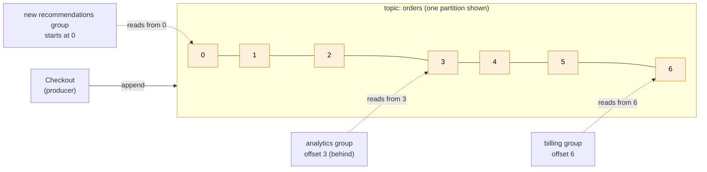
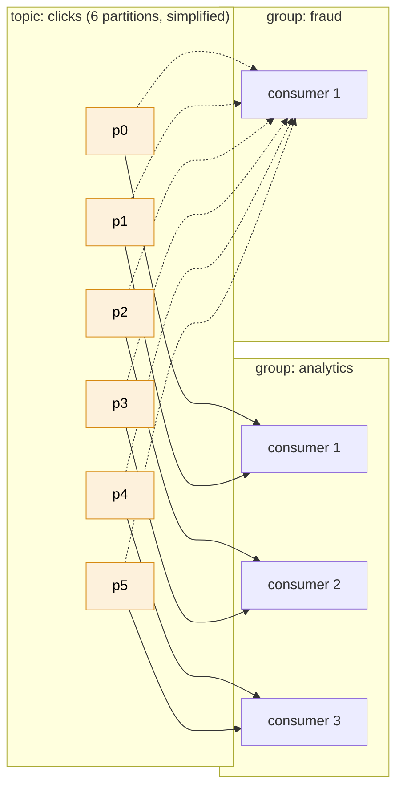

# Kafka

> [!abstract] In one sentence
> Kafka is a **distributed, replicated, append-only log**: producers append records to **topics** split into **partitions**, and records **stay there** for a retention period (days, or forever) whether anyone read them or not. Each consumer group keeps its own **position (offset)** in each partition, so many independent readers can read the same data at their own pace, and **rewind** to read it again.

## Common misconceptions

**Wrong mental model #1:** "Kafka is a message queue, like SQS or RabbitMQ, just faster."

**What's actually true:** a queue **hands out** messages and **deletes** them once processed. Kafka **never deletes on read**. Reading is just moving a bookmark.

| | A queue ([[SQS]], RabbitMQ) | Kafka |
|---|---|---|
| After a consumer processes a message | It's deleted | It stays. The consumer's **offset** moves forward |
| Removed when | Acknowledged/deleted (or retention expires) | **Retention** expires (time or size), or replaced by **compaction** |
| Several independent readers | Each needs its own queue (fan-out in front) | Free: each **consumer group** reads the whole topic on its own |
| Read old data again | Impossible once deleted | **Reset the offset** and replay |
| A new consumer joining next month | Only sees new messages | Can read **from the beginning** of what's retained |
| Per-message tracking | Yes (visibility, per-message ack, DLQ) | No: one offset per partition. "Skip just this one message" is the app's problem |

**Wrong mental model #2:** "Kafka keeps all my messages in order."

**What's actually true:** order is guaranteed **only inside one partition**. A topic with 12 partitions has 12 independent orders. To keep all events for one order (or one customer) in order, they must have the **same key**, so they land in the same partition.

**Wrong mental model #3:** "To go faster, I add more consumers."

**What's actually true:** inside one consumer group, **one partition is read by at most one consumer**. The partition count is the ceiling on parallelism. 6 partitions and 10 consumers = 4 consumers doing nothing.

## Build-up: the shop's order events

Same shop as in [[SQS]] and [[SNS]], but this time the platform team runs Kafka themselves: three brokers `kafka-1`, `kafka-2`, `kafka-3` at `10.20.1.11`–`10.20.1.13` (it could just as well be on-premises, another cloud, or a managed service).

### Stage 1: the problem queues don't solve

Checkout publishes `OrderPlaced`. Warehouse, billing and analytics each consume it, each through their own queue (the [[SNS]] fan-out design). Then three requests arrive in the same week:
- The **data team** builds a new recommendation service and wants **every order of the last 30 days** to start with. The queues only ever contained *new* messages, and those were deleted after processing
- The **billing** team shipped a bug for 2 days and wants to **re-process** those days
- **Analytics** wants clickstream too: 20,000 events per second, every page view

What's needed is something that **keeps the stream of events**, lets anyone read it from any point, and handles high volume. That's a log.

### Stage 2: a topic is a log

I create a topic `orders`. Each record is appended to the end and gets a sequential **offset**. Retention: 7 days (Kafka's default), here raised to 30.

- Each **consumer group** (billing, analytics, recommendations) stores its own offset per partition, in Kafka itself (an internal topic `__consumer_offsets`)
- The new team starts with `auto.offset.reset=earliest` and reads 30 days of history, then keeps going with live data
- The billing replay: stop the consumers, **reset the group's offset** to the timestamp of the bug (`kafka-consumer-groups.sh --reset-offsets --to-datetime …`), restart

### Stage 3: one partition isn't enough

Clickstream at 20,000 events/s: one partition lives on one broker's disk and is read by one consumer of a group, so it caps throughput.

**The fix: partitions.** `clicks` gets 12 partitions, spread over the 3 brokers. The producer chooses the partition from the record's **key**: `hash(key) % partitions`.

| Key | Effect |
|---|---|
| `orderId` | All events of one order (`OrderPlaced`, `OrderPaid`, `OrderShipped`) in one partition → **in order** |
| `customerId` | All events of one customer in order. But one huge customer = one **hot partition** |
| No key | Spread across partitions (batched for efficiency), **no ordering** between records |

> [!warning] Partition count is sticky
> I can **add** partitions later but never remove them, and adding them changes `hash(key) % partitions`: records for `o-8812` start landing in a different partition than its older records, which breaks per-key ordering during the change. Pick a generous count up front.

### Stage 4: consumer groups share the partitions

Analytics runs 4 consumers in group `analytics`. Kafka assigns each of the 12 partitions to exactly one of them (3 each). Add a 5th consumer → a **rebalance** reassigns partitions. A 13th consumer would sit idle.

Two groups both read **every** record: that's Kafka's built-in fan-out. Inside a group, consumers **share** the work like workers on a queue.

### Stage 5: a broker dies

`kafka-2` loses its disk. With one copy of each partition, a third of the data is gone.

**The fix: replication.** Each partition has a **replication factor** (3 in production). One replica is the **leader** (all reads and writes go to it), the others are **followers** copying it. The followers that are caught up form the **ISR** (in-sync replicas). If the leader dies, a follower from the ISR becomes leader.

The settings that decide whether an acknowledged write can be lost:

| Setting | Meaning | Safe choice |
|---|---|---|
| Producer `acks` | `0` = don't wait, `1` = leader wrote it, `all` = every in-sync replica has it | `all` (the default since Kafka 3.0) |
| Topic `min.insync.replicas` | With `acks=all`, how many replicas must be in sync for a write to be accepted | `2` with replication factor 3 |
| `unclean.leader.election.enable` | May an out-of-sync replica become leader (losing data) to restore availability? | `false` (the default) |

With RF 3 + `min.insync.replicas=2` + `acks=all`: one broker down, writes still work. Two down, producers get `NotEnoughReplicas` errors **instead of silently losing data**. That's the trade: availability vs durability, chosen explicitly.

### Stage 6: duplicates and "exactly once"

A billing consumer processes record 4120, crashes **before committing** its offset, restarts from the last committed offset (4100), and processes 4100–4120 again. Two invoices.

Kafka's delivery semantics depend on **when the offset is committed**:
- Commit **before** processing → a crash loses records (**at most once**)
- Commit **after** processing → a crash replays a few (**at least once**, the usual choice)

"Exactly once" in Kafka (idempotent producer + **transactions** + consumers with `isolation.level=read_committed`) covers **read from Kafka → process → write to Kafka** atomically. The moment the consumer has a side effect **outside** Kafka (charge a card, send an email, insert into PostgreSQL), I'm back to at least once, and the consumer must be **idempotent** (e.g. store the `orderId` of processed invoices, or write the offset in the same database transaction as the result).

### Stage 7: keeping the latest state forever

The `customer-profiles` topic holds profile updates keyed by `customerId`. With 7-day retention, a customer who hasn't changed their address in a month disappears from the topic, and a new service can't rebuild the full list from it.

**The fix: log compaction** (`cleanup.policy=compact`). Kafka keeps **at least the latest record for each key** forever and removes older versions in the background. A record with the key and a **null value** (a *tombstone*) deletes the key. The topic becomes a replayable snapshot of current state, which is how Kafka Connect, Kafka Streams and many services rebuild their local caches.

## The ecosystem around the broker

| Piece | What it does |
|---|---|
| **KRaft** | Kafka's built-in metadata consensus. Kafka used to need a separate **ZooKeeper** cluster. KRaft replaced it, and Kafka 4.0 (2025) removed ZooKeeper entirely. Older material still shows ZooKeeper |
| **Kafka Connect** | Ready-made connectors moving data between Kafka and databases, S3, Elasticsearch…, e.g. **change data capture** (Debezium) turning every row change in PostgreSQL into an event |
| **Schema Registry** | Stores Avro/Protobuf/JSON schemas so producers can't publish data consumers can't parse (Confluent's, or alternatives such as AWS Glue Schema Registry) |
| **Kafka Streams / Flink** | Stream processing: joins, windows, aggregations over topics ("orders per minute per country") |
| **Tiered storage** | Recent versions can move old segments to object storage ([[S3]]-like) so long retention doesn't need huge broker disks |
| **Share groups** | Newer Kafka versions (KIP-932, "queues for Kafka") add queue-style consumption with per-record acknowledgment, so more consumers than partitions can share the work |

## Advanced problems I'll actually debug

| Symptom | Usual cause | Fix |
|---|---|---|
| **Consumer lag** keeps growing | Consumers slower than producers, or not enough partitions to add consumers | Faster processing, more consumers (up to the partition count), more partitions (mind the key remapping) |
| Constant **rebalances**, nothing gets processed | A consumer takes longer than `max.poll.interval.ms` (5 min default) between polls, gets kicked out, rejoins, repeat | Smaller `max.poll.records`, faster processing, cooperative rebalancing, static membership (`group.instance.id`) for rolling restarts |
| One partition far behind, others fine | **Hot partition** from a skewed key (one giant customer) | Better key (add a suffix to spread the big key), or a key that matches the real ordering need |
| Client connects to the bootstrap address, then times out | The broker's **`advertised.listeners`** give an address the client can't reach (internal hostname, private IP behind [[NAT and PAT\|NAT]]) | Advertise addresses reachable from where clients are, one listener per network. Clients must reach **every broker** directly, a single [[Load balancing\|load balancer]] in front doesn't work |
| One bad record blocks a partition | The consumer crashes on it, never commits past it (Kafka has no built-in DLQ) | Catch the error, write the record to a **dead-letter topic**, commit, move on |
| `RecordTooLargeException` | Record over ~1 MB, the default limit | Raise the broker/topic/producer/consumer limits together, or store the payload in object storage and send a pointer |
| Producer errors `NotEnoughReplicas` | ISR fell below `min.insync.replicas` (brokers down or followers too slow) | Fix the brokers. This is the durability guarantee working, not a bug |
| Data lost after a broker crash | `acks=1`, or unclean leader election enabled | `acks=all`, `min.insync.replicas=2`, unclean election off |
| Disk full on brokers | Retention by time only, traffic grew | Retention by size too (`retention.bytes`), tiered storage, more brokers |
| Old data "came back" after a consumer restart | `auto.offset.reset=earliest` on a group whose committed offsets expired | Keep the group active, or set the reset policy deliberately |

## In AWS
- **Amazon MSK** (Managed Streaming for Apache Kafka) runs real Kafka for me: same protocol, same clients, AWS handles brokers, patching and replacement. **MSK Serverless** removes broker sizing. **MSK Connect** runs Kafka Connect
- **Kinesis Data Streams** is AWS's own service with the same idea (shards ≈ partitions, retention, replay, several readers) and a different API
- How Kafka compares with SQS, SNS, EventBridge and Kinesis, and when to pick which → [[Kafka vs AWS messaging services]]

## Practice

> [!example]- A topic has 8 partitions. The consumer group has 12 consumers. How many are working?
> 8. Each partition goes to one consumer of the group, so 4 consumers are idle.

> [!example]- All events of an order must be processed in order, but orders can be processed in parallel. How?
> Use the order ID as the record key. Same key → same partition → in order. Different orders spread over partitions and are processed in parallel.

> [!example]- A new service needs the last 2 weeks of events. Retention is 7 days. Options?
> The data older than 7 days is gone from Kafka. Raise retention (or use tiered storage) for the future, and backfill from wherever the data is archived (a database, S3 via Kafka Connect). For "current state per key", a compacted topic would have kept it.

> [!example]- RF 3, `min.insync.replicas=2`, `acks=all`. Two brokers die. What happens to producers?
> Writes to partitions with fewer than 2 in-sync replicas fail with `NotEnoughReplicas`. Reads of data already written still work from the remaining leader. No acknowledged data is lost.

## Easy to get wrong
- Treating Kafka like a queue: reading doesn't delete, and there's no per-message ack or DLQ by default
- Expecting global order across a topic. Order is per partition, so per key
- More consumers than partitions, and expecting more throughput
- Adding partitions later and breaking per-key ordering
- `acks=1` or `min.insync.replicas=1` in production, then losing acknowledged writes
- Believing "exactly once" covers side effects outside Kafka
- Committing offsets before processing (silent loss) or never handling duplicates (double processing)
- Advertising internal addresses, then clients outside that network can bootstrap but not produce
- Reading ZooKeeper-era tutorials as current: Kafka 4.0 runs on KRaft only

## Related
- The same append-only log idea in filesystems and databases:: [[Journaling]]
- Compared with:: [[Kafka vs AWS messaging services]]
- Queue and pub/sub alternatives:: [[SQS]], [[SNS]], [[EventBridge]]
- Broker protocols:: [[AMQP]], [[MQTT]], [[JMS]]
- Network side:: [[NAT and PAT]], [[DNS]], [[Load balancing]], [[TLS]], [[mTLS]] (client authentication)
- Partitioning:: [[Hash table]] (hash(key) % n, and what changing n does)
- Storage side:: [[S3]] (tiered storage, sink connectors), *[[Storage replication]]*
- Area:: [[Messaging]]

## Flashcards
#flashcards

What is Kafka in one sentence? :: A distributed, replicated, append-only log: records stay for a retention period and each consumer group tracks its own offset
Does reading a record in Kafka delete it? :: No. Only retention (time/size) or compaction removes records. Reading moves the consumer group's offset
What is an offset? :: The sequential position of a record in a partition. Consumer groups commit the offset they have processed up to
Where does Kafka store consumer group offsets? :: In the internal topic __consumer_offsets
What is Kafka's default retention? :: 7 days (168 hours)
What ordering does Kafka guarantee? :: Order within a partition only
How do I keep all events of one entity in order? :: Give them the same key: same key → same partition
How is a record's partition chosen when it has a key? :: hash(key) modulo the number of partitions
Can I reduce the number of partitions of a topic? :: No, only add. Adding changes which partition a key maps to
Maximum useful consumers in one group? :: The number of partitions. Extra consumers sit idle
How do two different services both get every record? :: Each uses its own consumer group
What is a rebalance? :: Reassigning partitions among a group's consumers when one joins, leaves or times out
What causes rebalance storms? :: Consumers exceeding max.poll.interval.ms between polls, getting kicked out and rejoining
What is the ISR? :: In-sync replicas: the replicas of a partition caught up with the leader
Safe durability settings with replication factor 3? :: acks=all and min.insync.replicas=2, unclean leader election off
What does acks=all do? :: The producer's write is acknowledged only when all in-sync replicas have it
At most once vs at least once in a Kafka consumer? :: Commit before processing = at most once. Commit after processing = at least once
What does Kafka's exactly-once cover? :: Consume from Kafka → process → produce to Kafka atomically (transactions). Not external side effects
What is log compaction? :: Keeping at least the latest record per key and removing older ones. A null value (tombstone) deletes the key
What replaced ZooKeeper in Kafka? :: KRaft. Kafka 4.0 removed ZooKeeper
What is consumer lag? :: How far a consumer group's committed offset is behind the end of the partition
Kafka's answer to a poison message? :: None built in: the consumer writes it to a dead-letter topic and commits past it
Why do clients reach the bootstrap broker but then fail? :: advertised.listeners return broker addresses the client can't reach
Can I put one load balancer in front of a Kafka cluster? :: Not as the only path: clients must reach each partition leader's broker directly
What is Kafka Connect? :: A framework of connectors moving data between Kafka and other systems (e.g. CDC with Debezium)
What is Amazon MSK? :: AWS's managed Apache Kafka (with Serverless and MSK Connect variants)
