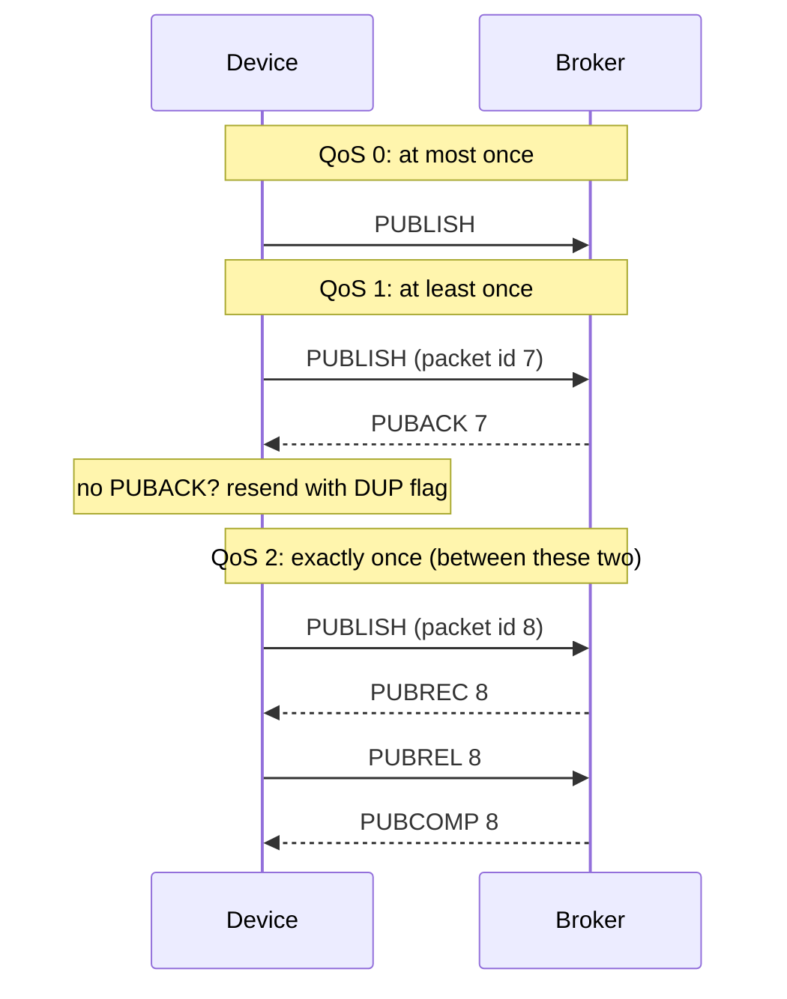
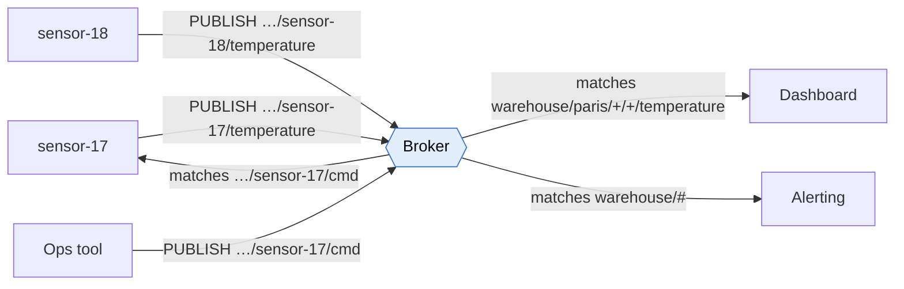

# MQTT

> [!abstract] In one sentence
> MQTT is a **tiny publish/subscribe protocol** for devices on weak, unreliable networks: each device keeps **one long-lived TCP connection** (port **1883**, **8883** with TLS) to a **broker**, publishes messages to **hierarchical topics** like `warehouse/paris/cold-room-2/temperature`, and subscribes with **wildcards**. The broker delivers each message to every matching subscriber. It was designed for sensors and phones, and it's what most IoT platforms speak.

## Common misconceptions

**Wrong mental model #1:** "MQTT is a message queue."

**What's actually true:** MQTT is **pub/sub**, closer to [[SNS]] than to [[SQS]]. A message published to a topic nobody subscribes to is **dropped** (except the one **retained** message per topic). There is no queue that workers drain, and no history to replay. The broker only stores messages for **persistent sessions** of clients that are offline, and only for topics they had subscribed to.

**Wrong mental model #2:** "QoS 2 means the message reaches the subscriber exactly once."

**What's actually true:** QoS is negotiated **per hop**: publisher → broker, then broker → each subscriber. The subscriber gets the **lower** of the publish QoS and its subscription QoS. And "exactly once" ends at the MQTT layer: if the application crashes after receiving but before saving, it's gone (or duplicated on the app's side). End-to-end guarantees still need idempotent applications.

**Wrong mental model #3:** "Devices can't receive commands because they sit behind NAT, so the server must poll them."

**What's actually true:** the **device opens the connection** to the broker (outbound, like a browser), and keeps it open. The server publishes a command to the device's topic, and the broker sends it down that existing connection. NAT and firewalls don't need inbound rules ([[NAT and PAT]]). The catch: the connection must stay alive through NAT idle timeouts, which is what the **keep-alive** is for.

## The pieces

| Piece | What it is |
|---|---|
| **Broker** | The server every client connects to (Mosquitto, EMQX, HiveMQ, VerneMQ, AWS IoT Core) |
| **Client** | Anything that connects: a sensor, a phone app, a backend service. Identified by a **client ID** (must be unique per broker) |
| **Topic** | A UTF-8 string with levels separated by `/`: `warehouse/paris/cold-room-2/temperature`. Not created in advance, it exists as soon as someone publishes to it |
| **Subscription** | A topic filter, possibly with wildcards, plus a maximum QoS |
| **`+`** | Wildcard for **exactly one level**: `warehouse/+/cold-room-2/temperature` |
| **`#`** | Wildcard for **all remaining levels**, must be last: `warehouse/paris/#` |
| **Keep alive** | Max seconds between packets. The client sends `PINGREQ` when idle. Broker drops it after 1.5× this with no traffic |

Topics starting with `$` (like `$SYS/…` broker statistics) are **not** matched by a subscription to `#`.

## QoS levels



| QoS | Guarantee | Cost | Use |
|---|---|---|---|
| **0** | At most once, fire-and-forget | 1 packet | Frequent readings where the next one replaces a lost one (temperature every 10 s) |
| **1** | At least once, **duplicates possible** | 2 packets, sender stores until PUBACK | Most things: events, commands with idempotent handling |
| **2** | Exactly once **per hop** | 4 packets, state on both sides | Rarely worth it. Billing counters, where a duplicate is costly and dedup in the app is hard |

## Build-up: the shop's warehouse sensors

The shop's warehouse in Paris has 200 temperature sensors in its cold rooms and 40 handheld scanners. They're on a flaky Wi-Fi and some on 4G. Backend services run in the shop's data center, broker `mqtt.myshop.example` (`198.51.100.20`).

### Stage 1: why not just HTTP?

The first version: sensors `POST` a reading every 10 seconds to an HTTPS API, and poll `GET /commands` every 30 s for instructions ("recalibrate").

**The problems:**
- Each request re-sends HTTP headers (hundreds of bytes) for a 6-byte reading, and a new TLS handshake whenever the connection was dropped. Battery and 4G data suffer
- Commands arrive up to 30 s late, and 200 devices polling all day mostly get "nothing new"
- When the backend wants to know "which sensors are offline right now?", it has to infer it from missing POSTs

**MQTT:** one connection per device, a 2-byte fixed header per packet, commands pushed instantly down the open connection, and the broker knows who's connected.

### Stage 2: topic design

```
warehouse/paris/cold-room-2/sensor-17/temperature      readings
warehouse/paris/cold-room-2/sensor-17/status           online/offline
warehouse/paris/cold-room-2/sensor-17/cmd              commands to this device
```

Subscriptions:
- Dashboard for Paris: `warehouse/paris/+/+/temperature`
- Alerting for everything: `warehouse/#`
- Sensor 17 listens only to `warehouse/paris/cold-room-2/sensor-17/cmd`

Rules that save pain later: no leading `/` (it creates an empty first level), no spaces, put the **most general level first**, keep IDs in the path (so access rules can be per device), and don't encode data that changes into topic names.



### Stage 3: the dashboard opens blank

A sensor that hasn't changed in 10 minutes publishes rarely. A dashboard that opens now shows nothing until the next reading, because MQTT doesn't keep history.

**The fix: retained messages.** Publishing with the **retain** flag makes the broker keep the **last** message on that topic and send it immediately to any new subscriber. One per topic, replaced by the next retained publish, deleted by publishing an empty retained message. Good for "current state" (last temperature, device status), not for history.

### Stage 4: knowing a device died

A sensor loses power. It never says goodbye, the dashboard shows its last value as if it were live.

**The fix: Last Will and Testament (LWT).** When connecting, the sensor registers a will: topic `…/sensor-17/status`, payload `offline`, retained. If the connection drops **without** a clean `DISCONNECT` (power loss, network loss, keep-alive timeout), the broker publishes the will for it. On connect, the sensor publishes `online` (retained) to the same topic. The status topic always shows the truth.

### Stage 5: commands sent while a scanner was offline

A scanner goes out of Wi-Fi range for 5 minutes. A command sent then is lost, because nobody was connected to receive it.

**The fix: persistent sessions.** The scanner connects with a fixed client ID and **clean start = false** (MQTT 5: plus a **session expiry interval**, say 1 hour). The broker remembers its subscriptions and **queues QoS 1/2 messages** for it while it's away, then delivers them when it reconnects. QoS 0 messages aren't queued.

> [!warning] Two devices, same client ID
> When a second client connects with an ID that's already connected, the broker **disconnects the first one**. Two devices sharing an ID kick each other off in a loop, each reconnect bumping the other. A classic symptom: "connected, disconnected, connected…" every few seconds.

### Stage 6: the backend can't keep up

One backend service subscribes to `warehouse/#` and writes readings to the database. 240 devices are fine. 20,000 sensors across all warehouses are not, and two instances of the service subscribing to the same topic would **both** get every message (that's pub/sub).

**The fix (MQTT 5): shared subscriptions.** Instances subscribe to `$share/ingest/warehouse/#`: the broker spreads the messages **between** members of the group `ingest`, like workers on a queue. Many deployments also bridge MQTT into [[Kafka]] or a queue at this point, and let the backend consume from there.

### Stage 7: securing 240 devices

- **TLS** on 8883 always (MQTT itself is plaintext), see [[TLS]]
- Device identity: username/password is weak for devices (one leaked password often = all devices). **Client certificates** ([[mTLS]]), one per device, revocable one by one
- **Authorization per topic**: sensor-17 may publish only under `…/sensor-17/#` and subscribe only to its own `cmd` topic. Without this, one compromised sensor can send commands to all the others, or read everything with `#`
- MQTT over **WebSockets** (often port 443) for browsers and networks that only allow HTTPS

## MQTT 3.1.1 vs 5

| Feature | 3.1.1 | 5 |
|---|---|---|
| Error details | Almost none (connection just closes) | **Reason codes** on every ack, reason strings |
| Shared subscriptions | Broker-specific extensions | Standard (`$share/group/filter`) |
| Session lifetime | Clean session yes/no | **Session expiry interval** + clean start |
| Message expiry | No | Per-message expiry |
| Metadata | No | **User properties** (key/value headers), content type, response topic and correlation data for request/response |
| Topic aliases | No | Replace a long topic by a number to save bytes |

## Advanced problems I'll actually debug

| Symptom | Usual cause | Fix |
|---|---|---|
| Devices disconnect every few minutes when idle | NAT or firewall idle timeout shorter than the keep-alive, or a [[Load balancing\|load balancer]] idle timeout | Keep alive below the shortest idle timeout on the path (e.g. 60 s), longer LB idle timeout |
| Connect/disconnect loop every few seconds | Two clients with the **same client ID** | Unique IDs (device serial number or certificate name) |
| Subscriber receives nothing | Topic case or level mismatch (`Warehouse/` vs `warehouse/`), leading `/`, or no permission and the broker silently ignores the subscribe | Compare exact strings, check SUBACK reason codes (MQTT 5), broker ACL logs |
| Dashboard shows stale "online" devices | No LWT, or the will isn't retained | LWT `offline` retained + `online` retained on connect |
| Messages missing after a device reconnects | Clean session, or QoS 0, or the session expired | Persistent session with an expiry long enough, QoS 1 |
| Duplicate readings in the database | QoS 1 redelivery after a lost PUBACK | Idempotent writes (device ID + timestamp as key) |
| Broker memory grows steadily | Thousands of offline persistent sessions queueing messages | Session expiry, queue limits per client, QoS 0 for telemetry |
| All devices reconnect at once after a broker restart and overload it | **Thundering herd**: every client retries at the same moment | Exponential backoff **with jitter** in the device firmware |
| TLS handshake fails on cheap devices | Device lacks the CA, wrong clock (certificate not yet valid), or unsupported cipher | Bundle the right CA, sync time (NTP) before connecting, check the TLS versions the device supports |

## In AWS
- **AWS IoT Core** is a managed MQTT broker: MQTT 3.1.1 and 5, over TLS on 8883 or WebSockets/443, devices authenticated with **X.509 certificates** ([[mTLS]]) and authorized with IoT policies per topic. It supports **QoS 0 and 1 only** (no QoS 2), retained messages, LWT and persistent sessions. Its **rules engine** forwards messages with SQL-like filters to [[Lambda]], [[SQS]], [[SNS]], DynamoDB, Kinesis, S3…
- **Amazon MQ for ActiveMQ** also speaks MQTT, for apps that need a general broker rather than an IoT platform
- The shop's design in AWS: sensors → IoT Core → rule → Kinesis or SQS → backend

## Practice

> [!example]- Which topics does `warehouse/+/cold-room-2/#` match? `warehouse/paris/cold-room-2`, `warehouse/paris/cold-room-2/sensor-17/temperature`, `warehouse/cold-room-2/sensor-17`
> The first two. `#` also matches the parent level itself, so `warehouse/paris/cold-room-2` matches. The third doesn't: `+` needs exactly one level between `warehouse` and `cold-room-2`, and there's none.

> [!example]- A sensor publishes at QoS 2, the dashboard subscribed at QoS 0. What does the dashboard get?
> QoS 0: the effective QoS is the lower of the two. QoS is per hop.

> [!example]- How does the backend find out, within a minute, that a sensor lost power?
> Last Will and Testament: the broker publishes the will (e.g. `offline`, retained) when the keep-alive expires without a clean disconnect. Keep-alive 30–40 s gives detection in under a minute.

> [!example]- Three instances of an ingestion service each receive every message. I want each message processed once. What changes?
> Use an MQTT 5 shared subscription (`$share/ingest/…`) so the broker spreads messages among the group. Or bridge MQTT into a queue and consume from there.

## Easy to get wrong
- Treating MQTT as a queue: no history, messages to topics without subscribers are dropped
- Expecting QoS to be end-to-end: it's per hop, and the lower QoS wins
- Same client ID on two devices
- Keep-alive longer than NAT/LB idle timeouts
- A leading `/` in topic names, or case mismatches
- Using retained messages as history (only the last one is kept)
- Forgetting per-topic authorization, so one device can command all others
- Plain 1883 without TLS outside a lab
- Reconnect without backoff and jitter (thundering herd)
- AWS IoT Core doesn't do QoS 2

## Related
- Same family:: [[AMQP]], [[JMS]]
- Compared with:: [[SNS]] (pub/sub), [[Kafka]] (often fed from MQTT for history and scale)
- Network side:: [[NAT and PAT]], [[TLS]], [[mTLS]], [[Load balancing]] (L4 for MQTT, idle timeouts), [[WebSocket]] (MQTT over WebSocket), [[Outbound-initiated connections]]
- Area:: [[Messaging]]

## Flashcards
#flashcards

What is MQTT? :: A lightweight publish/subscribe protocol over long-lived TCP connections to a broker, designed for devices on unreliable networks
MQTT ports? :: 1883 plain, 8883 with TLS (WebSockets often on 443)
MQTT topic level separator and wildcards? :: / separates levels. + matches exactly one level, # matches all remaining levels (must be last)
Does # match topics starting with $? :: No ($SYS etc. must be subscribed explicitly)
MQTT QoS 0, 1, 2? :: 0 at most once, 1 at least once (duplicates possible), 2 exactly once (4-packet handshake)
Is MQTT QoS end-to-end? :: No, per hop. The subscriber gets the lower of publish QoS and subscription QoS
QoS 2 handshake packets? :: PUBLISH, PUBREC, PUBREL, PUBCOMP
What is a retained message? :: The last message on a topic kept by the broker and sent immediately to new subscribers
What is the Last Will and Testament? :: A message the broker publishes for a client whose connection drops without a clean disconnect
What is a persistent session? :: The broker keeps a client's subscriptions and queues its QoS 1/2 messages while it's offline
What happens when two clients connect with the same client ID? :: The broker disconnects the older one, causing a reconnect loop
What is the MQTT keep-alive for? :: Detecting dead connections and keeping NAT/firewall state alive. Broker drops the client after 1.5× keep-alive without packets
What is an MQTT 5 shared subscription? :: $share/group/filter: messages are spread among the group's members instead of copied to each
Why can a device behind NAT receive MQTT commands? :: The device opened the outbound connection, the broker pushes down it
How should IoT devices authenticate to an MQTT broker? :: Per-device X.509 client certificates over TLS (mTLS), plus per-topic authorization
Which MQTT QoS levels does AWS IoT Core support? :: 0 and 1, not 2
What does AWS IoT Core's rules engine do? :: Filters MQTT messages with SQL-like rules and forwards them to AWS services (Lambda, SQS, SNS, Kinesis, S3…)
