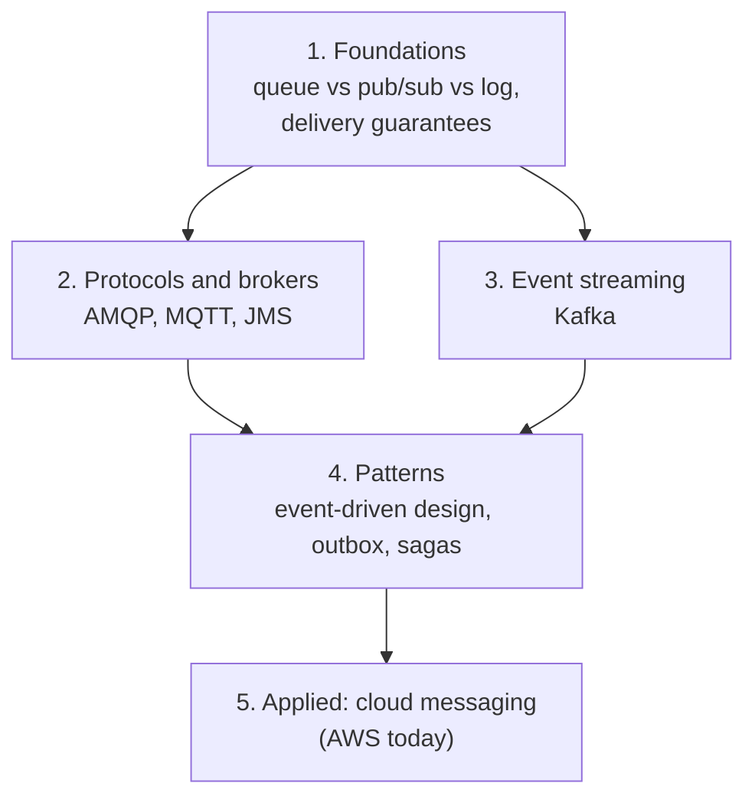

# Messaging

> What this covers: how systems talk to each other **without waiting for each other**: queues, publish/subscribe, event streams, the delivery guarantees behind them, and the architecture patterns built on top. Vendor-neutral first. AWS is one place it's applied, not the frame.

## How to use this

Read the sections **top to bottom**: each one assumes the ones above it. Links in *italics* are notes not written yet (the roadmap).



## 1. Foundations
- *[[Queues, pub/sub and logs]]*: the three shapes of messaging, what each one does with a message after it's read, and why that decides everything else
- *[[Delivery guarantees]]*: at most once, at least once, "exactly once", ordering, idempotent consumers, deduplication

## 2. Protocols and brokers
- [[AMQP]]: the open broker protocol. 0-9-1 vs 1.0 (two different protocols), exchanges/bindings/routing keys, acks and prefetch, publisher confirms, durability, quorum queues, dead-letter exchanges
- [[MQTT]]: tiny pub/sub for devices. Topics and wildcards, QoS 0/1/2 (per hop), retained messages, Last Will, persistent sessions, shared subscriptions, securing devices, NAT and keep-alive
- [[JMS]]: a Java **API**, not a protocol. Queues vs topics, durable subscriptions, selectors, ack modes and transactions, request/reply, moving a JMS app to AWS
- Not written yet: *[[RabbitMQ]]* (the broker behind most AMQP use, operating it)

## 3. Event streaming
- [[Kafka]]: a replicated, partitioned log. Topics, partitions and keys, offsets and consumer groups, replication (ISR, `acks`, `min.insync.replicas`), at-least-once vs exactly-once, compaction, KRaft, and the problems I'll debug (lag, rebalances, hot partitions, `advertised.listeners`)

## 4. Patterns
- *[[Event-driven architecture]]*: events vs commands, choreography vs orchestration, the transactional outbox, sagas, change data capture

## 5. Applied: cloud messaging (AWS today)
The notes below live in `Areas/AWS/Integration/` with `topic: AWS`.
- [[SQS]]: managed queues (standard and FIFO), visibility timeout, DLQ
- [[SNS]]: managed pub/sub, fan-out to queues
- [[EventBridge]]: event bus with content-based rules, AWS service events, Scheduler, archive and replay
- [[SQS vs SNS vs EventBridge]]: which of the three
- [[Kafka vs AWS messaging services]]: Kafka next to MSK, Kinesis, SQS, SNS and EventBridge, and how to choose
- Not written yet: *[[Amazon MSK]]* · *[[Kinesis Data Streams]]* · *[[Amazon MQ]]* (managed ActiveMQ/RabbitMQ, the AWS home for AMQP/MQTT/JMS apps)

## Related areas
- [[Networking]]: brokers are network services (DNS, NAT, TLS, load balancing all show up when clients can't connect)
- [[Storage]]: retention, replication and durability are storage problems too
- [[AWS]]: the applied notes

## Weakest first
```dataview
TABLE WITHOUT ID file.link AS Note, type AS Type, confidence AS Conf
FROM ""
WHERE topic = this.file.name AND confidence
SORT confidence ASC
```

## Open questions
- 
