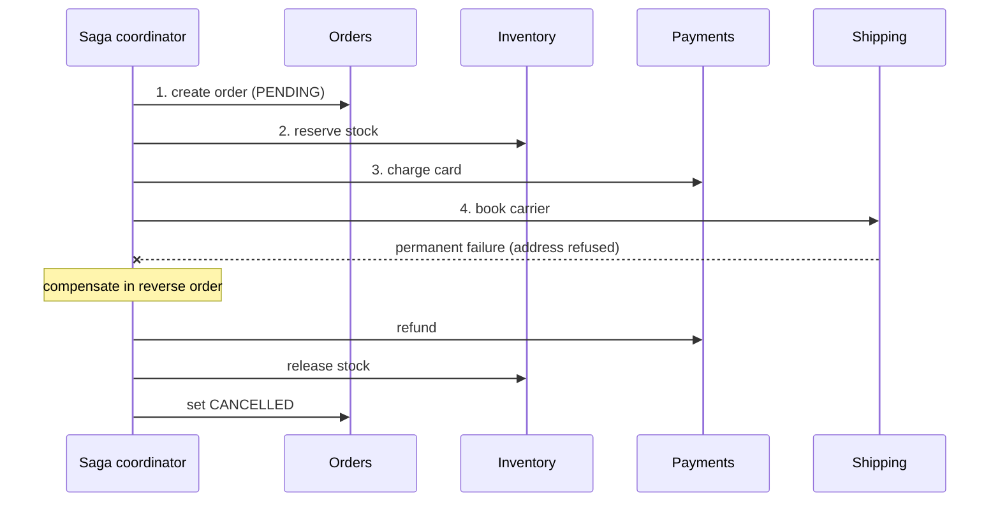
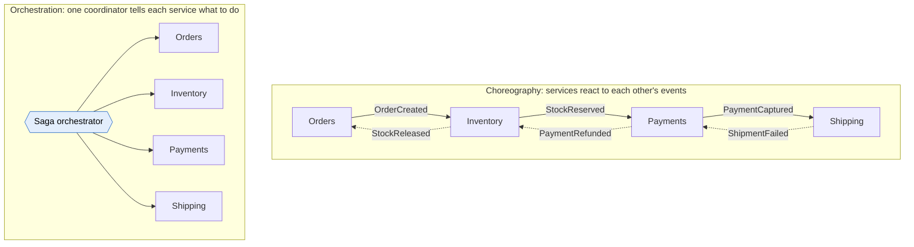
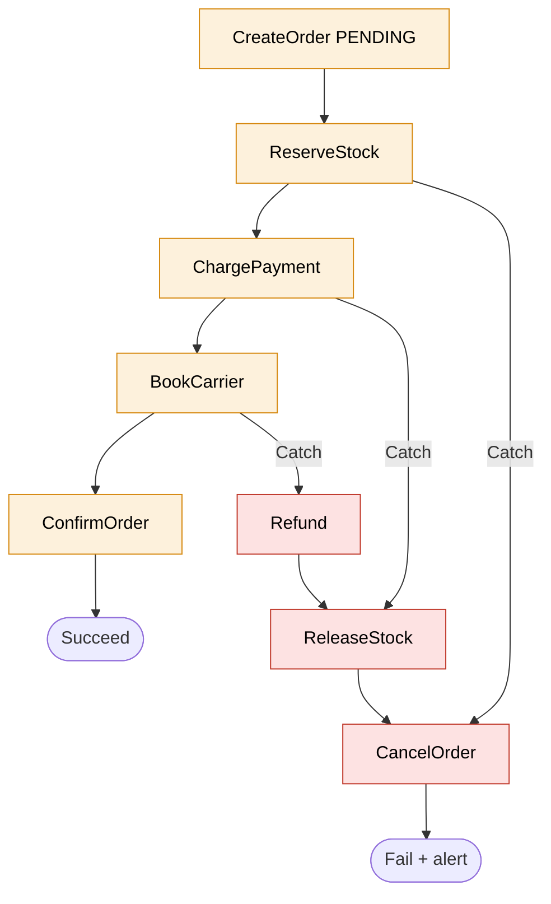

# Saga pattern

> [!abstract] In one sentence
> A **saga** keeps data consistent across several services **without** a distributed transaction: the business operation is split into a sequence of **local transactions**, one per service, each committed on its own. If a later step fails, the saga runs **compensating transactions** that semantically undo the earlier steps (refund the payment, release the stock), in reverse order. The result is **eventual** consistency: never "all at once", but always ending in "all done" or "all undone".

## Common misconceptions

**Wrong mental model #1:** "A compensation is a rollback."

**What's actually true:** a rollback makes it as if nothing happened. A compensation is a **new business action** that cancels the effect of an old one, and the old one **did** happen, and may have been seen:

| Step | A rollback would… | The compensation actually is… | What stays visible |
|---|---|---|---|
| Charge the card 120 EUR | Erase the charge | **Refund** 120 EUR | Both lines on the customer's bank statement |
| Reserve 2 units of stock | Un-reserve silently | **Release** 2 units | Another customer may have seen "out of stock" in between |
| Send "order confirmed" email | Unsend it | Send an **"order cancelled"** email | The first email. Some actions can't be compensated at all |

**Wrong mental model #2:** "A saga is just retries with error handling."

**What's actually true:** retries handle **temporary** failures of one step. A saga handles a **permanent** failure in the middle of a multi-service operation, when some steps have already committed and can't be retried into success. It's a design decision made **per step**: what undoes it, and from which point there's no going back.

**Wrong mental model #3:** "With a saga, the system is consistent at every moment, just like with a transaction."

**What's actually true:** sagas give up **isolation** (the "I" of ACID). While a saga runs, other requests can see its intermediate state: stock reserved for an order that will be cancelled, a payment for an order that doesn't exist yet. Handling that is part of the design (see the countermeasures below).

## Build-up: placing an order across four services

The shop is split into services, each with **its own database**: **Orders** (PostgreSQL on [[RDS]]), **Inventory** (DynamoDB), **Payments** (talks to an external payment provider), **Shipping** (talks to the carrier's API).

Placing an order must: create the order, reserve stock, charge the card, book the carrier.

### Stage 1: why not one transaction?

In a single database this is one `BEGIN … COMMIT`: all or nothing. Across services, the options are:

- **Distributed transaction / two-phase commit (2PC, XA)**: a coordinator asks every participant to *prepare*, then to *commit*. It needs every participant to support it (the payment provider's REST API and DynamoDB don't), holds **locks** across services for the whole duration, and if the coordinator dies between the two phases, participants sit **in doubt** with locks held. See XA in [[JMS]]
- **Hope**: call the four services in a row and pray. The first time the carrier API fails after the card was charged, a customer pays for an order that never ships

A saga is the third option: accept that each step commits on its own, and **plan the way back**.

### Stage 2: the saga, step by step

Each step is a local transaction in one service, paired with its compensation:

| # | Step (local transaction) | Service | Compensation |
|---|---|---|---|
| 1 | Create order with status **`PENDING`** | Orders | Set status **`CANCELLED`** |
| 2 | Reserve stock | Inventory | Release the reservation |
| 3 | Charge the card | Payments | Refund |
| 4 | Book the carrier | Shipping | *(none: last step)* |
| 5 | Set order **`CONFIRMED`** | Orders | *(none)* |

**Happy path:** 1 → 2 → 3 → 4 → 5.

**Failure at step 4** (carrier refuses the address, after retries): run the compensations of the completed steps **in reverse**: refund (3) → release stock (2) → cancel order (1).

The `PENDING` status in step 1 matters: it tells everyone else "this order isn't real yet". That's the first isolation countermeasure (below).

### Stage 3: not every step can be undone

Classify each step (Chris Richardson's terms):

| Kind | Meaning | In the shop |
|---|---|---|
| **Compensatable** | Can be undone by a compensation | Create order, reserve stock, charge card |
| **Pivot** | The point of no return: once it succeeds, the saga **must** finish | Book the carrier (a parcel is physically on its way) |
| **Retriable** | Comes after the pivot, must eventually succeed, so it's retried until it does | Set order `CONFIRMED`, send the confirmation email |

Design rule: put the steps that **can't be compensated** (sending emails, booking a carrier, calling an external party) **as late as possible**, ideally as the pivot or after it. That's why the confirmation email is sent at the end, not at step 1.

### Stage 4: who drives the saga?

Two ways to coordinate the same steps:

| | **Choreography** | **Orchestration** |
|---|---|---|
| How | Each service listens to events and publishes its own (on [[EventBridge]], [[Kafka]], [[SNS]] + [[SQS]]…) | A coordinator (a workflow engine like [[Step Functions]], or a service with a state machine) calls each step and its compensation |
| Where the process lives | Spread across services: each knows what to do on which event | In **one place**, readable as a diagram |
| Good for | Few steps (2–4), simple flows, teams that must stay independent | Many steps, branches, timeouts, human steps, complex compensations |
| Risks | Hard to see "where is order o-8812?", cyclic event dependencies, every service must know about others' failure events | The orchestrator is a central dependency, and can turn into a place where business logic piles up |
| Debugging | Correlate logs/traces across services by order ID | One execution history per saga |

For most sagas with more than a few steps, **orchestration** is easier to reason about, and it's where a managed workflow engine pays off.

### Stage 5: the isolation problem

Order A's saga has reserved the last 2 units (step 2) and is waiting on the payment. Order B checks stock: 0 left, shows "sold out". A's payment fails, the stock is released. B was turned away for stock that ended up free. Worse cases: a report sums revenue including charges that will be refunded, or two sagas update the same record and one overwrites the other's compensation.

**Countermeasures**, picked per case:

| Countermeasure | Idea | In the shop |
|---|---|---|
| **Semantic lock** | A status flag says "in progress, don't trust me yet" | Order `PENDING` until the saga ends. Stock shows "reserved" separately from "sold" |
| **Commutative updates** | Design updates so their order doesn't matter | Stock as `+n` / `-n` adjustments rather than "set to 5" |
| **Pessimistic ordering** | Reorder steps to reduce the risk of exposing undone work | Charge the card before reserving scarce stock, if payment failures are the common case |
| **Reread value** | Before updating, check the record hasn't changed since the saga read it (optimistic locking) | Version number on the inventory item |
| **Version file / log** | Record operations so out-of-order ones can be reordered | Payments keeps a log so a refund that arrives before its charge is handled |

### Stage 6: when compensations fail

The refund call to the payment provider times out. Now the saga is **half compensated**.

- Compensations must be **retried until they succeed** (they're retriable by design), with backoff
- Every step and compensation must be **idempotent**: a refund retried after a timeout must not refund twice. Use an idempotency key (`refund-o-8812`) that the payment provider deduplicates on
- A compensation for a step that **never happened** must be safe (the reserve-stock call timed out, maybe it ran, maybe not → "release reservation for o-8812" must be a no-op if there is none)
- If retries are exhausted: alert a human, with the saga's full state. Some failures end in a manual fix, and the design should make that visible, not silent

### Stage 7: the dual-write trap

In a choreographed saga, the Orders service must **save the order** and **publish `OrderCreated`**. If it saves and crashes before publishing, the saga never starts. If it publishes then the database commit fails, the saga runs for an order that doesn't exist.

**The fix: the transactional outbox.** Write the event into an `outbox` table **in the same local transaction** as the order. A separate relay (a poller, or change data capture with Debezium into [[Kafka]]) publishes the outbox rows. The event is published if and only if the order was committed (at least once, so consumers stay idempotent). Details go in *[[Event-driven architecture]]*.

## In AWS: sagas with Step Functions

[[Step Functions]] is an orchestrator built for this: each step is a Task, failures are caught with **Catch**, and the compensations are just more states. The order workflow in that note (Stage 3 of its build-up) is this saga.

How the saga's needs map onto Step Functions:

| Saga need | Step Functions feature |
|---|---|
| Compensate in reverse order | Each step's **Catch** jumps into the compensation chain at the right point (failure at Charge → start at ReleaseStock) |
| Retry temporary failures before compensating | **Retry** with backoff and jitter on each Task |
| Compensations retried until they succeed | Generous **Retry** on compensation Tasks, then a Catch that alerts a human |
| Know which steps completed | The state's data (`ResultPath`) carries each step's result (`$.payment.chargeId` for the refund) |
| Long waits (carrier confirmation, human approval) | `.waitForTaskToken` with a timeout |
| Idempotency | Pass the order ID as the idempotency key in every Task's parameters. Execution names are unique, so the same order can't start two sagas |
| "Where is order o-8812?" | The execution history, step by step |
| A long saga in Standard, not Express | Express is at-least-once and limited to 5 minutes: sagas almost always use **Standard** |

For **choreographed** sagas in AWS: services exchange events through [[EventBridge]] (or [[SNS]] → [[SQS]]), each with its own [[DLQ]], and the outbox can be DynamoDB Streams or an RDS change stream feeding EventBridge Pipes.

## Advanced problems I'll actually debug

| Symptom | Usual cause | Fix |
|---|---|---|
| Customer refunded twice | Refund compensation retried after a timeout, not idempotent | Idempotency key per compensation, provider-side deduplication |
| Order `CANCELLED` but stock still reserved | Compensation chain stopped at a failing step, or skipped a step it thought hadn't run | Retry compensations, make "undo something that never happened" a safe no-op, alert on sagas stuck in compensation |
| Orders stuck in `PENDING` forever | The saga coordinator lost the saga (choreography: an event lost, no outbox) or a step waits with no timeout | Outbox for publishing, timeouts on every wait, a sweeper that finds old `PENDING` orders |
| "Sold out" shown, then the item is available again | Isolation: another saga's reservation was visible, then compensated | Show reserved vs sold separately, accept it as a business trade-off, or reorder steps |
| Email "order confirmed" then "order cancelled" | Non-compensatable action placed before the pivot | Move notifications after the pivot (retriable steps) |
| Nobody can tell what state a choreographed saga is in | Process spread across services | Correlation ID on every event + tracing, or switch to orchestration |
| Events trigger each other in a loop | Cyclic choreography (A reacts to B reacting to A) | Clear event ownership, or orchestration |

## Practice

> [!example]- Steps: create order, charge card, reserve stock, book carrier. The carrier booking fails permanently. What runs, in what order?
> Compensations of the completed steps in reverse: release stock, refund the card, cancel the order. The carrier booking itself needs no compensation since it failed.

> [!example]- Why not use two-phase commit across the four services?
> Not every participant supports it (external REST APIs, many NoSQL databases), it holds locks across services for the whole operation, and a coordinator failure leaves participants in doubt. Sagas avoid all three by committing locally and compensating.

> [!example]- Where should "send confirmation email" go in the saga, and why?
> After the pivot (as a retriable step), because an email can't be unsent. Before the pivot, a later failure would need an awkward "sorry, cancelled" email.

> [!example]- A saga has 9 steps, branches on order type and waits for a warehouse confirmation. Choreography or orchestration?
> Orchestration (e.g. Step Functions Standard): many steps, branching and a long wait are much easier to follow and handle in one place than spread across services' event handlers.

## Easy to get wrong
- Calling compensations rollbacks: the original action happened and may have been seen
- Forgetting that sagas have no isolation: intermediate states are visible to others
- Non-idempotent steps or compensations (double charges, double refunds)
- Compensations that crash when the step they undo never actually ran
- Placing irreversible actions (emails, external bookings) before the pivot
- Saving to the database and publishing an event as two separate writes (use an outbox)
- No timeouts: sagas stuck forever in `PENDING`
- Choosing choreography for a long, branching process and losing track of it
- Using Express Step Functions for a saga (at-least-once, 5 minutes max)

## Related
- Implemented with:: [[Step Functions]] (orchestration), [[EventBridge]], [[SNS]], [[SQS]], [[Kafka]] (choreography)
- Alternative it replaces:: two-phase commit / XA, see [[JMS]]
- Depends on:: idempotent consumers ([[SQS]], [[Kafka]]), *[[Delivery guarantees]]*
- Bigger picture:: *[[Event-driven architecture]]* (outbox, choreography vs orchestration)
- Area:: [[Messaging]]

## Flashcards
#flashcards

What is a saga? :: A sequence of local transactions across services, with compensating transactions that undo completed steps if a later one fails
Why use a saga instead of a distributed transaction? :: 2PC needs every participant to support it, holds locks across services, and blocks participants if the coordinator fails
Is a compensation a rollback? :: No. It's a new business action that cancels the effect (refund, release), and the original action stays visible
In what order do compensations run? :: Reverse order of the completed steps
What consistency does a saga give? :: Eventual consistency, no isolation
Compensatable, pivot and retriable steps? :: Compensatable: can be undone. Pivot: point of no return. Retriable: after the pivot, retried until success
Where should irreversible actions go in a saga? :: At or after the pivot
Choreography vs orchestration? :: Choreography: services react to each other's events. Orchestration: a coordinator calls each step and compensation
When is orchestration better for a saga? :: Many steps, branches, timeouts, human steps, complex compensations
What is the semantic lock countermeasure? :: A status flag (e.g. PENDING) marking data as in-progress so others don't trust it yet
Why must saga steps and compensations be idempotent? :: They're retried after timeouts, and a retry must not charge or refund twice
What must a compensation do if its step never ran? :: Nothing, safely (a no-op)
What is the dual-write problem in a choreographed saga? :: Saving data and publishing an event separately can leave one done without the other
What fixes the dual-write problem? :: The transactional outbox: write the event to an outbox table in the same local transaction, relay it afterwards
How does Step Functions implement a saga? :: Retry on each Task for temporary errors, Catch into a chain of compensation Tasks run in reverse
Standard or Express Step Functions for a saga? :: Standard (exactly-once execution, long waits). Express is at-least-once and 5 minutes max
