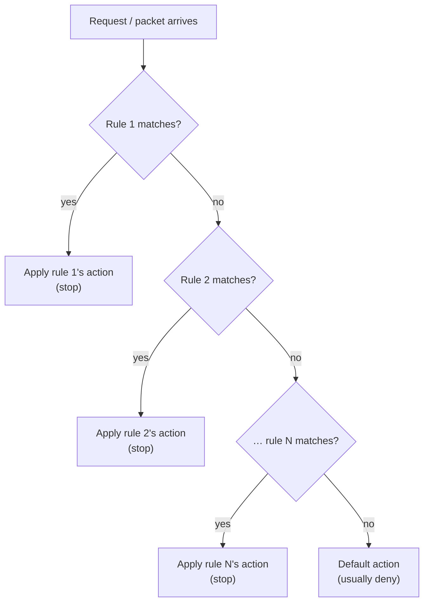

# ACL

> [!abstract] In one sentence
> An ACL (**Access Control List**) is an **ordered list of rules**, each one saying "if a request/packet matches *this*, then **allow** or **deny** it". The first rule that matches decides, and a **default** action handles anything that matches nothing.

## What it is

The same idea shows up in lots of places, only the "what is being matched" changes:

| Where | What a rule matches | Actions | Example |
|---|---|---|---|
| **Routers / switches** (Cisco…) | Source/destination IP, protocol, port | permit / deny | Block `10.0.5.0/24` from reaching the servers VLAN |
| **AWS Network ACL** | IP range (CIDR), protocol, port, on a **subnet** | Allow / Deny | Deny a bad IP range for the whole subnet (see [[VPC]]) |
| **AWS WAF web ACL** | The HTTP request: IP, URL, headers, body, country, rate | Allow / Block / Count / CAPTCHA | Block SQL injection, block my laptop's IP (see [[AWS WAF]]) |
| **Amazon S3 ACLs** | Which AWS account / group | Read / Write grants | Legacy. Disabled by default on new buckets, use bucket policies instead |
| **Linux file ACLs** | User or group | read / write / execute | Give one extra user access to a file (`setfacl`, `getfacl`) |

## How an ACL is evaluated

- **Order matters**: rules are checked from the lowest number / highest priority down, and the **first match wins**
- **Default action at the end**: network ACLs usually end with an implicit **deny all**. A WAF web ACL lets me choose (usually **allow**)
- Classic network ACLs are **stateless**: they judge each packet alone, so the reply traffic needs its own rule

## ACL vs firewall vs security group

An ACL is the simplest kind of firewall: a list of match → action rules. What makes the others different:

| | **ACL** (e.g. AWS Network ACL) | **[[Security groups\|Security group]]** | **Stateful firewall** (e.g. AWS Network Firewall) |
|---|---|---|---|
| Rules | Allow **and deny** | Allow only | Allow, deny, alert… |
| Order | Numbered, first match wins | No order, all rules combined | Ordered or by priority |
| Remembers connections? | No (stateless) | Yes (stateful) | Yes, and can read deeper into the traffic |

## In AWS: the Network ACL

The AWS version sits on a **subnet** of a [[VPC]]. Every packet entering or leaving the subnet goes through it, before reaching the resource's [[Security groups|security group]].

- One subnet has **exactly one** NACL, and one NACL can cover many subnets
- Rules are **numbered** (e.g. 100, 200…), checked in order, first match wins. Leave gaps between numbers to insert rules later
- Each NACL ends with a `*` rule that **denies everything** and can't be removed
- The VPC's **default NACL allows all** traffic in and out. A **new custom NACL denies all** until I add rules
- Inbound and outbound rules are separate lists

Example: a public web subnet.

| Direction | Rule # | Protocol | Port | Source / Destination | Action |
|---|---|---|---|---|---|
| Inbound | 90 | All | All | `203.0.113.0/24` (bad range) | **Deny** |
| Inbound | 100 | TCP | 443 | `0.0.0.0/0` | Allow |
| Inbound | 110 | TCP | 1024-65535 | `0.0.0.0/0` | Allow (replies to requests my servers made) |
| Inbound | `*` | All | All | `0.0.0.0/0` | Deny |
| Outbound | 100 | TCP | 1024-65535 | `0.0.0.0/0` | Allow (replies to clients) |
| Outbound | 110 | TCP | 443 | `0.0.0.0/0` | Allow (my servers calling HTTPS APIs) |
| Outbound | `*` | All | All | `0.0.0.0/0` | Deny |

Rule 90 has to come **before** rule 100: if the allow came first, the bad range would match it and get in.

> [!info] Ephemeral ports
> When a client connects to my server on port 443, it uses a random high port on its side (`1024-65535`), and the reply goes back to that port. A stateless ACL doesn't remember the request, so it must explicitly allow that port range for replies. Security groups don't need this.

## Easy to get wrong

- **Forgetting the ephemeral ports** on a NACL: requests go in, replies never come back, and everything just times out
- **Putting a deny after a broader allow**: the allow matches first and the deny never runs
- **Mixing up the names**: an AWS *Network ACL* (subnet firewall) and a WAF *web ACL* (HTTP rules) are both ACLs but have nothing else in common
- A **new custom NACL blocks everything**, the opposite of the default one

## Related
- Similar to:: [[Security groups]] (also a firewall, but stateful and allow-only)
- Differs from:: IAM policies (control *who* can call AWS APIs, not network traffic, see [[IAM]])
- Used in:: [[VPC]] (Network ACLs), [[AWS WAF]] (web ACLs)
- Inbound vs outbound rules:: [[Ingress and egress]]

## Flashcards
#flashcards

What is an ACL? :: An ordered list of match → allow/deny rules, first match wins, with a default action at the end
In a network ACL, which rule applies when several match? :: The first one (lowest number)
Is an AWS Network ACL stateful? :: No, stateless. Reply traffic needs its own rule (ephemeral ports)
What are ephemeral ports? :: The random high ports (1024-65535) a client uses for its side of a connection, where replies are sent
How many NACLs per subnet? :: Exactly one (one NACL can cover several subnets)
Default NACL vs new custom NACL? :: Default allows everything. A new custom NACL denies everything
What is the `*` rule in a NACL? :: The final catch-all deny, which can't be removed
AWS Network ACL vs WAF web ACL? :: NACL filters IPs/ports on a subnet (L3/L4). Web ACL filters HTTP requests on an ALB/CloudFront/API Gateway (L7)
Why put a deny rule at 90 and an allow at 100? :: Rules run in number order, so the deny must come before the broader allow
