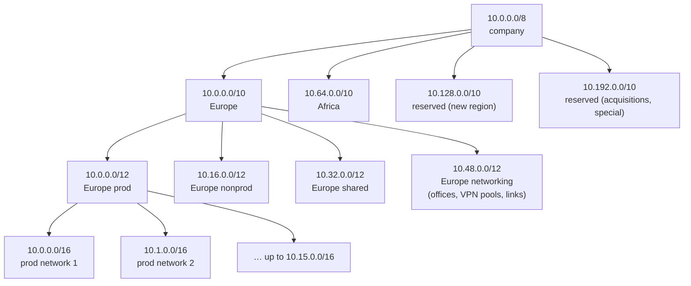

# IP address planning

> [!abstract] In one sentence
> An address plan decides **which block every network gets before anyone asks for one**, so that the address itself says where a network belongs (region, environment, site), whole groups of networks collapse into **one summary route or one firewall rule**, and no two networks that may ever be connected collide.

The arithmetic (masks, binary, VLSM, how a summary is computed) is in [[IP addressing and subnetting]]. This note is about the **design**: how to cut a big private range into a hierarchy that keeps routing, firewalling and growth manageable for years.

## Common misconceptions

| Wrong mental model | What's actually true |
|---|---|
| "Addressing is an academic exercise, any free range will do" | The plan decides how many routes every router, VPN and cloud route table needs, how long firewall rules get, and whether a merger or a VPN breaks things. It's the cheapest decision to get right and the most expensive to change |
| "Private ranges are private, so collisions don't matter" | They matter the moment two private networks are connected: a VPN, a cloud link, a partner, an acquisition, an employee's home router → [[Overlapping address spaces]] |
| "Allocate exactly what's needed, it saves addresses" | In a private `/8` there are 16 million addresses. Tight sizing saves nothing and forces renumbering when a network grows. **Room to grow** and **aligned blocks** matter more than efficiency |
| "Everything starts with 10, so `10.0.0.0/8` summarises my networks" | A summary must contain **only** what's behind it. `10.0.0.0/8` also covers networks elsewhere (a partner's, a VPN pool, another site), and traffic for those would follow the summary to the wrong place |
| "We'll put it in a spreadsheet when it gets big" | Overlaps are born the day two teams pick "a free /16" from memory. The source of truth has to exist before the second allocation |

## Build-up: a company that grows

**Setup.** A company uses `10.0.0.0/8` internally. It has a few networks today, will have offices in several regions, cloud networks per environment, VPN users, and probably an acquisition one day.

### Stage 1: first free block, every time

Each team takes the next range that looks free:

```text
Network A (prod web)     10.17.0.0/16
Network B (dev)          10.83.0.0/16
Network C (prod db)      10.194.0.0/16
Network D (dev tools)    10.18.0.0/16
Office Paris             10.0.0.0/16
Office Tunis             10.200.0.0/16
```

> [!note] `10.17.43.0/16` isn't a valid way to write a network: a `/16` fixes the first 16 bits and the rest must be zero, so it's `10.17.0.0/16`. Tools often accept the sloppy form and silently turn it into `10.17.0.0/16`, which hides mistakes.

It works, until anything needs to say "all prod" or "all dev":
- **Routing**: a router that should send all dev traffic one way needs `10.83.0.0/16` and `10.18.0.0/16` separately, plus every new dev network. With 50 networks, every routing table on the path lists 50 routes
- **Firewall rules**: "dev may not reach prod" becomes a rule per pair of ranges, and a new network silently has no rule
- **Reading an address**: `10.194.3.7` says nothing about what it is or where it lives
- **Collisions**: `10.0.0.0/16` is the default in countless tutorials and wizards; the first VPN to a partner or a cloud network created with defaults collides with Paris

### Stage 2: give each group one aligned block

Decide the groups first, then give each one a block, and allocate networks **only inside their group's block**:

| Block | Group | Covers (second octet) | One summary route |
|---|---|---|---|
| `10.0.0.0/12` | Production | `10.0` – `10.15` | `10.0.0.0/12` |
| `10.16.0.0/12` | Development | `10.16` – `10.31` | `10.16.0.0/12` |
| `10.32.0.0/12` | Shared services | `10.32` – `10.47` | `10.32.0.0/12` |
| `10.48.0.0/12` | Networking (sites, VPN pools, links) | `10.48` – `10.63` | `10.48.0.0/12` |
| `10.64.0.0/10` | Not allocated yet | `10.64` – `10.127` | |

Now:
- "Send all dev traffic over there" is **one route**, `10.16.0.0/12`, whether there are 2 dev networks or 16
- "Dev may not reach prod" is **one firewall rule**, `10.16.0.0/12 → 10.0.0.0/12 deny`
- `10.20.3.7` is obviously dev
- A new dev network takes the next free `/16` inside `10.16.0.0/12`, and nothing else changes anywhere

This is the payoff of the whole plan: **aggregation**. Four dev networks `10.20.0.0/16` … `10.23.0.0/16` share their first 14 bits, so they're also one route, `10.20.0.0/14` (worked in binary in [[IP addressing and subnetting#Summarization]]). And because the whole dev block is reserved for dev, even the wider `10.16.0.0/12` is safe: there's nothing else inside it.

> [!warning] A summary is only safe if the plan guarantees it
> `10.16.0.0/12` is a correct summary for "dev" only because the plan promises that nothing but dev lives in `10.16`–`10.31`. If someone puts a partner VPN in `10.24.0.0/16`, every router that uses the summary now sends partner traffic toward dev. A summary is a **promise about the plan**, not just arithmetic.

### Stage 3: several levels, and which one goes first

One level (environment) isn't enough once there are regions or sites. A plan is a **hierarchy of bits**: each level takes some bits of the address, the most important routing/filtering decision takes the **highest** bits.

**Budget the bits.** From `10.0.0.0/8` down to `/16` networks there are 8 bits to share:

| Level | How many now | Plan for (×2 to ×4) | Bits |
|---|---|---|---|
| Environment (prod, nonprod, shared, networking) | 4 | 4 | 2 |
| Region / site group | 2 | 4 | 2 |
| Networks per (environment, region) | 5 | 16 | 4 |
| **Total** | | | **8** → `/8` + 8 = `/16` networks |

Which level goes first is a real choice:

| Order | Example | Summarises well | Summarises badly |
|---|---|---|---|
| **Environment → region** | prod = `10.0.0.0/10`, prod-europe = `10.0.0.0/12` | "All prod" is one route / one rule, everywhere | "Everything in Europe" is 4 routes (one per environment) |
| **Region → environment** | europe = `10.0.0.0/10`, europe-prod = `10.0.0.0/12` | "Everything in Europe" is one route: what a region's backbone or VPN hub wants | "All prod" is 4 rules (one per region) |

Rule of thumb: put first the dimension that **routing** follows (routes leave a region through that region's links, so region often goes first for wide networks), and the one **security** cares about second (it's still only 4 rules). For a company in one or two regions where the main concern is keeping environments apart, environment first is simpler. Either way: **pick one order and never mix them**.

A full example, region first:



Reading an address now works like a postcode: `10.17.4.20` → `10.0.0.0/10` (Europe) → `10.16.0.0/12` (nonprod) → network `10.17.0.0/16`.

### Stage 4: size each level for growth

- **Size for 2–4× today** at every level. An extra bit doubles the room and costs nothing in a private `/8`
- **Leave whole blocks unallocated** at the top (`10.128.0.0/10`, `10.192.0.0/10` above). A new region or an acquisition then gets its own clean block instead of being squeezed between existing ones
- **Allocate inside a block from one end**, so the free space stays contiguous and can still be split into large aligned pieces
- **Network sizes**: decide a standard size per kind of network (a `/16` per cloud network, a `/22` per office floor, a `/30` or `/31` per router link) so allocation is mechanical and predictable
- **Blocks must be aligned**: a `/12` starts on a multiple of 16 in the second octet (`10.0`, `10.16`, `10.32`…). `10.20.0.0/12` doesn't exist as a separate block; it's inside `10.16.0.0/12`

### Stage 5: reserve the special ranges up front

Things that will need addresses and are often forgotten until they collide:

| Need | Why plan it | Typical choice |
|---|---|---|
| **VPN client pools** | Remote users' addresses must be routable back from every network they reach, and must not overlap a home LAN | A block in "networking", e.g. `10.48.0.0/16`. Avoid `192.168.0.0/24` and `192.168.1.0/24` (home routers) |
| **Point-to-point links, tunnel inside addresses** | Many tiny `/30`–`/31` | One `/24` cut into `/31`s |
| **Container and pod networks** | Kubernetes and Docker can consume thousands of addresses, or use their own defaults | A dedicated block, or a non-routed range reused per cluster (see "In the cloud") |
| **Partner and acquisition space** | Their ranges are out of my control | Keep a reserved top-level block to NAT them into |
| **Lab and test** | Labs get connected to the real network "just for a day" | A block in the plan, never "whatever's free" |

And ranges to **avoid** for anything that may be connected:
- `10.0.0.0/16`, `10.0.0.0/24`, `192.168.0.0/24`, `192.168.1.0/24`: defaults of tutorials, wizards and home routers
- `172.17.0.0/16` (Docker's default bridge) and the next few `172.x` ranges Docker picks
- Whatever ranges known partners, suppliers and the parent company already use

**Which private range?** `10.0.0.0/8` (16 M addresses) gives room for a deep hierarchy; `172.16.0.0/12` (1 M) is often a good choice for something that must **not** collide with a big `10/8` corporate network (a product network, a lab); `192.168.0.0/16` is the most collision-prone because every home uses it. `100.64.0.0/10` (carrier-grade NAT space) is sometimes used for non-routed internal pools, knowing that some ISPs and VPN products (Tailscale) use it too.

### Stage 6: one source of truth, and allocation as a process

The plan only works if every allocation goes through it:
- **One source of truth**: an IPAM tool (NetBox, phpIPAM, Infoblox, a cloud IPAM) or at least one maintained, versioned file. Not memory, not "the last network someone created"
- **Allocation rules**: which block a request comes from, its standard size, who approves, what tags it gets (owner, environment, purpose)
- **Automation**: infrastructure as code asks the IPAM for the next free block instead of a human typing a CIDR. A typed CIDR is how plans drift
- **Audit**: regularly compare what's allocated in the IPAM with what actually exists on the network. Overlaps and orphaned ranges are found here before an outage finds them

## Where the plan pays off

| Place | With random allocation | With an aligned plan |
|---|---|---|
| Routing tables at the edge | One route per remote network (50 networks = 50 routes everywhere) | One route per group (`10.16.0.0/12 → core`) |
| Routes announced over BGP / VPN | Every prefix, often hitting route limits | A few summaries (→ [[AS and BGP]]) |
| Firewall and ACL rules | Pairs of ranges, a missing rule per new network | One rule per group pair (→ [[ACL]]) |
| Troubleshooting | Look every address up | The address says region, environment, network |
| Connecting a new site, cloud or partner | Hunt for a free range that collides with nothing | Take the next block; collisions are already excluded |

The general principle behind it: the **edge** of a network only needs a few broad routes ("everything internal → core"), and the **core** knows every network. A good plan is what makes those broad routes correct.

## Advanced problems

| Problem | Symptom | Fix |
|---|---|---|
| A block runs out | A group needs a 17th `/16` in its `/12` | Give the group a **second** aligned block from reserved space (now 2 summaries), or add a secondary range to the network. Avoid renumbering unless the plan is beyond saving |
| Over-wide summary | Traffic for a range that lives elsewhere follows the summary and dies (a **blackhole**) or reaches the wrong place | Summaries only over blocks the plan reserves for that group; more specific routes for exceptions |
| Exception inside a block | One network in the dev block actually belongs to a partner | Move it, or route it with a more specific prefix everywhere (longest prefix wins), and record it in the IPAM |
| Mixed hierarchy orders | Half the company planned region-first, half environment-first | Pick one, migrate new allocations, document the legacy exceptions |
| Acquisition with the same ranges | Both companies use `10.0.0.0/16` | NAT at the boundary into a reserved block, then renumber over time → [[Overlapping address spaces]] |
| Docker/Kubernetes default ranges | A host or cluster can't reach a network in `172.17.0.0/16` | Configure container networks from the plan |
| Home LAN vs VPN pool or office range | Remote users can't reach `192.168.1.x` servers | Keep corporate networks out of common home ranges |

## In the cloud

Cloud networks make the plan **more** important, not less: they're created in seconds by many teams, often with wizard defaults (`10.0.0.0/16`), and they all end up connected to each other and to the offices through a central router. Cloud providers offer IPAM services that hand out ranges from pools following the hierarchy above. How this plays out in AWS (VPC sizes, the 5 reserved addresses, transit gateway routing, AWS IPAM, pod networks): [[VPC IP address planning]].

## Practice

> [!example]- Dev owns `10.16.0.0/12`. What range of second octets is that, and how many /16 networks fit?
> `10.16` to `10.31`: 16 networks of `/16`.

> [!example]- Summarise `10.40.0.0/16` to `10.47.0.0/16`. Is `10.40.0.0/12` also correct?
> `10.40.0.0/13` (they share `00101` in the second octet). `10.40.0.0/12` isn't a valid block: a `/12` must start on a multiple of 16, so the `/12` containing them is `10.32.0.0/12` (`10.32`–`10.47`), which also covers `10.32`–`10.39`.

> [!example]- 6 regions, 3 environments, up to 20 networks per (region, environment), each a /16. How many bits per level from /8, and does it fit?
> Regions 6 → 3 bits (8), environments 3 → 2 bits (4), networks 20 → 5 bits (32). Total 10 bits, but /8 → /16 only gives 8. Doesn't fit: use smaller networks (/18 per network gives 10 bits), or fewer levels in the address.

> [!example]- With environment first (prod = `10.0.0.0/10`, 4 regions as /12 inside), how many routes for "everything in region 2"?
> One per environment: 4 routes (region 2's /12 inside each environment's /10).

> [!example]- Why is `10.0.0.0/16` a poor choice for a company's first data centre?
> It's the default of many tutorials, wizards and cloud consoles: the first cloud network or partner VPN built with defaults collides with it.

## Easy to get wrong
- Allocating "the next free range" without a plan, and paying for it in routes and firewall rules for years
- Writing `10.17.43.0/16` (host bits set) and not noticing what the tool turned it into
- Summaries that cover more than the group owns
- Unaligned blocks (`10.20.0.0/12` "for dev")
- Sizing exactly for today
- Forgetting VPN pools, container ranges and link networks until they collide
- Using the defaults everyone else uses
- Treating the IPAM as documentation written after the fact instead of the place allocations come from

## Related
- Depends on:: [[IP addressing and subnetting]], [[Routing tables]]
- Payoff in:: [[AS and BGP]] (fewer announced prefixes), [[ACL]] (fewer rules), [[VPN]] (client pools)
- Problems it prevents:: [[Overlapping address spaces]], [[NAT and PAT]] as a workaround
- In the cloud:: [[VPC IP address planning]], [[Transit gateway routing]]

## Flashcards
#flashcards

What does an IP address plan decide? :: Which block every network gets in advance, organised so addresses encode where networks belong and groups summarise into one route/rule
Main payoff of an aligned address plan? :: Aggregation: one route or one firewall rule per group, whatever the number of networks in it
Why is `10.17.43.0/16` wrong? :: A /16 fixes 16 bits and the rest must be zero: it's 10.17.0.0/16
Which second octets does `10.16.0.0/12` cover? :: 10.16 to 10.31
Why is a summary route a "promise about the plan"? :: It's only correct if nothing else lives inside it. Anything else in that block gets misrouted
How do you decide how many bits each level of the hierarchy gets? :: Count the items per level, plan for 2–4×, round up to a power of 2, check the total fits between the top block and the network size
Environment-first vs region-first? :: Whichever comes first summarises as one route; the other needs one route per item of the first level. Routing usually follows region, security follows environment
Why leave whole top-level blocks unallocated? :: New regions and acquisitions get a clean aligned block instead of being squeezed in
Ranges to avoid for networks that may be connected? :: 10.0.0.0/16, 192.168.0.0/24, 192.168.1.0/24, Docker's 172.17.0.0/16, partners' ranges
Special ranges to reserve up front? :: VPN client pools, point-to-point/tunnel links, container networks, partner/acquisition space, labs
What should be the source of truth for allocations? :: An IPAM tool (or one versioned file), with IaC asking it for the next free block
A group runs out of its block. Best fix? :: Give it a second aligned block from reserved space (one more summary), not renumbering
