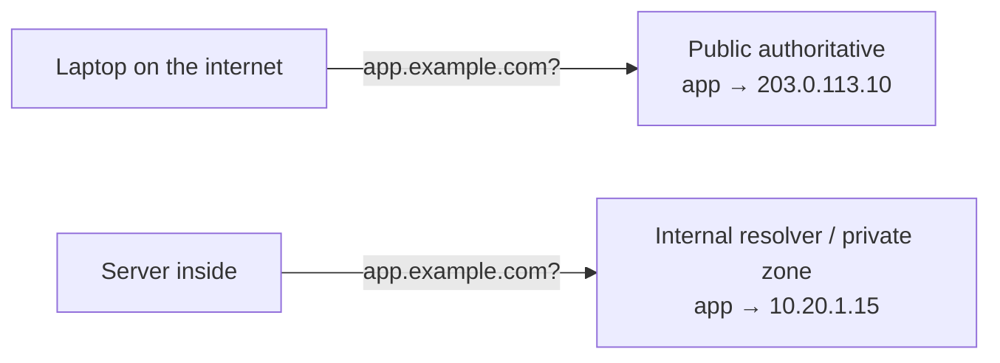
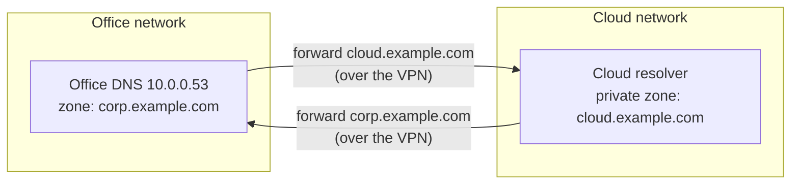
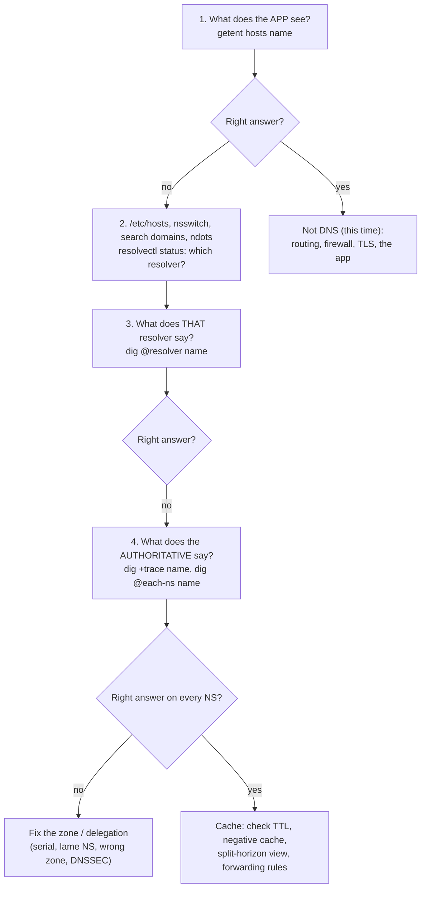

# DNS in production

> [!abstract] In one sentence
> Knowing how a lookup works is the easy part. Running DNS for real means deciding **which answer each client should get** (split-horizon), **how internal and external names coexist** (forwarding), **how much to trust DNS for load balancing and failover**, **how to change records without outages**, and **how to find the problem fast** when "it's always DNS".

The mechanics (resolution, records, caching) are in [[DNS]]. Attacks and DNSSEC in [[DNS security]].

## Naming internal things

**The problem:** internal servers need names (`db1`, `jira`, `k8s-api`), and they must not collide with the internet.

**What people did, and why it broke:**
- Invented TLDs: `company.local`, `server.corp`, `app.lan`. `.local` is reserved for **mDNS** (Apple Bonjour, Avahi), so macOS and Linux send those lookups to multicast instead of DNS, and lookups randomly fail. Made-up TLDs like `.corp` risked becoming real (ICANN kept creating new TLDs)
- Using a real domain the company doesn't own: someone else registers it, and internal traffic leaks to them

**What to do:**
- A **subdomain of a domain I own**: `corp.example.com`, `internal.example.com`. It can never collide, I can get real certificates for it, and it can be delegated cleanly
- Or `.internal`, which ICANN reserved in 2024 for private use (it will never exist publicly), when no owned domain fits
- A structure that tells me something: `db1.prod.eu.corp.example.com`

## Split-horizon DNS: different answers for different clients

**The problem:** `app.example.com` should be the **public IP** of the load balancer for people on the internet, and the **private IP** for machines inside, so internal traffic doesn't go out and back in (and doesn't hit [[NAT and PAT#5. Hairpin NAT (NAT loopback)|hairpin NAT]]).

**The fix:** the DNS infrastructure answers differently depending on **who asks**: BIND **views** keyed on the client IP, or two separate zones with the same name (a public one on the internet, a private one only reachable inside, like private hosted zones in the cloud).



**What goes wrong:**
- **Records drift**: someone adds `new.example.com` to the public zone only. Inside, the private zone is authoritative for `example.com`, has no such name, and answers **NXDOMAIN**. The internal zone doesn't "fall back" to the public one. Every public name that should work inside must exist in both
- **Which answer did I get?** Debugging needs to know which resolver a machine asked. A laptop on VPN and off VPN sees different worlds
- Caches in between (a forwarder serving both populations) can mix answers

## Hybrid DNS: joining internal DNS worlds

**The problem:** the office resolves `corp.example.com` on its own DNS servers. The cloud network has its own resolver that knows cloud-internal names. The VPN connects the networks (see [[VPN]]), but a server in the cloud still can't resolve `db.corp.example.com`, and an office machine can't resolve cloud private names. **Routing works, names don't.**

**The fix: conditional forwarding** in both directions:
- Cloud resolver: "queries for `corp.example.com` → forward to `10.0.0.53` (office DNS)"
- Office DNS: "queries for `cloud.example.com` → forward to the cloud resolver's inbound address"
- Everything else → the normal internet path



Details that trip people up:
- The forwarding target must be **reachable**: routes through the tunnel, firewall rules for UDP **and TCP** 53, and the security rules on the resolver's side
- Some cloud resolvers can't be reached from outside their network directly: they need an **inbound endpoint** (an IP inside the network that accepts forwarded queries). In AWS that's Route 53 Resolver inbound/outbound endpoints (see [[Route 53]], [[Connecting AWS to a private network]])
- For **remote-access VPN** users, the same idea is **split DNS** on the client: only `corp.example.com` goes to the company resolver (see [[VPN basics#DNS: the part everyone forgets]])

## DNS for load balancing and failover

DNS can return different IPs to spread load or route around failures. It's everywhere (CDNs and global services use it), and it has hard limits I need to know.

| Technique | How | Good for |
|---|---|---|
| **Round robin** | Several A records, order rotated | Spreading clients across a few servers, cheaply |
| **Weighted** | Answers returned in proportions (90/10) | Gradual migrations, canary releases |
| **Health-checked failover** | The DNS provider checks endpoints and removes dead ones | Active/passive between sites or regions |
| **GeoDNS / latency-based** | Answer depends on the resolver's location | Sending users to the nearest region |

**The limits:**
- **DNS doesn't see load or connections.** Round robin spreads *lookups*, and one big corporate resolver can send thousands of users to the same answer
- **Failover is bounded by TTL and by clients.** With TTL 60 s, most clients switch within a minute or two. Some cache longer, and long-lived connections never re-resolve at all
- **Clients pick among multiple answers their own way** (address sorting rules, IPv6 first, "first answer"), and many don't retry the next IP if the first is dead
- **GeoDNS sees the resolver's location, not the user's**: a user in Tunis using a public resolver whose nearest instance is in Paris gets the Paris answer. EDNS Client Subnet (ECS) passes part of the client's IP to fix this, at a privacy cost

**Rule of thumb:** DNS is good for **coarse, global** steering (which region, which site). Real load balancing (per connection, health-aware, instant) belongs to a load balancer behind that DNS name (see *[[Load balancing]]*). Anycast (one IP announced from many places via [[AS and BGP|BGP]]) is the other way to route users to the nearest site without DNS tricks.

## Changing records without an outage

**The problem:** moving `app.example.com` from `203.0.113.10` to `198.51.100.20`. The TTL is 86 400 (one day). If I just change it, some users hit the old server for a whole day.

**The procedure:**
1. **At least one old TTL before the change** (here: 24 h+ before), lower the TTL to 60–300 s. Caches that fetch the record after this get the short TTL
2. Wait until the **old** TTL has expired everywhere. Now every cache holds the record for at most 5 minutes
3. **Change** the record. Verify on every authoritative server: `dig @ns1… app.example.com`, `dig @ns2…`
4. **Keep the old server running** for a while: some clients (long-lived connections, apps with their own cache) will still come
5. Once stable, **raise the TTL** back

Same idea for **changing DNS providers**: copy all records to the new provider first, lower the NS TTL where possible, change the NS at the registrar, keep the old provider serving the same records until the parent's NS TTL (often 48 h) has passed. With DNSSEC, the keys have to be handled in the handover too, or the domain goes SERVFAIL (see [[DNS security]]).

### Choosing TTLs

| Record | Typical TTL | Why |
|---|---|---|
| Stable infrastructure (NS, MX, rarely changed A) | 1 h – 1 day | Fewer queries, resilience if the authoritative servers are down (caches keep working) |
| Things that may fail over | 30 – 300 s | Switch fast |
| Just before a planned change | 60 – 300 s | Then raise it back |
| Negative caching (SOA minimum) | 5 – 15 min | Short enough that a newly created name appears quickly |

Trade-off: short TTLs = faster changes, but more queries and **total dependence on the authoritative servers** being up. Long TTLs = caches ride out a DNS provider outage.

## Running DNS servers

| Job | Software | Notes |
|---|---|---|
| Authoritative | BIND, NSD, Knot, PowerDNS | Or a managed provider. **At least two servers on separate networks**, ideally separate providers for critical domains |
| Recursive resolver | Unbound, BIND, PowerDNS Recursor | Only for my networks, never open to the internet (see [[DNS security#6. DNS as a DDoS weapon: amplification]]) |
| Caching forwarder | dnsmasq, systemd-resolved, CoreDNS | Local caches on hosts and nodes, home routers |
| Directory-integrated | Active Directory DNS | Windows domains depend on it (SRV records to find domain controllers) |
| Kubernetes | CoreDNS | `service.namespace.svc.cluster.local` names, the `ndots:5` trap (see [[DNS basics#3. Every lookup is slow in containers]]) |

Design rules:
- **Separate authoritative and recursive** roles: a server answering the internet for my zones shouldn't also recurse for anyone
- **Redundancy everywhere**: two or more resolvers configured on every host (and test that the second one actually works), two or more authoritative servers
- Big DNS provider outages have taken down large parts of the web at once (the 2016 Dyn attack): critical domains often use **two providers** serving the same zone
- **Monitor** latency, SERVFAIL rate, NXDOMAIN spikes (a typo in a config, or malware), and certificate/DNSSEC signature expiry
- **DNS as code**: zones in version control, changes reviewed and applied by a tool (OctoDNS, Terraform, dnscontrol), not clicked in a console. Prevents drift, dangling records and "who changed this?"

## Troubleshooting: a method for "it's always DNS"

Go from the app outwards, and compare at every step:



Commands along the way:

```bash
getent hosts app.example.com            # what apps get
resolvectl status                       # which DNS server per interface
resolvectl query app.example.com        # through systemd-resolved, shows the source
dig @10.0.0.53 app.example.com          # ask a specific resolver
dig +trace app.example.com              # walk root → TLD → authoritative myself
for ns in $(dig +short NS example.com); do dig +short @$ns app.example.com; done   # all NS agree?
dig +dnssec app.example.com             # signatures; "ad" flag = validated
resolvectl flush-caches                 # clear the local cache
```

Symptoms and first suspects:

| Symptom | Suspect first |
|---|---|
| Works with the IP, not the name | DNS, obviously. Then `/etc/hosts`, then which resolver |
| Works on one machine, not another | Different resolver, VPN DNS, `/etc/hosts`, search domains |
| Works outside, not inside (or the reverse) | Split-horizon: the name exists in only one view |
| Intermittent failures | One of several name servers or resolvers is broken |
| Everything slow but eventually works | Timeouts on a dead first resolver, `ndots` + search domains, IPv6 (AAAA) lookups timing out |
| SERVFAIL for one domain only | DNSSEC problem or broken delegation for that domain |
| New record doesn't appear | Negative caching, wrong zone, secondaries not updated (serial) |

## Easy to get wrong
- Inventing internal TLDs (`.local`, `.corp`) instead of using a subdomain of an owned domain or `.internal`
- Split-horizon zones where a name exists publicly but not internally: NXDOMAIN inside, no fallback
- Routing across a VPN but forgetting conditional forwarding: "the network works but names don't"
- Expecting DNS failover to be instant, or DNS round robin to balance load evenly
- Changing a record without lowering the TTL first
- Switching off the old server the moment DNS changes
- One authoritative provider for a critical domain, or two resolvers in `resolv.conf` where the second has never been tested

## Related
- Foundation:: [[DNS]], [[DNS security]]
- Where it connects:: [[VPN]] (split DNS), [[Connecting AWS to a private network]] (hybrid DNS), [[NAT and PAT]] (hairpin NAT vs split-horizon)
- Next:: *[[Load balancing]]*, [[AS and BGP]] (anycast), [[High availability networking]] (why DNS alone doesn't make a service available)
- Applied:: [[Route 53]]

## Flashcards
#flashcards

Why not use .local for internal names? :: It's reserved for mDNS, so lookups go to multicast instead of DNS
Best choice for internal names? :: A subdomain of an owned domain (corp.example.com), or .internal
What is split-horizon DNS? :: Different answers for the same name depending on who asks (internal vs external)
Classic split-horizon failure? :: A name added only to the public zone → NXDOMAIN inside, the private zone doesn't fall back
What is conditional forwarding? :: Sending queries for a specific domain to a specific DNS server (e.g. corp.example.com → office DNS)
VPN works but internal names don't resolve. Why? :: Routing is up but DNS forwarding (or split DNS on clients) isn't configured
Why does DNS round robin not balance load well? :: It spreads lookups, not connections, and big resolvers cache one answer for many users
What bounds DNS failover speed? :: The TTL, and clients that cache longer or never re-resolve
What does GeoDNS actually locate? :: The resolver, not the user (unless EDNS Client Subnet)
Procedure to change a record safely? :: Lower TTL one old-TTL ahead, wait, change, verify every NS, keep the old server up, raise TTL
Trade-off of short TTLs? :: Fast changes, but more queries and total dependence on authoritative servers being up
Why separate authoritative and recursive servers? :: An internet-facing authoritative server shouldn't resolve for anyone (open resolver risks)
Why use two DNS providers for critical domains? :: A provider outage or DDoS (Dyn 2016) otherwise takes the domain down
Troubleshooting order for DNS? :: App (getent) → local config (hosts, search, resolver) → the resolver (dig @) → authoritative (+trace, every NS) → caches
Everything is slow but works eventually. DNS suspects? :: A dead first resolver timing out, ndots/search domains, AAAA lookups timing out
