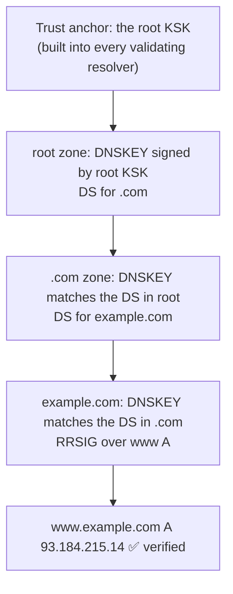

# DNS security

> [!abstract] In one sentence
> DNS was designed in 1983 with **no security at all**: answers aren't authenticated, queries aren't encrypted, and anyone who controls a name controls where traffic goes. Each fix covers one gap: **DNSSEC** proves answers are genuine (but doesn't hide them), **DoT/DoH** hide queries from the network (but don't prove answers), and the rest is operational hygiene against takeovers, tunneling and abuse.

## The misconception I had

**Wrong mental model:** "DNSSEC encrypts DNS" and "HTTPS protects me even if DNS is lied to, so DNS security doesn't matter much."

**What's actually true:**
- **DNSSEC** = *authenticity* (signed answers). Everything is still readable. **DoH/DoT** = *privacy* (encrypted transport to the resolver). The resolver can still lie. They solve **different** problems and are used together
- HTTPS does limit the damage of a fake DNS answer (the attacker can't show a valid certificate for my bank), but:
  - Anything **without TLS** (internal HTTP, many IoT and legacy protocols, email between servers) is fully redirected
  - Whoever controls DNS can **get a valid certificate** for the domain, because certificate authorities validate domain ownership through DNS (see [[Certificates and PKI]])
  - DNS reveals **every site I visit**, even over HTTPS

## The threats, and what fixes each one

| Threat | What happens | Fix |
|---|---|---|
| **Spoofing / cache poisoning** | Attacker injects a fake answer into a resolver's cache | Randomized IDs + ports, **DNSSEC** |
| **On-path tampering** | Someone on the network (Wi-Fi, ISP) rewrites answers | **DNSSEC** (detects), **DoT/DoH** (prevents on that hop) |
| **Surveillance** | Every query visible to the network and the resolver | **DoT/DoH/DoQ**, choosing a trusted resolver |
| **Domain hijacking** | Attacker changes the domain's NS at the registrar | Registrar MFA, **registry lock** |
| **Subdomain takeover** | A dangling CNAME points to a resource anyone can now claim | Inventory and cleanup of records |
| **DNS tunneling / exfiltration** | Data smuggled out inside DNS queries | Egress control, monitoring query patterns |
| **Amplification DDoS** | Small spoofed queries → huge answers sent to a victim | No open resolvers, response rate limiting, BCP 38 |
| **DNS rebinding** | A public name suddenly resolves to an internal IP | Resolvers that refuse private IPs in public answers, auth on internal services |
| **Malware callbacks** | Infected machines resolve command-and-control domains | Protective DNS / DNS firewall (RPZ) |

## 1. Spoofing and cache poisoning: the problem, and why randomization wasn't enough

A resolver sends a query over UDP and accepts the first answer that matches the **question**, the **16-bit query ID**, and the **port**. An attacker who can guess those and answer faster than the real server gets their fake answer cached, for everyone using that resolver, for the whole TTL.

**The Kaminsky attack (2008)** made it practical:
1. Normally a poisoning attempt fails if the real answer is already cached, and the attacker must wait for the TTL to retry
2. Kaminsky asked the resolver about **random non-existent names**: `a1.bank.com`, `a2.bank.com`… each one forces a fresh query, so infinite tries
3. The fake answers didn't just answer `aN.bank.com`: they included a fake **referral**, "`bank.com`'s name server is at *my* IP". Poisoning the delegation hijacks the **whole domain**
4. With only 65 536 possible IDs, it took seconds

**The emergency fix: source port randomization.** Resolvers pick a random source port too, so the attacker must guess ~32 bits instead of 16. Later additions: random upper/lower case in the query name (0x20 encoding: `wWw.bAnK.cOm`, which the answer must echo exactly). These make guessing much harder, but it's still guessing: a proper fix needs signatures.

## 2. DNSSEC: signed answers

DNSSEC adds signatures so a resolver can **verify** an answer came from the zone owner and wasn't modified.

| Record | What it holds |
|---|---|
| **RRSIG** | The signature of a set of records (all the A records of a name, for example) |
| **DNSKEY** | The zone's public keys: a **ZSK** (zone signing key) signs the records, a **KSK** (key signing key) signs the DNSKEY set |
| **DS** | Published in the **parent** zone: a hash of the child's KSK. This is the link in the chain |
| **NSEC / NSEC3** | Signed proof that a name does **not** exist ("nothing between `api` and `www`"), so NXDOMAIN can't be forged |

### The chain of trust



A validating resolver checks each step: the answer's RRSIG with the zone's DNSKEY, that DNSKEY against the DS in the parent, and so on up to the root key it already trusts. If any step fails, it returns **SERVFAIL** instead of the answer.

### What DNSSEC doesn't do, and why it's not everywhere
- **No privacy**: answers are signed, not encrypted
- **Last mile**: most validation happens at the **recursive resolver**. The link between my laptop and the resolver isn't protected unless I validate locally or use DoT/DoH to a validating resolver
- **Fragile operations**: signatures **expire**. Forget to re-sign, or break a key rollover (DS in the parent not matching the new KSK), and the whole domain returns SERVFAIL for every validating resolver. This has taken down entire TLDs and big companies
- **Bigger answers** → more truncation and TCP fallback (see [[DNS#Advanced problems]])
- **NSEC zone walking**: NSEC's "nothing between A and B" lets anyone list every name in the zone. NSEC3 hashes the names to make that harder
- Adoption is partial: many big domains still don't sign

## 3. Encrypted DNS: DoT, DoH, DoQ

Plain DNS is readable by everyone between me and the resolver: the café Wi-Fi, the ISP.

| | **DoT** (DNS over TLS) | **DoH** (DNS over HTTPS) | **DoQ** (DNS over QUIC) |
|---|---|---|---|
| Transport | TLS on **TCP 853** | HTTPS on **TCP 443** (HTTP/2 or 3) | QUIC on **UDP 853** |
| Looks like | Obviously DNS (dedicated port) | Normal web traffic | Its own port |
| Easy to block? | Yes, one port | Hard, it's mixed with HTTPS | Yes |
| Typical use | OS level (Android "Private DNS", systemd-resolved) | Browsers, apps | Newer resolvers |

**The tension for a systems engineer:** companies rely on their internal resolver for **split-horizon names** and **security filtering** (blocking malware domains). A browser doing DoH straight to a public resolver **bypasses both**: internal names stop resolving and filtering stops working. Enterprises handle it with browser policies (disable or point DoH at the company resolver), and Firefox checks a **canary domain** (`use-application-dns.net`): if the network's resolver says it doesn't exist, Firefox doesn't turn DoH on by default.

Encrypted DNS protects the path to the resolver, not from the resolver: it sees everything, so the choice of resolver is a trust decision.

## 4. Domain hijacking and subdomain takeover

These attack the **records**, not the protocol, and they're some of the most common real-world DNS incidents.

**Domain hijacking:** someone gets into the account at the **registrar** (where the domain was bought) and changes the NS records to their own servers. They now control every name, can get certificates, and receive the email. Defenses: MFA on the registrar account, **registrar lock** (no transfers), **registry lock** (changes need manual verification by the TLD registry), monitoring of NS/DS changes.

**Subdomain takeover**, the one that happens by accident:
1. `shop.example.com CNAME example-shop.cloudprovider.net` points to a cloud resource (a storage bucket website, a PaaS app)
2. The team deletes the resource, but **forgets the DNS record**: it's now **dangling**
3. An attacker creates a resource with the **same name** at the same provider
4. `shop.example.com` now serves the attacker's content, under my domain. They can steal cookies scoped to `.example.com`, phish with a real URL, and sometimes get a certificate

Defenses: delete DNS records **before** (or together with) the resources they point to, manage DNS as code alongside the infrastructure, and scan regularly for records pointing at things that no longer exist.

## 5. DNS tunneling and exfiltration

DNS is allowed out of almost every network, even locked-down ones, because nothing works without it. An attacker (or malware) who owns `evil.com` can encode data **inside query names**:

```
aGVsbG8gd29ybGQ.x7.evil.com   ← base64 data as a subdomain
```

The company resolver dutifully forwards it to `evil.com`'s authoritative server, which decodes it, and answers with commands in TXT records. Tools like iodine and dnscat2 run whole IP tunnels over this.

Defenses:
- Machines should only talk to the **internal resolvers**: block outbound 53/853 to anywhere else (and watch for DoH)
- **Monitor** for long, high-entropy subdomains, lots of unique names under one domain, lots of TXT queries
- Protective DNS that blocks newly registered or suspicious domains

## 6. DNS as a DDoS weapon: amplification

A 60-byte query can produce a response of several kilobytes (big TXT records, DNSSEC, ANY queries). The attacker sends queries with the **victim's IP as the source** (spoofed, it's UDP) to thousands of **open resolvers**, and they all send big answers to the victim: tens or hundreds of times amplification.

Defenses: never run an **open resolver** (recursion only for my own networks), **response rate limiting** on authoritative servers, refuse or minimize ANY queries, and anti-spoofing at the network edge (BCP 38, see [[Network layers#L3 and L4: the firewall layers]]). On the receiving end: DDoS protection upstream (the victim's link is already full).

## 7. DNS rebinding

1. I visit `attacker.com`, which resolves to the attacker's server with a **TTL of 0**. It serves JavaScript
2. The script makes a request to `attacker.com` again. This time DNS answers `192.168.1.1` (my router) or `10.0.0.50` (an internal service)
3. The browser considers it the **same origin** (same name), so the script can talk to my internal service and read the answers

Defenses: resolvers that **drop private IPs in answers for public domains**, internal services that check the `Host` header and **require authentication** even on the LAN (being "inside" isn't proof of anything, see [[mTLS]]), and browsers' newer private network access protections.

## 8. DNS as a security control

DNS also works *for* defense, because almost every connection starts with a lookup:
- **Protective DNS / DNS firewall** (RPZ, Response Policy Zones, in BIND/Unbound, or a service): answer NXDOMAIN or a sinkhole IP for known malicious or unwanted domains
- **Query logging**: which machine resolved what, when. Often the fastest way to find infected hosts during an incident
- **CAA records**: limit which CAs may issue certificates for my domains ([[Certificates and PKI]])
- **Email authentication** records (SPF, DKIM, DMARC) in TXT: stop others from sending mail as my domain

## Easy to get wrong
- Thinking DNSSEC encrypts, or that DoH authenticates. Different problems
- Enabling DNSSEC and then letting signatures expire or botching a key rollover: the domain goes dark for validating resolvers
- Leaving DNS records pointing to deleted cloud resources (subdomain takeover)
- Running a resolver that answers anyone on the internet
- Allowing any machine to query any external DNS server (tunneling, bypassing filters)
- Letting browsers do DoH to a public resolver on a network that relies on internal DNS
- Protecting the DNS servers but not the **registrar account**, where the whole domain can be taken

## Related
- Foundation:: [[DNS]]
- Operations:: [[DNS in production]]
- Crypto and trust:: [[Encryption basics]], [[Certificates and PKI]], [[TLS]]
- Network layer defenses:: [[Network layers]], [[ACL]]

## Flashcards
#flashcards

DNSSEC vs DoH in one line? :: DNSSEC proves answers are authentic (signed, readable). DoH/DoT encrypts queries to the resolver (private, not signed)
What does a resolver match to accept an answer? :: The question, the 16-bit query ID and the port
What made the Kaminsky attack work? :: Queries for random non-existent subdomains gave unlimited tries, and fake referrals hijacked the whole domain
Emergency fix for Kaminsky? :: Source port randomization (plus 0x20 case randomization): more to guess, but still not a real fix
RRSIG, DNSKEY, DS? :: Signature over a record set. The zone's public keys (ZSK, KSK). Hash of the child's KSK published in the parent
What is the DNSSEC chain of trust anchored on? :: The root zone's KSK, built into validating resolvers
What does a validating resolver return when DNSSEC validation fails? :: SERVFAIL
Main operational risk of DNSSEC? :: Expired signatures or a broken key rollover make the whole domain unresolvable
What is NSEC zone walking? :: Using NSEC's "nothing between A and B" proofs to list every name in a zone
DoT vs DoH ports? :: DoT: TCP 853. DoH: TCP 443 (looks like web traffic)
Why do enterprises worry about browser DoH? :: It bypasses the internal resolver: split-horizon names and DNS filtering stop working
What is subdomain takeover? :: A dangling CNAME to a deleted cloud resource that an attacker re-creates under the same name
Best defense against domain hijacking? :: MFA and registry/registrar lock at the registrar, monitoring NS changes
How does DNS tunneling work? :: Data encoded in query names to an attacker's domain, answers carry commands (TXT)
Signs of DNS tunneling? :: Long, high-entropy subdomains, many unique names under one domain, many TXT queries
How does DNS amplification work? :: Spoofed small queries to open resolvers, big answers sent to the victim
What is DNS rebinding? :: A public name re-resolves to an internal IP, so a web page can reach internal services as the "same origin"
What is RPZ / protective DNS? :: A resolver policy that blocks or sinkholes malicious domains
