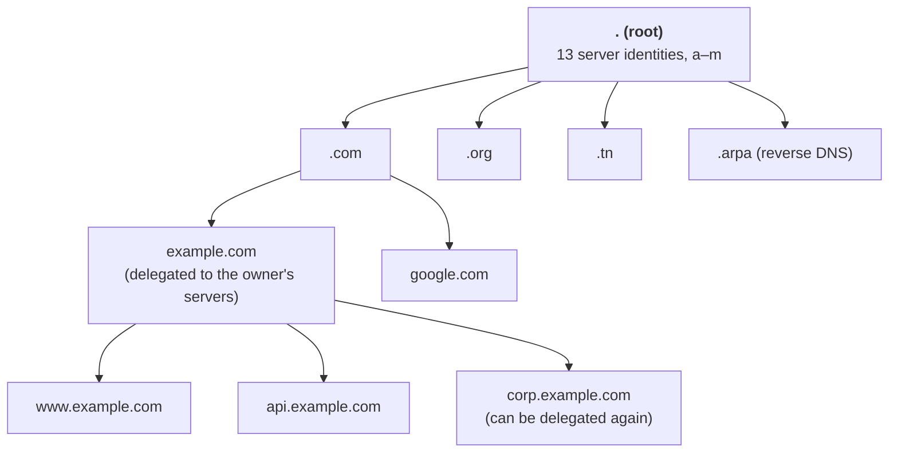
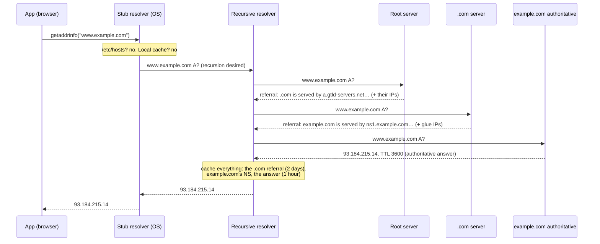
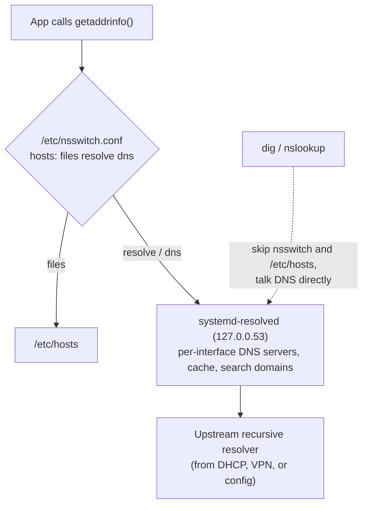

# DNS

> [!abstract] In one sentence
> DNS (Domain Name System) turns names like `www.example.com` into what machines need (IP addresses, mail servers, other names). It's a **distributed database** split into a tree: nobody holds all of it, each part is **delegated** to whoever owns it, and answers are **cached** everywhere for as long as their **TTL** says. Almost every network action starts with a DNS lookup, which is why "it's always DNS" is a running joke among sysadmins.

## The misconceptions I had

| I thought | Actually |
|---|---|
| "The DNS server" is one kind of thing | There are **different roles**: the **stub resolver** on my machine, a **recursive resolver** that does the work, and **authoritative servers** that own the answers. Mixing them up makes every problem confusing |
| DNS changes "propagate" across the internet | Nothing is pushed anywhere. Old answers sit in **caches** until their TTL expires. "Propagation time" = the old TTL |
| If `dig` works, my app will work | `dig` talks to a DNS server directly. Apps go through the OS resolver, which reads `/etc/hosts` first, applies search domains, and may use a different server |
| DNS is only UDP | UDP 53 first, **TCP 53** when the answer is too big or for zone transfers. Blocking TCP 53 breaks things |
| A CNAME is a redirect | It's an **alias inside DNS**: "look up this other name instead". The browser never knows, the URL doesn't change (not like an HTTP redirect) |

## Building it up: why DNS looks like this

### Problem 1: nobody remembers IPs, and IPs change

The first fix was a file: every machine had a **hosts file** mapping names to IPs. It still exists (`/etc/hosts` on Linux, `C:\Windows\System32\drivers\etc\hosts`), and it's still checked **before** DNS.

### Problem 2: keeping every copy in sync

On the early ARPANET, one central file (`HOSTS.TXT`) was maintained by one organization and downloaded by everyone. With thousands of hosts it broke: the file was always out of date, name collisions needed a central authority, and downloads became huge.

### Problem 3: no single owner can manage millions of names

**DNS** (1983) fixed it with three ideas:
1. **A hierarchy**: names are a tree, read right to left: `www` . `example` . `com` . (root)
2. **Delegation**: each level hands responsibility for the level below to someone else. The root says "ask these servers about `.com`", `.com` says "ask these servers about `example.com`", and `example.com`'s owner manages its own names without asking anyone
3. **Caching**: answers are reused until they expire, so the root and TLD servers aren't asked about every lookup



Vocabulary:
- **Label**: one part (`www`), max 63 characters. Full name max 253
- **FQDN** (fully qualified domain name): the complete name, technically ending with a dot for the root: `www.example.com.`
- **Zone**: the part of the tree one set of servers is authoritative for. `example.com` is a zone. If `corp.example.com` is delegated to other servers, it's a **separate zone**, even though it's in the same domain

## Who does what

| Role | Job | Examples |
|---|---|---|
| **Stub resolver** | The small client inside the OS. Asks one question, expects a final answer | glibc's resolver, systemd-resolved, Windows DNS Client |
| **Recursive resolver** | Does the legwork: asks root, then TLD, then authoritative, and **caches** everything | The ISP's resolver, `1.1.1.1`, `8.8.8.8`, Unbound, a company's internal DNS, the cloud's built-in resolver |
| **Authoritative server** | **Owns** the answers for a zone. Never goes looking elsewhere | BIND, NSD, PowerDNS, Knot, managed services (Route 53, Cloudflare DNS) |
| **Forwarder** | A resolver that doesn't recurse itself: it passes queries to another resolver, usually caching | A home router, dnsmasq, systemd-resolved, a conditional forwarder for internal domains |

## A lookup, start to finish

My laptop wants `www.example.com`, and the resolver's cache is empty:



- The stub asks **one** question and gets **one** final answer (a *recursive* query)
- The recursive resolver gets **referrals** ("I don't know, ask them") and follows them (*iterative* queries)
- The next user asking for `www.example.com` in the next hour gets the answer straight from cache. Someone asking for `api.example.com` skips the root and `.com`: the resolver already knows who serves `example.com`
- The resolver knows where the root is from a built-in **root hints** file. The 13 root "servers" are really 13 **anycast** addresses served by well over a thousand machines worldwide

## Caching and TTL

Every record comes with a **TTL** (time to live, in seconds). Every cache on the path (the app, the OS, the resolver) may keep it that long.

- **Changing a record** doesn't reach anyone whose cache still holds the old one. With TTL 86400, some users see the old IP for **up to a day**
- **Negative caching**: "this name doesn't exist" (**NXDOMAIN**) is also cached, for a time taken from the zone's **SOA** record. Classic trap: I query `new.example.com` *before* creating it, get NXDOMAIN, create the record, and my resolver keeps saying it doesn't exist for the next 15 minutes to an hour
- Some software caches **on its own** and ignores the TTL (some runtimes like the JVM, connection pools that resolved once at startup). The DNS changed, the app keeps the old IP until restarted

## Record types

| Type | Maps a name to | Example / use |
|---|---|---|
| **A** | IPv4 address | `www → 93.184.215.14` |
| **AAAA** | IPv6 address | `www → 2606:2800:21f:cb07::1` |
| **CNAME** | Another name (alias) | `www → example-lb.provider.net` |
| **MX** | Mail servers, with a priority (lower first) | `example.com → 10 mail1.example.com` |
| **TXT** | Free text | Domain ownership proofs, SPF/DKIM/DMARC for email, ACME challenges |
| **NS** | The authoritative servers for a zone | Delegation: `example.com → ns1.example.com` |
| **SOA** | Zone metadata (one per zone) | Primary server, admin email, **serial**, refresh/retry/expire timers, negative-caching TTL |
| **PTR** | IP → name (reverse DNS) | `14.215.184.93.in-addr.arpa → www.example.com` |
| **SRV** | Service location: host + port + priority + weight | `_ldap._tcp.corp.example.com → dc1:389` (Active Directory, SIP, Kubernetes) |
| **CAA** | Which certificate authorities may issue for this domain | `example.com CAA 0 issue "letsencrypt.org"` (see [[Certificates and PKI]]) |
| **HTTPS / SVCB** | Connection hints: supported protocols (HTTP/3), alternative endpoints, ECH keys | Newer, used by browsers |
| DS, DNSKEY, RRSIG, NSEC | DNSSEC signatures and keys | See [[DNS security]] |

### The CNAME rules that bite
- A name with a CNAME can't have **any other record** (the CNAME says "this name is really that other name", so there's nothing else to say about it)
- So **no CNAME at the zone apex** (`example.com` itself), because the apex always has SOA and NS records. That's why providers invented **ALIAS / ANAME / CNAME flattening**: the provider resolves the target itself and answers with A records
- MX and NS must point to names with A/AAAA records, not to CNAMEs
- Chains of CNAMEs work but each hop is another lookup

## Zones, delegation and glue

The parent zone delegates a child by publishing **NS records** for it:

```
; in the .com zone
example.com.      172800  IN  NS  ns1.example.com.
example.com.      172800  IN  NS  ns2.example.com.
; glue: the IPs of those servers, because they're INSIDE example.com
ns1.example.com.  172800  IN  A   198.51.100.53
ns2.example.com.  172800  IN  A   203.0.113.53
```

**Why glue exists:** to find `example.com`'s servers I need `ns1.example.com`'s IP, which is in `example.com`, which I can't query without its servers. The parent breaks the loop by including the IPs directly. Only needed when the name servers are inside the zone they serve.

**Redundancy:** a zone should have at least two authoritative servers on **different networks**. Usually one **primary** where records are edited, and **secondaries** that copy the zone with **zone transfers** (AXFR full, IXFR incremental), triggered by a NOTIFY and checked with the SOA **serial** (forget to increase it and the secondaries never update).

**Lame delegation:** the parent lists a name server that doesn't actually serve the zone (old provider, typo). Resolvers that pick it get errors or timeouts: intermittent failures that depend on which server they happened to ask.

## Reverse DNS

"Which name has IP `93.184.215.14`?" The IP is reversed and put under `in-addr.arpa`: `14.215.184.93.in-addr.arpa PTR www.example.com`. (IPv6 uses `ip6.arpa`, one label per hex digit.)

- The reverse zone belongs to **whoever owns the IP block** (the ISP, the cloud provider), not the domain owner. To set a PTR on a server's public IP I ask them (or use their console)
- Mail servers check that the sending IP has a PTR matching its name: no reverse DNS = mail marked as spam
- Logs and `traceroute` show names thanks to PTR records

## On the wire

- Port **53**, **UDP** first. The query and answer share a **16-bit ID** to match them
- Flags worth knowing: **RD** (recursion desired, from the stub), **RA** (recursion available), **AA** (authoritative answer), **TC** (truncated: "too big, retry over TCP")
- Response codes: **NOERROR** (fine, maybe with an empty answer = the name exists but not with that type), **NXDOMAIN** (the name doesn't exist), **SERVFAIL** (the resolver couldn't get an answer: broken delegation, DNSSEC failure, timeout), **REFUSED** (not allowed to ask this server)
- **TCP 53**: when the answer has the TC flag, for zone transfers, and for DNS over TLS on 853 (see [[DNS security]])
- **EDNS(0)** lets UDP answers be bigger than the original 512 bytes. The recommended size is **1232 bytes** to avoid IP fragmentation, which many firewalls drop

## How my Linux machine actually resolves a name



| File / tool | Role |
|---|---|
| `/etc/nsswitch.conf` | **Order** of sources: `files` (/etc/hosts), `dns`, `resolve` (systemd-resolved), `myhostname`, `mdns`… |
| `/etc/hosts` | Static overrides. Wins over DNS, which is great for tests and terrible when forgotten |
| `/etc/resolv.conf` | `nameserver` (which resolver), `search` (domains appended to short names), `options ndots:N`. Often generated (systemd-resolved, NetworkManager, DHCP, VPN clients): editing it by hand gets overwritten |
| `resolvectl status` | Which DNS server and search domains each interface uses (VPNs add their own, see [[VPN]]) |
| `getent hosts name` | Resolves **the way apps do** (through nsswitch). The right test for "why can't my app resolve this" |
| `dig`, `nslookup`, `host` | Query a DNS server directly. The right test for "what does DNS say" |

**Search domains:** with `search corp.example.com`, looking up `db` tries `db.corp.example.com`. The `ndots` option decides when: if the name has **fewer dots than ndots**, the search domains are tried **first**. A trailing dot (`db.corp.example.com.`) means "this is complete, don't append anything".

## Reading `dig`

```bash
dig www.example.com                 # full answer from my configured resolver
dig +short www.example.com          # just the values
dig @1.1.1.1 www.example.com        # ask a specific resolver
dig @ns1.example.com www.example.com  # ask the authoritative server directly (no cache)
dig +trace www.example.com          # do the recursion myself: root → TLD → authoritative
dig -x 93.184.215.14                # reverse lookup (PTR)
dig example.com MX / NS / TXT / SOA / CAA   # other types
```

```
;; ->>HEADER<<- opcode: QUERY, status: NOERROR, id: 4242
;; flags: qr rd ra; QUERY: 1, ANSWER: 1          ← no "aa": came from a cache
;; ANSWER SECTION:
www.example.com.   2917   IN   A   93.184.215.14  ← TTL counting down in the cache
;; SERVER: 127.0.0.53#53                           ← who answered (the local stub here)
```

The TTL tells me a lot: the full value (3600) means fresh from the authoritative server, a lower one means it's been cached for a while.

## Advanced problems

### 1. "I fixed the record but it still resolves to the old IP"
Caches. Check the authoritative server directly (`dig @ns1… +norecurse`): if it's right there, it's just waiting for TTLs. Check the TTL my resolver returns to know how long. Flush what I control (`resolvectl flush-caches`, restart the app if it caches). For planned changes: **lower the TTL first**, wait for the old TTL to expire, then change (see [[DNS in production]]).

### 2. "It says NXDOMAIN but the record exists"
Negative caching from a query made before the record was created, or I created the record in the wrong zone (a delegated subzone wins), or the resolver uses a different view (split-horizon, see [[DNS in production]]).

### 3. Every lookup is slow in containers
Kubernetes pods get `ndots:5` and several search domains. `api.example.com` has 2 dots (< 5), so the resolver first tries `api.example.com.default.svc.cluster.local`, `api.example.com.svc.cluster.local`, `api.example.com.cluster.local`… each an NXDOMAIN round trip, **for A and AAAA**, before the real query. Fixes: trailing dots on external names, a lower `ndots` in the pod's `dnsConfig`, a local DNS cache on each node.

### 4. Big answers fail, small ones work
Responses with many records or DNSSEC signatures exceed the UDP size: either the fragments are dropped by a firewall, or the answer comes back truncated and the **TCP retry is blocked** because someone only allowed UDP 53. Allow TCP 53, keep EDNS size at 1232.

### 5. Intermittent failures, one server in two
One of the zone's name servers is broken or lame. `dig @each-ns` for every NS record: they should all return the same answer and the same SOA serial.

### 6. Works on my laptop, not on the server (or the other way around)
Different resolvers, `/etc/hosts` entries, search domains, or a VPN that installed its own DNS. Compare `getent hosts`, `resolvectl status` and `dig` on both.

## Practice

> [!example]- 1. `dig` returns a TTL of 3600 on one run and 2410 a bit later. Why?
> The answer is cached by the resolver, and the TTL counts down. After 3600 s it's re-fetched from the authoritative server.

> [!example]- 2. `dig api.internal.example.com` works but `curl` says "could not resolve host". What do I check?
> What the app path does: `getent hosts api.internal.example.com`, `/etc/hosts`, `nsswitch.conf`, and whether the app uses a different resolver (container, VPN interface DNS, `resolvectl status`).

> [!example]- 3. Can I put a CNAME on `example.com` pointing to my load balancer's name?
> No: the apex has SOA and NS records, and a CNAME can't coexist with other records. Use the provider's ALIAS/ANAME/flattening, or A records.

> [!example]- 4. Why does `.com` hold A records for `ns1.example.com`?
> Glue: `example.com`'s name servers are inside `example.com`, so without their IPs in the parent, nobody could ever reach them.

> [!example]- 5. `status: SERVFAIL` vs `status: NXDOMAIN`?
> NXDOMAIN: an authoritative server said the name doesn't exist. SERVFAIL: the resolver couldn't get a valid answer at all (broken delegation, unreachable servers, DNSSEC validation failure).

## Easy to get wrong
- Testing with `dig` and concluding apps see the same thing (they go through `/etc/hosts` and nsswitch)
- Changing a record with a long TTL and expecting it to take effect quickly
- Querying a name before creating it, and getting stuck with a cached NXDOMAIN
- A CNAME at the apex, or next to other records at the same name
- Forgetting to bump the SOA serial on a primary, so secondaries keep the old zone
- Allowing only UDP 53 through a firewall
- Hand-editing `/etc/resolv.conf` on a system where something else generates it

## Related
- Security:: [[DNS security]] (spoofing, DNSSEC, DoH, tunneling, takeovers)
- Operations:: [[DNS in production]] (split-horizon, hybrid, load balancing, migrations, running servers, troubleshooting)
- Foundation:: [[Network layers]] (DNS is L7 over UDP/TCP), [[IP addressing and subnetting]]
- Where it bites:: [[VPN]] (split DNS, DNS leaks), [[Certificates and PKI]] (CAA, DNS-01 validation)
- Applied:: [[Route 53]] (AWS's authoritative DNS + VPC resolver)

## Flashcards
#flashcards

Three DNS roles? :: Stub resolver (in the OS), recursive resolver (does the work, caches), authoritative server (owns the answers)
What problem did DNS solve compared to HOSTS.TXT? :: One central file couldn't scale: DNS adds a hierarchy, delegation and caching
Recursive vs iterative query? :: Recursive: "give me the final answer" (stub → resolver). Iterative: follow referrals (resolver → root → TLD → authoritative)
Why "DNS propagation" is a misleading term? :: Nothing is pushed: old answers stay in caches until their TTL expires
What is negative caching? :: NXDOMAIN answers are cached too, for a time set in the zone's SOA
Domain vs zone? :: A zone is the part of the tree one set of servers is authoritative for. Delegated subdomains are separate zones
What are glue records? :: A records for name servers that are inside the zone they serve, published by the parent to break the loop
Why no CNAME at the zone apex? :: A CNAME can't coexist with other records, and the apex always has SOA and NS
What does the SOA serial do? :: Secondaries compare it to know if the zone changed and needs a transfer
What is a PTR record and who controls it? :: IP → name (reverse DNS), controlled by the owner of the IP block
When does DNS use TCP? :: Truncated (too big) answers, zone transfers, DNS over TLS
NXDOMAIN vs SERVFAIL vs NOERROR with no answer? :: Name doesn't exist. Resolver couldn't get a valid answer. Name exists but not with that record type
What is lame delegation? :: The parent lists a name server that doesn't serve the zone → intermittent failures
Why can dig and an app disagree? :: Apps go through nsswitch (/etc/hosts, search domains, systemd-resolved). dig asks a DNS server directly
Command that resolves like an app on Linux? :: getent hosts <name>
What does ndots control? :: Names with fewer dots than ndots get the search domains tried first
Why are DNS lookups slow in Kubernetes pods? :: ndots:5 + search domains → several NXDOMAIN queries (A and AAAA) before the real one
How do you check what the authoritative server says, bypassing caches? :: dig @<authoritative ns> name (or dig +trace)
Recommended EDNS UDP size and why? :: 1232 bytes, to avoid IP fragmentation that firewalls drop
What does a CAA record do? :: Lists which certificate authorities may issue certificates for the domain
