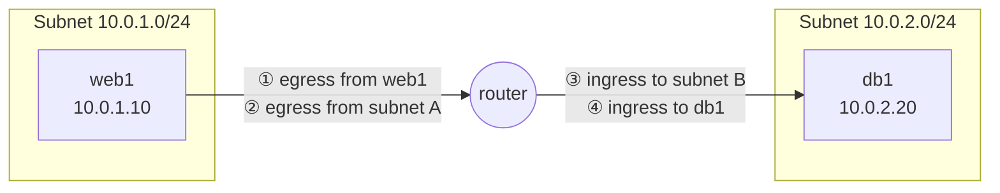

# Ingress and egress

> [!abstract] In one sentence
> **Ingress** is traffic **coming into** something, **egress** is traffic **going out of** it, and the words only mean something once I say **which "something"** (a host, a subnet, a cluster, a whole network) I'm standing in.

## Build-up: one web server, three boundaries

### The plain meaning

I run a web server `web1` at `10.0.1.10`. A customer at `203.0.113.50` opens `https://shop.example.com`, which lands on `web1` port 443.

- The customer's packets arriving at `web1` are **ingress** for `web1`: they come in
- `web1`'s replies going back to the customer are **egress** for `web1`: they go out
- When `web1` itself calls a payment API (Application Programming Interface) at `198.51.100.20`, that request is **egress** too, and the API's answer is **ingress**

"Inbound" and "outbound" mean the same thing. Firewalls, routers and clouds just use whichever pair their authors liked: AWS (Amazon Web Services) shows "inbound rules / outbound rules" in the console, but its API calls are named `AuthorizeSecurityGroupIngress` and `AuthorizeSecurityGroupEgress`.

### Problem 1: "ingress" for whom?

The same packet is ingress at one place and egress at another. Say `web1` (subnet `10.0.1.0/24`) queries the database `db1` at `10.0.2.20` (subnet `10.0.2.0/24`):

One packet, four labels. For the **whole company network** it's neither: it never crossed the network's edge. So before I read or write a rule, I ask: **which boundary is this rule attached to?** A rule on `db1`'s firewall sees this packet as ingress. A rule on the internet edge never sees it at all.

That's where two more words come from:

| Term | Meaning | Example |
|---|---|---|
| **North-south** traffic | Crosses the edge of the network/data center/cluster (in from or out to the outside) | Customer → load balancer → `web1` |
| **East-west** traffic | Stays inside, between internal machines or services | `web1` → `db1`, service → service |

Classic security put all the effort on north-south (one big edge firewall). Most traffic in a modern system is east-west, which is why [[Service mesh|service meshes]] and per-workload rules exist.

### Problem 2: is a reply ingress or egress?

Direction of a **packet** and direction of a **connection** aren't the same thing. The customer *opened* the connection (it's an inbound connection for `web1`), but half its packets (the replies) are egress.

How a filter handles this depends on whether it remembers connections:

- A **stateful** filter (a [[Security groups|security group]], most host firewalls) tracks the connection. I write one **ingress** rule "allow TCP (Transmission Control Protocol) 443 from anywhere", and the replies are let out automatically, whatever the egress rules say
- A **stateless** filter (a classic [[ACL]], an AWS Network ACL) judges every packet alone. Allowing ingress on 443 isn't enough: I also need an **egress** rule for the replies, which go **to the client's ephemeral port** (a random high port like 49152–65535, or 32768–60999 on Linux), not to port 443

> [!warning] The rule direction follows who *starts* the connection
> On stateful filters, "ingress rule" really means "connections that **start** from outside". If `web1` starts a connection to the payment API, I need an **egress** rule, and the API's answers come back in without any ingress rule. See [[Outbound-initiated connections]] for why that answer isn't an open door.

### Problem 3: why bother filtering egress?

Most setups start with "deny ingress, allow all egress". That's fine for a laptop, weak for a server:

- **Malware and attackers phone home.** A compromised `web1` with open egress can download tools and talk to its command server. Restricting egress to "only the payment API, the package mirror and DNS (Domain Name System)" breaks most of that
- **Data exfiltration.** Stolen data leaves as egress. No egress path, no easy leak (watch out for DNS tunneling, see [[DNS security]])
- **Agents that dial out** ([[Outbound-initiated connections]]) mean egress is also a way *in* for control: an allowed outbound connection can carry commands back

The usual tool is an egress proxy or egress gateway: all outbound traffic is forced through one place that allows only known destinations (see [[Proxies]]).

### Problem 4: egress costs money

Cloud providers usually charge **nothing for ingress** (data coming into the cloud) and **charge for egress** (data going out to the internet, and often between regions or zones). Moving 10 TB out of a cloud can cost far more than storing it there. "Egress fees" in a cloud bill always means this, and it's a real factor when choosing where to put a CDN (Content Delivery Network), a backup copy or a chatty service.

## Same words, other things

The words also became names of products and objects, which are **not** just "traffic in" / "traffic out":

| Name | What it actually is |
|---|---|
| [[Kubernetes Ingress]] (the object) | A routing rule for HTTP (Hypertext Transfer Protocol) traffic entering a Kubernetes cluster, carried out by an ingress controller (a [[Reverse proxy]]). Named after ingress traffic, but it's a thing I create, not a direction |
| `ingress:` / `egress:` in a [[Kubernetes NetworkPolicy]] | The plain meaning, seen from the **selected pods**: who may reach them, and whom they may reach |
| Ingress / egress gateway (service mesh) | A proxy at the edge of the mesh that all north-south traffic in (or out) goes through |
| Egress-only internet gateway (AWS) | An IPv6 (Internet Protocol version 6) gateway that lets instances start connections out, never in from outside |

## In AWS

- [[Security groups]]: stateful. Inbound (ingress) and outbound (egress) rule lists. A new group allows **all egress** by default and no ingress
- Network ACLs ([[VPC]]): stateless, numbered rules, separate inbound and outbound lists, so replies need the ephemeral-port egress rule
- **Data transfer out** is billed (internet egress, cross-region, cross-AZ (Availability Zone)), data in is free
- Controlling egress at scale: NAT (Network Address Translation) gateway + AWS Network Firewall or a proxy, covered in [[Proxies, load balancing and discovery in AWS#Forward proxies and egress control in AWS]]

## Practice

> [!example]- `web1` has a stateful firewall: ingress allows TCP 443 from anywhere, egress allows nothing. Can customers load the site?
> Yes. Their connections start from outside and match the ingress rule. The replies belong to an allowed connection, so the stateful firewall lets them out without any egress rule. What breaks is anything `web1` *starts*: calling the payment API, DNS lookups, package updates.

> [!example]- Same rules, but on a stateless Network ACL. Can customers load the site?
> No. Requests get in, but every reply is a separate packet going out to the client's ephemeral port, and nothing allows that egress. The fix is an outbound rule allowing TCP to ports 1024–65535 (or the ephemeral range the clients use).

> [!example]- A packet goes from `web1` (`10.0.1.10`) to `db1` (`10.0.2.20`) on the same company network. Is it ingress or egress?
> Depends on the boundary: egress from `web1` and its subnet, ingress to `db1`'s subnet and `db1`. For the company network's edge it's neither: it's east-west traffic and never crosses the edge.

## Easy to get wrong
- Ingress/egress without a boundary means nothing: always "ingress **to what**"
- A reply packet goes the opposite way from the connection: inbound connection, egress packets
- On a stateful filter, rule direction = who starts the connection. On a stateless one, every packet direction needs its own rule (and replies go to ephemeral ports)
- "Allow all egress" is the default almost everywhere, and it's the gap attackers use to phone home and leak data
- A [[Kubernetes Ingress]] is an object (HTTP routing into the cluster), not the general idea of incoming traffic
- Cloud ingress is usually free, egress is billed

## Related
- Filtering by direction:: [[ACL]], [[Security groups]], [[Kubernetes NetworkPolicy]]
- Who starts the connection:: [[Outbound-initiated connections]], [[NAT and PAT]], [[Sockets]]
- Egress control:: [[Proxies]], [[DNS security]], [[Proxies, load balancing and discovery in AWS]]
- Ingress as a thing:: [[Kubernetes Ingress]], [[Reverse proxy]], [[Service mesh]]
- Area:: [[Networking]]

## Flashcards
#flashcards

What is ingress traffic? :: Traffic coming into something (a host, subnet, cluster or network)
What is egress traffic? :: Traffic going out of something
What do "inbound" and "outbound" mean compared to ingress and egress? :: The same thing: inbound = ingress, outbound = egress
Why does "ingress" need a boundary? :: The same packet is egress from the sender's host/subnet and ingress to the receiver's. The label depends on where the rule or measurement sits
What is north-south vs east-west traffic? :: North-south crosses the network's edge (in from or out to the outside), east-west stays inside between internal machines or services
A client connects to my server. Are the server's replies ingress or egress? :: Egress (packets going out), even though the connection is inbound
On a stateful firewall, what does the rule direction really mean? :: Who starts the connection. Replies to an allowed connection pass automatically in the other direction
Why does a stateless ACL need an extra egress rule for a web server? :: It judges each packet alone, so the replies (going to the client's ephemeral high port) need their own outbound allow rule
Why filter egress on a server? :: To stop compromised machines from phoning home, downloading tools or exfiltrating data
In the cloud, which is usually billed: ingress or egress? :: Egress (data out to the internet, and often between regions/zones). Ingress is usually free
Is a Kubernetes Ingress the same as ingress traffic? :: No. It's an object: HTTP routing rules for traffic entering the cluster, applied by an ingress controller (a reverse proxy)
