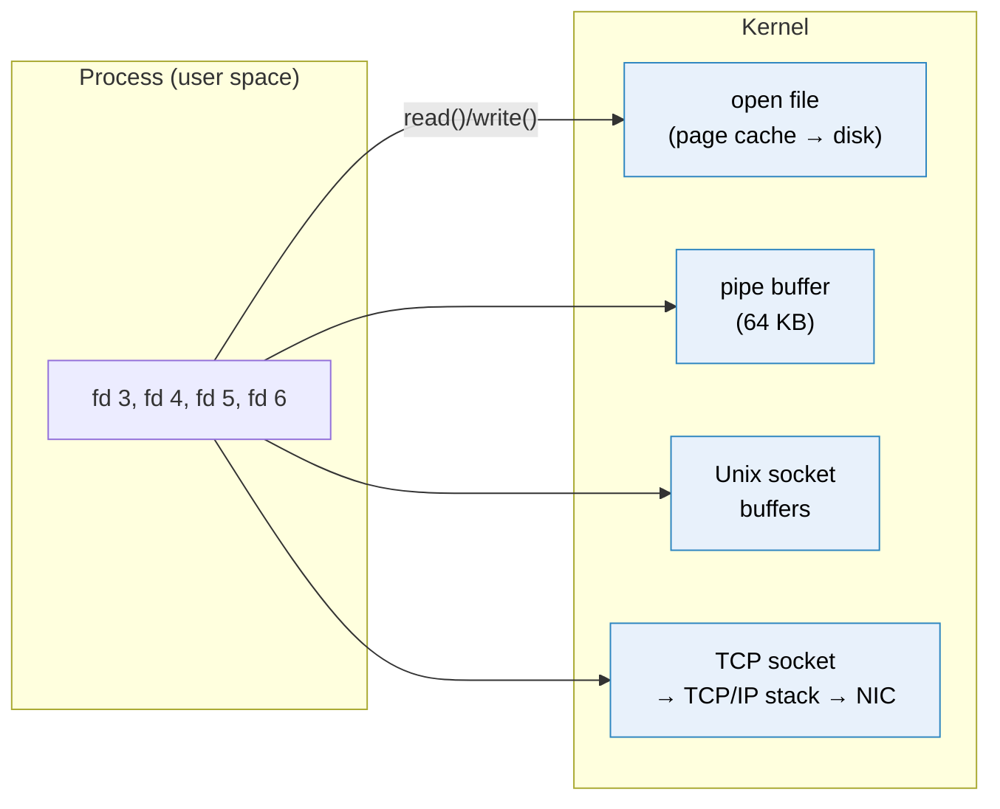

# Inter-process communication

> [!abstract] In one sentence
> Every process has its **own private memory**, so two processes can never just read each other's variables: to exchange anything they must go **through the kernel**, using one of a few mechanisms (**files**, **pipes**, **signals**, **shared memory**, **sockets**), and all of them except signals and shared memory show up in the process as a **file descriptor**.

## Common misconceptions

**Wrong mental model #1:** "Processes on the same machine share memory, so passing data between them is free."

**What's actually true:** the kernel gives each process its own **virtual address space**. Address `0x7ffd1234` in nginx and the same address in gunicorn are **different physical memory**. A process that touches memory it doesn't own gets killed (`Segmentation fault`). Exchanging data is always an explicit act: write it somewhere the kernel lets the other process read it.

**Wrong mental model #2:** "Sockets are for networking. Processes on the same machine talk through files."

**What's actually true:** sockets are the **most common** way local processes talk. **Unix domain sockets** (`/run/shop.sock`, `/var/run/docker.sock`, PostgreSQL's `/var/run/postgresql/.s.PGSQL.5432`) are sockets that never touch the network, and a TCP connection to `127.0.0.1` is a network socket that never leaves the machine. Plain files are the **least** suited: no notification, no message boundaries, and races between writer and reader.

| Wrong mental model | What's actually true |
|---|---|
| "Everything is a file" means everything is stored on disk | It means everything is reached through a **file descriptor** (an integer handle) and the same `read()`/`write()` calls: files, pipes, sockets, terminals, devices |
| A socket file like `/run/shop.sock` contains the data | It's only an **address** in the filesystem. The data passes through kernel buffers, the file stays 0 bytes |
| Two processes writing to the same file is fine | Without locking or append-only writes, they overwrite each other, and a reader can see a **half-written** file |
| `localhost` TCP is as cheap as a Unix socket | It goes through the whole TCP/IP stack (checksums, congestion control, loopback interface). Unix sockets skip it: roughly 2× faster for small messages |
| Shared memory is the easy way to go fast | It's the fastest, but the processes must **synchronize** themselves (locks, semaphores), and bugs there corrupt data silently |
| `kill` kills a process | `kill` **sends a signal**. Only `SIGKILL` (9) can't be caught. `SIGTERM` (the default) asks politely |

## File descriptors: the common handle

When a process opens something, the kernel returns a small integer, the **file descriptor** (fd), that points to an entry in the kernel's tables. The process then uses it with the same calls whatever is behind it:

```bash
# Every process starts with 0 (stdin), 1 (stdout), 2 (stderr)
ls -l /proc/$(pgrep -o nginx)/fd
# 0 -> /dev/null
# 1 -> /dev/null
# 2 -> /var/log/nginx/error.log
# 6 -> socket:[48213]            ← listening socket on :443
# 7 -> /var/log/nginx/access.log
# 9 -> pipe:[48220]
# 12 -> socket:[51877]           ← a client connection

lsof -p $(pgrep -o nginx)      # same, with more detail
```



The fd count is limited per process (`ulimit -n`, often 1,024 by default for shells, raised for servers). A busy server with 10,000 client connections needs 10,000+ fds: "**Too many open files**" is a socket problem as often as a file problem.

## Build-up: the processes on one shop web server

One EC2 instance running: **nginx** (reverse proxy), **gunicorn** with 4 Python workers (the shop app), **PostgreSQL** for a local job queue, the **CloudWatch agent** shipping logs, and a nightly **backup script** from cron.

### Stage 1: talking through a file

The app needs to hand "orders to export" to the nightly script. Easiest idea: append them to `/var/spool/shop/export.json`, the script reads the file at 02:00.

**The problems:**
- The script reads while a worker is in the middle of writing: it sees **half a JSON object** and crashes
- Two workers write at the same time: lines get **interleaved** or one overwrites the other (unless they open with `O_APPEND` and each write is one small `write()` call)
- Nobody is **notified**: the reader has to poll ("has the file changed?")
- After reading, who deletes what? An order written between "read" and "truncate" is lost

Files still work for IPC when used carefully:
- **Write to a temp file, then `rename()`**: rename is **atomic** on the same filesystem, so readers see either the old or the new file, never half of one. That's how config files and package managers update safely
- **Locks**: `flock(fd, LOCK_EX)` so only one process writes at a time (advisory: everyone must play along)
- **Append-only logs**: the app appends lines, the CloudWatch agent **tails** the file and remembers its offset. This is the one place file IPC is everywhere, and works because nobody rewrites the middle
- **inotify**: the kernel notifies the reader when the file changes, no polling
- **PID files** (`/run/nginx.pid`) and **lock files**: tiny files used as "who's running" markers

### Stage 2: pipes, a stream from one process to another

```bash
journalctl -u shop-api --since "1 hour ago" | grep ERROR | wc -l
```

Three processes, connected by two **pipes**. A pipe is a kernel buffer (64 KB on Linux) with a write end and a read end:
- **One direction**: `journalctl` writes, `grep` reads
- **Flow control for free**: if `grep` is slow and the buffer is full, `journalctl`'s `write()` **blocks** until there's room. If the buffer is empty, `grep`'s `read()` waits
- When the writer exits, the reader gets end-of-file. If the reader exits, the writer gets `SIGPIPE` / `EPIPE` ("Broken pipe")
- **Anonymous** pipes only connect **related** processes (the shell creates the pipe, then forks the children that inherit the fds)

A **named pipe (FIFO)** lives in the filesystem so unrelated processes can find it:

```bash
mkfifo /tmp/orders.fifo
cat /tmp/orders.fifo &                    # reader blocks until a writer opens it
echo '{"orderId":"o-8812"}' > /tmp/orders.fifo
```

Still one-way, still a byte stream, still one reader in practice. Fine for scripts, too limited for services.

### Stage 3: signals, a tap on the shoulder

After changing nginx's config, I don't want to restart it (and drop connections). I **signal** it:

```bash
sudo kill -HUP $(cat /run/nginx.pid)     # or: nginx -s reload, systemctl reload nginx
```

A signal is a **number**, no data. The kernel interrupts the target process and runs its handler (or the default action):

| Signal | Usual meaning | Can be caught? |
|---|---|---|
| `SIGTERM` (15) | "Please stop": finish requests, close connections, exit. What `systemctl stop`, Docker and Kubernetes send first | ✅ |
| `SIGINT` (2) | Ctrl-C | ✅ |
| `SIGHUP` (1) | By convention for daemons: **reload config**, reopen log files | ✅ |
| `SIGKILL` (9) | Die **now**. No cleanup, no flushing. What comes after the grace period (Kubernetes: 30 s) | ❌ |
| `SIGCHLD` | A child process exited | ✅ |
| `SIGPIPE` | Wrote to a pipe/socket nobody reads anymore | ✅ |
| `SIGUSR1/2` | App-defined (e.g. dump stats, rotate logs) | ✅ |

The app's **graceful shutdown** depends on handling `SIGTERM`: during a deploy, the old gunicorn gets `SIGTERM`, stops accepting, finishes in-flight requests, exits. An app that ignores it gets `SIGKILL`ed mid-request.

### Stage 4: Unix domain sockets, two-way local channels

nginx must pass every HTTP request to gunicorn and get the response back: **two-way**, many concurrent conversations, between **unrelated** processes. That's a socket. On the same machine, a **Unix domain socket**:

```
# gunicorn listens on a path instead of a port
gunicorn --workers 4 --bind unix:/run/shop/shop.sock app:wsgi

# nginx
upstream shop { server unix:/run/shop/shop.sock; }
```

```bash
ss -xlp | grep shop
# u_str LISTEN 0 2048 /run/shop/shop.sock 48911 * 0 users:(("gunicorn",pid=1201,fd=5))
ls -l /run/shop/shop.sock
# srwxrwx--- 1 shop www-data 0 Oct  3 14:00 /run/shop/shop.sock     ← "s" = socket, size 0
```

Why it beats `127.0.0.1:8000` here:
- **Faster**: no TCP/IP processing, no ports, no checksums
- **Access control by file permissions**: only users in group `www-data` can connect. A TCP port on localhost is open to **every** local user
- **Peer credentials**: the server can ask the kernel who connected (`SO_PEERCRED`: PID, UID, GID). PostgreSQL's `peer` authentication uses it: the OS user `postgres` logs in as DB user `postgres` without a password
- **Passing file descriptors** between processes (`SCM_RIGHTS`): systemd socket activation and zero-downtime reloads hand a listening socket to a new process

Unix sockets everywhere on a Linux server:

| Socket | Who listens | Note |
|---|---|---|
| `/var/run/docker.sock` | Docker daemon | Whoever can write to it controls Docker, which means **root on the host**. Never mount it into a container casually |
| `/var/run/postgresql/.s.PGSQL.5432` | PostgreSQL | `psql` with no `-h` uses it |
| `/run/systemd/journal/socket` | journald | Where services' logs go |
| `/run/dbus/system_bus_socket` | D-Bus | Desktop and system services messaging |
| `/run/containerd/containerd.sock` | containerd | Kubernetes' kubelet talks to the runtime through it |

The API is the **same** as for network sockets (see [[Sockets]]), only the address family changes (`AF_UNIX` + a path instead of `AF_INET` + IP:port).

### Stage 5: shared memory, no copying at all

PostgreSQL has one process **per client connection**, and all of them must see the same cached data pages and locks. Copying pages between processes through sockets would be far too slow. So at startup PostgreSQL creates a **shared memory** segment (`shared_buffers`, e.g. 4 GB) that every backend process **maps into its own address space**: the same physical memory, visible to all.

- Fastest IPC possible: no system call, no copy, just memory reads and writes
- **No synchronization included**: PostgreSQL uses its own locks (spinlocks, lightweight locks) inside the segment
- Visible with `ipcs -m` (System V) or as files in `/dev/shm` (POSIX `shm_open`)
- Containers: Docker's `/dev/shm` is 64 MB by default, a classic reason PostgreSQL or Chrome crash in containers (`--shm-size`)

### Stage 6: processes on different machines

The app moves to 10 instances and the database to [[RDS]]. Processes are no longer on the same kernel, so pipes, Unix sockets, shared memory and signals are out. What's left is **network sockets** (TCP/UDP), and everything built on them: [[HTTP]], database protocols, [[WebSocket]], message brokers ([[Messaging]]).

Same API, the address becomes `IP:port`: that's the subject of [[Sockets]].

## Choosing

| Mechanism | Direction | Unrelated processes? | Across machines? | Data | Typical use |
|---|---|---|---|---|---|
| **File** | Any (with care) | ✅ | Via shared FS (NFS, EFS) | Bytes, persistent | Config, logs, handoff with rename |
| **Pipe** | One way | ❌ (parent/child) | ❌ | Byte stream | Shell pipelines, child process output |
| **FIFO** | One way | ✅ | ❌ | Byte stream | Simple script plumbing |
| **Signal** | One way | ✅ (permission) | ❌ | A number | Stop, reload, notify |
| **Shared memory** | Both | ✅ | ❌ | Raw memory | Databases, high-speed data |
| **Unix socket** | **Both** | ✅ | ❌ | Stream or datagrams | Local services: proxy → app, Docker, DB |
| **TCP/UDP socket** | **Both** | ✅ | ✅ | Stream / datagrams | Anything across a network |
| **Message queue / broker** | Both (via broker) | ✅ | ✅ | Messages, persistent | Decoupled services (see [[Messaging]]) |

## In containers and the cloud
- Containers in the same **Kubernetes pod** share a network namespace, so they talk over `localhost`, and can share a Unix socket through a shared volume (sidecars do this)
- Separate containers don't share `/dev/shm` or signals unless configured (`shareProcessNamespace`)
- Between machines on AWS, "IPC" becomes networked services: HTTP behind [[Load balancers]], queues like [[SQS]], shared files on EFS. Lambda functions can't talk to each other directly at all: they go through an API, a queue or a store

## Practice

> [!example]- Why can't process A just read a variable from process B's memory?
> Each process has its own virtual address space. Sharing needs an explicit mechanism through the kernel (shared memory, a pipe, a socket…).

> [!example]- A cron job sometimes reads a half-written JSON file produced by the app. Fix?
> The app writes to a temp file in the same directory, then `rename()`s it over the real name (atomic). Or replace the file with a queue or socket.

> [!example]- Why put gunicorn on a Unix socket instead of 127.0.0.1:8000 behind nginx?
> Faster (no TCP/IP stack), and only users with file permissions on the socket can connect, unlike a localhost port open to every local user.

> [!example]- What's the risk of mounting `/var/run/docker.sock` into a container?
> Anything that can talk to it can start privileged containers and mount the host's filesystem: it's root on the host.

> [!example]- During deploys some requests fail with connection resets. The app is stopped with `docker stop`. What should the app do?
> Handle `SIGTERM`: stop accepting, finish in-flight requests, then exit before the grace period ends and `SIGKILL` arrives.

> [!example]- What does "everything is a file" really mean?
> Files, pipes, sockets, devices are all reached through file descriptors and the same read/write calls, not that they're stored on disk.

## Easy to get wrong
- Thinking processes can share variables without an explicit mechanism
- Reading a file another process is still writing (use rename, locks, or don't use files)
- Thinking a socket file holds the data (it's an address, always 0 bytes)
- Assuming `kill` means SIGKILL, and not handling SIGTERM for graceful shutdown
- Using localhost TCP for a local service that only one user should reach: Unix sockets + permissions
- Mounting the Docker socket into containers
- Forgetting signals and Unix sockets don't cross machines or containers by default
- "Too many open files" on a server: usually sockets, fix `ulimit -n` / `LimitNOFILE` and look for leaks

## Related
- Next:: [[Sockets]], [[WebSocket]]
- Across machines:: [[HTTP]], [[Messaging]], [[SQS]]
- Where the machine meets the network:: [[Network interfaces]] (namespaces, loopback)
- Proxies talking to apps:: [[Reverse proxy]]

## Flashcards
#flashcards

Why can't two processes read each other's variables? :: Each process has its own virtual address space. Sharing must go through the kernel
What is a file descriptor? :: An integer handle a process uses to read/write any kernel object: file, pipe, socket, terminal, device
What does "everything is a file" mean in Unix? :: Everything is accessed through file descriptors with the same read/write calls
How do you safely replace a file another process reads? :: Write a temp file in the same directory, then rename() it over the old one (atomic)
What is a pipe? :: A one-way kernel buffer (64 KB on Linux) between a writer and a reader, usually parent/child processes
Anonymous pipe vs named pipe (FIFO)? :: Anonymous: only related processes. FIFO: a filesystem name so unrelated processes can use it
What happens when a pipe's buffer is full? :: The writer's write() blocks until the reader consumes data (built-in flow control)
What is a signal? :: A numbered notification the kernel delivers to a process, carrying no data
SIGTERM vs SIGKILL? :: SIGTERM asks to stop and can be handled (graceful shutdown). SIGKILL kills immediately, can't be caught
What does SIGHUP usually do for daemons? :: Reload configuration / reopen log files
What is a Unix domain socket? :: A socket addressed by a filesystem path for local, two-way communication without the TCP/IP stack
Two advantages of a Unix socket over localhost TCP? :: Faster (no TCP/IP), and access controlled by file permissions (plus peer credentials)
Why is access to /var/run/docker.sock dangerous? :: Controlling Docker means being able to start privileged containers: root on the host
What is shared memory IPC? :: One memory segment mapped into several processes. Fastest, but they must synchronize themselves
Which IPC mechanisms work across machines? :: Network sockets (and what's built on them: HTTP, brokers), and shared filesystems
What does "Too many open files" usually mean on a server? :: The process hit its file descriptor limit, often because of many (or leaked) sockets
