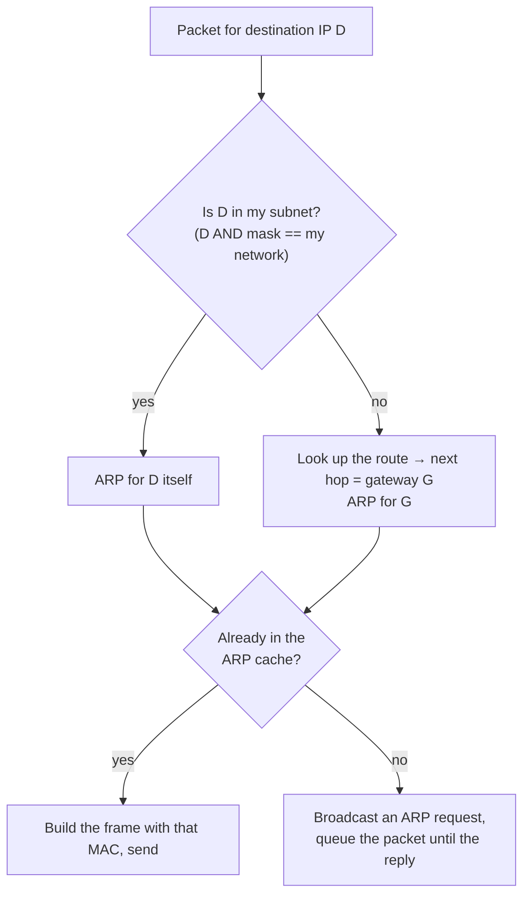
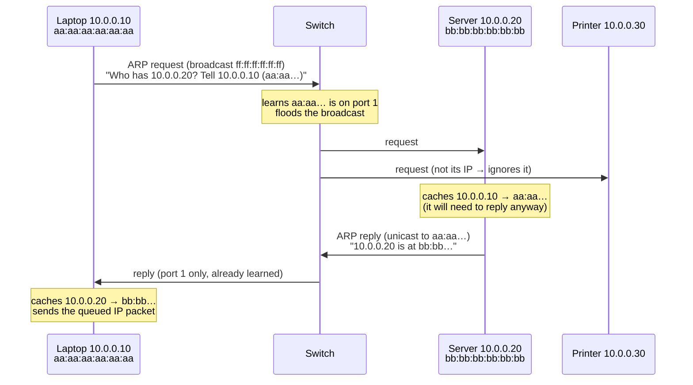
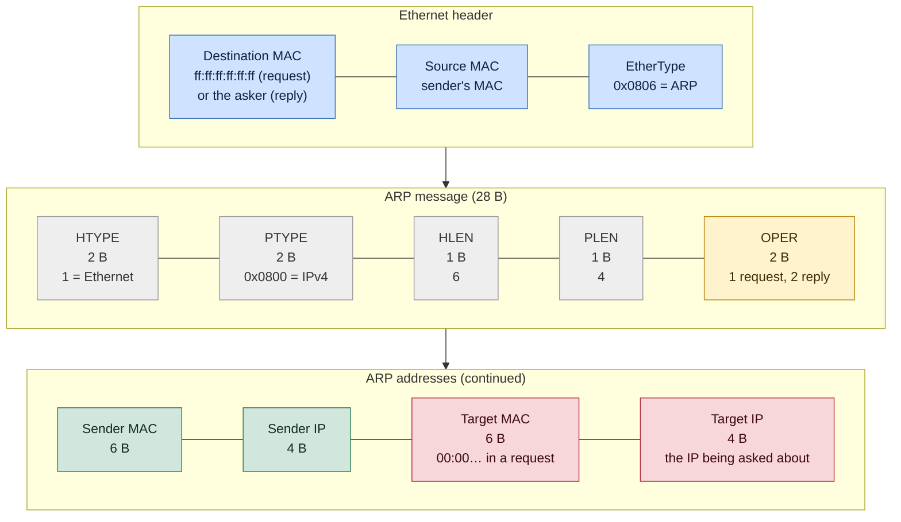

# ARP

> [!abstract] In one sentence
> **ARP** (Address Resolution Protocol) finds the **MAC address** that goes with an **IP address** on the local network: a machine broadcasts "who has 10.0.0.1?", the owner answers "I do, at `aa:bb:cc:…`", and the answer is cached. It's the glue between Layer 3 (IP, where I want to go) and Layer 2 (Ethernet, how the frame actually gets there), and it trusts everyone, which makes it both simple and easy to abuse.

## The problem ARP solves

An app wants to send a packet to `10.0.0.20`. The IP layer builds the packet. But on an Ethernet or Wi-Fi network, a frame is delivered by **MAC address** ([[Network layers#Inside the Ethernet frame]]), and the IP header alone doesn't say which network card should receive it.

IP addresses are assigned by config or DHCP and can move between machines. MAC addresses are burned into (or generated for) each card. Something has to map one to the other, **dynamically**, without anyone maintaining a table by hand. That's ARP.

## The misconceptions I had

| I thought | Actually |
|---|---|
| ARP finds the MAC of the server I'm talking to | Only if it's **on my subnet**. For anything else, ARP finds my **default gateway's** MAC. I never learn the MAC of a server on the internet |
| ARP is a Layer 3 protocol | It's carried **directly in Ethernet** (EtherType `0x0806`), with no IP header at all. It lives between L2 and L3 |
| A firewall on the host can block ARP | `iptables`/`nftables` IP rules don't see ARP (it isn't IP). There's a separate `arptables` / nftables `arp` family |
| ARP answers are verified | Nothing is authenticated. Any machine can answer, even without being asked, and most OSes believe it |
| ARP crosses routers | Never. It's a broadcast, and routers don't forward broadcasts. ARP only exists **within one broadcast domain** ([[Hubs, switches and routers]]) |

## Which MAC does my machine ask for?

The decision comes first, and it uses the **subnet mask** ([[IP addressing and subnetting#Why the mask decides where packets go]]):



## An exchange, step by step

Laptop `10.0.0.10` (MAC `aa:aa:…`) wants to reach `10.0.0.20` (MAC `bb:bb:…`), same subnet, empty caches:



Details worth noticing:
- The **request is broadcast** (everyone in the VLAN receives it), the **reply is unicast**
- The **target** learns the sender's mapping from the request itself, so it can reply without its own ARP request
- The switch learns both MACs along the way (see [[Hubs, switches and routers#Stage 2: the switch learns where everyone is]])

## The packet

An ARP message is 28 bytes, directly inside an Ethernet frame (padded to the 46-byte minimum payload):



- The grey fields are almost always the same (Ethernet + IPv4). ARP was designed to map *any* protocol to *any* hardware address, which is why it spells it out
- In a **request**, the target MAC is empty (that's the question). In a **reply**, sender and target swap roles

## The ARP cache (neighbor table)

Every host keeps recent answers so it doesn't ARP for every packet.

```bash
ip neigh show                     # Linux (the modern "ARP table")
# 10.0.0.1 dev eth0 lladdr 3c:22:fb:9a:10:4e REACHABLE
# 10.0.0.20 dev eth0 lladdr bb:bb:bb:bb:bb:bb STALE
# 10.0.0.99 dev eth0  FAILED
arp -a                            # Windows, macOS, old Linux
ip neigh flush dev eth0           # clear it
```

Linux entries go through states:

| State | Meaning |
|---|---|
| **INCOMPLETE** | Request sent, no answer yet |
| **REACHABLE** | Confirmed recently (a reply, or TCP traffic proving the peer is alive). Lasts ~15–45 s |
| **STALE** | Not confirmed recently. Still **used**, but the next packet triggers a check |
| **DELAY → PROBE** | Checking: waiting a moment for traffic to confirm it, then unicast ARP probes |
| **FAILED** | No answer after the probes: the host is unreachable at Layer 2 |
| **PERMANENT** | Static entry, added by hand (`ip neigh add … nud permanent`) |

`FAILED` or `INCOMPLETE` for an IP on my subnet means "nobody answered ARP": the host is off, on another VLAN, has a different IP, or the cable/port is wrong. It's a Layer 2 problem, and no firewall rule or route will fix it.

## Special kinds of ARP

### Gratuitous ARP: announcing without being asked
A host sends an ARP about **its own IP**, unrequested (as a request or reply with sender IP = target IP). Uses:
- **Failover**: a virtual IP moves from server A to server B (VRRP/keepalived, a cluster). B broadcasts "the VIP is now at **my** MAC", and everyone updates their caches immediately instead of sending to the dead A until their entries expire (see [[Load balancing#Making the load balancer itself highly available]])
- **After boot or a MAC change**: refresh everyone's caches
- `arping -U -I eth0 10.0.0.100` sends one by hand

### ARP probe and announcement: detecting duplicate IPs
Before using an IP, a careful host asks "does anyone have 10.0.0.50?" with a **sender IP of 0.0.0.0** (so it doesn't poison anyone's cache). An answer means the IP is taken (**duplicate address detection**). `arping -D -I eth0 10.0.0.50` does it by hand.

### Proxy ARP: answering for someone else
A router answers ARP requests **for IPs that aren't its own** (hosts on another network), with its own MAC, so the asker sends the frames to the router, which routes them.
- Historically: hosts with wrong masks, or networks split without the hosts knowing
- It hides mistakes: a host with a wrong mask "works" because the router answers for everything, until proxy ARP is turned off
- Still used on purpose: some container networks (e.g. Calico) give every pod the gateway `169.254.1.1`, and the host's side of each pod's veth answers ARP for it with proxy ARP (see [[Network interfaces]])

## Advanced problems

### 1. Failover happened, but clients still go to the dead server
The VIP moved to the backup, but clients (or the router) keep sending to the **old MAC** from their cache. Causes: the gratuitous ARP was never sent, was sent before the interface was ready, was rate-limited, or the device **ignores** unsolicited ARP (Linux `arp_accept=0` won't *create* entries from gratuitous ARP; some appliances ignore it entirely). Fix: send several gratuitous ARPs after takeover (keepalived does this), check on the router with `show arp` / `ip neigh`, and use a shorter ARP timeout on devices that ignore them.

### 2. Two machines with the same IP
Connectivity **flaps**: sometimes it works, sometimes connections reset, depending on which machine answered ARP last. The MAC for that IP keeps changing in everyone's cache. Find it: `arping -D`, `ip neigh` showing a MAC I don't recognize (the first 3 bytes = vendor), kernel logs about duplicate addresses, or the switch's MAC table to find the port.

### 3. Unicast flooding: ARP timeout vs MAC table timeout
Routers often keep ARP entries for **4 hours**, switches forget MACs after **5 minutes**. With asymmetric traffic (a server that only *receives* through this path and sends replies another way), the router still knows the server's MAC and keeps sending frames to it, but the switch has **forgotten** which port it's on, so it **floods** every frame to every port in the VLAN. Symptoms: high traffic on all ports, every host receiving someone else's traffic. Fix: align the timers (ARP timeout ≤ MAC aging) or fix the asymmetry.

### 4. "Neighbour table overflow" on big networks
Linux's neighbor table has a garbage-collection limit (`net.ipv4.neigh.default.gc_thresh3`, 1024 entries by default). A host in a huge flat network or a busy Kubernetes node talking to thousands of pods hits it: the kernel logs `neighbour: arp_cache: neighbor table overflow!` and new connections fail randomly. Fix: raise `gc_thresh1/2/3`, or make the Layer 2 domains smaller ([[VLAN]]).

### 5. ARP flux on multi-homed Linux hosts
By default Linux answers ARP for **any** of its IPs on **any** interface (the "weak host" model). A server with two NICs on the same subnet may answer for NIC 1's IP with NIC 2's MAC, and traffic arrives on the wrong interface. The same default breaks **direct server return** load balancing, where the virtual IP on each backend's loopback must *not* answer ARP. Fix: `sysctl net.ipv4.conf.all.arp_ignore=1` (only answer for IPs on the receiving interface) and `arp_announce=2` (use the best local source address in requests).

## Security: ARP trusts everyone

**ARP spoofing / poisoning**: an attacker on the same VLAN sends unsolicited replies "`10.0.0.1` (the gateway) is at **my** MAC". Victims update their caches and send all their outbound traffic to the attacker, who forwards it to the real gateway: a silent **man in the middle** (tools: arpspoof, ettercap, bettercap). It can also be used to cut victims off (denial of service).

Defenses, from switch to host (more in [[Network layers#L2: attacks that only work on a shared LAN]]):
- **Dynamic ARP Inspection (DAI)** on switches: ARP packets are checked against the DHCP snooping table (which IP was leased to which MAC on which port), and lies are dropped
- **Smaller VLANs / private VLANs**: fewer neighbors who can attack ([[VLAN]])
- **Static ARP entries** for critical hosts (the gateway): effective but doesn't scale
- **Detection**: arpwatch, IDS alerts on MAC changes for the gateway IP
- **Encryption above** ([[TLS]], [[IPsec and IKE|IPsec]]): a man in the middle then sees only ciphertext and can't forge a valid certificate. ARP spoofing still enables denial of service

## ARP elsewhere

| Where | What happens |
|---|---|
| **IPv6** | No ARP. **Neighbor Discovery (NDP)** does the same job with ICMPv6 messages (neighbor solicitation / advertisement) sent to **multicast** instead of broadcast. Same trust problems, fixed by RA Guard and SEND (rarely deployed) |
| **Wi-Fi** | Works the same. Access points often do **proxy ARP** themselves to avoid broadcasting over the air |
| **Cloud networks** (AWS VPC and others) | No real broadcast: the **virtual network answers ARP itself** from its own knowledge of which interface owns which IP. ARP spoofing between instances doesn't work, and a VIP can't be moved with gratuitous ARP: failover uses the provider's API (move a secondary IP or an Elastic IP) instead |
| **Point-to-point links, tunnels** (tun, WireGuard, PPP) | No ARP at all: there's only one possible neighbor, so there's no MAC to find ([[Network interfaces]]) |

## Troubleshooting commands

```bash
ip neigh show                          # the cache and each entry's state
arping -I eth0 10.0.0.1                # does anyone answer ARP for this IP? (and with which MAC)
arping -D -I eth0 10.0.0.50            # duplicate address detection (exit code 1 = taken)
tcpdump -ni eth0 arp                   # watch requests and replies live
tcpdump -eni eth0 arp                  # -e: also show the MAC addresses in the Ethernet header
ip -s neigh show 10.0.0.1              # with usage counters and timers
```

## Easy to get wrong
- Expecting ARP for a remote IP: the host ARPs for its **gateway**
- Blocking "everything except IP" at Layer 2 and breaking ARP (and so, everything)
- Trying to fix an `INCOMPLETE`/`FAILED` neighbor with routes or firewall rules: it's Layer 2 (VLAN, cable, the host itself)
- Moving a virtual IP without gratuitous ARP, or in a cloud where gratuitous ARP does nothing
- Leaving proxy ARP on and hiding wrong subnet masks
- Assuming a host firewall protects against ARP spoofing

## Related
- Foundation:: [[Network layers]], [[Hubs, switches and routers]], [[IP addressing and subnetting]]
- Scale and isolation:: [[VLAN]]
- Uses of gratuitous ARP:: [[Load balancing]] (VRRP, DSR)
- Linux / cloud:: [[Network interfaces]], [[VPC]]
- IPv6 equivalent:: *[[IPv6]]* (Neighbor Discovery)

## Flashcards
#flashcards

What does ARP do? :: Finds the MAC address for an IP address on the local network
Is ARP carried in IP? :: No, directly in Ethernet (EtherType 0x0806)
When my laptop talks to a server on the internet, whose MAC does ARP find? :: The default gateway's
ARP request vs reply delivery? :: Request: broadcast to ff:ff:ff:ff:ff:ff. Reply: unicast to the asker
Does ARP cross routers? :: No, it stays inside one broadcast domain
How big is an ARP message and what are the 4 address fields? :: 28 bytes. Sender MAC, sender IP, target MAC (empty in requests), target IP
What does the OPER field say? :: 1 = request, 2 = reply
What does a FAILED or INCOMPLETE neighbor entry mean? :: Nobody answered ARP: a Layer 2 problem (host off, wrong VLAN, wrong IP, cable)
What is gratuitous ARP for? :: Announcing your own IP/MAC unrequested, e.g. after a virtual IP fails over
How does duplicate address detection with ARP work? :: An ARP probe with sender IP 0.0.0.0 asks for the IP. Any answer = already taken
What is proxy ARP? :: A router answering ARP for IPs that aren't its own, so traffic comes to it
Symptom of two machines with the same IP? :: Flapping connectivity as the MAC for that IP keeps changing in caches
Why does ARP timeout > MAC aging cause flooding? :: The router still sends to a MAC the switch has forgotten, so the switch floods it everywhere
What does "neighbour table overflow" mean on Linux? :: The ARP/neighbor table hit gc_thresh3. Raise the limits or shrink the L2 domain
What are arp_ignore and arp_announce for? :: Stop Linux answering ARP for an IP on the wrong interface (multi-homed hosts, DSR)
How does ARP spoofing work? :: Unsolicited replies claim the gateway's IP with the attacker's MAC → man in the middle
Main switch defense against ARP spoofing? :: Dynamic ARP Inspection, checked against the DHCP snooping table
What replaces ARP in IPv6? :: Neighbor Discovery (ICMPv6, multicast)
Why doesn't gratuitous ARP work for failover in a cloud VPC? :: The virtual network answers ARP itself. Failover moves the IP through the provider's API
Why is there no ARP on a tun or WireGuard interface? :: Point-to-point: there's no MAC to find
