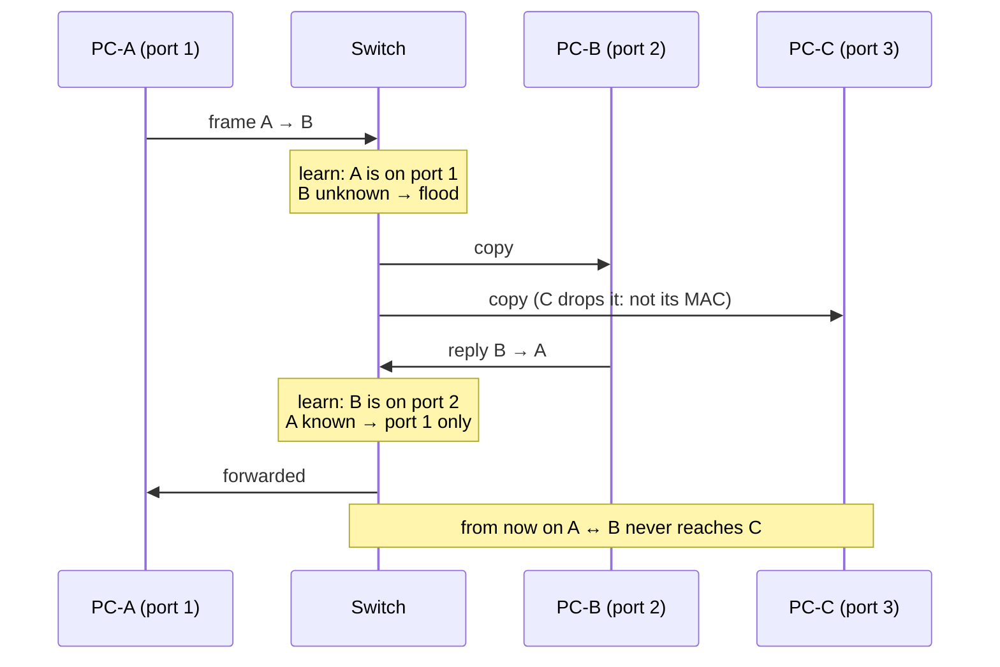
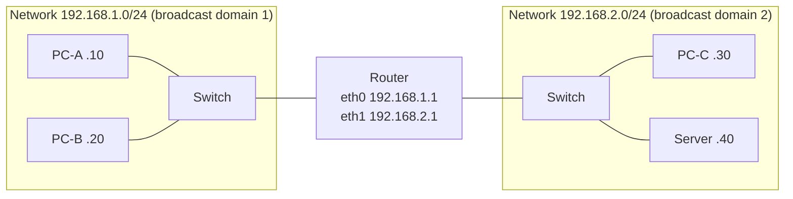

# Hubs, switches and routers

> [!abstract] The short answer
> They all have ports and move traffic, but they **decide on different things**. A **hub** decides nothing: it repeats every bit out of every port (Layer 1). A **switch** reads the **MAC address** and sends the frame only to the right port, *inside* one network (Layer 2). A **router** reads the **IP address** and moves packets *between* networks (Layer 3). The layer each one reads is the whole story (see [[Network layers]]).

## The misconception I had

**Wrong mental model:** "a router is a bigger, smarter switch", and "the box at home is a router, so a router is what gives me Wi-Fi and internet".

**What's actually true:**
- A switch and a router solve **different problems**. A switch connects machines of the **same** network. A router connects **different** networks. You can't replace one with the other
- The box at home is **five devices in one case**: a router (between my LAN and the ISP), a small switch (the 4 LAN ports), a Wi-Fi access point (a wireless switch, really), a **NAT** device (see [[NAT and PAT]]), a DHCP server and a DNS forwarder, plus a basic firewall. Calling it "the router" hides all of that

## Building it up, one problem at a time

### Stage 1: ten computers and a hub

Two computers can be joined with one cable. For ten, the oldest answer was a **hub**: a box that takes the electrical signal coming in on one port and **repeats it out of all the others**.

- It doesn't understand frames or addresses, only bits. Every machine receives everything, and each NIC throws away frames that aren't for its MAC
- Only **one device can talk at a time**. If two talk together, the signals collide and are garbled. Ethernet dealt with it with **CSMA/CD**: listen before talking, detect collisions, wait a random time, retry. That's **half duplex**
- The whole hub is one **collision domain**: add more machines and the collisions grow, throughput collapses
- **Security:** any machine can capture everyone's traffic, since it receives it all anyway

### Stage 2: the switch learns where everyone is

A **switch** reads the Ethernet header of each frame (see [[Network layers#Inside the Ethernet frame]]) and keeps a **MAC address table** (a.k.a. CAM table): "MAC X is on port 3".

It fills that table by **learning from source addresses**, and decides with three rules:

| The destination MAC is… | The switch… |
|---|---|
| In the table, on another port | **Forwards** the frame out of that port only |
| In the table, on the same port it came in on | **Filters** (drops) it |
| Not in the table yet (unknown unicast), or broadcast `ff:ff:ff:ff:ff:ff`, or multicast | **Floods** it out of every port except the incoming one |

Watching the table fill up on a switch with PC-A (port 1), PC-B (port 2), PC-C (port 3), starting empty:

What changed compared to the hub:
- **Each port is its own collision domain**, and with one device per port there are no collisions at all: **full duplex**, both directions at full speed at once
- Machines only receive their own frames (plus floods), so casual sniffing stops working
- Entries **age out** (typically after 300 s without traffic), so a machine that moves to another port is re-learned

**But broadcasts still go everywhere.** The switch floods them, so all its ports (and every switch connected to it) form one **broadcast domain**.

### Stage 3: how a machine finds a MAC in the first place (ARP)

I know the IP I want to reach, not its MAC. **ARP** fills the gap:
1. PC-A wants `192.168.1.20`. Is it in my subnet? Yes → ask for its MAC directly. No → ask for my **default gateway**'s MAC instead
2. Broadcast: "who has `192.168.1.20`? tell `192.168.1.10`" (to `ff:ff:ff:ff:ff:ff`, so every machine in the broadcast domain gets it)
3. Only the owner answers, in unicast: "`192.168.1.20` is at `aa:bb:…`"
4. PC-A stores it in its **ARP cache** (`ip neigh` on Linux) for a few minutes

Also worth knowing: **gratuitous ARP** (a machine announces its own IP/MAC, used when an IP moves to another machine in a failover), and the fact that nothing in ARP is authenticated, which is what ARP spoofing abuses (see [[Network layers#L2: attacks that only work on a shared LAN]]).

### Stage 4: 2 000 machines in one broadcast domain

Keep adding switches and everything still "works", until:
- **Broadcast noise**: ARP, DHCP, service discovery (mDNS, NetBIOS)… every machine processes every broadcast from 2 000 others
- **One failure domain**: a single looping cable or a crazy NIC floods the entire company (see [[Spanning Tree]])
- **One security zone**: HR's laptops, the servers and the guest Wi-Fi can all reach each other directly
- **Flat addressing** doesn't scale: the internet can't be one giant switched network, MAC tables would need every device on Earth

The fix is to **cut the network into smaller networks** (subnets) and connect them with something that **doesn't forward broadcasts**.

### Stage 5: the router connects networks

A **router** has an interface (and an IP) in **each network** it connects. It reads the **destination IP** and looks it up in its [[Routing tables|routing table]] (longest prefix match). For every packet it:
1. Receives the frame addressed to **its own MAC** (hosts send to the gateway's MAC, found with ARP)
2. Strips the Ethernet header, looks at the IP header
3. Picks the outgoing interface and next hop
4. Decrements the **TTL**, recomputes the IP checksum
5. Builds a **new Ethernet header** (its own MAC as source, the next hop's MAC as destination) and sends it

And crucially: **a router does not forward broadcasts**. Each router interface ends a broadcast domain. That's what makes networks scale.

PC-A → Server: PC-A sees `192.168.2.40` isn't in its subnet, so it ARPs for **192.168.1.1** (the router), sends the frame to the router's MAC, and the router forwards it into network 2 with a fresh frame. PC-A never learns the server's MAC.

### Stage 6: routers are slow and expensive per port → the Layer 3 switch

Classic routers routed in software and had few ports. Inside a building, where all the subnets are Ethernet, a **Layer 3 switch** does both jobs in hardware: switching within a VLAN, routing between VLANs through virtual interfaces (**SVIs**). See [[VLAN]].

What a "real" router still brings: WAN links, [[AS and BGP|BGP]] with full internet tables, [[VPN|VPN]] termination, [[NAT and PAT|NAT]], deep firewalling. Lines blur: modern firewalls route, and modern switches run BGP.

## Side by side

| | **Hub** | **Switch** | **Router** |
|---|---|---|---|
| Layer | 1 | 2 | 3 |
| Reads | Nothing (bits) | **MAC** addresses | **IP** addresses |
| Table | None | MAC table (learned automatically) | Routing table (connected, static, dynamic routes) |
| Unknown destination | Always repeats everywhere | Floods | **Drops** (or uses the default route), sends ICMP unreachable |
| Broadcasts | Repeated | Flooded | **Stopped** |
| Collision domains | One for all ports | **One per port** | One per port |
| Broadcast domains | One | **One** (per VLAN) | **One per interface** |
| Duplex | Half | Full | Full |
| Changes the frame? | No | No (only adds/removes VLAN tags) | Yes: new L2 header, TTL − 1 |
| Today | Obsolete | Everywhere | Everywhere |

### Classic exercise: count the domains

A router with two interfaces. Interface 1 → switch S1 with 4 PCs. Interface 2 → switch S2 with 2 PCs **and** a hub with 3 PCs.

- **Broadcast domains = 2**: one per router interface (S1's side, S2's side, the hub is part of S2's)
- **Collision domains = 9**: S1 has 5 ports in use (4 PCs + router) → 5. S2 has 4 (2 PCs + router + hub), and the hub with its 3 PCs is **one** shared domain on S2's port → 4. Total 9

## In Linux and AWS

| Real device | Linux equivalent | In an AWS VPC |
|---|---|---|
| Switch | A **bridge** (`br0`, `docker0`): learns MACs, forwards frames (see [[Network interfaces]]) | Hidden. There's no switch I can see, **no broadcast**, ARP is answered by the VPC itself |
| Router | Any machine with `net.ipv4.ip_forward=1` and routes | The **implicit VPC router**, at the subnet's **+1** address (`10.0.1.1`). It's what route tables configure (see [[VPC]]) |
| Router + NAT (home box) | `ip_forward` + `MASQUERADE` | NAT gateway, internet gateway (see [[NAT and PAT]]) |

## Easy to get wrong
- "Switches don't flood": they do, for broadcasts and unknown destinations. The first frame to a new MAC goes everywhere
- Thinking a switch separates broadcast domains: only routers (or VLANs) do
- Thinking a router forwards to the destination's MAC: it forwards to the **next hop**'s MAC, and the IPs stay the same
- Calling the home box a router and forgetting it's also doing NAT, DHCP and DNS (when "the internet is down", it's often one of those)
- Counting collision domains on a hub per device: the whole hub is one

## Related
- Foundation:: [[Network layers]]
- Next:: [[VLAN]], [[Spanning Tree]], [[NAT and PAT]]
- Routing:: [[Routing tables]], [[Policy-based routing]], [[AS and BGP]]
- Linux / cloud:: [[Network interfaces]], [[VPC]]
- Security:: [[ACL]], [[Security groups]]

## Flashcards
#flashcards

Hub vs switch vs router in one line each? :: Hub repeats bits to all ports (L1). Switch forwards frames by MAC within a network (L2). Router forwards packets by IP between networks (L3)
How does a switch learn its MAC table? :: From the source MAC of each frame and the port it arrived on
What does a switch do with an unknown destination MAC? :: Floods it out of all ports except the incoming one
Why is a hub half duplex? :: All ports share one collision domain, only one device can talk at a time (CSMA/CD)
What ends a broadcast domain? :: A router interface (or a VLAN boundary). Switches flood broadcasts
What ends a collision domain? :: A switch port (or router port)
When PC-A sends to a server in another subnet, whose MAC does it ARP for? :: Its default gateway's
What does ARP do? :: Finds the MAC for an IP in the same broadcast domain, by broadcasting a request
What is gratuitous ARP for? :: A machine announcing its own IP/MAC, e.g. after a failover moves an IP
What does a router change when forwarding? :: New L2 header (its MAC → next hop MAC), TTL − 1, IP checksum
What does a router do with a packet for an unknown network? :: Uses the default route, or drops it and sends ICMP unreachable
What is a Layer 3 switch? :: A switch that also routes between VLANs in hardware, through SVIs
Linux equivalent of a switch? :: A bridge (br0, docker0)
Where is the router in an AWS VPC? :: The implicit VPC router at each subnet's +1 address, configured by route tables
What is the home "router" really? :: Router + switch + Wi-Fi AP + NAT + DHCP + DNS forwarder + firewall
