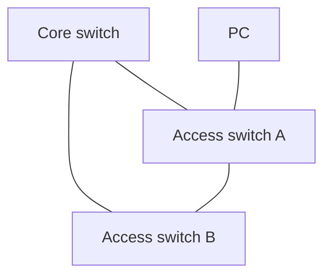

# Spanning Tree

> [!abstract] In one sentence
> Redundant links between switches create **loops**, and an Ethernet loop is deadly because frames have **no TTL**: a single broadcast circles forever and multiplies until the network dies. **Spanning Tree Protocol (STP)** lets switches agree on a loop-free tree by **blocking** the redundant ports, and unblocking them if an active link fails.

## The problem: redundancy creates a loop

Two access switches both connected to one core switch: if the core dies, everyone is cut off. So I add a cable between the two access switches as a backup. Now there's a triangle:



The PC sends one ARP broadcast. What happens without STP:
1. A floods it to Core and to B
2. Core floods its copy to B. B floods its copy to Core. Both also flood to A again
3. A receives two copies and floods both again… **each loop turn duplicates frames**
4. Nothing ever removes them: Ethernet has **no TTL** (unlike IP, where the TTL kills a looping packet after at most 255 hops, see [[Network layers]])

Within seconds:
- **Broadcast storm**: links at 100%, switch CPUs overwhelmed, every host drowning in broadcasts
- **MAC table flapping**: the PC's MAC is seen arriving on one port, then another, then back. The switch keeps rewriting its table and forwards unicast to the wrong places
- **Duplicate frames**: hosts receive the same frame several times

The network doesn't slow down. It **stops**, and the only fix is pulling a cable. So redundancy is needed, and loops are forbidden: STP resolves the contradiction.

## How STP builds the tree

Switches exchange **BPDUs** (Bridge Protocol Data Units, multicast frames every **2 s**) and run an election in three steps:

### 1. Elect the root bridge
Every switch has a **bridge ID** = **priority** (2 bytes, default 32768) + its **MAC address**. The **lowest** bridge ID wins and becomes the root. All its ports forward.

### 2. Each other switch picks its root port
The port with the **lowest total cost to the root**. Costs come from link speed (classic values: 100 Mb/s = 19, 1 Gb/s = 4, 10 Gb/s = 2; newer "long" costs: 1 Gb/s = 20 000). Ties are broken by the lowest neighbor bridge ID, then the lowest port ID.

### 3. Each link picks one designated port
On every segment, the port closest to the root forwards (designated). Any port that's neither root nor designated is **blocked**: it still listens to BPDUs, but forwards nothing.

Applied to the triangle (all links 1 Gb/s, Core has the lowest bridge ID):

```mermaid
flowchart TB
    CORE["Core switch<br/><b>ROOT</b>"] -- "designated → root port" --- A["Access A<br/>bridge ID lower than B"]
    CORE -- "designated → root port" --- B["Access B"]
    A -- "A's side: designated<br/>B's side: <b>BLOCKED</b>" -.- B
```

- A and B both reach the root directly (cost 4) through their root ports
- On the A–B link, A has the lower bridge ID, so A's port is designated and **B's port blocks**
- If the Core–B link fails, B stops hearing BPDUs from that side, re-runs the calculation, and **unblocks** its port toward A

## The problems with classic STP (and their fixes)

| Problem | Why | Fix |
|---|---|---|
| **Slow convergence: 30–50 s** | 802.1D waits: max age 20 s before declaring the root lost, then **listening** 15 s + **learning** 15 s before forwarding | **RSTP** (802.1w): switches negotiate directly with neighbors, converges in about a second. Port roles: root, designated, **alternate** (a ready backup root port), backup |
| **PCs wait 30 s** for their port to come up after plugging in | The port goes through listening/learning like any other | **PortFast / edge port**: ports to end devices forward immediately |
| **Wrong root** | The lowest MAC wins by default, often the **oldest, slowest** switch in a closet | **Set the priority** on the core switches (e.g. 4096 on the primary root, 8192 on the secondary) |
| **One tree for all VLANs** | The blocked link is idle for everyone | **PVST+** (Cisco, one tree per VLAN) or **MSTP** (802.1s, trees for groups of VLANs): block VLANs 10–19 on one link and 20–29 on the other |
| **Half the links do nothing** | By design, redundant links are blocked | **Link aggregation** (LACP, 802.3ad): several cables = one logical link, all used. **MLAG** across two switches |

## Security: STP trusts anyone who speaks it

BPDUs aren't authenticated. An attacker who plugs in a laptop and sends BPDUs with **priority 0** becomes the root: traffic between switches now flows **through the laptop** (man in the middle), or the network reconverges again and again (denial of service).

Defenses on switch ports:
- **BPDU Guard**: an edge port that receives a BPDU is shut down. There should never be a switch behind a user port
- **Root Guard**: a port that may never lead to the root. A superior BPDU puts it in a blocked state
- **Loop guard / UDLD**: protect against a one-way fiber failure making a blocked port start forwarding

## The modern answer: design loops out

STP is a safety net, and data centers stopped relying on it:
- **Link aggregation / MLAG** so redundant links are active, not blocked
- **Layer 3 down to the rack** (leaf-spine): every link is a routed link, the **IP TTL** handles loops, and **ECMP** uses all paths at once. Routing protocols (often [[AS and BGP|BGP]]) replace STP
- Where L2 is still needed across the fabric: **VXLAN + EVPN** over that routed fabric (see [[Types of VPN]])
- STP stays **on** everywhere as protection against someone plugging a cable into two wall ports

In AWS there's nothing to configure: the VPC has no broadcast and no switches I can loop, which removes this whole class of problems (see [[Hubs, switches and routers#In Linux and AWS]]).

## Easy to get wrong
- Thinking a loop just slows the network: with broadcasts it takes it down completely, within seconds
- Disabling STP "because it's slow" instead of using RSTP and edge ports
- Letting the default election pick the root (the oldest switch usually wins)
- Thinking the blocked port is broken: it's working as designed, and still listening
- Confusing the loop problem at L2 (no TTL) with routing loops at L3 (the TTL eventually kills the packet)

## Related
- Foundation:: [[Hubs, switches and routers]], [[VLAN]]
- Why L3 doesn't have this problem:: [[Network layers]] (TTL), [[Routing tables]]
- Graph view:: [[Breadth-first search]] (flooding), [[Depth-first search]] (finding loops)
- Modern fabrics:: [[AS and BGP]], [[Types of VPN]] (VXLAN, EVPN)

## Flashcards
#flashcards

Why is a loop at Layer 2 so much worse than at Layer 3? :: Ethernet frames have no TTL, so broadcasts circle and multiply forever
Three symptoms of a switching loop? :: Broadcast storm, MAC table flapping, duplicate frames
What does STP do? :: Blocks redundant switch ports to make a loop-free tree, unblocks them when a link fails
How is the root bridge chosen? :: Lowest bridge ID = priority (default 32768) + MAC address
How does a switch pick its root port? :: Lowest total path cost to the root, then lowest neighbor bridge ID, then lowest port ID
What happens to ports that are neither root nor designated? :: They're blocked (still receive BPDUs, forward nothing)
Why does classic STP take 30–50 s? :: Max age 20 s + listening 15 s + learning 15 s
What does RSTP change? :: Direct negotiation between neighbors, convergence in about a second, alternate ports ready as backup
What is PortFast / an edge port? :: A port to an end device that starts forwarding immediately
Why set STP priority manually? :: Otherwise the lowest MAC wins, often the oldest and slowest switch
PVST+/MSTP solve which problem? :: Separate trees per VLAN (group) so blocked links still carry some VLANs
Attack on STP and its defense? :: Sending superior BPDUs to become root (MITM/DoS). BPDU Guard on edge ports, Root Guard
How do modern data centers avoid STP? :: Link aggregation/MLAG and routed leaf-spine fabrics (ECMP, BGP), VXLAN/EVPN for L2
