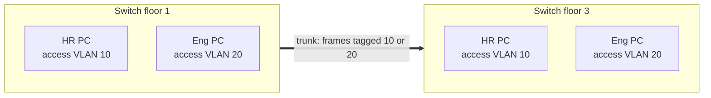

# VLAN

> [!abstract] In one sentence
> A **VLAN** (Virtual LAN) splits one physical switch into several **virtual switches** that can't see each other: each VLAN is its own **broadcast domain** and its own subnet. A 4-byte **802.1Q tag** in the Ethernet frame says which VLAN a frame belongs to when several VLANs share one cable, and traffic between VLANs has to go through a **router**.

## The problem it solves

One office floor, one set of switches, three groups: **HR**, **engineering** and **guest Wi-Fi**. I want them separated (different subnets, a firewall between them, guests only reaching the internet), for the reasons in [[Hubs, switches and routers#Stage 4: 2 000 machines in one broadcast domain]].

**Obvious fix: three sets of switches and three cabling plants.** Expensive, and when someone from HR moves to a desk in the engineering area, someone has to re-cable.

**The VLAN fix:** keep one set of switches, and **assign each port to a VLAN** in the config. Port 1–10: VLAN 10 (HR), 11–30: VLAN 20 (engineering), Wi-Fi guests: VLAN 30. The switch keeps a separate MAC table and flooding scope per VLAN, so a broadcast in VLAN 10 never leaves VLAN 10. Moving a person = changing one line of config.

## Access ports and trunk ports

**Problem:** VLAN 10 has people on the 1st floor and the 3rd floor, on different switches. Running one inter-switch cable **per VLAN** wastes ports.

**Fix:** one cable, a **trunk**, carries all VLANs, and each frame on it carries a **tag** saying which VLAN it belongs to.

| | **Access port** | **Trunk port** |
|---|---|---|
| Connects | An end device (PC, printer, server) | Switch ↔ switch, switch ↔ router, switch ↔ hypervisor |
| VLANs | Exactly one | Many (an "allowed VLANs" list) |
| Frames on the wire | **Untagged**. The device has no idea VLANs exist | **Tagged** with 802.1Q (except the native VLAN) |
| Switch adds/removes the tag? | Adds on entry, removes on exit | Keeps it |



HR PC floor 1 → HR PC floor 3: the frame enters untagged, floor 1's switch tags it **VLAN 10**, sends it over the trunk, floor 3's switch sees tag 10, looks in its VLAN 10 MAC table, removes the tag and delivers it. An engineering PC never sees it, not even as a flood.

### The 802.1Q tag

4 bytes inserted after the source MAC (full frame layout in [[Network layers#Inside the Ethernet frame]]):

| Field | Size | Meaning |
|---|---|---|
| TPID | 16 bits | `0x8100`: "a VLAN tag follows" (where the EtherType normally is) |
| PCP | 3 bits | Priority 0–7 (voice = 5), for QoS |
| DEI | 1 bit | Drop eligible when congested |
| **VID** | 12 bits | The VLAN ID: 1–4094 (0 and 4095 reserved) |

Frame max grows from 1518 to **1522** bytes. Providers stack two tags (**QinQ**, 802.1ad, outer TPID `0x88A8`) to carry customers' VLANs inside their own.

### The native VLAN

On a trunk, **one VLAN travels untagged**: the **native VLAN** (VLAN 1 by default on Cisco). Untagged frames arriving on a trunk are put in it. It exists for backwards compatibility, and it causes two classic problems:
- **Native VLAN mismatch**: switch A says native = 1, switch B says native = 99. Untagged frames silently jump from VLAN 1 on one side to VLAN 99 on the other. Traffic leaks between VLANs with no error
- **Double-tagging attack**: an attacker in the native VLAN sends a frame with **two** tags. The first switch strips the outer one (native, so it sends it untagged… with the inner tag still there), the next switch reads the inner tag and delivers it into the victim VLAN. One-way only, but enough for some attacks

Hygiene: native VLAN = an **unused** VLAN, or tag it too; never put users in VLAN 1; disable auto-trunking (DTP) on access ports so a PC can't negotiate a trunk ("switch spoofing").

## Inter-VLAN routing: VLANs can't talk to each other

VLAN 10 is `10.10.10.0/24`, VLAN 20 is `10.10.20.0/24`: different broadcast domains, different subnets. For HR to reach an engineering server, **a router has to be involved**. Three ways, each fixing the previous one's problem:

### 1. One router interface per VLAN
Router port 1 → an access port in VLAN 10, router port 2 → VLAN 20. Works, but 50 VLANs = 50 router ports and 50 cables.

### 2. Router on a stick
**One** trunk link to the router, with a **sub-interface per VLAN**, each being that VLAN's default gateway:

```bash
# Linux as the router
ip link add link eth0 name eth0.10 type vlan id 10
ip link add link eth0 name eth0.20 type vlan id 20
ip addr add 10.10.10.1/24 dev eth0.10
ip addr add 10.10.20.1/24 dev eth0.20
sysctl -w net.ipv4.ip_forward=1
```

**Problem:** every inter-VLAN packet goes **up** the trunk to the router and **back down** the same cable. That one link and the router's CPU become the bottleneck.

### 3. Layer 3 switch with SVIs
The switch routes internally in hardware. Each VLAN gets a **Switched Virtual Interface** (`interface vlan 10`, IP `10.10.10.1`) that acts as the gateway:

```
interface vlan 10
 ip address 10.10.10.1 255.255.255.0
interface vlan 20
 ip address 10.10.20.1 255.255.255.0
ip routing
```

Wire speed, no hairpin. This is the normal design in a building today.

> [!warning] A VLAN is separation, not security
> VLANs separate broadcast domains. The **security** is decided where VLANs are routed together. If the L3 switch routes everything to everything, HR and guests can reach each other just fine. Put [[ACL|ACLs]] on the SVIs, or route between sensitive VLANs **through a firewall** instead of the switch.

## Other VLAN tricks

| Feature | What it does | Why |
|---|---|---|
| **Voice VLAN** | One access port carries the PC untagged + the IP phone tagged (phone and PC daisy-chained) | Phones get QoS and their own subnet on the same cable |
| **Private VLANs** | Ports in the same VLAN/subnet can reach the gateway but **not each other** | Hotel rooms, shared hosting: one subnet, no neighbor attacks |
| **Dynamic VLAN assignment** | [[Network layers#L2: attacks that only work on a shared LAN\|802.1X]] + RADIUS puts the port in a VLAN based on **who** authenticated | Same port, HR laptop → VLAN 10, unknown device → quarantine VLAN |

## Limits, and what replaced VLANs at scale

- **4 094 VLANs max** (12 bits). A cloud provider with 100 000 customers can't give each one a VLAN
- A VLAN only exists where it's **trunked**: stretching it across buildings or data centers stretches its broadcast domain and failure domain (see [[Spanning Tree]])
- The answer in data centers and clouds: **VXLAN** (24-bit VNI, 16 million segments, carried over plain IP/UDP), usually with **EVPN** as the control plane. See [[Types of VPN#Stage 6: the application needs the same subnet on both sides]] and [[Network interfaces]]

## In AWS

- There are **no VLANs** I can configure inside a VPC. Isolation comes from the **VPC** itself (a separate network per VPC, implemented by the hypervisor's encapsulation), **subnets** (separate route tables and [[ACL|NACLs]]) and [[Security groups]] (per interface, much finer than a VLAN)
- The one place VLANs show up: **Direct Connect**. Each **virtual interface** (private, public, transit VIF) is an **802.1Q VLAN** on the physical port, so one fiber carries several logical connections

## Easy to get wrong
- Thinking VLANs on the same switch can talk without a router: they can't, that's the point
- Forgetting to allow a VLAN on the trunk: the VLAN works on each switch but not between them
- Native VLAN mismatch: no error, just frames landing in the wrong VLAN
- Treating VLANs as a firewall: without ACLs where they're routed, they're just separate broadcast domains
- Putting users in VLAN 1 (the default for everything, including management traffic on many switches)

## Related
- Foundation:: [[Hubs, switches and routers]], [[Network layers]]
- Next:: [[Spanning Tree]]
- Linux:: [[Network interfaces]] (`eth0.100` VLAN sub-interfaces)
- At scale:: [[Types of VPN]] (VXLAN, EVPN)
- AWS:: [[VPC]], [[Security groups]]

## Flashcards
#flashcards

What is a VLAN? :: A virtual switch inside a physical switch: its own broadcast domain and subnet
Access port vs trunk port? :: Access: one VLAN, untagged, to an end device. Trunk: many VLANs, 802.1Q-tagged, between switches/routers
Size and main field of the 802.1Q tag? :: 4 bytes. TPID 0x8100 + priority + a 12-bit VLAN ID
Maximum number of VLANs and why? :: 4 094: 12-bit ID minus 0 and 4095
What is the native VLAN? :: The VLAN sent untagged on a trunk (VLAN 1 by default)
Symptom of a native VLAN mismatch? :: No error, untagged frames land in a different VLAN on each side
How does a double-tagging attack work? :: Attacker in the native VLAN sends two tags. The first switch strips the outer one, the next delivers into the inner VLAN
Three ways to route between VLANs? :: One router port per VLAN, router on a stick (sub-interfaces on a trunk), L3 switch with SVIs
Weakness of router on a stick? :: All inter-VLAN traffic hairpins up and down one trunk and through the router's CPU
What is an SVI? :: A virtual interface for a VLAN on an L3 switch, acting as that VLAN's gateway
Are VLANs a security boundary? :: Only separation. Security depends on ACLs/firewalls where VLANs are routed together
What is a private VLAN for? :: Hosts in one subnet reach the gateway but not each other
What replaced VLANs in data centers and why? :: VXLAN: 24-bit VNI (16M segments) over IP, with EVPN
Where do VLANs appear in AWS? :: Direct Connect: each virtual interface is an 802.1Q VLAN
What replaces VLANs inside a VPC? :: VPCs, subnets, NACLs and security groups
