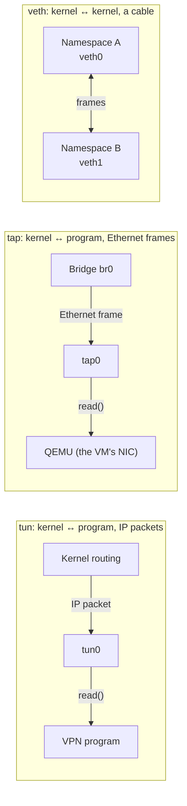
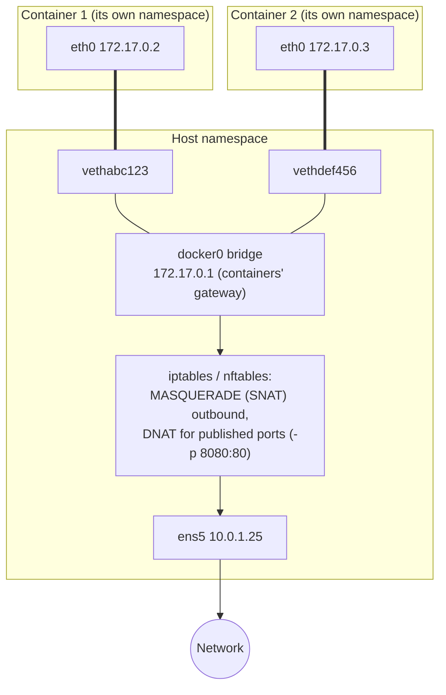

# Network interfaces

> [!abstract] In one sentence
> A network interface is the **point where a machine meets a network**: packets leave and arrive through it, and it holds the MAC and IP addresses. Some are backed by a real card (**physical**), and many are pure software (**virtual**: loopback, bridges, veth pairs, VPN tunnels, VLANs…) that behave exactly the same for the kernel.

## What an interface is

To the kernel, an interface is an object with a name and a set of properties. Routes point at it (`dev eth0`), firewall rules match on it (`-i eth0`), and apps can bind to it.

```
$ ip addr show ens5
2: ens5: <BROADCAST,MULTICAST,UP,LOWER_UP> mtu 9001 qdisc mq state UP group default qlen 1000
    link/ether 0a:1b:2c:3d:4e:5f brd ff:ff:ff:ff:ff:ff
    inet 10.0.1.25/24 metric 512 brd 10.0.1.255 scope global dynamic ens5
    inet6 fe80::81b:2cff:fe3d:4e5f/64 scope link
```

| Part | Meaning |
|---|---|
| `2:` | **Interface index** (the kernel's internal ID) |
| `ens5` | **Name** |
| `UP` | Administratively enabled (`ip link set ens5 up`) |
| `LOWER_UP` | The **link** is up (cable plugged, carrier detected). `NO-CARRIER` = enabled but no cable/signal |
| `mtu 9001` | Largest packet it sends (1500 standard Ethernet, 9001 jumbo frames inside an AWS VPC) |
| `qdisc mq` | The queueing discipline (how outgoing packets wait: fq_codel, mq…) |
| `state UP` | Operational state. Virtual interfaces often show `UNKNOWN` (normal for `lo`, `tun0`) |
| `link/ether …` | The **MAC address** (Layer 2) |
| `inet …/24` | An **IPv4 address + prefix**. An interface can have **several** |
| `inet6 fe80::…` | IPv6 link-local address (every IPv6 interface gets one) |

An interface lives at **Layer 2** (MAC, frames) and holds **Layer 3** addresses (IP). Adding an IP with a prefix also adds a **connected route** automatically (`10.0.1.0/24 dev ens5 proto kernel`), see [[Routing tables]].

## Physical interfaces

A **NIC** (Network Interface Card) plus its **driver**:

- **MAC address**: 48 bits, burned in by the manufacturer (first 3 bytes = vendor, the **OUI**), but software can change it
- **Link settings**: speed (1/10/25/100 Gbps), duplex, autonegotiation. `ethtool eth0`
- **Offloads**: the card does work for the CPU: checksums, segmentation (TSO/GSO: the kernel hands one 64 KB chunk, the NIC cuts it into packets), receive coalescing (GRO/LRO). `ethtool -k eth0`. They explain why `tcpdump` sometimes shows packets **bigger than the MTU** or with "bad" checksums
- **Multi-queue / RSS**: several receive/transmit queues spread across CPU cores
- **Wireless** (`wlan0`, `wlp2s0`): same idea, plus association to an access point (Wi-Fi handles that below the interface)

### Interface names

| Name | Meaning |
|---|---|
| `eth0`, `wlan0` | Old style: numbered in detection order (could change between boots) |
| `eno1` | **o**nboard device 1 (firmware index) |
| `ens5` | hotplug **s**lot 5. AWS Nitro instances show `ens5` |
| `enp3s0` | **p**CI bus 3, **s**lot 0 |
| `wlp2s0` | **wl** = wireless, on PCI bus 2 slot 0 |
| `enx0a1b2c3d4e5f` | Named after the MAC (USB adapters) |

"Predictable names" (`en…`) stay the same across reboots, because they're based on the hardware position, not detection order.

## Virtual interfaces

Everything below exists only in software, but routes, firewalls, `tcpdump` and apps treat them like real cards.

| Type | Layer | What it is | Typical use | Create |
|---|---|---|---|---|
| **loopback** (`lo`) | 3 | Traffic to itself, never leaves the machine | `127.0.0.1`, `::1`, local services | Always there |
| **dummy** | 3 | An interface that's always up and goes nowhere | Holding an IP that shouldn't depend on a cable (routers' "loopback" IP for BGP, anycast) | `ip link add dummy0 type dummy` |
| **bridge** | 2 | A **software switch**: learns MACs, forwards frames between its ports | `docker0`, `virbr0` (libvirt), `br0` for VMs | `ip link add br0 type bridge` |
| **veth** (pair) | 2 | **Two interfaces joined like a cable**: what goes in one comes out the other | Connecting a container/namespace to a bridge or the host | `ip link add veth0 type veth peer name veth1` |
| **tun** | 3 | Hands **IP packets** to a user-space program | VPNs (OpenVPN, AnyConnect), see [[VPN]] | Created by the VPN program |
| **tap** | 2 | Hands **Ethernet frames** to a user-space program | VMs (QEMU/KVM: one tap per VM, plugged into a bridge), L2 VPNs | `ip tuntap add tap0 mode tap` |
| **VLAN** (802.1Q) | 2 | A tagged sub-interface: `eth0.100` = VLAN 100 on `eth0` | Several isolated networks on one cable / trunk port | `ip link add link eth0 name eth0.100 type vlan id 100` |
| **bond** / **team** | 2 | Several NICs acting as **one** | Redundancy (active-backup) or more bandwidth (LACP 802.3ad) | `ip link add bond0 type bond mode 802.3ad` |
| **macvlan** | 2 | Extra interfaces on one NIC, **each with its own MAC** | Containers appearing as separate machines on the LAN | `ip link add mv0 link eth0 type macvlan mode bridge` |
| **ipvlan** | 2/3 | Like macvlan, but all share the parent's MAC | Where the switch/cloud allows only one MAC per port (clouds!) | `ip link add ipv0 link eth0 type ipvlan mode l3` |
| **VXLAN** | 2 over 3 | Ethernet frames inside **UDP 4789**: a virtual LAN stretched across an IP network | Overlay networks (Kubernetes Flannel/Calico, data center fabrics) | `ip link add vx0 type vxlan id 42 dstport 4789 …` |
| **GRE / IPIP** | 3 | Plain (unencrypted) IP tunnels. GRE = IP protocol 47 | Site links, often **inside IPsec** (GRE over IPsec), transit gateway Connect | `ip link add gre1 type gre remote … local …` |
| **WireGuard** (`wg0`) | 3 | Encrypted tunnel, in the kernel | VPNs, Tailscale | `ip link add wg0 type wireguard` |
| **XFRM / VTI** | 3 | IPsec tunnel interface for **route-based** IPsec | Site-to-site VPNs, see [[IPsec and IKE]] | `ip link add ipsec0 type xfrm dev eth0 if_id 42` |
| **VRF** | 3 | A separate routing table that other interfaces are **assigned** to | Isolated routing domains, see [[Policy-based routing]] | `ip link add vrf-a type vrf table 10` |
| **SR-IOV VF** | 1–2 | A physical NIC split **in hardware** into many "virtual functions", each given directly to a VM | Near-native speed for VMs. AWS **ENA** (enhanced networking) works this way | Configured on the host |

`ip -d link show <name>` shows the type and its settings. `ip link show type bridge` (or `veth`, `vlan`…) lists all of one type.

### tun vs tap vs veth, the three that confuse



- **tun/tap**: one end is an interface, the other end is a **program** (reading a file descriptor)
- **veth**: both ends are **interfaces**, usually in two different network namespaces

## Network namespaces: where interfaces live

A **network namespace** is a complete, separate network stack: its own interfaces, IPs, [[Routing tables|routing tables]], firewall rules, sockets. Every interface belongs to **exactly one** namespace. Containers are built on this.

### Lab: two namespaces joined by a veth pair

```bash
ip netns add red
ip netns add blue
ip link add veth-red type veth peer name veth-blue      # the "cable"
ip link set veth-red  netns red                          # plug one end into red
ip link set veth-blue netns blue                         # the other into blue
ip -n red  addr add 10.0.0.1/24 dev veth-red
ip -n blue addr add 10.0.0.2/24 dev veth-blue
ip -n red  link set veth-red  up
ip -n blue link set veth-blue up
ip netns exec red ping -c 2 10.0.0.2                     # works
ip netns exec red ip route                               # red has its own routing table
ip netns del red; ip netns del blue                      # clean up (the veth pair disappears too)
```

### How Docker uses all this



1. Each container gets a **namespace** and one end of a **veth pair**, renamed `eth0` inside it
2. The other end (`veth…`) is plugged into the **`docker0` bridge** on the host
3. Containers talk to each other through the bridge (Layer 2)
4. Outgoing traffic is routed by the host and **NATed** behind the host's IP. Published ports (`-p 8080:80`) are DNAT rules
5. Kubernetes does the same per pod (via a CNI plugin), then often adds VXLAN or routing between nodes

Virtual machines (KVM/libvirt) are similar: each VM's NIC is a **tap** on the host, plugged into a bridge (`virbr0`, NATed by default).

## Useful commands

```bash
ip link                          # all interfaces (Layer 2: MAC, MTU, state)
ip addr                          # with IP addresses (short: ip -br a)
ip -s link show eth0             # counters: bytes, packets, errors, drops
ip -d link show wg0              # type-specific details
ip link set eth0 mtu 1400        # change MTU
ip link set eth0 down / up
ip addr add 10.0.1.26/24 dev eth0    # a second IP on the same interface
bridge link                      # which interfaces are plugged into which bridge
bridge fdb show br docker0       # the bridge's MAC table
ethtool eth0                     # speed, duplex, link (physical NICs)
tcpdump -ni veth-red             # capture on any interface, virtual ones too
```

Changes made with `ip` are lost on reboot. Persistent config lives in NetworkManager, systemd-networkd, netplan (Ubuntu), or the distro's network scripts.

## In AWS: the ENI

An **Elastic Network Interface (ENI)** (`eni-…`) is AWS's virtual network card. Inside the instance it shows up as a normal interface (`ens5`, `ens6`…).

What an ENI carries:
- One **subnet** (so one AZ) of one [[VPC]]
- A **primary private IPv4**, optional **secondary private IPs**, IPv6 addresses, prefixes
- Optional **public IPv4** / **Elastic IP** (one per private IP)
- Its **[[Security groups|security groups]]**: security groups are attached to the ENI, not to the instance
- A **MAC address**
- The **source/destination check** flag (must be **off** for NAT instances, VPN gateways, firewalls that forward other machines' traffic)

| Topic | Details |
|---|---|
| **Primary ENI** | Created with the instance (`eth0`/`ens5`), can't be detached |
| **Secondary ENIs** | Attach/detach any time, even while running. The limit depends on the instance type. All in the same AZ, possibly different subnets |
| **Moving an ENI** | Detach from a failed instance, attach to a standby: it keeps its **IPs, MAC and security groups**. Useful for failover and MAC-based licenses |
| **Dual-homed instances** | One ENI in a public subnet and one in a private or management subnet (firewalls, appliances) |
| **Requester-managed ENIs** | Created **by AWS services** in my subnets: NAT gateways, load balancers, VPC endpoints, RDS, Lambda in a VPC, transit gateway attachments. That's how those services get IPs in my VPC and how their security groups apply |
| **Prefix delegation** | Assign whole `/28` blocks to an ENI (many IPs for EKS pods) |
| **ENA / EFA** | ENA = the enhanced networking adapter (SR-IOV, up to 100+ Gbps). EFA = extra low latency for HPC/ML |
| **Flow logs** | Can be enabled per ENI |

> [!warning] Secondary ENIs and replies
> With two ENIs in two subnets, Linux by default sends **all replies** through the interface of the default route, even for traffic that arrived on the other one. AWS drops those (source/destination check, and a wrong source for that ENI). The fix is **per-ENI routing tables** with [[Policy-based routing|policy rules]] (`from <eni2 IP> lookup table 2`). Amazon Linux's `amazon-ec2-net-utils` sets that up automatically.

## Easy to get wrong
- **`UP` but `NO-CARRIER`**: enabled, but no link (cable, virtual peer down, the other end of a veth not up)
- An IP address on an interface ≠ reachable: routes, ARP and firewalls still apply. Linux also **answers ARP for any of its IPs on any interface** by default (the "weak host model"), which surprises people with several interfaces on the same subnet
- **MTU mismatches** between an interface and a tunnel or bridge on top of it → big packets vanish (see [[VPN]])
- Forgetting **source/destination check** when an EC2 instance forwards traffic
- `tcpdump` on the physical interface shows **encrypted** VPN traffic. Capture on `tun0` / `wg0` to see the inner packets
- macvlan: by default the **host can't talk** to its own macvlan containers (use a macvlan interface on the host too, or ipvlan)

## Related
- Physical counterparts:: [[Hubs, switches and routers]] (bridge = switch), [[VLAN]], [[NAT and PAT]] (Docker's MASQUERADE/DNAT)
- Used by:: [[Routing tables]] (routes point at interfaces), [[Policy-based routing]] (VRFs, namespaces, `iif`/`oif`), [[VPN]] (tun, wg0, xfrm)
- In AWS:: [[EC2]], [[Security groups]], [[VPC]]
- Containers using these:: [[Docker]], [[Docker Compose]], [[Docker Swarm]] (VXLAN overlays), [[Kubernetes architecture]] (CNI plugins, pause container)
- What apps bind to an interface's address:: [[Sockets]], [[Inter-process communication]] (loopback vs Unix sockets)
- Differs from:: a network namespace (contains interfaces) and a VRF (groups interfaces under one routing table)
- Cloud equivalent of an interface on a central router:: [[Transit gateway attachments]]

## Flashcards
#flashcards

What is a network interface? :: The point where a machine meets a network: sends/receives packets and holds MAC and IP addresses
`UP` vs `LOWER_UP`? :: UP = enabled by admin. LOWER_UP = the link/carrier is actually up
What does adding `10.0.1.25/24` to an interface also create? :: A connected route for 10.0.1.0/24 via that interface
What does `ens5` mean? :: Ethernet, hotplug slot 5 (predictable naming). Typical on AWS Nitro instances
What is a veth pair? :: Two virtual interfaces joined like a cable, usually connecting two network namespaces
tun vs tap vs veth? :: tun: IP packets to a program. tap: Ethernet frames to a program. veth: a cable between two interfaces
What is a Linux bridge? :: A software switch that learns MACs and forwards frames between its ports (docker0, virbr0)
What is a dummy interface for? :: An always-up interface to hold an IP that doesn't depend on a physical link
VLAN sub-interface example? :: `eth0.100` = traffic on eth0 tagged with VLAN 100 (802.1Q)
Bond modes you should know? :: active-backup (failover) and 802.3ad/LACP (aggregate bandwidth)
macvlan vs ipvlan? :: macvlan gives each sub-interface its own MAC. ipvlan shares the parent's MAC (better in clouds)
What is VXLAN? :: Ethernet frames carried in UDP 4789: a Layer 2 overlay over an IP network
How does a Docker container reach the network? :: eth0 in its namespace, veth pair to the docker0 bridge, NAT (masquerade) out the host's interface
What is a network namespace? :: A separate network stack (interfaces, routes, firewall, sockets). Each interface belongs to exactly one
What is an AWS ENI? :: A virtual network card: subnet, private/public IPs, MAC, security groups, source/dest check
Can the primary ENI be detached? :: No. Secondary ENIs can be attached/detached any time
What moves with an ENI to another instance? :: Its private IPs, Elastic IPs, MAC and security groups
What are requester-managed ENIs? :: ENIs AWS services create in my subnets (NAT gateway, ELB, VPC endpoints, Lambda, RDS)
When must source/destination check be disabled? :: When the instance forwards traffic that isn't its own (NAT instance, VPN gateway, firewall)
Why do replies break with two ENIs in two subnets? :: Linux replies through the default route's interface. Fix with per-ENI policy routing tables
Why can tcpdump show packets larger than the MTU? :: Segmentation offload: the kernel hands big chunks to the NIC, which splits them
