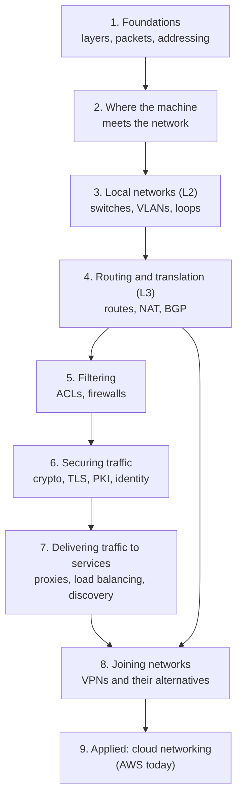

# Networking

> What this covers: networking as a **systems engineer** needs it: how packets move from a cable to an application, how networks are built, connected and secured, and how to reason about any of it when it breaks. Vendor-neutral first. Clouds (AWS today, others later) are one place it's applied, not the frame.

## How to use this

Read the sections **top to bottom**: each one assumes the ones above it. Inside a section, notes go from basic to advanced. Links in *italics* under "Not written yet" are the gaps I still have to fill.



## 1. Foundations
- [[Network layers]]: OSI vs TCP/IP, what's inside an Ethernet frame / IP / TCP / UDP header, how a request crosses the network hop by hop, and security at each layer. **The map everything else hangs on**
- [[ICMP]]: the control and error messages behind `ping` and `traceroute` (and why blocking all of it breaks things)
- [[IP addressing and subnetting]]: what an address is in binary, masks and prefixes, the mental method, special ranges, VLSM design, summarization, planning a real address scheme, with practice exercises
    - [[IP address planning]]: designing the plan itself. One aligned block per group so routes and firewall rules aggregate, a hierarchy of bits (environment vs region first), sizing for growth, reserved ranges, ranges to avoid, IPAM as the source of truth
- [[DNS]]: why it's a delegated tree, the three roles (stub, recursive, authoritative), a lookup step by step, caching and TTL, records, glue, how Linux resolves, reading `dig`
    - [[DNS security]]: cache poisoning and Kaminsky, DNSSEC's chain of trust, DoT/DoH, hijacking, subdomain takeover, tunneling, amplification, rebinding
    - [[DNS in production]]: internal naming, split-horizon, hybrid forwarding, DNS load balancing and its limits, safe record changes, running servers, a troubleshooting method
- [[HTTP]]: the request/response protocol on top of TCP. Message anatomy, methods (safe/idempotent), status codes, HTTP/1.0 vs 1.1 persistent connections, Content-Length vs chunked, head-of-line blocking and 6 connections per host, the Host header, polling/long polling/SSE/WebSocket, keep-alive 502s
    - [[HTTP2]]: same meaning, new framing. Binary frames and streams multiplexed on one connection, ALPN, HPACK, RST_STREAM/GOAWAY, TCP head-of-line blocking, HTTP/3 over QUIC, the per-connection load balancing trap
- Not written yet: *[[TCP and UDP]]* (handshake, states, retransmission, congestion control) · *[[DHCP]]* · *[[IPv6]]*

## 2. Where the machine meets the network
- [[Network interfaces]]: physical NICs and virtual ones (loopback, bridge, veth, tun/tap, VLAN, VXLAN, WireGuard), network namespaces, how containers and VMs get connected

## 3. Local networks (Layer 2)
- [[Hubs, switches and routers]]: what each device decides on, MAC learning, ARP, collision vs broadcast domains, why the home "router" is five devices
- [[ARP]]: how IP finds MAC, the packet, cache states, gratuitous and proxy ARP, failover and duplicate-IP problems, ARP spoofing and defenses, NDP and clouds
- [[VLAN]]: virtual switches, access vs trunk ports, 802.1Q, native VLAN traps, routing between VLANs
- [[Spanning Tree]]: why redundant switch links loop forever, how STP/RSTP block them, how data centers design loops out

## 4. Routing and translation (Layer 3)
- [[Routing tables]]: longest prefix match, metrics, administrative distance, Linux's multiple tables
- [[Policy-based routing]]: `ip rule`, marks, VRFs and namespaces. Choosing *which* table before choosing the route
- [[NAT and PAT]]: static/dynamic NAT, PAT tables, SNAT vs DNAT, NAT behaviors and hole punching, CGNAT, UPnP/NAT-PMP/PCP, why NAT isn't a firewall
    - [[Outbound-initiated connections]]: responses vs new connections through NAT, why an HTTP response doesn't end the TCP connection, why a NAT mapping isn't an open door, agents that dial out and keep the line open (SSM, CI runners, tunnels), keepalives, the egress-control lesson
- [[Overlapping address spaces]]: two networks using the same IPs, and the ways out (separate routing domains, NAT, exposing services, renumbering)
- [[AS and BGP]]: how independent networks route between each other, the protocol the internet runs on
- Not written yet: *[[OSPF]]* (routing inside one organization) · *[[First-hop redundancy (VRRP)]]* (two gateways, one IP)

## 5. Filtering
- [[ACL]]: ordered allow/deny rule lists, stateless vs stateful
- Not written yet: *[[Firewalls]]* (stateful inspection, zones, iptables/nftables, next-gen firewalls)

## 6. Securing traffic
- [[Encryption basics]]: symmetric vs asymmetric, Diffie-Hellman, forward secrecy, certificates
- [[Certificates and PKI]]: what's in a certificate, chains, trust stores, public vs private CAs, file formats
- [[TLS]]: protecting one application's connection, handshake, termination at a proxy
- [[mTLS]]: both sides show certificates. Service-to-service authentication, why the client CA must be private
- [[Certificate rotation]]: renewing certificates automatically (ACME, CA rotation)
- [[Workload identity (SPIFFE)]]: identities for services without stored secrets
- [[Service mesh]]: proxies + a control plane doing mTLS, authorization, retries and traffic splitting for every service

## 7. Delivering traffic to services
- [[Proxies]]: forward proxies, proxy vs NAT vs VPN, CONNECT, `HTTP_PROXY`/`NO_PROXY`, PAC/WPAD, transparent proxies, SOCKS, TLS inspection and what it breaks
- [[Reverse proxy]]: one entry point for many apps, TLS termination, the "real client IP" problem (X-Forwarded-For, PROXY protocol), 502/504 debugging, the family (LB, API gateway, CDN, ingress, sidecar)
- [[Load balancing]]: L4 vs L7, algorithms, health checks and their traps, sticky sessions, draining and retries, the gRPC trap, making the LB itself HA (VRRP, ECMP, anycast, DSR), global load balancing
- [[Service discovery]]: from config files to DNS to registries, client-side vs server-side, registration, how Kubernetes Services work, failure modes

## 8. Joining networks (VPNs and their alternatives)
- [[VPN]]: the three ingredients, how a client works (tun, routes, DNS), site-to-site vs remote access, split vs full tunnel, WireGuard, MTU
- [[Types of VPN]]: site-to-site → DMVPN → SD-WAN, remote access → ZTNA, mesh overlays and NAT hole punching, L2 VPNs, MPLS. Each one as the fix for the previous one's problem
- [[IPsec and IKE]]: ESP, IKEv2 exchanges, policy- vs route-based, NAT-T, MTU, troubleshooting
- [[IPsec vs TLS vs WireGuard vs SSH]]: which one to use when
- [[Nested VPNs]]: chained VPNs (branch → HQ → cloud, a routing problem: transitivity, selectors, return paths, hairpinning) vs stacked VPNs (tunnel in a tunnel, an MTU problem), and the fixes

## 9. Applied: cloud networking (AWS today)
Every concept above shows up here under a product name. The general idea is in the sections above, the notes below are about how one provider packages it. Reading order for the AWS side, in 5 stages → [[AWS networking]].
- [[VPC]]: a private network in the cloud: subnets, CIDR ranges, route tables, internet and NAT gateways
- [[Security groups]]: stateful filtering per network interface (section 5 applied)
- [[Connecting VPCs]]: peering vs a central router (transit gateway), transitive routing
- [[Site-to-Site VPN]]: section 8's site-to-site VPN as an AWS product (customer gateway, virtual private gateway, BGP, limits)
- [[Transit gateway]]: a hub router with VRF-like route tables, for many VPCs and sites
- [[VPC IP address planning]]: the address plan applied to AWS (VPC rules, environment blocks that keep TGW routing short, subnet layout, AWS IPAM, pod ranges)
- [[BGP in AWS hybrid networking]]: [[AS and BGP]] applied: routes vs traffic, routing domains, failover between tunnels
- [[Transit gateway attachments]]: interfaces and VRFs as an AWS product (what runs under each attachment type)
- [[Transit gateway routing]]: two routing tables per hop, and how routes get into them (propagation vs static)
- [[Direct Connect]]: a private carrier link with BGP, and why it isn't encrypted
- [[Hybrid connectivity architectures]]: hybrid problems → designs, including a client network that's already a chain of VPNs ([[Nested VPNs]] applied)
- [[Connecting AWS to a private network]]: the managed VPN and eight workarounds, and where each one breaks (sections 4 and 8 applied)
- [[Load balancers]]: ALB/NLB setup, target groups, health checks
- [[Proxies, load balancing and discovery in AWS]]: every concept from section 7 mapped to its AWS product (ALB, NLB, GWLB, CloudFront, API Gateway, Global Accelerator, Cloud Map, Service Connect, VPC Lattice, egress control)
- [[Route 53]]: DNS as a managed service (applies [[DNS]] and [[DNS in production]])
- [[AWS WAF]]: Layer 7 filtering
- [[Systems Manager]]: managing private instances with no inbound port, through an agent that dials out ([[Outbound-initiated connections]] applied)

## Not written yet: the rest of the systems engineer path
- *[[Network troubleshooting]]*: a method + the tools (`ip`, `ss`, `tcpdump`, `mtr`, `dig`, `curl -v`, `openssl s_client`)
- *[[High availability networking]]*: VRRP/keepalived, anycast, link aggregation, ECMP
- *[[Network monitoring]]*: SNMP, flow logs (NetFlow/sFlow), metrics that matter
- *[[Wireless networking]]*: Wi-Fi standards, WPA2/WPA3, roaming
- *[[Network automation]]*: config as code, Ansible, NETCONF/RESTCONF

## Weakest first
```dataview
TABLE WITHOUT ID file.link AS Note, type AS Type, confidence AS Conf
FROM ""
WHERE topic = this.file.name AND confidence
SORT confidence ASC
```

## Open questions
- ~~OSI layers properly: I keep saying "L4" and "L7" without being 100% sure of the rest~~ → answered in [[Network layers]]
