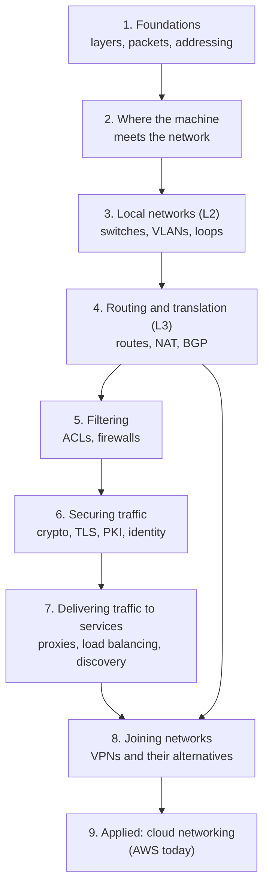

# Networking

> What this covers: networking as a **systems engineer** needs it: how packets move from a cable to an application, how networks are built, connected and secured, and how to reason about any of it when it breaks. Vendor-neutral first. Clouds (AWS today, others later) are one place it's applied, not the frame.

## Sub-topics
Each sub-topic has its own index with the same reading order, for studying one part at a time (and a cleaner graph).
- [[Networking › Protocols]]: the layer model and the protocols on top of it: ICMP, HTTP, HTTP/2 and HTTP/3, WebSocket, BGP
- [[Networking › Addressing]]: IP addresses, subnetting and designing an address plan
- [[Networking › DNS]]: name resolution, its security and running it in production
- [[Networking › Host networking]]: where one machine meets the network: interfaces and namespaces, sockets
- [[Networking › LAN]]: Layer 2: switches, ARP, VLANs, Spanning Tree
- [[Networking › Routing]]: Layer 3: routing tables, policy routing, NAT, overlapping ranges, high availability
- [[Networking › Security]]: filtering (ACLs, ingress and egress) and securing traffic: encryption, PKI, TLS, mTLS, workload identity
- [[Networking › Traffic]]: delivering traffic to services: proxies, reverse proxies, load balancing, service discovery, service mesh
- [[Networking › Resilience]]: surviving slow and failing dependencies: the patterns, the libraries (Hystrix, Resilience4j, Polly, others) and the service mesh
- [[Networking › VPN]]: joining networks: VPN types, IPsec, WireGuard and friends, nested VPNs

## How to use this

Read the sections **top to bottom**: each one assumes the ones above it. Inside a section, notes go from basic to advanced. Links in *italics* under "Not written yet" are the gaps I still have to fill.



## 1. Foundations
- [[Network layers]]: OSI vs TCP/IP, what's inside an Ethernet frame / IP / TCP / UDP header, how a request crosses the network hop by hop, and security at each layer. **The map everything else hangs on**
- [[ICMP]]: the control and error messages behind `ping` and `traceroute` (and why blocking all of it breaks things)
- [[IP addressing and subnetting]]: what an address is in binary, masks and prefixes, the mental method, special ranges, VLSM design, summarization, planning a real address scheme, with practice exercises
    - [[IP address planning]]: designing the plan itself. One aligned block per group so routes and firewall rules aggregate, a hierarchy of bits (environment vs region first), sizing for growth, reserved ranges, ranges to avoid, IPAM as the source of truth
- [[DNS]]: why it's a delegated tree, the three roles (stub, recursive, authoritative), a lookup step by step, caching and TTL, records, glue, how Linux resolves, reading `dig`
    - [[DNS security]]: cache poisoning and Kaminsky, DNSSEC's chain of trust, DoT/DoH, hijacking, subdomain takeover, tunneling, amplification, rebinding
    - [[DNS in production]]: internal naming, split-horizon, hybrid forwarding, DNS load balancing and its limits, safe record changes, running servers, a troubleshooting method
- [[HTTP]]: the request/response protocol on top of TCP. Message anatomy, methods (safe/idempotent), status codes, HTTP/1.0 vs 1.1 persistent connections, Content-Length vs chunked, head-of-line blocking and 6 connections per host, the Host header, polling/long polling/SSE/WebSocket, keep-alive 502s
    - [[HTTP2]]: same meaning, new framing. Binary frames and streams multiplexed on one connection, ALPN, HPACK, RST_STREAM/GOAWAY, TCP head-of-line blocking, HTTP/3 over QUIC, the per-connection load balancing trap
    - [[WebSocket]]: an HTTP upgrade into a two-way message channel. The handshake (`101`, Sec-WebSocket-Accept), frames and masking, how it crosses NATs, proxies and load balancers (nginx headers, idle timeouts), scaling with a pub/sub backplane, close codes, reconnects, security (Origin, auth), API Gateway WebSocket APIs
- Not written yet: *[[TCP and UDP]]* (handshake, states, retransmission, congestion control) · *[[DHCP]]* · *[[IPv6]]*

## 2. Where the machine meets the network
- [[Network interfaces]]: physical NICs and virtual ones (loopback, bridge, veth, tun/tap, VLAN, VXLAN, WireGuard), network namespaces, how containers and VMs get connected
- Processes on one machine (pipes, signals, Unix sockets, shared memory) are in the [[Operating systems]] area: [[Inter-process communication]], [[Signals]]
- [[Sockets]]: the kernel object behind every connection. The system calls (socket, bind, listen, accept, connect), the 5-tuple, `ss`, refused vs timed out, 127.0.0.1 vs 0.0.0.0, event loops and fd limits, byte streams vs messages, TIME_WAIT and CLOSE_WAIT, ephemeral port exhaustion, accept queue overflow

## 3. Local networks (Layer 2)
- [[Hubs, switches and routers]]: what each device decides on, MAC learning, ARP, collision vs broadcast domains, why the home "router" is five devices
- [[ARP]]: how IP finds MAC, the packet, cache states, gratuitous and proxy ARP, failover and duplicate-IP problems, ARP spoofing and defenses, NDP and clouds
- [[VLAN]]: virtual switches, access vs trunk ports, 802.1Q, native VLAN traps, routing between VLANs
- [[Spanning Tree]]: why redundant switch links loop forever, how STP/RSTP block them, how data centers design loops out

## 4. Routing and translation (Layer 3)
- [[Routing tables]]: longest prefix match, metrics, administrative distance, Linux's multiple tables
- [[Policy-based routing]]: `ip rule`, marks, VRFs and namespaces. Choosing *which* table before choosing the route
- [[NAT and PAT]]: static/dynamic NAT, PAT tables, SNAT vs DNAT, NAT behaviors and hole punching, CGNAT, UPnP/NAT-PMP/PCP, why NAT isn't a firewall
    - [[Outbound-initiated connections]]: responses vs new connections through NAT, why an HTTP response doesn't end the TCP connection, why a NAT mapping isn't an open door, agents that dial out and keep the line open (SSM, CI runners, tunnels), keepalives, the egress-control lesson
- [[Overlapping address spaces]]: two networks using the same IPs, and the ways out (separate routing domains, NAT, exposing services, renumbering)
- [[OSPF]]: how routers inside one organization find each other. Static routes vs distance-vector rumours (count to infinity) vs link-state (same map everywhere), SPF worked by hand on Acme's four routers, Hellos and what must match, the neighbour states (ExStart, Full), DR/BDR on shared segments, cost and the reference bandwidth trap, ECMP, areas and the backbone, ABR/ASBR, LSA types, stub/NSSA, E1 vs E2, BFD and fast convergence, authentication and passive interfaces, OSPFv3, an FRRouting lab with show commands, vs RIP/IS-IS/BGP, and the classic failures (MTU stuck in ExStart, Init, duplicate router ID, partitioned area 0, redistribution loops)
- [[AS and BGP]]: how independent networks route between each other, the protocol the internet runs on
- [[High availability networking]]: where "replicate it" stops (the gateway for the gateways). One address, one machine; multiple A records and their limits; one address served by several machines: floating IP (VRRP) on a LAN, ECMP in a site, anycast across networks; DNS vs BGP jobs; hierarchy vs distributed graph; redundancy at every level (DNS root included); black holes, split brain, ECMP rehash, shared fate, slow failover
- Not written yet: *[[First-hop redundancy (VRRP)]]* (two gateways, one IP)

## 5. Filtering
- [[Ingress and egress]]: traffic into vs out of something, and why it only means something once the boundary is named. Packet direction vs connection direction (stateful vs stateless rules, ephemeral ports), north-south vs east-west, why egress filtering matters, cloud egress fees, and the things named after the words (Kubernetes Ingress, egress gateways)
- [[ACL]]: ordered allow/deny rule lists, stateless vs stateful
- Not written yet: *[[Firewalls]]* (stateful inspection, zones, iptables/nftables, next-gen firewalls)

## 6. Securing traffic
- [[Encryption basics]]: symmetric vs asymmetric, Diffie-Hellman, forward secrecy, certificates
- [[Certificates and PKI]]: what's in a certificate, chains, trust stores, public vs private CAs, file formats
- [[TLS]]: protecting one application's connection, handshake, termination at a proxy
- [[mTLS]]: both sides show certificates. Service-to-service authentication, why the client CA must be private
- [[Certificate rotation]]: renewing certificates automatically (ACME, CA rotation)
- [[Workload identity (SPIFFE)]]: identities for services without stored secrets
- [[Service mesh]]: proxies + a control plane doing mTLS, authorization, retries and traffic splitting for every service
    - [[Istio]]: the mesh in practice on the shop. istiod and xDS, installing with Helm (profiles), sidecar injection and traffic capture, startup/Job races and native sidecars, port naming, rolling out STRICT mTLS safely, AuthorizationPolicy (deny-all + allow, evaluation order) and JWT checks, the ingress gateway (Gateway API vs Istio Gateway), VirtualService vs DestinationRule for a canary, metrics/logs/tracing and the Telemetry API, the Sidecar resource and ambient mode (ztunnel, HBONE, waypoints), revision-based upgrades and the root CA, egress control with ServiceEntry, debugging with istioctl and response flags, and the classic failures (503 after STRICT, hanging Jobs, NR routes, memory in large meshes, the webhook blocking pods)
- Application-level authentication (sessions, API keys, JWT, OAuth, OIDC, SSO, MFA) → its own area: [[Identity and access]]

## 7. Delivering traffic to services
- [[Proxies]]: forward proxies, proxy vs NAT vs VPN, CONNECT, `HTTP_PROXY`/`NO_PROXY`, PAC/WPAD, transparent proxies, SOCKS, TLS inspection and what it breaks
- [[Reverse proxy]]: one entry point for many apps, TLS termination, the "real client IP" problem (X-Forwarded-For, PROXY protocol), 502/504 debugging, the family (LB, API gateway, CDN, ingress, sidecar)
- [[Load balancing]]: L4 vs L7, algorithms, health checks and their traps, sticky sessions, draining and retries, the gRPC trap, making the LB itself HA (VRRP, ECMP, anycast, DSR), global load balancing
- [[Service discovery]]: from config files to DNS to registries, client-side vs server-side, registration, how Kubernetes Services work, failure modes
- [[Resilience patterns]]: surviving slow and failing dependencies. Cascading failure, timeouts (and deadlines), retries with backoff, jitter and budgets, circuit breakers, bulkheads and Little's law, fallbacks, rate limiting and load shedding, hedging, the nesting order, why it all lived in application code until about 2018, and what moved to the mesh
    - [[Hystrix]]: tutorial for Netflix's Java library (2012, maintenance since 2018): commands, thread vs semaphore isolation, properties, Spring Cloud annotations, the dashboard, and moving off it
    - [[Resilience4j]]: tutorial for its Java successor: circuit breaker, retry, time limiter, bulkheads, rate limiter, Spring Boot configuration and annotation order, metrics, traps
    - [[Polly]]: tutorial for .NET: v7 policies, v8 resilience pipelines, `AddStandardResilienceHandler`, hedging, chaos testing
    - [[Resilience libraries in other languages]]: Go, Python, Node.js, gRPC deadlines and retry policy, Failsafe, Sentinel, adaptive concurrency limits, Finagle, and the cost of a polyglot zoo
    - [[Resilience in a service mesh]]: the same patterns as proxy configuration (Istio, Envoy, Linkerd): timeouts, retries and budgets, Envoy "circuit breakers" vs outlier detection, fault injection, what stays in the app, migrating without multiplying retries

## 8. Joining networks (VPNs and their alternatives)
- [[VPN]]: the three ingredients, how a client works (tun, routes, DNS), site-to-site vs remote access, split vs full tunnel, WireGuard, MTU
- [[Types of VPN]]: site-to-site → DMVPN → SD-WAN, remote access → ZTNA, mesh overlays and NAT hole punching, L2 VPNs, MPLS. Each one as the fix for the previous one's problem
- [[IPsec and IKE]]: ESP, IKEv2 exchanges, policy- vs route-based, NAT-T, MTU, troubleshooting
- [[IPsec vs TLS vs WireGuard vs SSH]]: which one to use when
- [[Nested VPNs]]: chained VPNs (branch → HQ → cloud, a routing problem: transitivity, selectors, return paths, hairpinning) vs stacked VPNs (tunnel in a tunnel, an MTU problem), and the fixes

## 9. Applied: cloud networking (AWS today)
Every concept above shows up here under a product name. The general idea is in the sections above, the notes below are about how one provider packages it. Reading order for the AWS side, in 5 stages → [[AWS networking]].
- [[VPC]]: a private network in the cloud: subnets, CIDR ranges, route tables, internet and NAT gateways
- [[Security groups]]: stateful filtering per network interface (section 5 applied)
- [[Connecting VPCs]]: peering vs a central router (transit gateway), transitive routing
- [[Site-to-Site VPN]]: section 8's site-to-site VPN as an AWS product (customer gateway, virtual private gateway, BGP, limits)
- [[Transit gateway]]: a hub router with VRF-like route tables, for many VPCs and sites
- [[VPC IP address planning]]: the address plan applied to AWS (VPC rules, environment blocks that keep TGW routing short, subnet layout, AWS IPAM, pod ranges)
- [[BGP in AWS hybrid networking]]: [[AS and BGP]] applied: routes vs traffic, routing domains, failover between tunnels
- [[Transit gateway attachments]]: interfaces and VRFs as an AWS product (what runs under each attachment type)
- [[Transit gateway routing]]: two routing tables per hop, and how routes get into them (propagation vs static)
- [[Direct Connect]]: a private carrier link with BGP, and why it isn't encrypted
- [[Hybrid connectivity architectures]]: hybrid problems → designs, including a client network that's already a chain of VPNs ([[Nested VPNs]] applied)
- [[Connecting AWS to a private network]]: the managed VPN and eight workarounds, and where each one breaks (sections 4 and 8 applied)
- [[Load balancers]]: ALB/NLB setup, target groups, health checks
- [[Proxies, load balancing and discovery in AWS]]: every concept from section 7 mapped to its AWS product (ALB, NLB, GWLB, CloudFront, API Gateway, Global Accelerator, Cloud Map, Service Connect, VPC Lattice, egress control)
- [[Route 53]]: DNS as a managed service (applies [[DNS]] and [[DNS in production]])
- [[AWS WAF]]: Layer 7 filtering
- [[Systems Manager]]: managing private instances with no inbound port, through an agent that dials out ([[Outbound-initiated connections]] applied)

## Not written yet: the rest of the systems engineer path
- *[[Network troubleshooting]]*: a method + the tools (`ip`, `ss`, `tcpdump`, `mtr`, `dig`, `curl -v`, `openssl s_client`)
- *[[Network monitoring]]*: SNMP, flow logs (NetFlow/sFlow), metrics that matter
- *[[Wireless networking]]*: Wi-Fi standards, WPA2/WPA3, roaming
- *[[Network automation]]*: config as code, Ansible, NETCONF/RESTCONF

## Weakest first
```dataview
TABLE WITHOUT ID file.link AS Note, type AS Type, confidence AS Conf
FROM ""
WHERE topic = this.file.name AND confidence
SORT confidence ASC
```

## Open questions
- ~~OSI layers properly: I keep saying "L4" and "L7" without being 100% sure of the rest~~ → answered in [[Network layers]]
