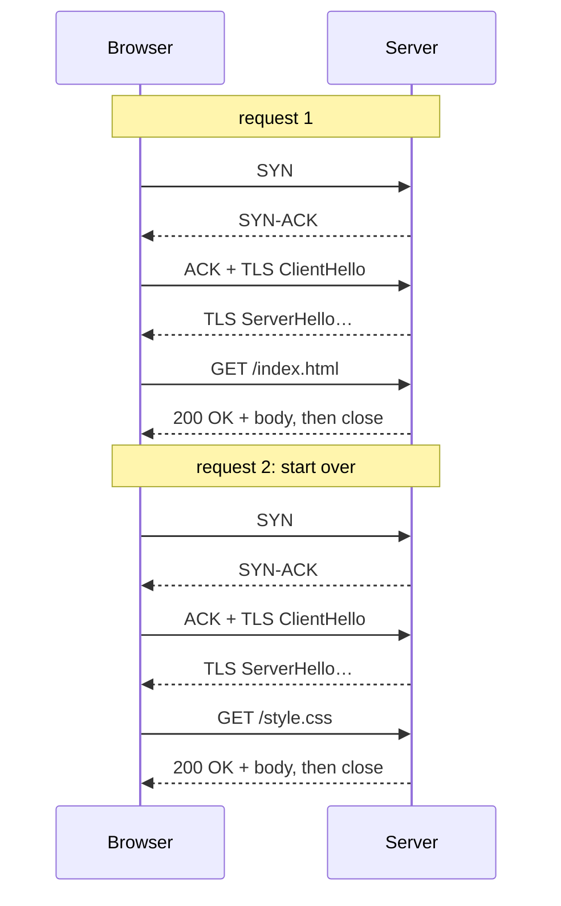
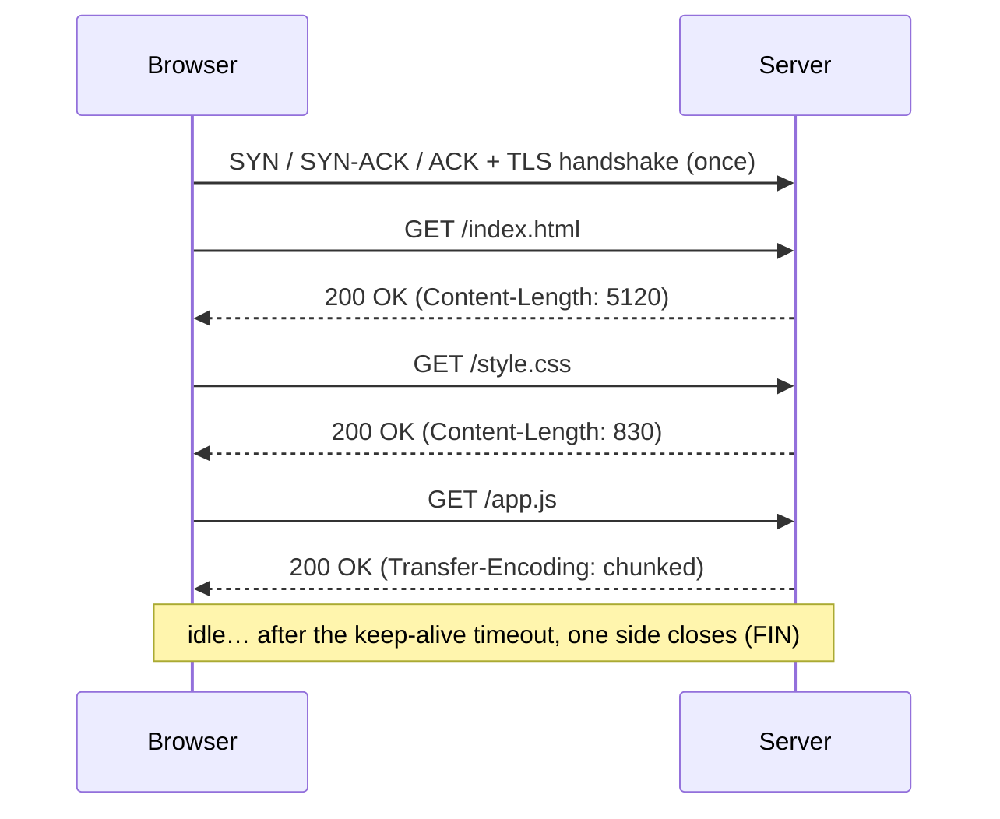
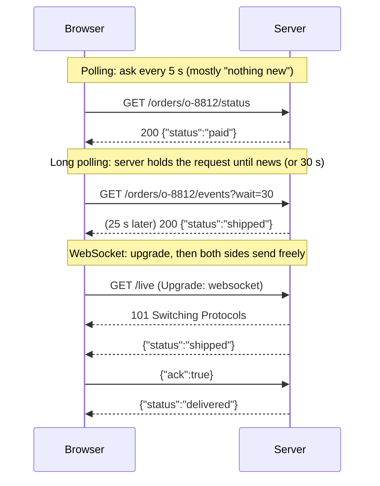

# HTTP

> [!abstract] In one sentence
> HTTP is a **text request/response protocol** that runs on top of a TCP connection (and TLS for HTTPS): the client sends a request (method, path, headers, optional body), the server sends back **one** response (status, headers, body). HTTP/1.1's big idea is that the **connection stays open** for the next request, but only **one request at a time** travels on it.

## Common misconceptions

**Wrong mental model #1:** "One HTTP request = one TCP connection. When the response arrives, the connection is closed."

**What's actually true:** that was HTTP/1.0. Since **HTTP/1.1** connections are **persistent by default** (keep-alive): after a response, the same TCP (and TLS) connection is reused for the next request, and only closed by `Connection: close` or after sitting **idle** for a while. Request lifetime and connection lifetime are two different things (this is the root of the NAT confusion in [[Outbound-initiated connections]]).

**Wrong mental model #2:** "HTTP is two-way: the server can send me something whenever it wants."

**What's actually true:** plain HTTP is strictly **client asks, server answers**. A server can't send a response nobody asked for. To get server-initiated messages, apps use tricks on top: **polling**, **long polling**, **Server-Sent Events**, or upgrade the connection to a **WebSocket**. In all of them the **client** opened the connection.

| Wrong mental model | What's actually true |
|---|---|
| HTTPS is a different protocol from HTTP | HTTPS = the same HTTP messages inside a [[TLS]] connection |
| The `Keep-Alive` header and TCP keepalive are the same thing | HTTP keep-alive = **reuse** the connection for more requests. TCP keepalive = empty probe packets to check an idle connection is still alive |
| HTTP/1.1 sends several requests in parallel on one connection | One at a time. **Pipelining** exists on paper but is broken in practice and disabled everywhere. Parallelism = **more connections** (browsers: ~6 per host) |
| The URL's host is only used for DNS | It's also sent in the **`Host` header**, which is how one IP serves hundreds of sites |
| `GET` and `POST` differ only in where the data goes | They differ in **meaning**: `GET` is safe and idempotent (can be retried, cached, prefetched), `POST` is neither |
| A 200 means it worked | It means the **server** says it worked. Many apps return 200 with an error in the body |

## Where HTTP sits

| Layer | HTTP/1.1 over HTTPS |
|---|---|
| Application | HTTP messages: `GET /foo HTTP/1.1` … |
| Security | [[TLS]] (encrypts everything above, including headers and the path) |
| Transport | TCP: one connection, ordered bytes, retransmits lost data (see *[[TCP and UDP]]*) |
| Network | IP (see [[Network layers]]) |

HTTP/1.1 is a **text** protocol on top of a **byte stream**. TCP doesn't know where one message ends and the next begins: HTTP itself has to say it (see stage 3).

## Build-up: fetching a web page

The shop's site `shop.example.com` at `203.0.113.10`, a laptop with `curl` and `nc`.

### Stage 1: one request, typed by hand

On port 80 (no TLS) I can literally type HTTP:

```bash
printf 'GET /products/42 HTTP/1.1\r\nHost: shop.example.com\r\nUser-Agent: nc-by-hand\r\nAccept: application/json\r\nConnection: close\r\n\r\n' \
  | nc shop.example.com 80
```

**The request** is lines ending in `\r\n`:

```http
GET /products/42 HTTP/1.1          ← request line: method, path, version
Host: shop.example.com             ← headers, one per line
User-Agent: nc-by-hand
Accept: application/json
Connection: close
                                   ← empty line = end of headers
```

**The response:**

```http
HTTP/1.1 200 OK                    ← status line: version, code, reason
Content-Type: application/json
Content-Length: 35
Cache-Control: max-age=60
Date: Sat, 03 Oct 2026 14:32:07 GMT
                                   ← empty line
{"id":42,"name":"Mug","price":12.5}   ← body: exactly 35 bytes, as announced
```

**Methods** (what I want to do):

| Method | Meaning | Safe (no side effect)? | Idempotent (repeat = same result)? |
|---|---|---|---|
| `GET` | Read | ✅ | ✅ |
| `HEAD` | Like GET, headers only | ✅ | ✅ |
| `POST` | Create / do something | ❌ | ❌ (twice = two orders) |
| `PUT` | Replace at this URL | ❌ | ✅ |
| `PATCH` | Partial update | ❌ | ❌ (usually) |
| `DELETE` | Delete | ❌ | ✅ |
| `OPTIONS` | What's allowed (CORS preflight) | ✅ | ✅ |

Idempotency matters for networks: a proxy or load balancer may **retry** a `GET` that timed out, but retrying a `POST` might charge a customer twice (see [[Load balancing]]).

**Status codes** by class:

| Class | Meaning | Ones I'll actually meet |
|---|---|---|
| `1xx` | Informational | `101 Switching Protocols` (WebSocket) |
| `2xx` | Success | `200 OK`, `201 Created`, `204 No Content` |
| `3xx` | Go elsewhere / use cache | `301`/`308` permanent redirect, `302`/`307` temporary, `304 Not Modified` |
| `4xx` | **Client's** fault | `400`, `401` (who are you?), `403` (I know you, no), `404`, `429 Too Many Requests` |
| `5xx` | **Server's** fault | `500`, `502 Bad Gateway`, `503 Unavailable`, `504 Gateway Timeout` (the proxy ones: see [[Reverse proxy]]) |

### Stage 2: HTTP/1.0, one connection per request

The product page needs the HTML, 1 CSS file, 2 scripts and 20 images: **24 requests**. In HTTP/1.0 each one is a **new TCP connection**, and with HTTPS a **new TLS handshake** too:



**The problems:**
- With 50 ms round trip time, TCP + TLS 1.3 handshakes cost ~2 RTT = **100 ms before each request even starts**. 24 requests sequentially = seconds of nothing but handshakes
- Each new TCP connection starts slow (**slow start**: small congestion window that grows), so short connections never reach full speed
- The server burns CPU on handshakes and holds thousands of sockets in `TIME_WAIT`

### Stage 3: HTTP/1.1 persistent connections

HTTP/1.1 makes the connection **persistent by default**. One TCP + TLS handshake, then requests one after the other:



`curl` shows the reuse when I give it two URLs on the same host:

```bash
curl -sv https://shop.example.com/a https://shop.example.com/b -o /dev/null -o /dev/null 2>&1 \
  | grep -i -E "connected to|re-using|left intact"
# * Connected to shop.example.com (203.0.113.10) port 443
# * Connection #0 to host shop.example.com left intact
# * Re-using existing connection with host shop.example.com
```

**Reusing a connection creates a new problem:** TCP is just a stream of bytes. If the connection doesn't close after the response, how does the client know **where the body ends** and the next response begins? HTTP/1.1 has two answers:

| How the end is marked | Header | When |
|---|---|---|
| Fixed length | `Content-Length: 5120` | The server knows the size in advance (files, small JSON) |
| **Chunked** encoding | `Transfer-Encoding: chunked` | The size isn't known yet (generated pages, streaming). The body is sent as `<size in hex>\r\n<data>\r\n` chunks, ending with a `0\r\n\r\n` chunk |

A chunked body on the wire:

```
1b\r\n                        ← 0x1b = 27 bytes follow
{"orders":[{"id":"o-8812"},\r\n
11\r\n                        ← 0x11 = 17 bytes
{"id":"o-8813"}]}\r\n
0\r\n                         ← last chunk
\r\n
```

(In HTTP/1.0 the only way to mark the end without a length was to **close the connection**, which is why it couldn't reuse it.)

**Closing:** either side sends `Connection: close` (then closes after this response), or the connection is closed after an **idle timeout** (nginx `keepalive_timeout` 75 s by default, AWS ALB 60 s, browsers a few minutes). Clients keep a **connection pool** and reuse idle connections from it.

### Stage 4: head-of-line blocking

On one HTTP/1.1 connection, **requests are strictly one at a time**: request → full response → next request. If `/report.pdf` takes 3 seconds to generate, the small `/logo.png` behind it **waits**, even though the server could send it instantly. That's **head-of-line (HOL) blocking**.

**Pipelining** (send several requests without waiting, responses must come back **in the same order**) was supposed to fix it, but:
- The slow first response still blocks the others (same order is required)
- Buggy proxies and servers mixed up responses
- So browsers **never enabled it**. It's effectively dead

What browsers did instead:
- <span style="color:rgb(255, 192, 0)">Open <b>~6 parallel connections per host</b>. 24 requests over 6 connections, 4 rounds</span>
- Hacks to beat the limit: **domain sharding** (`img1.shop…`, `img2.shop…` to get 6 more connections each), **sprites** (many images in one), **bundling** all JS into one file, inlining small resources

Each extra connection = another handshake, another slow start, more memory on the server. That's the problem [[HTTP2|HTTP/2]] was made for: many requests in parallel on **one** connection.

### Stage 5: one IP, many sites (the Host header)

<span style="color:rgb(255, 192, 0)">NOTE: Very important notice </span>
`203.0.113.10` also hosts `blog.example.com` and `api.example.com`. The server tells them apart only by the **`Host` header** (mandatory in HTTP/1.1). A [[Reverse proxy]] routes on it. With HTTPS there's a chicken-and-egg problem (the certificate is chosen before the encrypted `Host` header is readable), solved by **SNI** in the TLS ClientHello (see [[TLS]]).

```bash
# Same IP, different site, chosen by Host:
curl -H "Host: blog.example.com" http://203.0.113.10/
# For HTTPS, --resolve makes curl send the right SNI and Host:
curl --resolve api.example.com:443:203.0.113.10 https://api.example.com/health
```

### Stage 6: the server wants to talk first

The order page should update live when the warehouse ships. But in HTTP **only the client asks**. The options, all of them with the **client opening the connection**:



| Technique | How | Trade-off |
|---|---|---|
| **Polling** | Request every N seconds | Simple. Wasteful, and up to N seconds late |
| **Long polling** | The server keeps the request open until it has data or a timeout, client re-asks immediately | Near real time over plain HTTP. One held request per client |
| **Server-Sent Events** (SSE) | One response that never ends (`Content-Type: text/event-stream`), server writes events into it | Server → client only, plain HTTP, auto-reconnect. Used to stream LLM answers |
| **WebSocket** | An HTTP/1.1 request with `Upgrade: websocket`, answered `101 Switching Protocols`. From then on the TCP connection carries WebSocket frames in **both directions** | Full duplex, long-lived. Proxies and load balancers must allow the upgrade and long idle times. Full details: [[WebSocket]] |

This is exactly how management agents behind NAT receive commands (see [[Outbound-initiated connections]]).

## Advanced problems

### 1. Random 502s behind a load balancer: keep-alive timeout mismatch

Symptom: under normal traffic, a small % of requests get **502 Bad Gateway** from the load balancer, with nothing in the app logs.

Cause: the LB keeps **idle connections** to the backend open to reuse them. The backend (say Node.js, default keep-alive timeout **5 s**) closes an idle connection **at the same moment** the LB (idle timeout 60 s) sends a new request on it. The request hits a closed socket → reset → 502.

Fix: the **backend's keep-alive timeout must be longer than the LB's idle timeout** (e.g. backend 65 s, ALB 60 s), so the LB is always the one that closes first.

### 2. Connection pool exhaustion

An app calls a payment API with a pool of 10 connections. The API slows to 5 s per call: all 10 connections are busy, request 11 **waits for a free connection**, then times out. It looks like "the network is slow", but the client is queuing **inside itself**. Fix: timeouts on acquiring a connection, a pool sized to the load, and HTTP/2 to the API if it supports it.

### 3. Request smuggling

If a front proxy and a backend disagree on where a request **ends** (one trusts `Content-Length`, the other `Transfer-Encoding: chunked`), an attacker can hide a second request inside the body of the first, which the backend then treats as the **next** request on the reused connection, possibly someone else's. Fixes: reject requests with both headers, keep proxies patched, use HTTP/2 to the backend (binary framing has explicit lengths).

### 4. Things that hold a connection open too long

Long polling, SSE and WebSockets are **long idle-looking connections**. Every proxy, NAT and LB on the path has an idle timeout (AWS NAT gateway 350 s, ALB 60 s by default). Without application-level pings, the connection gets cut silently. Both ends need **heartbeats** and **reconnect** logic.

## In AWS
- **ALB**: speaks HTTP/1.1 and HTTP/2 to clients. To targets it uses HTTP/1.1 by default (target group protocol version can be HTTP/2 or gRPC). Idle timeout **60 s** by default: set the backend keep-alive higher. WebSockets are supported (upgrade passes through)
- **NLB**: L4, doesn't look at HTTP at all: the TCP connection goes through, keep-alive and WebSockets are the backend's business. TCP idle timeout 350 s
- **NAT gateway**: 350 s idle timeout, so long polling and WebSocket clients behind it need keepalives
- See [[Load balancers]] and [[Proxies, load balancing and discovery in AWS]]

## Practice

> [!example]- After a response, is the TCP connection closed in HTTP/1.1?
> No, persistent by default. It's closed on `Connection: close` or after an idle timeout.

> [!example]- How does an HTTP/1.1 client know where a response body ends on a reused connection?
> `Content-Length`, or `Transfer-Encoding: chunked` with a final zero-size chunk.

> [!example]- Why do browsers open ~6 connections per host with HTTP/1.1?
> A connection carries one request at a time (pipelining is unusable), so parallelism needs more connections.

> [!example]- How can one IP serve 50 HTTPS sites?
> The `Host` header picks the site, and SNI in the TLS handshake picks the certificate.

> [!example]- How does a server push live updates to a browser over HTTP?
> It can't initiate. The client opens a connection the server writes into: long polling, Server-Sent Events, or a WebSocket upgrade.

> [!example]- 1% of requests behind the ALB get 502, app logs are clean. First thing to check?
> Backend keep-alive timeout shorter than the ALB's 60 s idle timeout. Make the backend's longer.

## Easy to get wrong
- Thinking each request opens a new connection (that was HTTP/1.0)
- Confusing HTTP keep-alive (reuse) with TCP keepalive (probe packets)
- Thinking HTTP/1.1 runs requests in parallel on one connection
- Retrying `POST` automatically as if it were idempotent
- `401` vs `403`: not authenticated vs not allowed
- `502` vs `504` at a proxy: bad answer from the backend vs no answer in time
- Backend keep-alive timeout shorter than the load balancer's: random 502s
- Long-lived connections (WebSocket, SSE, long polling) without heartbeats behind NATs and LBs
- Forgetting that HTTPS hides the path and headers from the network, but **not** the hostname in SNI (unless ECH)

## Related
- Runs on:: *[[TCP and UDP]]*, [[TLS]]
- Next version:: [[HTTP2]]
- Upgraded to:: [[WebSocket]]
- Underneath:: [[Sockets]]
- Connections vs requests through NAT:: [[Outbound-initiated connections]]
- In the middle:: [[Proxies]], [[Reverse proxy]], [[Load balancing]]
- Names:: [[DNS]]
- Who's calling (stateless requests carrying credentials):: [[Authentication and authorization]], [[Session authentication]], [[JWT and bearer tokens]]
- AWS:: [[Load balancers]], [[Proxies, load balancing and discovery in AWS]]

## Flashcards
#flashcards

What is HTTPS? :: HTTP messages carried inside a TLS connection
Parts of an HTTP request? :: Request line (method, path, version), headers, empty line, optional body
Parts of an HTTP response? :: Status line (version, code, reason), headers, empty line, body
Main difference between HTTP/1.0 and HTTP/1.1 connections? :: 1.0 opens a connection per request. 1.1 keeps connections open (persistent) by default
What ends an HTTP/1.1 persistent connection? :: Connection: close, or an idle timeout on either side
How does a client find the end of a body on a persistent connection? :: Content-Length, or Transfer-Encoding: chunked ending with a zero-size chunk
HTTP keep-alive vs TCP keepalive? :: HTTP keep-alive reuses a connection for more requests. TCP keepalive sends probes to check an idle connection is alive
What is head-of-line blocking in HTTP/1.1? :: One request at a time per connection, so a slow response delays all the ones behind it
What is HTTP pipelining and is it used? :: Sending several requests without waiting, responses in order. Effectively unused (broken, disabled in browsers)
How many connections per host do browsers open for HTTP/1.1? :: About 6
What is the Host header for? :: Tells the server which site is wanted, so one IP can serve many sites
Safe vs idempotent HTTP methods? :: Safe: no side effects (GET, HEAD). Idempotent: repeating gives the same result (GET, PUT, DELETE). POST is neither
Why must POST not be retried automatically? :: It isn't idempotent: a retry can create a second order or payment
What is long polling? :: The server holds a request open until it has data or times out, then the client asks again
What are Server-Sent Events? :: A never-ending HTTP response (text/event-stream) the server writes events into, server → client only
How does a WebSocket start? :: An HTTP/1.1 request with Upgrade: websocket, answered 101 Switching Protocols
Can an HTTP server send a response nobody asked for? :: No. Server-initiated messages need a client-opened connection (long poll, SSE, WebSocket)
Cause of random 502s behind a load balancer with clean app logs? :: Backend keep-alive timeout shorter than the LB idle timeout. Make the backend's longer
What is request smuggling? :: Front proxy and backend disagree on where a request ends (Content-Length vs chunked), letting an attacker hide a request
401 vs 403? :: 401: not authenticated. 403: authenticated but not allowed
