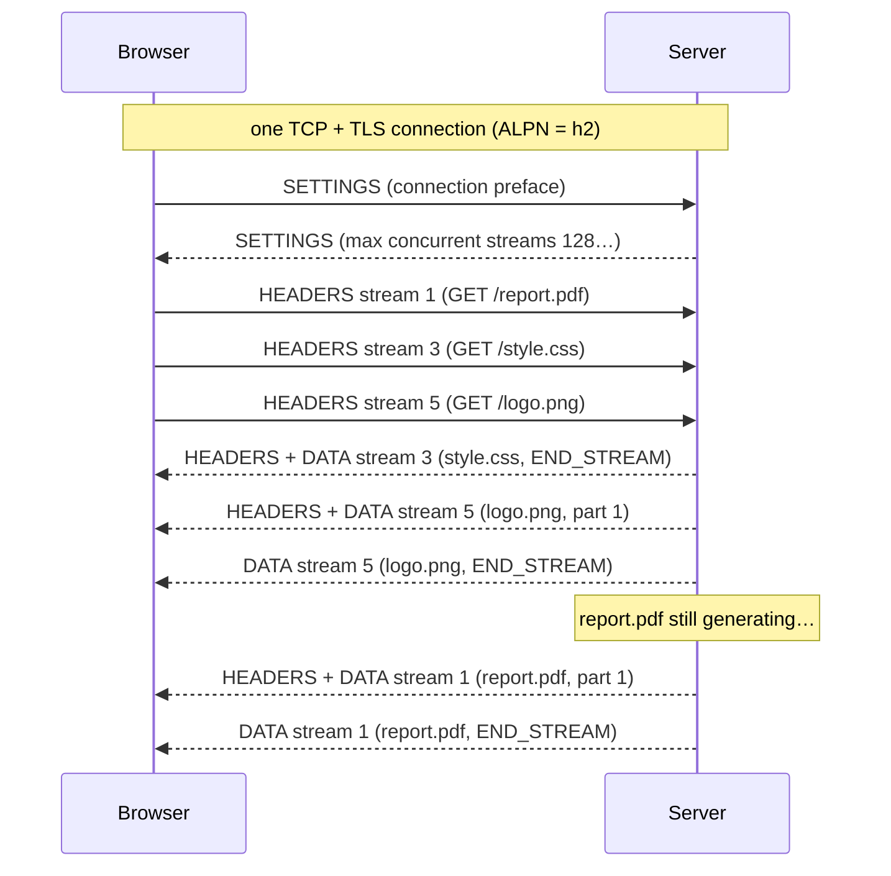
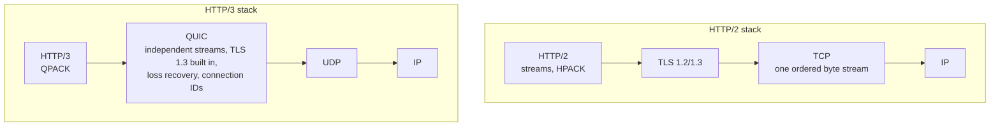

# HTTP2

> [!abstract] In one sentence
> HTTP/2 keeps **exactly the same meaning** as HTTP/1.1 (methods, paths, headers, status codes) but changes **how it travels**: messages are cut into **binary frames**, each request gets its own **stream**, and many streams are **interleaved on one TCP connection** at the same time. That kills HTTP-level head-of-line blocking and the need for 6 connections per host. HTTP/3 does the same over **QUIC** (UDP) to also escape TCP's head-of-line blocking.

## Common misconceptions

**Wrong mental model #1:** "HTTP/2 is a new API: my app has to change."

**What's actually true:** the **semantics are identical**. A `GET /products/42` with an `Accept` header and a `200 OK` with a JSON body means the same thing in HTTP/1.1 and HTTP/2. Only the **wire format** changes (binary frames instead of text lines). Usually the web server, proxy or library negotiates HTTP/2 and the application code doesn't notice.

**Wrong mental model #2:** "HTTP/2 completely fixes head-of-line blocking."

**What's actually true:** it fixes it at the **HTTP** level (a slow response no longer blocks the others on the connection). But all streams share **one TCP connection**, and TCP delivers bytes **in order**: if one packet is lost, **every stream waits** for its retransmission, even streams whose data already arrived. On a lossy network (mobile, Wi-Fi) HTTP/2 can be **worse** than several HTTP/1.1 connections. That's what **HTTP/3 over QUIC** fixes.

| Wrong mental model | What's actually true |
|---|---|
| HTTP/2 lets the server contact the client whenever it wants | The **client** still opens the connection. The server can only send on it (responses, and the now-dead "server push") |
| Server push = the server notifying the client | Server push sent **extra resources** (CSS, JS) the server guessed the page would need. Rarely helped, **removed from browsers** (Chrome 2022). Use `103 Early Hints` or preload instead |
| HTTP/2 requires TLS | The spec allows cleartext (**h2c**). **Browsers** only do HTTP/2 over TLS (negotiated with **ALPN**). Inside a data center, h2c is common (gRPC) |
| More connections = faster, so keep sharding domains | With HTTP/2, **one connection per origin** is best. Sharding and sprites make it slower (more handshakes, no shared compression) |
| An L4 load balancer spreads HTTP/2 requests across backends | It spreads **connections**. One long-lived HTTP/2 connection carrying 1,000 requests all land on **one** backend (the gRPC trap in [[Load balancing]]) |
| HTTP/2 is always faster | On a clean network with many small requests, yes. One large download: same. Lossy network: can be worse (TCP HOL) |

## What changed from HTTP/1.1

| | [[HTTP\|HTTP/1.1]] | HTTP/2 |
|---|---|---|
| Format | Text lines | **Binary frames** |
| Requests per connection at once | **1** | **Many** (streams, typically 100+ concurrent) |
| Connections per host (browser) | ~6 | **1** |
| End of a message | `Content-Length` or chunked | Frame lengths + an `END_STREAM` flag |
| Headers | Plain text, repeated in full on every request | **HPACK** compressed, repeated headers sent as tiny indexes |
| Cancel one request | Close the whole connection | `RST_STREAM` on that stream only |
| Graceful shutdown | Close and hope no request was in flight | `GOAWAY`: "finish what you have, start no new streams" |
| Priority | None | Stream priorities (barely used, simplified later) |

## Build-up: the product page again

Same page as in [[HTTP#Stage 4: head-of-line blocking]]: HTML, CSS, 2 scripts, 20 images, and a slow `/report.pdf`, from `shop.example.com` (`203.0.113.10`), 50 ms round trip.

### Stage 1: HTTP/1.1, six connections and a queue

The browser opens 6 connections (6 TCP + TLS handshakes), and each carries one request at a time. The slow `report.pdf` holds one of the six for 3 seconds. 24 requests over 6 pipes = at least 4 round trips of waiting, plus slow start on each connection.

### Stage 2: one connection, many streams

With HTTP/2 the browser opens **one** connection. During the TLS handshake, **ALPN** (Application-Layer Protocol Negotiation) settles the protocol: the client offers `h2, http/1.1`, the server picks `h2`. No extra round trip.

```bash
curl -sv --http2 -o /dev/null https://shop.example.com/ 2>&1 | grep -E "ALPN|HTTP/2"
# * ALPN: curl offers h2,http/1.1
# * ALPN: server accepted h2
# > GET / HTTP/2
# < HTTP/2 200
```

Then every request becomes a **stream** with its own ID (client-opened streams use **odd** numbers: 1, 3, 5…), and the frames of all streams are **interleaved** on the connection:



The slow `report.pdf` (stream 1) no longer blocks `style.css` and `logo.png`: they're answered as soon as they're ready, **out of order**, on the same connection. One handshake, one slow start, a congestion window that grows once and is shared by everything.

### Stage 3: frames, the unit on the wire

Everything on an HTTP/2 connection is a **frame**: a 9-byte header (length, type, flags, **stream ID**) and a payload.

| Frame | What it carries |
|---|---|
| `HEADERS` | A request's or response's headers (HPACK compressed) |
| `DATA` | Body bytes. The last one has the `END_STREAM` flag |
| `SETTINGS` | Connection parameters: max concurrent streams, window size, max frame size |
| `WINDOW_UPDATE` | **Flow control**: "you can send me N more bytes" (per stream and per connection) |
| `RST_STREAM` | Cancel **one** stream (user navigated away, client timeout) without touching the others |
| `PING` | Liveness check and RTT measurement (keeps idle connections alive through NATs) |
| `GOAWAY` | "I'm shutting down: last stream I'll handle is N, open new ones elsewhere" |
| `PUSH_PROMISE` | Server push (deprecated in practice) |

The request line becomes **pseudo-headers**, and header names are **lowercase**:

```
:method: GET
:scheme: https
:authority: shop.example.com      ← replaces the Host header
:path: /products/42
accept: application/json
```

Connection-management headers from HTTP/1.1 (`Connection`, `Keep-Alive`, `Transfer-Encoding`) are **forbidden**: the framing layer does those jobs. A proxy translating between the two must strip them.

### Stage 4: headers were the hidden cost

A typical browser request carries ~500–800 bytes of headers (cookies, user agent, accept…), **identical on every request**. 24 requests = ~15 KB of repeated text, which on a fresh connection can take several round trips just to upload.

**HPACK** compresses them:
- A **static table** of 61 common headers (`:method: GET` = index 2)
- A **dynamic table** both sides build per connection: after the first request, `cookie: session=…` is sent as a one-byte index
- **Huffman** coding for new strings

(Not plain gzip: compressing secrets alongside attacker-controlled text leaks them, the CRIME attack. HPACK was designed to avoid that.)

### Stage 5: the lossy network

The customer is on a train, 2% packet loss. A TCP segment carrying part of `logo.png` is lost. TCP must deliver bytes **in order**, so everything behind that segment (bits of `style.css`, `app.js`, the next HTML chunk) sits in the kernel buffer until the retransmission arrives, **one RTT or more later**. All 24 streams stall because of one packet of one image.

With six HTTP/1.1 connections, the loss would only have stalled **one** of them. That's **TCP head-of-line blocking**, and HTTP/2 can't fix it, because it lives below HTTP.

### Stage 6: HTTP/3 over QUIC

HTTP/3 keeps HTTP/2's ideas (streams, binary frames, header compression with **QPACK**) but replaces TCP + TLS with **QUIC**, a transport over **UDP**:



What QUIC changes:
- **Streams are independent at the transport level**: a lost packet only stalls the stream it belonged to
- **Faster setup**: transport and TLS 1.3 handshakes are combined (1 RTT, 0-RTT on resumption)
- **Connection migration**: the connection is identified by a **connection ID**, not the IP/port 4-tuple, so a phone switching from Wi-Fi to 4G keeps its connection (with TCP, a new IP = a new connection)
- Encrypted almost entirely, including most transport metadata, so middleboxes can't ossify it

How a client finds out: the first visit is over HTTP/2, and the server announces `Alt-Svc: h3=":443"`. The browser then tries QUIC on **UDP 443** and falls back to TCP if UDP is blocked (many corporate firewalls block it).

| | HTTP/1.1 | HTTP/2 | HTTP/3 |
|---|---|---|---|
| Transport | TCP | TCP | **QUIC over UDP** |
| Encryption | Optional TLS | TLS in practice (h2c possible) | **Always** (TLS 1.3 inside QUIC) |
| Parallel requests | Several connections | Streams on one connection | Streams on one connection |
| HTTP-level HOL blocking | Yes | No | No |
| Transport-level HOL blocking | Per connection | **Yes, all streams** | **No** |
| Handshake (new connection) | TCP + TLS: 2–3 RTT | Same | 1 RTT (0-RTT resumed) |
| Survives an IP change | No | No | Yes (connection IDs) |

## Advanced problems

### 1. Load balancing long-lived HTTP/2 connections

A gRPC client (gRPC = HTTP/2) opens **one** connection to the service through an **L4** load balancer and sends 5,000 requests/s on it. The L4 LB balanced **once**, when the connection was opened: all 5,000 requests go to the **same backend**, while the 4 others idle. Scaling out does nothing (new backends get no existing connections).

Fixes: an **L7** load balancer that understands HTTP/2 and balances **each request/stream** (Envoy, ALB with a gRPC target group), client-side load balancing over several connections, or a max connection age that forces periodic reconnects (`GOAWAY`). See [[Load balancing]].

### 2. HTTP/2 to the client, HTTP/1.1 to the backend

Most [[Reverse proxy|reverse proxies]] terminate HTTP/2 from browsers but talk **HTTP/1.1 to backends** (nginx's default, ALB's default target protocol). That's usually fine, but:
- The proxy needs a **pool** of backend connections, because each HTTP/1.1 connection handles one request at a time
- Headers must translate (`:authority` → `Host`), and forbidden headers stripped
- Request smuggling can appear in the downgrade if the proxy is sloppy about lengths

### 3. Too many concurrent streams, and Rapid Reset

A server limits concurrent streams (`SETTINGS_MAX_CONCURRENT_STREAMS`, often 100–128). Clients that need more must open another connection or queue.

In 2023, the **Rapid Reset** attack (CVE-2023-44487) abused stream cancellation: open a stream, immediately `RST_STREAM` it, repeat millions of times per second. The client never exceeds the concurrent limit, but the server does the work of setting up every request. Fixed in servers by rate-limiting resets; a reason to keep proxies patched.

### 4. Flow control stalls

Each stream and the connection have a **window** (default 64 KB). If a receiver is slow to send `WINDOW_UPDATE` (or a proxy has tiny windows), large downloads crawl even on a fast link. Symptom: big transfers over HTTP/2 much slower than over HTTP/1.1 through the same proxy. Fix: larger initial windows in the proxy/server config.

### 5. Idle connections and NATs

One long-lived connection carries everything, so if a NAT or firewall silently drops it after idle time (AWS NAT gateway: 350 s), the **next request hangs** until a timeout. HTTP/2 `PING` frames (and gRPC keepalives) keep it alive and detect dead connections early. The connection is still one the **client opened**, so the server can push frames on it, but can't open a new one (see [[Outbound-initiated connections]]).

## In AWS
- **ALB**: HTTP/2 from clients over HTTPS listeners. To targets: HTTP/1.1 by default, or **HTTP/2** / **gRPC** with the target group's protocol version (then it balances per request)
- **NLB**: L4, passes the HTTP/2 connection through untouched (balanced per connection: the gRPC trap)
- **CloudFront**: HTTP/2 and **HTTP/3** to viewers
- **API Gateway**, **AWS SDKs**: HTTP/2 used where supported (e.g. some streaming APIs)
- See [[Load balancers]], [[Proxies, load balancing and discovery in AWS]]

## Practice

> [!example]- Does switching a site to HTTP/2 require changing the application's routes and headers?
> No. Same semantics (methods, paths, headers, status). Only the framing on the wire changes, usually handled by the server or proxy.

> [!example]- How do client and server agree to use HTTP/2 over TLS?
> ALPN in the TLS handshake: the client offers `h2, http/1.1`, the server picks one.

> [!example]- One lost packet makes all requests on an HTTP/2 connection pause. Why, and what fixes it?
> TCP delivers bytes in order, so every stream waits for the retransmission (TCP head-of-line blocking). HTTP/3 over QUIC, where streams are independent at the transport.

> [!example]- gRPC traffic through an NLB lands on one backend. Why?
> gRPC uses one long-lived HTTP/2 connection. An L4 LB balances connections, not requests. Use an L7 LB with per-request balancing (ALB gRPC target group, Envoy) or client-side balancing.

> [!example]- Should I keep domain sharding and image sprites with HTTP/2?
> No. HTTP/2 multiplexes on one connection per origin. Sharding adds handshakes and splits header compression.

> [!example]- How does a browser learn a site supports HTTP/3?
> The `Alt-Svc: h3=":443"` header on an HTTP/1.1 or HTTP/2 response (or a DNS HTTPS record), then it tries QUIC on UDP 443 and falls back if blocked.

## Easy to get wrong
- Thinking HTTP/2 changes HTTP's meaning (it changes the framing)
- Believing HTTP/2 removes all head-of-line blocking: TCP's remains
- Mixing up server push (deprecated resource pushing) with the server initiating contact (still impossible)
- Expecting L4 load balancers to spread HTTP/2 or gRPC requests
- Keeping HTTP/1.1 performance hacks (sharding, sprites, bundling everything)
- Forgetting that browsers require TLS for HTTP/2, while h2c is fine between services
- Assuming the backend speaks HTTP/2 because the client did: proxies often downgrade
- Blocking UDP 443 and wondering why HTTP/3 never shows up (it falls back silently)
- Not keeping idle HTTP/2 connections alive with PINGs behind NATs

## Related
- Builds on:: [[HTTP]], *[[TCP and UDP]]*, [[TLS]], [[Sockets]]
- Two-way channel:: [[WebSocket]] (RFC 8441 over HTTP/2)
- Connections vs requests through NAT:: [[Outbound-initiated connections]]
- In the middle:: [[Reverse proxy]], [[Load balancing]], [[Service mesh]]
- AWS:: [[Load balancers]], [[Proxies, load balancing and discovery in AWS]]

## Flashcards
#flashcards

What does HTTP/2 change compared to HTTP/1.1? :: The wire format: binary frames, multiplexed streams on one connection, compressed headers. Semantics stay the same
What is an HTTP/2 stream? :: One request/response exchange, with its own ID, interleaved with others on the connection
Which stream IDs do clients use in HTTP/2? :: Odd numbers (1, 3, 5…)
How is HTTP/2 negotiated over TLS? :: ALPN: the client offers h2 and http/1.1, the server picks
What is h2c? :: HTTP/2 over cleartext TCP, not supported by browsers, common between services (gRPC)
What is HPACK? :: HTTP/2 header compression: static table, per-connection dynamic table, Huffman coding
What does RST_STREAM do? :: Cancels one stream without closing the connection
What does GOAWAY do? :: Graceful shutdown: tells the peer the last stream it will process, no new streams
What replaces the Host header in HTTP/2? :: The :authority pseudo-header
Which HTTP/1.1 headers are forbidden in HTTP/2? :: Connection-specific ones: Connection, Keep-Alive, Transfer-Encoding
Which head-of-line blocking does HTTP/2 remove, and which remains? :: Removes HTTP-level (slow response blocking others). TCP-level remains: one lost packet stalls all streams
What is HTTP/2 server push and its status? :: Server sends resources before they're requested. Removed from browsers, use 103 Early Hints or preload
What transport does HTTP/3 use? :: QUIC over UDP, with TLS 1.3 built in
What does QUIC fix compared to TCP for HTTP? :: Streams are independent, so a lost packet stalls only its stream. Also faster handshakes and connection migration
How does a browser discover HTTP/3? :: Alt-Svc header (h3) or a DNS HTTPS record, then tries UDP 443 with TCP fallback
Why does gRPC through an L4 load balancer hit one backend? :: One long-lived HTTP/2 connection carries all requests, and L4 balances connections
What was the HTTP/2 Rapid Reset attack? :: Opening and instantly cancelling streams at huge rates, making servers do work without hitting stream limits (CVE-2023-44487)
Default ALB protocol to targets? :: HTTP/1.1 (HTTP/2 or gRPC selectable per target group)
