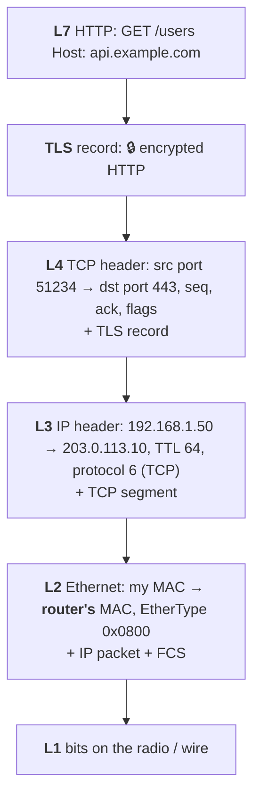
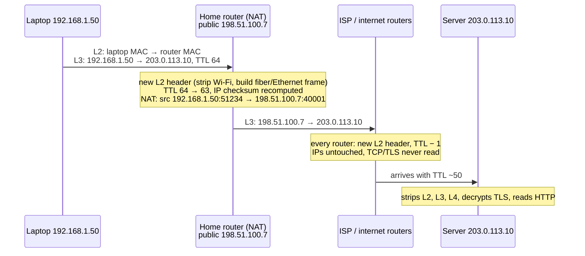
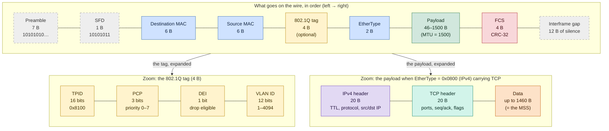

# Network layers

> [!abstract] In one sentence
> Every packet is a set of **nested envelopes**: the app's data goes into a TCP/UDP segment, that goes into an IP packet, that goes into an Ethernet frame. Each layer only reads its own envelope, and **each layer can be attacked and protected separately**. The **TCP/IP model** (4 layers) is what actually runs. The **OSI model** (7 layers) is the vocabulary everyone uses to say *where* something happens ("an L4 load balancer", "an L7 firewall").

This is my reminder note: the models, what's actually inside a frame, and where security lives at each layer, with links to the notes that go deeper.

## The misconception I had

**Wrong mental model:** "the internet runs on the OSI model's 7 layers, and every protocol sits neatly in one of them."

**What's actually true:**
- The internet runs on **TCP/IP**. OSI was a competing protocol suite in the 80s that lost. Its protocols are gone, but its **layer numbers** stuck as a shared language
- In practice only a few numbers are used: **L1** (cables/radio), **L2** (Ethernet, MAC addresses), **L3** (IP), **L4** (TCP/UDP ports), **L7** (the application: HTTP, DNS). L5 and L6 are rarely mentioned, and people argue about where TLS goes
- Plenty of protocols don't fit in one box, and that's fine:

| Protocol | Carried by | But its job is about | So it's "layer…" |
|---|---|---|---|
| [[ICMP]] | IP (protocol 1) | Errors and diagnostics for IP | L3, riding inside L3 |
| [[ARP]] | Ethernet directly (EtherType `0x0806`) | Finding the MAC for an IP | Between L2 and L3 |
| [[AS and BGP\|BGP]] | TCP port 179 | Building the IP routing table | An L7 app that controls L3 |
| **DHCP** | UDP 67/68 | Giving a host its IP address | An L7 app that configures L3 |
| [[TLS]] | TCP | Encrypting the app's bytes | "L4.5", or L6 depending on who you ask |
| **VXLAN**, [[IPsec and IKE\|IPsec]] tunnel mode, WireGuard | UDP / IP | Carrying whole frames or packets | L2 or L3 *inside* L4: tunnels break the neat stack on purpose |

## The two models side by side

| OSI # | OSI name | TCP/IP layer | Unit ("PDU") | Address | Device that works here | Examples | Deeper in |
|---|---|---|---|---|---|---|---|
| 7 | Application | **Application** | Message / data | Names, URLs | Proxy, WAF, ALB | HTTP, DNS, SSH, SMTP, BGP | [[Load balancers]], [[AWS WAF]], [[Route 53]] |
| 6 | Presentation | ↑ | | | | TLS (arguably), encoding, compression | [[TLS]] |
| 5 | Session | ↑ | | | | TLS sessions, RPC sessions | |
| 4 | Transport | **Transport** | **Segment** (TCP) / datagram (UDP) | **Port** | Stateful firewall, NLB, NAT | TCP, UDP, QUIC | [[Security groups]] |
| 3 | Network | **Internet** | **Packet** | **IP address** | Router | IPv4, IPv6, ICMP, IPsec | [[Routing tables]], [[ICMP]], [[IPsec and IKE]] |
| 2 | Data link | **Link** | **Frame** | **MAC address** | Switch, Wi-Fi access point | Ethernet, Wi-Fi (802.11), ARP, VLANs | [[Network interfaces]] |
| 1 | Physical | ↑ | Bits / symbols | | Cable, hub, radio | Copper, fiber, radio | |

> [!tip] How I remember which address belongs where
> **MAC** = next hop only (changes at every router). **IP** = end to end (stays the same across the internet, unless NAT). **Port** = which program on that host.

## Following one request down the stack and across the network

Scenario: my laptop `192.168.1.50` on home Wi-Fi runs `curl https://api.example.com/users`, and `api.example.com` is `203.0.113.10`.

### Going down the stack (encapsulation)



Before any of that can go out, the laptop needs two lookups:
1. **DNS** (L7 over UDP 53, or encrypted with DoH/DoT): `api.example.com` → `203.0.113.10`
2. **Routing + ARP**: `203.0.113.10` isn't on my subnet, so the [[Routing tables|route table]] says "via 192.168.1.1". ARP asks "who has 192.168.1.1?" and gets the router's MAC. **The destination MAC is the router's, not the server's.** I never learn the server's MAC

### Crossing the network (what changes at each hop)



What I should take from this:
- **L2 is rewritten at every hop.** Routers throw the frame away and build a new one for the next link
- **L3 stays the same end to end**, except the TTL (and the addresses if a NAT is in the path, see [[Overlapping address spaces]])
- **Routers don't read L4 and above.** Firewalls, NAT and load balancers do, and that's exactly what makes them "L4" or "L7" devices
- A **VPN** adds a second, outer set of L3/L4 headers around all of this (see [[VPN]]): two route lookups, two IP headers

## Inside the Ethernet frame

### The layout, byte by byte



How to read it:
- **Dashed grey** (preamble, SFD, interframe gap) = physical layer only. The NIC uses them and strips them, Wireshark never shows them, and they **don't count** in the 64–1518 B frame size
- **Blue** = the 14 B Ethernet header (18 B with the **yellow** VLAN tag). **Green** = the payload, which is the whole IP packet. **Red** = the trailer (FCS), checked and dropped by the receiving NIC
- The bottom zoom is the "nested envelopes" idea from the start of this note: the frame's payload is an IP packet, whose payload is a TCP segment, whose payload is the app's data. 20 + 20 + 1460 = 1500 = the MTU

| Field | Bytes | What it is |
|---|---|---|
| Preamble | 7 | `10101010…` so the receiver syncs its clock. Not seen by Wireshark |
| Start frame delimiter (SFD) | 1 | `10101011`: "the frame starts now" |
| **Destination MAC** | 6 | First, so a switch can start forwarding before the frame has fully arrived (cut-through) |
| **Source MAC** | 6 | The sender's MAC. Switches learn "this MAC is on this port" from it |
| *802.1Q VLAN tag* (optional) | 4 | TPID `0x8100` (2 bytes) + PCP priority (3 bits) + DEI (1 bit) + **VLAN ID (12 bits → 4 094 VLANs)** |
| **EtherType** | 2 | What's in the payload: `0x0800` IPv4, `0x86DD` IPv6, `0x0806` ARP, `0x8100` VLAN tag, `0x888E` 802.1X (EAPOL), `0x88E5` MACsec. A value ≤ 1500 means it's an old 802.3 *length* field instead |
| **Payload** | 46–1500 | The IP packet. **1500 is the MTU**. Padded up to 46 if smaller |
| **FCS** | 4 | CRC-32 checksum. A bad FCS = the frame is silently dropped. Detects corruption, **not tampering** (anyone can recompute a CRC) |
| Interframe gap | 12 (idle) | Silence between frames |

- **Header = 14 bytes** (18 with a VLAN tag). **Frame = 64 to 1518 bytes** (1522 tagged), counted from destination MAC to FCS
- Real cost on the wire per frame: 7 + 1 + 14 + 4 + 12 = **38 bytes** around the payload
- **Jumbo frames**: MTU ~9000. AWS uses **9001** inside a VPC, but traffic leaving through an internet gateway or a VPN is limited to **1500** (see [[VPC]])

### The MAC address

`3c:22:fb:9a:10:4e` = 48 bits:
- First 3 bytes = **OUI**, the vendor (Apple, Intel, AWS…)
- Lowest bit of the first byte = **I/G**: 0 unicast, 1 multicast/broadcast. `ff:ff:ff:ff:ff:ff` is broadcast
- Second-lowest bit = **U/L**: 1 means "locally administered", i.e. made up by software. Phones randomize their MAC per Wi-Fi network this way (privacy), and VMs/containers get generated ones (see [[Network interfaces]])

### The headers inside it

**IPv4 header (20 bytes without options):**

| Field | Why I care |
|---|---|
| Version, header length | `4`, usually 5 × 4 = 20 bytes |
| DSCP / ECN | QoS marking (voice first), congestion signal |
| Total length | Size of the whole packet |
| ID, flags (**DF** = don't fragment, MF), fragment offset | Fragmentation. DF + a too-small link + blocked ICMP = the **PMTUD black hole** from [[IPsec and IKE]] |
| **TTL** | Decremented at every router, dropped at 0 (with an ICMP "time exceeded" back: that's how `traceroute` works, see [[ICMP]]) |
| **Protocol** | What's inside: `1` ICMP, `6` TCP, `17` UDP, `47` GRE, `50` ESP. Why firewalls must allow "protocol 50" for IPsec |
| Header checksum | Recomputed at every hop because the TTL changes |
| **Source IP, destination IP** | 4 bytes each |

**IPv6 header (40 bytes, fixed):** version, traffic class, flow label, payload length, **next header** (same job as Protocol), **hop limit** (= TTL), 16-byte source and destination. No checksum, and **routers never fragment**: only the sender does, so ICMPv6 "packet too big" must never be blocked. ARP is replaced by **Neighbor Discovery** (ICMPv6).

**TCP header (20 bytes, up to 60 with options):**

| Field | Why I care |
|---|---|
| **Source port, destination port** | 2 bytes each. What security groups and NLBs match on |
| **Sequence / acknowledgment numbers** | Ordering and reliability. Guessing them is how blind TCP hijacking/RST injection worked |
| **Flags** | `SYN` open, `ACK` acknowledge, `FIN` close, `RST` abort, `PSH`, `URG`, `ECE`/`CWR` (congestion) |
| Window | How much the receiver can take (flow control) |
| Checksum | Corruption only, like the FCS |
| Options | **MSS**, window scaling, SACK, timestamps |

**UDP header (8 bytes):** source port, destination port, length, checksum. That's all: no connection, no order, no retransmission. QUIC, DNS, WireGuard and VPN tunnels build what they need on top.

### The numbers that come back everywhere

```
Ethernet MTU                        1500
 − IPv4 header                        20
 − TCP header                         20
 = TCP MSS                          1460   (1448 with TCP timestamps)

Inside WireGuard over IPv4: 1500 − 60 = 1420 MTU → MSS 1380
Inside IPsec: 1500 − ~50–80 → hence "clamp MSS to ~1380"
```

This is the arithmetic behind every "big packets hang in the VPN" problem in [[VPN]] and [[IPsec and IKE]].

## Security at each layer

The key idea: **each layer has its own attacks, and a protection at one layer only protects that layer's envelope and everything inside it, on the stretch of network where it's applied.** Nothing lower protects against a flaw higher up (TLS doesn't stop SQL injection), and nothing higher hides what the lower headers expose (TLS doesn't hide IP addresses).

| Layer | Typical attacks | Protections | In AWS / my notes |
|---|---|---|---|
| **L1** Physical | Tapping a cable, plugging into a free port, jamming Wi-Fi | Locked rooms, fiber, port shutdown | AWS data centers. [[VPN]] (Direct Connect is a private cable, **not** encrypted) |
| **L2** Data link | ARP spoofing, MAC flooding, VLAN hopping, rogue DHCP, Wi-Fi eavesdropping | 802.1X, port security, DHCP snooping, Dynamic ARP Inspection, **MACsec**, **WPA3** | The VPC has no real L2: see below |
| **L3** Network | IP spoofing, route hijacking (BGP), ICMP abuse, volumetric DDoS | [[ACL\|ACLs]], anti-spoofing filters (uRPF, BCP 38), **RPKI** for BGP, **IPsec / WireGuard** | NACLs, [[Security groups]], [[IPsec and IKE]], [[AS and BGP]], Shield |
| **L4** Transport | Port scans, SYN floods, RST injection, session hijacking | **Stateful firewalls**, SYN cookies, randomized sequence numbers | [[Security groups]] (stateful), NLB, Shield |
| **L5–6** | Downgrade attacks, fake certificates, stripping HTTPS | **TLS 1.3**, certificate validation, HSTS, [[mTLS]] | [[TLS]], [[Certificates and PKI]], [[Certificate Manager (ACM)]] |
| **L7** Application | SQL injection, XSS, broken auth, DNS spoofing, API abuse | Input validation, **WAF**, OAuth/JWT, rate limiting, **DNSSEC**, DoH/DoT | [[AWS WAF]], [[Load balancers\|ALB]], [[IAM]], [[Route 53]] |

### L2: attacks that only work on a shared LAN

Ethernet and ARP were designed for a trusted room. Nothing is authenticated:
- **ARP spoofing**: I answer "192.168.1.1 is at *my* MAC". Every victim now sends me its traffic (man in the middle). Defense: **Dynamic ARP Inspection** on the switch
- **MAC flooding**: I send thousands of frames with fake source MACs, the switch's MAC table fills up, and it starts **flooding** every frame to every port like a hub. Defense: **port security** (max N MACs per port)
- **VLAN hopping**: **double tagging** (an outer tag for the native VLAN, stripped by the first switch, then the inner tag delivers me into another VLAN), or pretending to be a switch to get a trunk. Defense: no native VLAN on trunks, disable auto-trunking (DTP)
- **Rogue DHCP**: I answer DHCP first and give victims *me* as their gateway and DNS. Defense: **DHCP snooping** (only trusted ports may answer)
- **Anyone plugging in**: **802.1X**, the port stays closed until the device authenticates with EAP (a certificate or credentials) against a RADIUS server
- **MACsec (802.1AE)**: encrypts frames **link by link** (switch to switch, or host to switch). Each switch decrypts and re-encrypts. Used on data center links and on Direct Connect

> [!info] Why ARP spoofing doesn't work in AWS
> A VPC isn't a real Ethernet segment. There's **no broadcast**, ARP requests are **answered by the VPC itself**, and every ENI only receives traffic for its own addresses. That's also why an EC2 instance acting as a router or VPN needs **source/destination check disabled** (see [[VPN]]): by default, AWS drops packets whose IPs aren't the instance's own.

### L3 and L4: the firewall layers

- **IP addresses are trivial to fake** in a packet you send. What protects you is that the *reply* goes to the real owner, so spoofing works for floods and one-way attacks, not for opening a TCP session. ISPs are supposed to drop packets with source IPs that couldn't come from their customers (**BCP 38**)
- **BGP** trusts what neighbors announce, so a network can announce someone else's prefix and pull their traffic (route hijack). **RPKI** lets an owner sign "only AS 64500 may originate this prefix" (see [[AS and BGP]])
- **Stateless vs stateful**: a stateless filter (AWS NACL, a router [[ACL]]) looks at each packet alone, so I must allow the reply's ephemeral ports explicitly. A **stateful** one ([[Security groups]]) tracks the TCP connection, so replies are allowed automatically and random `ACK` packets that don't belong to a connection are dropped
- **SYN flood**: send millions of SYNs and never finish the handshake, so the server fills its table of half-open connections. **SYN cookies** encode the state in the sequence number, so nothing is stored until the handshake completes
- **IPsec** protects at L3 (all traffic between two hosts/networks). **TCP itself has no encryption at all**: TLS does it one layer up

### L5–L7: where identity and content live

- [[TLS]] encrypts and authenticates the **application's bytes**, and proves the **server's name** with a certificate. [[mTLS]] proves the client too
- **QUIC** (HTTP/3) goes further: TLS 1.3 is built in and most of the **transport header is encrypted** too, so middleboxes can't read or tamper with it
- **DNS** is plain text by default. **DNSSEC** makes answers *authentic* (signed) but not private. **DoH/DoT** make queries *private* but only as trustworthy as the resolver
- The application still has to authenticate users and validate input. A perfectly encrypted TLS connection happily delivers an SQL injection. That's the **WAF**'s job, and ultimately the code's ([[AWS WAF]])

### What an eavesdropper actually sees

The best way I found to understand "where encryption happens": imagine someone capturing traffic on the café Wi-Fi, *after* the access point.

| Protection in use | What they can still see |
|---|---|
| Nothing (plain HTTP) | Everything: IPs, ports, URLs, cookies, passwords |
| **WPA3** on the Wi-Fi | Only protects the radio hop between me and the access point. After it, same as nothing |
| **TLS** (HTTPS) | My IP and the server's IP, ports, the **site name** (DNS query + SNI in the TLS handshake, unless ECH), timing and sizes. Not the URL path, headers or content |
| TLS + **ECH** + DoH | IPs, ports, sizes, timing. Not the site name, if the IP is shared (CDN) |
| **VPN** (IPsec / WireGuard) | Only that I talk to my VPN server, how much and when. **After** the VPN server, it's whatever is inside (TLS or not) again |
| **End-to-end** app encryption (Signal) | Even the server in the middle can't read the content |

→ Lower-layer encryption covers **more** (all headers above it) but over a **shorter distance** (one link for MACsec/WPA3, up to the VPN gateway for IPsec). Higher-layer encryption covers **less** of the packet but **all the way** to the other application. That's why good designs stack them (see [[IPsec vs TLS vs WireGuard vs SSH]]).

## Easy to get wrong
- Thinking the destination MAC is the final server's. It's always the **next hop**'s (usually my router)
- Thinking routers read ports. Plain routers stop at L3. Ports are read by firewalls, NAT, load balancers
- MTU = 1500 is the **payload** of the frame, i.e. the IP packet. The Ethernet header and FCS aren't counted
- Believing a checksum/FCS protects against tampering. It only detects accidents: integrity against attackers needs a MAC/AEAD (TLS, IPsec, MACsec)
- Blocking all ICMP "for security" and breaking path MTU discovery (and IPv6 entirely)
- Thinking HTTPS hides which site I visit: the IP, DNS and SNI usually give it away
- Thinking a VPN or TLS stops application attacks: they protect the pipe, not what goes through it

## Related
- Protocols:: [[DNS]], [[ICMP]], [[AS and BGP]], [[TLS]], [[IPsec and IKE]]
- Devices:: [[ARP]], [[Hubs, switches and routers]], [[VLAN]], [[Spanning Tree]], [[NAT and PAT]]
- L2:: [[Network interfaces]] (NICs, VLANs, bridges, tun/tap, VXLAN)
- L3:: [[Routing tables]], [[Policy-based routing]], [[Overlapping address spaces]]
- Security:: [[Encryption basics]], [[ACL]], [[mTLS]], [[Certificates and PKI]], [[IPsec vs TLS vs WireGuard vs SSH]]
- Tunnels (layers inside layers):: [[VPN]], [[Types of VPN]]
- AWS:: [[VPC]], [[Security groups]], [[Load balancers]], [[AWS WAF]], [[Route 53]]

## Flashcards
#flashcards

OSI vs TCP/IP model? :: TCP/IP (4 layers) is what runs. OSI (7 layers) survives as vocabulary for where things happen
Name the 7 OSI layers from 1 to 7 :: Physical, Data link, Network, Transport, Session, Presentation, Application
The 4 TCP/IP layers? :: Link, Internet, Transport, Application
PDU name at L2, L3, L4? :: Frame, packet, segment (TCP) / datagram (UDP)
Address used at L2, L3, L4? :: MAC address, IP address, port
Which address changes at every hop and which stays the same? :: MAC changes at every hop. IP stays end to end (except NAT)
When my laptop sends to a server on the internet, whose MAC is the destination? :: The next hop's (my router), found with ARP
What does a router change in a packet it forwards? :: A new L2 header, TTL − 1, a new IP checksum. Not the IPs (unless NAT)
Ethernet header size, and with a VLAN tag? :: 14 bytes (6 dst + 6 src + 2 EtherType), 18 with an 802.1Q tag
Min and max Ethernet frame size? :: 64 and 1518 bytes (1522 with a VLAN tag), from destination MAC to FCS
What does the EtherType say? :: What's in the payload: 0x0800 IPv4, 0x86DD IPv6, 0x0806 ARP, 0x8100 VLAN tag
How many VLANs can 802.1Q address and why? :: 4 094: a 12-bit VLAN ID minus 2 reserved values
What does the FCS protect against? :: Accidental corruption only (CRC-32). Not tampering
What does the U/L bit of a MAC address mean? :: Locally administered (software-generated) vs vendor-assigned
IPv4 protocol numbers for ICMP, TCP, UDP, ESP? :: 1, 6, 17, 50
Why is the IPv4 checksum recomputed at every hop? :: The TTL changes
Two key differences of the IPv6 header? :: Fixed 40 bytes with no checksum, and routers never fragment (so ICMPv6 must not be blocked)
TCP MSS on a normal Ethernet link? :: 1460 = 1500 − 20 (IP) − 20 (TCP)
How does traceroute use the TTL? :: Sends packets with TTL 1, 2, 3… Each router that drops one at 0 replies with ICMP time exceeded
Three L2 attacks and their switch defenses? :: ARP spoofing → Dynamic ARP Inspection. MAC flooding → port security. Rogue DHCP → DHCP snooping
What is 802.1X? :: Port-based access control: the port stays closed until the device authenticates (EAP, RADIUS)
MACsec vs IPsec? :: MACsec encrypts L2 frames link by link (decrypted at each switch). IPsec encrypts L3 packets end to end between two hosts/gateways
Why can't you ARP-spoof in an AWS VPC? :: No broadcast, ARP is answered by the VPC itself, ENIs only get their own traffic
Stateless vs stateful filter? :: Stateless (NACL) judges each packet alone, replies need explicit rules. Stateful (SG) tracks connections and allows replies
How do SYN cookies stop SYN floods? :: The server stores no state until the handshake completes, the state is encoded in the sequence number
What does RPKI protect? :: BGP: it lets an owner sign which AS may originate its prefixes, against route hijacks
DNSSEC vs DoH? :: DNSSEC authenticates answers (signed, not private). DoH/DoT encrypt queries (private, not signed)
What does an eavesdropper still see with HTTPS? :: IPs, ports, the site name (DNS + SNI unless ECH), sizes and timing
Lower-layer vs higher-layer encryption trade-off? :: Lower covers more headers but a shorter stretch (one link, up to the gateway). Higher covers less but all the way to the app
Does TLS stop SQL injection? :: No. It protects the pipe, not the content: input validation and a WAF do
