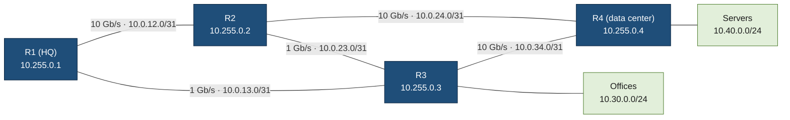
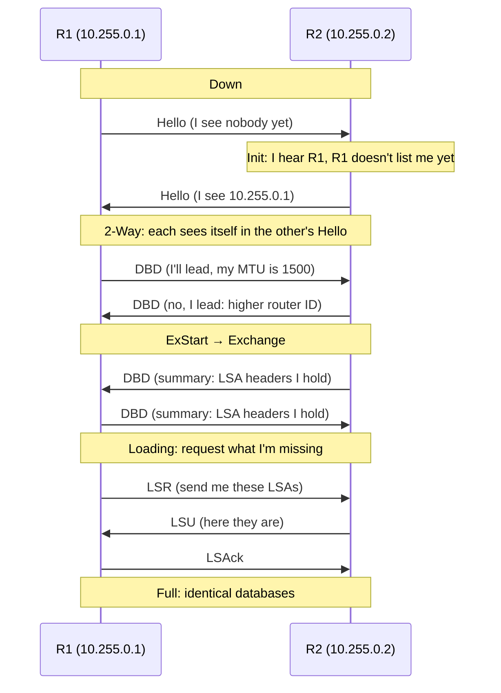
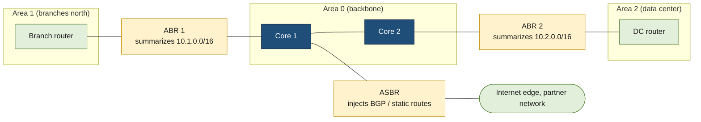

# OSPF

> [!abstract] In one sentence
> OSPF (Open Shortest Path First) is the routing protocol routers run **inside one organization**: every router describes its own links, floods that description to all the others so they all hold the **same map** of the network, and each one runs Dijkstra's shortest-path algorithm on that map to build its own routing table, and redoes it within seconds when a link fails.

## Build-up: four routers that need to find each other

Acme has a small network: an HQ (headquarters) router **R1**, two distribution routers **R2** and **R3**, and **R4** in front of the data center. Each router has a loopback address used as its identity (`10.255.0.1` to `10.255.0.4`), the links between routers are point-to-point `/31` subnets, and two LANs (local area networks) hang off the edge: `10.30.0.0/24` behind R3 (offices) and `10.40.0.0/24` behind R4 (servers).



The question every router has to answer: **for each destination, which neighbour do I hand the packet to?** That's what fills a routing table ([[Routing tables]]).

### Stage 1: static routes

The first way is to type every route by hand. On R1:

```bash
ip route add 10.40.0.0/24 via 10.0.12.1   # servers: via R2
ip route add 10.30.0.0/24 via 10.0.13.1   # offices: via R3
ip route add 10.255.0.4/32 via 10.0.12.1
# ... and the same for every other loopback and link subnet
```

**The problems:**
- **It doesn't scale.** Every router needs a route to every subnet it isn't directly on. With 4 routers and 11 subnets that's already about 30 lines; with 40 routers it's thousands, and each new subnet means touching every router
- **It doesn't react.** If the R1–R2 link dies, R1 keeps sending server traffic into a dead interface. A static route stays in the table as long as its interface is up, and a link can fail *beyond* the interface (a broken fibre on the far side, a dead switch in between) while the local port still looks fine
- **It doesn't use the redundancy.** Acme paid for five links precisely so there's another path. Static routes can't move traffic onto it by themselves

So routers need to **talk to each other** and work the routes out themselves. That's a dynamic routing protocol.

### Stage 2: routers that pass on rumours (distance-vector)

The oldest family of routing protocols, **distance-vector**, with RIP (Routing Information Protocol) as the classic example, works like gossip. Every 30 seconds each router tells its neighbours its whole table: "I can reach `10.40.0.0/24` in 1 hop". A neighbour adds one and passes it on: "I can reach it in 2 hops".

That works, but each router only knows **what its neighbours claim**, never the shape of the network. That causes three problems:
- **Slow convergence.** A failure spreads one neighbour per update cycle, so on a long chain it can take minutes for the news to reach the far end
- **Counting to infinity.** When R4's LAN disappears, R2 might hear from R3 "I can reach it in 2 hops" (an old rumour that originally came from R2 itself), believe it, and announce 3 hops. R3 then hears 3 and announces 4, and so on. RIP caps hop count at **15** (16 means unreachable) for exactly this reason, which also caps the network's diameter. Fixes like split horizon and poison reverse reduce the problem, but don't remove it
- **Hop count ignores speed.** RIP prefers R1 → R3 → R4 (2 hops over a 1 Gb/s link) to R1 → R2 → R4 (also 2 hops, all 10 Gb/s): it can't tell them apart

### Stage 3: everyone gets the same map (link-state)

OSPF works the other way round. A router doesn't pass on conclusions. It describes **only what it sees directly**: "I'm R3, I have a link to R1 with cost 100, a link to R2 with cost 100, a link to R4 with cost 10, and the subnet `10.30.0.0/24` with cost 10". That description is an **LSA (link-state advertisement)**.

Every router **floods** its LSAs to every other router unchanged, so after a moment every router holds the **same collection of LSAs**, the **LSDB (link-state database)**. Put together, the LSAs are a complete graph of the network: routers are nodes, links are edges, and each edge has a **cost**.

Then each router runs **SPF (shortest path first)**, which is Dijkstra's algorithm (*[[Dijkstra's algorithm]]*), on that graph **with itself as the root**. The result is a tree of shortest paths from that router to everything else, and the first hop of each path becomes the routing table entry.

The map is the same everywhere, but each router computes the tree from its own position, so the routes are different and consistent: there are no loops, because nobody is acting on a stale rumour.

**Running SPF by hand on R1.** Costs: 10 Gb/s links cost 10, 1 Gb/s links cost 100, the LAN interfaces cost 10.

| Step | Picked (lowest total so far) | What it updates |
|---|---|---|
| 0 | R1 (0) | R2 = 10 via R2, R3 = 100 via R3 |
| 1 | R2 (10) | R4 = 10 + 10 = **20** via R2. R3 through R2 = 10 + 100 = 110, worse than 100: no change |
| 2 | R4 (20) | R3 through R4 = 20 + 10 = **30**, better than 100: R3 = 30, **first hop R2**. Servers LAN = 20 + 10 = 30 |
| 3 | R3 (30) | Offices LAN = 30 + 10 = 40 |

R1's routing table ends up with **everything via R2**, including R3, even though R1 has a direct cable to R3: the direct link is a slow 1 Gb/s link (cost 100), and going R1 → R2 → R4 → R3 over three 10 Gb/s links costs 30. Hop count would have picked the direct cable.

Now the R1–R2 link fails. R1 and R2 each flood a new LSA without that link, every router reruns SPF, and on R1: R3 = 100 (direct), R4 = 110 via R3, servers = 120 via R3. Traffic moves to the backup path within about a second (with fast failure detection, see Stage 8).

> [!tip] The mental model
> Distance-vector: "tell your neighbours what you know". Link-state: "tell **everyone** who you're connected to, and let each router do its own maths". OSPF is link-state; so is IS-IS (Intermediate System to Intermediate System), its sibling used by many ISPs (internet service providers).

### Stage 4: neighbours and adjacencies

Before routers can exchange LSAs, they have to find each other. Every OSPF interface sends a **Hello** packet every **10 seconds** to the multicast address `224.0.0.5` ("all OSPF routers"). OSPF runs **directly on IP (Internet Protocol) as protocol number 89**, not over TCP (Transmission Control Protocol) or UDP (User Datagram Protocol). Firewalls and ACLs (access control lists) have to allow it as its own protocol.

A Hello carries the router's **router ID**, its area, its timers, its subnet mask and the list of neighbours it has already heard on that link. Two routers become neighbours only if these **match**:

| Must match | Why |
|---|---|
| Area ID | The two ends of a link must be in the same area |
| Hello and dead intervals | Default 10 s / 40 s on broadcast and point-to-point links. 40 s without a Hello and the neighbour is declared dead |
| Subnet and mask (on broadcast links) | Both ends must be on the same IP subnet |
| Authentication type and key | Otherwise the packets are dropped silently |
| Area type flags (stub, NSSA) | Both must agree on what the area accepts (Stage 6) |
| Network type | Not checked, but a mismatch (one side point-to-point, the other broadcast) gives neighbours that never fully sync routes |
| MTU (maximum transmission unit) | Checked a step later, during the database exchange (the classic "stuck in ExStart") |

The **router ID** is a 32-bit number written like an IPv4 (Internet Protocol version 4) address. It's how a router names itself in every LSA, so it must be **unique** and **stable**. I always set it by hand to the loopback address; otherwise implementations pick one from the interface addresses, and it can change after a reboot.

Becoming neighbours and syncing databases goes through a fixed sequence of states:



The five OSPF packet types are all in that diagram: **Hello**, **DBD (database description)**, **LSR (link-state request)**, **LSU (link-state update)** and **LSAck (link-state acknowledgement)**. Only **Full** means the two routers have the same database. After that, only Hellos keep flowing, plus an LSU whenever something changes. Each LSA is also **re-flooded every 30 minutes** by its owner and expires after **1 hour** (MaxAge), so a router that disappears without saying anything doesn't leave its LSAs behind for ever.

### Stage 5: many routers on one shared segment (DR and BDR)

Acme later puts five routers on one shared Ethernet segment (a server VLAN (virtual LAN) where firewalls and routers all meet). If every router became fully adjacent with every other, that's n(n−1)/2 adjacencies: 10 for 5 routers, 190 for 20. Each change would be flooded over all of them.

On **broadcast** network types OSPF elects a **DR (designated router)** and a **BDR (backup designated router)**:
- Every router becomes **Full** only with the DR and BDR. With the others it stays in **2-Way**, which is **normal**, not a fault
- A router sends its updates to the DR/BDR at `224.0.0.6` ("all designated routers"), and the DR re-floods them to everyone at `224.0.0.5`
- The DR also writes one LSA describing the segment itself (type 2, below)

**The election**: highest interface **priority** wins (default 1; priority **0** means "never become DR"), and on a tie the highest router ID wins. The election is **not pre-emptive**: a router with a higher priority that joins later doesn't take over. The DR stays until it fails, then the BDR takes over and a new BDR is elected. So "which router is DR" depends on which one booted first, unless priorities are set deliberately.

**On a link with only two routers, DR/BDR is pointless**, and the election adds a few seconds of delay (the wait timer) every time the link comes up. On Ethernet links between two routers (like all of Acme's `/31` links) I set the network type to **point-to-point**: no election, faster adjacency, and `/31` addressing works cleanly.

### Stage 6: the cost of a link, and the reference bandwidth trap

The cost of an interface is, by default, **reference bandwidth ÷ interface bandwidth**, with a reference of **100 Mb/s** (a value chosen in the 1990s):

| Interface | Default cost (reference 100 Mb/s) | Cost with reference 100 Gb/s |
|---|---|---|
| 10 Mb/s | 10 | 10 000 |
| 100 Mb/s | 1 | 1000 |
| 1 Gb/s | **1** | 100 |
| 10 Gb/s | **1** | 10 |
| 100 Gb/s | **1** | 1 |

With the default, everything from 100 Mb/s upwards costs 1: OSPF falls back to **counting hops**, which is the RIP problem from Stage 2. On Acme's network, R1 would send office traffic over the slow direct link (cost 1 + 1) instead of the 10 Gb/s path (cost 1 + 1 + 1). The fix is to raise the reference bandwidth (`auto-cost reference-bandwidth 100000`, in Mb/s) **on every router**, or to set costs explicitly per interface. A mismatched reference across routers gives inconsistent costs: still loop-free (everyone computes on the same LSDB with the costs each router advertised), but not the paths anyone intended.

**Equal costs.** When two paths have the same total cost, OSPF installs **both** and the router spreads traffic across them per flow: ECMP (equal-cost multi-path, see [[High availability networking]]). Data center designs rely on this.

### Stage 7: the network grows (areas)

Acme grows to 200 routers across HQ, three branch regions and two data centers. A single link-state domain starts to hurt:
- **Every** link flap anywhere floods an LSA to **every** router, and **every** router reruns SPF
- Every router stores the whole LSDB, including every `/31` link in a branch on the other side of the country
- One unstable link in a remote branch keeps the CPUs (central processing units) of all 200 routers busy

OSPF splits the network into **areas**. Inside an area, routers share the full map. Between areas, only **summaries** cross ("I can reach these prefixes at this cost"), not the topology. A flap inside area 1 reruns SPF only inside area 1; the other areas just see a summary route change, or nothing at all if the change is hidden behind a summarized prefix.



The rules:
- **Area 0 is the backbone.** Every other area must touch area 0, and traffic between two non-backbone areas always passes through area 0. It's a two-level hierarchy, not a free-form mesh of areas
- An **ABR (area border router)** has interfaces in area 0 and another area. It holds one LSDB per area and turns each area's routes into summaries for the others
- An **ASBR (autonomous system boundary router)** brings in routes from **outside** OSPF: static routes, BGP (Border Gateway Protocol, see [[AS and BGP]]), a connected network that isn't running OSPF
- **Summarization happens only at ABRs and ASBRs.** If the branch region was addressed as one block (`10.1.0.0/16`, see [[IP address planning]]), ABR 1 advertises that one prefix into area 0 instead of 300 small ones. This is where a good address plan pays off

**The LSA types** are just "which kind of fact, and who writes it":

| Type | Name | Written by | Describes | Flooded |
|---|---|---|---|---|
| 1 | Router LSA | Every router | Its own links and their costs | Inside its area |
| 2 | Network LSA | The DR | A broadcast segment and the routers on it | Inside its area |
| 3 | Summary LSA | ABR | A prefix from another area, with a cost | Into the neighbouring area |
| 4 | ASBR summary | ABR | How to reach an ASBR in another area | Into the neighbouring area |
| 5 | External LSA | ASBR | A route from outside OSPF | Everywhere except stub areas |
| 7 | NSSA external | ASBR inside an NSSA | An external route that starts in an NSSA | Inside the NSSA, turned into type 5 by the ABR |

**Area types** let a small area receive less:

| Area type | Blocks | Gets instead | Typical use |
|---|---|---|---|
| Normal | Nothing | Everything | Backbone, big areas |
| Stub | External routes (type 5) | A default route from the ABR | A branch with a single way out |
| Totally stubby | Externals and inter-area routes (types 3, 4, 5) | Only a default route | A branch router that only needs "everything else is that way" |
| NSSA (not-so-stubby area) | External routes from elsewhere | A default route, but can have its **own** ASBR (type 7) | A branch with its own small external connection (a partner link) |

**External routes come in two flavours.** E2 (type 2, the default) keeps the cost the ASBR set, whatever the distance to the ASBR, so every router sees the same number. E1 (type 1) adds the internal cost to reach the ASBR, so with two exits each router picks the **nearest**. With two internet exits, E1 is usually what's wanted. When several kinds of route lead to the same prefix, OSPF prefers **intra-area > inter-area > E1 > E2**, whatever the costs.

### Stage 8: converging fast

Detecting a failure is the slow part. A dead neighbour behind a still-up port (fibre cut on the far side, a switch in the middle) is only noticed when the **dead interval** expires: 40 seconds of black-holed traffic by default.

- **BFD (Bidirectional Forwarding Detection)** is a separate lightweight protocol that exchanges packets every few hundred milliseconds (say 300 ms × 3 = under a second) and tells OSPF "neighbour gone" immediately. It's the standard fix, rather than shrinking Hello timers
- **SPF throttling**: after a change a router waits a few milliseconds before running SPF (to batch several LSAs from the same failure), and backs off exponentially if changes keep coming, so a flapping link can't keep every CPU at 100 %
- **Graceful restart**: a router restarting its OSPF process (a software upgrade) asks its neighbours to keep forwarding through it for a minute instead of tearing everything down, since its forwarding hardware is still working

### Stage 9: securing it

OSPF trusts whatever arrives on an interface where it runs. A laptop plugged into a port where OSPF is enabled can announce `0.0.0.0/0` or the CEO's subnet and pull traffic towards itself.

- **Passive interfaces**: on LANs with hosts (the offices LAN), the subnet is advertised but no Hellos are sent and none are accepted. My default is "passive everywhere, active only on links to other routers"
- **Authentication**: OSPFv2 supports keyed hashes on every packet. MD5 (Message Digest 5) is old; the current option is HMAC-SHA (hash-based message authentication code with a secure hash algorithm, for example HMAC-SHA-256) with a key chain, so keys can be rotated without dropping adjacencies. It proves the sender knows the key; it doesn't encrypt anything
- **Filter protocol 89** at the edges, so OSPF packets from outside are never accepted

### Stage 10: IPv6 (OSPFv3)

The OSPF above is **OSPFv2**, which carries IPv4 only. For IPv6 (Internet Protocol version 6) there's **OSPFv3**, with the same ideas (areas, LSAs, SPF, DR/BDR) and some changes: it runs over IPv6 **link-local** addresses, its multicast addresses are `FF02::5` and `FF02::6`, the router ID is still a 32-bit number (so set it by hand, even on an IPv6-only router), and authentication uses an authentication trailer or IPsec instead of the v2 mechanism. Modern implementations can carry IPv4 too in OSPFv3 (address families), but many networks still run v2 for IPv4 and v3 for IPv6 side by side.

## Configuring it: Acme's lab in FRRouting

FRRouting (FRR) is the open-source routing suite used on Linux routers, in containers and on many network operating systems. Cisco and Juniper syntax differs, but the same settings appear. This is R1's `/etc/frr/frr.conf` (the `ospfd` daemon has to be enabled in `/etc/frr/daemons`):

```text
frr defaults traditional
hostname r1
!
interface lo
 ip address 10.255.0.1/32
 ip ospf area 0
!
interface eth1
 description to-r2 (10 Gb/s)
 ip address 10.0.12.0/31
 ip ospf area 0
 ip ospf network point-to-point
 ip ospf cost 10
 ip ospf authentication message-digest
 ip ospf message-digest-key 1 md5 lab-only-key
!
interface eth2
 description to-r3 (1 Gb/s)
 ip address 10.0.13.0/31
 ip ospf area 0
 ip ospf network point-to-point
 ip ospf cost 100
 ip ospf authentication message-digest
 ip ospf message-digest-key 1 md5 lab-only-key
!
router ospf
 ospf router-id 10.255.0.1
 auto-cost reference-bandwidth 100000
 passive-interface default
 no passive-interface eth1
 no passive-interface eth2
!
```

What each part does:
- `ip ospf area 0` on an interface enables OSPF there and puts the connected subnet into area 0. (The older style is `network 10.0.0.0/16 area 0` under `router ospf`, matching interfaces by address)
- `network point-to-point`: no DR election on two-router links (Stage 5)
- `cost`: explicit costs, because virtual interfaces in a lab don't report a real speed. On real hardware, the reference bandwidth does it
- `passive-interface default`, then re-enabling only the router links: the loopback and LANs are advertised but nobody can form a neighbourship on them (Stage 9)
- MD5 keeps the lab simple; in production I'd use a key chain with HMAC-SHA

R3 and R4 also carry their LAN interface, passive:

```text
interface eth3
 description offices LAN
 ip address 10.30.0.1/24
 ip ospf area 0
 ip ospf cost 10
```

To build the lab on a laptop, containerlab starts one FRR container per router and wires them with virtual links (pin a current FRR image tag):

```yaml
# ospf-lab.clab.yml
name: ospf-lab
topology:
  defaults:
    kind: linux
    image: quay.io/frrouting/frr:10.1.1
  nodes:
    r1: { binds: [r1/frr.conf:/etc/frr/frr.conf, daemons:/etc/frr/daemons] }
    r2: { binds: [r2/frr.conf:/etc/frr/frr.conf, daemons:/etc/frr/daemons] }
    r3: { binds: [r3/frr.conf:/etc/frr/frr.conf, daemons:/etc/frr/daemons] }
    r4: { binds: [r4/frr.conf:/etc/frr/frr.conf, daemons:/etc/frr/daemons] }
  links:
    - endpoints: ["r1:eth1", "r2:eth1"]
    - endpoints: ["r1:eth2", "r3:eth1"]
    - endpoints: ["r2:eth2", "r4:eth1"]
    - endpoints: ["r2:eth3", "r3:eth2"]
    - endpoints: ["r3:eth3", "r4:eth2"]
```

```bash
sudo containerlab deploy -t ospf-lab.clab.yml
docker exec -it clab-ospf-lab-r1 vtysh     # FRR's shell, Cisco-like
```

### Checking it

**Neighbours** (the first thing to look at):

```text
r1# show ip ospf neighbor

Neighbor ID     Pri State           Up Time         Dead Time Address         Interface                RXmtL RqstL DBsmL
10.255.0.2        1 Full/-          00:12:41          36.118s 10.0.12.1       eth1:10.0.12.0               0     0     0
10.255.0.3        1 Full/-          00:12:39          33.904s 10.0.13.1       eth2:10.0.13.0               0     0     0
```

`Full/-`: fully synchronized, and `-` means no DR role (point-to-point). On a broadcast segment it would read `Full/DR`, `Full/BDR` or `2-Way/DROther`.

**The database** (the map every router shares):

```text
r1# show ip ospf database

       OSPF Router with ID (10.255.0.1)

                Router Link States (Area 0.0.0.0)

Link ID         ADV Router      Age  Seq#       CkSum  Link count
10.255.0.1     10.255.0.1       512 0x80000004 0x6a1c 5
10.255.0.2     10.255.0.2       508 0x80000005 0x91d2 7
10.255.0.3     10.255.0.3       505 0x80000006 0x3b07 8
10.255.0.4     10.255.0.4       503 0x80000004 0xc4e9 6
```

Four router LSAs (type 1), one per router, each with a sequence number that goes up every time its owner changes it. The same command on R4 shows the same four lines: that's the "same map everywhere" property, and the quickest check when routes look inconsistent.

**The result** (what SPF put in the routing table):

```text
r1# show ip route ospf
O>* 10.30.0.0/24 [110/40] via 10.0.12.1, eth1, weight 1, 00:11:58
O>* 10.40.0.0/24 [110/30] via 10.0.12.1, eth1, weight 1, 00:11:58
O>* 10.255.0.3/32 [110/30] via 10.0.12.1, eth1, weight 1, 00:11:58
O>* 10.255.0.4/32 [110/20] via 10.0.12.1, eth1, weight 1, 00:11:58
```

`[110/40]` is **administrative distance / metric**: 110 is OSPF's trust rank against other route sources ([[Routing tables]]), 40 the total cost computed in Stage 3. Everything goes via R2, as calculated by hand. Then `ip link set eth1 down` inside R1 and `show ip route ospf` again: every route now goes via `10.0.13.1` (R3) with the higher costs.

## OSPF next to the other routing protocols

| | Static | RIP | OSPF | IS-IS | BGP |
|---|---|---|---|---|---|
| Kind | Manual | Distance-vector | Link-state | Link-state | Path-vector |
| Where | Small edges, defaults | Legacy only | **Inside** an organization: campus, enterprise WAN (wide area network), data centers | Inside large ISPs and some data centers | **Between** organizations, and large data center fabrics |
| Chooses by | What's typed | Hop count | Cost (bandwidth) | Cost | Policies and attributes |
| Scales to | Tens of routes | 15 hops | Hundreds of routers per area, with areas | Similar or larger, simpler flooding | The whole internet |
| Runs over | Nothing | UDP 520 | IP protocol 89 | Directly on layer 2 (not IP) | TCP 179 |

The usual combination: **OSPF (or IS-IS) inside, BGP at the edges**. OSPF quickly finds the routers' own loopbacks and links, and BGP carries the many customer or internet prefixes on top, using those loopbacks as next hops. Large data centers increasingly run BGP everywhere instead (one AS (autonomous system) per rack), because it scales and filters better, but OSPF stays common in enterprises.

## Advanced problems

### 1. Neighbours stuck in ExStart or Exchange
**Symptom:** `show ip ospf neighbor` shows `ExStart` or `Exchange` for minutes, the state sometimes cycling back. **Cause:** almost always an **MTU mismatch**: one side's interface is 9000 (jumbo frames), the other 1500. The DBD packets from the bigger side are rejected, and the exchange never finishes. **Fix:** make the MTUs match. `ip ospf mtu-ignore` hides the symptom but leaves real packets at risk of being dropped when an LSU is larger than the smaller MTU.

### 2. Neighbour stuck in Init
**Symptom:** I see the neighbour, but it never sees me. **Cause:** Hellos go one way only: an ACL or firewall dropping protocol 89 in one direction, multicast blocked by a switch feature, or a unidirectional link. **Fix:** capture on both ends (`tcpdump -ni eth1 proto 89`) and find where the Hellos stop.

### 3. No neighbour at all
**Symptom:** the neighbour never appears. **Cause:** something from the "must match" table differs: area ID, Hello/dead timers, subnet mask, authentication key, stub flag. The interface may also be passive by mistake. **Fix:** compare `show ip ospf interface` on both ends, and turn on adjacency logging (`debug ospf event` or the vendor equivalent). Authentication mismatches usually log a message; others are silent.

### 4. "Only 2-Way" on a shared segment
**Symptom:** on a VLAN with five routers, most pairs sit in `2-Way`. **Cause:** that's the design: only DR and BDR are fully adjacent with everyone (Stage 5). It's only a problem if **no** router is Full with a DR, for example because every router has priority 0.

### 5. Traffic takes the slow link
**Symptom:** a 1 Gb/s backup link carries traffic while a 10 Gb/s path sits idle. **Cause:** the default 100 Mb/s reference bandwidth gives both links cost 1, so OSPF counts hops (Stage 6). **Fix:** set the same `auto-cost reference-bandwidth` on **every** router, then check costs with `show ip ospf interface`.

### 6. Duplicate router ID
**Symptom:** routes flap and LSAs keep changing with no link failing; logs mention a duplicate router ID or a self-originated LSA with a higher sequence number. **Cause:** two routers use the same router ID (a config copied from another router, cloned virtual machine images). Each one keeps overwriting the other's LSA. **Fix:** a unique, configured router ID per router, from the loopback address plan, then restart the OSPF process (the router ID only changes on a restart).

### 7. Partitioned area 0
**Symptom:** after a core link fails, two halves of the network can't reach each other although a path exists through another area. **Cause:** inter-area traffic must cross area 0. If area 0 splits, a path through area 1 doesn't help, because summaries aren't passed through non-backbone areas. **Fix:** design area 0 with redundant links. **Virtual links** (a tunnel of area 0 through another area) exist as a workaround, but they're fragile and a sign of a design problem.

### 8. Redistribution loops
**Symptom:** after two routers both redistribute between OSPF and BGP (or two OSPF instances), routes bounce around, the CPU spikes, prefixes point the wrong way. **Cause:** a route goes from OSPF into BGP on one router, back from BGP into OSPF on the other, and comes back as an external route that wins. **Fix:** tag routes when redistributing and refuse tagged routes at the other point, redistribute only the prefixes needed (filtered by a prefix list), and prefer a single redistribution point if possible.

### 9. A flapping link keeps the network busy
**Symptom:** high CPU on every router in the area, routes changing every few seconds. **Cause:** a dirty fibre or an unstable WAN circuit going up and down, each change flooded and triggering SPF everywhere. **Fix:** SPF and LSA throttling (usually defaults are fine), interface dampening, and putting unstable WAN links in their own area so only that area recomputes. Then fix the physical link.

## In the cloud

Cloud networks don't run OSPF in the tenant's view. In AWS (Amazon Web Services), the VPC (Virtual Private Cloud) router and its route tables are managed by AWS: there is no OSPF neighbour to form with them, and multicast (which OSPF Hellos use) isn't supported in a VPC by default. Dynamic routing towards AWS is **BGP**: Site-to-Site VPN (virtual private network), Direct Connect and the transit gateway all speak BGP ([[BGP in AWS hybrid networking]]).

So in a hybrid network, OSPF stays **on premises**: the edge router learns AWS prefixes over BGP and redistributes them into OSPF (as externals, ideally summarized), and announces the on-premises summary back to AWS over BGP. The redistribution loop from problem 8 is the trap to watch when two edge routers do this. OSPF can run between EC2 (Elastic Compute Cloud) instances only over tunnels they build themselves (GRE (Generic Routing Encapsulation) or IPsec), for example between virtual routers from a network vendor.

## Practice

> [!example]- In Acme's network, the R2–R4 link fails. What is R1's path and cost to the servers LAN `10.40.0.0/24`?
> Remaining paths: R1 → R2 → R3 → R4 = 10 + 100 + 10 = 120, plus 10 for the LAN = 130. R1 → R3 → R4 = 100 + 10 = 110, plus 10 = **120 via R3**. The direct 1 Gb/s link to R3 now wins.

> [!example]- Four routers on one VLAN: A (priority 1, router ID 10.255.0.9), B (priority 1, ID 10.255.0.2), C (priority 0, ID 10.255.0.50), D (priority 10, ID 10.255.0.1). All boot at the same time. Who is DR and BDR? Later, E (priority 100) joins: what changes?
> D is DR (highest priority, 10). A and B both have priority 1, so the higher router ID wins: A (10.255.0.9) is BDR. C can never be elected (priority 0). E joining changes **nothing**: the election isn't pre-emptive. E becomes DR only if D and then A fail.

> [!example]- Two routers connected with a cable stay in ExStart. Hellos are fine. What do I check first?
> The MTU on both interfaces. Hellos are small and pass; DBD packets reveal the mismatch.

> [!example]- A branch area has one ABR and no other way out. It holds 5000 external routes it doesn't need. What do I change?
> Make it a **stub** area (externals replaced by a default route) or **totally stubby** (inter-area routes replaced too). Every router in the area must agree on the stub flag, or adjacencies drop.

> [!example]- Why can't R1 just advertise its routing table to its neighbours like RIP, if every router ends up with a table anyway?
> Because a table is a conclusion: the receiver can't check it, and stale conclusions cause loops and count-to-infinity. LSAs are facts about direct links; every router builds the same map from them and computes its own loop-free tree.

## Easy to get wrong

- OSPF is **not** a TCP or UDP protocol: it's IP protocol 89. A firewall rule for "port 89" does nothing
- `2-Way` between two routers on a broadcast segment is **normal** when neither is DR/BDR. On a point-to-point link it isn't
- The DR election **doesn't pre-empt**: raising a priority doesn't make that router DR until the current DR and BDR go away
- The default reference bandwidth (100 Mb/s) makes 1, 10 and 100 Gb/s links all cost 1. Change it on **all** routers, or set costs explicitly
- The router ID is chosen when the process starts; changing the configured value needs a process restart. Duplicate IDs cause flapping that looks like a link problem
- Summarization happens **only at ABRs and ASBRs**, never inside an area
- Every area has to connect to area 0, and inter-area traffic always passes through it
- E2 external routes keep the same metric everywhere (the distance to the ASBR is ignored); E1 adds it. Intra-area beats inter-area beats E1 beats E2, regardless of cost
- Authentication proves the sender knows a key; it doesn't encrypt routing information
- An interface left non-passive on a user LAN lets anyone with a router (or a laptop running FRR) inject routes

## Related
- Depends on:: [[Routing tables]], [[IP addressing and subnetting]], [[Network layers]]
- Algorithm:: *[[Dijkstra's algorithm]]* (SPF), [[Breadth-first search]] (flooding)
- Address design it relies on:: [[IP address planning]] (summarizable blocks per area)
- Differs from:: [[AS and BGP]] (between organizations, policies instead of shortest paths), [[Spanning Tree]] (loop prevention at layer 2 instead of shortest paths at layer 3)
- Used with:: [[High availability networking]] (ECMP), *[[First-hop redundancy (VRRP)]]* (the default gateway for hosts), [[Policy-based routing]]
- In AWS:: [[BGP in AWS hybrid networking]] (where OSPF stops and BGP takes over)
- Area:: [[Networking]]

## Flashcards
#flashcards

What is OSPF? :: A link-state interior routing protocol: routers flood descriptions of their own links, all build the same map (LSDB) and each runs Dijkstra (SPF) to compute its routes
Link-state vs distance-vector? :: Link-state routers share facts about their own links with everyone and compute paths themselves; distance-vector routers pass on their conclusions (routes and distances) to neighbours
What is an LSA? :: A link-state advertisement: one router's description of its links and costs (or a summary/external route), flooded through the area
What is the LSDB? :: The link-state database: the collection of all LSAs in an area, identical on every router in it
What algorithm does OSPF use to compute routes? :: Dijkstra's shortest path first (SPF), with the router itself as the root
What transport does OSPF use? :: Directly IP, protocol number 89 (not TCP or UDP)
OSPF multicast addresses? :: 224.0.0.5 all OSPF routers, 224.0.0.6 all DR/BDR routers (FF02::5 and FF02::6 in OSPFv3)
Default OSPF hello and dead intervals? :: 10 s and 40 s on broadcast and point-to-point networks
What must match for two routers to become OSPF neighbours? :: Area ID, hello/dead timers, subnet and mask, authentication, area type (stub/NSSA) flags; MTU is checked during the database exchange
OSPF neighbour states in order? :: Down, Init, 2-Way, ExStart, Exchange, Loading, Full
Neighbours stuck in ExStart/Exchange: most likely cause? :: MTU mismatch between the two interfaces
What is the OSPF router ID? :: A unique 32-bit identifier written like an IPv4 address, best set by hand to the loopback address
Why do DR and BDR exist? :: On a shared segment, routers become fully adjacent only with the DR and BDR, avoiding n(n-1)/2 adjacencies and duplicated flooding
How is the DR elected? :: Highest interface priority (0 = never), then highest router ID; not pre-emptive
Is 2-Way between two routers a problem? :: Not on a broadcast segment when neither is DR/BDR: it's normal. On a point-to-point link it means they never synced
Default OSPF cost formula and its trap? :: Reference bandwidth (100 Mb/s) / interface bandwidth, so 100 Mb/s and faster all cost 1. Raise the reference on every router
What is area 0? :: The backbone area: every other area must connect to it and inter-area traffic passes through it
ABR vs ASBR? :: ABR connects area 0 to another area and summarizes between them; ASBR injects routes from outside OSPF (static, BGP)
Where can OSPF summarize routes? :: Only at ABRs (inter-area) and ASBRs (external), never inside an area
LSA types 1, 2, 3, 5, 7? :: 1 router, 2 network (by the DR), 3 summary (by ABRs), 5 external (by ASBRs), 7 NSSA external
Stub vs totally stubby vs NSSA? :: Stub blocks external routes (default route instead); totally stubby also blocks inter-area routes; NSSA blocks outside externals but allows its own ASBR via type 7
E1 vs E2 external routes? :: E2 (default) keeps the ASBR's metric everywhere; E1 adds the internal cost to reach the ASBR
OSPF route preference by type? :: Intra-area, then inter-area, then E1, then E2, whatever the costs
What does a passive interface do? :: Advertises the interface's subnet but sends and accepts no Hellos, so no neighbour can form there
How do you detect OSPF neighbour failure in under a second? :: BFD (Bidirectional Forwarding Detection) instead of waiting for the 40 s dead interval
OSPFv2 vs OSPFv3? :: v2 carries IPv4; v3 was built for IPv6 (link-local addresses, FF02::5/6), same concepts, router ID still 32-bit
OSPF administrative distance? :: 110
OSPF vs BGP? :: OSPF finds shortest paths inside one organization; BGP exchanges routes between organizations based on policies
Does OSPF run inside an AWS VPC? :: No: the VPC router is managed and dynamic routing to AWS is BGP (VPN, Direct Connect, transit gateway); OSPF stays on premises
