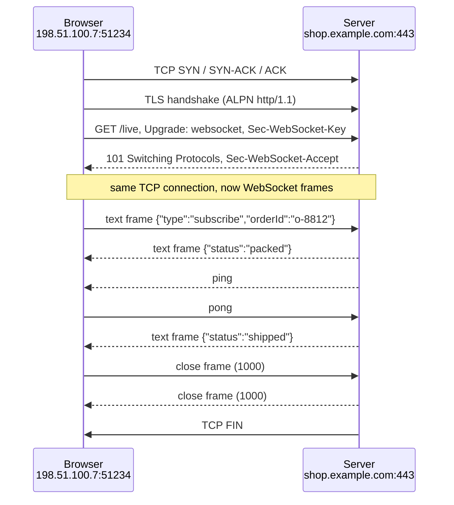
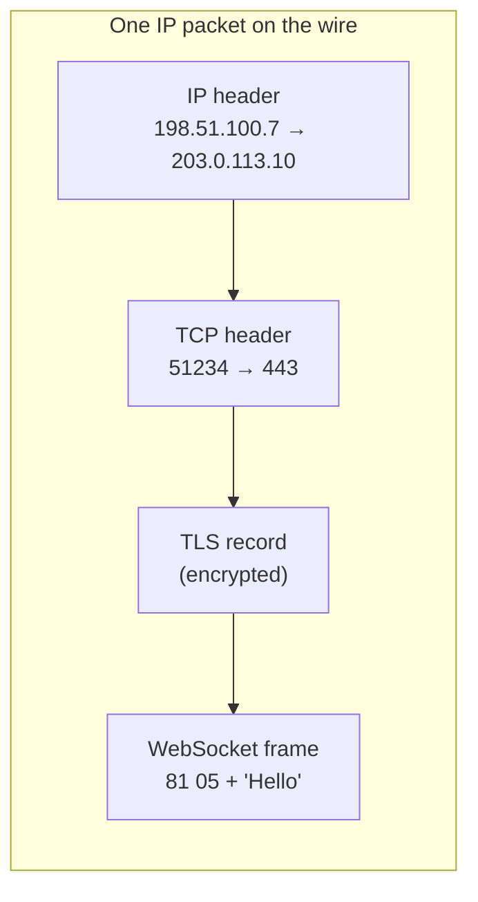
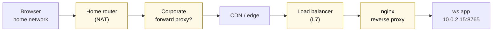
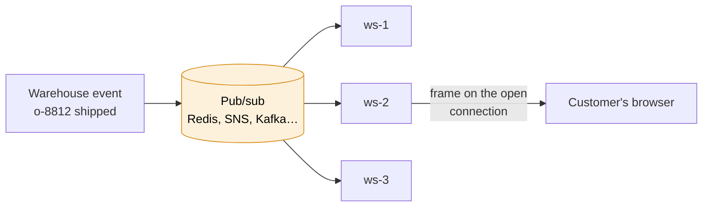

# WebSocket

> [!abstract] In one sentence
> WebSocket turns an ordinary **HTTP/1.1 request** into a **long-lived, two-way, message-based channel** on the **same TCP (and TLS) connection**: the client asks to `Upgrade`, the server answers `101 Switching Protocols`, and from then on both sides can send **frames** whenever they want, on port 80 (`ws://`) or 443 (`wss://`), until one of them closes it.

## Common misconceptions

**Wrong mental model #1:** "With WebSockets the server can connect to the browser."

**What's actually true:** the **client always opens** the connection (an HTTP request, then an upgrade). What changes is that, **once it's open**, the server can send at any time without being asked. If the connection drops, the server can't call back: the client has to reconnect. That's why WebSockets work through NATs and firewalls that block inbound connections (see [[Outbound-initiated connections]]).

**Wrong mental model #2:** "WebSocket is a raw socket in the browser" / "it's a separate protocol on its own port that bypasses HTTP."

**What's actually true:** the name is misleading. It's an **application-layer protocol** on top of a TCP [[Sockets|socket]], with its own framing, and it **starts as HTTP** on the normal web ports. That's the whole point of the design: it gets through the same proxies, load balancers and firewalls as normal web traffic (when they allow the upgrade).

| Wrong mental model | What's actually true |
|---|---|
| Messages are guaranteed delivered | TCP guarantees order **while the connection lives**. If it drops, messages in flight are **lost silently**. Apps that care need acks and resume ("send me everything after event 1842") |
| One `send()` = one TCP packet | One message can span several frames and many TCP segments, and several messages can share a segment. The receiver still gets **whole messages** (WebSocket does the framing that TCP doesn't) |
| A WebSocket connection is idle-proof | Every NAT, firewall and load balancer on the path has an idle timeout. Without **pings**, it's cut silently |
| Load balancers balance WebSocket messages | They balance **connections**, once, at the upgrade. A user's whole session stays on one backend |
| `Sec-WebSocket-Key` is authentication | It's a nonce proving the server understood the upgrade (so a cache or a naive server doesn't fake it). Authentication is my job |
| It's encrypted | Only `wss://` (WebSocket inside TLS). `ws://` is plaintext, and often broken by proxies anyway |
| WebSocket is always the right choice for "real time" | For server → client only, **Server-Sent Events** are simpler (plain HTTP). For occasional updates, long polling is enough (see [[HTTP#Stage 6: the server wants to talk first]]) |

## Where it sits

| Layer       | A `wss://` connection                                     |
| ----------- | --------------------------------------------------------- |
| Application | WebSocket frames (text/binary messages, ping/pong, close) |
| Bootstrap   | One HTTP/1.1 request + `101` response, then HTTP is gone  |
| Security    | [[TLS]] (for `wss://`)                                    |
| Transport   | One TCP connection (see [[Sockets]])                      |
| Network     | IP, through NATs, proxies, load balancers                 |

## Build-up: live order tracking for the shop

Customers watch their order page: "paid → packed → shipped → delivered". The shop runs `shop.example.com` behind a load balancer, warehouse events arrive from the backend.

### Stage 1: polling

The page calls `GET /orders/o-8812/status` every 5 seconds. With 20,000 customers watching: **4,000 requests/second**, 99% answering "nothing new", each with ~800 bytes of headers, and updates still up to 5 s late. Long polling helps, but each update costs a new request and the server still can't send freely.

### Stage 2: the handshake

The browser opens a WebSocket:

```js
const ws = new WebSocket("wss://shop.example.com/live");
ws.onopen    = () => ws.send(JSON.stringify({ type: "subscribe", orderId: "o-8812" }));
ws.onmessage = (e) => render(JSON.parse(e.data));     // {"orderId":"o-8812","status":"shipped"}
ws.onclose   = (e) => console.log("closed", e.code, e.reason);
```

On the wire, after DNS, the TCP handshake and the TLS handshake (ALPN picks `http/1.1`), the first bytes inside TLS are a **normal HTTP request**:

```http
GET /live HTTP/1.1
Host: shop.example.com
Upgrade: websocket
Connection: Upgrade
Sec-WebSocket-Key: dGhlIHNhbXBsZSBub25jZQ==
Sec-WebSocket-Version: 13
Origin: https://shop.example.com
Cookie: session=7f3a9c…
```

The server agrees:

```http
HTTP/1.1 101 Switching Protocols
Upgrade: websocket
Connection: Upgrade
Sec-WebSocket-Accept: s3pPLMBiTxaQ9kYGzzhZRbK+xOo=
```

- `Sec-WebSocket-Key`: 16 random bytes in base64, a fresh one per connection
- `Sec-WebSocket-Accept` = base64( SHA-1( key + the fixed GUID `258EAFA5-E914-47DA-95CA-C5AB0DC85B11` ) ). The client checks it: proof that the server **really** speaks WebSocket and isn't a cache replaying an old response
- `101` is the last HTTP message on this connection. **From the next byte on, it's WebSocket frames**, in both directions, on the same TCP connection
- Optional: `Sec-WebSocket-Protocol` (a subprotocol like `graphql-ws` or `mqtt`), `Sec-WebSocket-Extensions: permessage-deflate` (compression)



### Stage 3: frames

Everything after the handshake is **frames**. The header is 2 to 14 bytes:

| Field | Size | Meaning |
|---|---|---|
| `FIN` | 1 bit | Last frame of this message (a big message can be split into fragments) |
| `RSV1-3` | 3 bits | For extensions (RSV1 = compressed with permessage-deflate) |
| `opcode` | 4 bits | `0x1` text (UTF-8), `0x2` binary, `0x0` continuation, `0x8` **close**, `0x9` **ping**, `0xA` **pong** |
| `MASK` | 1 bit | 1 = payload is masked. **Mandatory from client to server**, forbidden from server to client |
| Payload length | 7 bits (+16 or +64) | 0–125 directly, 126 = next 2 bytes hold the length, 127 = next 8 bytes |
| Masking key | 0 or 4 bytes | Random per frame, from the client |
| Payload | n bytes | The message (XORed with the masking key if masked) |

The text message `Hello` (example from the RFC):

```
Server → client (unmasked):  81 05 48 65 6c 6c 6f
                              │  │  └─ "Hello"
                              │  └─ MASK=0, length 5
                              └─ FIN=1, opcode 1 (text)

Client → server (masked):    81 85 37 fa 21 3d 7f 9f 4d 51 58
                                 │  └─ masking key ─┘ └─ "Hello" XOR key
                                 └─ MASK=1, length 5
```

Why clients must mask: so a malicious page can't make the browser send bytes that a **naive proxy or cache on the path** would mistake for an HTTP request it should cache (cache poisoning). The random mask makes the bytes on the wire unpredictable to the script that chose them. It's **not encryption**: the key travels in the clear right before the data.

Compared to HTTP polling, each update now costs **2–14 bytes of framing** instead of a full request and response with headers.

### Stage 4: how it travels across the network

Every frame is carried inside the same layers as any other data:



And it crosses the same middleboxes as HTTP, each with its own way to break it:



| Hop | What it needs | What goes wrong |
|---|---|---|
| **NAT** (home, NAT gateway) | Nothing special: the client opened the connection | Idle timeout drops the mapping → **pings** needed |
| **Forward proxy** | `wss://` goes through `CONNECT` (a blind TLS tunnel, see [[Proxies]]) | `ws://` through a proxy that doesn't understand Upgrade gets mangled: another reason to always use `wss://` |
| **Load balancer / CDN** | Must support WebSockets and keep the connection on one backend | Idle timeout (ALB 60 s default). Deploys and scale-ins drop connections |
| **Reverse proxy** (nginx) | Must forward the hop-by-hop `Upgrade` and `Connection` headers and speak HTTP/1.1 upstream | Without it: the upgrade silently fails, client gets 400/426 or a normal 200 |

The nginx part that's forgotten every time:

```nginx
location /live {
    proxy_pass http://ws_backend;
    proxy_http_version 1.1;                       # upgrade only exists in HTTP/1.1
    proxy_set_header Upgrade $http_upgrade;       # hop-by-hop headers aren't forwarded by default
    proxy_set_header Connection "upgrade";
    proxy_set_header Host $host;
    proxy_read_timeout 3600s;                     # default 60 s would cut idle sockets
}
```

### Stage 5: the server side

A minimal server with Python's `websockets` library (asyncio, one event loop for thousands of connections, see [[Sockets#Stage 4: a thousand clients at once]]):

```python
import asyncio, json
from websockets.asyncio.server import serve

subscribers = {}   # orderId -> set of connections

async def handler(ws):
    order_id = None
    try:
        async for raw in ws:                       # one complete message at a time
            msg = json.loads(raw)
            if msg["type"] == "subscribe":
                order_id = msg["orderId"]
                subscribers.setdefault(order_id, set()).add(ws)
    finally:
        if order_id:
            subscribers[order_id].discard(ws)      # connection closed or dropped

async def notify(order_id, status):                # called when the warehouse event arrives
    for ws in subscribers.get(order_id, ()):
        await ws.send(json.dumps({"orderId": order_id, "status": status}))

async def main():
    # ping every 20 s, drop the connection if no pong within 20 s
    async with serve(handler, "0.0.0.0", 8765, ping_interval=20, ping_timeout=20):
        await asyncio.get_running_loop().create_future()   # run forever

asyncio.run(main())
```

Testing from a terminal: `websocat wss://shop.example.com/live`, then type `{"type":"subscribe","orderId":"o-8812"}`.

### Stage 6: three servers, one problem

Traffic grows, I run `ws-1`, `ws-2`, `ws-3` behind the load balancer. The customer's connection landed on `ws-2`. The warehouse event for `o-8812` arrives at `ws-1`. `ws-1` has no connection for that customer, so the update is lost.

**Each connection lives on exactly one server.** Any server that produces an event must reach the server that **holds** the connection. The usual fix is a **pub/sub backplane**:



Every ws server subscribes to the backplane and forwards events to the connections **it** holds (see [[Messaging]] for pub/sub). Managed alternatives keep the connection registry for me (API Gateway WebSocket APIs, below).

Other scaling facts:
- Capacity is measured in **concurrent connections** (memory per connection, fds), not requests/second
- A **deploy** closes every connection on the old servers: 20,000 clients reconnect at once (**thundering herd**). Clients must reconnect with **exponential backoff + random jitter**, and servers should drain gradually (close code `1001` / `1012`)
- Load balancing is decided **once per connection**: after a scale-out, new servers only get new connections. Long-lived sessions stay unbalanced until they reconnect

### Stage 7: reliability and closing

**Closing handshake:** one side sends a close frame with a code, the other answers with a close frame, then TCP closes.

| Code | Meaning |
|---|---|
| `1000` | Normal closure |
| `1001` | Going away (page closed, server shutting down) |
| `1006` | **Abnormal**: the connection dropped **without** a close frame. Never sent on the wire, it's what the client API reports (network cut, idle timeout, crash) |
| `1008` | Policy violation (e.g. auth failed) |
| `1009` | Message too big |
| `1011` | Server error |
| `1012` | Service restart |

A lot of `1006` in client telemetry = something on the path **cuts idle connections**: add or shorten pings.

**Heartbeats:** ping/pong frames every 20–30 s keep NAT and load balancer entries alive **and** detect half-open connections (see [[Sockets#4. Half-open connections]]).

**Not losing updates:** messages sent while the connection was down are gone. Give every event a **sequence number**, and on reconnect the client sends "last seen: 1842" so the server replays what was missed (or the client refetches state over plain HTTP).

### Stage 8: security

- **Always `wss://`**
- **Authentication**: the browser's `WebSocket` API **can't set custom headers** (no `Authorization: Bearer`). Options: the session **cookie** sent with the upgrade request, a short-lived **token** in the first message, or a token in the query string (`/live?token=…`), which ends up in **access logs**, so keep it short-lived
- **Check the `Origin` header** on the upgrade. Cookies are sent automatically, so without an Origin check any website can open a WebSocket to my server **as the logged-in user**: **Cross-Site WebSocket Hijacking** (CORS doesn't apply to WebSockets)
- **Limit message size** and rate per connection, and validate every message: it's untrusted input, just like an HTTP body
- Re-check authorization for long sessions: a connection opened before a user was disabled stays open for hours unless I close it

## Beyond HTTP/1.1
- **WebSocket over HTTP/2** (RFC 8441): uses an extended `CONNECT` on one HTTP/2 stream instead of `Upgrade`, so many WebSockets can share one connection. Supported by browsers and some servers, less by proxies
- **WebTransport** (over HTTP/3 / QUIC): streams and unreliable datagrams, no TCP head-of-line blocking (see [[HTTP2#Stage 6: HTTP/3 over QUIC]]). Newer, for games and media

| Option | Direction | Over | Good for |
|---|---|---|---|
| Polling | Client asks | HTTP | Rare updates, simplicity |
| Long polling | Server answers when ready | HTTP | Fallback, firewalls hostile to upgrades |
| **Server-Sent Events** | Server → client | One long HTTP response | Notifications, feeds, streaming LLM output |
| **WebSocket** | **Both, any time** | Upgraded HTTP/1.1 connection | Chat, collaboration, live dashboards, games, terminals |
| gRPC streaming | Both | HTTP/2 | Service-to-service streams |

## In AWS
- **ALB**: supports WebSockets natively (the upgrade passes through, the connection stays on one target). Idle timeout **60 s** by default (up to 4,000 s): ping more often than that
- **NLB**: L4, passes the TCP connection through, idle timeout 350 s
- **CloudFront**: supports WebSockets to the origin
- **API Gateway WebSocket APIs**: AWS holds the connections. Routes `$connect`, `$disconnect`, `$default` and custom ones by a message field invoke [[Lambda]] (or other integrations). The backend sends to a client with a **POST to the `@connections/{connectionId}` URL**, so no server keeps sockets. Limits: **10 min idle timeout**, **2 hours** max connection duration: clients must reconnect
- **NAT gateway**: 350 s idle timeout for clients behind it
- AWS's own example: **Session Manager** keeps a WebSocket from the SSM agent to the `ssmmessages` endpoint (see [[Systems Manager]])

## Practice

> [!example]- Who opens a WebSocket connection, and can the server reopen it after a drop?
> The client opens it (an HTTP upgrade). The server can't reconnect to the client: the client must reconnect.

> [!example]- What tells the client the server really accepted the upgrade?
> `101 Switching Protocols` with `Sec-WebSocket-Accept` = base64(SHA-1(key + fixed GUID)).

> [!example]- WebSocket works locally but fails behind nginx with a normal 200/400. Most likely cause?
> nginx isn't forwarding `Upgrade`/`Connection` headers or isn't using `proxy_http_version 1.1`.

> [!example]- Clients disconnect with code 1006 roughly every 60 seconds of inactivity behind an ALB. Fix?
> ALB idle timeout (60 s) cuts idle connections. Send pings every ~20–30 s (or raise the idle timeout).

> [!example]- Events sometimes don't reach users when running 3 WebSocket servers. Why?
> The event is processed on a server that doesn't hold the user's connection. Add a pub/sub backplane (or use a managed connection registry).

> [!example]- Why must clients mask frames?
> To stop scripts from controlling the exact bytes on the wire, which could poison naive proxies/caches. Not for confidentiality.

> [!example]- Why check the Origin header on WebSocket upgrades?
> Browsers send cookies automatically and CORS doesn't apply: without the check, any site can open a connection as the logged-in user (Cross-Site WebSocket Hijacking).

## Easy to get wrong
- Thinking the server can connect to the client
- Treating WebSocket as a raw socket or a separate port: it starts as HTTP on 80/443
- Forgetting the reverse proxy upgrade headers
- No pings: NATs and load balancers cut idle connections (code 1006)
- Expecting delivery guarantees across reconnects: use sequence numbers and replay
- Keeping state for a user on "the server": with several servers, only one holds the connection
- Reconnecting all clients instantly after a deploy: backoff with jitter
- Tokens in query strings without short expiry (they land in logs)
- No Origin check (CSWSH)
- Using `ws://` in production
- Choosing WebSocket when Server-Sent Events would do

## Related
- Starts as:: [[HTTP]]
- Runs on:: [[Sockets]], [[TLS]], *[[TCP and UDP]]*
- Newer transports:: [[HTTP2]]
- Why it works behind NAT:: [[Outbound-initiated connections]], [[NAT and PAT]]
- Through the middle:: [[Proxies]], [[Reverse proxy]], [[Load balancing]]
- Fan-out between servers:: [[Messaging]], [[SNS]]
- Used by:: [[Systems Manager]] (Session Manager), [[MQTT]] (MQTT over WebSocket)
- AWS:: [[Load balancers]], [[Lambda]]
- Authenticating the connection:: [[Session authentication]] (cookies, CSRF-like cross-site risks), [[JWT and bearer tokens]]

## Flashcards
#flashcards

What is WebSocket? :: A protocol that upgrades an HTTP/1.1 connection into a persistent, two-way, message-based channel on the same TCP connection
How does a WebSocket connection start? :: HTTP/1.1 GET with Upgrade: websocket and Connection: Upgrade, answered by 101 Switching Protocols
How is Sec-WebSocket-Accept computed? :: base64(SHA-1(Sec-WebSocket-Key + 258EAFA5-E914-47DA-95CA-C5AB0DC85B11))
What is Sec-WebSocket-Key for? :: Proving the server understood the upgrade (not a cache or non-WebSocket server). Not authentication
ws:// vs wss://? :: ws is plaintext on port 80, wss is WebSocket inside TLS on port 443
WebSocket opcodes? :: 0x1 text, 0x2 binary, 0x0 continuation, 0x8 close, 0x9 ping, 0xA pong
Which direction must frames be masked? :: Client to server. Server to client must not be masked
Why do clients mask WebSocket frames? :: So scripts can't control exact wire bytes and poison naive proxies or caches
Does WebSocket preserve message boundaries? :: Yes, the receiver gets whole messages, unlike raw TCP
Are WebSocket messages guaranteed across a reconnect? :: No. Messages in flight are lost. Use sequence numbers and replay
What does close code 1006 mean? :: Abnormal closure: connection dropped without a close frame (never sent on the wire)
Why do WebSocket apps send pings? :: Keep NAT/LB/firewall idle entries alive and detect dead (half-open) connections
What must nginx set to proxy WebSockets? :: proxy_http_version 1.1, Upgrade and Connection headers, and a long read timeout
How do load balancers balance WebSockets? :: Per connection, at the upgrade. The session stays on one backend
How do several WebSocket servers deliver an event to the right user? :: A pub/sub backplane: every server subscribes and forwards to the connections it holds
Why can't the browser WebSocket API send a Bearer token header? :: It doesn't allow custom headers. Use cookies, a first-message token, or a short-lived query token
What is Cross-Site WebSocket Hijacking? :: Another site opening a WebSocket with the user's cookies because the server doesn't check Origin
WebSocket vs Server-Sent Events? :: WebSocket: two-way, upgraded connection. SSE: server → client only, plain HTTP
How does API Gateway WebSocket send a message to a client? :: The backend POSTs to the @connections/{connectionId} URL
API Gateway WebSocket limits? :: 10 minute idle timeout, 2 hour max connection duration
Default ALB idle timeout and its effect on WebSockets? :: 60 s: idle WebSockets are cut unless pings flow more often
