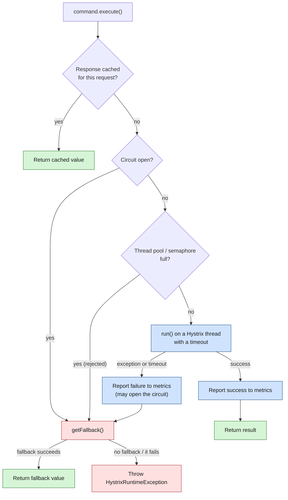

# Hystrix

> [!abstract] In one sentence
> Hystrix is the Java library Netflix open-sourced in 2012 to stop one slow or failing dependency from taking down a whole service: every remote call is wrapped in a **command** that runs with a **timeout**, inside its own small **thread pool** (a bulkhead), behind a **circuit breaker**, with a **fallback** when anything goes wrong, and with live metrics streamed to a dashboard. It went into maintenance mode in November 2018, but its model is the template that [[Resilience4j]], [[Polly]] and the [[Service mesh]] all reuse.

## Build-up: orders, inventory, and a bad Black Friday

### Stage 0: the problem

The online shop: `orders` is a Java service that, for every checkout, calls `inventory` ("is SKU 42 in stock?") and `payments` ("charge this card") over HTTP (Hypertext Transfer Protocol). `orders` runs in Tomcat with 200 request threads on a JVM (Java Virtual Machine).

On Black Friday, `inventory`'s database gets slow and its responses take 30 seconds instead of 50 milliseconds. What happens to `orders`:

1. Each checkout thread blocks on the `inventory` call for 30 seconds
2. At 10 checkouts per second, all 200 Tomcat threads are blocked within 20 seconds
3. `orders` stops answering **everything**, including order history pages that never call `inventory`
4. The frontend, which calls `orders`, now blocks in the same way. One slow dependency has turned into a site-wide outage: a **cascading failure** (the general patterns are in [[Resilience patterns]])

Netflix hit this constantly: a single API (application programming interface) request from a TV fanned out to dozens of backend services, and at their scale some dependency was always misbehaving. Hystrix was their answer, written into every service as a library because, in 2012, there was no platform layer to put it in (see [[Spring Cloud and Netflix OSS]]).

### Stage 1: wrap the call in a command

The idea: **never call a dependency directly**. Every call becomes a `HystrixCommand` object, and Hystrix decides whether to run it, where to run it, how long to wait, and what to return instead.



Four protections, each fixing one step of the Black Friday story:
- **Timeout**: the call is abandoned after 1 second by default, so a Tomcat thread never waits 30 seconds
- **Bulkhead**: `inventory` calls run on a dedicated pool of 10 threads. When `inventory` is slow, at most 10 threads are stuck, and the other 190 Tomcat threads keep serving everything else
- **Circuit breaker**: once most recent calls fail, stop calling for a few seconds. Calls fail instantly, `inventory` gets breathing room, `orders` doesn't waste even the timeout
- **Fallback**: instead of an error, return something degraded but useful

### Stage 2: add the dependency

Plain Java, no Spring yet. With Maven:

```xml
<dependency>
    <groupId>com.netflix.hystrix</groupId>
    <artifactId>hystrix-core</artifactId>
    <version>1.5.18</version>  <!-- the last release -->
</dependency>
```

Hystrix is built on RxJava 1 and reads its configuration through **Archaius**, Netflix's configuration library. Both come in as transitive dependencies.

### Stage 3: write the first command

```java
public class StockCommand extends HystrixCommand<Stock> {

    private final InventoryHttpClient client;
    private final String sku;

    public StockCommand(InventoryHttpClient client, String sku) {
        super(HystrixCommandGroupKey.Factory.asKey("inventory"));  // group = the dependency
        this.client = client;
        this.sku = sku;
    }

    @Override
    protected Stock run() throws Exception {
        // the real remote call; runs on a Hystrix thread, not the caller's
        return client.getStock(sku);
    }

    @Override
    protected Stock getFallback() {
        // called on timeout, exception, open circuit or rejection
        return Stock.unknown(sku);   // "show as available, check again at checkout"
    }
}
```

A command object is **single-use**: create a new one for each call.

```java
Stock stock = new StockCommand(client, "42").execute();
```

### Stage 4: three ways to run it

| Method | Returns | Blocks the caller? | Use when |
|---|---|---|---|
| `execute()` | The value | Yes, until the result, fallback or exception | Ordinary synchronous code (most Spring apps) |
| `queue()` | `Future<Stock>` | No, `future.get()` blocks later | Starting several calls in parallel, then waiting for all |
| `observe()` | A hot `Observable<Stock>` (starts now) | No | Reactive code with RxJava |
| `toObservable()` | A cold `Observable<Stock>` (starts on subscribe) | No | Same, when execution should wait for a subscriber |

`execute()` is literally `queue().get()`. The parallel version of a checkout:

```java
Future<Stock> stock = new StockCommand(inventory, "42").queue();
Future<Price> price = new PriceCommand(pricing, "42").queue();
render(stock.get(), price.get());   // both calls ran at the same time
```

### Stage 5: keys, or what shares what

Three names decide which commands share metrics, circuits and threads:

| Key | Default | What it groups |
|---|---|---|
| **Command key** | The class name (`StockCommand`) | One **circuit breaker** and one set of metrics per command key |
| **Group key** | Required in the constructor | Reporting and dashboards: "everything that talks to `inventory`" |
| **Thread pool key** | The group key | One **thread pool** per key: commands with the same key share the bulkhead |

So `StockCommand` and `ReserveStockCommand`, both in group `inventory`, each have their own circuit but share one 10-thread pool by default. To give the slow reservation call its own pool, set a different thread pool key.

### Stage 6: configure it

Two ways. In code, with a `Setter`:

```java
super(Setter
    .withGroupKey(HystrixCommandGroupKey.Factory.asKey("inventory"))
    .andCommandKey(HystrixCommandKey.Factory.asKey("stock"))
    .andThreadPoolKey(HystrixThreadPoolKey.Factory.asKey("inventory-read"))
    .andCommandPropertiesDefaults(HystrixCommandProperties.Setter()
        .withExecutionTimeoutInMilliseconds(500)
        .withCircuitBreakerRequestVolumeThreshold(20)
        .withCircuitBreakerErrorThresholdPercentage(50)
        .withCircuitBreakerSleepWindowInMilliseconds(5000))
    .andThreadPoolPropertiesDefaults(HystrixThreadPoolProperties.Setter()
        .withCoreSize(10)));
```

Or as **properties** (Archaius), which can be changed at runtime without a redeploy: `hystrix.command.<commandKey>.<property>`, `hystrix.threadpool.<poolKey>.<property>`, or `default` in place of the key for everything.

```properties
hystrix.command.default.execution.isolation.thread.timeoutInMilliseconds=1000
hystrix.command.stock.execution.isolation.thread.timeoutInMilliseconds=500
hystrix.command.default.circuitBreaker.requestVolumeThreshold=20
hystrix.command.default.circuitBreaker.errorThresholdPercentage=50
hystrix.command.default.circuitBreaker.sleepWindowInMilliseconds=5000
hystrix.command.default.metrics.rollingStats.timeInMilliseconds=10000
hystrix.threadpool.default.coreSize=10
hystrix.threadpool.default.maxQueueSize=-1
```

What the main ones mean:

| Property | Default | Meaning |
|---|---|---|
| `execution.isolation.thread.timeoutInMilliseconds` | 1000 | Give up on `run()` after this and go to the fallback |
| `metrics.rollingStats.timeInMilliseconds` | 10000 | The circuit looks at the last 10 seconds of calls |
| `circuitBreaker.requestVolumeThreshold` | 20 | Below 20 calls in the window, never open, whatever the error rate (avoids tripping on 1 failure out of 2) |
| `circuitBreaker.errorThresholdPercentage` | 50 | At or above 50% failures (with enough volume), open the circuit |
| `circuitBreaker.sleepWindowInMilliseconds` | 5000 | Stay open 5 seconds, then let **one** trial call through (half-open). Success closes the circuit, failure reopens it for another window |
| `threadpool.coreSize` | 10 | Threads in the bulkhead |
| `threadpool.maxQueueSize` | -1 | -1 means no queue: when all threads are busy, reject immediately (a queue would only add waiting) |

What counts as a failure: exceptions thrown by `run()`, timeouts, and rejections (pool or semaphore full). A `HystrixBadRequestException` is the exception for "the caller's fault" (invalid input): it's rethrown as is, doesn't trigger the fallback, and doesn't count against the circuit.

**Sizing the pool**: threads needed ≈ peak calls per second × latency at the 99th percentile in seconds, plus some room. `inventory` at 30 calls/s with a 99th percentile of 0.2 s needs about 6 threads, so 10 is comfortable. A pool sized for the slow case defeats the purpose: 200 threads is no bulkhead.

### Stage 7: thread isolation or semaphore isolation

| | **Thread pool** (default) | **Semaphore** |
|---|---|---|
| Where `run()` runs | A Hystrix thread from the command's pool | The caller's own thread |
| Limit | Pool size (`coreSize`) | `execution.isolation.semaphore.maxConcurrentRequests` (default 10) |
| Timeout | The caller stops waiting and gets the fallback even if `run()` is still stuck | The work runs on the caller's thread, so it can't be walked away from in the same way |
| Cost | A thread handoff per call (small, but real at very high volume) | Almost none |
| Use for | Network calls, the normal case | Calls that don't touch the network (in-memory caches), or extremely high call rates where the thread overhead matters |

> [!warning] A timeout doesn't free the stuck thread
> When a thread-isolated command times out, the **caller** gets its fallback, and Hystrix interrupts the worker thread. But a thread blocked in a socket read doesn't react to interrupts. If the HTTP client has no socket timeouts of its own, the Hystrix thread stays stuck until the remote side answers or the connection dies, and the pool fills up with zombies. Always set connect and read timeouts on the HTTP client too, slightly above the Hystrix timeout. Hystrix protects the caller; only the client's own timeouts free the thread.

### Stage 8: request caching and request collapsing

Two optimizations for one incoming request that triggers several identical or similar calls. Both need a **request context**, a per-request scope that a servlet filter opens and closes:

```java
HystrixRequestContext context = HystrixRequestContext.initializeContext();
try {
    chain.doFilter(request, response);
} finally {
    context.shutdown();
}
```

- **Request caching**: override `getCacheKey()` (`return sku;`). Within one incoming request, a second `StockCommand` for SKU 42 returns the first result without calling `inventory` again. Useful when several parts of a page ask the same question
- **Request collapsing**: a `HystrixCollapser` gathers individual calls made within a short window (10 ms by default) into **one** batch call: 50 `getStock(sku)` calls become one `getStocks([sku1…sku50])`. It trades a few milliseconds of latency for far fewer remote calls. Only works if the remote side has a batch endpoint

### Stage 9: the Spring Cloud Netflix way

In Spring, nobody wrote command classes by hand. Spring Cloud Netflix wrapped annotated methods in commands (through the `hystrix-javanica` library):

```java
@SpringBootApplication
@EnableCircuitBreaker            // or @EnableHystrix
public class OrdersApplication { }

@Service
public class StockService {

    @HystrixCommand(
        fallbackMethod = "stockUnknown",
        commandKey = "stock",
        threadPoolKey = "inventory-read",
        commandProperties = {
            @HystrixProperty(name = "execution.isolation.thread.timeoutInMilliseconds", value = "500")
        })
    public Stock stock(String sku) {
        return restTemplate.getForObject("http://inventory/stock/{sku}", Stock.class, sku);
    }

    // same signature (optionally plus a Throwable parameter) and same return type
    public Stock stockUnknown(String sku) {
        return Stock.unknown(sku);
    }
}
```

With **Feign** clients, each interface method became a command automatically once enabled (off by default from Spring Cloud Dalston on):

```yaml
feign:
  hystrix:
    enabled: true
hystrix:
  command:
    default:
      execution.isolation.thread.timeoutInMilliseconds: 1000
```

The Feign command key is derived from the method, like `InventoryClient#stock(String)`, which is the name to use in per-command properties.

> [!warning] The Hystrix timeout must outlast Ribbon's retries
> Behind Feign or Zuul, **Ribbon** (the client-side load balancer) also had timeouts and retries. If Hystrix gives up first, Ribbon's retries never get a chance. The Hystrix timeout must be at least: (Ribbon `ConnectTimeout` + `ReadTimeout`) × (`MaxAutoRetries` + 1) × (`MaxAutoRetriesNextServer` + 1). With 1 s + 1 s, 0 retries on the same server and 1 on another: (2 s) × 1 × 2 = 4 s. Getting this backwards was one of the most common Spring Cloud bugs.

### Stage 10: seeing it: the stream, Turbine and the Dashboard

Each service exposed a live metrics stream as SSE (Server-Sent Events): `/hystrix.stream` (in Spring Boot 2, `/actuator/hystrix.stream`), one JSON (JavaScript Object Notation) event per command per second.

- One instance's stream only shows that instance. **Turbine** found all instances of a cluster through Eureka, read all their streams, and merged them into one aggregated stream per cluster
- The **Hystrix Dashboard** (a small web app) drew that stream. One panel per command:

| On the panel | Meaning |
|---|---|
| The **circle's colour** | Health, from green through yellow and orange to red as the error percentage rises |
| The **circle's size** | Request rate: a big circle is a busy command |
| The line through it | Request rate over the last couple of minutes |
| The coloured counters | Successes (green), short-circuited by the open circuit (blue), bad requests (cyan), timeouts (yellow), thread pool rejections (purple), failures (red) |
| `Circuit Closed` / `Open` | The breaker's current state |
| Latency figures | Percentiles of execution time (median, 90th, 99th, 99.5th) |

A wall screen of these circles was the Netflix-era picture of "is the platform healthy right now?".

### Stage 11: testing it

Resilience code that never runs in tests is resilience code that doesn't work. Typical tests:
- **Force the circuit open** and check the fallback is used: set `hystrix.command.stock.circuitBreaker.forceOpen=true` (through `ConfigurationManager.getConfigInstance().setProperty(...)` in a test), call the service, expect `Stock.unknown`
- **A slow stub**: point the client at a stub server (WireMock, for instance) that delays its response by 2 s, and check the call returns the fallback in about the timeout, not in 2 s
- **Rejection**: fire more concurrent calls than the pool size at the slow stub and check the extra ones are rejected at once
- Hystrix keeps metrics and circuit state in static, JVM-wide registries: call `Hystrix.reset()` between tests, or tests leak open circuits into each other

## Advanced problems

### 1. Rejections and open circuits at low traffic
**Symptom:** circuits open, or "thread pool rejected" errors appear, on a service that isn't busy.
**Why:** the defaults assume Netflix-scale traffic. A pool of 10 with no queue rejects the 11th concurrent call even during a short burst; a command with few calls trips easily once it reaches 20 in the window.
**Fix:** size pools from measured peak rate × 99th percentile latency, tune `requestVolumeThreshold` to the real traffic, and alert on rejections separately from failures.

### 2. Lost context across Hystrix threads
**Symptom:** log lines inside commands lose their request ID, the security context is empty, a transaction or tenant is missing.
**Why:** thread isolation moves `run()` to another thread, and anything stored in `ThreadLocal` (the logging MDC (Mapped Diagnostic Context), Spring Security's context, tracing state) stays behind on the caller's thread.
**Fix:** a custom `HystrixConcurrencyStrategy` that wraps each `Callable` to copy the context across; in Spring Cloud, `hystrix.shareSecurityContext: true` for the security context, and Sleuth's own Hystrix integration for trace IDs. Or semaphore isolation where it's safe.

### 3. Timeouts too short after a deploy
**Symptom:** right after startup, many timeouts and circuits opening, then everything calms down.
**Why:** a fresh JVM is slow until the JIT (just-in-time compiler) warms up and connection pools fill. A 500 ms timeout tuned on a warm service fails on a cold one.
**Fix:** warm up before taking traffic (readiness only after a few internal calls), keep timeouts tuned to the 99th percentile with margin, not the median.

### 4. A fallback that calls the network
**Symptom:** the fallback itself hangs or fails, and the outage looks just like having no Hystrix.
**Why:** a fallback like "call the backup inventory service" is just another remote call, without protection.
**Fix:** fallbacks should be local and cheap (cached value, default, empty list). If a fallback must call the network, make it **its own `HystrixCommand`** with its own timeout and fallback.

### 5. One circuit for all instances
**Symptom:** one bad `inventory` instance out of three and the circuit opens for **all** of `inventory`; or, the reverse, a broken instance keeps getting a third of the traffic while the circuit stays closed.
**Why:** the circuit is per **command key**, not per instance. Hystrix sees "the inventory dependency", not hosts. Avoiding a single bad host was Ribbon's job (its server statistics), and the two didn't coordinate.
**Fix then:** Ribbon's availability filtering plus retries on another server. **Today:** per-host outlier detection in the proxy ([[Resilience in a service mesh]]).

## Migrating away

Netflix put Hystrix in **maintenance mode in November 2018**: no new features, and the README recommends Resilience4j for new projects. Netflix itself moved towards **adaptive** protection (concurrency limits that adjust to measured latency, like TCP (Transmission Control Protocol) congestion control) instead of hand-tuned static thresholds. Spring Cloud removed Hystrix in release train 2020.0.

Concept by concept, the move to [[Resilience4j]]:

| Hystrix | Resilience4j |
|---|---|
| `HystrixCommand` (everything in one object) | Separate decorators you combine: `CircuitBreaker`, `TimeLimiter`, `Bulkhead`, `Retry`, `RateLimiter` |
| `execution.isolation.thread.timeoutInMilliseconds` | `timelimiter.instances.<name>.timeoutDuration` |
| `metrics.rollingStats.timeInMilliseconds` | `slidingWindowType` (count or time based) + `slidingWindowSize` |
| `circuitBreaker.requestVolumeThreshold` | `minimumNumberOfCalls` |
| `circuitBreaker.errorThresholdPercentage` | `failureRateThreshold` (plus `slowCallRateThreshold`, which Hystrix didn't have) |
| `circuitBreaker.sleepWindowInMilliseconds` | `waitDurationInOpenState` |
| One trial call when half-open | `permittedNumberOfCallsInHalfOpenState` |
| Thread pool isolation (`coreSize`) | `ThreadPoolBulkhead` |
| Semaphore isolation | `Bulkhead` (semaphore, `maxConcurrentCalls`) |
| `getFallback()` / `fallbackMethod` | `fallbackMethod` on the annotations, or `Decorators...withFallback(...)` |
| Request caching | The `Cache` module (JCache) |
| Request collapsing | No equivalent |
| `/hystrix.stream` + Turbine + Dashboard | Micrometer metrics → Prometheus → Grafana |

Retries, timeouts, per-host circuit breaking and metrics can also leave the application entirely: see [[Resilience in a service mesh]] and [[Service mesh]]. The fallback stays in the code, because only the application knows what a degraded answer is. The .NET counterpart of this whole story is [[Polly]].

## Practice

> [!example]- `inventory` responds in 30 s. `orders` uses a thread-isolated `StockCommand` with the defaults and an HTTP client with no read timeout. Walk through what happens over the first minute.
> Each call times out after 1 s and returns the fallback, so Tomcat threads are protected. But the 10 Hystrix threads stay blocked in socket reads (interrupts don't unblock them), so after 10 calls the pool is full and further calls are **rejected** instantly (fallback again). Once at least 20 calls in the 10-second window have failed (timeouts and rejections count), the circuit opens and calls short-circuit straight to the fallback. Every 5 s one trial call goes through; it fails, the circuit stays open. The fix for the stuck threads is a read timeout on the HTTP client.

> [!example]- Feign with Ribbon: `ConnectTimeout` 1000, `ReadTimeout` 3000, `MaxAutoRetries` 0, `MaxAutoRetriesNextServer` 1, Hystrix timeout left at the default. What's wrong and what value fixes it?
> The default Hystrix timeout (1 s) is shorter than a single Ribbon attempt (up to 4 s), so Hystrix gives up before the first read completes and Ribbon's retry on the next server never happens. Minimum: (1 + 3) × (0 + 1) × (1 + 1) = 8 s, so 8000 ms or a bit more.

> [!example]- Why is the default `maxQueueSize` -1, and what would a queue of 100 do during an incident?
> -1 means no queue: when all threads are busy, reject immediately and go to the fallback. A queue of 100 would let calls wait behind the 10 stuck ones, so callers wait longer (often until their own timeout) before failing anyway. The point of the bulkhead is to fail fast, and a queue undoes that.

## Easy to get wrong
- Thinking a Hystrix timeout frees the worker thread: it frees the caller; the HTTP client's own timeouts free the thread
- Fallbacks that make remote calls without their own protection
- Expecting the circuit to be per instance: it's per command key, for the whole dependency
- Reusing a `HystrixCommand` object: each one runs once
- A Hystrix timeout shorter than Ribbon's total retry time
- Large pools and queues "to be safe": they turn the bulkhead back into a shared waiting room
- Losing MDC, security and trace context on Hystrix threads
- Forgetting `Hystrix.reset()` between tests
- Starting a new project on it: it's been in maintenance mode since 2018

## Related
- Patterns:: [[Resilience patterns]]
- Era and stack:: [[Spring Cloud and Netflix OSS]]
- Successors:: [[Resilience4j]], [[Resilience in a service mesh]], [[Service mesh]]
- Same ideas in .NET:: [[Polly]]
- Other languages:: [[Resilience libraries in other languages]]

## Flashcards
#flashcards

What problem was Hystrix built to stop? :: One slow or failing dependency exhausting a service's threads and cascading the failure to everything
What four protections does a HystrixCommand apply? :: Timeout, bulkhead (own thread pool or semaphore), circuit breaker, fallback
In what order does a HystrixCommand check things before running? :: Request cache, then circuit open?, then pool/semaphore full?, then run() with a timeout; any failure goes to getFallback()
execute() vs queue() vs observe()? :: execute() blocks for the value; queue() returns a Future; observe() returns a hot Observable that starts now
What do the command key, group key and thread pool key control? :: Command key: circuit and metrics. Group key: grouping for reporting. Thread pool key: which commands share a bulkhead (defaults to the group key)
Default Hystrix execution timeout? :: 1000 ms
When does a Hystrix circuit open (defaults)? :: At least 20 requests in the 10 s rolling window and an error rate of 50% or more
What happens after the sleep window (5 s by default)? :: One trial request goes through; success closes the circuit, failure keeps it open
What counts as a failure for the circuit? :: Exceptions from run(), timeouts, and thread pool or semaphore rejections (not HystrixBadRequestException)
Why is the default thread pool queue size -1? :: No queue: reject at once when threads are busy, so callers fail fast instead of waiting
Thread pool vs semaphore isolation? :: Thread pool runs run() on a separate thread (caller can walk away on timeout); semaphore runs on the caller's thread with a concurrency limit, cheaper, for non-network or very high-volume calls
Why does a thread-isolated command still need HTTP client timeouts? :: Interrupts don't unblock a socket read, so without client timeouts the Hystrix thread stays stuck
How to size a Hystrix thread pool? :: Peak calls per second × 99th percentile latency in seconds, plus some room
What do request caching and request collapsing need? :: A HystrixRequestContext opened per incoming request
What does request collapsing do? :: Batches individual calls made within a short window into one batch call
How was Hystrix used in Spring Cloud? :: @EnableCircuitBreaker plus @HystrixCommand(fallbackMethod = ...) on methods, or feign.hystrix.enabled for Feign clients
The Hystrix vs Ribbon timeout rule? :: Hystrix timeout ≥ (ConnectTimeout + ReadTimeout) × (MaxAutoRetries + 1) × (MaxAutoRetriesNextServer + 1)
What did Turbine do? :: Aggregated the /hystrix.stream of every instance (found through Eureka) into one stream per cluster for the Dashboard
In the Hystrix Dashboard, what do a circle's colour and size mean? :: Colour = health (green to red by error rate), size = request rate
Why is context lost inside Hystrix commands? :: ThreadLocal state (MDC, security, tracing) stays on the caller's thread; fix with a HystrixConcurrencyStrategy or shareSecurityContext
Why should fallbacks not call the network? :: An unprotected remote fallback fails the same way; keep it local or make it its own command
Is a Hystrix circuit per instance? :: No, per command key: one circuit for the whole dependency
When and why did Hystrix go into maintenance mode? :: November 2018; Netflix moved to adaptive concurrency limits and recommended Resilience4j
Main Resilience4j equivalents of Hystrix's circuit settings? :: minimumNumberOfCalls, failureRateThreshold, waitDurationInOpenState, slidingWindowSize
