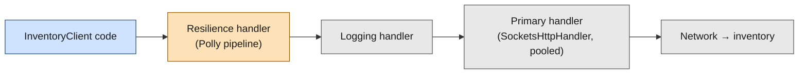
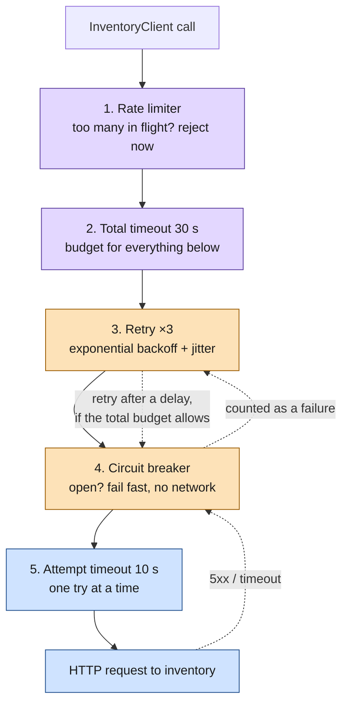

# Polly

> [!abstract] In one sentence
> Polly is the **resilience library of .NET** (open source since 2013, a .NET Foundation project): it wraps a call in **strategies** (retry, circuit breaker, timeout, rate limiter, fallback, hedging) composed into a **pipeline**. Since .NET 8, Microsoft ships it as the default way to make `HttpClient` calls resilient: one line, `AddStandardResilienceHandler()`, adds a ready-made pipeline to a client.

## Build-up: an orders service that calls two others

### Stage 0: the situation

The online shop's `orders` service is an ASP.NET Core application. To place an order it calls two other services over HTTP (Hypertext Transfer Protocol):
- `inventory` at `http://inventory:8080/stock/{sku}`: read-only, safe to call twice
- `payments` at `http://payments:8080/charges`: a `POST` that takes money, **not** safe to call twice

The patterns themselves (why a timeout, why a breaker, why jitter) are in [[Resilience patterns]]. This note is about **doing them in .NET**, step by step.

### Stage 1: the HttpClient trap, and why resilience lives on the client

The first version creates a client per call:

```csharp
// Don't: a new HttpClient per request
using var http = new HttpClient();
var stock = await http.GetFromJsonAsync<Stock>($"http://inventory:8080/stock/{sku}");
```

Under load, this runs the machine out of sockets: disposing the client closes its TCP (Transmission Control Protocol) connection, which then sits in `TIME_WAIT` for minutes, and new connections need new ephemeral ports (see [[Sockets]]). The opposite fix, one static `HttpClient` for the life of the process, keeps connections open forever and **never sees DNS (Domain Name System) changes** when `inventory` moves.

.NET Core 2.1 (2018) added **`IHttpClientFactory`**: clients are registered in DI (dependency injection) by name or by type, and the factory pools the underlying handlers and recycles them periodically (so DNS changes are picked up and sockets are reused).

```csharp
// Program.cs: a typed client, created by the factory
builder.Services.AddHttpClient<InventoryClient>(c =>
    c.BaseAddress = new Uri("http://inventory:8080"));

public class InventoryClient(HttpClient http)
{
    public Task<Stock?> GetStockAsync(string sku, CancellationToken ct) =>
        http.GetFromJsonAsync<Stock>($"/stock/{sku}", ct);
}
```

The factory builds each client as a **chain of `DelegatingHandler`s**, like middleware for outgoing requests. That's why resilience in .NET is attached **per client**: a retry or circuit breaker is just one more handler in the chain, configured once for "everything `orders` sends to `inventory`".



### Stage 2: inventory gets slow, then fails

Black Friday: `inventory` answers in 30 seconds, then starts returning `503`. Without protection, every `orders` request waits, the thread pool and connection pool fill up, and `orders` itself stops answering: a cascading failure (see [[Resilience patterns]]). Polly has had two generations of API for this. Older code uses v7; new code uses v8, usually through Microsoft's HTTP package. Both are worth recognising.

## Polly v7: policies (2013 to 2023)

In v7 each pattern is a **policy**, built fluently: first *what to handle*, then *what to do*.

### Retry with exponential backoff and jitter

```csharp
// What counts as a transient failure: network errors, 5xx, 408
IAsyncPolicy<HttpResponseMessage> retry = Policy
    .Handle<HttpRequestException>()
    .OrResult<HttpResponseMessage>(r => (int)r.StatusCode >= 500
                                     || r.StatusCode == HttpStatusCode.RequestTimeout)
    .WaitAndRetryAsync(
        retryCount: 3,
        sleepDurationProvider: attempt =>
            TimeSpan.FromSeconds(Math.Pow(2, attempt))                    // 2 s, 4 s, 8 s
            + TimeSpan.FromMilliseconds(Random.Shared.Next(0, 1000)));    // jitter
```

The handle clause above is so common that the `Microsoft.Extensions.Http.Polly` package ships it as `HttpPolicyExtensions.HandleTransientHttpError()`. For better jitter, the `Polly.Contrib.WaitAndRetry` package offers `Backoff.DecorrelatedJitterBackoffV2(medianFirstRetryDelay, retryCount)`.

### Circuit breaker

Two flavours:

```csharp
// Simple: break after 5 consecutive handled failures, stay open 30 s
var breaker = HttpPolicyExtensions.HandleTransientHttpError()
    .CircuitBreakerAsync(handledEventsAllowedBeforeBreaking: 5,
                         durationOfBreak: TimeSpan.FromSeconds(30));

// Advanced: break when 50% of calls fail within 10 s, but only if there were at least 20 calls
var advancedBreaker = HttpPolicyExtensions.HandleTransientHttpError()
    .AdvancedCircuitBreakerAsync(failureThreshold: 0.5,
                                 samplingDuration: TimeSpan.FromSeconds(10),
                                 minimumThroughput: 20,
                                 durationOfBreak: TimeSpan.FromSeconds(30));
```

While open, calls fail immediately with `BrokenCircuitException`, without touching the network.

### Timeout: optimistic vs pessimistic

```csharp
var timeout = Policy.TimeoutAsync<HttpResponseMessage>(
    TimeSpan.FromSeconds(2), TimeoutStrategy.Optimistic);
```

- **Optimistic** (the default): Polly cancels a `CancellationToken` it passes to the call. It only works if the code **honours the token**, which `HttpClient` does
- **Pessimistic**: Polly stops *waiting* and returns `TimeoutRejectedException` even if the call ignores the token. The call keeps running in the background, still holding its resources. A last resort for code that can't be cancelled

### Bulkhead and fallback

```csharp
// At most 20 concurrent calls to inventory, 10 more queued, the rest rejected at once
var bulkhead = Policy.BulkheadAsync<HttpResponseMessage>(
    maxParallelization: 20, maxQueuingActions: 10);

// When everything else failed: a degraded answer instead of an exception
var fallback = Policy<HttpResponseMessage>
    .Handle<BrokenCircuitException>()
    .Or<TimeoutRejectedException>()
    .FallbackAsync(new HttpResponseMessage(HttpStatusCode.OK)
    {
        Content = JsonContent.Create(new Stock(Sku: "unknown", Available: true))
    });
```

### Wrapping them, and the order

`Policy.WrapAsync(outer, ..., inner)`: the **first** policy is the **outermost**, it sees what all the inner ones produce.

```csharp
var pipeline = Policy.WrapAsync(fallback, retry, breaker, timeout);
// fallback( retry( breaker( timeout( call ) ) ) )
```

Reading it from the inside: each attempt has a 2 s timeout; the breaker counts each timed-out attempt as a failure; the retry repeats failed attempts but stops at once when the breaker is open; the fallback catches whatever is left.

### Attaching it to the HttpClient

```csharp
builder.Services.AddHttpClient<InventoryClient>(c => c.BaseAddress = new Uri("http://inventory:8080"))
    .AddPolicyHandler(fallback)                     // outermost: added first
    .AddTransientHttpErrorPolicy(p => p.WaitAndRetryAsync(3, a => TimeSpan.FromSeconds(Math.Pow(2, a))))
    .AddTransientHttpErrorPolicy(p => p.CircuitBreakerAsync(5, TimeSpan.FromSeconds(30)))
    .AddPolicyHandler(timeout);                     // innermost: per attempt
```

Each `Add...` adds one `DelegatingHandler`, so the **order of the calls is the order of the wrapping**.

## Polly v8: strategies and pipelines (2023 onwards)

Polly v8 (released in 2023, package `Polly.Core`) is a rewrite. The ideas are the same, the API changed:

- A **pipeline** (`ResiliencePipeline`) built with a `ResiliencePipelineBuilder`, instead of wrapped policies
- Each pattern is a **strategy** configured with an **options object**, instead of positional arguments
- Async-first, very few allocations, built-in telemetry, and DI integration
- Rate limiting delegates to .NET's own `System.Threading.RateLimiting`

### Step 1: a pipeline by hand

```csharp
// dotnet add package Polly.Core
using Polly;
using Polly.Retry;
using Polly.CircuitBreaker;
using Polly.Timeout;

ResiliencePipeline pipeline = new ResiliencePipelineBuilder()
    .AddRetry(new RetryStrategyOptions
    {
        ShouldHandle = new PredicateBuilder()
            .Handle<HttpRequestException>()
            .Handle<TimeoutRejectedException>(),
        MaxRetryAttempts = 3,
        BackoffType = DelayBackoffType.Exponential,
        UseJitter = true,
        Delay = TimeSpan.FromMilliseconds(200),     // base delay: 200 ms, 400 ms, 800 ms (± jitter)
    })
    .AddCircuitBreaker(new CircuitBreakerStrategyOptions
    {
        FailureRatio = 0.5,                          // open when half the calls fail...
        SamplingDuration = TimeSpan.FromSeconds(10), // ...over a 10 s window...
        MinimumThroughput = 20,                      // ...with at least 20 calls in it
        BreakDuration = TimeSpan.FromSeconds(15),
    })
    .AddTimeout(TimeSpan.FromSeconds(2))             // per attempt
    .Build();

Stock? stock = await pipeline.ExecuteAsync(
    async token => await http.GetFromJsonAsync<Stock>($"/stock/{sku}", token),
    cancellationToken);
```

Same rule as v7: **the strategy added first is the outermost**. Here the retry wraps the breaker, which wraps the per-attempt timeout.

The callback receives a `token`: it's the one the timeout strategy cancels. **Pass it down**, or the timeout can't stop anything (v8 has no pessimistic mode).

### Step 2: typed results, fallback and hedging

When the pipeline needs to look at the *result* (an HTTP status, not only exceptions), it's generic:

```csharp
ResiliencePipeline<HttpResponseMessage> pipeline = new ResiliencePipelineBuilder<HttpResponseMessage>()
    .AddFallback(new FallbackStrategyOptions<HttpResponseMessage>
    {
        ShouldHandle = new PredicateBuilder<HttpResponseMessage>()
            .Handle<BrokenCircuitException>()
            .Handle<TimeoutRejectedException>()
            .HandleResult(r => (int)r.StatusCode >= 500),
        FallbackAction = _ => Outcome.FromResultAsValueTask(
            new HttpResponseMessage(HttpStatusCode.OK)
            {
                Content = JsonContent.Create(new Stock("unknown", Available: true))
            }),
    })
    .AddRetry(new RetryStrategyOptions<HttpResponseMessage>
    {
        ShouldHandle = new PredicateBuilder<HttpResponseMessage>()
            .Handle<HttpRequestException>()
            .HandleResult(r => r.StatusCode is HttpStatusCode.ServiceUnavailable
                                            or HttpStatusCode.TooManyRequests),
        MaxRetryAttempts = 2,
        BackoffType = DelayBackoffType.Exponential,
        UseJitter = true,
    })
    .AddTimeout(TimeSpan.FromSeconds(2))
    .Build();
```

**Hedging** is for the slow tail rather than for failures: if the first attempt hasn't answered after a delay, send a second one in parallel and keep whichever answers first. Only for idempotent reads.

```csharp
builder.AddHedging(new HedgingStrategyOptions<HttpResponseMessage>
{
    MaxHedgedAttempts = 1,                         // at most one extra parallel attempt
    Delay = TimeSpan.FromMilliseconds(300),        // ...started if the first is still pending after 300 ms
});
```

### Step 3: bulkhead and rate limiting

v8 has no bulkhead strategy of its own: it uses `System.Threading.RateLimiting` through the `Polly.RateLimiting` package.

```csharp
// dotnet add package Polly.RateLimiting
builder.AddConcurrencyLimiter(permitLimit: 20, queueLimit: 10);   // the old bulkhead

builder.AddRateLimiter(new SlidingWindowRateLimiter(new SlidingWindowRateLimiterOptions
{
    PermitLimit = 100,
    Window = TimeSpan.FromSeconds(1),
    SegmentsPerWindow = 4,
}));
```

A rejected call throws `RateLimiterRejectedException`. That's an immediate "no", which is the point: **shedding load fast** instead of queueing until everything times out.

### Step 4: pipelines in DI, with telemetry

Building pipelines by hand everywhere doesn't scale. With `Polly.Extensions`, pipelines are registered by name and resolved where needed:

```csharp
// Program.cs
builder.Services.AddResiliencePipeline("inventory", pipelineBuilder =>
{
    pipelineBuilder
        .AddRetry(new RetryStrategyOptions { MaxRetryAttempts = 3, UseJitter = true,
                                             BackoffType = DelayBackoffType.Exponential })
        .AddTimeout(TimeSpan.FromSeconds(2));
});

// Anywhere
public class StockChecker(ResiliencePipelineProvider<string> provider)
{
    private readonly ResiliencePipeline _pipeline = provider.GetPipeline("inventory");
}
```

Pipelines registered this way get **telemetry for free**: logs for each retry, breaker state change and timeout, and metrics through `System.Diagnostics.Metrics` that OpenTelemetry can export. "How often did the breaker open last night?" becomes a dashboard query.

This is also the way to use Polly for things that aren't HTTP: database calls, message broker publishes, gRPC (gRPC Remote Procedure Calls) calls made outside the HTTP factory.

## Microsoft.Extensions.Http.Resilience: the .NET 8 default

For `HttpClient`, Microsoft built a package on top of Polly v8 (`Microsoft.Extensions.Http.Resilience`, released with .NET 8 in 2023). It replaces `Microsoft.Extensions.Http.Polly` for new code.

### Step 1: one line

```csharp
// dotnet add package Microsoft.Extensions.Http.Resilience
builder.Services.AddHttpClient<InventoryClient>(c => c.BaseAddress = new Uri("http://inventory:8080"))
    .AddStandardResilienceHandler();
```

### Step 2: what that line adds

Five strategies, outermost first:

| # | Strategy | Default | Why it's at this position |
|---|---|---|---|
| 1 | **Rate limiter** (concurrency limiter) | 1,000 concurrent requests, no queue | Rejects excess load before anything else spends time on it |
| 2 | **Total request timeout** | 30 s | The budget for the **whole** call, all retries included. Outside the retry, so retries can't stretch it |
| 3 | **Retry** | 3 retries, exponential backoff with jitter, 2 s base delay. Handles `HttpRequestException`, timeouts, 5xx, 408 and 429 (and honours `Retry-After`) | Repeats failed attempts inside the total budget |
| 4 | **Circuit breaker** | Opens at a 10% failure ratio, over a 30 s sampling window, minimum 100 requests, for 5 s | Inside the retry, so **every attempt** counts, and an open circuit stops the remaining retries at once |
| 5 | **Attempt timeout** | 10 s | Innermost: limits **each single attempt**, so one hung attempt doesn't eat the whole total budget |



The two timeouts answer different questions: **"how long may one try take?"** (attempt, inner) and **"how long may the caller wait in total?"** (total, outer). With only the outer one, a single hung attempt would use the whole budget and no retry would ever run. With only the inner one, 3 retries × 10 s plus the delays could keep the user waiting much longer than they would.

### Step 3: tuning it per client

In code:

```csharp
builder.Services.AddHttpClient<InventoryClient>(c => c.BaseAddress = new Uri("http://inventory:8080"))
    .AddStandardResilienceHandler(o =>
    {
        o.AttemptTimeout.Timeout = TimeSpan.FromSeconds(1);
        o.TotalRequestTimeout.Timeout = TimeSpan.FromSeconds(5);
        o.Retry.MaxRetryAttempts = 2;
        o.CircuitBreaker.SamplingDuration = TimeSpan.FromSeconds(10);
        o.CircuitBreaker.MinimumThroughput = 20;
    });
```

Or from `appsettings.json` (JSON, JavaScript Object Notation), so operators can tune it without a rebuild:

```csharp
builder.Services.AddHttpClient<InventoryClient>(...)
    .AddStandardResilienceHandler()
    .Configure(builder.Configuration.GetSection("Resilience:Inventory"));
```

```json
{
  "Resilience": {
    "Inventory": {
      "AttemptTimeout": { "Timeout": "00:00:01" },
      "TotalRequestTimeout": { "Timeout": "00:00:05" },
      "Retry": { "MaxRetryAttempts": 2 },
      "CircuitBreaker": { "SamplingDuration": "00:00:10", "MinimumThroughput": 20 }
    }
  }
}
```

The options are **validated at startup**. A typical rejection: the breaker's sampling window must be at least twice the attempt timeout, otherwise a single slow attempt would fall outside the window it's supposed to be counted in.

### Step 4: payments must not be retried

`POST /charges` takes money. If the attempt times out after `payments` already charged the card, a retry charges it twice. Options, from best to simplest:
- Make the endpoint **idempotent**: `orders` sends an `Idempotency-Key` header, and `payments` returns the first result for a repeated key. Then retries are safe
- Or turn retries off for unsafe methods. Recent versions of the package have `o.Retry.DisableForUnsafeHttpMethods()` (no retry for `POST`, `PUT`, `PATCH`, `DELETE`, `CONNECT`); otherwise set `MaxRetryAttempts` to 0 or write a custom pipeline for that client

```csharp
builder.Services.AddHttpClient<PaymentsClient>(c => c.BaseAddress = new Uri("http://payments:8080"))
    .AddStandardResilienceHandler(o => o.Retry.DisableForUnsafeHttpMethods());
```

### Step 5: a custom pipeline when the standard one doesn't fit

```csharp
builder.Services.AddHttpClient<InventoryClient>(...)
    .AddResilienceHandler("inventory-pipeline", b => b
        .AddRetry(new HttpRetryStrategyOptions { MaxRetryAttempts = 2, UseJitter = true,
                                                 BackoffType = DelayBackoffType.Exponential })
        .AddTimeout(TimeSpan.FromSeconds(1)));
```

`HttpRetryStrategyOptions` and `HttpCircuitBreakerStrategyOptions` are the HTTP-aware versions of the Polly options: they already know which statuses are transient.

### Step 6: hedging instead of retries

```csharp
builder.Services.AddHttpClient<InventoryClient>(...)
    .AddStandardHedgingHandler();
```

The standard hedging handler sends parallel attempts when the first one is slow or fails, and keeps a **circuit breaker per endpoint** inside, so a broken replica is skipped by later hedges. Read-only, idempotent calls only.

### Step 7: every client at once (.NET Aspire)

New .NET Aspire projects ship a `ServiceDefaults` project that every service references. It applies the standard handler to **every** `HttpClient` the app creates:

```csharp
builder.Services.ConfigureHttpClientDefaults(http =>
{
    http.AddStandardResilienceHandler();   // resilience on every client by default
    http.AddServiceDiscovery();            // "http://inventory" resolved by Aspire's service discovery
});
```

That's the library approach at its most convenient: resilience is on by default, and a team only touches it to tune or disable it.

## Testing it: chaos strategies

A breaker that has never opened is a breaker nobody has tested. Polly v8 includes the **chaos strategies** that used to be the separate Simmy library: they inject faults on purpose, on a fraction of calls, typically only in a test or staging environment.

```csharp
var enableChaos = builder.Environment.IsStaging();

// a separate named pipeline, resolved from ResiliencePipelineProvider<string> in a test or staging run
builder.Services.AddResiliencePipeline("chaos-demo", b => b
        .AddChaosLatency(new ChaosLatencyStrategyOptions
        {
            Latency = TimeSpan.FromSeconds(5),
            InjectionRate = 0.1,          // 10% of calls get 5 s extra
            Enabled = enableChaos,
        })
        .AddChaosFault(new ChaosFaultStrategyOptions
        {
            FaultGenerator = new FaultGenerator().AddException<HttpRequestException>(),
            InjectionRate = 0.05,         // 5% of calls fail
            Enabled = enableChaos,
        }));
```

The chaos strategies go **innermost** (added last), so they look like a misbehaving dependency to the retry, breaker and timeouts above them. Then I check the dashboards: did the breaker open, did the fallback answer, did latency stay inside the total timeout? A service mesh does the same with **fault injection** at the proxy (see [[Resilience in a service mesh]]).

## v7 to v8 mapping

| Polly v7 | Polly v8 | Note |
|---|---|---|
| `Policy` / `IAsyncPolicy` | `ResiliencePipeline` | Built with `ResiliencePipelineBuilder` |
| `Policy.WrapAsync(a, b, c)` | `.AddA().AddB().AddC()` | Still: first added = outermost |
| `WaitAndRetryAsync(n, sleepProvider)` | `AddRetry(RetryStrategyOptions)` | `BackoffType`, `UseJitter` built in |
| `CircuitBreakerAsync` (consecutive) | (none) | v8 only has the ratio-based breaker |
| `AdvancedCircuitBreakerAsync` | `AddCircuitBreaker(CircuitBreakerStrategyOptions)` | `FailureRatio`, `SamplingDuration`, `MinimumThroughput`, `BreakDuration` |
| `TimeoutAsync(..., Optimistic)` | `AddTimeout(...)` | Cooperative only: no pessimistic mode |
| `BulkheadAsync` | `AddConcurrencyLimiter` | Via `Polly.RateLimiting` |
| `RateLimitAsync` | `AddRateLimiter` | Uses `System.Threading.RateLimiting` |
| `FallbackAsync` | `AddFallback` | |
| (none) | `AddHedging` | New in v8 |
| Simmy (separate library) | `AddChaosLatency`, `AddChaosFault`, ... | Built in |
| `Microsoft.Extensions.Http.Polly` | `Microsoft.Extensions.Http.Resilience` | `AddStandardResilienceHandler()` |

## Advanced problems

### 1. Retrying a POST charges the customer twice
**Symptom:** duplicate payments after `payments` had a slow day.
**Why:** the attempt timed out on the client side after the server had already done the work; the retry did it again.
**Fix:** idempotency keys on the server, or no retries for unsafe methods (`DisableForUnsafeHttpMethods()`, or a pipeline without retry for that client).

### 2. The timeout fires but the work goes on
**Symptom:** `TimeoutRejectedException` in the logs, yet threads, connections or database queries keep piling up.
**Why:** Polly's timeout is cooperative: it cancels the token it hands to the callback. Code that calls `http.GetAsync(url)` without passing that token, or a library that ignores tokens, keeps running.
**Fix:** pass the `CancellationToken` through every layer down to the I/O (input/output) call. In v7 a pessimistic timeout stops the waiting but still leaves the work running in the background.

### 3. One breaker for many hosts
**Symptom:** one bad replica, or one bad tenant host, opens the circuit for **all** calls made by that client.
**Why:** the pipeline belongs to the named client, not to the destination. A client whose base address varies (multi-tenant URLs (Uniform Resource Locators), several regions) shares one breaker.
**Fix:** `.AddStandardResilienceHandler().SelectPipelineByAuthority()` to get one pipeline instance per scheme + host + port; or the hedging handler, which keeps breakers per endpoint. And remember the breaker state is **per process**: each `orders` instance discovers the outage on its own.

### 4. Retry and breaker in the wrong order
**Symptom:** the breaker never opens even though `inventory` is down, or retries keep hammering an open circuit.
**Why:** with the breaker **outside** the retry, it only sees the final result of 4 attempts as 1 failure, so it opens 4 times later than intended. With the retry **outside** (the standard order), every attempt counts, and once the circuit is open the retries fail fast instead of calling the network.
**Fix:** keep the standard order: retry outside, breaker inside, attempt timeout innermost.

### 5. Retries multiplied by the layers above and below
**Symptom:** when `inventory` struggles, it receives many times its normal traffic and never recovers.
**Why:** Polly retries 3 times, the service mesh sidecar retries 3 times per Polly attempt, and the gateway in front of `orders` retries too: 3 × 3 × 3 calls for one user click. A **retry storm** (see [[Resilience patterns]]).
**Fix:** retries in **one** layer only. If a mesh handles retries, remove them from the standard handler (or the mesh's), and keep the total timeout aligned with the caller's own deadline.

## When the mesh does it

Under a service mesh, the sidecar proxy already applies timeouts, retries and outlier detection to every call, in every language. What still belongs in Polly:
- **Fallbacks**: only the application knows that "stock unknown, accept the order" is an acceptable answer
- **Non-HTTP calls** the mesh doesn't understand: database drivers, message brokers, cloud SDK (software development kit) calls
- **Behaviour tied to the business**: no retries for payments, hedging only for a specific read
- **Calls outside the mesh**: third-party APIs (application programming interfaces) on the internet

The rest (generic retries and timeouts) can move to the proxy, configured once. See [[Resilience in a service mesh]] and [[Service mesh]].

## Practice

> [!example]- `inventory` hangs on every request. With the standard handler's defaults, roughly how long does an `orders` call wait, and how many requests reach `inventory`?
> Each attempt is cut at 10 s by the attempt timeout. Retries wait about 2 s, 4 s, 8 s (exponential, with jitter). The 30 s total timeout cuts everything: roughly attempt 1 (10 s) + delay (2 s) + attempt 2 (10 s) + delay (4 s) leaves about 4 s for attempt 3, then the total timeout fires. So about 30 s and 3 requests. Once enough calls fail (10% over 30 s, at least 100 calls), the breaker opens and later calls fail in milliseconds without reaching `inventory`.

> [!example]- Why is the circuit breaker inside the retry, and not outside?
> So that each attempt is counted by the breaker, and so that once the circuit opens, the remaining retries fail immediately with `BrokenCircuitException` instead of calling a service that's down. Outside, the breaker would see 4 attempts as one failure and keep the retries going.

> [!example]- The `orders` team moves to a cluster with Istio, which retries 5xx twice per call. What should they change in their .NET code?
> Remove one layer of retries: either drop the retry from the client pipeline or the mesh's retry policy, so a failure doesn't produce 3 × 3 attempts. Keep the fallback (business logic), the total timeout aligned with the caller's deadline, and Polly for non-HTTP calls. Keep `payments` unretried in both layers unless it's idempotent.

## Easy to get wrong
- Creating an `HttpClient` per request (socket exhaustion) or one static client forever (stale DNS): use `IHttpClientFactory`
- Forgetting that the **first** strategy added is the **outermost**, in both v7 and v8
- Not passing the `CancellationToken` into the call, so timeouts can't cancel anything
- Retrying non-idempotent `POST`s: the standard handler retries every method unless told otherwise
- Only one timeout: without an attempt timeout one hung try eats the budget; without a total timeout retries stretch the wait
- Expecting the breaker to be shared across instances: each process has its own state
- Retrying in Polly **and** in the mesh **and** at the gateway
- Using hedging on writes: parallel attempts do the work twice

## Related
- Patterns:: [[Resilience patterns]]
- Same job in Java:: [[Hystrix]], [[Resilience4j]]
- Other languages:: [[Resilience libraries in other languages]]
- Moved to the platform:: [[Resilience in a service mesh]], [[Service mesh]]
- Depends on:: [[HTTP]], [[Sockets]], [[DNS]]

## Flashcards
#flashcards

What is Polly? :: The .NET resilience library: retry, circuit breaker, timeout, rate limiter, fallback and hedging strategies composed into a pipeline
Why not create a new HttpClient per request? :: Each one opens new connections that linger in TIME_WAIT, exhausting sockets under load
Why not one static HttpClient forever? :: Its pooled connections never pick up DNS changes
What does IHttpClientFactory do? :: Registers named/typed clients in DI, pools and recycles their handlers, and builds a DelegatingHandler chain where resilience plugs in
In a Polly pipeline, which strategy is outermost? :: The first one added (v8) or the first argument of Policy.WrapAsync (v7)
Optimistic vs pessimistic timeout in Polly v7? :: Optimistic cancels a CancellationToken the call must honour; pessimistic stops waiting even if the call ignores it, leaving it running
Does Polly v8 have a pessimistic timeout? :: No, timeouts are cooperative only: the callback must pass the token down
Which v7 policy became AddConcurrencyLimiter in v8? :: The bulkhead
What does AddStandardResilienceHandler add, outermost first? :: Rate limiter, total request timeout, retry, circuit breaker, attempt timeout
Default total vs attempt timeout in the standard handler? :: 30 s total, 10 s per attempt
Default retry in the standard handler? :: 3 retries, exponential backoff with jitter, 2 s base delay; handles network errors, timeouts, 5xx, 408, 429
Why is the attempt timeout inside the retry and the total timeout outside? :: One hung attempt must not use the whole budget, and retries must not stretch the caller's total wait
Why is the circuit breaker inside the retry? :: Every attempt is counted, and an open circuit makes the remaining retries fail fast
How do I avoid retrying payments POSTs? :: Idempotency keys on the server, or Retry.DisableForUnsafeHttpMethods() / no retry for that client
What does SelectPipelineByAuthority() fix? :: One breaker shared by all hosts of a client: it gives a pipeline per scheme + host + port
What is hedging? :: Sending a parallel attempt when the first is slow and keeping the first answer; for idempotent reads only
What are Polly's chaos strategies? :: Built-in fault and latency injection (formerly Simmy) on a fraction of calls, to test the pipeline
How does .NET Aspire apply resilience? :: ServiceDefaults calls ConfigureHttpClientDefaults with AddStandardResilienceHandler for every HttpClient
What stays in Polly when a mesh handles retries and timeouts? :: Fallbacks, non-HTTP calls, business-specific rules, calls outside the mesh
