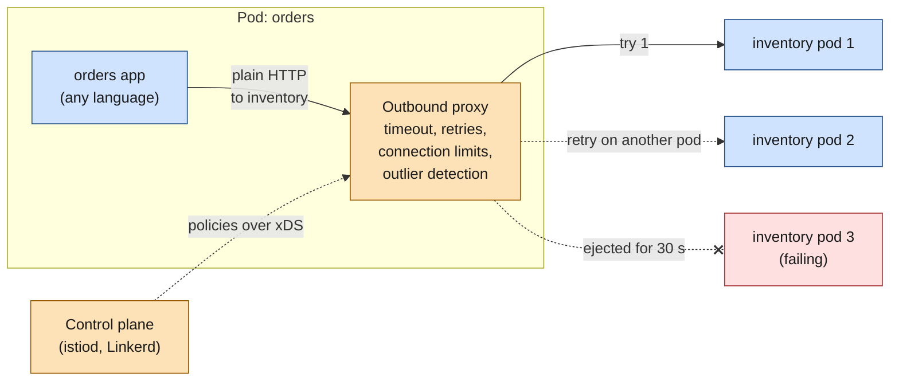
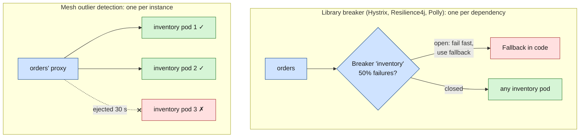
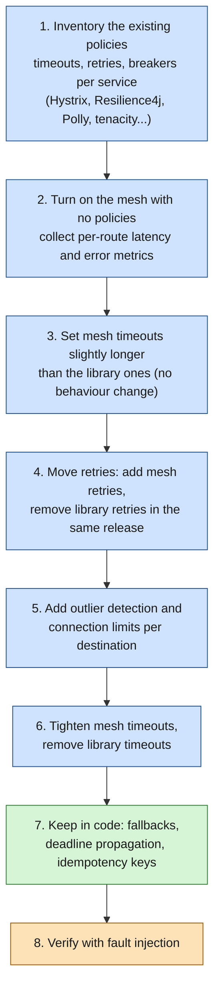

# Resilience in a service mesh

> [!abstract] In one sentence
> A service mesh takes the **network-level** resilience patterns (timeouts, retries, retry budgets, concurrency limits, ejecting bad instances, rate limiting, fault injection) out of each language's library and enforces them **in the caller's proxy**, configured once in YAML for every service. The **business-level** ones (fallbacks, idempotency, deadlines that follow a request across hops) stay in the application.

## Build-up: five languages, five resilience libraries

### The situation

The shop has grown. `orders` is Java with [[Resilience4j]], `payments` is .NET with [[Polly]], `inventory` is Go, `recommendations` is Python, the storefront backend is Node.js (see [[Resilience libraries in other languages]]). Each team picked its own library, its own defaults and its own config format:

| Service | Library | Timeout to `inventory` | Retries | Circuit breaker |
|---|---|---|---|---|
| `orders` (Java) | Resilience4j | 2 s | 3, exponential backoff | 50% failures over 20 calls |
| `payments` (.NET) | Polly | 10 s | 5, fixed 200 ms | none |
| `storefront` (Node.js) | opossum | 3 s | none | 50% over 10 s |
| `recommendations` (Python) | tenacity | none | until success | none |

During an incident, `inventory` slows down. Nobody can answer "what happens to `inventory` right now?" without reading four codebases. `recommendations` retries forever and makes it worse. The platform team wants **one policy per destination**, visible in one place, changeable without redeploying anyone. That's what the general [[Resilience patterns]] look like when they move into the mesh.

### Where the proxy sits, and why it can do this for any language

In a [[Service mesh]], every call leaves the app as plain HTTP (Hypertext Transfer Protocol) or gRPC (gRPC Remote Procedure Calls) to the **caller's own sidecar proxy** (Envoy for Istio, linkerd2-proxy for Linkerd). That outbound proxy picks the destination instance, so it is the natural place to:
- start a **timer** for the request (timeout)
- **resend** it to another instance if it fails (retry)
- count how many requests are **in flight** to that destination (concurrency limit)
- remember which instances **keep failing** and stop picking them (outlier detection)

It sees bytes and status codes, not code, so it works the same for Java, .NET, Go, Python and Node.js. The control plane pushes the policies to every proxy over xDS (Envoy's family of "discovery service" APIs (application programming interfaces): listeners, routes, clusters, endpoints), usually within seconds.



The rest of this note goes pattern by pattern, mostly with Istio's custom resources (CRDs, CustomResourceDefinitions: `VirtualService`, `DestinationRule`), because they map directly onto Envoy. Linkerd and the Kubernetes Gateway API come after.

## Pattern by pattern

### Timeouts

A `VirtualService` sets the **total** time the caller's proxy waits for a response, including all retries:

```yaml
apiVersion: networking.istio.io/v1
kind: VirtualService
metadata:
  name: inventory
spec:
  hosts: [inventory]
  http:
    - route:
        - destination: { host: inventory }
      timeout: 2s          # whole request, retries included
```

When it expires, the proxy cancels the upstream request and returns **504 Gateway Timeout** to the app. Istio leaves HTTP timeouts **disabled by default**, so without this a slow service holds callers indefinitely, exactly the problem [[Resilience patterns]] starts from.

### Retries

```yaml
      retries:
        attempts: 2                # retries, on top of the first try
        perTryTimeout: 500ms       # each try gets its own clock
        retryOn: connect-failure,refused-stream,reset,gateway-error
```

The `retryOn` conditions (Envoy's retry policies) decide **which failures are safe to retry**:

| Value | Retries when | Safe for non-idempotent calls? |
|---|---|---|
| `connect-failure` | The TCP (Transmission Control Protocol) connection couldn't be opened | Yes: the request never reached the app |
| `refused-stream` | The upstream refused the HTTP/2 stream (`REFUSED_STREAM`) | Yes: the server says it didn't process it |
| `reset` | The connection was reset or timed out, possibly **mid-request** | Not always: the server may have processed it |
| `gateway-error` | 502, 503 or 504 | Not always: a 504 from a proxy further down may hide a completed write |
| `5xx` | Any 5xx, plus `connect-failure` and `refused-stream` | No: includes 500s from a write that half-happened |
| `retriable-4xx` | 409 Conflict | Depends on the API |
| `retriable-status-codes` | Codes listed separately | Depends |

Three rules that matter:
- `perTryTimeout` must be **smaller than** `timeout`, or the first try eats the whole budget and no retry ever happens. With `timeout: 2s` and `perTryTimeout: 500ms`, the proxy can fit the first try plus two retries
- Envoy retries go to a **different instance** when possible, which is what makes them useful against one bad pod
- Envoy adds a short **exponential backoff with jitter** between tries (25 ms base by default), so retries don't all land at once

> [!warning] Istio retries by default
> Istio applies a default retry policy even without a `retries` block: 2 retries on connection failures, refused streams and 503s (`retriable-status-codes`). For a `POST /charges` that returned 503 after doing part of its work, the mesh may silently send it again. Set `retries` explicitly on routes with non-idempotent writes, and make the API idempotent (an idempotency key) rather than relying on the proxy guessing.

### Concurrency limits: what Envoy calls "circuit breakers"

```yaml
apiVersion: networking.istio.io/v1
kind: DestinationRule
metadata:
  name: inventory
spec:
  host: inventory
  trafficPolicy:
    connectionPool:
      tcp:
        maxConnections: 100            # open connections to all inventory pods, per caller proxy
      http:
        http1MaxPendingRequests: 50    # requests queued waiting for a connection
        http2MaxRequests: 200          # requests in flight at once (despite the name, also for HTTP/1.1)
        maxRequestsPerConnection: 0    # 0 = unlimited; 1 disables keep-alive
        maxRetries: 10                 # retries in flight at once, across all requests
```

These are Envoy's **circuit breakers**, but they behave like a **bulkhead**, not like the Hystrix circuit breaker: they don't trip on errors and they never "open". They cap **how much concurrent work** one caller proxy may send to one destination. When a limit is full, the proxy rejects the extra request **immediately** with a **503**, and the access log shows the response flag **`UO`** (upstream overflow). The response carries `x-envoy-overloaded: true`. The point is the same as Hystrix's thread pool per dependency: a slow `inventory` can only tie up 200 requests' worth of the caller's resources, not all of them.

The limits apply **per caller proxy**: with 30 `orders` pods, `inventory` can still receive 30 × 200 requests at once. Envoy's defaults are 1024 for connections, pending requests and requests, and 3 for concurrent retries; Istio raises the retry limit unless `maxRetries` is set.

### Outlier detection: ejecting bad instances

```yaml
    outlierDetection:
      consecutive5xxErrors: 5          # 5 failures in a row from one pod...
      consecutiveGatewayErrors: 3      # ...or 3 gateway errors (502, 503, 504)
      interval: 10s                    # how often ejections are evaluated
      baseEjectionTime: 30s            # first ejection 30 s, longer each time it repeats
      maxEjectionPercent: 50           # never eject more than half the pods
```

This is the mesh's closest thing to a **circuit breaker**, but at a different granularity:



| | Library circuit breaker | Outlier detection |
|---|---|---|
| Scope | The whole dependency (`inventory`) | One instance (`inventory` pod 3) |
| Trips on | Error rate or slow-call rate over a window | Consecutive errors, or success-rate outliers compared with the other pods |
| When it trips | Calls fail fast, the code runs a fallback | That pod stops receiving traffic; the others share it |
| Best against | The whole dependency being down or slow | One bad pod: a bad node, a memory leak, a stuck JVM (Java Virtual Machine) |
| If every pod is failing | Opens, protects the dependency | Can't eject more than `maxEjectionPercent`; traffic keeps flowing to failing pods |

So the mesh handles "one bad instance" better than the libraries ever did, but for "the whole dependency is down", what fails fast is the concurrency limit and the timeout, and the **fallback** still has to be in code.

### Retry budgets

A fixed "3 retries" multiplies load by up to 4× exactly when the destination is already struggling. A **retry budget** caps retries to a **fraction of normal traffic** instead:

- **Envoy** has it as `retry_budget` in its circuit breaker thresholds: `budget_percent` (default 20%: retries may be at most 20% of active requests) and `min_retry_concurrency` (default 3, so low-traffic services can still retry). Istio's `DestinationRule` doesn't expose it; it takes an `EnvoyFilter` patch
- **Linkerd** made budgets the default model. With a `ServiceProfile`, routes are marked retryable and share a budget:

```yaml
apiVersion: linkerd.io/v1alpha2
kind: ServiceProfile
metadata:
  name: inventory.shop.svc.cluster.local
  namespace: shop
spec:
  routes:
    - name: GET /stock/{sku}
      condition: { method: GET, pathRegex: "/stock/[^/]*" }
      isRetryable: true              # only idempotent routes
      timeout: 300ms
  retryBudget:
    retryRatio: 0.2                  # retries ≤ 20% of regular requests
    minRetriesPerSecond: 10          # floor for low-traffic services
    ttl: 10s                         # window over which the ratio is computed
```

Newer Linkerd versions (2.16 and later) also configure retries and timeouts with annotations on Kubernetes `HTTPRoute` or `Service` objects (`retry.linkerd.io/http`, `retry.linkerd.io/limit`, `timeout.linkerd.io/request`).

### Rate limiting

Two flavours in Envoy:
- **Local rate limiting**: a token bucket **inside each proxy** ("this `inventory` pod accepts at most 500 RPS (requests per second)"). No extra infrastructure, but the limit is per pod, so the global total grows with the replica count
- **Global rate limiting**: every proxy asks a central **rate limit service** (Envoy's reference implementation stores counters in Redis) before forwarding. An exact limit across all pods ("this API key gets 100 RPS in total"), at the cost of a network call and a new dependency

In Istio both are wired with `EnvoyFilter` patches today, which are version-sensitive. Rate limiting at the edge (the ingress gateway or an API gateway) is often simpler than inside the mesh.

### Fault injection: testing all of the above

The proxy can **break things on purpose** to check that timeouts, retries and fallbacks actually work before a real incident tests them:

```yaml
apiVersion: networking.istio.io/v1
kind: VirtualService
metadata:
  name: inventory-chaos
spec:
  hosts: [inventory]
  http:
    - fault:
        delay:
          percentage: { value: 10 }    # 10% of requests...
          fixedDelay: 5s               # ...wait 5 s first
        abort:
          percentage: { value: 5 }     # 5% of requests...
          httpStatus: 503              # ...get a 503 without reaching inventory
      route:
        - destination: { host: inventory }
```

Questions it answers: does `orders` really give up after 2 seconds? Does the checkout page still render with "stock unknown"? Does the breaker open? Scope it to test traffic (a header match, a test namespace) before trying it in production.

### Locality failover

`DestinationRule.trafficPolicy.loadBalancer.localityLbSetting` keeps traffic in the caller's zone and **fails over** to another zone or region when the local endpoints are unhealthy. It relies on outlier detection to know which endpoints are unhealthy, so Istio only activates locality failover when `outlierDetection` is configured on the same rule. The general idea is in [[Load balancing]].

### The same knobs elsewhere

| Mesh / API | Timeouts | Retries | Concurrency limits | Instance ejection |
|---|---|---|---|---|
| **Istio** | `VirtualService.http.timeout` | `VirtualService.http.retries` | `DestinationRule.connectionPool` | `DestinationRule.outlierDetection` |
| **Linkerd** | `ServiceProfile` route `timeout`, or `HTTPRoute` annotations | Retryable routes + retry budget | No per-destination limits | Failure accrual: consecutive failures mark an endpoint unavailable for a backoff period |
| **Kubernetes Gateway API** (`HTTPRoute`) | `timeouts.request` (whole request) and `timeouts.backendRequest` (each try) | `retry` (attempts, codes, backoff) in the experimental channel | Not in the API | Not in the API |
| **Plain Envoy** | Route `timeout`, `per_try_timeout` | `retry_policy`, `hedge_policy` | Cluster `circuit_breakers` thresholds | Cluster `outlier_detection` |

The Gateway API ([[Kubernetes Ingress]]) is becoming the shared vocabulary across meshes and ingress controllers, but resilience settings beyond timeouts are still partly experimental.

## Hedging and load shedding: what meshes can and can't do

- **Hedging** (send a second copy of a slow request to another instance, use whichever answers first): Envoy can do it (`hedge_policy`, sending a hedge when the per-try timeout fires without cancelling the first try). Istio's APIs don't expose it. In practice, hedging stays in clients that know the call is idempotent and the extra load is acceptable (gRPC clients support a hedging policy in their service config)
- **Load shedding** (a service rejecting work it can't finish in time, so the work it accepts succeeds): the inbound proxy's concurrency limits shed crudely. Envoy also has an adaptive concurrency filter and an admission control filter (rejecting a share of requests when the success rate drops), not exposed by Istio's main APIs. Shedding by **priority** (drop recommendations before checkouts) needs to know what a request is worth, so it lives in the app or a gateway

## What stays in the application

The proxy sees status codes and timings. It can't see meaning.

| Concern | Mesh | App | Why |
|---|---|---|---|
| Per-hop timeout | ✅ | | Uniform, language-independent |
| Retries on connection failures | ✅ | | The request never arrived; always safe |
| Retries on 5xx for writes | | ✅ | Only the app knows if `POST /charges` is safe to repeat (idempotency keys) |
| Retry budgets | ✅ | | Needs a view of all traffic from the caller |
| Concurrency limits (bulkhead) | ✅ | ✅ | Mesh per destination; the app still needs bounded thread/connection pools |
| Per-instance ejection | ✅ | | The proxy sees each instance; libraries usually don't |
| Fallbacks, degraded answers | | ✅ | "Show stock unknown" is a product decision |
| Deadline propagation | | ✅ | The app must pass the remaining time to the next call (gRPC deadlines, a header). The proxy only knows its own hop |
| Business timeouts ("checkout must answer in 3 s") | | ✅ | Spans several calls |
| Caching last good responses | | ✅ | Requires knowing what's cacheable |
| Trace context forwarding | | ✅ | The proxy creates spans, the app must copy `traceparent` to outbound calls (see [[Service mesh]]) |
| mTLS (mutual TLS (Transport Layer Security)), metrics | ✅ | | The mesh's core job |

So after a migration, a library like [[Resilience4j]] or [[Polly]] doesn't disappear. It shrinks to **fallbacks and deadlines**, and its retries and timeouts move to the mesh.

## Layering without multiplying

### The retry storm, in numbers

A request crosses the API gateway, `storefront`, `orders`, then `inventory`. Every layer "helpfully" retries 3 times (4 attempts each):

| Layer | Attempts it makes | Attempts reaching `inventory` |
|---|---|---|
| `orders` app (Resilience4j) | 4 | 4 |
| `orders`' sidecar, per app attempt | 4 | 4 × 4 = 16 |
| API gateway retrying `storefront`, which calls `orders` | 4 | 4 × 16 = **64** |

One user click becomes **64 requests** to an `inventory` that was already failing. That's how a brief slowdown becomes an outage that only stops when someone turns off traffic. Timeouts compound too: if the gateway gives up after 5 s while `orders` is still on its third retry, all that inner work is wasted.

### Rules

1. **Retry in one layer per hop.** Usually the caller's sidecar. Remove retries from the library once the mesh does them
2. **Retry as close to the failure as possible**, and not at the edge for anything that fans out
3. **Use budgets**, not fixed counts, where the mesh supports them
4. **`perTryTimeout` < `timeout`**, and every outer timeout **≥** the inner timeout × attempts (otherwise the outer one fires mid-retry)
5. **Only retry what's safe**: connection failures always, 5xx only on idempotent routes
6. **Don't retry overload signals blindly**: a 503 with `UO` means "you're over the limit"; retrying it adds load

### Migration plan: from libraries to the mesh



Step 4 is the dangerous one: adding mesh retries **before** removing library retries multiplies attempts (the table above). Do both in the same change, or remove the library retries first.

## Advanced problems

### 1. Retrying overflow makes overload worse
**Symptom:** `inventory` gets slow, callers see a wave of 503s, and load on `inventory` goes **up**.
**Why:** the 503s were `UO` (connection pool limits hit), and a retry policy on `5xx` or `gateway-error` resent them, sometimes to the same overloaded service.
**Fix:** don't retry overflow (budgets, `maxRetries` in `connectionPool`), and alert on the `UO` flag: it means the limit is protecting you, or is set too low.

### 2. Outlier detection ejects too much
**Symptom:** a shared dependency (the database) blips, every `inventory` pod returns 5xx, and the mesh ejects pods until a few take all the traffic and fall over.
**Why:** outlier detection assumes failures are **per instance**. When the cause is shared, ejecting doesn't help.
**Fix:** `maxEjectionPercent` (never eject more than a share), and Envoy's **panic threshold**: below 50% healthy endpoints by default, Envoy ignores health and balances across all of them (Istio's `minHealthPercent` similarly disables ejection when too few are healthy). Pair with a dependency-level breaker and fallback in the app.

### 3. Default retries doubling non-idempotent writes
**Symptom:** occasional duplicate orders or charges, no retry visible in the app code.
**Why:** Istio's default retry policy resends on 503 and some connection errors. A request that reached `payments`, did its work, then failed while answering, gets sent again.
**Fix:** explicit `retries` on write routes (`attempts: 0`, or `retryOn: connect-failure,refused-stream` only), and idempotency keys in the API.

### 4. The mesh timeout is shorter than the app's
**Symptom:** the app's own timeout is 10 s, but callers see **504** after 2 s, and the app logs "connection reset" or a cancelled request.
**Why:** the mesh `timeout` fired first and cancelled the upstream request. Two timeouts with no shared owner.
**Fix:** one owner per hop. During migration, mesh timeouts slightly **longer** than the app's; after it, remove the app's.

### 5. gRPC streams cut off at the route timeout
**Symptom:** long-lived gRPC streams or server-sent events drop at a regular interval.
**Why:** the route timeout applies to the **whole** request, which for a stream is its whole lifetime.
**Fix:** disable the route timeout for streaming routes (`timeout: 0s`), rely on idle timeouts and keepalives, and let unary gRPC calls carry deadlines (`grpc-timeout`) set by the client.

## In AWS

- **ECS (Elastic Container Service) Service Connect**: AWS-managed Envoy next to each task. Retries and outlier detection are applied automatically, and timeouts are configurable per service (`perRequestTimeoutSeconds`, `idleTimeoutSeconds`). Much less tunable than Istio
- **AWS App Mesh**: AWS's Envoy-based mesh, with retry policies, timeouts and outlier detection in its virtual routers and nodes. **End of support 30 September 2026**: recognize it in older architectures, don't build on it
- **VPC Lattice**: service-to-service routing across VPCs (Virtual Private Clouds) and accounts, with health checks and IAM (Identity and Access Management) auth, but no fine-grained retry or breaker policies. Resilience stays in the clients

Details: [[Proxies, load balancing and discovery in AWS]].

## Practice

> [!example]- `timeout: 1s`, `retries.attempts: 3`, `perTryTimeout: 500ms`. The first try hangs. How many tries actually happen?
> Two at most. The first try is cut at 500 ms, the retry (after a short backoff) starts at about 525 ms and gets cut by the overall 1 s timeout before its own 500 ms run out. The third and fourth attempts never start. To fit them, raise `timeout` to at least 4 × 500 ms plus backoff, or lower `perTryTimeout`.

> [!example]- 20 `orders` pods each have `http2MaxRequests: 100` to `inventory`. How many concurrent requests can `inventory` receive from `orders`, and what does an `orders` pod see when it's over its share?
> Up to 20 × 100 = 2000, because the limits are per caller proxy. A pod over its 100 gets an immediate 503 from its own sidecar, with response flag `UO` and `x-envoy-overloaded: true`, without the request reaching `inventory`.

> [!example]- After moving to Istio, which parts of `orders`' Resilience4j configuration can be deleted, and which must stay?
> Delete: retries and time limiters on calls the mesh now covers, and the per-dependency thread-pool bulkheads if `connectionPool` limits replace them. Keep: fallback methods (degraded answers), idempotency handling for writes, deadline propagation to downstream calls, and possibly a dependency-level breaker that triggers the fallback when the whole dependency is down.

## Easy to get wrong
- Calling Envoy's "circuit breakers" circuit breakers in the Hystrix sense: they're concurrency limits that never open, closer to a bulkhead
- Treating outlier detection as a dependency-level breaker: it ejects instances, and can't help when every instance is failing
- Adding mesh retries without removing library retries: attempts multiply at every layer
- `perTryTimeout` equal to or larger than `timeout`, so no retry ever fits
- Assuming the mesh knows which calls are idempotent: `5xx` retries on writes duplicate work
- Forgetting Istio's default retries, and Istio's default of **no** HTTP timeout
- Expecting the proxy to propagate deadlines or forward trace headers: the app does both
- Connection pool limits are per caller proxy, not a global cap on the destination

## Related
- Patterns:: [[Resilience patterns]]
- Replaces in app code:: [[Hystrix]], [[Resilience4j]], [[Polly]], [[Resilience libraries in other languages]]
- Depends on:: [[Service mesh]], [[Load balancing]]
- Istio itself:: [[Istio]] (install, mTLS, policies, debugging, upgrades)
- Gateway API:: [[Kubernetes Ingress]]
- History:: [[Spring Cloud and Netflix OSS]]
- In AWS:: [[Proxies, load balancing and discovery in AWS]]

## Flashcards
#flashcards

Why can a mesh enforce timeouts and retries for any language? :: The caller's outbound proxy carries every request, so it times, retries and limits calls without touching the code
What is Istio's default HTTP timeout? :: None: timeouts are disabled unless set in the VirtualService
What does perTryTimeout do, and how must it relate to timeout? :: Limits each attempt; it must be smaller than the overall timeout or retries never fit
Which retryOn conditions are safe for non-idempotent calls? :: connect-failure and refused-stream: the request never reached the app
What are Envoy's "circuit breakers" really? :: Concurrency limits per destination (connections, pending, requests, retries), like a bulkhead; they never open
What does the UO response flag mean? :: Upstream overflow: a connection pool limit was hit and Envoy rejected the request with 503
Outlier detection vs a library circuit breaker? :: Outlier detection ejects individual failing instances; a library breaker fails the whole dependency fast and runs a fallback
What does maxEjectionPercent protect against? :: Ejecting so many instances that the rest are overloaded when the failure is shared
What is a retry budget? :: A cap on retries as a fraction of normal traffic (e.g. 20%), instead of a fixed count per request
How does Linkerd configure retry budgets? :: ServiceProfile retryBudget: retryRatio, minRetriesPerSecond, ttl; routes marked isRetryable
Local vs global rate limiting in Envoy? :: Local: token bucket per proxy, scales with replicas. Global: proxies ask a central rate limit service for exact totals
What is fault injection for? :: Deliberately adding delays or errors to verify timeouts, retries and fallbacks work
What stays in the application after moving resilience to a mesh? :: Fallbacks, idempotency, deadline propagation, business timeouts, caching, trace header forwarding
How do retries multiply across layers? :: Attempts per layer multiply: 4 × 4 × 4 = 64 requests from one click
What's the safest step order when moving retries to the mesh? :: Add mesh retries and remove library retries in the same change (or remove library ones first)
Why do long gRPC streams get cut by a mesh? :: The route timeout covers the whole stream; set it to 0 for streaming routes
Gateway API HTTPRoute timeout fields? :: timeouts.request (whole request) and timeouts.backendRequest (each try)
What does ECS Service Connect give for resilience? :: Automatic retries and outlier detection, configurable per-request and idle timeouts
