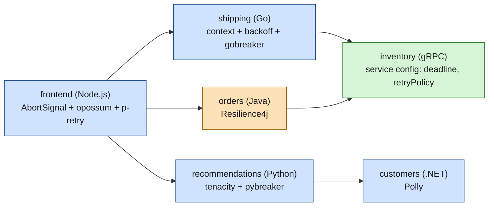
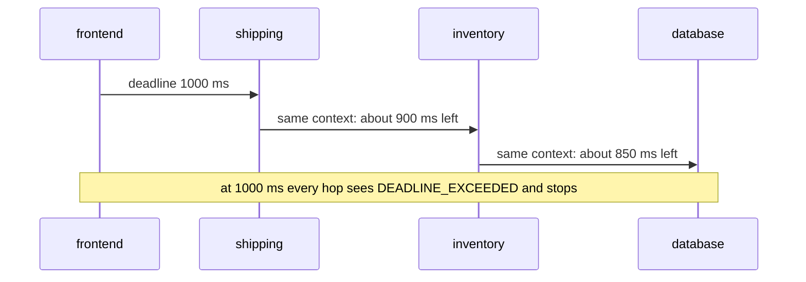

# Resilience libraries in other languages

> [!abstract] In one sentence
> Outside the Java world of [[Hystrix]] and [[Resilience4j]] and the .NET world of [[Polly]], every language grew its own toolkit for the same [[Resilience patterns]]: Go uses `context` deadlines, hand-written backoff and **gobreaker**; Python uses **tenacity** and **pybreaker**; Node.js uses `AbortSignal` and **opossum**; gRPC builds deadlines, retries and hedging into the protocol's client. Each one works, but a shop with five languages ends up with five configurations and five meanings of "failure", which is the main reason resilience moved into the [[Service mesh]].

## Build-up: the shop stops being all Java

The shop from [[Spring Cloud and Netflix OSS]] started as Java services, so one library (Hystrix, later Resilience4j) covered every caller. Then new teams arrived with their own tools:

- `shipping`, written in **Go**, calls a carrier's API (application programming interface) and `inventory`
- `recommendations`, written in **Python**, calls `customers` and a feature store
- `frontend`, a **Node.js** BFF (backend for frontend: a thin service that shapes data for one user interface), calls `orders`, `recommendations` and `shipping`
- `inventory` exposes a **gRPC** API (gRPC Remote Procedure Calls, an RPC (remote procedure call) framework running over HTTP/2, see [[HTTP2]])

None of these can use a JVM (Java Virtual Machine) library. Each team needs timeouts, retries with backoff, a circuit breaker and a bulkhead, so each team picks the local equivalent and configures it its own way:



The rest of this note is a short hands-on tour of each toolkit, then the price of having all of them at once.

## Go

Go has no single dominant resilience framework. The standard library gives timeouts and cancellation (`context`), and small libraries add the rest.

### Timeouts: context and http.Client, and why both

```go
// One client, shared by the whole service, with a hard ceiling for any request
var client = &http.Client{Timeout: 3 * time.Second} // the zero value means NO timeout

func quote(ctx context.Context, parcel Parcel) (*Quote, error) {
    // This call's own budget, and never more than what the caller has left
    ctx, cancel := context.WithTimeout(ctx, 800*time.Millisecond)
    defer cancel()

    req, err := http.NewRequestWithContext(ctx, http.MethodPost, carrierURL, body(parcel))
    if err != nil {
        return nil, err
    }
    resp, err := client.Do(req)
    if err != nil {
        return nil, err // context.DeadlineExceeded if the 800 ms ran out
    }
    defer resp.Body.Close()
    return decode(resp.Body)
}
```

- `http.Client{Timeout}` is a **safety net**: it covers the whole exchange (connect, headers, reading the body) for every request made through the client, even one where someone forgot a context. The default `http.Client{}` and `http.DefaultClient` have **no timeout at all**
- `context.WithTimeout` is the **per-call budget**, and it **propagates**: the context of an incoming request already carries the caller's deadline, and `WithTimeout` can only shorten it. When it expires, everything using that context (the HTTP call, a database query, a goroutine) is cancelled, so work stops instead of continuing for a caller that already gave up

### Retries with exponential backoff and jitter

Hand-written, it fits in a few lines. "Full jitter": sleep a random time between zero and the exponential ceiling, so a thousand failing clients don't retry in lock-step:

```go
func withRetry(ctx context.Context, attempts int, call func(context.Context) error) error {
    base, ceiling := 100*time.Millisecond, 2*time.Second
    var err error
    for i := 0; i < attempts; i++ {
        if err = call(ctx); err == nil || !retryable(err) {
            return err
        }
        backoff := min(ceiling, base<<i)                          // 100, 200, 400 ms ... capped
        sleep := time.Duration(rand.Int64N(int64(backoff)))       // math/rand/v2: full jitter
        select {
        case <-time.After(sleep):
        case <-ctx.Done():                                        // don't sleep past the deadline
            return ctx.Err()
        }
    }
    return err
}
```

The library `github.com/cenkalti/backoff` does the same with an `ExponentialBackOff` (initial interval, multiplier, randomization factor, maximum elapsed time) and `backoff.Retry(operation, policy)`, plus `backoff.Permanent(err)` to stop on errors that retrying can't fix. Only retry what is **safe to repeat** (idempotent calls) and what can **succeed next time** (connection refused, 503), never a 400.

### Circuit breaker: sony/gobreaker

```go
import "github.com/sony/gobreaker"

var inventoryCB = gobreaker.NewCircuitBreaker(gobreaker.Settings{
    Name:        "inventory",
    MaxRequests: 3,                // calls let through while half-open
    Interval:    60 * time.Second, // closed state: reset the counts every 60 s
    Timeout:     30 * time.Second, // open state: wait 30 s before going half-open
    ReadyToTrip: func(c gobreaker.Counts) bool {
        return c.Requests >= 20 && float64(c.TotalFailures)/float64(c.Requests) >= 0.5
    },
    OnStateChange: func(name string, from, to gobreaker.State) {
        log.Printf("breaker %s: %s -> %s", name, from, to)
    },
})

func stock(ctx context.Context, sku string) (*Stock, error) {
    res, err := inventoryCB.Execute(func() (interface{}, error) {
        return fetchStock(ctx, sku)
    })
    if errors.Is(err, gobreaker.ErrOpenState) || errors.Is(err, gobreaker.ErrTooManyRequests) {
        return StockUnknown(sku), nil // fallback: the breaker refused the call
    }
    if err != nil {
        return nil, err
    }
    return res.(*Stock), nil
}
```

`Execute` counts any returned error as a failure, and a panic too. Version 2 of the library adds generics (`gobreaker.NewCircuitBreaker[*Stock]`), which removes the type assertion.

### Bulkhead: a buffered channel as a semaphore

```go
var carrierSlots = make(chan struct{}, 10) // at most 10 concurrent calls to the carrier

func callCarrier(ctx context.Context, p Parcel) (*Quote, error) {
    select {
    case carrierSlots <- struct{}{}: // took a slot
        defer func() { <-carrierSlots }()
        return quote(ctx, p)
    default: // all 10 busy: reject now instead of queueing
        return nil, ErrCarrierBusy
    }
}
```

`golang.org/x/sync/semaphore` does the same with weighted slots and an `Acquire(ctx, n)` that waits until the context's deadline.

## Python

### Timeouts: requests has none by default

```python
import requests, httpx

requests.get("http://customers:8080/c/42")                 # no timeout: can hang for ever
requests.get("http://customers:8080/c/42", timeout=(1, 3)) # 1 s to connect, 3 s between bytes read

client = httpx.Client(timeout=httpx.Timeout(2.0, connect=0.5))  # httpx defaults to 5 s
```

With `requests`, the read timeout is the **maximum silence between two bytes**, not a total: a server that trickles one byte every 2 seconds never trips a 3-second read timeout. For a total budget on async code, wrap the call: `await asyncio.wait_for(fetch(), timeout=2)`.

### Retries: tenacity

```python
import httpx
from tenacity import retry, stop_after_attempt, wait_exponential_jitter, retry_if_exception_type

@retry(
    stop=stop_after_attempt(3),                                   # 1 call + 2 retries
    wait=wait_exponential_jitter(initial=0.1, max=2),            # 0.1, 0.2, 0.4 s ... plus jitter
    retry=retry_if_exception_type((httpx.ConnectError, httpx.ReadTimeout)),
    reraise=True,                                                 # raise the real error, not RetryError
)
def get_customer(customer_id: str) -> dict:
    r = client.get(f"http://customers:8080/c/{customer_id}")
    r.raise_for_status()
    return r.json()
```

Tenacity also works on `async def` functions, and has `stop_after_delay` to cap the total time spent retrying.

### Circuit breaker: pybreaker

```python
import pybreaker

customers_breaker = pybreaker.CircuitBreaker(fail_max=5, reset_timeout=30)  # 5 failures → open for 30 s

@customers_breaker
def get_customer_guarded(customer_id: str) -> dict:
    return get_customer(customer_id)

try:
    profile = get_customer_guarded("42")
except pybreaker.CircuitBreakerError:
    profile = {"segment": "unknown"}   # fallback while the circuit is open
```

`fail_max` counts **consecutive** failures. The state lives in the process; pybreaker can store it in Redis to share it between processes.

### Bulkhead: asyncio.Semaphore

```python
feature_store_slots = asyncio.Semaphore(20)

async def features(user_id: str) -> dict:
    async with feature_store_slots:                       # waits for a free slot
        return await asyncio.wait_for(fetch_features(user_id), timeout=0.5)
```

A semaphore makes extra callers **wait**; to reject instead, check `feature_store_slots.locked()` first and fail fast.

## Node.js

### Timeouts: AbortSignal with fetch

```js
// Node 18+ has fetch; AbortSignal.timeout cancels the request after 2 s
const res = await fetch("http://orders:8080/orders/42", { signal: AbortSignal.timeout(2000) });

// combine with the incoming request's signal: stop if either the client left or 2 s passed
const signal = AbortSignal.any([req.signal, AbortSignal.timeout(2000)]);
```

On timeout, `fetch` rejects with a `TimeoutError`. Node's event loop doesn't run out of threads like a JVM server, but unanswered calls still pile up memory, sockets and open requests.

### Circuit breaker, timeout and fallback: opossum

```js
const CircuitBreaker = require("opossum");

async function getRecommendations(userId) {
  const res = await fetch(`http://recommendations:8000/u/${userId}`, { signal: AbortSignal.timeout(1500) });
  if (!res.ok) throw new Error(`status ${res.status}`);
  return res.json();
}

const breaker = new CircuitBreaker(getRecommendations, {
  timeout: 1500,                 // opossum's own timer: counts as a failure after 1.5 s
  errorThresholdPercentage: 50,  // open when half the calls in the rolling window failed
  resetTimeout: 30000,           // try again (half-open) after 30 s
});

breaker.fallback(() => ({ items: [], reason: "recommendations unavailable" }));
breaker.on("open", () => console.warn("recommendations breaker OPEN"));

const recs = await breaker.fire(userId);
```

opossum's `timeout` makes the **breaker** give up, but on its own it doesn't cancel the underlying request: the `AbortSignal` inside the function is what really stops it.

### Retries: p-retry

```js
import pRetry, { AbortError } from "p-retry";

const order = await pRetry(async () => {
  const res = await fetch("http://orders:8080/orders/42", { signal: AbortSignal.timeout(1000) });
  if (res.status === 404) throw new AbortError("no such order");  // don't retry this one
  if (!res.ok) throw new Error(`status ${res.status}`);
  return res.json();
}, { retries: 2, randomize: true });                               // exponential backoff with jitter
```

## gRPC: resilience built into the client

gRPC is the one place where several patterns come **with the framework**, the same in every language, configured in data rather than code.

### Deadlines, propagated across hops

A gRPC call carries a **deadline** (sent as the `grpc-timeout` header). In Go, it comes from the context:

```go
ctx, cancel := context.WithTimeout(ctx, 500*time.Millisecond)
defer cancel()
stock, err := inventoryClient.GetStock(ctx, &pb.StockRequest{Sku: sku})
if status.Code(err) == codes.DeadlineExceeded { /* gave up */ }
```

On the server, the handler's context carries the **remaining** time. If `inventory` passes that same context to its own downstream call, the budget shrinks at each hop, and when the original caller gives up, every service in the chain stops working on the request.



### Retry policy and retry throttling in the service config

The **service config** is JSON (JavaScript Object Notation) attached to a channel (by the client, or published by the server's name resolver):

```json
{
  "methodConfig": [{
    "name": [{ "service": "shop.Inventory" }],
    "timeout": "0.5s",
    "retryPolicy": {
      "maxAttempts": 3,
      "initialBackoff": "0.1s",
      "maxBackoff": "1s",
      "backoffMultiplier": 2,
      "retryableStatusCodes": ["UNAVAILABLE"]
    }
  }],
  "retryThrottling": { "maxTokens": 10, "tokenRatio": 0.1 }
}
```

```go
conn, err := grpc.NewClient("dns:///inventory:9090",
    grpc.WithTransportCredentials(insecure.NewCredentials()),
    grpc.WithDefaultServiceConfig(serviceConfigJSON))
```

- `retryPolicy`: up to 3 attempts, exponential backoff with randomization, only on the listed status codes. `maxAttempts` includes the first call
- `retryThrottling`: a token bucket per server. Each failed call removes 1 token, each success adds `tokenRatio`; when the bucket falls to half of `maxTokens` or below, retries stop. That's a **retry budget**: when the server is broadly failing, the client stops multiplying the load
- The specification also defines a **hedging policy** (`hedgingPolicy`: send a second copy of the request after a delay if the first is slow, keep whichever answers first). Support differs between language implementations; check before relying on it
- A policy can only be **one** of `retryPolicy` or `hedgingPolicy` per method

gRPC has no built-in circuit breaker or bulkhead; those come from interceptors, the load-balancing policy (outlier detection exists in some implementations), or a proxy.

## Java beyond Resilience4j

### Failsafe

A small library with no dependencies, policies built with builders and composed in one call:

```java
RetryPolicy<Object> retry = RetryPolicy.builder()
    .handle(ConnectException.class)
    .withBackoff(Duration.ofMillis(100), Duration.ofSeconds(2))
    .withJitter(0.25)
    .withMaxRetries(2)
    .build();

CircuitBreaker<Object> breaker = CircuitBreaker.builder()
    .withFailureThreshold(5)
    .withDelay(Duration.ofSeconds(30))
    .build();

Fallback<Object> fallback = Fallback.of(Stock.unknown(sku));

Stock stock = Failsafe.with(fallback, retry, breaker).get(() -> inventory.stock(sku));
```

The **last** policy listed is the innermost: here the breaker wraps the call, retries wrap the breaker, and the fallback wraps everything.

### Alibaba Sentinel

Sentinel protects named **resources** with **rules**: flow control (queries per second or concurrent threads per resource), circuit breaking (on slow-call ratio, error ratio or error count), and system protection (CPU (central processing unit) load). Rules can be changed at runtime from its **dashboard** and pushed to every instance. It's the resilience piece of Spring Cloud Alibaba, widely used in China:

```java
try (Entry entry = SphU.entry("inventory.stock")) {
    return inventory.stock(sku);
} catch (BlockException e) {          // rejected by a flow or circuit-breaking rule
    return Stock.unknown(sku);
}
```

### Netflix concurrency-limits

After putting Hystrix in maintenance mode (2018), Netflix pointed to **adaptive concurrency limits** instead of fixed thresholds. The idea comes from TCP (Transmission Control Protocol) congestion control: by **Little's law**, the number of requests in flight = throughput × latency, so when latency rises above its baseline, the service is queueing. The library measures latency and **adjusts the allowed concurrency** automatically (algorithms named after TCP ones, such as Vegas, plus a Gradient algorithm), rejecting excess requests early. No one has to guess "10 threads for `inventory`"; the limit follows what the dependency can actually handle.

## Finagle: the ancestor

**Finagle** is Twitter's RPC system for the JVM (written in Scala, open-sourced around 2011). Many ideas now taken for granted were in it early:
- **Retry budgets**: retries allowed only up to a percentage of normal traffic, instead of a fixed count per request
- **Deadlines** carried with the request and propagated to downstream calls
- **Failure accrual**: a client marks one backend host as dead after consecutive failures, a per-host circuit breaker (what a mesh now calls outlier detection)
- Latency-aware load balancing between instances

The first **Linkerd** (1.x, 2016) was Finagle packaged as a standalone proxy: the same resilience, now **outside** the application and usable from any language. That's the direct bridge from libraries to the [[Service mesh]] (Linkerd 2 was later rewritten in Rust and Go).

## Side by side

| Language | Library | Timeout | Retry | Circuit breaker | Bulkhead | Rate limit | Maintained (2026) |
|---|---|---|---|---|---|---|---|
| Java | [[Hystrix]] | ✅ | ❌ (left to Ribbon) | ✅ | ✅ thread pool or semaphore | ❌ | ❌ maintenance since 2018 |
| Java | [[Resilience4j]] | ✅ TimeLimiter | ✅ | ✅ | ✅ | ✅ | ✅ |
| Java | Failsafe | ✅ | ✅ | ✅ | ✅ | ✅ | ✅ |
| Java | Alibaba Sentinel | ❌ (slow-call rules) | ❌ | ✅ | ✅ thread count | ✅ flow control | ✅ |
| Java | Netflix concurrency-limits | ❌ | ❌ | ❌ | ✅ adaptive | ✅ adaptive | ✅ |
| .NET | [[Polly]] | ✅ | ✅ | ✅ | ✅ | ✅ | ✅ |
| Go | stdlib `context` + `cenkalti/backoff` + `sony/gobreaker` | ✅ | ✅ | ✅ | by hand (channel) | `golang.org/x/time/rate` | ✅ |
| Python | `tenacity` + `pybreaker` + client timeouts | ✅ (client) | ✅ | ✅ | `asyncio.Semaphore` | separate libraries | ✅ |
| Node.js | `AbortSignal` + `opossum` + `p-retry` | ✅ | ✅ | ✅ | ❌ | ❌ | ✅ |
| Any (gRPC) | Built into the client | ✅ deadlines | ✅ + throttling | ❌ | ❌ | ❌ | ✅ |
| Scala/JVM | Finagle | ✅ | ✅ budgets | ✅ failure accrual | ✅ | ✅ | ✅ (mostly Twitter/X internal use) |

## The cost of the polyglot zoo

Every row above works. The problem is having **all of them at once**:

| Problem | What it looks like |
|---|---|
| **Different configuration** | Timeouts in YAML for Java, in Go code, in Python decorators, in a JSON service config. A platform team can't answer "what's the retry policy for calls to `inventory`?" without reading five codebases |
| **Different meanings of "failure"** | gobreaker counts every error, pybreaker counts consecutive failures, opossum a percentage over a rolling window, Resilience4j a sliding window with slow calls. Is a 404 a failure? A 429? Each library decides differently |
| **Different defaults** | Go's default client and Python `requests` have **no timeout**, httpx has 5 s, Node's `fetch` has none. The service someone forgot to configure is the one that hangs |
| **Inconsistent metrics** | Each library exports breaker states and retry counts in its own format, if at all. No single dashboard shows every circuit |
| **Changes need redeploys** | Tightening a timeout on `inventory` means a code change and a release in every caller, in every language |
| **Retries stacked blindly** | Each team adds retries on its own hop, without seeing the others' |

That's what a [[Service mesh]] fixes: one proxy next to every service, whatever the language, applying timeouts, retries with budgets, outlier detection and connection limits from **central configuration**, with uniform metrics. What stays in the code is what only the application knows: **fallbacks** and **deadline propagation** (passing the incoming context on). The details are in [[Resilience in a service mesh]].

## Advanced problems

### 1. The caller gave up, the work goes on
**Symptom:** `frontend` times out after 2 s, but `shipping`, `inventory` and the database keep working on the request for 10 more seconds; under load, the system spends its capacity on answers nobody will read.
**Why:** each hop starts a fresh timeout instead of inheriting the caller's deadline (a new `context.Background()` in Go, no signal passed in Node, no deadline set on a gRPC call).
**Fix:** propagate the incoming context or signal into every outgoing call, so the deadline shrinks hop by hop; gRPC does this automatically if the context is passed on.

### 2. Retries at every hop multiply
**Symptom:** a brief `inventory` slowdown turns into an outage; its traffic jumps far above normal.
**Why:** `frontend`, `shipping` and the gRPC client each retry 3 times: one user request becomes up to 3 × 3 × 3 = 27 calls to `inventory`, exactly when it's least able to cope.
**Fix:** retry at **one** layer (usually closest to the failing service), use retry budgets (gRPC `retryThrottling`, a mesh's retry budget), and jittered backoff.

### 3. Every replica learns separately
**Symptom:** the circuit breaker "doesn't work": `inventory` stays hammered for a long time after it starts failing.
**Why:** breaker state lives **in each process**. With 40 `shipping` replicas, each must see its own failures before opening, and each probes again when its own timeout expires.
**Fix:** accept it (it's usually fine), tune thresholds per replica traffic, share state where the library supports it (pybreaker with Redis), or move breaking to the server side (adaptive concurrency limits, mesh outlier detection seeing all traffic per host).

### 4. A Python worker that never returns
**Symptom:** `recommendations` workers slowly all become busy and the service stops answering, with no errors in the logs.
**Why:** `requests.get(url)` without `timeout=` waits for ever on a server that accepted the connection and never answers. Each stuck call holds a worker.
**Fix:** always pass `timeout=(connect, read)`, or use httpx (5 s default) and set an explicit value anyway; add a lint rule for calls without a timeout.

## Practice

> [!example]- The Go `shipping` service uses `http.Client{}` and `context.Background()` for its calls to the carrier. What two problems does that create, and how do you fix them?
> No timeout at all: a hung carrier ties up the goroutine and connection for ever (the zero-value client never times out). And no deadline propagation: even if `frontend` gave up, `shipping` keeps waiting. Fix: a client with `Timeout` as a safety net, and `context.WithTimeout(incomingCtx, …)` from the request's context for each call.

> [!example]- gRPC `retryThrottling` is `{"maxTokens": 10, "tokenRatio": 0.1}`. `inventory` starts failing every call. What happens to retries?
> The bucket starts at 10 tokens. Each failure removes 1. Once it drops to 5 or below (half of `maxTokens`), the client stops retrying and only sends original calls. Successes add 0.1 each, so about 10 successes are needed per lost token before retries resume. The client stops amplifying load on a failing server.

> [!example]- `frontend` (opossum, 1.5 s timeout) calls `recommendations` (tenacity, 3 attempts with backoff up to 2 s, httpx 5 s timeout). What's wrong?
> The inner budget is far larger than the outer one: `recommendations` can spend over 10 s retrying while `frontend` has given up after 1.5 s. Inner timeouts and the whole retry sequence must fit inside the caller's deadline, and the deadline should be propagated so `recommendations` stops when `frontend` gives up.

## Easy to get wrong

- Assuming HTTP clients have a timeout by default: Go's `http.Client{}`, Python `requests` and Node's `fetch` don't
- Treating `requests`' read timeout as a total time limit: it's the maximum gap between bytes
- Starting a fresh timeout at each hop instead of passing on the caller's deadline
- Letting a breaker's timeout "time out" a call without cancelling it (opossum without an `AbortSignal`)
- Retrying non-idempotent calls, or errors that can't succeed on retry (400, 404)
- Retrying at every layer of the call chain
- Expecting a circuit breaker to be shared across replicas: it's per process
- Comparing breaker thresholds between libraries as if they meant the same thing (consecutive vs percentage vs sliding window)

## Related
- Patterns:: [[Resilience patterns]]
- Same job in Java and .NET:: [[Hystrix]], [[Resilience4j]], [[Polly]]
- Where it moved:: [[Resilience in a service mesh]], [[Service mesh]]
- History:: [[Spring Cloud and Netflix OSS]]
- Protocols:: [[HTTP2]] (what gRPC runs on), [[Load balancing]]

## Flashcards
#flashcards

Why did the "one resilience library" approach break down? :: Services in several languages each needed their own library, configuration and semantics for failure
Go: why set both http.Client Timeout and a context deadline? :: The client Timeout is a safety net for every request; the context is the per-call budget that propagates and cancels downstream work
What timeout does Go's zero-value http.Client have? :: None: it can wait for ever
What is full jitter? :: Sleep a random time between 0 and the exponential backoff ceiling, so clients don't retry in sync
Go circuit breaker library and its key settings? :: sony/gobreaker: MaxRequests (half-open), Interval (closed count reset), Timeout (open duration), ReadyToTrip
Simplest bulkhead in Go? :: A buffered channel used as a semaphore, rejecting with select/default when full
What timeout does Python requests use by default? :: None: always pass timeout=(connect, read)
What does requests' read timeout measure? :: The maximum wait between bytes, not the total time
Python retry library and its building blocks? :: tenacity: stop_ (when to give up), wait_ (backoff, e.g. wait_exponential_jitter), retry_ (which errors)
Python circuit breaker library? :: pybreaker: CircuitBreaker(fail_max, reset_timeout), raises CircuitBreakerError when open
Node.js way to time out fetch? :: AbortSignal.timeout(ms), combined with the request's signal via AbortSignal.any
Node.js circuit breaker library? :: opossum: timeout, errorThresholdPercentage, resetTimeout, fallback(), fire()
Does opossum's timeout cancel the underlying request? :: No, only the breaker gives up; pass an AbortSignal to really cancel it
How do gRPC deadlines behave across hops? :: Sent with the call; the server's context holds the remaining time, and passing it on shrinks the budget at each hop
Where is the gRPC retry policy configured? :: In the service config JSON: methodConfig retryPolicy (maxAttempts, backoff, retryableStatusCodes)
What does gRPC retryThrottling do? :: A token bucket: failures cost 1, successes add tokenRatio; retries stop when tokens fall to half of maxTokens
Which gRPC policies are mutually exclusive per method? :: retryPolicy and hedgingPolicy
Failsafe policy order in Failsafe.with(a, b, c)? :: The last one (c) is innermost, the first (a) outermost
What is Alibaba Sentinel? :: Java flow control and circuit breaking on named resources, rules changed live from a dashboard
Idea behind Netflix concurrency-limits? :: Adaptive concurrency from latency (Little's law, TCP-like algorithms) instead of fixed thresholds
What did Finagle pioneer? :: Retry budgets, deadline propagation, failure accrual (per-host breaking), on the JVM at Twitter
How is Finagle connected to service meshes? :: Linkerd 1.x was Finagle as a standalone proxy, resilience outside the app
Why do circuit breakers "learn slowly" with many replicas? :: State is per process: each replica must see failures itself before opening
What stays in the application even with a mesh? :: Fallbacks and propagating the deadline/context to outgoing calls
