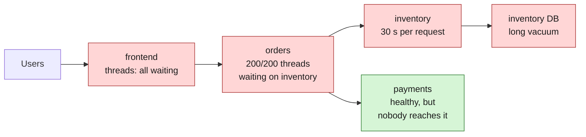
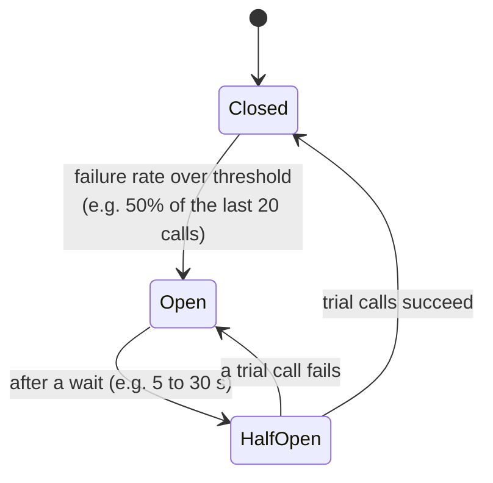

# Resilience patterns

> [!abstract] In one sentence
> When one service calls another over the network, the call can be slow, fail, or never answer. **Resilience patterns** (timeouts, retries with backoff and jitter, circuit breakers, bulkheads, fallbacks, rate limiting, load shedding, hedging) stop one sick dependency from taking the whole system down. For about a decade they lived **inside application code**, as a library per language ([[Hystrix]], [[Resilience4j]], [[Polly]] and others); today the transport-level ones are mostly enforced by the **platform** (a [[Service mesh]] or cloud proxies), and only the business-level ones stay in the app.

## Build-up: one slow dependency

The shop: `orders` is a web service with a pool of **200 worker threads** (Tomcat's default). Each checkout calls `inventory` (is it in stock?) and `payments` (charge the card). Normally `inventory` answers in 20 ms.

One evening `inventory`'s database starts a long vacuum and `inventory` takes 30 seconds per request. Nothing in `inventory` has crashed. Follow what happens in `orders`:

- At 100 checkouts per second with 30-second waits, `orders` would need 3,000 threads. It has 200. They're all taken within about 2 seconds, every one of them waiting on `inventory`
- New requests to `orders`, **even ones that never touch `inventory`** (order history, the account page), queue up and time out
- The `frontend`, which calls `orders`, now has all *its* threads waiting on `orders`. The whole shop is down because one database is slow

That's a **cascading failure**: slowness is contagious, because a waiting caller holds resources. A crashed dependency is often *less* dangerous than a slow one: a crash answers "connection refused" instantly, a slow one ties the caller up.

Each stage below fixes one part of this.

### Stage 1: timeouts

First rule: **never wait for ever**. Many clients do by default: Java's old `HttpURLConnection` has no timeout unless set, Python's `requests` has none, a database driver may wait minutes.

There are several timeouts, and they protect against different things:

| Timeout | Covers | Typical value |
|---|---|---|
| **Connect** | Establishing the TCP (Transmission Control Protocol) connection (and TLS (Transport Layer Security) handshake) | Short: 100 ms to 1 s. A host that doesn't answer a connect in a second is not going to |
| **Read / per-attempt** | Waiting for the response once connected | Just above the dependency's slow-but-normal latency (its p99 or p99.9, the 99th / 99.9th percentile) |
| **Total / overall** | The whole operation, including retries | What the caller can afford given *its own* caller's timeout |

With a 1-second read timeout, `orders` threads are freed after 1 s instead of 30. At 100 requests per second that's 100 threads busy instead of all 200 forever: bad, but `orders` survives.

**Timeouts must shrink as you go deeper.** If the user's browser gives up after 10 s, the `frontend` should give up on `orders` after, say, 8 s, and `orders` on `inventory` after 1 to 2 s. A deeper timeout longer than its caller's is wasted work: the callee keeps computing an answer nobody is waiting for. The clean version is **deadline propagation**: the first service sets an absolute deadline and passes the remaining time downstream (gRPC (gRPC Remote Procedure Calls) does this natively with deadlines).

### Stage 2: retries, with backoff and jitter

Some failures are **transient**: a connection reset, one instance restarting, a 503 during a deploy. Trying again a moment later usually works. So the client retries.

Three things make a retry safe instead of dangerous:

1. **Only retry what's safe to repeat.** A `GET /stock/42` can run twice. A `POST /charges` that timed out may **have succeeded**: retrying it charges the card twice. Retry non-idempotent calls only with an **idempotency key** (the client sends `Idempotency-Key: 7f3a...`, and the server returns the first result for a repeated key instead of acting again)
2. **Wait between attempts, more each time: exponential backoff.** 100 ms, 200 ms, 400 ms, 800 ms, capped. A dependency that's struggling needs room, not an immediate second wave
3. **Add randomness: jitter.** If 1,000 clients all failed at the same instant and all wait exactly 200 ms, they all come back at the same instant: a synchronized spike. "Full jitter" waits a random time between 0 and the backoff: `sleep = random(0, min(cap, base × 2^attempt))`

And a fourth one that's easy to miss:

4. **Limit retries globally, not just per call: a retry budget.** "At most 3 attempts per call" still triples the load on a dependency that's failing everything. A budget says "retries may add at most 10–20% on top of normal traffic"; past that, failures are returned as they are

> [!warning] Retry storms
> Retries **multiply across layers**. If the `frontend` retries 3 times, `orders` retries 3 times, and a gateway in front retries 3 times, one user click can become 3 × 3 × 3 = 27 calls to `inventory`, exactly when `inventory` is already overloaded. This is how a short slowdown becomes an outage that only ends when someone turns retries off. Retry in **one** layer (usually the one closest to the failure), and use budgets.

### Stage 3: circuit breakers

With timeouts and retries, `orders` now spends 1 s × 3 attempts on every checkout while `inventory` is sick, and keeps hammering it. If `inventory` failed the last 50 calls, the next one will fail too. Why try?

A **circuit breaker** (named after the electrical one, popularized by Michael Nygard's book *Release It!* in 2007) sits in front of the dependency and tracks recent results:

- **Closed**: calls go through, results are counted
- **Open**: calls **fail immediately**, without touching the network. `orders` answers in microseconds instead of seconds, and `inventory` gets a break to recover
- **Half-open**: after the wait, a few trial calls go through. Success closes the circuit, failure opens it again

The tuning questions: what counts as a failure (exceptions, 5xx, **slow calls** too?), how many calls are needed before deciding (a breaker that opens after 2 calls out of 2 flaps on low traffic), and how long to stay open.

Two scopes, worth keeping apart:
- **Per dependency** (the classic library breaker): "inventory is failing", whichever instance answered
- **Per instance** (what proxies call **outlier detection**): "instance `10.0.2.17` of inventory is failing, stop sending to it but keep using the others". See [[Resilience in a service mesh]]

### Stage 4: bulkheads

Even with timeouts, while `inventory` is slow, its calls can occupy most of `orders`' threads. The **bulkhead** (from the watertight compartments in a ship's hull) gives each dependency a **separate, limited** share: at most 20 concurrent calls to `inventory`. The 21st fails immediately. `payments` and order history keep their threads.

How many is enough? **Little's law**: concurrent requests = arrival rate × time each takes. At 100 calls/s and 50 ms each, about 5 calls are in flight. A limit of 20 leaves room for spikes; when latency jumps to 2 s, the limit caps the damage at 20 threads instead of 200.

Two ways to implement it:
- **Thread pool per dependency**: the call runs on the dependency's own pool. Strong isolation, and the caller's thread can walk away on timeout, but it costs threads and context switches ([[Hystrix]]'s default)
- **Semaphore / concurrency counter**: the call runs on the caller's thread, a counter rejects call number 21. Cheap, the usual choice today ([[Resilience4j]], [[Polly]], and the connection limits of a proxy)

### Stage 5: fallbacks

The circuit is open, the bulkhead is full, the timeout fired. What does `orders` answer? Choices, from best to worst for the user:

| Fallback | Example |
|---|---|
| **Cached or stale value** | Last known stock level, a few minutes old |
| **Sensible default** | "Stock unknown": accept the order and check at fulfilment |
| **Degraded feature** | Hide the "recommended for you" panel, show the page |
| **Fail fast with a clear error** | "Payments are temporarily unavailable, try again in a minute" |

A fallback must be **cheaper and more reliable** than the call it replaces: a fallback that calls another remote service just moves the problem. And it's a **business decision**: only the application knows that accepting an order without a stock check is acceptable but accepting it without a payment isn't. That's why fallbacks never moved into the infrastructure.

### Stage 6: rate limiting and load shedding

The previous stages protect the **caller**. The **callee** needs protection too: when 3× normal traffic arrives, `inventory` should serve what it can and reject the rest quickly, rather than accepting everything and serving nobody in time.

- **Rate limiting**: a fixed cap, e.g. 500 requests/s per client, usually with a token bucket. Excess gets `429 Too Many Requests`. Good for fairness between clients and for quotas
- **Load shedding**: reject work **based on the server's own state**: queue too long, latency rising, CPU (central processing unit) saturated. Excess gets `503` immediately. A fast "no" is far better than a slow "yes" that times out anyway: the work done for a request that has already timed out is pure waste
- **Adaptive concurrency limits**: the server (or client) measures latency and adjusts its concurrency limit automatically, like TCP congestion control does for packets. This is the direction Netflix took after Hystrix (its `concurrency-limits` library, see [[Resilience libraries in other languages]])
- **Prioritization**: when shedding, drop the less important traffic first (background sync before checkouts)

### Stage 7: hedging

Last problem: not failure, but **tail latency**. `inventory` answers in 20 ms 99% of the time, but 1% of calls take 800 ms (a garbage collection pause, a cold cache, a noisy neighbour). A page that makes 50 such calls hits the slow tail on most loads.

**Hedging**: if the first request hasn't answered by the p95 latency (say 50 ms), send a **second copy to another instance** and take whichever answers first, cancelling the other. The extra load is small (only about 5% of calls get hedged) and the tail mostly disappears. This idea was described in Google's *The Tail at Scale* (Dean and Barroso, 2013). Only for idempotent calls, and with a budget, or hedging becomes another retry storm.

## Composing them: the order matters

In practice several patterns wrap the same call, and the **nesting order** changes behaviour. The usual order, outside to inside:

```mermaid
flowchart LR
    C["Caller"] --> FB["Fallback<br/>(catches anything below)"]
    FB --> TT["Total timeout<br/>(bounds all attempts)"]
    TT --> R["Retry<br/>(backoff + jitter, budget)"]
    R --> CB["Circuit breaker<br/>(sees every attempt)"]
    CB --> BH["Bulkhead / rate limiter<br/>(limits concurrency)"]
    BH --> AT["Per-attempt timeout"]
    AT --> NET["Network call"]

    classDef app fill:#cfe3ff,stroke:#1f4e8c,color:#1a1a1a
    classDef net fill:#fde2b8,stroke:#9a5b00,color:#1a1a1a
    class FB,TT,R,CB,BH,AT app
    class NET net
```

Why this order:
- **Fallback outermost**: whatever goes wrong inside (timeout, open circuit, rejected by the bulkhead), there's one place that decides the answer
- **Total timeout outside the retry**: otherwise 3 attempts × 1 s per attempt + backoff can exceed what the caller can wait
- **Retry outside the circuit breaker**: each attempt is counted by the breaker, and once it opens, remaining retries fail instantly instead of hitting the sick service. (Retry *inside* the breaker hides failures from it: the breaker sees one call where there were three)
- **Bulkhead close to the call**: it limits what actually reaches the network
- **Per-attempt timeout innermost**: each try gets its own limit, so a retry can still succeed within the total

Every library has its own defaults for this order ([[Resilience4j]]'s annotations and [[Polly]]'s pipelines each document theirs), and getting it wrong is one of the commonest bugs.

## How it was done in application code

### The timeline

| Year | What happened |
|---|---|
| 2007 | Michael Nygard's *Release It!* names circuit breakers and bulkheads as stability patterns |
| 2011 | Twitter open-sources **Finagle** (Scala): timeouts, retries with budgets, failure accrual, built into its RPC (remote procedure call) library |
| 2012 | Netflix open-sources **[[Hystrix]]** for Java: thread-pool bulkheads, circuit breakers, fallbacks, a live dashboard |
| 2013 | **[[Polly]]** appears for .NET |
| 2015 | Spring Cloud Netflix makes Hystrix one annotation for every Spring Boot service ([[Spring Cloud and Netflix OSS]]) |
| 2016 | Linkerd 1.x (built on Finagle) and Envoy (from Lyft) appear: the same features **in a proxy** |
| 2017 | **[[Resilience4j]]** appears as a lighter Java alternative |
| 2018 | Hystrix goes into maintenance mode; Istio 1.0 is released |
| 2020s | Meshes, ECS (Elastic Container Service) Service Connect and gateways enforce timeouts, retries and outlier detection; libraries stay for fallbacks and in-process logic. .NET 8 ships a standard resilience handler built on Polly |

### Why it lived in the application

- **There was nowhere else.** Services ran on virtual machines with no proxy next to them. The only code on the path of every outbound call was the application's own HTTP (Hypertext Transfer Protocol) client
- **The application had the context**: which calls are idempotent, what a good fallback is, which dependency is critical
- **One language per company** was common (all Java at Netflix), so one library covered everything
- **In-process is fast**: no extra hop, the breaker can fail in microseconds

### What it looked like in a codebase

Each team wrapped every client call. In a Spring service around 2016, that meant an annotation per method with its own properties ([[Hystrix]]); in .NET, a policy per `HttpClient` ([[Polly]]); in Go or Python, a hand-written retry loop and a breaker package ([[Resilience libraries in other languages]]). Configuration sat in each service's properties file, metrics went to each library's dashboard.

### What went wrong with that

| Problem | Consequence |
|---|---|
| **One library per language** | A Go service, a Python service and a Java service implemented "circuit breaker" three ways, with different defaults and different meanings of "failure" |
| **Configuration drift** | Fifty services, fifty timeout settings, nobody knows which are current. Changing a policy means a code change and a redeploy per service |
| **State per process** | Each of 30 `orders` instances learns separately that `inventory` is down; each sends its own trial calls |
| **Retries stacked across layers** | Each team added retries "to be safe", nobody saw the multiplication until an incident |
| **No global view** | No single place to see every circuit, every timeout, every retry rate |
| **Forgotten calls** | The one client nobody wrapped (a new SDK (software development kit), a database driver) has no timeout at all |

## Moving it out of the app

A [[Service mesh]] puts a proxy next to every service. Since every outbound call already passes through the caller's proxy, the proxy can enforce **timeouts, retries (with budgets), per-instance outlier detection, concurrency limits and fault injection**, configured centrally in YAML (YAML Ain't Markup Language), identical for every language, changed without redeploying anything. How each pattern maps to mesh configuration, and how to migrate without doubling retries, is in [[Resilience in a service mesh]].

The split today:

| Concern | Where it belongs now |
|---|---|
| Timeouts, retries on transient errors, retry budgets | **Mesh / platform**, one layer only |
| Per-instance ejection (outlier detection) | **Mesh / load balancer** |
| Concurrency limits, rate limits per client | **Mesh / gateway** |
| Fault injection for testing | **Mesh** |
| Fallbacks, degraded answers | **Application** (a library like [[Resilience4j]] or [[Polly]], or plain code) |
| What is safe to retry, idempotency keys | **Application** decides, mesh is configured to match |
| Deadline propagation | **Application** forwards the deadline / headers; gRPC does it for you |
| Load shedding based on business priority | **Application** (the proxy can't tell a checkout from a background sync unless told) |

The patterns didn't change. **Where they're enforced** did: from a library in each process, to infrastructure beside it.

## Advanced problems

### 1. The outage that outlives its cause
**Symptom:** `inventory`'s database recovers after 2 minutes, but `inventory` stays overloaded for 30 more.
**Why:** retries from every layer plus users refreshing keep traffic far above normal; queues are full of requests whose callers already gave up, so the service does nothing useful. A **metastable** failure: the overload sustains itself.
**Fix:** retry budgets, load shedding (drop requests whose deadline has passed), shrinking queues, and the ability to turn retries off in one place.

### 2. Thundering herd when the circuit closes
**Symptom:** `inventory` recovers, every client's breaker half-opens at the same moment, the burst knocks it over again.
**Fix:** few trial calls in half-open, jittered open durations, ramp traffic up gradually (slow start in load balancers).

### 3. A breaker that never opens
**Symptom:** a dependency fails 100% of calls at night and the breaker stays closed.
**Why:** a minimum number of calls (20 in a window) is required before deciding, and night traffic never reaches it. **Fix:** a lower minimum or a longer window for low-traffic calls, and alert on error rates rather than only on breaker state.

### 4. Health checks that cascade
**Symptom:** `inventory` is down, and Kubernetes restarts every `orders` pod.
**Why:** `orders`' liveness or readiness probe includes "can I reach inventory?" (or a library's circuit-breaker health indicator), so a dependency outage makes `orders` itself "unhealthy". **Fix:** probes check only the service itself; dependency failures are handled by the patterns above, not by restarts ([[Kubernetes Pod]]).

### 5. Timeouts in the wrong order
**Symptom:** retries never happen, or callers see timeouts while the callee succeeds.
**Why:** the outer timeout is shorter than the inner retry schedule, or a deeper service has a longer timeout than its caller. **Fix:** per-attempt timeout × attempts + backoff < total timeout < caller's timeout, all the way down.

## Practice

> [!example]- `orders` has 200 threads, receives 100 checkouts per second, and `inventory` becomes 10 s slow. With no timeout, how long until `orders` is out of threads? And with a 500 ms timeout?
> Without a timeout: each checkout holds a thread for 10 s, so 200 threads are gone after 2 s. With 500 ms: in steady state about 100 × 0.5 = 50 threads are busy waiting on `inventory` (Little's law), so `orders` survives, slower, with 150 threads left for everything else.

> [!example]- Three layers each retry up to 3 times (4 attempts in total). How many calls can one user request cause at the bottom layer?
> 4 × 4 × 4 = 64. Even "3 attempts in total" per layer gives 27. Retry in one layer only, and use a retry budget.

> [!example]- Why put the retry outside the circuit breaker, not inside?
> Outside, every attempt is counted by the breaker, and once it opens the remaining retries fail instantly. Inside, the breaker sees only the final result of a batch of retries, so it learns about failures more slowly and the sick service gets all the retries.

> [!example]- Which of these can move to a service mesh: a 1 s timeout on `GET /stock`, returning "stock unknown" when inventory is down, retrying `POST /charges`, ejecting one instance that returns 500s?
> The timeout and the instance ejection move to the mesh. The "stock unknown" fallback stays in the app (business decision). Retrying `POST /charges` should happen only if the app uses idempotency keys; the mesh must be configured not to retry it otherwise.

## Easy to get wrong

- Treating a slow dependency as less dangerous than a dead one: slowness ties up the caller, a crash answers instantly
- Leaving any client without a timeout (defaults are often "for ever")
- Retrying non-idempotent calls, or retrying without backoff and jitter
- Retrying in several layers and multiplying load during an outage
- Confusing a per-dependency circuit breaker with per-instance outlier detection
- Fallbacks that call another remote service, or fallbacks that hide a real outage from monitoring
- Deeper services with longer timeouts than their callers
- Putting dependency checks in health probes, so an outage restarts healthy services
- Thinking a mesh removes the need for application-level resilience: fallbacks and idempotency stay in the code

## Related
- Libraries:: [[Hystrix]], [[Resilience4j]], [[Polly]], [[Resilience libraries in other languages]]
- In the platform:: [[Resilience in a service mesh]], [[Service mesh]]
- Depends on:: [[Load balancing]] (health checks, draining, slow start), [[HTTP]] (status codes, idempotent methods), [[Sockets]] (connect vs read timeouts)
- History:: [[Spring Cloud and Netflix OSS]]
- In Kubernetes:: [[Kubernetes Pod]] (probes that shouldn't check dependencies)

## Flashcards
#flashcards

What is a cascading failure? :: A slow or failing dependency ties up its callers' resources, so the callers fail, then their callers, up the chain
Why is a slow dependency often worse than a dead one? :: A dead one fails instantly; a slow one holds the caller's threads and connections
Connect timeout vs read timeout vs total timeout? :: Establishing the connection; waiting for the response of one attempt; the whole operation including retries
How should timeouts relate along a call chain? :: They shrink as you go deeper; ideally a deadline is propagated downstream
Which calls are safe to retry? :: Idempotent ones, or non-idempotent ones protected by an idempotency key
What is exponential backoff with jitter? :: Wait longer after each failure (doubling, capped), randomized so clients don't retry in sync
What is a retry budget? :: A cap on retries as a fraction of normal traffic, so retries can't multiply load during an outage
What is a retry storm? :: Retries in several layers multiply (3 × 3 × 3 = 27) and overload an already struggling service
The three circuit breaker states? :: Closed (calls pass, counted), open (fail immediately), half-open (trial calls decide)
Circuit breaker vs outlier detection? :: Breaker: per dependency, in the caller. Outlier detection: ejects individual failing instances, usually in a proxy
What is a bulkhead? :: A separate, limited concurrency share per dependency so one slow dependency can't take all resources
Thread-pool vs semaphore bulkhead? :: Own pool (strong isolation, costly) vs a concurrency counter on the caller's thread (cheap, common today)
What does Little's law say for sizing? :: Concurrent requests = arrival rate × latency
What makes a good fallback? :: Cheaper and more reliable than the call: cached value, default, degraded feature, or a clear fast error
Rate limiting vs load shedding? :: A fixed cap per client vs rejecting based on the server's current state (queue, latency, CPU)
What is hedging? :: Sending a second copy of a slow request to another instance after the p95 and taking the first answer
Usual nesting order, outside to inside? :: Fallback, total timeout, retry, circuit breaker, bulkhead/rate limiter, per-attempt timeout, call
Why retry outside the circuit breaker? :: So the breaker counts every attempt and stops remaining retries once it opens
Why did resilience live in application code until about 2018? :: No proxy next to services; the HTTP client was the only code on every call; mostly one language per company
Main problems of the library-per-language approach? :: Different semantics per language, config drift, state per process, stacked retries, no global view
What moved to the service mesh and what stayed in the app? :: Mesh: timeouts, retries, outlier detection, limits, fault injection. App: fallbacks, idempotency, deadline propagation, business priorities
Why shouldn't health probes check dependencies? :: A dependency outage would mark healthy services unhealthy and restart them, cascading the failure
