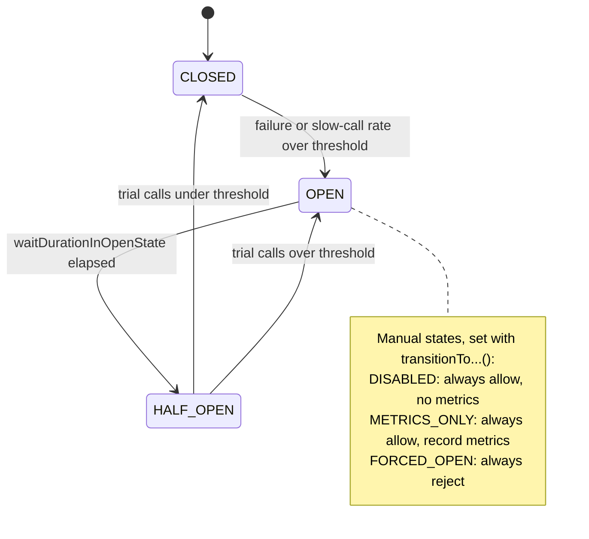

# Resilience4j

> [!abstract] In one sentence
> Resilience4j is the Java library that replaced [[Hystrix]]: a set of small, independent **decorators** (CircuitBreaker, Retry, TimeLimiter, Bulkhead, RateLimiter, Cache) that wrap any function call, configured in code or in Spring Boot's `application.yml`, running on the **caller's own thread** by default, and exposing their state as metrics and health indicators.

## Build-up: the shop after Hystrix

### The situation

The online shop again: `orders` (Java, Spring Boot) calls `inventory` to check stock and `payments` to charge the card, over HTTP (Hypertext Transfer Protocol). The resilience logic was written with Hystrix (see [[Spring Cloud and Netflix OSS]]). In 2018 Netflix put Hystrix in maintenance mode, and Spring Cloud removed it in 2020. The patterns are still needed (see [[Resilience patterns]]): something must cap how long `orders` waits, stop hammering a dead dependency, retry transient failures, and keep one slow dependency from eating every thread.

### Why this library

| Hystrix | Resilience4j |
|---|---|
| One big framework: every call is a `HystrixCommand` subclass | Small modules, pick only what's needed (`resilience4j-circuitbreaker`, `resilience4j-retry`…) |
| Thread pool per dependency **by default** (a thread hop on every call) | Runs on the **caller's thread** by default; a thread-pool bulkhead is opt-in |
| Configuration through Archaius properties | Builders in code, or Spring Boot properties |
| Object-oriented, inheritance | Functional: decorators around a `Supplier`, `Function`, `Runnable`, `CompletableFuture`, or Reactor / RxJava types |
| Maintenance mode since 2018 | Actively maintained. Version 1.x targets Java 8, version 2.x requires Java 17 |

It's *lightweight* because each decorator is just a wrapper with a little state (a sliding window, a counter, a semaphore). Nothing runs in the background, no extra thread pools unless asked for.

### The modules

| Module | Pattern | Answers |
|---|---|---|
| **CircuitBreaker** | Circuit breaker | "This dependency is failing: stop calling it for a while" |
| **Retry** | Retry with backoff | "That failure looked transient: try again" |
| **TimeLimiter** | Timeout | "Don't wait more than 1 s for this future" |
| **Bulkhead** / **ThreadPoolBulkhead** | Bulkhead | "At most 20 concurrent calls to `inventory`" |
| **RateLimiter** | Client-side rate limit | "At most 50 calls per second to the card processor" |
| **Cache** | Response cache (JCache) | "Same question a second ago: reuse the answer" (rarely used) |

## Tutorial 1: plain Java, no framework

Dependencies (Maven, version 2.x):

```xml
<dependency>
  <groupId>io.github.resilience4j</groupId>
  <artifactId>resilience4j-all</artifactId>   <!-- all modules + the Decorators helper -->
  <version>2.2.0</version>
</dependency>
```

### Step 1: a circuit breaker with defaults

```java
CircuitBreaker cb = CircuitBreaker.ofDefaults("inventory");

Supplier<Stock> call = () -> inventoryClient.stock("sku-42");
Supplier<Stock> protectedCall = CircuitBreaker.decorateSupplier(cb, call);

Stock s = protectedCall.get();   // throws CallNotPermittedException when the circuit is open
```

The circuit breaker records the outcome of each call in a **sliding window**. When the failure rate in the window crosses the threshold, it **opens**: calls fail immediately with `CallNotPermittedException`, without touching `inventory`. After a wait, it goes **half-open** and lets a few trial calls through; if they succeed, it **closes** again.

### Step 2: tuning it

```java
CircuitBreakerConfig config = CircuitBreakerConfig.custom()
    .slidingWindowType(SlidingWindowType.COUNT_BASED)   // or TIME_BASED (last N seconds)
    .slidingWindowSize(20)                 // the last 20 calls
    .minimumNumberOfCalls(10)              // no decision before 10 calls in the window
    .failureRateThreshold(50)              // open at 50% failures
    .slowCallDurationThreshold(Duration.ofMillis(800))
    .slowCallRateThreshold(80)             // ...or when 80% of calls are slower than 800 ms
    .waitDurationInOpenState(Duration.ofSeconds(10))
    .permittedNumberOfCallsInHalfOpenState(3)
    .recordExceptions(IOException.class, HttpServerErrorException.class)  // count as failures
    .ignoreExceptions(OutOfStockException.class)   // business errors: neither success nor failure
    .build();

CircuitBreaker cb = CircuitBreakerRegistry.of(config).circuitBreaker("inventory");
```

What each knob means:
- **Sliding window**: `COUNT_BASED` looks at the last N calls, `TIME_BASED` at the calls of the last N seconds. Count-based is predictable; time-based suits services with very variable traffic
- **`minimumNumberOfCalls`**: protects against opening on 1 failure out of 1 call. The defaults are high (window 100, minimum 100), which matters on low traffic (see Advanced problems)
- **Slow calls** count separately from failures: a dependency that answers correctly but in 5 s is also a reason to back off. This is something Hystrix didn't have
- **`recordExceptions` / `ignoreExceptions`**: a `404 Not Found` or "out of stock" is the dependency **working correctly**. Counting it as a failure would open the circuit on healthy services
- **`waitDurationInOpenState`**: how long to stay open. By default the transition to half-open happens on the **next call** after the wait; `automaticTransitionFromOpenToHalfOpenEnabled(true)` makes it happen on a timer instead

The states, including the three special ones that are only set by hand (for operations and tests):



`FORCED_OPEN` is a kill switch ("stop calling the card processor now"), `DISABLED` and `METRICS_ONLY` are for switching protection off or observing what *would* happen before enforcing it.

### Step 3: retries, and why the first call counts

```java
RetryConfig retryConfig = RetryConfig.custom()
    .maxAttempts(3)                       // 3 attempts in total: the first call + 2 retries
    .intervalFunction(IntervalFunction.ofExponentialRandomBackoff(
        Duration.ofMillis(200), 2.0, 0.5))   // ~200 ms, ~400 ms, with ±50% jitter
    .retryExceptions(IOException.class, TimeoutException.class)
    .ignoreExceptions(OutOfStockException.class)
    .retryOnResult(stock -> stock.isStale())  // retry on a bad answer, not only on exceptions
    .build();

Retry retry = Retry.of("inventory", retryConfig);
```

- `maxAttempts` **includes the first call**: `3` means at most 2 retries
- **Exponential backoff with jitter** (randomized wait) prevents every client retrying at the same instant and hitting the recovering service in synchronized waves (see [[Resilience patterns]])
- **Only retry idempotent operations.** `GET /stock` is safe to repeat. `POST /charges` is not: if the first attempt charged the card and only the response was lost, a retry charges it twice. Retry a payment only if `payments` supports an **idempotency key** (the same key on each attempt, so the server recognizes the duplicate)

### Step 4: composing them

The `Decorators` helper chains decorators. Each `with…` wraps **everything before it**, so the first one listed is the innermost:

```java
Supplier<Stock> decorated = Decorators.ofSupplier(() -> inventoryClient.stock("sku-42"))
    .withBulkhead(bulkhead)          // innermost: limits concurrent calls
    .withCircuitBreaker(cb)          // records each attempt
    .withRetry(retry)                // outermost: retries the whole thing above
    .withFallback(
        List.of(CallNotPermittedException.class, BulkheadFullException.class, IOException.class),
        t -> Stock.unknown("sku-42"))   // degrade instead of failing
    .decorate();

Stock s = decorated.get();
```

```mermaid
flowchart LR
    C["orders code"] --> F["Fallback"]
    F --> R["Retry<br/>(up to 3 attempts)"]
    R --> CB["CircuitBreaker<br/>(counts every attempt)"]
    CB --> B["Bulkhead<br/>(max concurrent calls)"]
    B --> I["inventoryClient.stock()"]

    classDef wrap fill:#cfe3ff,stroke:#1f4e8c,color:#1a1a1a
    classDef call fill:#d6f5d6,stroke:#2e7d32,color:#1a1a1a
    class F,R,CB,B wrap
    class I call
```

With retry **outside** the circuit breaker, every attempt is counted by the breaker, and when the circuit opens, the retry gets `CallNotPermittedException`. Don't retry on that exception: retrying against an open circuit just burns the wait time.

### Step 5: a real timeout with TimeLimiter

```java
TimeLimiter tl = TimeLimiter.of(TimeLimiterConfig.custom()
    .timeoutDuration(Duration.ofSeconds(1))
    .cancelRunningFuture(true)
    .build());

ExecutorService pool = Executors.newFixedThreadPool(10);

Stock s = tl.executeFutureSupplier(
    () -> CompletableFuture.supplyAsync(() -> inventoryClient.stock("sku-42"), pool));
// TimeoutException after 1 s
```

TimeLimiter works on **futures**: it stops *waiting* after 1 s. With `cancelRunningFuture(true)` it cancels the future, but cancelling a `CompletableFuture` **does not interrupt the thread** doing blocking I/O (input/output) inside it. The socket read keeps going, holding a thread and a connection. So TimeLimiter is a cap on the caller's wait, not a replacement for timeouts on the HTTP client itself:

```java
HttpClient http = HttpClient.newBuilder()
    .connectTimeout(Duration.ofMillis(300))
    .build();
HttpRequest req = HttpRequest.newBuilder(URI.create("http://inventory:8080/stock/sku-42"))
    .timeout(Duration.ofMillis(800))      // the read side: the request as a whole
    .build();
```

Always set **connect and read timeouts on the client** (RestTemplate, WebClient, the JDK client, Feign). They're the only thing that actually releases the socket.

### Step 6: bulkheads, semaphore or thread pool

| | `Bulkhead` (semaphore) | `ThreadPoolBulkhead` |
|---|---|---|
| How | A counter of concurrent calls on the **caller's thread** | Calls run on a **dedicated pool** + queue, the caller gets a `CompletionStage` |
| When full | Waits up to `maxWaitDuration` (default 0), then `BulkheadFullException` | Queue full → `BulkheadFullException` |
| Cost | Nearly nothing | A thread hop per call, a pool to size, context to propagate |
| Fits | Most cases, and reactive code | Protecting the caller's request threads from a dependency that blocks |

```java
Bulkhead bh = Bulkhead.of("inventory", BulkheadConfig.custom()
    .maxConcurrentCalls(20)
    .maxWaitDuration(Duration.ZERO)    // fail fast rather than queue
    .build());
```

20 concurrent calls to `inventory` at most: when `inventory` hangs, 20 request threads are stuck, not all 200 of Tomcat's. The other requests of `orders` keep working.

### Step 7: a client-side rate limiter

The card processor allows 50 calls per second per merchant and returns `429 Too Many Requests` above that:

```java
RateLimiter rl = RateLimiter.of("card-processor", RateLimiterConfig.custom()
    .limitForPeriod(50)                          // 50 permits...
    .limitRefreshPeriod(Duration.ofSeconds(1))   // ...per second
    .timeoutDuration(Duration.ofMillis(100))     // wait up to 100 ms for a permit
    .build());
// no permit in time → RequestNotPermitted
```

This limits **what this JVM (Java Virtual Machine) sends**. With 6 instances of `payments`, each needs `limitForPeriod: 8` (or a shared limiter in Redis or at a gateway); the library has no cluster-wide view.

## Tutorial 2: Spring Boot 3

### Dependencies

```xml
<dependency>
  <groupId>io.github.resilience4j</groupId>
  <artifactId>resilience4j-spring-boot3</artifactId>
  <version>2.2.0</version>
</dependency>
<dependency>
  <groupId>org.springframework.boot</groupId>
  <artifactId>spring-boot-starter-aop</artifactId>   <!-- the annotations are aspects -->
</dependency>
<dependency>
  <groupId>org.springframework.boot</groupId>
  <artifactId>spring-boot-starter-actuator</artifactId>
</dependency>
```

### Configuration in YAML

Shared settings go in `configs`, each named instance picks a base config and overrides what it needs (YAML: YAML Ain't Markup Language):

```yaml
resilience4j:
  circuitbreaker:
    configs:
      default:
        sliding-window-type: COUNT_BASED
        sliding-window-size: 20
        minimum-number-of-calls: 10
        failure-rate-threshold: 50
        slow-call-duration-threshold: 800ms
        slow-call-rate-threshold: 80
        wait-duration-in-open-state: 10s
        permitted-number-of-calls-in-half-open-state: 3
        record-exceptions:
          - java.io.IOException
          - org.springframework.web.client.HttpServerErrorException
        register-health-indicator: false     # see Advanced problems
    instances:
      inventory:
        base-config: default
      payments:
        base-config: default
        wait-duration-in-open-state: 30s
  retry:
    instances:
      inventory:
        max-attempts: 3
        wait-duration: 200ms
        enable-exponential-backoff: true
        exponential-backoff-multiplier: 2
        enable-randomized-wait: true
        retry-exceptions:
          - java.io.IOException
  bulkhead:
    instances:
      inventory:
        max-concurrent-calls: 20
        max-wait-duration: 0
  timelimiter:
    instances:
      inventory:
        timeout-duration: 1s
        cancel-running-future: true
  ratelimiter:
    instances:
      card-processor:
        limit-for-period: 50
        limit-refresh-period: 1s
        timeout-duration: 100ms
```

### Annotations

```java
@Service
public class StockService {

    private final InventoryClient inventory;

    public StockService(InventoryClient inventory) { this.inventory = inventory; }

    @CircuitBreaker(name = "inventory", fallbackMethod = "stockUnknown")
    @Retry(name = "inventory")
    @Bulkhead(name = "inventory")
    public Stock stock(String sku) {
        return inventory.stock(sku);
    }

    // Fallback: same return type, same parameters, plus the exception as the last parameter
    private Stock stockUnknown(String sku, CallNotPermittedException e) {
        return Stock.unknown(sku);            // circuit open: don't even log at error level
    }

    private Stock stockUnknown(String sku, Throwable t) {
        log.warn("inventory call failed for {}", sku, t);
        return Stock.unknown(sku);
    }
}
```

Fallback rules:
- **Same class**, same return type, same parameters **plus** one exception parameter at the end
- With several fallbacks of the same name, the one with the **most specific exception type** matching the failure wins
- A `@TimeLimiter` method must return a `CompletableFuture` (or a Reactor `Mono`/`Flux`), because TimeLimiter works on futures

### The order of the annotations is not the order of execution

Annotation order in the source code doesn't matter. The aspects are applied in a fixed default order:

`Retry ( CircuitBreaker ( RateLimiter ( TimeLimiter ( Bulkhead ( method ) ) ) ) )`

Retry is the outermost, Bulkhead the innermost. That's usually what's wanted: retry the whole protected call, the breaker counts each attempt. To change it, set the aspect order properties (`resilience4j.retry.retry-aspect-order`, `resilience4j.circuitbreaker.circuit-breaker-aspect-order`, …): the **higher value runs first**, i.e. is further outside.

> [!warning] Self-invocation skips everything
> The annotations work through a Spring **proxy** around the bean. A call from `this.stock(sku)` inside the same class doesn't go through the proxy, so no circuit breaker, no retry, no error. Put the protected method in a separate bean (as `StockService` above), and make it `public`.

### Spring Cloud CircuitBreaker: the abstraction on top

Spring Cloud CircuitBreaker is a vendor-neutral API (application programming interface) over circuit breaker libraries, with Resilience4j as the main implementation (`spring-cloud-starter-circuitbreaker-resilience4j`, or `-reactor-resilience4j` for reactive code). Code depends on the abstraction, not the library:

```java
@Service
public class StockService {
    private final CircuitBreakerFactory<?, ?> cbFactory;
    private final RestClient rest;

    public StockService(CircuitBreakerFactory<?, ?> cbFactory, RestClient.Builder builder) {
        this.cbFactory = cbFactory;
        this.rest = builder.baseUrl("http://inventory:8080").build();
    }

    public Stock stock(String sku) {
        return cbFactory.create("inventory").run(
            () -> rest.get().uri("/stock/{sku}", sku).retrieve().body(Stock.class),
            t -> Stock.unknown(sku));         // fallback
    }
}
```

`ReactiveCircuitBreakerFactory` does the same for `Mono`/`Flux`. It's also what two Spring Cloud projects plug into:
- **Spring Cloud OpenFeign**: with `spring.cloud.openfeign.circuitbreaker.enabled: true`, every Feign client method gets a circuit breaker (named from the client and the method), and `@FeignClient(fallback = …)` works as in the Hystrix days
- **Spring Cloud Gateway**: a `CircuitBreaker` filter per route, with a fallback URI:

```yaml
spring:
  cloud:
    gateway:
      routes:
        - id: inventory
          uri: http://inventory:8080
          predicates:
            - Path=/api/stock/**
          filters:
            - name: CircuitBreaker
              args:
                name: inventory
                fallbackUri: forward:/fallback/stock
```

## Seeing what it does

**Actuator endpoints** (exposed with `management.endpoints.web.exposure.include`):
- `/actuator/circuitbreakers`: every breaker and its state
- `/actuator/circuitbreakerevents`: the last events (state transitions, errors, calls not permitted)
- `/actuator/retries`, `/actuator/bulkheads`, `/actuator/ratelimiters`, `/actuator/timelimiters`
- `/actuator/health`: a health indicator per breaker when `register-health-indicator: true` and `management.health.circuitbreakers.enabled: true`

**Metrics** through Micrometer, scraped by Prometheus and graphed in Grafana. The ones worth an alert or a dashboard panel:

| Metric | Shows |
|---|---|
| `resilience4j_circuitbreaker_state{name, state}` | 1 for the current state: alert when `inventory` is `open` |
| `resilience4j_circuitbreaker_failure_rate` / `_slow_call_rate` | How close to opening |
| `resilience4j_circuitbreaker_not_permitted_calls_total` | Calls rejected by an open circuit (fallbacks served) |
| `resilience4j_retry_calls_total{kind}` | `successful_without_retry`, `successful_with_retry`, `failed_with_retry`, `failed_without_retry`: a rise in retries is an early warning |
| `resilience4j_bulkhead_available_concurrent_calls` | Near 0 means the dependency is slow and the bulkhead is about to reject |

**Events** in code, for logging transitions:

```java
cb.getEventPublisher()
  .onStateTransition(e -> log.warn("circuit {}: {}", e.getCircuitBreakerName(), e.getStateTransition()));
```

## Testing it

Force states directly, without waiting for real failures:

```java
@Autowired CircuitBreakerRegistry registry;
@Autowired StockService stockService;

@Test
void servesFallbackWhenCircuitIsOpen() {
    registry.circuitBreaker("inventory").transitionToOpenState();
    assertThat(stockService.stock("sku-42").isUnknown()).isTrue();
}

@AfterEach
void reset() { registry.circuitBreaker("inventory").reset(); }
```

And test the timeouts against a **real slow server**: WireMock can answer after a delay, which exercises the HTTP client timeouts too, not just the library:

```java
stubFor(get(urlPathMatching("/stock/.*"))
    .willReturn(aResponse().withStatus(200).withFixedDelay(3000)));   // 3 s, above every timeout
```

## From Hystrix to Resilience4j

| Hystrix | Resilience4j |
|---|---|
| `HystrixCommand` / `@HystrixCommand` | Decorators / `@CircuitBreaker`, `@Retry`, `@Bulkhead`… |
| `execution.isolation.thread.timeoutInMilliseconds` | TimeLimiter (+ HTTP client timeouts) |
| Thread-pool isolation (default) | `ThreadPoolBulkhead` (opt-in) |
| Semaphore isolation | `Bulkhead` (the default kind) |
| `circuitBreaker.requestVolumeThreshold` | `minimumNumberOfCalls` |
| `circuitBreaker.errorThresholdPercentage` | `failureRateThreshold` |
| `circuitBreaker.sleepWindowInMilliseconds` | `waitDurationInOpenState` |
| A single trial call when half-open | `permittedNumberOfCallsInHalfOpenState` trial calls |
| Rolling time window of buckets | `COUNT_BASED` or `TIME_BASED` sliding window |
| No slow-call notion | `slowCallDurationThreshold` + `slowCallRateThreshold` |
| `getFallback()` | `fallbackMethod` / `withFallback` |
| Request caching, request collapsing | Cache module (JCache); no collapsing |
| Hystrix Dashboard + Turbine | Micrometer → Prometheus + Grafana |
| Retries left to Ribbon | A Retry module |

## Advanced problems

### 1. Retries inflating, or hiding, the failure rate
**Symptom:** the circuit opens much faster than expected, or never opens although users see errors.
**Why:** with Retry outside CircuitBreaker (the default), each attempt is a recorded call, so 1 failing user request counts 3 times. With Retry inside, the breaker sees only the final outcome and can stay closed while every request needs 3 attempts.
**Fix:** choose the order deliberately, size thresholds with it in mind, and don't retry on `CallNotPermittedException` or `BulkheadFullException` (these are "back off" signals, not transient failures).

### 2. A circuit that never opens on low traffic
**Symptom:** `inventory` is down, every call fails, the circuit stays closed.
**Why:** `minimumNumberOfCalls` (default 100) isn't reached inside a `TIME_BASED` window, or a `COUNT_BASED` window of 100 takes an hour to fill at night.
**Fix:** set `minimumNumberOfCalls` and the window size to the service's real traffic (10 to 20 for a low-traffic internal dependency), and make sure the HTTP client timeouts fail calls quickly.

### 3. Slow, not failing
**Symptom:** latency of `orders` climbs, no errors, the circuit stays closed.
**Why:** only exceptions were configured as failures. A dependency answering correctly in 4 s isn't failing.
**Fix:** set `slowCallDurationThreshold` (just above the dependency's normal p99 latency) and `slowCallRateThreshold`, plus a TimeLimiter or client read timeout so slow calls end.

### 4. Lost context in a thread-pool bulkhead
**Symptom:** logs of the protected calls have no trace ID (identifier) or user in the MDC (Mapped Diagnostic Context), security checks fail inside the call, transactions don't apply.
**Why:** `ThreadPoolBulkhead` and TimeLimiter with an executor run the call on **another thread**. Thread-local state (MDC, Spring Security context, transaction) stays on the caller's thread.
**Fix:** prefer the semaphore Bulkhead; otherwise configure context propagators (`contextPropagators` on the thread-pool bulkhead) or a context-propagating executor, and use OpenTelemetry/Micrometer context propagation for traces.

### 5. An open circuit restarting healthy pods
**Symptom:** `inventory` goes down, and moments later every `orders` pod restarts or is removed from its Service, taking the whole site down.
**Why:** circuit breaker health indicators were registered (`register-health-indicator: true`) and allowed to make the application's health `DOWN` when a circuit opens, and that health endpoint is wired to the Kubernetes **liveness** or **readiness** probe ([[Kubernetes Pod]]). An open circuit means "my dependency is unhealthy", not "I am unhealthy": restarting `orders` fixes nothing, and removing it from load balancing turns a degraded feature into a full outage. The fallback was designed for exactly this case.
**Fix:** keep circuit breakers out of the probe health groups (Spring Boot's `management.endpoint.health.group.liveness/readiness.include` should list only what's local: the app itself, maybe its own database), keep `register-health-indicator: false` or leave the indicator unable to fail health, and alert on `resilience4j_circuitbreaker_state` instead.

## When the mesh does it

With a [[Service mesh]] (Istio, Linkerd) or ECS Service Connect, the proxy next to `orders` already applies timeouts, retries and per-instance ejection (outlier detection), for every language. See [[Resilience in a service mesh]]. Then:

| Keep in Resilience4j | Move to the mesh |
|---|---|
| **Fallbacks**: "stock unknown, accept the order" is a business decision a proxy can't make | Plain retries on connection failures and `503`s |
| Circuit breakers whose open state **changes behaviour** (switch to a cached price, hide a feature) | Per-request timeouts at the network level |
| Retries that need app knowledge: idempotency keys, `retryOnResult` on a bad body | Ejecting one bad instance among many |
| Client-side rate limits tied to a partner's contract | Connection limits per destination |
| Bulkheads protecting the app's own thread pools | Uniform metrics for every call |

What to **remove**: duplicated retries. A Resilience4j Retry of 3 behind a mesh retry of 3 is 9 attempts per request against a struggling service, the retry storm. Retry in one layer.

## Practice

> [!example]- With the default Spring aspect order, `@Retry` (3 attempts) and `@CircuitBreaker` (count window 10, minimum 10 calls, 50%) on the same method: how many user requests that all fail does it take to open the circuit?
> Retry is outside CircuitBreaker, so every attempt is recorded. Each failing request makes 3 recorded calls: after 4 requests there are 12 recorded failures, but the window and minimum are 10, so the circuit opens during the **4th request** (at the 10th recorded call). The remaining retry attempts of that request then get `CallNotPermittedException`.

> [!example]- `@TimeLimiter(name = "inventory")` with a 1 s timeout is on a method doing a blocking `RestTemplate` call with no timeouts configured. `inventory` hangs. What happens to `orders`?
> The caller gets a `TimeoutException` after 1 s (and its fallback), but the thread running the blocking call stays stuck on the socket read, possibly for ever: cancelling the future doesn't interrupt it. The executor's threads and the HTTP connection pool slowly fill up. Fix: connect and read timeouts on the `RestTemplate`'s request factory, TimeLimiter only as an extra cap.

> [!example]- Why is a circuit breaker on `payments` a bad thing to put in the readiness probe?
> When `payments` fails, the circuit opens and readiness fails on every `orders` pod. Kubernetes removes all of them from the Service, so browsing, carts and everything else that didn't need `payments` go down too. The breaker exists so `orders` can degrade (fallback: "payment pending, we'll retry"), which only works if `orders` stays in service.

## Easy to get wrong

- Thinking TimeLimiter stops the slow I/O: it stops the wait, the HTTP client timeout stops the I/O
- Reading `maxAttempts: 3` as "3 retries": it's 3 attempts, 2 retries
- Retrying non-idempotent calls (payments) without an idempotency key
- Counting business errors (`404`, out of stock) as failures and opening the circuit on a healthy service
- Keeping the defaults (window 100, minimum 100) for a service doing a few calls a minute
- Calling an annotated method from inside the same class and getting no protection, silently
- Expecting the annotation order in the source to control the execution order
- A fallback with the wrong signature (different return type, missing exception parameter, other class)
- Wiring circuit breaker health into liveness/readiness probes
- Stacking Resilience4j retries on top of mesh retries
- A RateLimiter per instance treated as a global limit

## Related
- Implements:: [[Resilience patterns]]
- Replaces:: [[Hystrix]]
- History:: [[Spring Cloud and Netflix OSS]]
- Same job in other ecosystems:: [[Polly]], [[Resilience libraries in other languages]]
- Moved into the platform:: [[Service mesh]], [[Resilience in a service mesh]]
- Probes:: [[Kubernetes Pod]]

## Flashcards
#flashcards

What replaced Hystrix in Spring Cloud? :: Resilience4j, usually through Spring Cloud CircuitBreaker
How does Resilience4j differ from Hystrix in threading? :: It runs on the caller's thread by default; a thread-pool bulkhead is opt-in
Name the Resilience4j modules :: CircuitBreaker, Retry, TimeLimiter, Bulkhead/ThreadPoolBulkhead, RateLimiter, Cache
What are the two sliding window types? :: COUNT_BASED (last N calls) and TIME_BASED (calls in the last N seconds)
What does minimumNumberOfCalls do? :: No open/close decision until that many calls are in the window
What is a slow call in Resilience4j? :: A call longer than slowCallDurationThreshold; above slowCallRateThreshold they open the circuit
What exception does an open circuit throw? :: CallNotPermittedException
What are the manual circuit breaker states? :: DISABLED, METRICS_ONLY, FORCED_OPEN
Does maxAttempts include the first call? :: Yes: maxAttempts 3 = 1 call + 2 retries
Why add jitter to backoff? :: So clients don't retry in synchronized waves against a recovering service
Does TimeLimiter interrupt a blocking HTTP call? :: No, cancelling the future doesn't interrupt the thread; set client connect/read timeouts
Semaphore Bulkhead vs ThreadPoolBulkhead? :: Semaphore caps concurrent calls on the caller's thread; thread pool runs calls on a dedicated pool with a queue
Is a RateLimiter global across instances? :: No, it limits one JVM; divide the limit or use a shared limiter
Default Spring aspect order? :: Retry ( CircuitBreaker ( RateLimiter ( TimeLimiter ( Bulkhead ( method ) ) ) ) )
How do you change the aspect order? :: The *-aspect-order properties; the higher value is further outside
What's the fallback method signature rule? :: Same class, same return type and parameters, plus an exception parameter last
Why does an annotated method sometimes get no protection? :: Self-invocation bypasses the Spring proxy
What is Spring Cloud CircuitBreaker? :: A vendor-neutral circuit breaker API (CircuitBreakerFactory) with Resilience4j as the implementation, used by OpenFeign and Gateway
Which metric shows a circuit's state? :: resilience4j_circuitbreaker_state
How do you force a circuit open in a test? :: registry.circuitBreaker(name).transitionToOpenState()
Why keep circuit breakers out of readiness/liveness probes? :: An open circuit means a dependency is down; failing probes restarts or removes healthy pods and turns degradation into an outage
What stays in Resilience4j when a mesh is present? :: Fallbacks, app-aware retries and circuits that change behaviour, partner rate limits, local bulkheads
