# High availability networking

> [!abstract] In one sentence
> Replicating servers only moves the single point of failure up one level ("who reaches the replicas?") **until the address clients use stops identifying one machine**: a floating IP (VRRP) on one LAN, one IP spread by a router over several machines (ECMP) in one site, and one IP announced from several networks with BGP (**anycast**) across the internet. At the top there's no "gateway for the gateways": redundancy bottoms out in **routing over a distributed graph of independent networks**, which has no root node.

## Build-up: the gateway for the gateways

### Stage 0: the question that keeps moving up

Building a highly available service (see [[Container orchestration]]) goes through a chain of "replicate it":

1. One worker can die → **replicate the workers**
2. The manager that schedules them can die → **replicate the managers** (3 or 5, with a quorum)
3. The gateway (the load balancer or reverse proxy that receives client traffic and sends it to the workers) can die → **replicate the gateway**
4. **But who sends traffic to the gateways?**

The obvious answer, "a gateway in front of the gateways", creates a recursion with no end:

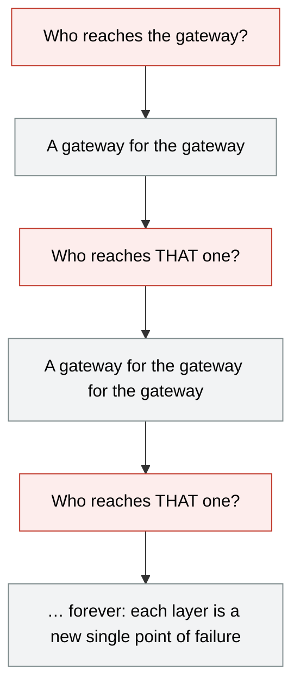

This note is about where that recursion actually stops. Every layer here is vendor-neutral. A cloud "managed load balancer" is not an answer to the question, it's a box that solves the same problem internally with the techniques below.

### Stage 1: one address, one machine

The API (application programming interface) `api.example.com` has one gateway:

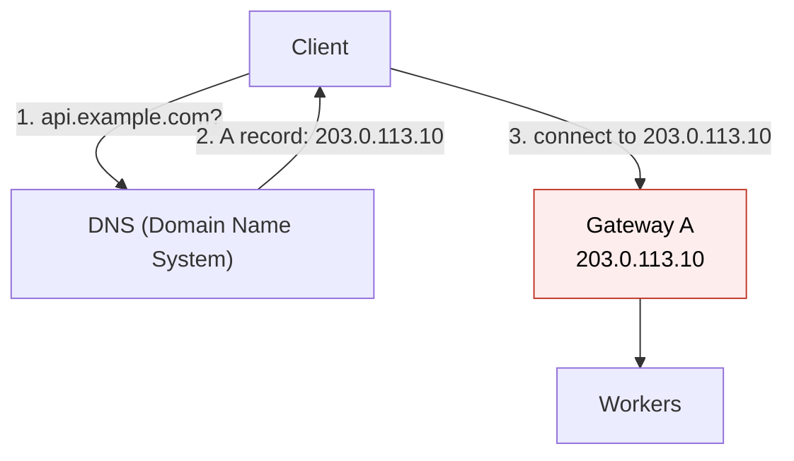

Gateway A dies. DNS (Domain Name System) still answers `203.0.113.10`, and every client connects to a dead address. Nothing is highly available.

The fundamental constraint: a DNS record **always ends at an address**. An A record contains an IP (Internet Protocol) address; a CNAME (canonical name) record points to another name, which eventually resolves to an IP address. Whatever is "in front", clients end up connecting to **some IP address**. If that address identifies a single machine, that machine is the single point of failure (SPOF), whatever it's called: gateway, load balancer, proxy.

> [!warning] "Put a load balancer in front" doesn't answer the question
> A load balancer is one more box with one more address. Saying "use a load balancer" (or a cloud load balancer product) just renames the problem. The real question is how **that** address survives the loss of the machine behind it.

### Stage 2: several addresses in DNS

Publish all the gateways:

```
api.example.com.  60  IN  A  203.0.113.10
api.example.com.  60  IN  A  203.0.113.11
api.example.com.  60  IN  A  203.0.113.12
```

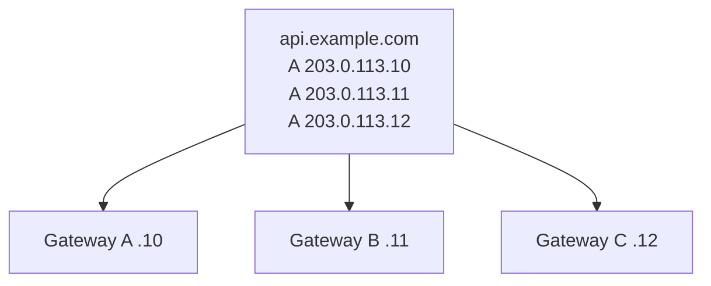

There's no longer a single gateway. But if a client picks `203.0.113.10` and Gateway A is dead:
- **The client has to do the failover itself**: try the next address in the answer, or retry at a higher level. Browsers and some tools (`curl`) try the next address when a connection is refused or times out, after a delay. Many application libraries take the first address and fail
- A gateway that's **half dead** (accepts the TCP (Transmission Control Protocol) connection, then returns errors or hangs) isn't detected by "try the next address" at all
- Removing the dead address from DNS (a health-checked DNS service does this automatically) only helps **after caches expire**: resolvers and clients keep the old answer for the TTL (time to live), and some ignore the TTL entirely (see [[DNS in production]])

So multiple A records **spread load** and give clients a chance to fail over, but DNS by itself hasn't made the service available. It's a useful layer, not the foundation.

### Stage 3: one address that isn't owned by one machine

The real step: make **one IP address** reachable through **several machines**, so the address survives the loss of any one of them. The DNS record never changes; what changes is **which machine the network delivers that address to**. That's a job for the network (ARP (Address Resolution Protocol) on a LAN, routing beyond it), not for another gateway.

There are three scopes, each built on the network mechanism available at that scale.

#### 3a. On one LAN: a floating IP (VRRP)

Two gateways on the same LAN (local area network) share a **virtual IP**, `203.0.113.50`. With VRRP (Virtual Router Redundancy Protocol, implemented on Linux by keepalived), they elect a **master**, which answers ARP for the virtual IP. The backup listens for the master's advertisements (sent every second by default).

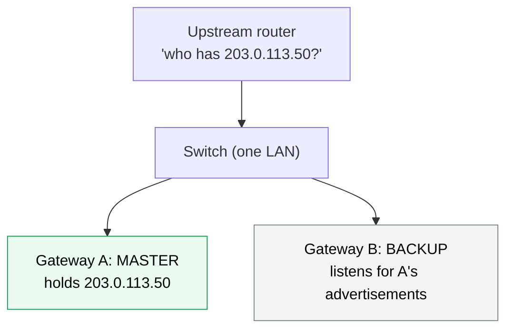

Gateway A dies → the advertisements stop → after ~3 seconds Gateway B becomes master, takes the IP, and sends a **gratuitous ARP** ("203.0.113.50 is now at my MAC (media access control) address") so the switch and router update their tables (see [[ARP]], [[Hubs, switches and routers]]). Clients see a short pause, not an outage. More in *[[First-hop redundancy (VRRP)]]*.

**Limits:** active/passive (one machine does all the work), both gateways must be on **the same LAN**, and the LAN, its switch and its upstream router are still single points.

#### 3b. In one site: one IP, several active machines (ECMP)

Each gateway runs a small BGP speaker (BIRD, FRR, ExaBGP) and announces the same address, `203.0.113.50/32`, to the site's routers. The router now has **several equal routes** to that address and spreads traffic across them with **ECMP** (equal-cost multi-path): it hashes each flow (source/destination IP and port), so all packets of one connection reach the same gateway.

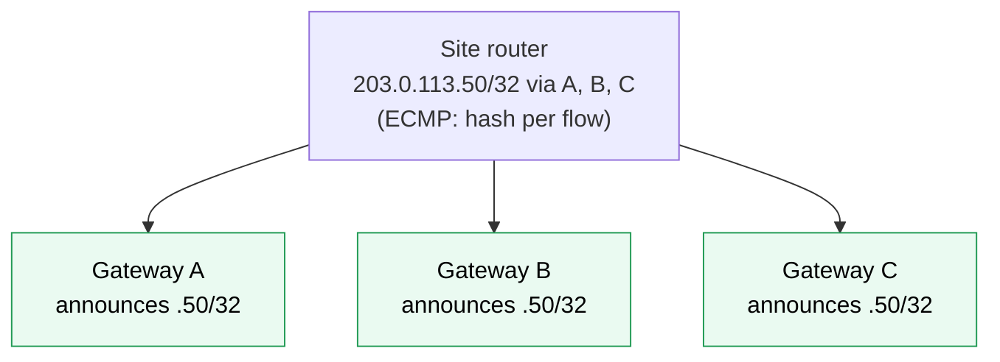

Gateway B dies → its BGP session drops (or its health check fails and it **withdraws** the route) → the router removes that path, and new flows go to A and C. All gateways are active, and adding capacity means adding a gateway that announces the same address. This is how large load balancer tiers are built: the "one IP" of a big service is really many machines behind ECMP.

**Limit:** one site. The site's routers and its uplinks are still shared.

#### 3c. Across networks: anycast

DNS contains only:

```
api.example.com.  300  IN  A  203.0.113.50
```

The question is how `203.0.113.50` can correspond to several gateways in **different networks**, with no machine above them. The answer: **the IP isn't owned by one machine**. Two networks both announce the prefix containing it to the internet with [[AS and BGP|BGP]] (Border Gateway Protocol):

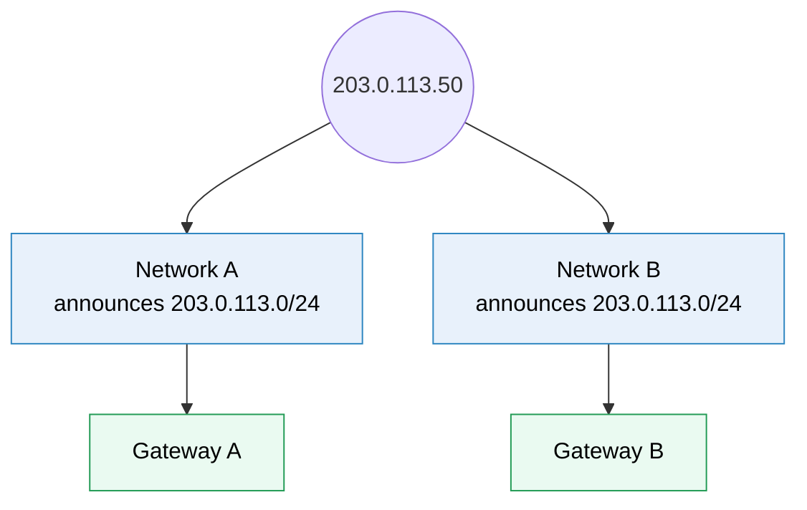

The internet's routing system has now learned two paths: `203.0.113.50` is reachable **through Network A** and **through Network B**. There's no gateway above Gateway A and Gateway B: **the routing system itself** decides which path each client uses. Each network (each ISP, Internet service provider, along the way) picks the path it prefers, usually the closest in BGP terms. This is **anycast**: the same address (prefix) announced from several places.

> [!warning] On the public internet, anycast is a /24, not a /32
> Networks filter announcements more specific than a **/24** for IPv4 (/48 for IPv6), so a single-address `/32` announced to the internet is dropped almost everywhere. Internet anycast announces a whole /24 block (256 addresses) from every site. Single `/32` announcements only work **inside** a network I control (stage 3b). Every site must also be allowed to originate the prefix (the same origin AS (autonomous system), and an RPKI (Resource Public Key Infrastructure) ROA (Route Origin Authorization) that permits it, or other networks may reject it).

**Before the failure:** a client's ISP sees both paths and picks Network A:

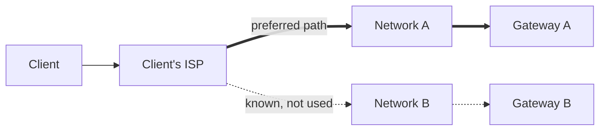

**Gateway A dies.** Network A **stops announcing** `203.0.113.0/24`. The withdrawal propagates through BGP: the internet now sees `203.0.113.50` as reachable through Network A ✗ and Network B ✓. Traffic **converges** toward Network B:

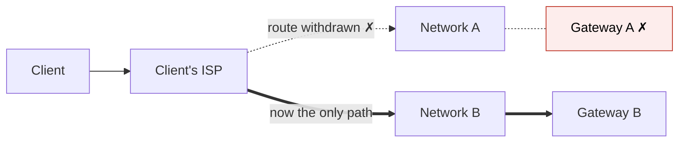

**The DNS record didn't change.** It still says `203.0.113.50`. That's the crucial point: the client doesn't know "I'm connecting to Gateway A", it knows "I'm connecting to 203.0.113.50", and the routing system decides which instance receives the traffic.

> [!warning] "Network A stops announcing" has to be built
> BGP announces what the **router** is configured to announce, not whether the gateway behind it works. If Gateway A dies and the router keeps announcing the prefix, the internet keeps sending traffic into a black hole. Anycast sites tie the announcement to health: the gateway itself (or a health checker next to it) runs the BGP speaker and **withdraws** the route when the service fails its checks. The same applies to 3b.

How fast the failover is depends on detection plus propagation: a session that dies cleanly is withdrawn in seconds; a silent failure waits for the BGP hold timer (often 90 or 180 seconds) unless BFD (Bidirectional Forwarding Detection) detects it in under a second; then the withdrawal spreads across the internet in seconds to a few minutes.

> [!info] Anycast and long connections
> A route change can send the **next packets of an existing connection** to another site, which has no state for it, and the connection is reset. In practice internet routes are stable enough for TCP over anycast to work well (CDNs, content delivery networks, serve HTTP (Hypertext Transfer Protocol) over anycast), and it's ideal for short exchanges like DNS over UDP (User Datagram Protocol). Long-lived connections must be able to reconnect.

### Stage 4: DNS and BGP have different jobs

This distinction is what makes the whole design work:

| | DNS | BGP |
|---|---|---|
| Answers | "**What** IP address should I connect to for `api.example.com`?" | "**How** do I reach `203.0.113.50`?" |
| Example | `api.example.com → 203.0.113.50` | `203.0.113.50 → Network B → Gateway B` |
| Changes when a gateway dies? | **No** (with anycast) | **Yes**: the path to the address changes |
| Speed of change | Limited by caches (TTL) | Routing convergence: seconds to minutes, no client caches |

DNS doesn't need to know that Gateway A died. The DNS record can stay completely unchanged; **the routing system changes the path** to the IP.

So the answer to "the DNS record points to an address that could be the point of failure" is: **correct, if that address represents one machine**. The trick is to make the address represent a **routing destination** rather than a specific machine:

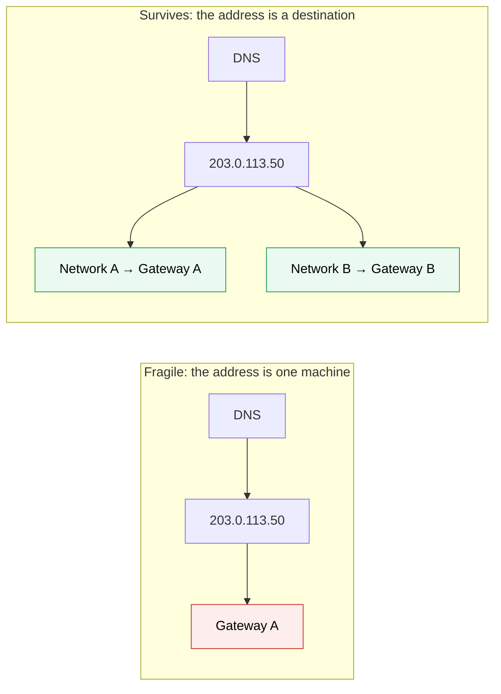

In the second design, the IP survives the failure of an individual gateway.

### Stage 5: so where is the gateway for the gateways?

There isn't one. The recursion of stage 0 assumed a **hierarchy**: every layer depends on one unique parent, so replicating a layer only moves the single point of failure up to its parent.

The internet doesn't solve this by adding another gateway on top. It's a **distributed graph**: each network knows how to reach other networks, there's no root node, and between two points there are several paths.

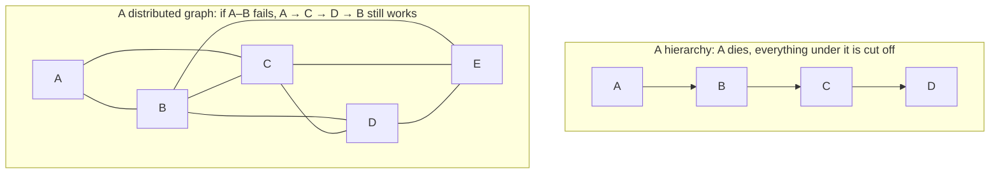

The internet is much closer to the second model. Each major network is an **autonomous system (AS)** with its own AS number (ASN), and they use BGP to announce "I can reach these IP prefixes". A network that learns several paths keeps them and switches when one disappears:

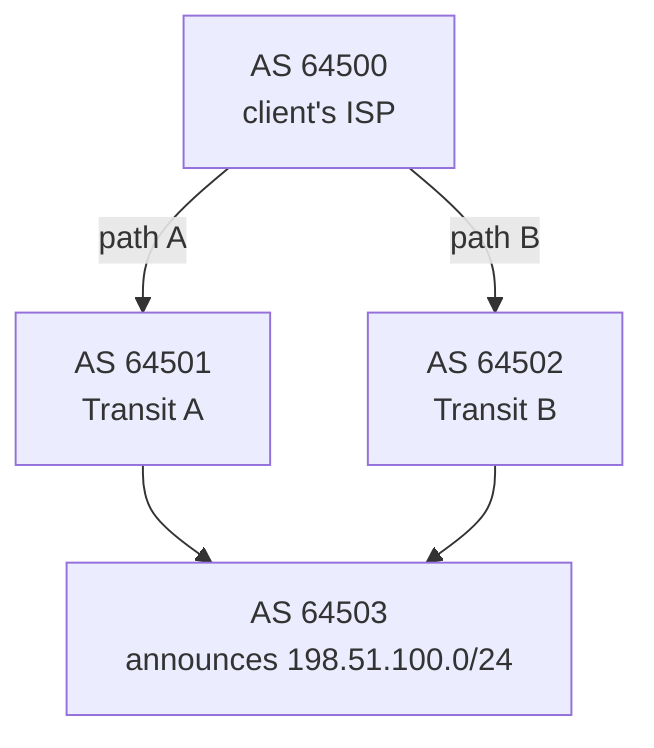

```
Destination 198.51.100.0/24, as AS 64500 sees it:
  path A: 64501 64503   ← in use
  path B: 64502 64503   ← known backup

Transit A fails → path A withdrawn → BGP reconverges → path B in use
```

**There's no master router.** Independently operated networks, each with several connections to others, advertise reachability and each chooses among the paths it knows. That's why BGP is so fundamental: it isn't only about finding *a* route, it lets independent networks offer **alternative paths** to each other without anyone being in charge.

The same pattern repeats **at every level**, each layer redundant on its own rather than under one parent:

| Level | Redundancy | Mechanism |
|---|---|---|
| A home | A router with two uplinks (fiber + 4G) | Failover of the default route |
| A company | Two ISPs (multihoming): its own prefix and ASN announced to both | BGP |
| An ISP | Several core routers, several transit providers | Internal routing protocol + BGP |
| A data center | Two switches per rack, links bundled with LACP (Link Aggregation Control Protocol), several routers | Link aggregation, ECMP |
| A service | Gateways behind ECMP in each site, sites announced by anycast | Stages 3b and 3c |

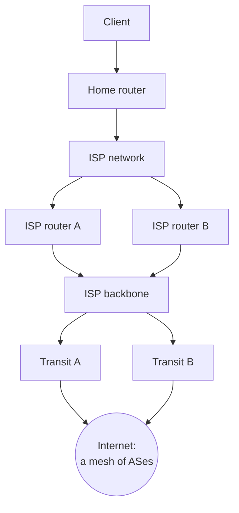

### Stage 6: DNS is redundant the same way

"If DNS tells me where `api.example.com` is, what if the DNS server dies?" DNS answers this with the same principles, at every level of its delegation tree (see [[DNS]]):
- **The root**: 13 root server **identities** (`a.root-servers.net` to `m.root-servers.net`), run by 12 different organizations, each one an **anycast** address served by many instances worldwide, well over a thousand in total
- **Top-level domains** (`.com`, `.org`): several name servers each, also anycast
- **A domain**: at least two NS (name server) records, ideally on different networks or providers. Resolvers try the next one when one doesn't answer

Losing one instance, one server or even one root identity doesn't stop resolution.

### The principle

Replication alone isn't the whole story. Replicating workers, then managers, then gateways, each time asking "who reaches them?", ends with:

> [!tip] Don't make the globally visible address identify a single machine
> Make it identify a **destination** reachable through **several independent instances and paths**: a floating IP on a LAN, ECMP in a site, anycast across networks. And at the top, don't look for one more replicated layer: the internet is a redundant graph where independent networks provide alternative paths to each other, with no ultimate parent.

## Advanced problems

### 1. Anycast black hole

**Symptom:** a share of users (those whose path leads to one site) can't connect, everyone else is fine. **Cause:** that site's service is down but its router still announces the prefix. **Fix:** tie announcements to health checks of the service itself, not of the router or the machine, and monitor from many vantage points on the internet (one test location only sees one site).

### 2. Split brain with VRRP

**Symptom:** intermittent failures, duplicate IP warnings, ARP tables flipping. **Cause:** the link carrying VRRP advertisements fails (or a firewall drops them: VRRP is IP protocol 112, not TCP or UDP) but both gateways are alive, so **both** become master and both answer ARP for the virtual IP. **Fix:** allow protocol 112, use a dedicated or redundant heartbeat path, and fencing (the losing side gives up the IP when it can't confirm it's alone).

### 3. ECMP rehash breaks connections

**Symptom:** when a gateway is added or removed, unrelated long-lived connections reset. **Cause:** the router's hash maps flows to the **new** set of paths, so flows that were on surviving gateways move too, and arrive somewhere that has no state for them. **Fix:** resilient/consistent hashing on the routers (only the flows of the removed path move), or a load balancer tier that shares connection state or uses consistent hashing (*[[Consistent hashing]]*), like Google's Maglev design.

### 4. Redundant on paper, shared fate in practice

**Symptom:** "both" gateways go down at once. **Cause:** they share something: the same power feed, switch, rack, upstream router, ISP, DNS provider, or the same bad configuration pushed to both. **Fix:** list every dependency of each "redundant" path and check they're actually independent. Redundancy is only as good as the **least independent** shared component. (Example: the 2016 denial-of-service attack on the DNS provider Dyn made many large sites unreachable because it was their only DNS provider, although their servers were fine.)

### 5. Failover works, but slowly

**Symptom:** 90 seconds to 3 minutes of errors on every failure. **Cause:** silent failures wait for the BGP hold timer, or clients cache a DNS answer for minutes. **Fix:** BFD for sub-second detection, health checks that withdraw routes actively instead of waiting for a timeout, short TTLs only where DNS is the failover mechanism.

## In AWS

AWS (Amazon Web Services) products are built from the same pieces, and AWS hides them:
- An **Application Load Balancer** is a DNS name whose A records list several IP addresses (stage 2) that change as AWS replaces nodes, and each node is itself redundant inside AWS's network
- A **Network Load Balancer** has one static IP per availability zone, kept alive by AWS's routing (stage 3b)
- **Global Accelerator** gives two **anycast** IP addresses announced from AWS's edge locations worldwide (stage 3c)
- **Route 53**'s name servers are anycast and spread over four top-level domains (`.com`, `.net`, `.org`, `.co.uk`) so one TLD (top-level domain) outage doesn't take them all out

See [[Proxies, load balancing and discovery in AWS]] and [[Route 53]].

## Practice

> [!example]- DNS returns three A records and one gateway is dead. Is the service available?
> Partly. Clients that try the next address after a failed connection recover (with a delay); clients that use only the first address fail; a half-dead gateway isn't detected at all; and removing the dead record waits for DNS caches. Multiple A records help, but don't guarantee availability.

> [!example]- Why doesn't anycast need DNS to change when a site fails?
> The DNS answer is an address, not a machine. The site's routers withdraw their announcement of the prefix, BGP converges on the remaining paths, and the same address is delivered to another site.

> [!example]- Why can't I announce `203.0.113.50/32` to the internet from two data centers?
> Networks filter prefixes longer than /24 in IPv4. Announce the /24 that contains it from both sites (a /32 works only inside a network I control, toward my own routers).

> [!example]- Gateway A's process crashed but the machine and its router are fine. What happens with anycast? With ECMP?
> If the announcement isn't tied to the service's health, the route stays and traffic still goes to A: a black hole for the users routed there. The BGP speaker (or a health checker) must withdraw the route when the service fails.

> [!example]- So where is the "gateway for the gateways"?
> Nowhere. At each scale, the address stops identifying one machine (VRRP, ECMP, anycast), and at the top, the internet is a graph of independent networks exchanging routes with BGP, with no root to fail.

## Easy to get wrong
- Thinking replication alone gives high availability: whoever reaches the replicas must not be a single machine
- Treating "put a load balancer in front" as an answer: it's another address that must survive its own machine
- Thinking multiple A records make a service available: the client must fail over, and caches lag
- Thinking DNS has to change when a gateway dies: with anycast or ECMP, only the routes change
- Announcing a /32 to the internet: the minimum accepted is usually /24
- Announcing routes that don't depend on the service's health: black holes
- Two "redundant" paths that share a switch, power feed, provider or configuration
- Blocking VRRP (IP protocol 112) and getting two masters
- Expecting anycast to move existing TCP connections seamlessly: they reset if the route changes mid-connection

## Related
- Depends on:: [[AS and BGP]], [[Routing tables]], [[ARP]], [[DNS]]
- Used by:: [[Load balancing]] (making the load balancer itself available), [[DNS in production]], [[Container orchestration]] (what sits in front of the cluster), [[Docker Swarm]] (routing mesh behind an external load balancer)
- Next:: *[[First-hop redundancy (VRRP)]]*, *[[Consistent hashing]]* (ECMP and load balancer hashing)
- In AWS:: [[Proxies, load balancing and discovery in AWS]], [[Route 53]]
- Area:: [[Networking]]

## Flashcards
#flashcards

Why doesn't replicating gateways alone give high availability? :: Something must still deliver traffic to them. If clients use an address that identifies one machine, that machine is the single point of failure
What does a DNS record ultimately point to? :: An IP address (A/AAAA), possibly through CNAMEs to other names
Why are multiple A records not enough for availability? :: The client must try another address itself, half-dead servers aren't detected, and caches keep dead addresses until the TTL expires
What is a floating IP with VRRP? :: A virtual IP held by the master of a group of machines on one LAN; a backup takes it over and sends gratuitous ARP when the master's advertisements stop
What is ECMP? :: Equal-cost multi-path: a router spreads flows across several equal routes to the same destination, hashing each flow onto one path
How is one IP served by several active machines in a site? :: Each announces the same /32 to the routers with BGP, and the routers use ECMP
What is anycast? :: The same IP prefix announced from several places; routing delivers each client to one of them
Does DNS change when an anycast site fails? :: No. The site withdraws its route, BGP converges, and the same address reaches another site
DNS vs BGP, which question does each answer? :: DNS: what IP for this name? BGP: how do I reach this IP?
Smallest IPv4 prefix generally accepted on the internet? :: /24
What causes an anycast black hole? :: A site keeps announcing its prefix while its service is down
How do anycast sites avoid black holes? :: The announcement is tied to service health: a BGP speaker withdraws the route when checks fail
What is BFD for? :: Bidirectional Forwarding Detection: detecting a dead link or neighbor in under a second instead of waiting for the BGP hold timer
Hierarchy vs distributed graph for availability? :: In a hierarchy, a parent's failure cuts off everything below. In a graph there are several paths and no root
Where is the "gateway for the gateways" on the internet? :: There isn't one: independent ASes exchange routes with BGP, a graph with no root
How is the DNS root made redundant? :: 13 identities run by 12 organizations, each an anycast address served by many instances
What is split brain in VRRP? :: Both machines become master (advertisements lost), both answer for the virtual IP
Why can adding or removing an ECMP path reset connections? :: The hash remaps flows to the new set of paths, moving flows that had state elsewhere
What is shared fate? :: "Redundant" components that depend on the same thing (power, switch, provider, config) and fail together
Why can anycast reset TCP connections? :: A route change mid-connection sends packets to a site with no state for that connection
