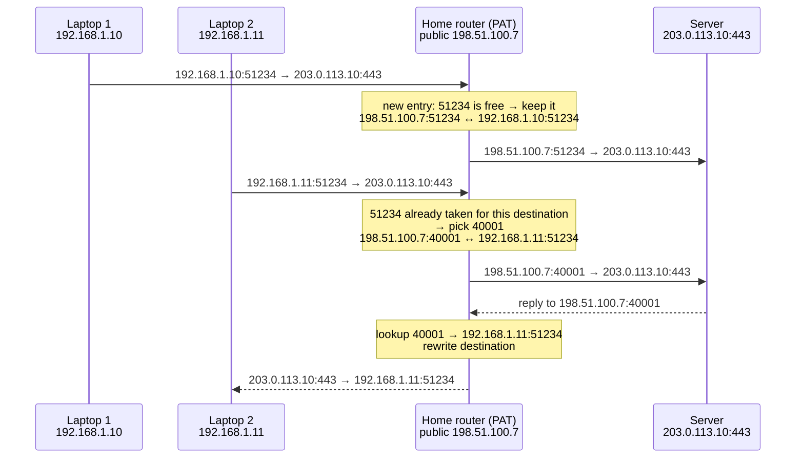
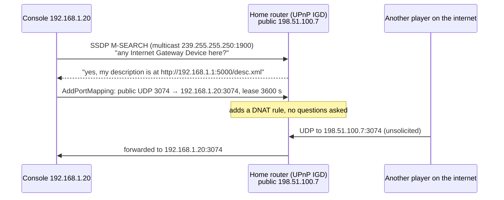

# NAT and PAT

> [!abstract] In one sentence
> **NAT** (Network Address Translation) rewrites IP addresses in packets as they cross a router. **PAT** (Port Address Translation, a.k.a. NAPT or masquerade) also rewrites **ports**, so a whole network of private machines can share **one public IP**: the router remembers which port belongs to which inside machine and reverses the translation for replies.

## The problem

IPv4 has about 4.3 billion addresses, and they ran out. My home has ten devices and my ISP gives me **one** public IP. A company has 5 000 machines and maybe a handful of public IPs.

So networks use **private ranges** internally (RFC 1918), which are never routed on the internet and can be reused by everyone:

| Range | Size | Typical use |
|---|---|---|
| `10.0.0.0/8` | 16.7 M addresses | Companies, AWS VPCs |
| `172.16.0.0/12` | 1 M | Docker (`172.17.0.0/16`), some VPCs |
| `192.168.0.0/16` | 65 k | Home networks |
| `100.64.0.0/10` | 4 M | **Carrier-grade NAT** (between the ISP and my router), and Tailscale |

Private addresses solve "not enough addresses" and create a new problem: a packet from `192.168.1.10` can go out to a server, but the server's reply to `192.168.1.10` is unroutable. Something at the edge has to **swap the private address for a public one on the way out, and swap it back on the way in**. That's NAT.

## The kinds of NAT, each fixing the previous one's limit

| Type | Mapping | Solves | Limit |
|---|---|---|---|
| **Static NAT** (1:1) | One private IP ↔ one public IP, permanently | A server inside needs a fixed public address, reachable from outside | Needs as many public IPs as machines. Saves nothing |
| **Dynamic NAT** (pool) | Private IPs take a free public IP from a pool while they're active | Share a pool among more machines than IPs | When the pool is empty, the next machine can't get out |
| **PAT / NAPT / masquerade** (many:1) | Many private IP:port → **one** public IP, different **ports** | Thousands of machines behind one IP | Ports run out (see below). Nothing can come in unless asked |

Cisco's vocabulary, which shows up in exams: **inside local** (my PC's real private IP), **inside global** (the public IP it's translated to), **outside global** (the server's real IP), **outside local** (the server's IP as seen from inside, usually the same).

## How PAT actually works: the translation table

Two laptops at home, both opening a connection to the same server, **both using source port 51234** (it happens: each machine picks its own ports without knowing the other's):



The router's table (on Linux, `conntrack -L` shows it):

| Protocol | Inside | Outside (translated) | Destination | State / timeout |
|---|---|---|---|---|
| TCP | `192.168.1.10:51234` | `198.51.100.7:51234` | `203.0.113.10:443` | ESTABLISHED, ~5 days |
| TCP | `192.168.1.11:51234` | `198.51.100.7:40001` | `203.0.113.10:443` | ESTABLISHED |
| UDP | `192.168.1.10:5353` | `198.51.100.7:5353` | `8.8.8.8:53` | ~30 s after last packet |

Each translated packet also gets its **IP and TCP/UDP checksums recomputed**, because the addresses and ports they cover changed.

## SNAT vs DNAT

Two directions, two names (Linux/iptables vocabulary, used everywhere):

| | **SNAT** (source NAT) | **DNAT** (destination NAT) |
|---|---|---|
| Rewrites | The **source** of outgoing packets | The **destination** of incoming packets |
| Use | Letting private machines out (PAT is SNAT with ports) | **Port forwarding**: public `:8080` → `192.168.1.50:80`. Load balancers |
| Linux | `-j SNAT --to-source 198.51.100.7` or `-j MASQUERADE` (same, but uses whatever IP the interface has, for dynamic IPs) | `-j DNAT --to-destination 192.168.1.50:80` |

```bash
# the classic Linux router / NAT instance
sysctl -w net.ipv4.ip_forward=1
iptables -t nat -A POSTROUTING -o eth0 -s 192.168.1.0/24 -j MASQUERADE   # PAT out
iptables -t nat -A PREROUTING -i eth0 -p tcp --dport 8080 \
  -j DNAT --to-destination 192.168.1.50:80                               # port forward in
conntrack -L                                                              # the translation table
```

Docker does exactly this for containers: MASQUERADE out of the host, DNAT for `-p 8080:80` (see [[Network interfaces]]).

## Advanced problems

### 1. Nothing can come in unless it was asked for

The table only has entries for connections started from **inside**. An unsolicited packet arriving at `198.51.100.7:22` matches nothing, so the router doesn't know which machine it's for and drops it. That's why:
- Running a server at home needs **port forwarding** (DNAT)
- Peer-to-peer apps, VoIP and mesh VPNs need tricks: **hole punching**, relays (see [[Types of VPN#Stage 5: machines behind NAT need to reach each other]])
- VPN protocols send **keepalives** (WireGuard `PersistentKeepalive = 25`, IPsec NAT-T every ~20 s): a UDP entry is deleted after ~30–120 s of silence, and then the other side can't reach me anymore

> [!warning] Responses vs new connections
> "Only replies get in" is about **connections**, not messages. The server I connected to can send as much as it likes **on that connection** (HTTP responses, WebSocket messages, commands to an agent), because an HTTP response doesn't close the TCP connection. But neither it nor anyone else can open a **new** connection through the entry, which is tied to the remote IP and port of that flow. This is how AWS Systems Manager reaches instances behind a NAT gateway → [[Outbound-initiated connections]]

### 2. Not all NATs behave the same (and it decides whether P2P works)

What matters is how the NAT picks the **outside port** for a new destination (RFC 4787):

| Behavior | Old name | Same inside port → same outside port for every destination? | Hole punching |
|---|---|---|---|
| **Endpoint-independent mapping** | "Cone" NAT (full, restricted, port-restricted) | ✅ Yes | ✅ Works: the port a STUN server sees is the port a peer can use |
| **Endpoint-dependent mapping** | "Symmetric" NAT | ❌ A new port for each destination | ❌ Fails: the port I learned via STUN is wrong for the peer → relay |

Home routers are usually cone-like. Corporate firewalls and **CGNAT** are often symmetric.

### 3. Protocols that put IP addresses inside the payload

NAT rewrites headers, not data. Protocols that write IPs or ports in their messages break:
- **FTP** (active mode): the client tells the server "connect back to me at `192.168.1.10` port X", a private address the server can't reach
- **SIP / VoIP**: the call setup says "send the audio to `192.168.1.10:16384`" → calls connect, but there's **no audio** (one-way or none). The classic NAT symptom
- **IPsec**: ESP has no ports at all, so PAT can't multiplex it, and AH checks the IP header, so any NAT breaks it. Fix: **NAT-T**, wrapping ESP in UDP 4500 (see [[IPsec and IKE#NAT traversal (NAT-T)]])

**ALGs** (Application Layer Gateways) are NAT modules that read and rewrite those payloads. They also break things: the **SIP ALG** on home and office routers is notorious for mangling VoIP, and the standard advice is to disable it and use STUN/TURN/ICE instead.

### 4. Port exhaustion

One public IP has ~64 000 ports per protocol. A PAT device can reuse the same outside port for **different destinations**, so the real limit is **~64 000 simultaneous connections to one destination** (same IP, port, protocol). Hit it and new connections fail, while existing ones keep working. Common with:
- Many servers behind one NAT hammering **one** API or database endpoint
- **CGNAT**, where an ISP shares one public IP between hundreds of customers, each getting a slice of ports

Fixes: more public IPs on the NAT, connection pooling / keep-alive (fewer new connections), or avoid NAT for that traffic (VPC endpoints in AWS).

### 5. Hairpin NAT (NAT loopback)

I host a site at home with port forwarding `public:443 → 192.168.1.50:443`. From **inside**, I open `https://my-public-ip`. The packet goes to the router, gets DNATed back inside to `.50`, and `.50` replies **directly** to my laptop (same LAN), from its private IP. My laptop expected a reply from the public IP, so it drops it. Fixes: the router also SNATs hairpinned traffic (NAT loopback), or **split DNS** returns the private IP to inside clients.

### 6. Double NAT and CGNAT

The ISP runs its own NAT (**CGNAT**, `100.64.0.0/10` between them and my router), so my traffic is NATed twice:
- I **can't port-forward**: the ISP's NAT has no rule for me
- Hundreds of customers share one public IP: one abuser gets it banned or CAPTCHA'd for everyone, and logs need **IP + port + timestamp** to identify a user
- P2P and self-hosting get much harder → mesh VPNs with relays, or tunnels that dial out (see [[Connecting AWS to a private network]])

### 7. Apps that open ports on the router by themselves: UPnP, NAT-PMP, PCP

**The problem:** problem 1 says nothing comes in unless an inside machine asked for it. But a game console needs other players to connect **to** it, a torrent client wants inbound peers, a video call wants direct media. Asking every user to log into their router and set up port forwarding by hand doesn't work.

**The fix: let the app ask the router for a port forward.** Three protocols do this:

| Protocol | From | How it works | Where |
|---|---|---|---|
| **UPnP IGD** (Universal Plug and Play, Internet Gateway Device) | Microsoft & co, ~2000 | The app finds the router by multicasting **SSDP** discovery (`239.255.255.250`, UDP **1900**), downloads its XML description over HTTP, then calls `AddPortMapping` (a SOAP request): "forward public TCP 3074 to me, 192.168.1.20:3074" | Almost every home router, consoles, Windows, torrent clients |
| **NAT-PMP** (NAT Port Mapping Protocol) | Apple | A small binary request to the default gateway on UDP **5351**: "map a port for me for N seconds". Also tells the app the router's public IP | Apple devices, many routers |
| **PCP** (Port Control Protocol, RFC 6887) | IETF, NAT-PMP's successor | Same idea, same port, plus IPv6 firewall pinholes, and it can address a **carrier's** NAT, not just the home router | Newer routers, rarely supported by ISPs |

"UPnP" as a whole is a larger family (device discovery for printers, media servers, smart TVs). The part that matters for networking is **IGD**: automatic port forwarding.



**Why it's a security problem:**
- **No authentication.** Any program on the LAN can open any port to any internal machine, including **malware**, which uses it to expose an infected machine (or a camera, or an admin panel) to the internet. The "NAT protects me" assumption is gone without anyone noticing
- **Buggy routers expose UPnP on the WAN side**, so people on the internet can add mappings or use the router as an **SSDP reflector** for amplification DDoS (small request, big answer, like DNS amplification in [[DNS security]]). The **CallStranger** flaw (2020) abused UPnP event subscriptions to make devices send data to arbitrary addresses
- Mappings are invisible: nothing in the router UI tells the user a port is open unless they look for it

**Limits:**
- Behind **CGNAT**, UPnP only opens the port on my **home** router. The ISP's NAT in front of it still drops everything, so it does nothing useful. Only PCP could ask the carrier's NAT, and few ISPs support it
- It only works when the router implements it (and it's often disabled on purpose)

**What to do:**
- **Business and server networks: disable UPnP/NAT-PMP.** Inbound access should be an explicit, reviewed firewall/DNAT rule
- **Home:** it's a trade-off (consoles and calls work better). Check what's mapped from time to time: the router's UPnP page, or `upnpc -l` (from miniupnpc) on a Linux machine in the LAN
- Mesh VPNs like Tailscale use UPnP, NAT-PMP and PCP when available, **as one more way to get a direct connection** before falling back to hole punching or relays (see [[Types of VPN#Stage 5: machines behind NAT need to reach each other]])

## NAT is not a firewall

**Wrong mental model:** "NAT protects my network, because nobody can reach my private IPs."

**What's actually true:** the protection comes from the **stateful connection tracking** that NAT happens to need, not from the address rewriting:
- A real **stateful firewall** gives the same "only replies to what I started" behavior without any NAT, and with explicit rules
- NAT without filtering can still be bypassed: DNAT rules, **UPnP** (apps opening ports on the router by themselves, see [[#7. Apps that open ports on the router by themselves: UPnP, NAT-PMP, PCP|problem 7]]), a machine on the ISP's side routing directly to my inside range
- **IPv6** has enough addresses for everything, so there's **no NAT**: every device has a global address, and a stateful firewall on the router provides the "no unsolicited inbound" rule. In AWS that's the **egress-only internet gateway**

And NAT costs something: it breaks end-to-end addressing, hides who really made a connection (logs show the NAT's IP), and complicates every protocol in the list above.

## In AWS

| Component | What NAT it does | Details |
|---|---|---|
| **Internet gateway** | **Static 1:1 NAT** for instances with a public/Elastic IP | The instance **never sees its public IP** on its interface: `ip addr` shows only the private one. The IGW translates in both directions |
| **NAT gateway** | **PAT** for private subnets going out | Managed, one per AZ for resilience (a NAT gateway in AZ-a serving AZ-b is cross-AZ traffic and a shared failure), ~55 000 simultaneous connections **per unique destination** (add IPs to go further), billed per hour **and per GB** (see [[VPC]]) |
| **NAT instance** | Same, self-managed on [[EC2]] | Needs **source/destination check disabled**, and its HA/bandwidth are my problem (same limits as the EC2 router in [[Connecting AWS to a private network]]) |
| **Private NAT gateway** | SNAT to a private IP, no internet | Connecting to a network with **overlapping** ranges: the other side sees a non-overlapping address (see [[Overlapping address spaces]]) |
| **Egress-only internet gateway** | No NAT (IPv6) | Stateful "outbound only" for IPv6, the firewall-without-NAT idea |
| **Gateway VPC endpoints** (S3, DynamoDB) | Avoid NAT entirely | Private subnets reach S3 without paying NAT gateway per-GB fees |

### "The NAT gateway blocks inbound traffic": that's firewall behavior, not translation

The AWS docs and exam questions say a NAT gateway lets private instances **out** to the internet but stops the internet from **starting** connections **in**. It's tempting to file that under "what NAT does", but the address rewriting isn't what blocks anything.

**Where the blocking really comes from:** the same state table a **stateful firewall** keeps. An unsolicited packet from the internet reaches the NAT gateway's Elastic IP, matches **no entry**, so there's no inside machine to send it to, and it's dropped. That's exactly the "only replies to connections I started" rule of a stateful firewall. NAT just needs that table to do its job, so it gets the rule for free.

The comparison inside AWS makes it obvious:

| | Rewrites addresses? | Blocks connections started from outside? | So the blocking comes from… |
|---|---|---|---|
| **Internet gateway** (1:1 static NAT) | ✅ | ❌ An instance with a public IP is reachable, if its security group allows it | Nothing: translation alone blocks nothing |
| **NAT gateway** (PAT) | ✅ | ✅ | **State tracking**: no entry = drop |
| **Egress-only internet gateway** (IPv6) | ❌ No NAT at all | ✅ | **State tracking** again, with no translation |

So:
- The internet gateway **translates without blocking**
- The egress-only internet gateway **blocks without translating**

Translation and "outbound only" are two separate features, and the NAT gateway happens to bundle both.

What this means in practice:
- A NAT gateway is **not a security control I configure**: no rules, no allow/deny, no logging of what it refused. It filters **nothing going out**: every private instance can reach any IP and port on the internet (see [[Proxies, load balancing and discovery in AWS#Forward proxies and egress control in AWS]] for real egress control)
- Real filtering in a VPC comes from **[[Security groups]]** (stateful, per interface), **network ACLs** (stateless, per subnet, see [[ACL]]), and **AWS Network Firewall**. Those are what I design and audit
- If private instances must stay unreachable, that has to hold because of their **security groups and routing** (no route from the internet gateway, no public IP), not just because they sit behind a NAT. Then it stays true if someone adds a public IP or a load balancer later

## Easy to get wrong
- Thinking NAT is a security feature. It's the stateful tracking that protects, and IPv6 does it without NAT
- Forgetting **keepalives** for long-lived UDP (VPNs, VoIP): the NAT forgets the mapping and inbound traffic stops
- "Calls connect but no audio": NAT + SIP, often a SIP ALG
- Expecting to see the public IP on an EC2 instance's interface: the IGW does the translation outside the instance
- One NAT gateway for all AZs: cross-AZ charges and a single-AZ failure point
- Port forwarding when behind **CGNAT**: impossible, the ISP's NAT is in the way
- Blaming the network for "random" failed connections under load: check NAT port exhaustion (AWS: `ErrorPortAllocation` metric)

## Related
- Foundation:: [[Network layers]], [[Hubs, switches and routers]], [[Routing tables]]
- Uses of NAT:: [[Overlapping address spaces]], [[Network interfaces]] (Docker), [[VPN]]
- Breaks / works around NAT:: [[IPsec and IKE]] (NAT-T), [[Types of VPN]] (hole punching), [[Connecting AWS to a private network]]
- Connections vs requests, agents behind NAT:: [[Outbound-initiated connections]], [[HTTP]], [[Systems Manager]]
- Security:: [[ACL]], [[Security groups]]
- AWS:: [[VPC]], [[EC2]]

## Flashcards
#flashcards

Why does NAT exist? :: IPv4 ran out: private ranges inside, translated to few public IPs at the edge
The RFC 1918 private ranges? :: 10.0.0.0/8, 172.16.0.0/12, 192.168.0.0/16
What range does CGNAT use? :: 100.64.0.0/10
Static vs dynamic NAT vs PAT? :: Static: fixed 1:1. Dynamic: 1:1 from a pool while active. PAT: many:1 using ports
How does PAT tell replies apart? :: Its translation table maps each outside port (per destination) back to an inside IP:port
SNAT vs DNAT? :: SNAT rewrites the source (going out, PAT). DNAT rewrites the destination (port forwarding, load balancing)
MASQUERADE vs SNAT on Linux? :: Same thing, but MASQUERADE uses the interface's current IP (for dynamic IPs)
Why can't unsolicited traffic come in through PAT? :: No table entry says which inside machine it's for
Why do VPNs send keepalives through NAT? :: UDP mappings expire after ~30–120 s of silence
Cone vs symmetric NAT? :: Cone: same outside port for every destination (hole punching works). Symmetric: new port per destination (needs a relay)
Why does NAT break SIP and active FTP? :: They write private IPs/ports inside the payload, which NAT doesn't rewrite
Classic symptom of NAT breaking VoIP? :: The call connects but there's no (or one-way) audio
Why does IPsec need NAT-T? :: ESP has no ports to translate, and AH breaks when headers change. NAT-T wraps ESP in UDP 4500
What limits PAT scale? :: ~64k simultaneous connections per public IP to one destination (IP, port, protocol)
What is hairpin NAT? :: Reaching my own port-forwarded service via the public IP from inside, which needs extra SNAT or split DNS
Two consequences of CGNAT? :: No port forwarding, and a shared public IP (bans, logging by port)
What does UPnP IGD do? :: Lets an app on the LAN ask the router to create a port forward automatically (SSDP discovery on UDP 1900, then AddPortMapping)
NAT-PMP and PCP? :: Simpler port-mapping protocols (UDP 5351). PCP is NAT-PMP's successor, supports IPv6 pinholes and carrier NATs
Main security problem with UPnP? :: No authentication: any program, including malware, can open ports to any internal machine
Why is UPnP useless behind CGNAT? :: It only opens a port on the home router, the ISP's NAT still blocks inbound traffic
Should UPnP be on in a company network? :: No: inbound access should be explicit, reviewed firewall/DNAT rules
Is NAT a firewall? :: No. The stateful connection tracking protects. IPv6 uses a stateful firewall without NAT
Why doesn't an EC2 instance see its public IP? :: The internet gateway does 1:1 NAT outside the instance
AWS NAT gateway limit per destination? :: About 55 000 simultaneous connections per unique destination
What is a private NAT gateway for? :: Translating to a private IP, for networks with overlapping ranges
IPv6 equivalent of "outbound only" in AWS? :: Egress-only internet gateway
Why does an AWS NAT gateway block connections started from the internet? :: State tracking (a firewall behavior): unsolicited packets match no entry and are dropped. Translation alone blocks nothing
Which AWS gateway translates without blocking, and which blocks without translating? :: Internet gateway (1:1 NAT, reachable if the SG allows). Egress-only internet gateway (IPv6, no NAT, stateful outbound only)
Does a NAT gateway filter outbound traffic? :: No, no rules at all. Egress filtering needs security groups, NACLs, Network Firewall or a proxy
