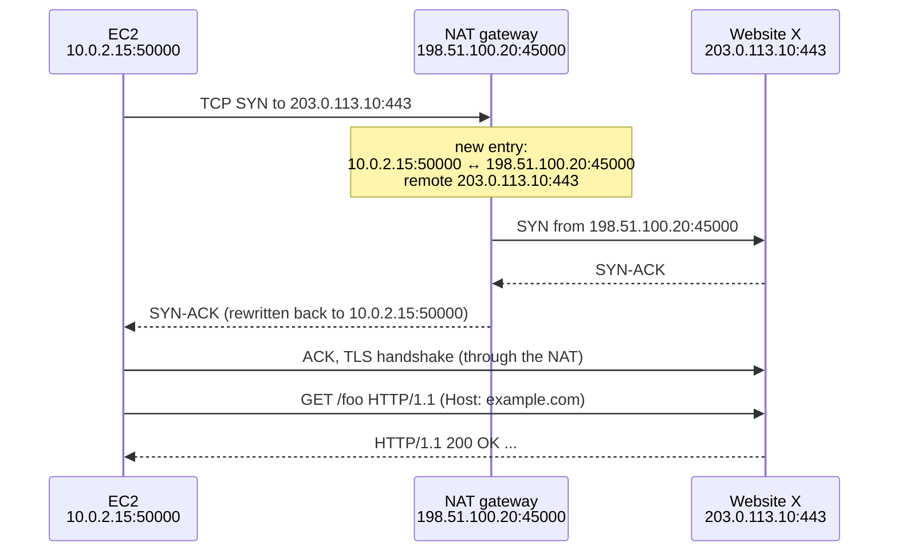
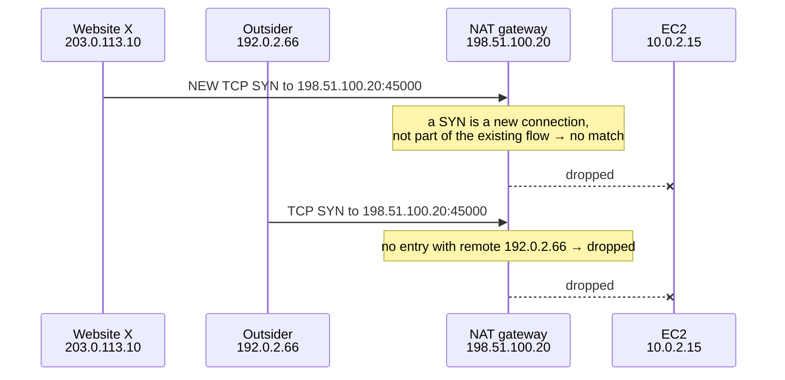
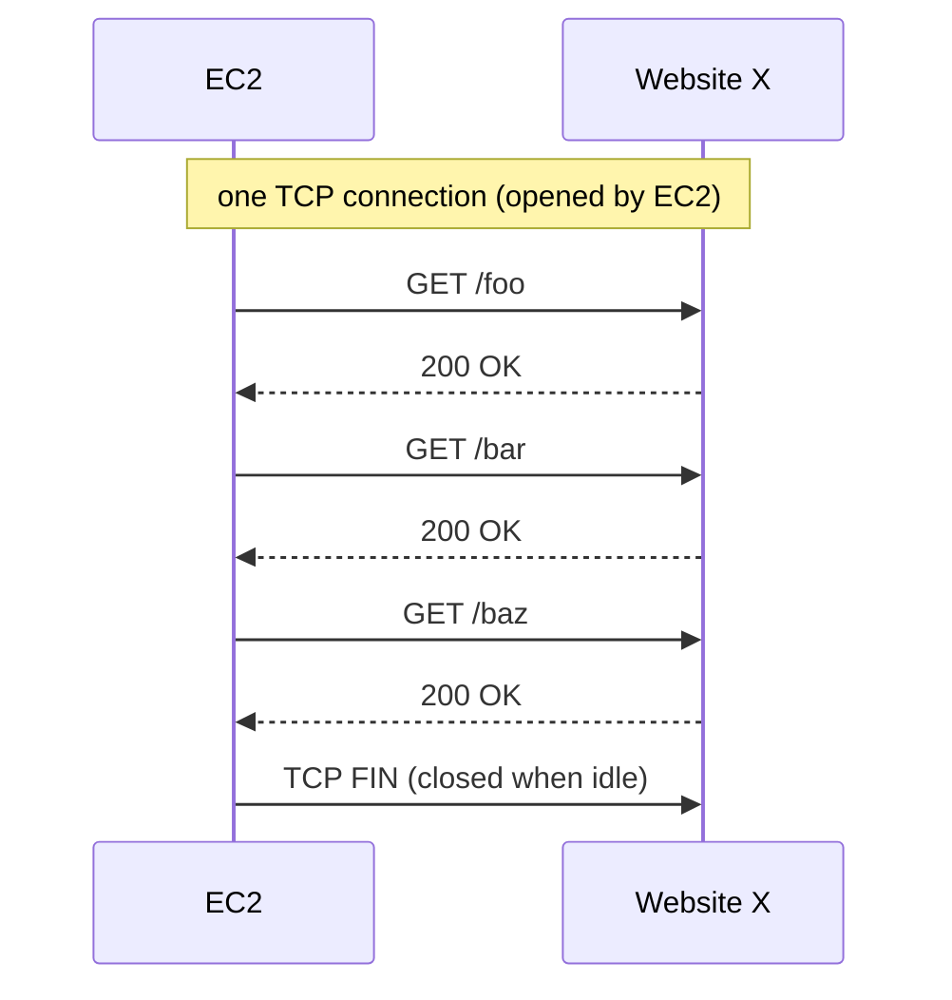
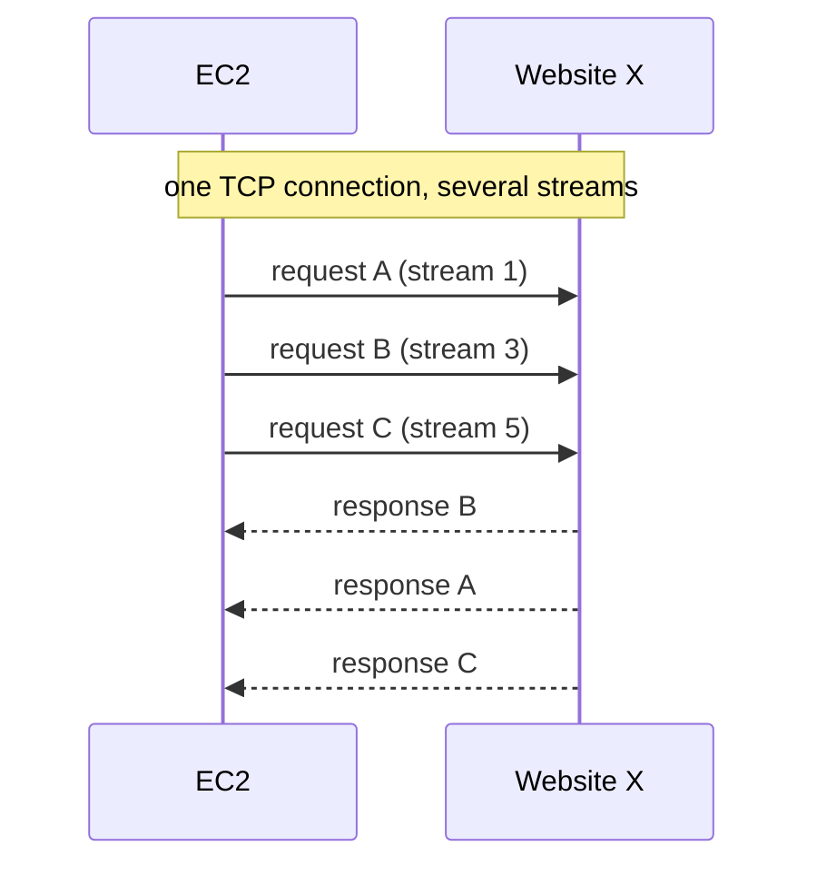
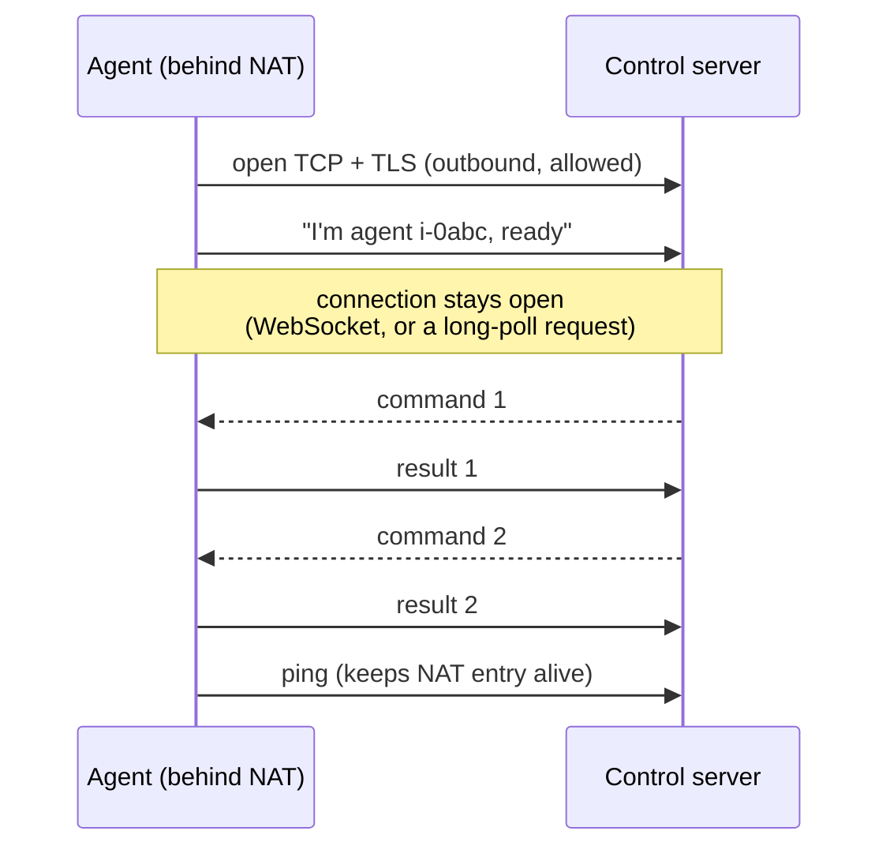
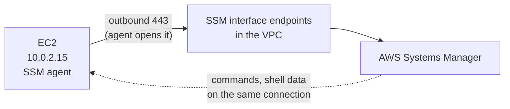

# Outbound-initiated connections

> [!abstract] In one sentence
> When a machine behind NAT **opens** a connection, the NAT lets back in **only the packets of that one flow** (same remote IP and port), for as long as the flow lives. The remote side can talk **on that connection** as much as it wants (responses, pushed messages, commands), but it can never use it to **open a new connection** inward. Agents like AWS Systems Manager rely on exactly this: they dial out once and keep the line open.

## Common misconceptions

**Wrong mental model #1:** "An HTTPS connection terminates when the response arrives. So the *next* thing the server sends (say, AWS Systems Manager sending a command to an EC2 instance behind a NAT gateway) must be a **new** HTTPS request from the server to the instance, which is inbound traffic, which NAT blocks. So how can it work?"

**What's actually true:** this mixes up two layers:
- **HTTP request/response** is an exchange of messages (application level)
- The **TCP connection** carrying them is what the NAT tracks (transport level)

An HTTP response doesn't necessarily end the TCP connection. HTTP/1.1 keeps it open for more requests by default, HTTP/2 runs many requests in parallel on one connection, and protocols like WebSocket keep it open for hours with the server sending whenever it wants. As long as the TCP connection the **inside machine opened** is alive, the remote side can send data on it. That's not a new inbound connection.

**Wrong mental model #2:** "OK, but then once my EC2 instance requested something from website X, the path is established (`10.0.2.15:50000 ↕ 198.51.100.20:45000`), so website X, or anyone, can now send any HTTP/HTTPS traffic back to that NAT port and reach my instance."

**What's actually true:** the NAT mapping isn't "public port 45000 → inside machine, for anyone". It belongs to **one specific flow**, including the **remote endpoint**:
- Packets from **website X's IP and port** that **belong to that existing connection** come back in
- A **new connection** (a new TCP SYN), even from website X itself, matches no entry → dropped
- Anything from **another IP** to port 45000 matches no entry → dropped

| Wrong mental model | What's actually true |
|---|---|
| HTTP response = end of the connection | The TCP connection can carry many requests (HTTP/1.1 keep-alive, [[HTTP2\|HTTP/2]] multiplexing) or a never-ending stream (WebSocket) |
| "Inbound traffic" = any packet coming from outside | What NAT blocks is inbound **connections** (new flows). Inbound **packets of an existing flow** are allowed: that's how every response comes back |
| The mapping opens a public port for the inside machine | The mapping is tied to the remote IP and port of the flow (on most NATs, see [[#Stage 2: website X tries to open a new connection]]) |
| A server can only answer, never "push" | It can push as much as it wants **on a connection the client opened**. It can't **dial** the client |
| Even with `Connection: close`, the server could reconnect while the mapping still exists | Once the connection is closed, the entry is removed after a short timeout. And a reconnect is a new SYN, which never matches anyway |
| Outbound-only = nobody outside can control the machine | Whoever is at the other end of an outbound channel can send it anything the client software accepts. That's how SSM works, and also how malware command-and-control works |

## Build-up: an EC2 instance behind a NAT gateway

The scenario:
- Private instance `10.0.2.15` in a private subnet
- NAT gateway with public (Elastic) IP `198.51.100.20` (see [[NAT and PAT]])
- Website X at `203.0.113.10:443`
- An unrelated outsider at `192.0.2.66`

### Stage 1: the instance makes an HTTPS request

The instance opens a TCP connection from source port `50000`. The NAT gateway rewrites the source to its own IP and picks public port `45000`:

The NAT's entry, conceptually:

| Private source | Public source | Remote destination |
|---|---|---|
| `10.0.2.15:50000` | `198.51.100.20:45000` | `203.0.113.10:443` |

The TCP connection is now `EC2 ◄═══ TCP connection ═══► website X`, with the NAT in the middle rewriting addresses in both directions.

The **response absolutely comes back through the NAT gateway**. That's allowed. But look at what happened:
- EC2 → website X: **request**
- EC2 ← website X: **response**

Website X did **not** open a new TCP connection to the instance. It sent data **on the existing connection that EC2 opened**. Every packet of the response arrives from `203.0.113.10:443` to `198.51.100.20:45000`, matches the entry, and gets rewritten to `10.0.2.15:50000`.

### Stage 2: website X tries to open a new connection

Now suppose website X receives the request and then decides to open a **new** connection to the instance:

That doesn't work, for two reasons:
- The entry **is not simply** `198.51.100.20:45000 → 10.0.2.15:50000` in the sense of "anyone can now connect to this public port". It's associated with the **whole flow**, remote endpoint included. Traffic from `203.0.113.10:443` **belonging to that established flow** can return
- An unrelated connection, like `192.0.2.66:443 → 198.51.100.20:45000`, isn't forwarded to `10.0.2.15:50000`. It's dropped

> [!info] Not every NAT is this strict
> Home routers and some NATs use **endpoint-independent filtering** ("full cone"): once the mapping exists, packets from **any** remote IP to that public port are let in. That's what makes peer-to-peer hole punching possible (see [[NAT and PAT#2. Not all NATs behave the same (and it decides whether P2P works)]]). Even then it applies mostly to **UDP**: an unsolicited TCP SYN to a port the inside machine is using as a *client* port reaches a socket that isn't listening and gets reset. Cloud NAT gateways (AWS NAT gateway included) only let back in what belongs to existing flows.

### Stage 3: the connection outlives the request

The subtle part: "the HTTPS connection terminates on the response" is the bit that's wrong. An HTTP request/response doesn't necessarily close the TCP connection underneath (details in [[HTTP]] and [[HTTP2|HTTP/2]]).

**HTTP/1.1 persistent connection:** one connection, several requests one after the other:

**HTTP/2 multiplexing:** many requests **in flight at the same time** on one connection, responses come back in any order:

So the TCP connection can stay established long after one HTTP response.

And even if the request uses `Connection: close` and the TCP connection really ends after the response (FIN in both directions), the NAT removes the entry shortly after, and the remote website **still** can't open a new inbound connection through it: a new connection is a new SYN, and new SYNs from outside never match.

### Stage 4: the server needs to talk first

Some systems need the **server** to start the conversation: "run this command", "open a shell", "here's a new job". If the client is behind NAT, the server can't dial it. The fix is always the same: **the client dials out and keeps the connection open**, then the server sends over it.

The server can send data **because the client opened the connection**. It hasn't gained arbitrary inbound connectivity to the private machine: only that agent, on that connection, speaking that protocol.

It's like a **phone call you placed**: once the other person picks up, they can talk as much as they like, but they still can't call your private extension directly.

Two common ways to keep the channel:

| Technique | How | Used by |
|---|---|---|
| **Long polling** | Client sends a request, server holds it open until it has something (or a timeout, e.g. 20 s), client immediately asks again | SSM Run Command (older agents), CI runners, SQS `ReceiveMessage` with wait time |
| **WebSocket** | An HTTP request upgraded to a full-duplex stream (see [[WebSocket]]) (`101 Switching Protocols`), stays open for hours | SSM Session Manager, chat apps, browser dashboards |
| **HTTP/2 or gRPC stream** | A long-lived stream on a multiplexed connection | Kubernetes konnectivity, many modern agents |
| **MQTT** over TLS | Persistent connection to a broker, server publishes to the device's topic | IoT devices (see [[MQTT]]) |

### Stage 5: keeping the channel alive

A NAT entry isn't forever. If the connection is **idle** too long, the NAT forgets it:
- AWS NAT gateway: **350 seconds** idle timeout for TCP, then it drops the entry (the next packet gets a RST)
- Home routers and firewalls: often a few minutes to hours for TCP, ~30–120 s for UDP

So agents send **keepalives** (an application ping every 30–60 s, or TCP keepalives) and **reconnect** automatically when the connection breaks. A reconnect is just a new outbound connection, which the NAT happily allows.

## The pattern is everywhere

| System | What dials out | Over what |
|---|---|---|
| AWS Systems Manager agent | The instance → SSM endpoints (443) | Long polling + WebSocket (see [[Systems Manager]]) |
| Self-hosted CI runners (GitHub Actions, GitLab) | The runner → the CI service | Long polling for jobs |
| Cloudflare Tunnel, ngrok, Tailscale relays | The connector → the provider's edge | Persistent TLS / QUIC. Public traffic is then sent **down** the tunnel |
| Kubernetes konnectivity agent | Nodes → the control plane | gRPC stream, so the API server can reach kubelets behind NAT |
| IoT devices | Device → broker | MQTT, WebSocket |
| Malware command-and-control | Infected host → attacker's server | HTTPS / DNS beacons |

The last row is the security lesson: "**only outbound allowed**" stops unsolicited inbound connections, but anything inside can still open a channel that lets an outside party control it. That's why egress control (what is allowed to connect out, to where) matters too (see [[Proxies]]).

## In AWS

To reach private instances without opening anything inbound, I use the [[Systems Manager]] agent:
- Through a **NAT gateway**: the agent's outbound HTTPS goes through the NAT, Systems Manager answers over that connection
- Through **VPC interface endpoints** for `ssm`, `ssmmessages` and `ec2messages`: the same outbound connections go to private IPs inside the VPC, and **no internet path is needed at all**, not even a NAT gateway

No inbound rule in the [[Security groups|security group]], no public IP, no port 22: the instance only needs to reach port 443 of the endpoints.

## Practice

> [!example]- A private EC2 instance downloaded a file from 203.0.113.10. Can 203.0.113.10 now SSH into it through the NAT gateway?
> No. SSH would be a new TCP connection (a SYN to the NAT's IP), which matches no entry. Only packets belonging to the existing download connection come back.

> [!example]- If the server can't connect to the agent, how does Systems Manager send a command to an instance in a private subnet?
> The agent opened an outbound connection (long-poll or WebSocket) to Systems Manager and keeps it open. The command travels down that existing connection.

> [!example]- Does an HTTP response close the TCP connection?
> Not necessarily. HTTP/1.1 keeps it open by default for more requests, HTTP/2 multiplexes many requests on it, and WebSocket turns it into a long-lived two-way channel. Only `Connection: close` (or an idle timeout) ends it.

> [!example]- An agent behind a NAT gateway loses its connection to the server every ~6 minutes when nothing happens. Why?
> The NAT gateway's 350-second idle timeout removed the entry. The agent needs keepalives more often than that, and automatic reconnect.

> [!example]- "Our servers only allow outbound connections, so nobody outside can control them." What's wrong with that?
> Any software inside can dial out and accept commands over that connection: management agents (by design) and malware (by abuse). Egress filtering is needed too.

## Easy to get wrong
- Treating "response" and "new inbound connection" as the same thing: the response travels on the connection the client opened
- Thinking an HTTP response ends the TCP connection (HTTP/1.1 keep-alive, HTTP/2, WebSocket)
- Believing a NAT mapping opens a public port for anyone: on cloud NATs it's tied to the remote endpoint of that flow
- Expecting a server to "call back" a client behind NAT: the client must keep a connection open
- Forgetting idle timeouts: long-lived channels need keepalives (AWS NAT gateway: 350 s)
- Concluding "outbound only = safe from remote control"
- Thinking a private instance needs a NAT gateway for SSM: VPC interface endpoints are enough

## Related
- Depends on:: [[NAT and PAT]], [[Network layers]], *[[TCP and UDP]]*
- Protocols that keep connections open:: [[HTTP]], [[HTTP2]], [[WebSocket]], [[MQTT]]
- The 5-tuple and ports:: [[Sockets]]
- Firewall side of the same idea:: [[ACL]], [[Security groups]]
- Egress control:: [[Proxies]]
- AWS:: [[Systems Manager]], [[VPC]], [[Bastion host]]

## Flashcards
#flashcards

What does a NAT let back in for a connection an inside machine opened? :: Only packets belonging to that flow (same remote IP and port), while the flow lives
Can the remote server of an outbound connection open a new connection back through the NAT? :: No. A new connection is a new SYN, which matches no NAT entry
Is the NAT mapping "public port → inside machine for anyone"? :: No (on strict NATs like cloud NAT gateways). It's tied to the remote endpoint of the flow
Does an HTTP response close the TCP connection? :: Not necessarily: HTTP/1.1 keeps it alive by default, HTTP/2 multiplexes, WebSocket keeps it open
How can a server send commands to an agent behind NAT? :: The agent opens an outbound connection (long-poll or WebSocket) and keeps it open. The server sends on it
What is long polling? :: The client sends a request that the server holds open until it has data or times out, then the client asks again
What is the AWS NAT gateway TCP idle timeout? :: 350 seconds
Why do agents send keepalives? :: So the NAT (and firewalls) don't drop the idle connection's entry
Why is "outbound only" not enough to prevent remote control? :: Software inside can dial out and accept commands on that connection (agents by design, malware by abuse)
How can a private instance reach Systems Manager with no NAT gateway? :: VPC interface endpoints for ssm, ssmmessages and ec2messages
