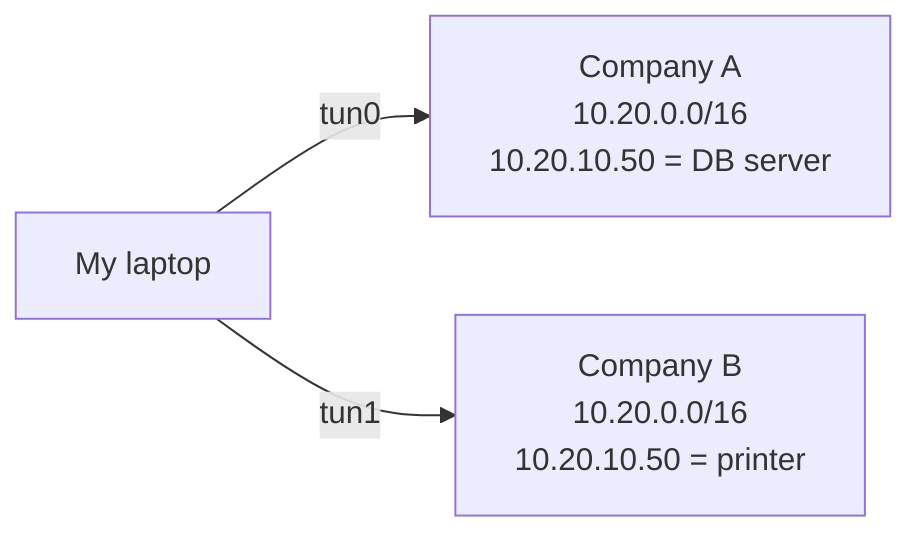

# Overlapping address spaces

> [!abstract] In one sentence
> When two networks use the **same private IP range**, an address like `10.20.10.50` no longer says **which** network it belongs to, so routing alone can't reach both. Something else has to tell them apart (source, mark, separate routing domain), or one side has to be **translated** or **renumbered**.

## Why it happens

Private ranges (RFC 1918) are free for anyone to use, so everybody uses the same few:

| Range | Size | Who loves it |
|---|---|---|
| `10.0.0.0/8` | 16.7 M addresses | Companies, cloud VPCs (AWS default VPC is `172.31.0.0/16`, tutorials use `10.0.0.0/16`) |
| `172.16.0.0/12` | 1 M | Docker (`172.17.0.0/16`), AWS default VPC |
| `192.168.0.0/16` | 65 k | Home routers (`192.168.0.0/24`, `192.168.1.0/24`) |

Collisions are guaranteed sooner or later:
- A consultant connects to **two customers' VPNs**, both using `10.20.0.0/16`
- Two companies **merge** and both used `10.0.0.0/8`
- My home Wi-Fi is `192.168.1.0/24` and so is a subnet at the office
- Two AWS VPCs were both created as `10.0.0.0/16`, and now they need to talk
- Docker's `172.17.0.0/16` collides with a corporate range

## Why routing can't fix it by itself

An IP address only means something **inside one routing domain**. Nothing in the packet says "company A's `10.20.10.50`".



With both routes in one table (see [[Routing tables]]):

| Trick | What it actually does | Solves it? |
|---|---|---|
| **Metrics** (`tun0 metric 100`, `tun1 metric 200`) | All `10.20.x.x` traffic goes to the lower metric | ❌ Company B is unreachable, as long as A is connected |
| **More specific routes** (`10.20.10.0/24 → tun1`) | Splits the range between the two | ⚠️ Only if the hosts I need on each side are in **different** subnets. Same IP on both sides → still impossible |
| Both routes, "the VPN will figure it out" | Nothing like this exists. The kernel picks one route per packet | ❌ |

The system needs **extra information** that isn't the destination.

## The real solutions

### 1. Separate routing domains, picked by something else

The packet carries (or is given) something that identifies the domain, and [[Policy-based routing]] uses it to pick a table:

| Distinguisher | How | Good for |
|---|---|---|
| **Source address** | `ip rule add from 10.98.0.0/24 lookup vpn2` | A router where different LANs belong to different VPNs |
| **Firewall mark** | nftables marks by port/app/cgroup → `ip rule add fwmark …` | Per-application choice on one machine |
| **User** | `ip rule add uidrange 1001-1001 lookup vpn2` | "This Linux user only sees company B" |
| **Bound interface** | App binds to `tun1` (`curl --interface tun1`) → `oif` rule | One-off tools |
| **Network namespace** | Run company B's VPN and tools in `ip netns exec vpnb …` | Clean, total separation on one laptop |
| **VRF** | Interfaces assigned to separate VRFs | Routers and service providers carrying many customers |

Limitation: each **application** can still only talk to one `10.20.10.50` at a time, because it's chosen by which domain the app lives in.

### 2. NAT: make the addresses different

Translate one side into a range that doesn't collide. **1:1 NAT / NETMAP** maps a whole prefix onto another one, keeping the host part:

```
Company B real:        10.20.10.50
Seen from my side as:  10.120.10.50   (10.20.0.0/16 ↔ 10.120.0.0/16)
```

```bash
# on the gateway that holds the tunnel to company B: "10.120.x.y" means company B's "10.20.x.y"
iptables -t nat -A PREROUTING -d 10.120.0.0/16 -j NETMAP --to 10.20.0.0/16
ip route add 10.20.0.0/16 dev tun1               # this gateway only knows company B's 10.20
# my other machines just route 10.120.0.0/16 to that gateway, and 10.20.0.0/16 to company A
# nftables equivalent: dnat ip prefix to ip daddr map { 10.120.0.0/16 : 10.20.0.0/16 }
```

(For traffic from apps on the gateway itself, the same rule goes in the `OUTPUT` chain instead of `PREROUTING`.)

- Now `10.20.10.50` = company A and `10.120.10.50` = company B. Normal routing works again
- Often done by the **VPN gateway** on either side, so the other side sees a "fake" but unique range
- Downsides: DNS returns the **real** (colliding) IPs, so it needs rewriting ("DNS doctoring"). Protocols that put IPs inside the payload (SIP, FTP, some licensing tools) break. Logs show translated addresses, which makes debugging harder

### 3. Don't route at all: expose services, not networks

Instead of joining two networks, publish only the one service that's needed:
- **AWS PrivateLink**: the provider puts a service behind an NLB, the consumer gets an **interface endpoint with an IP in its own VPC**. Works with **overlapping** CIDRs because no routes are exchanged
- **Reverse proxy / API gateway** in the middle
- **Application-level tunnels**: SSH port forwarding, Tailscale / zero-trust access proxies that route by **name**, not by IP

### 4. Renumber (the real fix)

Change one network's range. Painful (every server, firewall rule, DNS record, config file), but it's the only fix without permanent workarounds. Best moment: **before** building, with an **IP address plan** (in AWS: VPC IPAM).

### 5. IPv6

Global IPv6 addresses (or unique ULA prefixes `fd00::/8` with a random 40-bit ID) are practically never reused, so overlaps mostly disappear.

## The home-network clash (very common)

The office VPN pushes `192.168.1.0/24 → tun0`, but my home LAN is also `192.168.1.0/24`:

- Both are `/24`, same prefix → the metric decides, and either the office or my own router/printer becomes unreachable
- If the office pushes the broader `192.168.0.0/16`, my home `/24` (more specific) wins → the office hosts in `192.168.1.x` are unreachable
- Worst case: my **default gateway** `192.168.1.1` suddenly routes into the tunnel and the whole connection dies

Fixes, from quick to proper: change the home router's LAN to something unusual (`192.168.77.0/24`, `10.183.0.0/24`), or the company uses NAT on the VPN or picks an unusual range for VPN-reachable networks.

## In AWS

| Feature | Overlapping CIDRs allowed? |
|---|---|
| **VPC peering** | ❌ Refused at creation |
| **Transit gateway** | Attachment works, but a TGW route table can't send the same prefix to two places. Needs NAT or separate route tables |
| **Site-to-Site VPN** | Overlap with on-prem = the VPC route table sees the same prefix twice. The `local` route wins for the VPC's own CIDR |
| **PrivateLink** | ✅ Works, no routing between the VPCs |
| **Private NAT gateway** | ✅ Translates a VPC's overlapping range into a unique "routable" range before it goes to the TGW/VPN |
| **VPC Lattice** | ✅ Service-to-service, IPs don't need to be unique |

→ Plan non-overlapping CIDRs for every VPC and on-prem site from day one (see [[VPC]], [[Connecting VPCs]]).

## Easy to get wrong
- Thinking a **metric** lets me reach both networks. It only picks one
- Forgetting **DNS**: after NAT, names still resolve to the real (colliding) IPs
- Using `10.0.0.0/16` or `192.168.1.0/24` for everything "because the tutorial did"
- Assuming the VPN software handles it. It can only install routes and rules. See "who is in charge" in [[Policy-based routing]]

## Related
- NAT itself:: [[NAT and PAT]]
- Depends on:: [[Routing tables]], [[Policy-based routing]]
- Shows up with:: [[VPN]], [[Connecting VPCs]]
- Similar to:: two streets called "Main Street" in two different towns: the house number alone isn't enough, you need the town (the routing domain)

## Flashcards
#flashcards

Why can't routing alone handle two networks using 10.20.0.0/16? :: An IP address doesn't say which network it belongs to, and the kernel picks one route per packet
Two VPNs push the same prefix with different metrics. Result? :: All traffic goes to the lower metric. The other network is unreachable
Name four ways to tell overlapping networks apart on one machine :: Source address, firewall mark, user (uidrange), network namespace (or VRF on routers)
What is 1:1 NAT / NETMAP? :: Translating a whole prefix onto another one, keeping the host part (10.20.10.50 ↔ 10.120.10.50)
Main downside of NAT for overlaps? :: DNS still returns the real colliding IPs, and IPs inside payloads break
Why does AWS PrivateLink work with overlapping CIDRs? :: No routes are exchanged. The consumer gets an endpoint IP inside its own VPC
Does AWS VPC peering allow overlapping CIDRs? :: No, it's refused
Which AWS feature translates an overlapping VPC range before it goes to a TGW? :: A private NAT gateway
Home LAN is 192.168.1.0/24 and the VPN pushes 192.168.0.0/16. What breaks? :: Office hosts in 192.168.1.x are unreachable, because the home /24 is more specific
The only complete fix for overlaps? :: Renumbering (with a proper IP address plan), or IPv6
